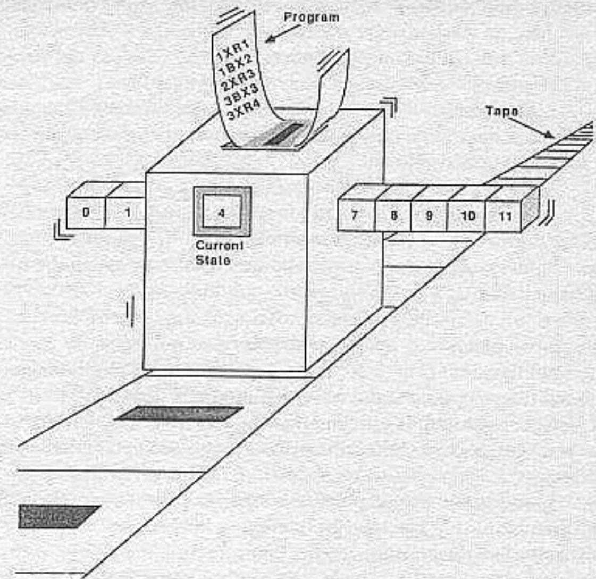
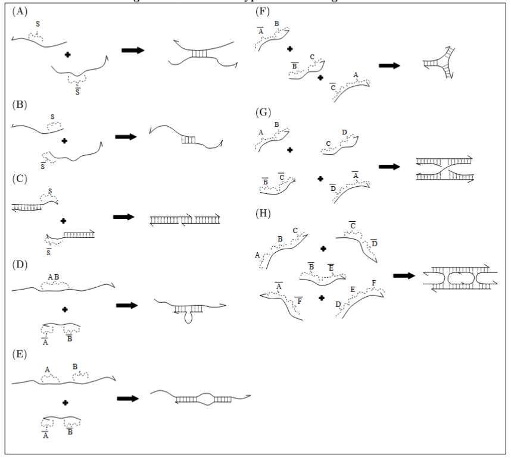

# 一、文章简介

1. 所属期刊

2. 作者简介

   Daniel E Rozen，莱顿大学副教授，生物研究、微生物科学家。

# 二、文章内容

## 1、引言

The demonstration that DNA molecules can act as parallel processors to solve hard problems has excited interest in the possibility of developing molecular computers based on recombinant DNA techniques.

[DNA分子](#DNA分子)可以作为并行处理器来解决难题，这一证明激发了人们对基于 DNA 重组技术开发分子计算机可能性的兴趣。

**信息点 1：**DNA分子可以充当[并行处理器](#并行处理器)来解决难题的证明

- 主要是DNA分子可以用来解决计算难题

**信息点 2：**激发了人们对开发基于[重组DNA技术](#重组DNA技术)的[分子计算机](#分子计算机)的可能性的兴趣。

- 主要是DNA分子可以作为分子计算机

## 2、正文

**正文分为了两个方向说明：**

- 1、第一部分：使用分子生物学技术来解决计算上 “困难” 的问题
- 2、第二部分：开发分子计算机（DNA作为图灵机）

### 第一部分

**提出一个问题：**

- 在[DNA序列中编码蛋白质](#DNA序列中编码蛋白质)功能的算法有简明性，且生物有机体有强大的灵活性和适应性

- 计算机具有非凡的信息存储能力和解决问题的速度

- 自然地想到将二者结合起来：

  

  

  - [神经网络](#神经网络)、[遗传算法](#遗传算法)和[细胞自动机](#细胞自动机)都已经在计算机中展现生物系统的优势
  - 但是，在生物体中实现计算机的计算速度仍然是无法实现的，即使机器代码的二进制逻辑表面上与碱基配对的四元逻辑相似

**问题的解决：**

**并行计算与哈密顿路径**

- 1994年末， Leonard Adleman发表了一篇论文[1]（Molecular Computation of Solutions to Combinatorial Problems，组合问题解的分子计算），他展示了一个利用分子生物学工具来解决有向哈密顿路径问题的实例，其任务是通过一个有向图找到一条路径，该路径在定义的节点开始和结束，并且访问每个节点一次。证明了在分子水平上进行计算的可行性。
- 对于一个非完全有向图：设计算法判断图G是否存在哈密顿路径，如果存在，输出一条哈密顿路径

在每个节点之间的许多可能的路径中，从0开始，到6结束，唯一正确地解决哈密顿路径问题的是：0→1→2→3→4→5→6。也就是由边0→1、1→2、2→3、3→4、4→5、5→6组成。

如果将指定顶点改为 vin = 3 和 vout = 5，也不会有哈密顿路径，因为没有边进入顶点 0。  

- 传统计算机虽然能很容易地在有限的步骤中顺序推导出答案，但是当要求对数十亿个可能的答案进行[数据采样和重新采样](#数据采样和重新采样)时，它们就会变得极其缓慢

  

  

- 相比之下，分子可以在仅受[扩散限制](#扩散限制)的时间范围内，从极其复杂的混合物中挑选出[相容的化学表面](#相容的化学表面)

- 也就是说，对传统计算机来说的大规模计算问题， 在 “分子计算机”中，如果进行适当编码，就可能实现并行地执行数十亿个计算操作

**实验综述：**

1、Adleman使用一些分子生物学的基本工具来确定一条七节点哈密顿路径：[寡核苷酸](#寡核苷酸)、[聚合酶链反应(PCR)](#PCR)

2、**如何用DNA分子表示每个节点和路径：**每个节点由一个随机的20个碱基的DNA寡核苷酸表示，对于图中的每一条边 i->j，都创建了一个寡核苷酸 Oi->j，它是 Oi 的 3' 到Oj的 5'的各10个碱基表示 。而Oj的补体作为Oi->j和Oj->k的夹板，将二者连接起来这种贯穿整个图的 “夹合” 允许对哈密顿路径问题的正确解决方案进行双链DNA编码。

同时，这种结构保留了边的方向，如O0->1不会与O1->0相同

Adleman的实验步骤分为以下5步：

- 步骤 1：在图中随机生成路径。
- 步骤 2：只保留以开始节点开始、以结束结束的路径。
- 步骤 3：如果图有 n 个顶点，则只保留恰好进入 n 个顶点的路径。
- 步骤 4：只保留至少进入图中所有顶点一次的路径。
- 步骤 5：如果有路径保留下来，则说 "是"；否则说 "否"。

**实验过程：**

- 第1步：明确了节点与路径如何使用DNA分子进行表示之后，将所有的节点和路径寡核苷酸混合在一起，进行连接反应然后[退火](#退火)，形成不同长度的双链dna。每个双链DNA片段勾勒出一条特定的路径(不一定是哈密顿的)。

- 第2步：在以上进行连接反应后的双链DNA中，以节点0为开始节点、节点6为结束节点的路径才是哈密顿路径的解，因此，首先需要分离出以顶点 0 开始、以顶点 6 结束的路径的分子。
  - 用聚合酶链式反应（PCR）扩增了第 1 步的产物，扩增时使用了O0 和 ¬O6作为引物。因此，只扩增了编码以顶点 0 开始、以顶点 6 结束的路径的分子。

- 第3步：由于选择的路径应该包含所有的节点。一个核酸分子的总电荷与核苷酸的总数或它的质量成正比， 也就是说，它们在凝胶电泳中的迁移率主要取决于其大小。只有至少与所有节点串在一起的寡核苷酸才能从[琼脂糖凝胶电泳](#琼脂糖凝胶电泳)中洗脱出来。

  - 在凝胶上切除 140 碱基对条带（对应于编码恰好进入 7 个顶点的路径的双链 DNA），并浸泡在双蒸水 H20（ddH2O）中提取 DNA 。对该产物进行 PCR 扩增，并多次凝胶化以提高其纯度。

  

- 第4步：由于哈密顿路径应该包含每个节点，所以依次用每个不同节点的互补寡核苷酸进行测试。Adleman文中使用[生物素-亲和素磁珠系统](#生物素-亲和素磁珠系统)对步骤 3 的产物进行亲和纯化。首先从步骤 3 的双链 DNA 产物生成单链 DNA，然后将单链 DNA 与 “与磁珠结合的 O1” 混合。只有那些包含序列 O1 的补体的单链 DNA 分子能与  O1 退火并被保留。其他节点也同理。

- 最后保留下来的路径为哈密顿路径

**新的问题：**

- Adleman的实验使用的方法对于解决更大的问题可能是不切实际的。

- Lineal和Lineal[2]：随着顶点数量的增加，解决哈密顿通路问题的复杂性呈指数级增加。对于长度为20的节点，一个“n”节点通路将需要大约20n(logn)n个碱基对的输入。例如，比Adleman的路径大一个数量级 (70个节点) 的路径将需要“实验中涉及的核苷酸的总质量达到1025公斤DNA

- Stemmer[3]：即使使用递归方法来减少所需的DNA数量，也可能会牺牲溶液的准确性，其他资源也有限

- Lo, Yiu和Wong[4]：25个节点的路径需要大量的酶，并且不可能通过琼脂糖凝胶电泳进行分析

- 易出错的生物学和无差错计算之间固有的不协调[5]：

  

  - 使用PCR再生路径存在潜在的困难，因为扩增中使用的[DNA聚合酶的保真度](#DNA聚合酶的保真度)不是绝对的。同样，引物和路径退火强烈依赖于反应条件，如温度、pH值和反应体积，这些条件可能因实验而异

    

  - 这些缺陷可能会导致PCR[伪影](#伪影)，并且这种伪影可能会超过并模糊真实答案

  - 最后，该系统被限制为相当短的序列，因为随着序列长度的增加，获得成功退火所需的时间也在增加。特别是这种限制，规避了大量分子并行性的固有优势

**Aldeman[6]的回应：**

- 尽管分子计算机目前在应用上是有限的，但它们仍处于 “胚胎” 阶段
- 随着该领域从概念化转向工程实践，研究人员必须开始解决一些重要问题：
  - 首先，分子计算机最能回答哪些问题？
    - 在Adleman的实验中，对于传统计算机而言，遍历这个有向图并验证哈密顿路径是指数级的，但DNA分子通过PCR扩增之后，进行连接反应时，相当于极多传统计算机同时进行计算，具有并行性
  - 第二，在分子生物学家使用的众多工具中，哪一个最能促进分子计算?
  - 第三，怎样才能最好地设计分子计算机的结构?

**第一个问题的解决：**

Richard Lipton 指出：

- Adleman解决的问题是那些需要暴力地列举或判定所有可能的答案的计算问题[1]，所解决的哈密顿路径问题是一个[NP完全问题](#P、NP、NPC、NPH问题)；也就是说，所有 [NP问题](#P、NP、NPC、NPH问题)都可以被归纳为这个问题。传统计算机在NP-完全问题时不存在通用的高效方案。阿德尔曼关于哈密顿可以通过基于 DNA 的生物实验来解决的结果令人振奋，但他使用了一种 “蛮力” 的方法。Adleman通过暴力算法的效率实在是太低了，且具有通用性上的限制。
- DNA计算的优势在于基于 DNA 的计算所固有的巨大并行性。与传统的电子计算机相比，它有可能大大加快解决这类搜索问题的速度。
- 任何计算机的速度，不管是不是生物计算机，都由两个因素决定：(i) 它有多少个并行进程；(ii) 每个进程在单位时间内可以执行多少步。对于生物系统来说，第一个因素可能非常大：只要 3 克水就包含约 1022 个分子。因此，生物逻辑运算的并行性有可能远远超过传统计算机。

Lipton通过以下实验对Adleman的方法进行扩展，使生物计算机能够从根本上改变我们进行所有计算的方式。

- Richard Lipton 遵循Adleman实验的路径，提出了一系列基于dna计算的实验来解决计算机科学中的可满足性（Propositional Satisfiability，[SAT](#SAT)） 问题。SAT问题是目前研究最为广泛的一类 约束可满足性（Constraint Satisfaction Problem，[CSP](#CSP)） 问题，问题的目的是找到 “与或函数方程”（AND and OR functions）的解[7]。
  - Lipton以 **F = ( x OR y ) AND ( ¬x OR ¬y )** 为例
  
  - 变量 x 和 y 假设布尔值为 0 或 1（“假”或“真”）；¬x 和 ¬y 分别是 x 和 y 取反，因此当 x 为 0 时，¬x 为 1，反之亦然。问题是找到 x 和 y 的值，使整个命题F为真
  
  - Lipton构造节点和路径的方法本质上和Adleman是一样的。为了解决这个问题，Lipton提出用寡核苷酸编码二进制数字。让可满足性问题的每一可行解对应一个n位二进制数，在这里就是两位，通过构造网络Gn，将n位二进制数据池对应成网络Gn的从起点 a1到终点an+1的有向路。Adleman本质上是将寡核苷酸任意命名为节点或路线，而Lipton的方案允许对SAT问题的每个答案进行直接编码
  
    
  
  - 该图还有一个重要特性。所有路径都 "相似"：每条路径的不同之处仅在于在特定阶段是向 "左 "还是向 "右"。不认为某些路径比其他路径更有可能出现
  
  - 这种差异类似于具有符号结构的计算机语言与0和1的机器语言之间的差异
  
- Lipton在概念上的进步可能允许直接从寡核苷酸混合物中提取SAT问题的解决方案。例如，对于上面的方程，将构建一系列寡核苷酸，其中一个位置的 x 值与另一个位置的 y 值相结合。

  - 首先，原始混合物中有四种不同的寡核苷酸，其序列对应于值(0,0)，(0,1)，(1,0）和（1,1)。

  - Lipton定义了一个符号

    
  
  - 为了满足SAT问题的第一条，将首先使用适当的互补寡核苷酸提取那些具有x=1或y=1的寡核苷酸。提取的寡核苷酸将包括编码值为（0,1)、(1,0）和（1,1）的寡核苷酸。
  
  - 从这个集合中，提取那些满足SAT问题第二条的寡核苷酸 ¬x=1或 ¬y=1的序列。最终选择的集合将只包括编码值为 ( 0,1 ) 和 ( 1,0 ) 的寡核苷酸。
  
  - 这些是这个特定SAT问题的正确答案。更一般地说，答案取决于特定DNA位置上特定DNA编码是否存在。因此，在构造了所有可能的编码路径池之后，就可以简单地提取出符合方程条件的序列
  
  
  
- 与哈密顿路径问题一样，计算机需要通过迭代地搜索大量可能的答案来解决SAT问题，相比之下，分子计算机的大规模并行特性可能会加速这类问题的解决。

  - 传统计算机解决SAT的最佳方法需要测试2n个可能的解决方案，其中n是变量的数量 （每个变量都有两种可能{0，1} --> 2n ） 
  - 相比之下，分子计算机的这些运算随着m（子句个数）的增加呈线性 ( 而不是指数 ) 增长
  
- 尽管DNA计算机还没有解决真正的SAT问题，但这一概念上的突破可以让解集呈指数级扩展的问题 ( “np完全” 问题 ) 得到尝试

  - 例如，Lipton及其同事[8]提出了一种“破解”数据加密标准的方案，该标准是银行和军事保密代码的算法基础，该方案依赖于这样一个事实，即通过传统计算方法破解np完全问题需要的计算资源太大而不实用。
  
- 当然，Lipton的实验仍然面临着现实世界中那些同样限制了Adleman实验的困难

### 第二部分

**DNA作为图灵机**

**提出新的问题：**

- Adleman和Lipton的 “计算机” 在传统意义上都不是可编程的，因为它们不能解决任何存在可编程算法的问题[9]。
- 虽然为解决一个哈密顿路径问题产生的DNA寡核苷酸可以潜在地用于解决类似的哈密顿路径问题，但是它们的通用性存在限制。从某种意义上说，它是一次性的，针对某一类特定问题，通过实验推导出特定的组合解。
- 如何扩展比特和碱基之间的等价性？

**问题的解决：**

为了构建通用分子计算机，必须用化学来表达某些通用计算模型（如数字计算机、神经网络、图灵机等）。

DNA作为图灵机

- 图灵机：
  - 图灵机是最简单的可编程通用计算模型，可以用三个基本组件来描述：
    - 无限信息磁带
    - 访问(读写)磁带的磁头（head）
    - 以及根据转换表 (Program、transition) 做出确定性决策的控制器
  - 磁带本质上是一系列存储位，每个存储表示一组定义的符号的单个信息
  - 磁头每次位于一个内存位置上，读取内存位置中的内容，根据读取的symbol和控制器中的state，二者结合，决定下一步要干什么（是否更改state、是否更改bit、是否左右移动）
  - 可以这样理解：计算分步进行，在每一步中，根据给定的规则表将整个磁带转换为新磁带
  - 控制器中的一个特殊单元包含机器的状态，即集合 Q = {q0, ... , qp} 的一个元素。
  - 转换表的三要素：字符集(symbol)、状态集(state)、操作。可以理解为：转换表 就是Program

**几种可能的实现：**

特定的限制性酶切位点围绕着一个二进制编码的寡聚物，可以用适当的限制性酶切除，然后用一个含有互补的粘性末端和一个改变的内部二进制单元的片段来代替。

**DNA encoding binary unit 0/1：**DNA编码二进制单元，也就是这段DNA被编码为二进制的0或1

**Replacement bit encoding binary unit 0 ：**替换位编码二进制单元，利用酶切将红色这一段替换为黑色这一段就实现编码

**BamH1、EcoR1：**常见的[限制性核酸内切酶](#限制性核酸内切酶)

**site：**酶切位点

- Beaver[10]指出：文本的识别、删除和插入可以通过DNA[定点突变](#定点突变)来实现

  - 实验一：文本的识别、删除、插入

    
    
    

    - 设A、B、X和Y为字符串，L和R分别为发生置换的链M左右两端的序列。记L-R为M
    - 为了实现AXB->AYB取代，首先以R为引物，将单链AYB和R退火至M。用DNA聚合酶和连接酶复制M的其余部分，从而将缺口封住。(R片段用作聚合酶的起始点。)
    - 结果是一个不完全配对的双链分子，其中一条是原始M，另一条M是在Y取代X后M的补体。
    - 然后以L为引物，与L混合并使用DNA聚合酶复制M。得到的双链分子在新合成的链上含有M，用Y取代了X。
    - 在哈密顿路径中的应用：在形成代表候选路径的多个分子后，通过在每个出现的 vi 处插入一个 20 个碱基的填充物，只选择那些仅增加20个碱基的DNA分子，从而消除那些两次访问节点 vi 的分子。

- Rothemund[9]：《A DNA and restriction enzyme implementation of Turing Machines》

  - 图灵机的DNA和限制酶实现 --> 用 DNA 和限制酶实现图灵机

  - 提出了一种用 DNA 寡核苷酸编码图灵机转换表的方法

  - 提出：把图灵机模型分为可变元素和不变元素。模型中的可变元素，即磁头位置、状态和磁带(磁带内容)，合在一起称为图灵机的瞬时描述或 ID。模型的不变，即转换表，称为模型的机器部分。

  - 以这种方式划分的图灵机模型，可以让我们把机器想象成一个算子（也就是可变元素是从某一个时刻变到下一个时刻的），它在 T 时刻作用于一个 ID，并在 T+l 时刻产生一个新的 ID 。这就是图灵机的形象，它指导着[9]给出的图灵机 DNA 实现。

  - 例子：BB-3，忙碌海狸机

    

  - 用限制性核酸内切酶实现插入与删除操作 ( II类 ) 

  

  - 使用 II类限制性核酸内切酶会出现的问题
  
    - 问题1：每种限制性内切酶都有一个独特的粘性末端。如果一个图灵机的每一个编码都用一个可插入的寡核苷酸来表示，那么我们必须使用一个独特的粘性末端来表示这个状态，因此对于转换表中的每个条目都必须对应一个限制性酶。即需要很多种不同的限制性酶和许多多重消化来实现每次转换。
  
    - 问题2：回文序列会出现的问题：回文限制位点产生的副反应大大增加了寡核苷酸的浪费
  
      - A：载体自连接
  
      - B、C：串联体
  
    - 问题3：限制性位点的再生（酶切后酶切位点依然存在）
  
    
  
  - 改进：使用 lIS 限制性核酸内切酶（II类的亚类）
  
    - IIS会远离其限制性位点进行切割，这些限制性核酸内切酶也称为非回文或不对称限制性酶。 IIS 类限制酶的不对称性允许发生以下新反应
  
    -  IIS 类酶会从一段任意 DNA 中切掉其识别位点
  
    - 举例：
  
      
  
    - 于是，每一种酶可以产生不同的粘性末端，这解决了上述“一端一酶”问题，但仍可能形成多联体并且操作后限制位点仍然存在
    
    - 可达到的新操作
    
      - 所以可以通过方向控制插入、替换、删除 DNA 片段
    
      - 可以使用一对方向相反的 lIS 类酶切位点来制备来自不同序列的两个悬臂，只要两个酶切位点的粘性末端不互补，就可以解决问题2
    
      - 并且，这样的悬臂可以在质粒中切除这个酶切位点，且不会再生，就解决了问题3
      
        
      
      - “前进” 操作：
      
        
  
  - 图灵机的实现（A DNA Schematic for the BB-3 TM）：
  
    - 可变元素：磁头、状态、磁带 --> 用单个环形DNA分子表示
  
      
  
    - TM 的瞬时描述：磁带上有字符串 WBW，磁头指向 B 符号，机器处于状态 q1。
    
      - **字符（磁带内容）：**用两个不同的 DNA 序列来表示符号 W 和 B。每个序列又分为左半部分和右半部分。在每个符号的左边附加了一个标为 L 的短序列，在右边附加了一个标为 R 的短序列。由于这些序列在两个带 W 符号中都是相同的，因此被称为左右不变序列。
    
      - **磁头：**图中标有 Inv 和 q1 的两个背靠背非对称限制点代表图灵机的头部。标有状态的限制点总是指向当前符号，而 Inv 总是指向相邻的不变序列。
    
      - **状态：**设计了 “状态寡核苷酸”，标记为 q1 的识别位点与当前符号之间的间距编码了这台图灵机的状态
    
        
        
        
        
      - **转换表：**设计了 “转换寡核苷酸”，将 “转换寡核苷酸”连接到DNA磁带中，这种寡核苷酸可以编码图灵机的新状态、符号和方向。
      
        
      
        - Coh 与用状态切割器切割给定符号时产生的端相匹配。如果机器的最后一步是向左移动，Coh 就是过渡寡核苷酸的左端，反之亦然。
        - 符号切割点 X 始终位于粘性末端 Coh 的旁边。 
        - Cap 则位于寡核苷酸的另一端。
        - 在 X 和 Cap 序列之间，是头序列和 Res（ 是一个新符号的编码序列） 序列。
        - 头部序列中的 Sta （State）位点指向头部序列移动的方向。结果区始终位于头部序列的 "后面"，即 Inv 的旁边。
        - Em 能切割出与状态限制酶相同大小和方向的悬垂，但它有一个独特的识别位点。
        - Cap 由 cap 酶识别，Inv 由不变酶识别，X 由符号切割酶识别。
        
        
        
        - 上面的寡核苷酸与从左边切入的符号相匹配，下面的寡核苷酸与从右边切入的相同符号相匹配
      
    - **运行：**
    
      每一步都是：从 T 时的 ID 到 T+1 时的 ID ，每一步需要 6 个不同化学步骤
    
      
    
      - 1.用状态和不变式限制酶切割当前符号。状态酶切割出当前符号和当前状态所独有的尾部。不变式酶切割 R 序列。
      - 2.将定义的 12 个转换寡核苷酸与 DNA 图灵磁带混合。由于插入的寡核苷酸 D 两端都有唯一的粘性末端。由于只有状态切割器产生的粘性末端是唯一的，因此我们在过渡寡核苷酸上保留与不变切割器产生的末端相匹配的粘性末端，该末端受 Cap 序列保护。使用 DNA 连接酶将过渡寡核苷酸连接到磁带上。
      - 3.裂解保护寡核苷酸不变序列的 Cap 序列
      - 4.用 DNA 连接酶将 DNA 环化。
      - 5.用符号切割限制酶进行切割。这将切掉前一个符号，留下两个匹配的不变端。
      - 6.用 DNA 连接酶将 5 中产生的不变末端连接起来。与 4 中一样。状态切割器限制位点现在 "指向 "当前符号，DNA 磁带再次代表即时描述。

- Winfree[11]描述了一种被称为 "阻塞[细胞自动机](#细胞自动机)"（blocked cellular automata，BCA）的计算形式模型，并展示如何用 DNA 模拟 BCA。（退火和连接）

  

  - 集合{(x,y)→(u,v)}称为 BCA 的规则表或程序

  - 上图显示的是 BCA 磁带，分为多个单元格。每个单元包含三种符号之一：空白、黑点或白点。连续时间步长的磁带垂直堆叠在初始磁带之上。左侧插图详细说明了规则表项的形式，它规定了新磁带的创建方式。

  - 在本文中，考虑当一个特殊符号（称为 "停止符号"）首次写入磁带的任何位置时，计算就完成了。

  - 在实验环境下，已经验证退火可以得到以下产物：

    

    - H 是我们要考虑的最复杂的结构。它具有相当的刚性和平面性。

    - 实现：

      

      - 初始分子中的粘性末端序列编码 BCA 的初始带。因此，"A "在 BCA 图中表示一个符号，而在 DNA 图中则表示与该符号相关的唯一碱基序列。

      

      - 对于每一条规则，例如 (x, y) → (u，v)，我们都要创建一个双交叉分子，其一个螺旋上的粘性末端是 x 和 y的互补寡核苷酸，另一个螺旋上的粘性末端是 u 和 v。所有这样的规则分子都被添加到含有初始分子的溶液中。如图 4 所示，计算所需的条件是，当且仅当规则分子的两个粘性末端匹配时，它们才会退火就位。我们看到上方是自由浮动的规则表分子，下方是初始分子，对应于图 2 中的 BCA 。规则表分子的粘性末端为 B 和 C，即将与初始分子退火。左侧是一个仅在 ¬ A 处匹配的规则分子，最终不会粘连。请注意，具有粘性末端 ¬ A 和 ¬ A 的分子也不会粘连，因为其链的方向是错误的；这个规则分子将在晶格的交替层上发挥作用。
      
      
      
      - 最终，连接 DNA 的三角形晶格将形成，为当一个特殊的停止符号写在磁带上时，计算就完成了。在 DNA 中，这相当于将特殊的粘性末端图案纳入晶格。当发生这种情况时，该图案将首次以双链分子的形式出现，这个位置可以被选为结合蛋白的识别域，例如，这个结合蛋白可以催化磷光反应，将溶液变成蓝色。当溶液变成蓝色时，连接、切割交叉点并提取带有停止符号的链。

  总结：

  - 具有两个不同末端的寡核苷酸将倾向于与其他互补的寡核苷酸结合
  - 用一小部分双端寡核苷酸末端之间的结合亲和力表示一组逻辑操作
  
  - 固定在表面上的一系列寡核苷酸将代表数据存储器和程序存储器的初始组合，也就是初始双链给定了要执行的程序
  - 通过允许溶液中的寡核苷酸结合到这个初始组合的第一行，然后结合到第二行，依此类推，来执行给定的程序。

**存在的问题：**

- 从实际的角度来看，DNA图灵机和Adleman的方案存在一些相同的问题：需要大量的材料来编码存储器位置、控制器状态和过渡表。

- 此外，DNA图灵机至少部分是串联的，而不是完全并行的，这就消除了DNA计算机的一些潜在优势
- 与更专业的机器和算法相比，电子图灵机本质上是低效的，但与它们相对应的DNA图灵机很可能还要更慢
- 尽管分子计算机可能允许计算时间随问题规模呈线性而不是指数增长，但它们也可能将固定的机器体积换成巨大的液体体积。
  - 例如，Rothemund[9]估计，他的图灵机版本将需要数公斤的DNA，其流体存储器体积大约是奥林匹克游泳池体积的十分之一

## 3、结语

**举例说明应用价值或意义：**

在DNA中嵌入逻辑元素将刺激分子生物学家和计算机科学家产生新的更好的想法，并重新审视什么是计算（或者说什么元素定义了计算）

- Bunow[12]和Reif[5]指出：[体外进化技术](#体外进化技术)[13]是一种计算形式，其中约有1013个DNA或RNA分子同时被筛选以获得某些配件结合或催化活性。
- 生物学家自己可能不会提出上述说法

**今后发展的主要问题：**

- 真正的问题在于技术方面

- Smith[14]指出：

  - 在开发现实的分子计算模型方面，“实际的实验室中，属于生物化学类型的，严重不足”。
  
- 分子生物学家必须专注于确定哪些系统最适合分子计算，以及哪些计算最适合分子或生物体。

  

  - 例如，可以在质粒或其他[载体](#载体)中编码简单的逻辑元素，例如二进制计数器或有限转换表（有限跃迁表）。然后，这些载体将根据他们所看到的环境以及这些环境如何修改编码的逻辑元素，来决定是打开还是关闭基因。

- 这种方案与生物学已经用于调节基因表达的方案没有太大区别，但其优势在于，它们可以被编程，用于独特的生物技术中。

**展望：**分子计算领域有许多问题，但未来充满希望，随着分子生物学家和计算机科学家之间的合作不断发展，他们所创造的科学也将不断发展

## 4、参考文献

1. Adleman LM: Molecular computation of solutions to combinatorial problems. Science 1994, 266:1021–1024.
2. Linial M, Linial N: On the potential of molecular computing.Science 1995, 268:481. 
3. Stemmer WPC: The evolution of molecular computation.Science 1995, 270:1510. 
4. Lo YMD, Yiu KFC, Wong SL: On the potential of molecular computing. Science 1995, 268: 482. 
5. Reif JH: Parallel molecular computation: models and simulations. Available at: http://www.cs.duke.edu/reif.HomePage.html. 
6. Adleman LM: On the potential of molecular computing.Science 1995, 268:483–484  
7. Lipton RJ: DNA solution of hard computational problems.Science 1995, 268:542—545. 
8. Boneh D, Dunworth C, Lipton R: Breaking DES using a molecular computer. Available at: http://www.CS.Princeton.EDU/dabo.biocomp.html. 
9.   Rothemund PWK: A DNA and restriction enzyme implementation of Turing Machines. Available at: http://www.ugcs.caltech.edu/~pwkr/oett.html
10. Beaver D: Molecular computing. available at: http://www.cse.psu.edu/~beaver/publications/tm.ps.z. 
11. Winfree E: On the computational power of DNA annealing and ligation. Available at http://dope.caltech.edu/winfree/papers/ligation.ps. 
12. Bunow B: On the potential of molecular computing.Science 1995, 268:482–483. 
13. Bartel DP, Szostak JW: Isolation of new ribozymes from a large pool of random sequences. Science 1993: 261:1411–1418  
14. Smith WD: Summary of the Mini DIMACS workshop on DNA-based computers. Available at: http://www.neci..nj.nec.com/homepages/smith/workshop.summary.ps

# 三、基础扩充

## DNA分子

[回到原文](#DNA分子回到原文)

- DNA，Deoxyrido Nucleic Acid，其基本组成单位是deoxynucleotide，脱氧核苷酸

  

- deoxynucleotide由碱基、脱氧核糖、磷酸 (H3PO4) 组成

  

- 碱基，又称含氮碱基，是形成核苷（酸）的含氮化合物。碱基可以形成碱基对，且彼此堆叠，因此，它们是长链螺旋结构，例如脱氧核糖核酸（DNA）的重要组成部分。嘌呤：A、G，嘧啶：C、T（DNA）、U（RNA）。A-T（2个氢键）和 C-G（3个氢键）配对。DNA的碱基互补配对过程本质是个自发的热力学平衡过程，形成的双链DNA长度越长，热力学能越低，也就越稳定。

- 基本数据

  

  | 名词                     | 释义          |
  | :----------------------- | ------------- |
  | Base pairs               | 碱基对        |
  | Sugar-Phosphate backbone | 糖 - 磷酸骨架 |
  | Major groove             | 大沟          |
  | Minor groove             | 小沟          |
  | one helical turn         | 一个螺旋      |
  | Helix pitch              | 螺旋螺距      |
  | Axial rise               | 轴向上升      |
  | Helix diameter           | 螺旋直径      |
  
  

## 并行处理器

[回到原文](#并行处理器回到原文)

parallel processors，在同一个时刻，存在两个以上任务在同时运行

## 重组DNA技术

[回到原文](#重组DNA技术回到原文)

基因工程、基因拼接技术、DNA重组技术；将不同来源的基因按预先设计的蓝图，在体外构建杂种DNA分子，然后导入活细胞，以改变生物原有的遗传特性、获得新品种、生产新产品的遗传技术。</u>

**重组DNA技术（或称基因工程）相关概念：**

- **DNA克隆：**用分离纯化或人工合成的DNA在体外与载体DNA结合，成为重组DNA（复制子），用以转化宿主（细菌或其它细胞），筛选出能表达重组DNA的活细胞，加以纯化、传代、扩增，成为克隆（clone）。因此，基因工程也称为基因克隆（gene cloning）或重组DNA
  - Tips：ABCDE变成ADCBE叫DNA重组， 把新片段F插在AB之间得到AFBCDE叫DNA克隆，原理和步骤大致相同
- **工具酶：**在重组DNA技术中，常需要一些基本工具酶进行基因操作
- **目的基因：**需要特异表达的特定的DNA片段
- **载体：**能把目的基因能运载到宿主细胞内，并能进行表达的DNA片段
- **限制性核酸内切酶(restriction endonuclease, RE)：**是识别DNA的特异序列, 并在识别位点或其周围切割双链DNA的一类内切酶

## 分子计算机

[回到原文](#分子计算机回到原文)

利用分子能进行信息的处理且计算的能力制造而成的计算机

## DNA序列中编码蛋白质

[回到原文](#DNA序列中编码蛋白质回到原文)

  - **DNA编码蛋白质：**（mRNA作为翻译的模板；tRNA作为携带氨基酸的运输工具，上面有反密码子，和mRNA上的密码子可以互补配对；rRNA和蛋白质构成核糖体，而翻译的场所就是核糖体）

## 神经网络

[回到原文](#神经网络回到原文)

不是指动物或者人的神经网络，而是为计算机量身定制的神经系统。它是一种模仿生物的神经网络或者是动物的神经中枢，特别是大脑的结构和功能，它是一种数学模型或者是计算机模型。它由大量的人工神经元联结进行计算，大多数情况下，人工神经网络能在外接的信息基础上改变内部结构，是一种自己逐渐适应的过程。现代神经网络是一种基于传统统计学建模的工具，常用来对输入和输出间复杂的关系进行建模或来探索数据间的模式。

## 遗传算法

[回到原文](#遗传算法回到原文)

（Genetic Algorithm，GA）是根据大自然中生物体进化规律而设计提出的。是模拟达尔文生物进化论的自然选择和遗传学机理的生物进化过程的计算模型，是一种通过模拟自然进化过程搜索最优解的方法。该算法通过数学的方式,利用计算机仿真运算,将问题的求解过程转换成类似生物进化中的染色体基因的交叉、变异等过程。在求解较为复杂的组合优化问题时,相对一些常规的优化算法,通常能够较快地获得较好的优化结果。遗传算法已被人们广泛地应用于组合优化、机器学习、信号处理、自适应控制和人工生命等领域。

## 细胞自动机

[回到原文](#细胞自动机回到原文)

（CA）是一种离散动态系统，在简单的局部规则基础上表现出复杂的行为。细胞自动机是一个自动机（单元）阵列，其中一个单元的输入是附近单元的当前状态。假设细胞的状态只受其当前状态和相邻细胞状态的影响。根据此想法，假设最开始你有一个初始的细胞群，且每个细胞都有一个初始状态，然后你让这个细胞群进行分裂。当时间为t时，你获得了所有细胞的位置和状态；然后运用规则，根据每个细胞的当前状态和相邻细胞的状态推测出此细胞的状态。当时间为t+1时，所有细胞都能按照相同的规则改变其状态。

## 数据采样和重新采样

[回到原文](#数据采样和重新采样回到原文)

**数据采样：**指的是从已有的数据中按照一定的规则抽取部分数据进行分析

**数据重新采样：**指的是在原有的数据中增加或减少采样点数量，以改变数据的分布和精度。

## 扩散限制

[回到原文](#扩散限制回到原文)

当扩散的速率小于化学反应的速率或化学反应的速率被扩散速率所限制的现象

## 相容的化学表面

[回到原文](#相容的化学表面回到原文)

相容的化学界面，相与相之间的交界面指两相间的接触表面。如固-固、液-液、固-气等等。界面化学相容性是指界面上不同分子之间不会产生化学反应，在界面上两相是达到相平衡的关系的，即稳定

## 寡核苷酸

[回到原文](#寡核苷酸回到原文)

指短的DNA或RNA分子，是一类只有20个及以下碱基对的短链（可以是DNA或RNA），寡核苷酸可以很容易地和它们的互补对链接，所以常用来作为[探针](#探针)确定DNA或RNA的结构，可以作为合成DNA的[引物](#引物)，经常用于基因芯片、电泳、荧光原位杂交等过程中。

## 探针

[回到原文](#探针回到原文)

简单说DNA探针就是一段带有标记的DNA片段。这个标记可以是放射性标记，也可以是荧光标记。

## 引物

[回到原文](#引物回到原文)

是指在核苷酸聚合作用起始时，起刺激作用的的，一种具有特定核苷酸序列的大分子，与反应物以氢键形式连接，这样的分子称为引物。引物通常是人工合成的两段寡核苷酸序列，一个引物与靶区域一端的一条DNA模板链互补，另一个引物与靶区域另一端的另一条DNA模板链互补，其功能是作为核苷酸聚合作用的起始点，核酸聚合酶可由其3'端开始合成新的核酸链。体外人工设计的引物被广泛用于聚合酶链反应、测序和探针合成等

## PCR

[回到原文](#PCR回到原文)

- PCR的原理是DNA半保留复制
- PCR是一种用于放大扩增特定的DNA片段的分子生物学技术，它可看作是生物体外的特殊DNA复制，PCR的最大特点是能将微量的DNA大幅增加。因此，无论是化石中的古生物、历史人物的残骸，还是几十年前凶杀案中凶手所遗留的毛发、皮肤或血液，只要能分离出一丁点的DNA，就能用PCR加以放大，进行比对
- PCR是利用DNA在体外摄氏95°高温时变性会变成单链，低温（经常是60°C左右）时引物与单链按碱基互补配对的原则结合，再调温度至DNA聚合酶最适反应温度（72°C左右），DNA聚合酶沿着磷酸到五碳糖 (5'-3'、DNA复制只能5'到3') 的方向合成互补链。基于聚合酶制造的PCR仪实际就是一个温控设备，能在变性温度，复性温度，延伸温度之间很好地进行控制

## 退火

[回到原文](#退火回到原文)

DNA由单链复性、变成双链结构的过程。来源相同的DNA单链经退火后完全恢复双链结构的过程，同源DNA之间、DNA和RNA之间，退火后形成杂交分子

核苷酸 A 和 T 以及核苷酸 C 和 G 可成对互补。这意味着，A-T 对或 C-G 对可以形成微弱的非共价键，即氢键，将它们结合在一起。当一段单链 DNA 遇到另一段具有互补序列的单链 DNA 时，互补对之间的氢键相互作用会将两条链连接在一起，这个过程称为退火。

## 琼脂糖凝胶电泳

[回到原文](#琼脂糖凝胶电泳回到原文)

用于根据核酸（DNA或RNA）片段的大小进行分离，是用琼脂或琼脂糖作支持介质的一种电泳方法。对于分子量较大的样品，如大分子核酸、病毒等，一般可采用孔径较大的琼脂糖凝胶进行电泳分离。琼脂糖凝胶电泳是用于分离、鉴定和提纯DNA片段的标准方法。

**琼脂糖：**是从琼脂中提取的一种多糖，具亲水性，但不带电荷，是一种很好的电泳支持物。

## DNA聚合酶的保真度

[回到原文](#DNA聚合酶的保真度回到原文)

是指准确复制目的模板的结果

## 伪影 

[回到原文](#伪影回到原文)

Artifacts，是指原本被扫描物体并不存在而在图像上却出现的各种形态的影像

## CSP

[回到原文](#CSP回到原文)

由三个基本元素组成：变量集 V ={ V1 , V2 , ... , Vi }，变量的域 D = { D1 , D2 , ... , Di }，约束 C 。变量的域 D 是变量可能取值的集合，变量 V 只能在域 D 内取值，约束 C 表述了变量 V 之间必须满足的关系。求解约束问题就是在各变量的域 D 中找到一个值 S 使得各变量之间满足约束 C ，约束问题也可以表示为三元组 < V , D , C > 

## SAT

[回到原文](#SAT回到原文)

是目前研究最为广泛的一类 CSP 问题。SAT 问题是一个经典的判定问题，是第一个被证明为 NP 完全的问题。
  - 首先在SAT问题中，我们一般给定一组有 n 个变量（variable）的集合 = { x1, x2, ⋯ , }
  - 以及与其中的每一个变量相关联的2个文字（literal）组成的集合 = { x1, ¬x1, x2, ¬x2, ⋯  }，其中，对于变量而言，¬ 是负文字
  - 子句（clause）则是由文字集合中的部分若干文字的析取（disjunction）所构成的（也就是 “或” 操作），即每个子句都可以写成 c = x1 or x2 or x3⋯的形式
  - 然后我们通过将 m 个子句 c1 c2 c3... cm 用与（and）的形式进行合取，这样我们就很容易的构成了一个合取范式（Conjunctive Normal Form，CNF）形式的命题公式 F，即 F = c1 and c2 and ⋯ and cm
  - 显而易见，公式 中的任意一个子句都处于下列两种状态之一：满足（satisfied）状态或者未满足（unsatisfied）状态
  - SAT问题也就是判断是否存在一个完整的赋值方案 ，这个赋值方案能使得F中的所有子句都能被满足（也就是所有子句都为真）

## 生物素-亲和素磁珠系统

[回到原文](#生物素-亲和素磁珠系统回到原文)

亲和素-生物素是免疫检测（抗原-抗体检测）中常用的信号放大系统。亲和素与生物素具有非常强烈的亲和力，其解离常数大约是1.3*10-15M，是已知自然界中最强的非共价相互作用之一。亲和素的蛋白质结构非常稳定，即使在浓度高达8M的尿素溶液中，也能够维持结构的完整性，保持对生物素的亲和力。并且在结合生物素后，亲和素-生物素结构的稳定性进一步增强。应用最为广泛的方式是将亲和素包被在磁珠表面，生物素标记抗体。

## P、NP、NPC、NPH问题

[回到原文](#P、NP、NPC、NPH问题回到原文)

1. **P类问题**

- 存在多项式时间算法的问题。(P：polynominal，多项式)；可以定义出一个（或存在）时间复杂度算法的问题

2. **NP问题**

- 能在多项式时间内验证得出一个正确解、非多项式时间可解的问题。(NP:Nondeterministic polynominal，非确定性多项式)。P类问题是NP类问题的子集（即存在多项式时间算法的问题，总能在多项式时间内验证它）

- NP类问题就是，不知道这个问题存不存在一个多项式时间的算法，所以叫非确定性（non-deterministic）。但是我们可以在多项式时间内验证并得出这个问题的一个正确解。是不知道，不是不存在。

- 引出了这类讨论的一个千年问题：是否 NP类问题=P类问题？即，是否所有能在多项式时间内验证得出正确解的问题，都是具有多项式时间算法的问题呢？

3. **问题的约化**

- 所谓问题约化就是，可以用问题B的算法来解决A ，我们就说问题A可以约化成问题B。

- 举个例子：一元一次方程的求解，跟二元一次方程的求解，我们知道，只要能求解二元一次方程，那就可以用二元一次方程的解法来求解一元一次方程，只需要将一元一次方程加上y，并附加一个方程y=0就可以将一元一次方程变形为一个二元一次方程，然后用二元一次方程的解法来求解这个方程。

4. **NPC类问题（Nondeterminism Polynomial complete）**

- 存在这样一个NP问题，所有的NP问题都可以约化成它。换句话说，只要解决了这个问题，那么所有的NP问题都解决了。其定义要满足2个条件：
  
  - 首先，它得是一个NP问题；然后，所有的NP问题都可以约化到它。
  
  -  要证明npc问题的思路就是： 先证明它至少是一个NP问题，再证明其中一个已知的NPC问题能约化到它。

5. **NP难问题（NP-hard问题）**

- NP-Hard问题是这样一种问题，它满足NPC问题定义的第二条但不一定要满足第一条（就是说，NP-Hard问题要比 NPC问题的范围广，NP-Hard问题没有限定属于NP），即所有的NP问题都能约化到它，但是它不一定是一个NP问题。

## 限制性核酸内切酶

[回到原文](#限制性核酸内切酶回到原文)

- 生物体内能识别并切割特异的双链DNA序列的一种内切核酸酶。它是可以将外来的DNA切断的酶，即能够限制异源DNA的侵入并使之失去活力，但对自己的DNA却无损害作用，这样可以保护细胞原有的遗传信息。由于这种切割作用是在DNA分子内部进行的，故名限制性内切酶（简称限制酶）。
- 限制性内切酶能特异地结合于一段被称为限制性酶识别序列的DNA序列之内或其附近的特异位点上，并切割双链DNA。
- 绝大多数Ⅱ类限制酶围是识别长度为4至6个核苷酸的回文对称特异核苷酸序列（如EcoRⅠ识别六个核苷酸序列：5'- G↓AATTC-3'），有少数酶识别更长的序列或简并序列。
- Ⅱ类酶切割位点在识别序列中，有的在对称轴处切割，产生平末端的DNA片段（如SmaⅠ：5'-CCC↓GGG-3'）；有的切割位点在对称轴一侧，产生带有单链突出末端的DNA片段称粘性末端，如EcoRⅠ切割识别序列后产生两个互补的粘性末端。

## 定点突变

[回到原文](#定点突变回到原文)

是指通过聚合酶链式反应（PCR）等方法向目的DNA片段（可以是基因组，也可以是质粒）中引入所需变化（通常是表征有利方向的变化），包括碱基的添加、删除、点突变等。定点突变能迅速、高效的提高DNA所表达的目的蛋白的性状及表征，是基因研究工作中一种非常有用的手段。

## 体外进化技术

[回到原文](#体外进化技术回到原文)

DNA改组是目前最方便、有效的一种分子水平的体外定向进化技术

-  DNA改组实际上是依赖于PCR的体外诱变技术

- 它是将单个基因或相关基因家族的靶序列通过物理或化学方法随机片段化，由于这些小片段之间具有一定的同源性，通过无引物PCR和有引物PCR组装成全长的嵌合体基因即嵌合体文库

- 然后对嵌合体文库进行高通量或超高通量的筛选，选择具有改进功能或全新功能的突变体作为下轮DNA改组的模板

- 重复上述步骤，进行多轮改组和高通量的筛选，直到获得理想的突变体

## 载体

[回到原文](#载体回到原文)

- 把一个目的基因通过基因工程手段送到生物细胞（受体细胞），需要运载工具（交通工具）携带外源基因进入受体细胞，这种运载工具就叫做载体（vector）

- 基因工程上所用的载体是一类能自我复制的DNA分子，其中的一段DNA被切除而不影响其复制，可用以置换或插入外源(目的) DNA而将目的DNA带入宿主细胞。常用的载体有质粒、噬菌体、病毒等
