Solution of a 20-Variable 3-SAT Problem on a DNA Computer

在DNA计算机上求解一个20变量3-SAT问题

# 一、文章简介

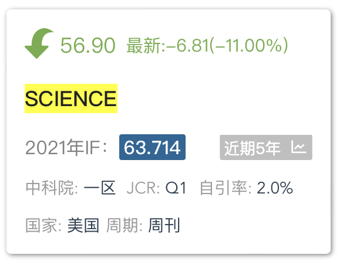

# 二、文章内容

## 摘要

在简单的DNA计算机上以20变量 3-SAT 问题 为例求解了NP完全问题。

在对超过100万( 220 )种可能性进行穷举搜索后，找到了唯一的答案。

这个计算问题的规模可能是迄今为止通过非电子手段解决最大的，并且似乎超出了没有辅助的人工计算的正常范围。

## 引言

### 背景

分子计算固有的巨大并行性、出色的能量效率和超乎寻常的信息密度，提高了分子计算机有朝一日解决传统方法难以解决的问题的可能性1-6。

已经提出了许多分子计算的模型1，2，7-17，其中一些已经通过实验验证了可行性1，6，8，13，14，16-19。

### 先前的工作与本文的工作

3 - SAT问题是一个NP完全问题20，目前NP完全问题已知最快的串行算法需要指数时间。

- 在Lipton2证明分子计算的并行性非常适合求解这类问题之后，该问题成为了测试DNA计算机性能的基准。

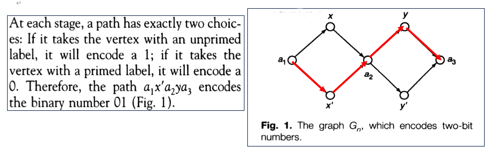

- 由Smith14领导的研究小组利用**基于表面的计算**（surface-based chemistry）解决了一个**四变量**的问题的实例( 24 = 16个可能的真值赋值 )。
- Yoshida和Suyama18使用一个执行广度优先搜索的**DNA程序**，也求解了一个四变量实例。
- Sakamoto等人13利用**DNA发夹结构**解决了一个**六变量**的问题（26 = 64个可能的真值赋值）。
- 由Landweber16领导的的研究小组用**RNA**解决了一个**九变量**可满足性问题的实例，该问题与国际象棋中的"骑士问题"有关( 29 = 512个可能的真值赋值)。

这里，解决了一个**20变量**的3 - SAT问题的实例（ 220 = 1,048,576 个可能的真值赋值）。

### Sticker模型与分离操作

在本研究中，所采用的模型与Roweis等人所提出的Sticker模型有关9。Sticker模型使用两个基本操作进行计算：基于子序列的分离和粘贴操作。

Sticker模型的主要原理就是采用单双链混合型DNA分子进行编码。

- 粘贴操作：
  - 作为存储合成物，一个部分双链的DNA，可以看作一个二进制数的一个编码，双链表示1，单链表示0。
  - 每个存储合成物由两种称为存储链和粘贴链的单链DNA分子形成。
  - 存储链是一个DNA分子，有l个碱基构成，一个存储链中含有n个不重叠的子链，每个子链由m个碱基构成。即l = mn。例如，DNA序列 5' -AAAAA TTTCC GGGGG TAGAT TTTTT CCCCC -3'是一个长度为 l = 5*6的存储链。
  - 粘贴链则是由m个碱基组成的DNA序列，如 3'- TTTTT -5'、3'- AAAGC-5'、3'- CCCCC -5'。
  - 存储链的每个子链被视为一个位元的位置，如果一个粘贴链被退火于存储链的匹配子链上，则表示该位元为1。

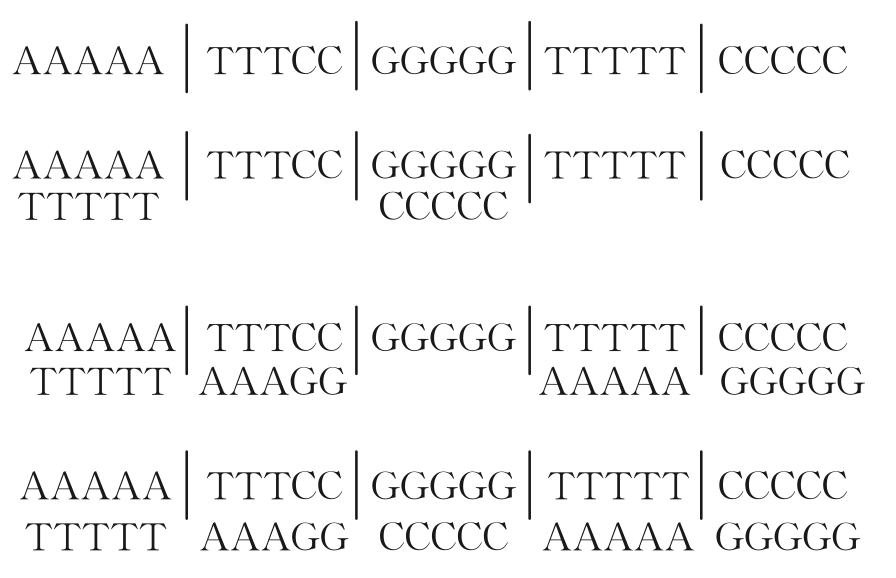

- 分离操作：
  - 由某位元上值的状态将其分离到两个试管中，其中一个试管中的存储链在该位上的值为“1”，而另一个试管中存储链在该位置上的值为“0”。

本研究中只使用了分离。分离是使用固定在聚丙烯酰胺凝胶填充的玻璃模块中的探针进行的。

- DNA链作为信息载体通过电泳迁移穿过模块。具有与固定的探针互补的子序列的链杂交并保留在模块中；没有互补子序列的链相对自由地通过模块21。捕获的链通过在高于探针/互补链双链体的解链温度下运行电泳，从探针中被释放。释放的链可以通过电泳运输到新的模块中进行进一步的分离。

### 意义

使用电泳在凝胶填充的玻璃模块之间传输DNA链，可以使计算机“干燥”（dry），并且具有潜在的自动化能力。由于在分离过程中，共价键既不形成也不断裂，因此DNA链和玻璃模块在多重计算中具有潜在的可重用性。

## 使用DNA模型解决计算问题的基本步骤

步骤 1：编码； 

步骤 2：生成给定问题的所有的可能的解； 

步骤 3：逐步剔除非解，保留剩余解； 

步骤 4：重复进行步骤 3，直到剔除完所有的非解，从而得到给定问题的真解； 

步骤 5：解的检测。

### 正文

#### 布尔表达式

计算是一个20变量、24子句的3-CNF，𝜱（图1A）。

为了使计算尽可能具有**挑战性**，𝜱 被设计为具有唯一满足的真值赋值（图1B）。

仔细观察可以发现，这种设计赋予了 𝜱 一个**迭代的语法结构** ？。然而，值得注意的是，这里所进行的DNA计算并没有利用这种结构，而是在寻找唯一满足的赋值的过程中**穷举搜索**了所有220 ( 1,048,576)种可能的真值赋值。因此，有理由假设任何一个20变量、24子句的3-CNF公式都可以被同样轻松地求解。

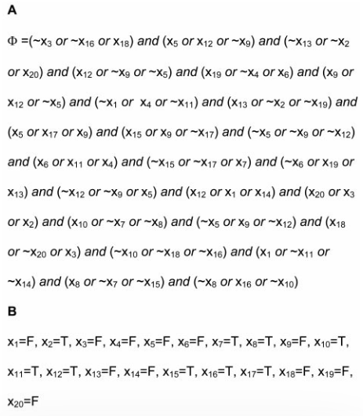

- 图1：计算问题
  - A：20变量的3-CNF布尔表达式 𝜱 ，“～” 表示 “非” 。
  - B：满足 𝜱 的唯一真值赋值。

#### 库

##### 编码

为了表示所有可能的真值赋值，使用了Lipton编码2。对于20个变量中的每个变量 xk （ k=1...20 ），设计了两种不同的15个碱基"值序列" 22：一种代表真（T）XTk，一种代表假（F）XFk。¬ XZk 表示 XZk 的Watson-Crick互补，k = 1...20，Z = T或F。

220个真值赋值中的每一个都用300个碱基的“库序列”表示，该 “库序列” 由每个变量的一个“值序列”的有序串联组成。含有库序列的单链DNA分子被称为“库链”。所有库链与其互补链组成的双链体的集合称为 “完整库” 。

对于40个序列 ¬ XZk （k = 1...20，Z = T或F） 中的每一个，5‘端都用Acrydite（丙烯酸酯）修饰(Mosaic Technologies, Boston, MA) [Operon Technology, Alameda, CA, or Integrated DNA Technologies (IDT), Skokie, IL] ，在分离操作中用作探针。

<u>丙烯酸酯修饰的寡核苷酸在聚合过程中可以并入聚丙烯酰胺凝胶。</u>

##### 序列设计

为了减少计算误差，序列被设计为阻止库内和库间的链杂交以及非预期的探针-库链杂交。为了实现这些目标，使用计算机生成了满足先前报道的约束条件的序列19。特别地，G 不出现在值序列中。

1．序列中只含 A，C 和 T 三种碱基，且相对比较均匀；

2．序列中不含大于等于 5 个连续相同的碱基，即没有超过 4 个 A，4 个 T，4 个 C 或 4 个 G 连续在库序列或探针序列中出现； 

3．任意的两个序列之间，汉明距离大于等于 8； 

4．序列之间任 7 个碱基子序列有大于等于个 0 碱基不匹配； 

5．GC 含量为 40-60%。

##### 合成DNA长分子

在自动化DNA合成仪上合成长分子可能是低效的。为了避免这种低效率性，完整库的创建从两个"半库"的合成开始，一个用于变量x1到x10(左半库)，另一个用于变量x11到x20(右半库)。

在双柱ABI 392 DNA/RNA 合成器上，以0.2-umol 规模、使用基于聚苯乙烯的固体载体（ Applied Biosystems，Foster City, CA ）合成半库。

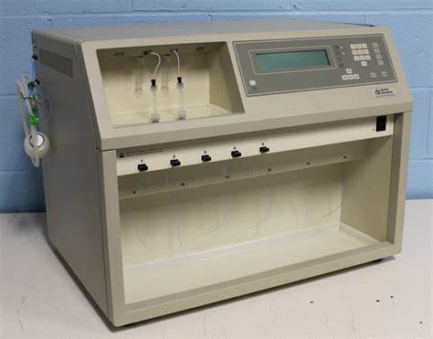

采用了混合-拆分组合合成技术（mix-and-split combinatorial synthesis technique）16。

简单来说，对于左半库，带有序列XT10和XF10的寡核苷酸分别在不同的柱子上合成。将柱子从合成器中取出并打开。将固体载体珠子（solid-support beads）混合后分成两半，随后分别装入不同的柱子中。柱子被关闭，然后在不同的柱子中使用序列XT9和XF9重新开始合成。这个过程重复进行，直到所有10个变量都被处理。对右半库采用了类似的流程。

##### 凝胶捕获实验

为了评估半库的简并度（degeneracy），以及测试使用Acrydite修饰的探针捕获半库的效果，进行了一次凝胶捕获实验（gel capture experiment）（Web图123）。?

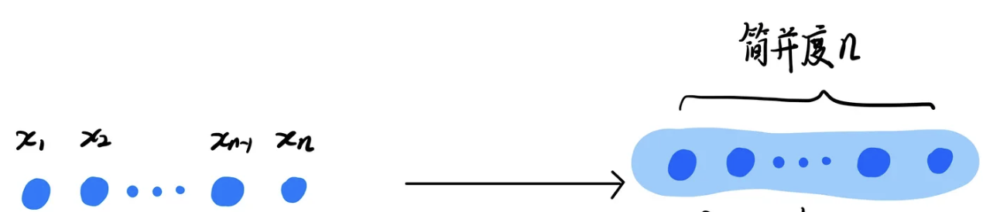

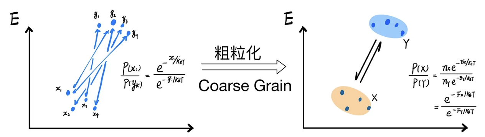

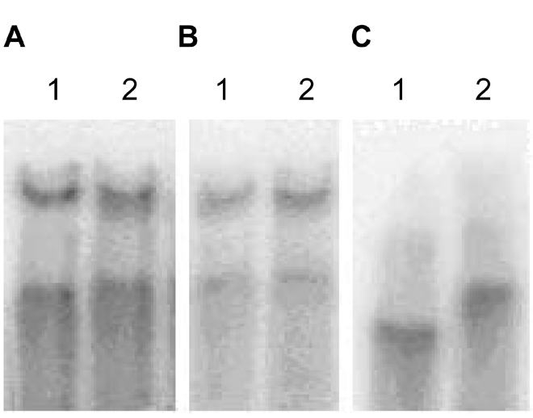

对于40个序列 ¬ XZk（k=1...20，Z=T或F）中的每一个，通过向聚丙烯酰胺（polyacrylamide）凝胶中添加相应的修饰了Acrydite的探针，创建了一个“捕获层”。

适当的5‘-[32P]标记（5‘端修饰磷酸基团）的半库的试样通过电泳穿过捕获层。正如预期的那样，对于40个探针中的每一个，半库的链大约一半被捕获，而大约一半的链通过。这表明探针固定在凝胶中并捕获了半库链。

这也表明半库链具有与探针互补的子序列，并且对于每个变量，代表 “真” 的半库链的数量和代表 ”假“ 的数量近似相等。

##### PCR扩增测试半库

为了进一步测试半库，使用引物组进行聚合酶链式反应( PCR )扩增：< XT1 ，¬ XT10 > ，< XT1 ，¬ X F10 > ，< XF1 ，¬ XT10 > ，< X F1 ，¬ X F10 > ，在标准条件下24 ，以400 fmol的左半库为模板进行35个循环。同样地，使用引物组进行PCR扩增：< XT11 ，¬ XT20 > ，< XT11 ，¬ X F20 > ，< XF11 ，¬ XT20 > ，< X F11 ，¬ X F20 > ，在标准条件下，以400 fmol的右半库为模板进行35个循环。凝胶分析表明，在所有情况下都获得了预期长度的产物25。这证实了子序列XT1、XF1、XT10、XF10存在于左半库中的预期位置，并且子序列XT11、XF11、XT20、XF20存在于右半库中预期位置。

##### 完整库的创建

300-oligomer（300-mer）完整库是由两个半库、使用与文献26类似的聚合酶延伸方法（polymerase extension method）创建的。？

随后，进行两个阶段的PCR扩增，以产生计算所需的完整库的数量。最终产物的凝胶分析显示，仅出现一条带，对应于300个碱基对( bp )（图2）。

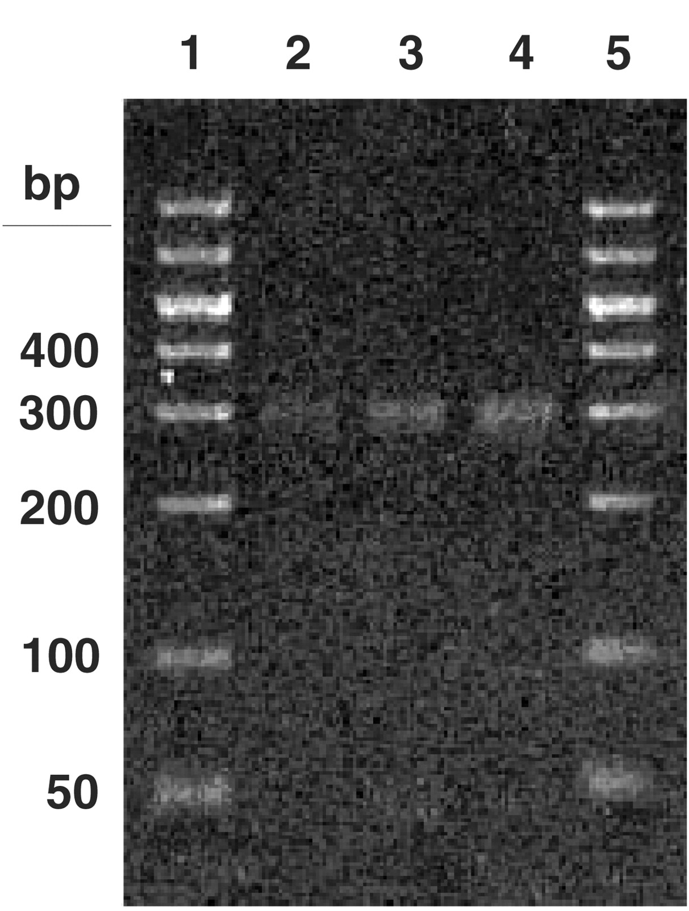

- 图2：完整库的形成。获得了四个30mer的寡核苷酸 “夹板 ”序列（IDT）：¬ X T11¬ X T10、¬ X T11¬ X F10、¬ X F11¬ X T10、¬ X F11¬ X F10。每个半库10 pmol与4个夹板各2 pmol混合，加入终体积为25 ul的1XT4 DNA连接酶缓冲液( promega, Madison , WI) 中，室温孵育2 h (注:未加连接酶)。取1 / 2 ul 混合液用引物组进行PCR扩增：<XT1，XF1，Acrydite-modified ¬ X T20，Acrydite-modified ¬ X F20>，在标准条件下，35个循环。随后，从上述产物中取1 ul 的等分，使用上述引物组，在标准条件下进行35个循环的PCR扩增。将产物在1%琼脂糖凝胶上运行，使用Ultrafree-DA DNA提取试剂盒（Millipore, Bedford, MA）提取300bp的带，然后将其混合以制备最终体积约 500ul 的原液（stock solution）。使用上述引物组合，使用2.5ul的原液取样作为模板，在标准条件下进行了另一轮PCR扩增，进行了15个循环。将得到的DNA进行了乙醇沉淀，并在75 ul 水中重新溶解。如图所示，完整库的取样在4%的琼脂糖凝胶上运行结果，1ul（泳道2）、2ul（泳道3）、3ul（泳道4）。泳道1和5为分子量标记。

对完整库的分光光度分析显示，总共大约得到750 pmol的300-bp的DNA。值得注意的是，完整库由带有Acrydite修饰的补体的库链双链体组成。由于所有的库链都具有相同的长度( 300个碱基)，因此在电泳过程中它们预计以相似的速率运行。

##### 完整库的测试

为了测试完整库，使用引物组进行PCR扩增：对于不同的k，< XT1 ，¬ XTk >，< XT1 ，¬ XFk >，< XF1 ，¬ XTk >，< XF1 ，¬ XFk >，< XT1 ，XF1 ， ¬ XTk ，¬ XFk >。对所得产物的凝胶分析显示出预期长度的条带（图3）。

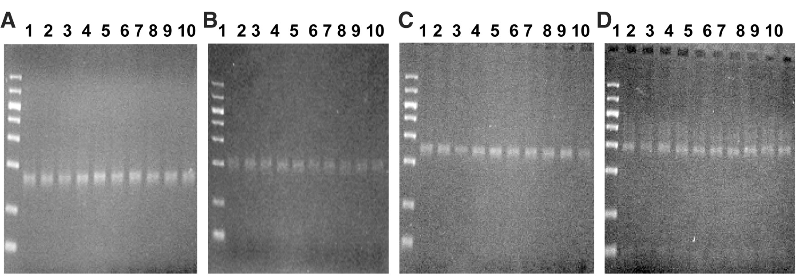

- 图3：完整库的分析。纯化后的完整库在标准条件下进行PCR扩增，15个循环。PCR产物在4%琼脂糖凝胶上进行分析。泳道1和2对应引物组< XT1 ，XF1 ， ¬ XTk ，¬ XFk >，泳道3和4对应引物对< XT1 ，¬ XTk >，泳道5和6对应引物对< XT1 ，¬ XFk >，泳道7和8对应引物对< XF1 ，¬ XTk >，泳道9和10对应引物对< XF1 ，¬ XFk >，其中（A）k=11；（B）k=14；（C）k=17；（D）k=20。分子量标记位于每个凝胶的最左边泳道(如图2所示)。

#### 计算机和计算方案

该计算机由一个带有热室和冷室的电泳槽、一个装有包含了共价结合完整库的聚丙烯酰胺凝胶的玻璃“库模块”组成，并且对于 𝜱 的24个子句中的每一个，都有一个装有包含了共价结合探针的聚丙烯酰胺凝胶的玻璃“子句模块”，并且这些模块被设计为仅捕获编码满足该子句的真值赋值的库链（图4）。

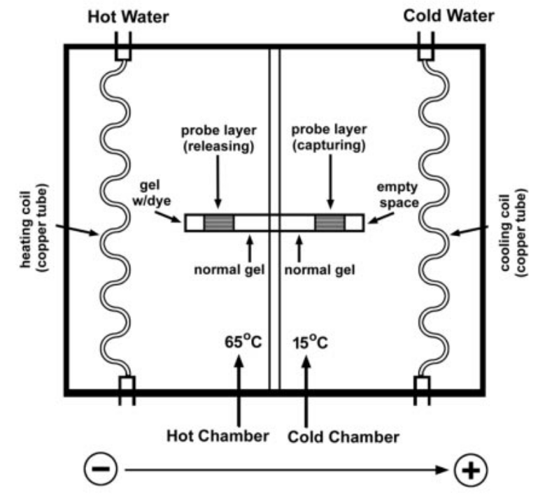

- 图4：计算机。
  - 电泳槽由0.5 cm厚的有机玻璃制成，长30 cm，宽15 cm，高8 cm。
  - 箱体由有机玻璃隔板隔成等体积的热室和冷室。
  - 每个腔室通过塑料管连接到一个循环水浴中。循环水浴槽中的水通过铜管输送到腔室中，充当冷却/加热线圈。
  - 在每个腔室中插入了一根铂丝电极。
  - 对于𝜱 的24个子句中的每一个，准备了100 ul 的子句溶液，其中包含三种Acrydite修饰的探针各15 uM，分别对应每个子句中的文字（如果子句中出现xk，则加入序列为¬ XTk的探针，如果子句中出现 ～xk，则加入序列为¬ XFk的探针）。
    - 例如，对于第一个子句（～x3 or ～x16 or x18），添加了序列为¬ XF3，¬ XF16和 ¬ XT18 的探针。
  - 对于每个子句溶液，在4.5 cm长的玻璃管中创建子句模块，外直径为0.5 cm，内直径为0.3 cm。在管底的3.2 cm处聚合了一层5%聚丙烯酰胺凝胶作为基层。在基层上方聚合了一层含有子句溶液的5 %聚丙烯酰胺凝胶作为探针层。如上所述制备了一个库模块，但使用了100ul中的500 pmol的完整库代替子句溶液28。
  - 去往热室模块的末端用含有溴酚蓝和二甲苯蓝染料的5%聚丙烯酰胺凝胶进行堵塞。热室温度为65 ° C，冷室温度为15 ° C。电泳在12 V / cm下进行。
  - 染料在凝胶中的移动提供了一种监测过程和检测模块之间可能的泄漏的方法。
  - 当二甲苯蓝染料通过模块并进入冷缓冲溶液时，电泳停止，大约4小时。

计算方案如下：

- 步骤1：将库模块插入电泳槽的热室，将第一个子句模块插入电泳槽的冷室。开始电泳。理论上，在步骤1中，在库模块中，库链与其具有Acrydite修饰的互补链脱离，并迁移到第一个子句模块中。编码满足第一个子句的真值赋值的库链在捕获层中被捕获，而编码不满足赋值的库链穿过捕获层并继续进入缓冲库。例如，那些序列为 XF3或 XF16或 XT18 的库链被保留在捕获层中，而那些序列为XT3和 XT16和 XF18的库链则贯穿捕获层。
- 步骤2：将两个模块从槽中取出。丢弃热室中的模块。清洗槽位并添加新的缓冲液。将冷室中的模块插入热室，将下一个子句的模块插入冷室中。开始电泳。理论上，在步骤2中，在位于热室的子句模块中，库链与它们的Acrydite修饰的探针脱离，并迁移到冷室的子句模块中。编码的真值赋值满足与冷室中的模块相关的子句的库链将被捕获，而编码不满足赋值的库链将穿过捕获层并继续进入缓冲库。
- 步骤3：对剩余的22个子句的每一个重复第2步。理论上，在步骤3结束时，最终的子句模块（第24个）将只包含那些在所有24个子句模块中都被捕获的库链，从而编码的真值赋值满足 𝜱 的每个子句，即满足 𝜱 本身。
- 步骤4：从最后的子句模块中提取答案链（解），PCR扩增，并"读取"答案。

#### 答案的确定

##### 答案库的创建

从最后的子句模块(第24个)中挤出凝胶，并在65℃下的1ml水中浸泡过夜，以提取其包含的库链。将库链冻干，在200 ul水中重新溶解，脱盐，在45 ul水中回收。这作为答案库。

##### 给变量x1和x20赋真值

为了给变量x1和x20赋真值，用以下引物对10倍、20倍、30倍、40倍、50倍、60倍和100倍稀释的答案库各取1ul进行PCR扩增：< XT1 ，¬ XT20 >，< XT1 ，¬ XF20 >，< XF1 ，¬ XT20 >，< XF1 ，¬ XF20 >。对10倍、20倍、30倍、40倍、50倍稀释的PCR产物进行凝胶分析，除了以下引物组外，均未出现条带：< XF1 ，¬ XF20 >。这些引物组合只产生了一个对应于300 bp的条带。根据这个结果，将x1赋值为F，x20赋值为F。对60倍和100倍稀释的PCR产物进行分析，所有引物组合均无条带25。

##### 给变量x2，x3，...，x19赋真值

为了给变量x2，x3，...，x19赋真值，并作为对x20真值的冗余测试，用以下引物组合对50倍稀释的答案库的1 ul的取样进行PCR扩增：< XT1 ，¬ XTk >，< XT1 ，¬ XFk >，< XF1 ，¬ XTk >，< XF1 ，¬ XFk >，其中 k = 2，3 ... 20。凝胶分析显示（图5）在每种情况下只有一种引物组合产生了一个条带，并且该条带长度符合预期（与图3对比）。根据这个结果，对各变量进行真值赋值。这些实验得出的真值对应于𝜱 唯一满足的真值赋值（图1B）。

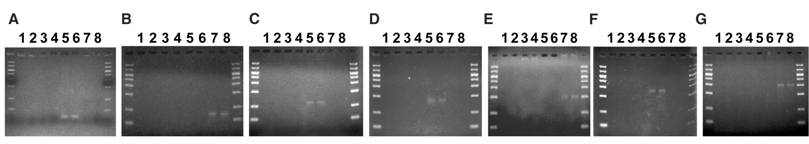

- 图5：答案的读取：取50倍稀释的答案库 1 ul，在标准条件下进行25个循环的PCR扩增。PCR产物在4 %琼脂糖凝胶上分析。泳道1和2对应于引物对< XT1 ，¬ XTk >，泳道3和4对应于引物对< XT1 ，¬ XFk >，泳道5和6对应于引物< XF1 ，¬ XTk >，泳道7和8对应于引物对< XF1 ，¬ XFk >，其中（A）k=2，（B）k=5，（C）k=8，（D）k=11，（E）k=14，（F）k=17，（G）k=20。分子量标记位于每个凝胶的最左边和最右边泳道(如图2所示)。

#### 捕获-释放效率

##### 正确链的分析

随后做了对那些编码了唯一满足的真值赋值的正确链的分析。由于对45μl的答案库的50倍稀释液的1μl 进行 PCR，得到了正确的解，因此答案库中可能至少有50 X 45=2250条正确的链。

由于计算开始于大约 500 pmol的完整库（3 x 1014分子），并且由于大约 每220个分子中有一条是正确的链，因此在整个计算中，正确链存在的概率至少为 2250 x（220）/（3 x 1014）= 7.5 x 10-6。

因为计算过程中有24个捕获-释放步骤，所以平均而言，一个正确的链在每个捕获-释放步骤中存活下来的概率至少为（7.5 x 10-6）(1/24) = 0.61。

该分析假设PCR能够检测单个模板。一个更实际的假设可能是，在25个循环后，至少需要5000个模板才能产生一个阳性信号。在此假设下，一条正确的链在一次捕获释放步骤中存活的平均概率至少为( 3.75 x 10-2) ( 1 / 24 ) = 0.87。

##### 错误链的分析

对于不满足 𝜱 的编码真值赋值，即错误链的分析如下。继续假设在25个PCR循环后，至少需要5000个模板才能产生阳性信号。对45μl的答案库中的1μl进行PCR，结果显示有一条与错误的真值分配对应的条带25。然而，对答案库进行10倍稀释后取1ul进行PCR，结果显示没有与错误的真值赋值对应的条带。因此，最多可能有10 x 45 x 5000 = 2,250,000条错误链存在于答案库中。合理的假设是所有不正确链都是同一种不正确的真值赋值方案。这样的链被称为“1-错误链”。对于每个1-错误链，通常有一个不应退火的捕获层。在计算开始时，大约有 6 x 109 条1 -错误链。因此，在关键捕获释放步骤中，意外保留的1-错误链的概率最多为（2,250,000）/（6 x 109）= 3.75 x 10-4。

这一分析表明，从500 pmol的完整库开始，大约30个变量的3 - SAT问题可以用这里描述的方法来解决。计算过程中的周期性的PCR扩增可能将这种方法推广到规模更大的3-SAT问题。

### 结论

千百年来，人类一直试图利用制造出来的设备来增强自身固有的计算能力。像算盘、加法器和制表机等机械装置都是重要的进步。然而，直到大约60年前电子设备的出现，尤其是电子计算机的问世，才似乎得到质的飞跃，才能够解决相当困难的问题。现在，分子装置有望取得进一步的突破。

在我们的研究中，采用了一种简单的方法。在解决一个20变量的3-SAT问题实例时，我们仅使用DNA的Watson-Crick配对和熔解作为唯一的操作（除了输入和输出阶段之外）。尽管计算理论可以对这个问题进行预测，但值得注意的是，这种基本的分子相互作用可以支持如此复杂的计算。我们的实现是Sticker模型9的简化版本。我们没有实现stickers，因此，我们的库链表现得像是固定的存储器。按照最初的构思，如果有stickers，库链会成为更强大的“一次写入”存储器（write-once memories）。最近的研究27表明，DNA "链入侵"可能为从库链中特异性去除stickers提供一种手段。这可能导致库链成为非常强大的读写存储器（memories）。对这种可能性的进一步研究似乎是值得的。

尽管我们和其他人取得了成功，但在没有技术突破的情况下，对于创建一个能够在经典计算问题上与电子计算机竞争的分子计算机，并没有理由保持乐观。然而，分子计算机可以在更广泛的范围内考虑。它们可能在一些特殊的环境中很有用，例如需要极高的能源效率或极高的信息密度。它们可能为控制化学/生物系统提供了一种急需的手段，就像电子计算机为控制电气/机械系统提供了一种手段一样。它们确实为生物和计算思想的整合提供了一个焦点，这可能会带来更广泛的应用，比如关于DNA自组装的有前景的研究工作11。它们启发我们思考电子计算机的替代方案，研究它们最终可能带领我们找到真正的"未来的计算机"。

最重要的是，DNA计算机，如本文所介绍的，说明生物分子可以用于明显的非生物目的。出于这样的目的，这些分子代表了30亿年进化过程中未开发的遗产，它们的进一步探索具有巨大的潜力。