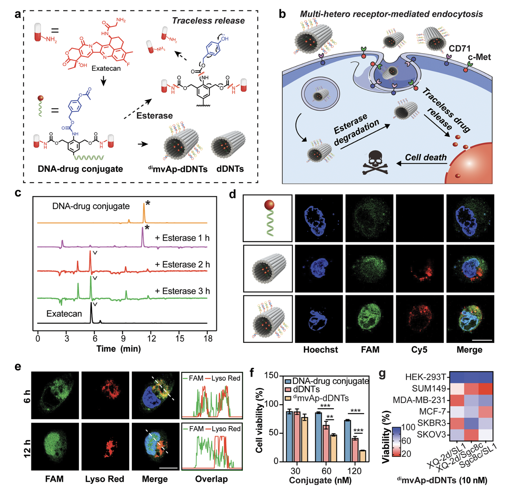

Tunable Multivalent Aptamer-Based DNA Nanostructures To Regulate Multiheteroreceptor-Mediated Tumor Recognition

基于可调节多价适体的DNA纳米结构 调节多个异性受体介导的 肿瘤识别

## 一、文章简介


## 二、文章内容

### Abstract

#### 背景

细胞表面**受体** 的精确定位和调节在癌症、感染和神经疾病等疾病治疗中具有巨大意义，但也面临巨大挑战。

#### 实验总述

本研究设计了一系列基于可调节多价**适体**的DNA纳米结构，以精确控制它们与 肿瘤细胞中**受体**的 相互作用。

- 通过使用**10种不同的适体**对**12种细胞系**上的表面受体进行分析，我们生成了一个热图，该热图基于多种**标记物**，准确区分了各种肿瘤类型。

- 然后，我们将这些**适体**结合到DNA折纸结构上，以调节**受体**识别：其中，片状结构偏好于在细胞表面被捕获，而管状结构则偏好于内化（internalization）。
- 通过精确控制**价态、几何图案和适体的种类**，我们发现 **多个异性受体**介导的识别 不仅有利于纳米结构与肿瘤细胞的特异性结合，而且其通过促进具有网格蛋白依赖性的内吞作用，大大增强了细胞内摄取。
- 具体而言，我们使用修饰有不同**二异性适体**对（di-heteroaptamer pairs）的管状结构，在不同的肿瘤细胞中实现了与正常细胞相比而言超过5倍的摄取，促进了靶向药物递送。
- 此外，具有**三异性适体**（tri-heteroaptamers）的片状结构引导了巨噬细胞和肿瘤细胞之间的特异性相互作用，导致了有效的免疫清除。

#### 意义

这种可编程的多价系统允许使用多个参数，对细胞识别进行精确调节，显示出治疗个性化肿瘤的巨大潜力。

```sh
网格蛋白的运输作用：
	网格蛋白在人体中起运输的作用，生物分子激素、神经递质、膜蛋白等物质都可通过网格蛋白进行运输。
	在内吞过程中，质膜上受体与配体特异结合部位的胞质面(将形成有被小泡的外衣)有一些蛋白附着：网格蛋白是其中最主要的一种蛋白。


适体（aptamer）与配体（ligand）：
	1. 适体是一种由核酸或蛋白质等生物大分子构成的特异性结合分子，通过体外选择技术筛选获得（如SELEX），具有高度特异性和亲和性。
	2. 适体主要应用于生物医学领域，如用于靶向治疗、疾病诊断、药物递送等。

	1. 配体是指任何与受体结合的小分子化合物或蛋白质，可以是激素、药物、生长因子等，与受体结合后可以激活或抑制受体的生物活性。
	2. 配体可以是天然存在的生物分子，也可以是人工合成的化合物。
	3. 配体与受体结合后可以激活或抑制受体的生物活性。
	
	可以认为适体是一种配体，配体>适体。同锚定蛋白结合的任何分子都称为配体。抗体也可以与受体结合。


受体：
	受体是细胞膜上的一种特殊蛋白质（也可以是其他生物分子），具有特定的结构，能够与特定的信号分子（如激素、神经递质、药物等）结合，触发一系列细胞内信号转导途径，从而影响细胞的生理功能。受体在细胞信号传导和细胞间相互作用中起着重要的作用。


内化：
	内化主要有两种类型：
	1. 受体介导的内吞作用（receptor-mediated endocytosis）：这是指受体与其配体结合后，受体-配体复合物通过特定受体介导的内吞囊泡在细胞膜上形成，然后内化进入细胞内，从而将受体及其携带的信号分子带入细胞内部。
	2. 胞吞作用（phagocytosis）：这是指细胞通过吞噬固体颗粒或其他大型分子形成吞噬囊泡，将外部物质整体包裹在囊泡内，然后囊泡与溶酶体融合，使囊泡内的物质被消化。


细胞内摄取：
	细胞内摄取是指物质从细胞外部进入细胞内部的过程。细胞内摄取可以通过多种方式进行，其中包括主动转运、被动扩散和内吞作用等机制。
	细胞内摄取是维持细胞内外环境平衡的关键过程，使细胞可以从外界获取所需的营养物质和信号分子，同时排出废物和毒素。
```

### Introduction

#### 背景

细胞表面蛋白（Cell surface proteins，CSP，包括受体蛋白、通道蛋白、免疫识别蛋白、酶蛋白等）在包括营养物质运输、信号转导、细胞间通讯和免疫应答等各种生物过程中发挥着关键作用。因此，它们是药物研发和疾病治疗的有前景的靶点，包括小分子抑制剂、抗体、嵌合抗原受体 T 细胞等（Chimeric Antigen Receptor T，CAR-T）。<sup>1−4</sup> 

值得注意的是，大多数CSP在细胞膜（plasma membrane）上分布不均，并在动态的纳米尺度上以多价方式（multivalent manner）产生显著影响

- 这意味着它们的相互作用和功能往往涉及复杂的分子排列和多种多样的结合事件。<sup>5</sup> 
- 例如，严重急性呼吸系统综合征冠状病毒2型病毒（SARS-CoV-2）通过表面的刺突糖蛋白（S蛋白）和人类细胞表面的ACE2受体之间的多重结合增强了受体识别和膜融合，从而引发严重感染。<sup>6</sup> 


- 在免疫反应中，当T细胞与抗原呈递细胞或其他靶细胞相互作用时，T细胞形成了称为免疫突触的纳米级分子紧密接触结构，并且反过来，涉及不同受体的多种相互作用又促进了T细胞的活化、发育和功能作用。<sup>7</sup> 

此外，多价识别也正在被探索用于治疗应用。例如，二价抗体和具有丰富靶向配体的纳米颗粒已被证明是抑制肿瘤生长的有前景的方式。<sup>8−10</sup>

```sh
多价方式：
	1. 多价方式，是指一种分子或化合物具有多个结合位点，可以同时与多个配体或靶标结合的方式。
	2. 在生物学和药物领域中，多价方式常用于设计新型药物、纳米颗粒或载体，以增强其结合能力和效果。
	3. 通过在一个分子或化合物上引入多个结合位点，可以提高其与配体的结合亲和力，从而增强其活性和效果。
	总的来说，多价方式是一种利用分子具有多个结合位点来增强其结合能力和效果的策略，广泛应用于药物研发、生物医学和生物化学研究中。
	
二价抗体：
	指能结合两个抗原表位的抗体分子
```

#### 提出问题

**异质性：**

然而，肿瘤细胞在基因突变、细胞表面标记物的表达和其他特征方面表现出高度异质性（heterogeneity）。<sup>11,12 </sup>这种异质性使得很难在不影响健康细胞的情况下特异性地靶向肿瘤细胞，会导致靶向（on- target）/ 非肿瘤（off-tumor）毒性。这种毒性会严重削弱治疗效果，可能导致严重的复发和转移。<sup>13,14</sup> 

```sh
	在生物学和医学中，heterogeneity可以指不同个体或群体之间的遗传变异、生理特征差异、疾病表现差异等。例如，在一种疾病中，患者的症状和反应可能存在不同的表现，这种差异可以被称为疾病的heterogeneity。
```

#### 解决问题

为了解决这个问题，已经探索了各种方法来提高治疗**对肿瘤细胞的选择性**，例如将靶向配体结合到不同的平台上，包括聚合物、纳米颗粒甚至细胞。<sup>15,16</sup> 

其中，基于DNA折纸的纳米结构因其优异的**可编程性和可寻址性**脱颖而出，基于DNA折纸的纳米结构能够精确地控制靶向配体的相互作用价（ interaction valence）、亲和力和时间-空间模式，这些对于实现**肿瘤靶向的高特异性**是至关重要的。<sup>17−19</sup> 

特别地，CELL-SELEX技术使得可以从肿瘤细胞中直接选择基于寡核苷酸的适体，并结合到DNA折纸上。

这表明可以通过调节各种参数促进靶向肿瘤识别的调节，这些参数例如适体种类、价态、模式和折纸结构。<sup>20−24</sup> 

考虑到肿瘤细胞可以频繁地扰乱其内吞作用，其中涉及多种利于营养清除、表型改变、转移和免疫逃避的途径，我们计划精确利用多种受体来调节肿瘤识别并增强内吞作用以进行靶向治疗。<sup>25,26</sup>

#### 提出新方法

在本研究中，我们在基于DNA折纸的纳米结构上安装了多价适体，通过调整适体的种类、价态、模式和折纸的几何结构来准确调节靶向肿瘤识别。

1. 我们首先研究了各种适体与不同细胞系的结合曲线，然后将它们杂交在片状（mvAp-DNP）或管状（mvAp-DNT）的纳米结构上。
   - 结果表明，**大多数mvAp-DNP（片状）主要存在于细胞表面，而大多数mvAp-DNT（管状）倾向于快速的内化。**
   - **通过将两种类型的适体结合在同一结构上，我们通过 多异性受体介导的识别 观察到了结合亲和力的显著增强。**
2. **之后，我们通过管状的mvAp-DNTs选择性地将治疗前药输送到肿瘤细胞中，并利用片状的mvAp-DNPs来引导用于免疫清除的巨噬细胞与靶向肿瘤细胞之间的特异性相互作用**
3. 这为精确调节个性化治疗的细胞识别提供了一个有前景的平台。

```sh
治疗性前药（therapeutic prodrugs）
	就是一种药，是一种药物设计策略，旨在通过将药物原型化合物进行化学修饰，使其在体内转化为活性药物，以提高药物的疗效和减少副作用。治疗性前药通常是一种不活性或者低活性的化合物，需要在体内经过代谢或其他反应才能转化为活性药物。
	
免疫清除与巨噬细胞：
	免疫清除的巨噬细胞是免疫系统中的一类重要细胞，主要负责清除体内的病原体、细胞垃圾和其他有害物质。巨噬细胞是一种专门的免疫细胞，属于单核细胞系的成员，在身体的各个组织和器官中广泛分布。
```

### Result And Discussion

#### Design of Tunable Multivalent Aptamer-Based DNA Nanostructures. 基于可调节的多价适体的DNA纳米结构的设计。

考虑到细胞膜通常以平面模式发挥作用，我们设计了二维的片状结构和三维的管状结构（DNP和DNT）（图S1、S2）。<sup>27,28</sup>


- 图S1：由M13mp18单链DNA（蓝色）和staple（黑色）组成的片状DNA纳米结构（DNPs）的设计


- 图S2：

  - 由M13mp18单链DNA（蓝色）、staple（黑色）和环状staple（红色）组成的管状DNA纳米结构（DNTs）的设计。

  - 上端的环状staple（红色）的延伸序列与下端M13mp18相应位置的缺失序列互补。
  - 下端的环状staple（红色）的延伸序列与上端M13mp18相应位置的缺失序列互补。

通过对M13mp18 DNA链和staple进行退火，以高产率（>95%）和纯度（>85%）合成了均匀的DNP（长x宽 90nm×60nm）和DNTs（高x直径 90nmx19nm）（图1a、图S3）。


- 图1：基于可调节的多价适体的DNA纳米结构的构建。
  - (a) 基于DNA折纸的片状和管状结构的制造。
  - (b) 、(c) 具有不同适体价（v=6，12，24，48）的mvAp-DNPs (b) 和mvAp-DNTs (c) 的AFM图像。比例尺：70 nm。通过AFM测量纳米结构的高度。
  - (d) Cy5染料标记的不同mvAp-DNP的琼脂糖凝胶电泳。
  - (e) Cy5染料标记的不同mvAp-DNT的琼脂糖凝胶电泳。


- 图S3：
  - (a) DNPs和DNTs的AFM图像。比例尺：400 nm。
  - (b) 源于AFM图像的DNPs和DNTs的合成产率。

然后，我们将适体阵列与编程的延伸段杂交，产生一系列价态为6、12、24和48的基于多价适体的DNA纳米结构（mvAp-DNP和mvAp-DNT）（图S4）。


- 图S4：
  - 具有不同价态（v=6，12，24，48）的mvAp-DNP和mvAp-DNT的示意图。mvAp-DNP和mvAp-DNT的设计图纸基本相似。
  - (a) 左：连接6个适体的纳米结构图（v=6）。overhang（橙色）表示连接适体的位置。右：连接6个适体的纳米结构的简单示意图（v＝6）。橙色点表示连接适体的位置，并且在图上标记了适体之间的距离。
  - (b),  (c) 和 (d) 是化合价为12、24和48的相应的纳米结构设计图。

与模拟结果一致，适体价态的增加使DNP的纳米结构的高度从约1.5 nm改变到 约3.0nm，使DNT的纳米结构高度从约2.9 nm改变到约7.0 nm（图1b，c），并且，与空的折纸相比，也延迟了它们在凝胶电泳中的迁移速率（图1d，e），这表明价态更高的纳米环境更拥挤（个体更膨胀）。

通过在每个结构上用六个Cy5染料标记的适体来评估适体的加载效率（图S5）。


- 图S5：标记有Cy5染料的纳米结构的设计。为了定量研究不同纳米结构与细胞的结合能力，在所有结构的6个固定位置标记了Cy5染料（绿色overhang）。根据设计，每个纳米结构携带相同数量的染料分子。

用ImageJ软件对条带强度的定量显示，对于化合价为6、12和24的结构，加载效率超过90%，但对于化合价为48的结构，加载效率低于80%。（图 S6）


- 图S6：适体在不同纳米结构中的加载效率。
  - 使用处于相同位置的6个修饰有Cy5基团的适体组装了具有不同价态的纳米结构。
  - 不同价态的mvApDNP（a）和不同价态的mvApDNT（b）的1%琼脂糖凝胶电泳。
  - 适体在纳米结构上的连接产率随着价态的增加而逐渐降低。

因此，更高的适体价态增加了空间位阻，导致加载效率降低，这也可能影响它们与靶标的结合。

```sh
空间位阻：
	空间位阻是一种化学术语，指的是由于分子内部的原子或基团之间体积的相互作用而导致分子构型受限或受阻的现象。空间位阻可以影响分子的构象和反应性，有时甚至影响整个化学反应的进行。
	空间位阻通常会出现在含有大体积基团的有机分子中，这些大体积基团会占据一定的空间，并且可能会妨碍其他分子或基团的自由运动。空间位阻可能导致分子构型的改变，使得一些键角或键长受到影响，从而影响化学反应的选择性和速率。
	在有机合成化学中，空间位阻是一个重要的考虑因素。设计分子结构时需要考虑到不同原子或基团之间的相互作用，避免出现过高的空间位阻，以确保反应的进行和产率的提高。
	同时，空间位阻也可以被用作一种选择性调节反应的策略，通过设计具有特定空间位阻特征的分子配体，从而实现对反应产物的选择性控制。
```

然后，我们选择了几种游离适体来分析与各种类型的 与肿瘤的不良预后（poor prognosis）高度相关的膜标记物的表达特征（图S7）。<sup>29,30</sup> 


- 图S7：通过流式细胞术（flow cytometry）测量的10种游离适体与不同细胞系的结合强度的热图。

```sh
肿瘤的不良预后（poor prognosis）:
	肿瘤的不良预后是指该肿瘤在治疗过程中或之后出现复发、转移、进展迅速等情况，导致患者生存期缩短、生活质量下降或甚至导致死亡的概率增加。不良预后通常与肿瘤的类型、分期、遗传特征、治疗反应等因素有关。一般来说，晚期诊断、高度恶性的肿瘤、不良生活习惯、疾病合并症等情况都可能影响肿瘤的预后。
```

```sh
流式细胞术（flow cytometry）：
	流式细胞术是一项广为使用、基于激光的技术，用于检测细胞或颗粒特性。
	流式细胞术广泛用于分析细胞表面和细胞内分子的表达、鉴定并确定异质细胞群中的不同细胞类型、评估分离亚群的纯度以及分析细胞大小和容积。这种技术可同时分析单个细胞的多个参数，
	主要用于测定荧光标记的“抗体检测蛋白”产生的荧光强度，或结合了特定细胞分子的配体，如碘化丙啶与 DNA 的结合。
	其染色过程包括从细胞培养物或组织样品制备单细胞悬液。然后将获得的细胞培养在包含未标记或荧光标记抗体的试管或多孔板中，再用流式细胞仪分析。
```

热图结果揭示了12个不同的细胞系中，适体的不同结合（强度）特征，这些发现与使用相应抗体测量的结合特征高度一致（图S8），如Sgc8c与Protein Tyrosine Kinase-7（PTK7）、AS1411与Nucleolin（NCL）、XQ-2d与Transferrin Receptor（CD71）、SL1与mesenchymal−epithelial transition（c-Met）和SYL3C与Epithelial Cell Adhesion Molecule （EpCAM），高度阐明了适体在区分不同肿瘤类型方面的高可靠性和显著潜力。


- 图S8：用流式抗体通过流式细胞术测量细胞表面的不同标志物的**表达水平**。结果显示在热图（a）和**流式细胞术图**（b）中。

但是，与抗体相反，适体可以很容易地杂交到DNA纳米结构上。我们最终评估了mvAp-DNP和mvAp-DNT的细胞结合亲和力。与游离适体和其他对应物（counterparts）相比，在4°C下孵育1小时后，大多数价为12的纳米结构在MDA-MB-231细胞中表现出更高的积累（图S9），这表明多价纳米环境可能有利于它们与细胞受体的相互作用。


- 图S9：
  - (a) 游离适体和修饰有mono-type适体(价=12)的纳米结构对MDA-MD-231细胞的结合亲和力。研究了AS1411、Sgc8c、SL1、SYL3C和XQ-2d五种适体
  - (b) 游离的XQ-2d适体和修饰有不同价态的XQ-2d的DNA纳米结构对MDA-MD-231细胞的结合亲和力

#### Effect of Aptamer Species, Valence, and Origami Geometry on Cell Binding Affinity. 适体种类、价和折纸几何结构对细胞结合亲和力的影响。

**结合：**

接下来，我们分别评估了携带单一型（monotype）AS1411、Sgc8c、SL1、SYL3C或XQ-2d适配体的<sup>mono</sup>mvAp-DNPs 和 <sup>mono</sup>mvAp-DNTs在5个肿瘤细胞系和一个正常细胞系中的结合谱。

为了准确反映特异性识别，用相同量的Cy5报告器标记所有纳米结构，并在4°C下与细胞孵育1小时。热图结果显示出在不同细胞中的不同结合特征：

- 即，具有混乱的DNA序列的对照纳米结构对所有细胞显示出较弱的相互作用
- 而对肿瘤细胞的特异性识别由适体种类主导，与标记物水平显示出高度的一致性（图2a、b）。


- 图2：不同的多价DNA纳米结构的细胞结合。
  - 在4°C下与<sup>mono</sup>mvApDNPs (a) 或 <sup>mono</sup>mvAp-DNTs (b) 孵育1小时后细胞的流式细胞术信号热图。
  - 与对照组（<sup>scrambled</sup>DNPs in (a) 或 <sup>scrambled</sup>DNTs in (b)）相比，所有数据都被标准化，对照组携带混乱序列以取代适体。
  - MDA-MB-231 和 MCF-7 细胞在 37 °C 下与含有 XQ-2d 适体的<sup>mono</sup>mvAp-DNPs (c) 和 <sup>mono</sup>mvAp-DNTs (d) 孵育 1 小时后的共聚焦图像。比例尺：10 μm。
  - <sup>mono</sup>mvAp-DNPs (e) 和 <sup>mono</sup>mvAp-DNTs (f)与 XQ-2d 在 37 ℃ 下孵育 0、1、3、6、12 和 24 小时（价＝12）后的细胞摄取情况。
  - (a)−(f) 中DNA纳米结构的浓度为10nM。

同时，大多数结构在12价时实现了最大摄取，这意味着增加的适体数量有利于多价相互作用，但过高的密度可能会由于空间位阻而影响结合。

值得注意的是，折纸几何结构也改变了结合特征；与片状对应物相比，<sup>mono</sup>mvAp-DNTs 具有一个增强的结合信号（例如，SKBR3和SUM149中XQ-2d<sub>24</sub>增加2倍）。

因此，通过调整适体种类和价态，我们实现了<sup>mono</sup>mvAp-DNTs对肿瘤细胞的特异性靶向，导致SUM149 (Sgc8c<sub>12</sub> 和 XQ-2d<sub>12</sub>)和SKBR3 (XQ-2d<sub>12</sub> 和 XQ-2d<sub>24</sub>),增加5倍以上，MDA-MB-231 (XQ-2d<sub>12</sub>)增加4倍，MCF-7 (SL1<sub>48</sub>) 和 SKOV3 (XQ-2d<sub>12</sub>).增加3倍。

**摄取：**

我们进一步观察了用XQ-2d修饰的不同纳米结构在阳性MDA-MB-231细胞和阴性MCF-7细胞中的摄取过程。 

共聚焦图像（图2c，d）显示，不同价态的<sup>mono</sup>mvAp-DNPs 和 <sup>mono</sup>mvAp-DNTs都可以在37°C下快速识别MDA-MB-231细胞表面过表达的CD71受体，而与 MCF-7 细胞的结合力则微乎其微。

与流式细胞术结果一致，细胞摄取主要由适体种类和价态决定（图S10），大多数结构在价态为12时实现了最大摄取。


- 图S10：用不同价XQ-2d的mvAp-DNP（a）和mvAp-DNT（b）处理后的MDA-MB-231和MCF-7细胞的流式细胞术。

此外，我们还定量监测了摄取动态（uptake dynamics）。

- 有趣的是，具有柔性片状结构的<sup>mono</sup>mvAp-DNPs在1小时内快速附着并在细胞表面被捕获，而具有刚性管结构的<sup>mono</sup>mvAp-DNTs倾向于内部化到细胞中。
- 孵育24小时后，与<sup>mono</sup>mvAp-DNPs相比，具有XQ-2d12的<sup>mono</sup>mvAp-DNTs 显示MDA-MB-231细胞的摄取增加了2倍，而这两种结构几乎没有被阴性MCF-7细胞内化（图2e，f）。

总之，使用基于多价适体的DNA结构，我们可以通过调整适体种类、价态和折纸结合结构，来操纵特异性靶向和选择性摄取

#### Enhanced Cell Uptake by Multivalent Nanostructures with Two Types of Aptamers. 使用具有两种适体的多价纳米结构增强细胞摄取。

*主题：摄取*

肿瘤诊断和治疗的一大挑战是缺乏高特异性的标志物。<sup>31</sup> 尽管CD71、c-Met、PTK7等受体被报道在许多肿瘤细胞中过表达，但它们也存在于一些正常细胞上。<sup>32−35</sup> 

考虑到肿瘤细胞可能通过多种标记物更好地与正常细胞区分，我们在纳米结构上安装了两种适体，以增强与肿瘤细胞的特异性结合。如图3a所示，我们用两种类型的适体（阵列3或阵列4），制备了名为 <sup>di</sup>mvAp-DNPs 或 <sup>di</sup>mvAp-DNTs 的DNA纳米结构。


- 图3：通过具有2种类型适体的多价 DNA 纳米结构进行细胞识别。
  - (a) DNA纳米结构上的适体阵列。
  - (b) CD71、c-Met和PTK7在不同细胞中的表达水平。
  - (c) 用相应的抗体测量细胞表面CD71和c-Met的表达水平。
  - (d) 在4°C孵育1小时和37°C孵育24小时后，具有不同XQ-2d/SL1适体阵列的管状纳米结构（10 nM）的细胞摄取。
  - (e) MDA-MB-231和HEK-293T细胞在37°C下的不同时间，片状纳米结构和管状纳米结构（10nM）的细胞摄取。插图显示了24h时的代表性共聚焦图像。
  - (f) 用相应的抗体测量细胞表面上CD71和PTK7的表达水平。
  - (g) 在4°C孵育1小时和37°C孵育24小时后，具有不同阵列的XQ-2d/Sgc8c适体的管状纳米结构（10nM）的细胞摄取。
  - (h) SUM149和HEK-293T细胞在37°C下的不同时间，片状纳米结构和管状纳米结构（10nM）的细胞摄取。插图显示24h时的代表性共焦图像。
  - (i) 在37°C下孵育24小时后，不同细胞系中修饰有 monoaptamer或diaptamer（价=12）的片状纳米结构和管状纳米结构（10 nM）的摄取。
  - (j) 具有XQ-2d/SL1的<sup>di</sup>mvAp-DNTs (价 = 12)的细胞内摄取机制。所有信号都相对于修饰有混乱DNA序列（<sup>scrambled</sup>DNTs）的管状纳米结构进行了归一化。将MDA-MB-231细胞与10 nM <sup>scrambled</sup>DNTs 或 <sup>di</sup>mvApDNTs （对照）在37°C下孵育1和6小时，而在阻断试验（blocking assays）中，用适体（500 nM）或抑制剂（0 *μ*g mL<sup>−1</sup> polyinosine, 500 nM methyl-*β*-CD, 或 100 mM sucrose）预处理细胞30分钟。
  - （e）和（h）的比例尺：10 μm。（d），（e），（g）-（j）中的数据都以平均值±标准差表示，n=3：\*\*\*P < 0.001, \*\*P < 0.01,  \*P < 0.05.

为了证明我们的假设，我们选择了两种**三阴性乳腺癌细胞**，**MDA-MB-231** 和 **SUM149**，由于缺乏雌激素受体 （Estrogen Receptor，ER）、孕激素受体 （Progesterone Receptor，PR） 和人表皮生长因子受体 2 （Human Epidermal Growth Factor Receptor 2，HER2），它们对常规靶向治疗具有耐药性。<sup>36,37</sup> 蛋白质印迹法（Western blotting ）结果证实，与HEK-293T细胞的正常对照相比，CD71和c-Met受体在MDA-MB-231和SUM149中均过表达（图3b）。

我们选择**修饰有XQ-2d和SL1的纳米结构**靶向MDA-MB-231，并且以HEK-293T作为正常对照（图3c）。在4°C孵育1小时后，具有A3阵列的管状纳米结构在MDA-MB-231的细胞表面显示出最大的结合（是对照组的2.5倍）（图3d），并且在37°C下孵育24小时后达到高摄取率（是对照组的9.0倍）（图3d，e）。尽管 HEK-293T 表面存在高水平的 PTK7，但在修饰有 XQ-2d/Sgc8c 的以靶向 SUM149 的管状纳米结构中也观察到增强的细胞内积累（在24h时，是对照组的2.5倍）（图 3f−h）。相比之下，修饰有不同适体对的片状结构显示出相似的摄取特征，但含量较低（图S11）。


- 图S11：(a) 在 4 °C 下孵育 1 小时和在 37 °C 孵育 24 小时后，具有不同 XQ-2d/SL1 适体阵列（10 nM）的片状纳米结构的细胞摄取 。(b) 在 4 °C 下孵育 1 小时和在 37 °C 孵育 24 小时后，具有不同 XQ-2d/Sgc8c 适体阵列（10 nM）的片状纳米结构的细胞摄取。

我们进一步测试了在37°C下与不同细胞孵育24小时后携带mono-aptamer或di-aptamer的纳米结构的摄取（图3i）。<sup>di</sup>mvAp-DNTs 和 <sup>di</sup>mvAp-DNPs的摄取谱，与它们的mono对应物相比，与标记水平不完全一致。所有修饰有monoaptamer修饰的结构都表现出较弱的摄取，这可能归因于其较低的细胞结合亲和力（图S12和图S13）。


- 图S12：
  - (a) 具有随机序列、 monoaptamer 和 diaptamer阵列的 DNP 和 DNT 对 MDA-MB-231（价=12） 的衍生结合亲和力 （Derived binding avidity，Kd）。
  - (b) 具有随机序列、 monoaptamer 和 diaptamer阵列的 DNP 和 DNT 对 SUM149 （价=12） 的衍生结合亲和力 （Derived binding avidity，Kd）


- 图S13：
  - (a) MDA-MB-231细胞上不同浓度处理的各种纳米结构的结合亲和力分析。
    - 在第一行中，从左到右，mvAp-DNP与随机序列、SL1适体、XQ-2d适体以及SL1和XQ-2d适体的组合连接。
    - 在第二行中，从左至右，mvAp-DNTs纳米结构与随机序列、SL1适体、XQ-2d适体以及SL1和XQ-2d适体的组合连接。
    - 实验在4°C下进行，以避免材料的非特异性吸收。
  - (b) SUM149细胞上不同浓度处理的各种纳米结构的结合亲和力分析。
    - 在第一行中，从左到右，mvAp-DNPs纳米结构与随机序列、Sgc8c适体、XQ-2d适体以及Sgc8c和XQ-2d适体的组合连接。
    - 在第二行中，从左到右，mvAp-DNTs纳米结构与随机序列、Sgc8c适体、XQ-2d适体以及Sgc8c和XQ-2d适体的组合连接。
    - 实验在4°C下进行，以避免材料的非特异性吸收。

然而，一些修饰有di-aptamer的结构显示出相比于正常细胞，增加 5 倍以上; 例如，具有 XQ-2d/SL1 的 <sup>di</sup>mvAp-DNTs 在特定肿瘤中实现了靶向摄取(MDA-MB-231为9.0倍, SKBR3为6.4倍, SKOV3为7.0倍),而具有 Sgc8c/SL1 的结构可以将 SUM149 和 MCF-7 与其他细胞区分开来，显示出巨大的肿瘤靶向潜力。

最后，我们研究了图3j中<sup>di</sup>mvAp-DNTs（XQ-2d/SL1）的识别和内部化机制。与具有混乱结构的对照组相比，用过量的 XQ-2d/SL1 适体预处理的细胞也导致在1 h时的信号急剧降低 （>50%），而在用 Sgc8c 处理的细胞中仅观察到微小变化 （<10%），这强调了细胞识别是受体引导的。

众所周知，清道夫受体（Scavenger receptors ）可以介导聚阴离子配体的内吞作用（endocytosis of polyanionic ligands），特别是对于基于核酸的纳米结构。然而，在我们的情况下，使用polyinosine以饱和清道夫受体对<sup>di</sup>mvAp-DNTs的细胞内摄取几乎没有影响。相反，蔗糖抑制剂（ the inhibitor of sucrose）大大降低了摄取，揭示了网格蛋白介导的内吞途径（a clathrin-mediated endocytosis pathway）。

网格蛋白介导的内吞作用 （Clathrin-Mediated Endocytosis，CME） 是囊泡运输中的关键过程，它将各种货物从细胞表面运输到内部，例如营养物质、药物、抗体、适配体、纳米颗粒等。<sup>38</sup> 通过调整适体种类、化合价和折纸几何形状，我们的管状<sup>di</sup>mvAp-DNTs以多种化合价与两种表面受体相互作用，以促进CME 过程，如受体聚集（receptor clustering）、网格蛋白包被（clathrin coating）、膜弯曲（ membrane bending）、囊泡解开（vesicle uncoating），表现为多异性受体介导的识别和内吞作用，有利于靶向药物递送。<sup>39−41</sup>

#### Targeted Drug Delivery in Tumor Cells with <sup>di</sup>mvAp- dDNTs.使用<sup>di</sup>mvAp- dDNTs在肿瘤细胞中的靶向药物递送。

接下来，我们探索了管状结构在肿瘤靶向药物递送中的应用（<sup>di</sup>mvAp-dDNTs）。

与传统的纳米颗粒不同，货物可以以可控的化学计量比装载在DNA折纸上。

如图4a，b所示，我们首先通过在我们的自焚分子块<sup>42</sup>偶联了两种exatecan drugs 从而合成了一种esterase-responsive prodrug，并且通过点击化学将其连接在短DNA上，以产生可编程的DNA-药物偶联物（图S14）。



- 图4：使用 <sup>di</sup>mvAp-dDNT 进行靶向药物递送（价 = 12）。
  - (a) exatecan在DNA-药物偶联物中的无痕释放。酯酶(esterase)裂解酯笼(ester cages)以提供苯酚中间体（phenol intermediates），这些中间体随后发生级联消除和水解，最终释放完整的exatecan。
  - (b) 多异性受体介导的内吞作用和酯酶触发的药物释放。
  - (c) 通过HPLC监测酯酶触发的药物释放。将DNA−药物偶联物（20 μM）在含有酯酶（1 mg mL<sup>−1</sup>）的10 mM PBS（pH=7.4）中、在37°C下孵育指定时间。
  - (d) MDA-MB-231 细胞中 DNA-药物偶联物、dDNT 和 <sup>di</sup>mvAp-dDNTs（XQ-2d/SL1） 在 12 h时的细胞内运输。所有制剂都含有120 nM的DNA-药物偶联物。比例尺：10 μm。
  - (e) 处理6 小时和12 小时后，10 nM <sup>di</sup>mvAp-dDNTs（XQ-2d/SL1）在MDA-MB-231细胞中的分布。比例尺：10μm。
  - (f) 用DNA-药物偶联物、dDNTs 或 <sup>di</sup>mvAp-dDNTs（XQ-2d/SL1）处理72小时后MDA-MB-231细胞的细胞活力。数据都以平均值±标准差表示，n=3：\*\*\*P < 0.001, \*\*P < 0.001,  \*P < 0.01。
  - (g) 孵育72小时后，修饰有不同适体对的<sup>di</sup>mvAp-dDNTs (10 nM, 价 = 12) 对6个细胞系的毒性


- 图S14：
  - （a） DNA-药物偶联物的HPLC光谱。
  - （b） DNA药物偶联物的HRMS曲线（profiles）。

我们通过高效液相色谱 （high performance liquid chromatography ，HPLC） 监测酯酶触发的药物释放，结果显示出快速的脱脂（decaging）和水解（hydrolysis）过程，3 小时后从缓冲液中收集超过 90% 的 exatecan 分子（图 4c）。然后，我们将纳米结构、适体和DNA-药物偶联物混合，以产生高产率的<sup>di</sup>mvAp-dDNTs,，其中药物被封装在腔内，以防止非特异性泄漏和降解（degradation）（图S15和图S16）。


- 图S15：在mvAp-DNT设计的基础上，设计了用于转载药物的 <sup>di</sup>mvAp-dDNT。将M13mp18单链DNA（蓝色）、staple（黑色）、环状staple（红色）和用于药物连接的捕获物（紫色）结合到<sup>di</sup>mvAp-dDNTs中。


- 图S16：
  - (a) dDNTs和<sup>di</sup>mvAp-dDNTs的1%琼脂糖凝胶。在DNA-药物偶联物上标记Cy5荧光基团。
  - (b) <sup>di</sup>mvAp-dDNTs的AFM图像（化合价=12）。

按照设计，位于<sup>di</sup>mvAp-dDNTs外表面的XQ-2d和SL1适体介导肿瘤细胞中的特异性多价识别和内吞作用，使溶酶体（lysosomal）能够逃逸并进入细胞质，在细胞质中药物偶联物被酯酶降解，从而引发无痕药物释放（图4b）。

我们的纳米结构对10%的血清（serum）、DNA酶 I（DNase I）和核酸外切酶 I （exonuclease）表现出高稳定性，超过90%的完整DNA-药物偶联物在24小时内保留（图S17），而游离的偶联物在12 h 时被血清完全消化，这表明管状结构具有防止酶降解的强大保护作用。


- 图S17：DNA纳米结构在不同缓冲液中的稳定性。<sup>di</sup>mvAp-dDNTs（a）和游离DNA-药物偶联物（b）在含有10%FBS的培养基中24小时的稳定性。 <sup>di</sup>mvAp-dDNTs（c）和游离DNA-药物偶联物（d）在含有核酸内切酶DNase I（0.50 U mL<sup>-1</sup>）的PBS缓冲液中24小时的稳定性。 <sup>di</sup>mvAp-dDNTs（e）和游离DNA-药物偶联物（f）在含有核酸外切酶Exo I（0.50 U mL<sup>-1</sup>）的PBS缓冲液中24小时的稳定性。

然后，我们用FAM染料标记DNA-药物偶联物，用Cy5染料标记纳米结构。与游离偶联物和空的DNT相比，在与<sup>di</sup>mvAp-dDNTs孵育12小时后，在MDA-MB-231细胞中观察到明显的FAM和Cy5荧光，表明了选择性和有效摄取（图4d和图S18）。


- 图S18：用DNA-药物偶联物、dDNTs和<sup>di</sup>mvAp-dDNTs（XQ-2d/SL1，价=12）处理的MDA-MB-231细胞在12h 时的流式细胞术测定。所有制剂都含有120 nM的DNA-药物偶联物。

共定位分析（colocalization）显示，在6 h时，很大一部分<sup>di</sup>mvAp-dDNTs被捕获在内体（endosome）内，其中大多数在12 h后逃逸到细胞质溶胶中（图4e）。 <sup>di</sup>mvAp-dDNTs不仅介导特异性识别和增强摄取，而且因此还诱导了针对MDA-MB-231的严重细胞死亡（图4f）。与CD71和c-Met低表达的HEK-293T细胞相比（图S19），所有三种制剂都诱导了有限的毒性，进一步证实了多异性受体介导的识别和内吞作用在指导靶向肿瘤治疗中的关键作用。


- 图S19：用DNA-药物偶联物、dDNTs和<sup>di</sup>mvAp-dDNTs（XQ-2d/SL1，价=12）处理72小时后，HEK-293T细胞的细胞活力。数据以平均值±标准差表示，n=3。

然后，我们设计了一系列携带不同适体对的<sup>di</sup>mvAp-dDNTs，并实现了显著的致命性，MDA-MB-231和SKBR3（XQ-2d/SL1）、SUM149和SKOV3（XQ-2d/Sgc8c）、SUM149-MCF-7（Sgc8c/SL1）的存活率降至30%以下，表现出高选择性和高效性（图4g）。

最后，我们评估了dimvAp-dDNTs在携带MDA-MB-231异种移植物（xenograft）的小鼠中的体内递送效率。与适体-药物偶联物相比， <sup>di</sup>mvAp-dDNTs 具有大的空间大小和多价识别，在12小时内表现出更长的血液循环和在肿瘤部位更高的积累量（图S20），通过精确调整适体种类、价态和货物组合，在设计个性化药物方面具有巨大潜力。


- 图S20：
  - (a) 体内成像，以追踪静脉注射了携带MDA-MB-231的异种移植物的小鼠中SL1-药物偶联物和 <sup>di</sup>mvAp- dDNTs（XQ-2d/SL1，价=12）的生物分布。每次给药中药物偶联物的最终量为1n mol。肿瘤区域用红色箭头表示。
  - (b) 给药后12 h时主要器官和肿瘤的代表性离体光学图像。

#### Enhanced Immune Recognition by <sup>tri</sup>mvAp-mDNPs.使用<sup>tri</sup>mvAp-mDNPs增强免疫识别。

考虑到片状纳米颗粒更倾向于被捕获在细胞表面，我们探索了如何**增强免疫杀伤细胞对肿瘤细胞的识别能力**。巨噬细胞是重要的先天免疫细胞，能够吞噬细菌、衰老的细胞、异常的细胞以及肿瘤细胞，能够极大地影响抗肿瘤反应和免疫调节。<sup>43</sup> 

我们通过在一侧连接SL1和XQ-2d适体，以靶向MDA-MB-231细胞，在另一侧连接CLN0020适体（CD16），以结合RAW264.7细胞，设计了一种名为<sup>tri</sup>mvAp-mDNPs的巨噬细胞募集器（图5a和图S21）。<sup>44</sup> 


- 图5：通过<sup>tri</sup>mvAp-mDNPs 纳米结构(*v*(12)/*v*(12))增强免疫识别。
  - (a) <sup>tri</sup>mvAp-mDNPs介导巨噬细胞对肿瘤细胞的识别。肿瘤（XQ-2d至CD71、SL1至c-Met）和巨噬细胞（CLN0020至CD16）。
  - (b) 游离CLN0020 适体（120 nM）、CLN0020 monomvAp-DNPs (10 nM)、rimvAp-mDNPs (10 nM) 对RAW264.7 细胞的识别。
  - (c) 在用10 nM <sup>di</sup>mvAp DNP或<sup>tri</sup>mvAp-mDNP（Cy5，红色）处理1小时后，MDA-MB-231 (Hoechst 33342, 蓝色) 和 RAW264.7 (Calcein-AM, 绿色) 的细胞-细胞复合物的代表性共聚焦图像。
  - (d) 在用10 nM <sup>di</sup>mvAp-DNPs 或 <sup>tri</sup>mvAp-mDNP 处理1小时后，对MDA-MB-231（Hoechst 33342）和RAW264.7（Calcein AM）的混合物中的细胞-细胞复合物进行流式细胞术分析。
  - (e) 用不同制剂处理6小时后，RAW264.7分泌TNF-α。数据均以平均值 ± 标准差表示，*n* = 3: \*P < 0.05。
  - (f) 用不同制剂处理6小时后，与RAW264.7细胞共培养的MDA-MB-231（或HEK-293T）的细胞活力。数据均以平均值 ± 标准差表示， *n* = 3: \*\*\*P < 0.001 和 \*\*P < 0.05。
  - (g) 在与用不同适体修饰的<sup>tri</sup>mvAp-mDNTs（10nM）孵育24小时后，RAW264.7对不同细胞的毒性。


- 图S21：(a) <sup>di</sup>mvAp-DNPs 和 <sup>tri</sup>mvAp-mDNPs.的1%琼脂糖凝胶图像。在CLN0020适体上标记Cy5荧光基团。(b)  <sup>tri</sup>mvAp-mDNPs的AFM图像

<sup>tri</sup>mvAp-mDNPs 通过多价相互作用有效识别RAW264.7（图5b），还直接地增强了MDA-MB-231（蓝色，来自Hoechst 33342）和RAW264..7（绿色，来自Calcein-AM）之间的相互作用，显示出清晰的纳米结构介导的细胞-细胞表面（红色，<sup>tri</sup>mvAp-mDNPs）（图5c）。流式细胞术分析进一步证实，在<sup>tri</sup>mvAp- mDNPs存在的情况下，约22.6%的肿瘤细胞与巨噬细胞结合，而在缺乏CD16结合适体的 <sup>di</sup>mvAp-DNPs组中，只有约3.7%的肿瘤细胞形成肿瘤-巨噬细胞复合物（图5d）。

巨噬细胞是先天免疫系统的中心效应物和调节因子，可以分泌促炎因子，如肿瘤坏死因子-α（Tumor Necrosis Factor-*α*，TNF-α），以增强抗原呈递和增强适应性免疫反应<sup>45,46</sup>当在不同制剂的存在下孵育RAW264.7和MDA-MB-231细胞时，我们用酶联免疫吸附试验（Enzyme-Linked Immunosorbent Assay ，ELISA）检测TNF-α水平。<sup>tri</sup>mvAp-mDNPs 增强了细胞与细胞的相互作用，并诱导RAW264.7分泌高水平的TNF-α（是<sup>di</sup>mvAp-DNPs相比的3倍）（图5e）。

我们进一步评估了RAW264.7对肿瘤细胞的杀伤效果。由于细胞间结合增强，<sup>tri</sup>mvAp-mDNPs极大地促进了RAW264.7对肿瘤细胞的消除(约60%)，但对正常细胞的毒性很小(约20%)。

最后，我们在<sup>tri</sup>mvAp-mDNPs上组装了不同的适体对，并测试了它们激活巨噬细胞毒性的功效。与图4g中的<sup>di</sup>mvAp-dDNTs类似，具有XQ-2d/SL1的<sup>tri</sup>mvAp-mDNPs诱导了MDA-MB-231和SKBR3的严重死亡，而具有XQ-2d/Sgc8c的<sup>tri</sup>mvAp-mDNPs对SUM149和SKOV3有效，具有Sgc8c/SL1的<sup>tri</sup>mvAp-mDNPs对MCF-7有效，这表明肿瘤细胞上的受体特征在治疗中起主导作用。

通过多价相互作用连接巨噬细胞和肿瘤细胞，我们的 <sup>tri</sup>mvAp-mDNPs极大地激活了吞噬作用并增强了细胞因子（cytokine）分泌，在介导肿瘤细胞的靶向免疫清除方面显示出巨大潜力。

### Conclusions

总之，我们已经构建了基于可调节的多价适体的DNA纳米结构，以精确调节与肿瘤细胞中受体的相互作用。

适体为靶向肿瘤细胞表面的各种标记物提供了巨大的潜力，如蛋白质和糖基。

我们利用10个适体分析了12个细胞系中表面受体的特征，生成了一个热图来区分不同的肿瘤类型。然后，我们将适体安装到DNA折纸上，从而允许精确控制适体的拓扑结构，包括它们的种类、价态和几何模式。也就是说，适体的种类和价态在不同肿瘤细胞系的特异性摄取中起着至关重要的作用，而大多数片状结构主要被捕获在细胞表面，大多数管状结构倾向于快速内部化。通过在相同结构上结合两种类型的适体，我们使用管状 <sup>di</sup>mvAp-DNTs选择性地将治疗性前药递送到肿瘤细胞中，显示出通过多异质受体介导的内吞作用所提高的摄取率。我们还指导巨噬细胞和靶向肿瘤细胞之间的特异性相互作用，以使用片状<sup>tri</sup>mvAp-mDNPs进行免疫清除。

我们的可编程多价系统提供了一个很有前途的平台，可以精确调节细胞识别，用于个性化肿瘤治疗。
