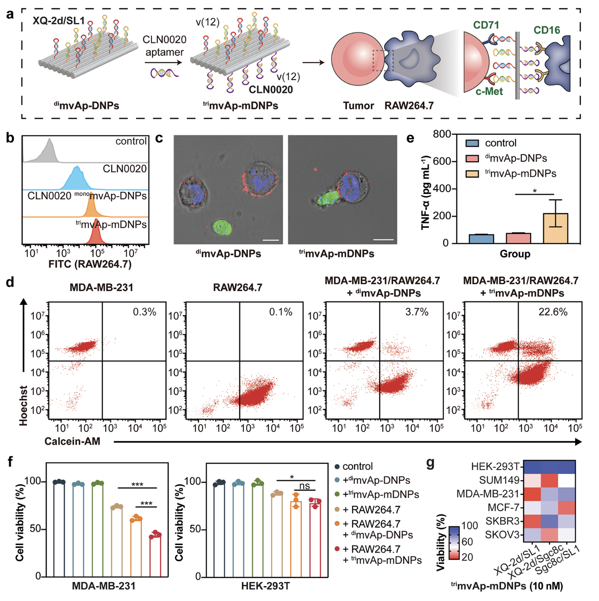

Tunable Multivalent Aptamer-Based DNA Nanostructures To Regulate Multiheteroreceptor-Mediated Tumor Recognition

基于可调节多价适体的DNA纳米结构 调节多个异性受体介导的 肿瘤识别

## 一、文章简介

## 二、文章内容

### Introduction

#### 背景

值得注意的是，大多数CSP在细胞膜（plasma membrane）上分布不均，并在动态的纳米尺度上以多价方式（multivalent manner）产生显著影响

- 这意味着它们的相互作用和功能往往涉及复杂的分子排列和多种多样的结合事件。5 
- 例如，严重急性呼吸系统综合征冠状病毒2型病毒（SARS-CoV-2）通过表面的刺突糖蛋白（S蛋白）和人类细胞表面的ACE2受体之间的多重结合增强了受体识别和膜融合，从而引发严重感染。6 

此外，多价识别也正在被探索用于治疗应用。例如，二价抗体和具有丰富靶向配体的纳米颗粒已被证明是抑制肿瘤生长的有前景的方式。8−10 特别地，CELL-SELEX技术使得可以从肿瘤细胞中直接选择基于寡核苷酸的适体，并结合到DNA折纸上。这表明可以通过调节各种参数促进靶向肿瘤识别的调节，这些参数例如适体的种类、价态、模式和折纸结构。20−24 

#### 提出新方法

在本研究中，我们在基于DNA折纸的纳米结构上安装了多价适体，通过调整适体的种类、价态、模式和折纸的几何结构来准确调节靶向肿瘤识别。

1. 我们首先研究了各种适体与不同细胞系的结合曲线，然后将它们杂交在片状（mvAp-DNP）或管状（mvAp-DNT）的纳米结构上。
   - 结果表明，**大多数mvAp-DNP（片状）主要存在于细胞表面，而大多数mvAp-DNT（管状）倾向于快速的内化。**
   - **通过将两种类型的适体结合在同一结构上，我们通过 多异性受体介导的识别 观察到了结合亲和力的显著增强。**
2. **之后，我们通过管状的mvAp-DNTs选择性地将治疗前药输送到肿瘤细胞中，并利用片状的mvAp-DNPs来引导用于免疫清除的巨噬细胞与靶向肿瘤细胞之间的特异性相互作用**
3. 这为精确调节个性化治疗的细胞识别提供了一个有前景的平台。

### Result And Discussion

#### Enhanced Immune Recognition by trimvAp-mDNPs.使用trimvAp-mDNPs增强免疫识别。

考虑到片状纳米颗粒更倾向于被捕获在细胞表面，我们探索了如何**增强免疫杀伤细胞对肿瘤细胞的识别能力**。巨噬细胞是重要的先天免疫细胞，能够吞噬细菌、衰老的细胞、异常的细胞以及肿瘤细胞，能够极大地影响抗肿瘤反应和免疫调节。43 

我们通过在一侧连接SL1和XQ-2d适体，以靶向MDA-MB-231细胞，在另一侧连接CLN0020适体（CD16），以结合RAW264.7细胞，设计了一种名为trimvAp-mDNPs的巨噬细胞募集器（图5a和图S21）。44 

- 图5：通过trimvAp-mDNPs 纳米结构(*v*(12)/*v*(12))增强免疫识别。
  - (a) trimvAp-mDNPs介导巨噬细胞对肿瘤细胞的识别。肿瘤（XQ-2d至CD71、SL1至c-Met）和巨噬细胞（CLN0020至CD16）。
  - (b) 游离CLN0020 适体（120 nM）、CLN0020 monomvAp-DNPs (10 nM)、rimvAp-mDNPs (10 nM) 对RAW264.7 细胞的识别。
  - (c) 在用10 nM dimvAp DNP或trimvAp-mDNP（Cy5，红色）处理1小时后，MDA-MB-231 (Hoechst 33342, 蓝色) 和 RAW264.7 (Calcein-AM, 绿色) 的细胞-细胞复合物的代表性共聚焦图像。
  - (d) 在用10 nM dimvAp-DNPs 或 trimvAp-mDNP 处理1小时后，对MDA-MB-231（Hoechst 33342）和RAW264.7（Calcein AM）的混合物中的细胞-细胞复合物进行流式细胞术分析。
  - (e) 用不同制剂处理6小时后，RAW264.7分泌TNF-α。数据均以平均值 ± 标准差表示，*n* = 3: \*P < 0.05。
  - (f) 用不同制剂处理6小时后，与RAW264.7细胞共培养的MDA-MB-231（或HEK-293T）的细胞活力。数据均以平均值 ± 标准差表示， *n* = 3: \*\*\*P < 0.001 和 \*\*P < 0.05。
  - (g) 在与用不同适体修饰的trimvAp-mDNTs（10nM）孵育24小时后，RAW264.7对不同细胞的毒性。

- 图S21：
  - (a) dimvAp-DNPs 和 trimvAp-mDNPs.的1%琼脂糖凝胶图像。在CLN0020适体上标记Cy5荧光基团。
  - (b)  trimvAp-mDNPs的AFM图像

trimvAp-mDNPs 通过多价相互作用有效识别RAW264.7（图5b），还直接地增强了MDA-MB-231（蓝色，来自Hoechst 33342）和RAW264..7（绿色，来自Calcein-AM）之间的相互作用，显示出清晰的纳米结构介导的细胞-细胞表面（红色，trimvAp-mDNPs）（图5c）。流式细胞术分析进一步证实，在trimvAp- mDNPs存在的情况下，约22.6%的肿瘤细胞与巨噬细胞结合，而在缺乏CD16结合适体的 dimvAp-DNPs组中，只有约3.7%的肿瘤细胞形成肿瘤-巨噬细胞复合物（图5d）。

巨噬细胞是先天免疫系统的中心效应物和调节因子，可以分泌促炎因子，如肿瘤坏死因子-α（Tumor Necrosis Factor-*α*，TNF-α），以增强抗原呈递和增强适应性免疫反应45,46当在不同制剂的存在下孵育RAW264.7和MDA-MB-231细胞时，我们用酶联免疫吸附试验（Enzyme-Linked Immunosorbent Assay ，ELISA）检测TNF-α水平。trimvAp-mDNPs 增强了细胞与细胞的相互作用，并诱导RAW264.7分泌高水平的TNF-α（是dimvAp-DNPs相比的3倍）（图5e）。

我们进一步评估了RAW264.7对肿瘤细胞的杀伤效果。由于细胞间结合增强，trimvAp-mDNPs极大地促进了RAW264.7对肿瘤细胞的消除(约60%)，但对正常细胞的毒性很小(约20%)。

最后，我们在trimvAp-mDNPs上组装了不同的适体对，并测试了它们激活巨噬细胞毒性的功效。与图4g中的dimvAp-dDNTs类似，具有XQ-2d/SL1的trimvAp-mDNPs诱导了MDA-MB-231和SKBR3的严重死亡，而具有XQ-2d/Sgc8c的trimvAp-mDNPs对SUM149和SKOV3有效，具有Sgc8c/SL1的trimvAp-mDNPs对MCF-7有效，这表明肿瘤细胞上的受体特征在治疗中起主导作用。

通过多价相互作用连接巨噬细胞和肿瘤细胞，我们的 trimvAp-mDNPs极大地激活了吞噬作用并增强了细胞因子（cytokine）分泌，在介导肿瘤细胞的靶向免疫清除方面显示出巨大潜力。

### Conclusions

总之，我们已经构建了基于可调节的多价适体的DNA纳米结构，以精确调节与肿瘤细胞中受体的相互作用。

适体为靶向肿瘤细胞表面的各种标记物提供了巨大的潜力，如蛋白质和糖基。

我们利用10个适体分析了12个细胞系中表面受体的特征，生成了一个热图来区分不同的肿瘤类型。然后，我们将适体安装到DNA折纸上，从而允许精确控制适体的拓扑结构，包括它们的种类、价态和几何模式。也就是说，适体的种类和价态在不同肿瘤细胞系的特异性摄取中起着至关重要的作用，而大多数片状结构主要被捕获在细胞表面，大多数管状结构倾向于快速内部化。通过在相同结构上结合两种类型的适体，我们使用管状 dimvAp-DNTs选择性地将治疗性前药递送到肿瘤细胞中，显示出通过多异质受体介导的内吞作用所提高的摄取率。我们还指导巨噬细胞和靶向肿瘤细胞之间的特异性相互作用，以使用片状trimvAp-mDNPs进行免疫清除。

我们的可编程多价系统提供了一个很有前途的平台，可以精确调节细胞识别，用于个性化肿瘤治疗。
