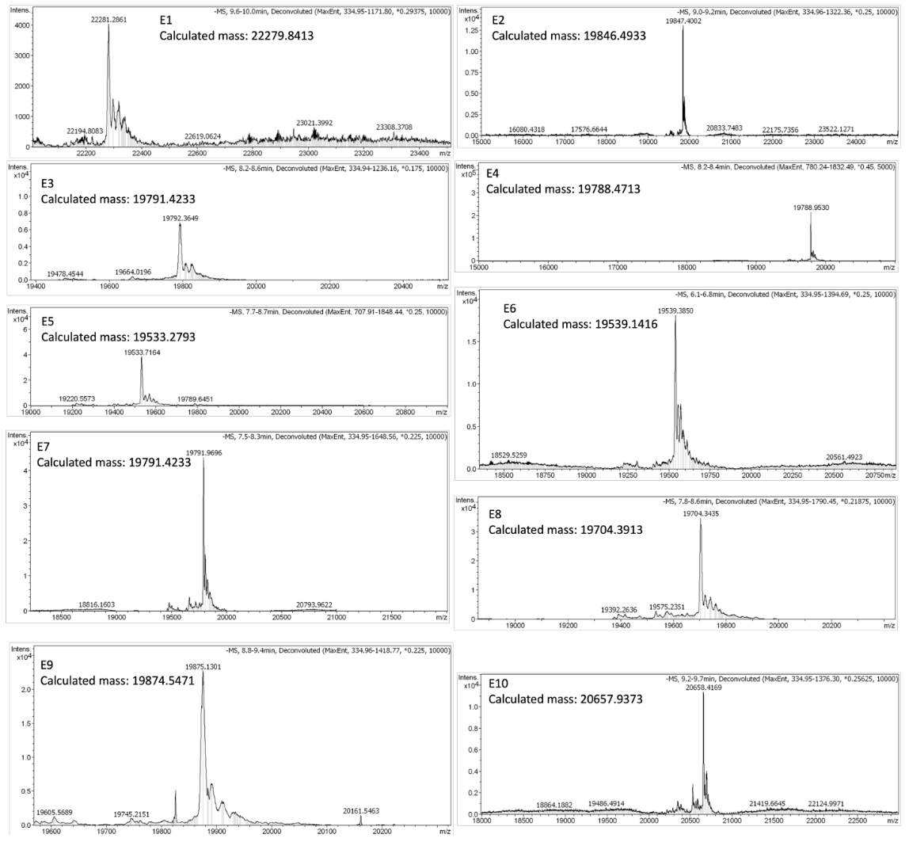

DNA-Mediated Peptide Assembly into Protein Mimics

DNA介导的 肽组装成蛋白质模拟物

## 一、

## 二、

### Abstract

**背景：**

由于蛋白质结构庞大的序列空间和蛋白质折叠的复杂性，**新蛋白质结构**的设计具有挑战性。

**研究总述：**

在这里，我们报道了使用一种新的模块化DNA模板来构建蛋白质模拟物的策略。

- 通过将多肽单元与DNA结合，并杂交成支链DNA三聚体模板，然后将预组织的肽共价缝合成单个单元，我们实现对多肽单元的空间控制。

- 已经高效地构建了具有不同长度、不同序列和不同七肽寄存器的蛋白质模拟物库。
- DNA模板化的蛋白模拟物形成了α-螺旋或卷曲线圈 motif ，即使它们是由弱相互作用的肽单元构建的。
- 它们附着的 DNA handles 可用于对蛋白质模拟物的二级和三级结构进行动态控制。

**意义：**

这种模块化的策略将有助于开发DNA编码的蛋白质库，以快速发现新的治疗方法、酶和抗体模拟物。

### Introduction

**背景：**

蛋白质由20种天然氨基酸和四个层次的结构组成，在生活的许多方面发挥着至关重要的作用。随着计算方法的进步和对蛋白质折叠原理的更好理解，1从头蛋白质 (de novo proteins) 的设计产生了新的结构和应用。2−4 

**α-螺旋：**

然而，由于蛋白质的巨大序列空间和结构复杂性，这一过程仍然具有挑战性。为了减少与更大的宏观系统相关的不断增长的计算的开销，并降低蛋白质的折叠复杂性，具有可预测结构的短肽 (short peptide) 片段已被用于组装从头蛋白质 (de novo proteins) 。5,6 其中一种这样的结构元素是α-螺旋。7 

> **α-螺旋*（α-helix）***是蛋白质二级结构的主要形式之一。指多肽链主链围绕中心轴呈有规律的螺旋式上升，每 3.6 个氨基酸残基螺旋上升一圈，向上平移0.54nm，故螺距为0.54nm，两个氨基酸残基之间的距离为0.15nm。螺旋的方向为右手螺旋。氨基酸侧链R基团伸向螺旋外侧，每个肽链的肽键的羰基氧和第四个N-H形成氢键，氢键的方向与螺旋长轴基本平行。由于肽链中的全部肽键都可形成氢键，故α-螺旋十分稳定。      
>
> （蛋白质是多肽）

**卷曲线圈 motif：**

两个或多个α-螺旋可以相互包裹，产生稳定的卷曲线圈 motif 。这些 motif 通常由七个氨基酸（七肽, heptad）重复序列组成，即 (abcdefg)*n* ，其中疏水性残基 (hydrophobic residues) 通常位于a和d位置以形成疏水核 (hydrophobic core)，带电残基 (charged residues) 位于e和g位置以形成有吸引力的盐桥 (salt bridges)。8 

对于自发的卷曲螺旋的形成，通常需要三个或更多的七肽重复序列（>21个氨基酸）来提供足够的稳定性，避免肽-肽之间的相互作用。9 卷曲螺旋 motif 可以由从头设计的肽片段10, 11组装而成，并且可以通过金属离子的螯合 ( chelation )、共价连接或与有机分子的结合来进一步稳定。12−15 

> 螯合作用(Chelation)指化学反应中金属离子以配位键与同一分子中的两个或更多的配位原子（非金属）连结而形成含有金属离子的杂环结构（螯环）的一种作用。类似蟹钳的螯合作用，故名。螯环的形成使螯合物比组成和结构相近的非螯合络合物具有更大的稳定性，这种由螯合作用引起的增加稳定性的效应称为螯合效应。例如，乙二胺与金属离子的螯合物就比氨的金属络合物稳定得多，而二乙基三胺的金属螯合物因同时形成两个螯环则更为稳定

此外，肽-肽的相互作用可以通过将它们与超分子模板效应 (supramolecular templating effects) 相结合来稳定，其中模板组装的合成蛋白（Template-Assembled Synthetic Proteins , TASP）已被证明有助于复杂蛋白质结构的产生。16−19 然而，由于它们的对称性，大多数TASP只能产生同源聚螺旋束 (homomeric helix bundles)。Arora等人通过使用线性有机合成技术，用两个七肽α-螺旋构建了螺旋模拟物，克服了典型的螺旋长度限制。20−22

**DNA三聚体：**

DNA是一种生物分子，由于其Watson−Crick-Franklin碱基配对相互作用，在其组装过程中表现出无与伦比的可编程性和可预测性。23,24随着DNA纳米技术的发展，已经产生了许多结构化 motif ，如Tile、25−28 DNA折纸、29−31多向junction、32−34以及杂交DNA聚合物和笼状结构。35−40它们可以在纳米尺度上精确地将材料定位成任意设计的对称或不对称模式。41,42 因此，DNA scaffold是组装具有精确空间排列的肽的理想模板。Bayley等人使用环形的DNA scaffold 来使相同的肽单元形成肽纳米孔。43Wengel等人使用DNA三链体作为模板，组装了具有三个七肽重复序列的同源三聚体 (homotrimeric) 卷曲螺旋 motif。 然而，DNA三链体形成的特殊条件限制了其对不同肽 motif 的适用性。

我们的团队之前开发了一种“打印”策略，将DNA链模式从DNA scaffold 共价转移到其他材料，如纳米颗粒41、聚合物42和小分子46,47。在后一种情况下，得到了一个以小分子为核心的分支结构，该核心共价连接到具有不同序列的DNA链上。这种结构具有最小数量的DNA链，并且是完全共价的，同时保持结构不对称性；因此，它可以作为一个强大的模板（1 in 图1b）。

- 图1：
  - (a) DNA肽轭合物形成的示意图。
  - (b) 通过CuAAC化学，形成的缝合异源三聚体DNA肽 (stapled heterotrimeric DNA-peptides) 的示意图。

**研究总述：**

在这里，我们报道了一种用于模块化生产从头蛋白质模拟物的通用的自下而上的方法。

- 肽单元与DNA链轭合（2 in 图1a），然后可以通过与作为模板的支链DNA小分子三聚体杂交，从而将其定位为特定的几何形状（1 in 图1b）。
- 共价的支链模板的简单性易于组装并提供了接近定量的产率。
- 与较大的DNA纳米结构相比，该模板还确保了肽单元的紧密接近以形成三级结构。不同序列的DNA链能够精确排列不同的肽链（II in 图1b），即使肽长度和相互作用不足以形成三级结构。此外，随后可以使用小的三酰肼分子 (small triazide molecule) 以良好的产率将N-末端上的炔烃官能团 (alkyne functional groups) 缝合，从而产生共价的DNA-肽三聚体 (III in Figure 1b)。已经构建了一个具有不同长度、不同序列和不同七肽寄存器的蛋白质模拟物库，其中包括不会独立地形成α-螺旋或卷曲螺旋 motif 的肽。结构III可以变性以形成完全共价的蛋白质模拟物 (IV in Figure 1b)。此外，其共价连接的DNA链可以用作结构化的handle，以进一步控制肽的构象，例如，动态调节从卷曲螺旋 motif 到随机的螺旋肽的肽相互作用。

由于其模块性，该方法将使未来能够创建固有DNA编码的新 (de novo )蛋白质文库，为新治疗方法、酶、抗体模拟物的高通量鉴定铺平道路。

### Results And Discussion

#### Protein Mimic Library Assembly and Synthesis.蛋白质模拟物库的组装与合成。

只有少数几个卷曲螺旋 motif 的实例等于或短于三个七肽重复序列，并且它们仅在具有额外的稳定相互作用的情况下形成。44,45,20,22 因此，我们首先将我们的方法应用于由21个氨基酸组成的异源三聚体螺旋束 (表 1, P1, P2, 和 P3)

 

- 表1：肽序列及其颜色编码。
  - 所有肽的N-末端用5-己炔酸(hexynoic) (炔烃官能团) 修饰，C-末端用−NH2基团封端。

肽序列的设计遵循三聚卷曲螺旋的折叠原理：10, 11, 48 异亮氨酸 (Isoleucines) 被放置在 a 和 d 位置以促进三聚卷曲螺旋的形成；有吸引力的带相反电荷的氨基酸被放置在 e 和 g 位置，以提供额外的稳定相互作用 ( 图2b )。

- 图2： 
  - (a) 三聚体DNA-肽纳米结构在5% nstive PAGE凝胶上的逐步组装。
    -  组装条件：将每个组分 (1μM) 在1 × PBS缓冲液中，在室温下混合5分钟，然后加载到凝胶上。
  - (b) 三个七肽异源三聚体的卷曲螺旋 E1 的螺旋轮示意图。
    - 红色圆圈：与DNA相连的共轭半胱氨酸 (cysteine);
    - 绿色圆圈：疏水性中心的氨基酸;
    - 蓝色圆圈：带正电荷的氨基酸;
    - 黄色圆圈：带负电荷的氨基酸。

肽单元是通过固相肽合成（Solid-Phase Peptide Synthesis ，SPPS）产生的，其N-末端具有炔基 (alkyne) ，C-末端具有半胱氨酸残基 (cysteine residue) 。以氨基终止的DNA链首先与bromoacetic acid N- hydroxysuccinimide ester 反应以安装bromoacetamide handle。然后，它们通过半胱氨酸残基 (cysteine residue) 的亲核取代 (nucleophilic substitution) 与肽共价共轭 (2 in 图1a)。另外，合成了具有三条不同DNA链的支链支架三聚体1 (图S1)。

- 图S1：纯化的scaffold的变性凝胶。
  - Lane 1: scaffold 三聚体 (scaffold trimer，ST), 
  - 2: scaffold trimer with 1 T central spacer (ST1T), 
  - 3: scaffold trimer with 2 T central spacer (ST2T), 
  - 4: scaffold trimer with 4 T central spacer (ST4T), 
  - 5: 超低量程ladder。
  - 泳道 x 表示与本研究无关的泳道。

> **DNA scaffold 三聚体的合成**
>
> 采用固相亚磷酰胺 (phosphoramidite) 寡聚体合成技术合成DNA scaffold 三聚体。反向亚磷酰胺（3'-DMT 5'-CED）用于合成第一支链，使其从 5' 到 3' 进行。然后，将不对称的分支的CED亚磷酰胺与DNA链偶联，并在去除DMT后从3'到5'进行第二支链的合成。用CAP溶液处理第二支链的5’端，并用0.5M 水合肼 (hydrazine hydrate) 在1∶1吡啶/乙酸 (pyridine/acetic) 中去除乙酰丙酸保护基( levulinyl protecting group) 10分钟，从而允许使用普通亚磷酰胺合成第三支链。将链在氢氧化铵 (ammonium hydroxide) 中从CPG上裂解，并通过变性PAGE凝胶纯化。

1的每个分支都有一个与肽共轭的DNA链互补的序列 (I in 图1b) ，从而实现在DNA杂交时控制肽片段的空间定位 (II in 图1b) 。分支模板1中的共价连接简化了自组装过程，导致模板上的三个不同肽单元的快速定量杂交，而不需要复杂的scaffold。因此，DNA-肽三聚体纳米结构II的组装可以在室温下，在几分钟内完成 (图2a) 。DNA组装后，使用苯三酰肼 (benzene triazide) 小分子，通过Cu(I)催化的叠氮化物−炔烃环加成技术（Cu(I)-catalyze Azide−Alkyne Cycloaddition，CuAAC）将II中的炔烃handle共价缝合在一起（III in 图1b）。P1、P2和P3的DNA-肽异源三聚体 IV 以良好的转化率产生 (图S5, 泳道1), 并通过反相（Reverse-Phase RP）HPLC分离（图S6）。

- 图S5：缝合反应原油 (crudes) 的变性凝胶
  - 所有凝胶均使用超低量程DNA ladder。
  - **a**) 具有不同肽长度的支链 DNA-肽三聚体。
    - Lane 1: 包含三个3-七肽的三聚体，
    - 2: 三个2-七肽，
    - 3: 两个2-七肽和一个3-七肽。
  - **b**) 具有DNA与肽共轭在不同位置的DNA-肽三聚体，以及弱的肽-肽相互作用。
    - Lane 4-6: 包含两个在f位置与DNA共轭的肽和一个在a位置与DNA共轭的肽的三聚体。
    - 在肽组合中存在排斥性螺旋间离子对。
  - **c**) 具有弱的肽-肽相互作用的DNA-肽三聚体。
    - Lane 7: 缺乏疏水性核心的肽组合，
    - 8: 具有排斥性离子对的。
  - **d**) 缝合在具有不同中心间隔物的scaffold上的DNA-肽三聚体E2。
    - 在每个 scaffold 模板化反应上观察到相似的转化率。
    - Lane 9: 用scaffold (ST) 模板化缝合反应
    - 10: scaffold trimer – 1 T (ST1T)
    - 11: scaffold trimer – 2 T (ST2T)
    - 12: scaffold trimer – 4 T (ST4T). 
    - 泳道 x 表示与本研究无关的泳道。

- 图S6: 表2中缝合的蛋白模拟物 (IV，图1b) 的分离产率和制备性RP-HPLC色谱 (preparative RP-HPLC chromatograph)。
  - X轴: time/mins; Y轴: A260/mAU. 
  - \* 表明DNA肽在HPLC注射前的Amicon 3K脱盐步骤中丢失；
  - \*\* 表明DNA-肽三聚体在HPLC分离过程中丢失。

> **单链共轭物与支链DNA-肽三聚体的结合**
>
> 将 DNA scaffold、sAT'-肽、sDT'-肽和 sHT'-肽在 1x PBS 中以 10/10/10/10 μM 混合，并在室温下孵育 1 小时，然后进行缝合反应。将CuSO4 (2 mM), THPTA (5 mM), 1,3,5- tris(azidomethyl)benzene (25 µM), 和sodium ascorbate (12 mM) w依次添加到单独的Eppendorf管中，并在1x PBS/DMSO=4/1下室温孵育15分钟。随后将混合物添加到DNA溶液中，最终浓度如下：DNA assembly (5 µM), CuSO4 (1 mM), THPTA (2.5 mM), 1,3,5-tris(azidomethyl)benzene (12.5 µM), sodium ascorbate (6mM), DMSO (10% volume)。将反应溶液在37°C下孵育1小时。随后加入1体积的8M尿素水溶液，通过Amikon®Ultra-0.5mL离心式过滤器 3 kDa MWCO Millipore（30分钟，13.000RPM）浓缩变性粗产物，并在同一过滤器中用4M尿素洗涤两次，用Milli-Q水洗涤两次。然后通过RP-HPLC纯化脱盐的样品（图S6）。
>
> HPLC方法如下：
>
> - 0-2分钟：TEAA/ACN=97/3；
> - 2-5分钟：TEAA/ACN从97/3到85/15；
> - 5-32分钟：TEAA/ACN从85/15到75/25；
> - 32-35分钟：TEAA/ACN=75/25。
> - 将含有支链DNA-肽三聚体产物的部分冻干并通过ESI-MS进行表征。

- 表2：蛋白质模拟物库的范围。
  - 二级结构通过CD光谱测定。
  - 全光谱 (Full spectra) 如图S9（减去DNA信号前）和图S10（减去DNA信号后）所示。
  - 所有缝合的蛋白模拟物 (IV in 图1b) 均通过质谱法 (mass spectrometry) 进行表征（图S7）。

- 图S9：构建体E1-E10在减去DNA信号之前的CD光谱。
  - 蓝色：单链DNA-肽I；
  - 橙色：双链DNA-肽II；
  - 黄色：双链三聚体III；
  - 紫色：单链三聚体IV。

- 图S10：构建体E2-E10在减去DNA信号后的CD光谱。
  - 蓝色：单链DNA-肽I；
  - 橙色：双链DNA-肽II；
  - 黄色：双链三聚体III；
  - 紫色：单链三聚体IV。

> **DNA-肽偶联物的CD表征**
>
> 将组装好的结构装载在1 mm的石英试管中，并在20°C下在JASCO J810圆二色仪中进行表征。在所有情况下，灵敏度设置为标准，D.I.T.为4秒，条带宽度为 2.00 nm，扫描速度为100 nm/min。为了比较不同构建体的CD光谱，使用以下方程计算平均残基摩尔椭圆率：
>
> 𝜃(𝑑𝑒𝑔 ∙ 𝑐𝑚2 ∙ 𝑑𝑚𝑜𝑙−1) =𝐸𝑙𝑙𝑖𝑝𝑡𝑖𝑐𝑖𝑡𝑦(𝑚𝑑𝑒𝑔) × 105 / (𝑙 × 𝑐 × 𝑛)
>
> 其中椭圆度率 ( *Ellipticity* ) 是仪器的原始输出，l (cm) 是路径长度，c (µM) 是纳米结构的浓度，n是每个结构中的氨基酸数量。

- 图S7：表2中的缝合的蛋白模拟物的MS表征（IV in 图1b）。

总体而言，该方法在蛋白质模拟结构的合成方面表现出高效率。

大多数de novo 蛋白质设计依赖于肽-肽相互作用来提供足够的稳定性。

因此，当使用具有短长度的或较弱相互作用的肽时，它们的效率将受到限制。为了检验我们的方法是否可以解决这个问题，将该方案应用于具有两个七肽的卷曲螺旋motif，其中不能自行形成稳定的高阶蛋白质结构（如α-螺旋和卷曲螺旋 motif ）。我们设计并合成了八条肽链（表1，P4−P11），它们具有不同的七肽寄存器 ( heptad registers)、疏水成分 (hydrophobic compositions) 和带电氨基酸 (charged amino acids.) 。肽之间的结构差异将在下一节中讨论。利用模块化合成的优势，将每个肽分别结合到DNA链上，然后缝合成任意预先设计的组合，从而容易地产生蛋白质模拟物库。使用变性聚丙烯酰胺凝胶分析合成范围（图3）。

- 图3： 使用 12%的尿素变性 PAGE (聚丙烯酰胺) 凝胶分析蛋白质模拟物合成的范围。

在所有情况下，主条带 (转化率～60−70%) 对应于期望得到的DNA-肽三聚体。此外，DNA−肽二聚体和起始材料仅检测到微弱的条带。值得注意的是，即使是肽-肽相互作用最弱的组合也表现出相似的产量（图3，泳道4和6−13；图S5，泳道4-8），这可能是由于使用DNA  scaffold时，肽的高有效浓度所导致的。因此，这种模块化方法可以同时通过DNA介导的预组织和小分子缝合，来确保弱相互作用的肽序列的定位。

#### Protein Mimics Structural Analysis.蛋白质模拟物结构分析。

在建立了一种适用于一系列不同肽组合的通用方案后，我们使用圆二色性（Circular Dichroism，CD）来研究DNA组织、共价缝合和肽一级序列对蛋白质模拟物二级和三级结构的影响。分析了10个具有不同肽组合的构建体（表2）。虽然天然的卷曲螺旋motif需要至少三到四个七肽的长度，但之前的工作表明，当通过模板或有机连接体稳定时，可以形成较短的卷曲螺旋。22,44 因此，我们首先研究了长度为三个七肽重复序列的异性卷曲螺旋（E1，图2b）。当肽片段在没有scaffold或stapling的情况下混合时，它们在CD光谱中在202nm处显示出负峰 (图4d（E1 I，蓝色) )，对应于随机线圈二级结构。另一方面，通过将三聚体DNA-肽与三聚体scaffold组装，在208和222nm附近观察到具有两个负峰的α-螺旋图案 (图4d (E1 II, 橙色))。此外，通过用DNA模板和小分子stapling来限制结构，两个峰的比例接近于1 (图4d (E1 III，黄色)) ：这表明α-螺旋相互作用形成几乎卷曲的螺旋 motif。即使在没有DNA scaffold的情况下，缝合的DNA-肽三聚体也表现出α-螺旋二级结构，其比率为0.8 (图4d (E1 IV，紫色)) 。

- 图4：CD结构分析
  - (a) 二-七肽异性三聚体卷曲线圈 E2 和二-七肽同性三聚体卷曲线圈（b）E3和（c）E4。
  - (d) 单链DNA-肽I(蓝色)、双链DNA-肽II(橙色)、双链三聚体III(黄色)和单链三聚体IV(紫色)中E1的CD谱图。
  - (e) E2（蓝色）、E3（橙色）和E4（黄色）的双链三聚体III的CD光谱。减去DNA信号并计算摩尔椭圆率（θ）（表S2），以比较不同浓度下的不同结构。

- 表S2：样品制备程序。n=用于计算平均残基摩尔椭圆率的氨基酸数量(**SI VII-3**)。

> **DNA纳米结构的组装**
>
> 将所有结构组装在含有138.2mM NaF、10mM Na2HPO4和1.8mM NaH2PO4的1x NaF缓冲液（pH＝7.4）中，以在CD光谱的短波长区域中获得干净的背景。装配方案如下：a.RT 30分钟；b.在60分钟内达到95至4°C；样品制备程序如下表所示（表S2）。

然后，我们将肽与三种七肽和两种七肽进行了比较。E2由肽P4−P6组成，其序列促进异性三聚体卷曲螺旋的形成，但比P1−P3短一个七肽 (图4a) 。它们的半胱氨酸 (cysteines) 在每个螺旋轮外侧的f位置与DNA共轭（图4a，带有红圈的残基）。P7是一种基于四-七肽保守肽序列的两个七肽，其促进同源三聚体卷曲线圈的形成 (E3; 图4b)48 。在P8中，肽P7的谷氨酸 (glutamic acid) 被谷氨酰胺 (glutamine) 取代，为肽提供净正电荷，E4是P8的同源三聚体（图4c）。除了由两个七肽组成外，肽P7和P8在每个螺旋轮内的a（而不是f）位置具有半胱氨酸单元（图4b，c，带红圈的残基）。这允许检查DNA肽结合位置对产量和结构的影响。三聚体E2−E4均以良好的产量生产（图3，泳道1和2；图S5，泳道2）。与E2相比，E4表现出更稳健的卷曲线圈CD光谱模式（图4e）。这种增强的螺旋线圈形成可归因于在每个线圈的内表面上共轭点的位置（图4c），这为螺旋线圈组件提供了更有利的构象。相反，在E2的情况下，外表面上的结合位置倾向于将肽彼此分离（图4a）。此外，E4和E3之间值得注意的区别在于中性谷氨酰胺取代了位置“c”处带负电荷的谷氨酸（图4b）。

在同一α-螺旋内，c处的谷氨酸与附近的g处的精氨酸形成分子内盐桥，削弱了其与相邻α-螺旋中谷氨酸残基的分子间相互作用。用谷氨酰胺取代它可以防止这种二级分子内相互作用，从而产生更强的螺旋间肽-肽相互作用。值得注意的是，即使在如此短的长度下，在模板和缝合的结构上也观察到卷曲线圈的形成（图4e）。这表明dual DNA和stapling约束可以有效抵消熵惩罚，从而稳定短肽片段并促进肽-肽相互作用。

因此，我们的方法可以克服传统的线圈长度限制。先前只报道了少数未模板化的三聚体异性卷曲螺旋motif的例子：11,12,49 我们的结果也表明，即使使用含有二-七肽的肽，也会形成异性卷曲螺旋motif。

尽管它们的长度很短，但构建体E1−E4在其序列中仍然保留了螺旋间的稳定力。于是出现了一个问题：即使有弱相互作用的肽序列，卷曲的线圈模拟物还能形成吗？据我们所知，这一方面以前没有进行过探索。因此，研究了具有吸引力较低的盐桥E5（图5a）、受损的疏水核E6（图5b）和排斥离子对E7（图5c）的肽组合。

- 图5： 
  - (a) E5的螺旋轮，少盐桥
  - (b) E6的螺旋轮，具有受损的疏水核心
  - (c) E7的螺旋轮，具有螺旋间排斥离子对
  - (d) 带有E5（蓝色）、E6（橙色）和E7（黄色）的双链三聚体III的CD光谱。

有趣的是，在三聚体scaffold和有机的stapling的存在下，所有构建体都表现出从随机线圈到有组织的构象的转变。在盐桥减少的结构E5上甚至观察到卷曲线圈的CD图案（图5d（E5 III，蓝色））。仅使用DNA模板（图1b，结构II）或仅使用小分子stapling（图1b、结构IV），E7中的肽二级结构保持为随机螺旋（表2和图S10）。然而，对于这两种稳定特征，在CD光谱上显示λ222nm和λ208nm之间的比率为0.7，表明形成了α螺旋二级结构（图5d（E7 III，黄色））。在具有弱化疏水核心的构建体上获得了类似的结果（图5d（E6 III，橙色）和图S10（E6））。因此，具有不稳定一级结构的短肽也可以通过这种方法组装，这使得能够从未发现的序列空间合成和研究多肽构建体。

我们进一步将我们的方法应用于更异构 (more heterogeneous) 的蛋白质模拟物。由于它们缺乏对空间排列的精确、外部控制，并且依赖于内在的肽-肽相互作用，以前的方法无法将高度分化 (divergent) 的肽片段带入单一结构。为了实现这一目标，我们合成了三种不匹配的构建体：

- （1） E8，其具有三种肽的任意序列组合（图6a），包括来自三个不同卷曲线圈的肽
- （2） 位置错配E9（图6b），涉及具有不同七肽寄存器的肽的组装，即一个肽在a位置与螺旋轮内侧的DNA结合，两个肽在f位置与外侧的DNA结合
- （3）长度失配E10（图6c），其包含不同长度的肽

所有构建体都是在没有观察到产量受损的情况下产生的，并且仅在DNA scaffold和小分子stapling的双重存在下表现出卷曲的螺旋或α-螺旋构象（图6d）。

- 图6： 
  - (a) E8的螺旋轮，具有任意序列组合
  - (b) E9，位置不匹配。
  - (c) E10，长度不匹配。
  - (D) 带有肽序列E8（蓝色）、E9（橙色）和E10（黄色）的双链三聚体III的CD光谱。

总之，这里测试的所有结构参数都不损害蛋白质模拟物的形成以及DNA和staple-促进的二级和三级结构的形成。这种方法用途广泛，当使用不同的肽时，超过了结构类似物的传统组装方法。

#### Effect of the DNA Handle on the Peptide Secondary Structure.DNA handle对肽二级结构的影响。

高度可编程的DNA碱基配对的集成赋予了纳米结构精确的空间控制和动态特性。50−53 利用这些合并的DNA链 (incorporated DNA strands) 的存在，我们研究了它们对肽构象的影响。我们首先考察了三聚体 scaffold 中心长度的影响。合适的 linker 有望将蛋白质模拟物正确地结合在一起，而过度的柔性会导致整体构象的破坏。为此，我们合成了以不同数量的胸腺嘧啶单元作为中心间隔物的三聚体 scaffold，并将其与携带序列集E2的DNA-肽偶联物杂交 (图7a)。

- 图7：
  - (a) 用scaffold组装并共价缝合顶部的纳米结构的示意图。X=DNA模板中胸腺嘧啶 (thymidines) 的数量。
  - (b) Three-Way Junction (3WJ) 中DNA−肽三聚体E5的示意图。
  - (c) 线性DNA scaffold 上拉伸 (stretched) 的DNA-肽三聚体E4的示意图。
  - (d) E2 DNA−肽三聚体在具有不同中心间隔物的三聚体 scaffold 上的CD patterns：0T，蓝色；1T，橙色；2T，黄色；和4T，紫色。肽-肽相互作用的强度由θ222nm/208nm（绿色虚线）表示。
  - (e) Three-Way Junction (3WJ) 组装体的5%天然PAGE凝胶。
    - 泳道1 :3WJ，中心为拉伸的DNA-肽三聚体E5；
    - 泳道2: 3WJ，中心只有DNA链。
  - (F) 拉伸的E4 DNA−肽三聚体的CD光谱。

这些组装逐渐扩大了三种肽之间的角度，原则上应该削弱肽-肽的相互作用。观察到DNA-肽三聚体E2和所有scaffold的定量组装（图S11a）。

- 图S11： 
  - **a)** DNA-肽三聚体E2与ST（道1）、ST1T（道2）、ST2T（道3）和ST4T（道4）组装的天然凝胶表征。
  - **b)** DNA背景消减前在不同 scaffold 上组装的双链E2三聚体的CD光谱。
  - **c)** PyMol中的含有有机连接的拉伸2-七肽分支的估计长度。

> **调整scaffold中心的spacer**
>
> 将单链DNA-肽三聚体E2与1当量的具有不同中心间隔物（ST、ST1T、ST2T和ST4T）的 scaffold 三聚体在1x NaF中混合。将混合物在60分钟内从95℃退火至4℃。使用5%的天然PAGE凝胶来检查组装。随后通过CD分析组装的纳米结构（1µM）。

随后的CD测量揭示了递减的结构相互作用卷曲螺旋的模式（图7d）。由于肽-肽相互作用的强度由222和208 nm的相对CD信号表示，我们观察到，当存在1 T (∼4.9 Å) 中心间隔物时，该比率从0.8增加到1.0（图7d，橙色），表明螺旋间力的提升。然而，随着柔性单链中心区域分别延伸至2 T (∼9.8 Å) 和4 T (∼19.6 Å)，该比率随后降至0.7（图7d，黄色）和0.5（图7d，紫色）。这与DNA handle 可以改变肽单元之间的角度并调节其相互作用的假设一致。

由于肽-肽的相互作用可以调节成紧凑的纳米结构，我们想知道是否可以使用DNA handle 和更刚性的DNA scaffold 进一步拉伸蛋白质模拟物。我们的团队之前已经构建了一个Three-Way Junction（3WJ），其间隙直径为∼30 Å.46 这种刚性连接将以相对拉伸的几何形状容纳具有两个七肽重复序列的共价连接的DNA-肽三聚体（图7b），估计每个分支为~4.4nm（图S11c）。将单链DNA-肽三聚体E5与3WJ scaffold 链组装。有趣的是，即使肽的拉伸程度越来越高，3WJ scaffold 上单链蛋白模拟物的杂交也几乎是定量的（图7e，泳道1）。由于3WJ scaffold 的DNA含量高，因此不能用CD分析肽的二级结构。因此，我们使用了一种更简单的DNA设计来分离和间隔α螺旋。将三聚体E4与另外两条DNA链杂交（图7c和图S12b）。

- 图S12： 
  - **a**) 拉伸三聚体和拉伸 scaffold 的示意图。拉伸三聚体（间隔=15bp），由E4三聚体/A5/D15=1/1/1组成；拉伸三聚体（间隔=25bp），由E4三聚体/A25/D25=1/1/1组成；拉伸scaffold（间隔=15bp）由A15/D15=1/1组成；拉伸scaffold（间隔=25bp）由A25/D25=1/1组成。
  - **b**) 组装的拉伸三聚体和拉伸scaffold的5%天然PAGE凝胶。
  - **c)** 在去除DNA信号（蓝色）之前拉伸scaffold（橙色）和拉伸三聚体E4的CD表征。在1x NaF中扫描1.5µM中的每个结构。

> **通过拉伸DNA scaffold 控制肽-肽相互作用**
>
> 将单链DNA-肽三聚体E5与1 eq. 的3WJ scaffold（表S1）在1x NaF中混合，最终浓度为2µM。然后将溶液在6.5小时内从95℃退火至4℃。用5%天然凝胶检查组装（图7e）。为了通过简单的DNA scaffold 控制肽的二级结构，在60分钟内将E4三聚体与具有不同间隔物的等量拉伸链（表S1）从95°C退火至4°C。
>
> 通过天然PAGE凝胶检查组装。当E4三聚体与具有25bp间隔的拉伸scaffold（sDTs25，sATs25）组装时，观察到高阶结构，该间隔几乎是两个肽分支长度的两倍。因此，将具有15bp间隔的拉伸scaffold（sDTs25，sATs25）应用于E4三聚体以进行CD表征。

这种结构预计会比3WJ scaffold 结构产生更大的拉伸。当三聚体在 scaffold 上拉伸时，在CD上观察到卷曲线圈图案的消失（图7f）。因此，连接的DNA handle 可以提供对肽的二级构象的完全控制。这种方法能够产生具有不同几何形状和刺激响应功能的动态的可调的蛋白质模拟物。

#### Assessment of Thermal Stability. 热稳定性评估。 

为了更好地了解我们结构的折叠途径，在具有卷曲线圈二级结构的构建体E5上进行了可变温度下的CD和紫外线（UV）测量。熔化研究显示，随着温度的升高，205−208 nm处的CD负峰向200 nm左右移动，222 nm处的负峰信号增加（图8a）。

- 图8：Thermal stability studies. 
  - (a) 不同温度（20−70°C）下的CD光谱。
  - (b) 不同温度下222和245nm的CD信号。
  - (c) 不同温度下的UV-260吸光度。
  - (d) 具有肽序列E5的双链三聚体III的熔化途径示意图。

这些观察结果共同表明了从卷曲线圈构象到随机线圈结构的转变。肽构象为222nm处的CD信号（图8b，蓝色），而DNA成分为245nm处的CD-信号（图8b，橙色）。此外，当222 nm（肽-肽相互作用）和245 nm（DNA杂交）处的CD信号被绘制为温度的函数时，这两条曲线之间存在峰值趋势的相关性。这表明组装结构III通过DNA碱基配对和肽-肽相互作用而稳定。这两条曲线在36°C左右出现第一次突变，在62°C左右发生第二次突变，表明存在两步熔融途径。我们还通过UV/vis光谱在260nm处测量了热变性 (thermal denaturation) ，显示DNA熔化温度为62°C（图8c，蓝色），这与CD研究显示的第二个转变一致。蛋白质模拟物中CD信号在较高温度下的变化被认为是DNA熔化，这与UV研究一致，而在较低温度下的转变被认为是卷曲线圈熔化。在由三个2-七肽片段组成的另一个构建体E8 III上观察到类似的过渡模式（图S15）。

- 图S15： 
  - **a**) CD melting curve at 222 nm. CD在222nm处的熔化曲线。
  - **b**) CD melting curve at 245 nm. CD在245nm处的熔化曲线。
  - **c**) E8 III熔化途径的示意图。

> **E8 III（3（2-七肽））的热变性**
>
> 如图S15所示，E8 III也显示出类似于E5 III的两阶段熔融模式（图8），其包含相同长度的肽。222（图S15a）和245（图S15b）nm处的CD熔解曲线显示出同步模式，第一次转变发生在36°C，第二次转变在60°C左右。鉴于结果与E5 III的结果相似，我们因此推断E8 III遵循类似的融化途径（图S15c），其中，随着温度的升高，肽-肽相互作用首先中断，然后是DNA变性。

因此，我们推断，当三个2-七肽构建体的温度升高时，卷曲的螺旋相互作用首先在36°C变性，然后在62°C熔化更强的DNA相互作用（图8d）。我们还测量了仅由DNA scaffold 或共价 linker 保持的肽组装体的热变性，以及3-七肽和长度不匹配的组装体 (Supplementary Information, section IX)。这项研究揭示了包含两种超分子语言（肽和DNA相互作用）的多组分纳米结构的复杂折叠途径。

### Conclusions

总之，我们展示了一种简单而通用的组装蛋白质模拟结构的方法。

使用共价连接的DNA-小分子分支杂交体作为scaffold，可以实现肽单元的快速而干净的组装。与依赖于肽-肽相互作用的传统组装方法不同，这种方法允许以模块化方式将任意肽二级结构交联成一个单独的单元。因此，我们的方法能够探索蛋白质材料的新结构空间和新氨基酸空间。现在，肽可以针对生物或催化活性进行优化，不受典型蛋白质折叠要求的限制。DNA scaffold 和小分子 stapling 提供了主要的稳定相互作用，使肽能够折叠成α-螺旋或卷曲的线圈基序，即使它们只有有限的长度和相互作用。高度可编程的DNA结构 handle 的集成能够进一步调节肽构象，为组装过程增加额外的多功能性和控制层。此外，用不同的DNA结构 scaffold 作为模板，可以有效地合成不同亚基数量、不同多肽取向和不同有机连接的多肽结构。我们希望这种方法能启发未来对未发现的和困难的肽序列空间的探索。通过将DNA纳米技术和肽折叠原理相结合，可以生产出具有新功能的新蛋白质模拟物。

该方法的模块化性质允许生成天然DNA编码的大型蛋白质模拟物文库，并可用于发现新的治疗方法、酶或抗体模拟物。

### DNA sequences

- 表S1：Linear DNA sequences used in this study.

