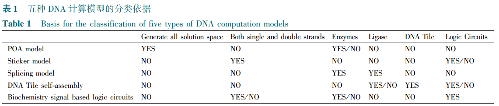

# 一、文章简介

**1、题目**

- 化学中的计算——DNA计算的发展与模型概述

**2、分区与影响因子**

PROGRESS IN CHEMISTRY

# 二、文章内容

## 1、摘要

DNA计算因其超强的信息存储、大规模的并行计算能力和超低的能耗而受到了广泛的关注。

- 本文首先对DNA计算的基本原理和实验、操作手段进行了简单的介绍
- 然后对DNA相关的理论进行了阐述
  - 包括DNA计算中序列编码设计的理论
  - DNA计算模型复杂度分析与通用计算能力的证明
- 在此基础上，对突破性的DNA计算模型进行了概括，进而根据实验操作的具体手段将所有已知模型进行了分类，并随后挑选了该类别中经典的模型进行更为直观的分析。 
- 在文章的最后，结合笔者的工作对，DNA计算领域的前景进行了展望。

**关键词：**

- DNA计算
- NP难问题
- 并行重叠组装模型
- 粘贴模型 
- 剪接模型 
- DNA Tile自组装 
- 生化信号逻辑门

## 2、引言

- **背景：**作为20世纪三大科学革命之一，计算机技术的发展给人类社会的进步带来了空前的推动作用
- **挑战：**

  - 计算机研究者们将计算问题划分为三类：容易、困难和不可计算。 
    对于容易类的计算问题，目前的电子计算机可以轻易地胜任；但是对困难类的计算问题，即我们常说的NP问题（non-deterministic polynomial，非多项式时间可解），随着问题规模的增大，计算所需要的时间呈指数级别增长，传统计算机难以维持。 
  - 此外，随着计算机制造工艺的不断发展，芯片上集成的晶体管数量逐渐接近极限，量子效应越发明显， 因此，科学家们致力于寻找其他全新的计算机结构，试图有效地解决这些问题。
- **提出的新方法：**

  - DNA计算是一种以<u>DNA分子</u>与<u>相关的某些生物酶</u>作为基本材料，以<u>某些生化反应</u>为基础的新的计算模式。 
    - 解应用题：
      - 题 --> 用DNA序列、酶定义
      - 解 --> 生化反应
  - 其基本思想是利用DNA分子特殊的双螺旋结构和碱基互补配对原则，将所要处理的问题编码为特定的DNA分子，通过一系列的生物化学反应和基础的实验操作，来实现运算的过程
- **DNA计算的优势[1~3]：**
  - （i）高度并行性，DNA计算机在一周内的运算量相当于所有电子计算机问世以来的总运算量；
  - （ii）储存量大，DNA作为遗传信息的载体其信息存储容量之大可达到一立方米溶液中存储一万亿亿比特的二进制数据，远远超过目前所有电子计算机的总存储量；
  - （iii）耗能低，DNA计算所消耗的能量只有一台电子计算机完成同样计算所消耗能量的十亿分之一。
- **研究现状 ：**
  - 1961年，Feynman[4]提出了分子计算的概念，但是由于受到当时的实验条件、材料、生物技术等方面的限制，他的构想并没有真正得以实现。 
  - 1982年，Seeman[5]提出了利用DNA分子构造各种简单构件的思想。 
  - 1994年，Adleman[3]首次提出了哈密尔顿有向路问题的DNA分子生物计算方法，并成功地在装有DNA溶液的试管中进行了实验，开创了计算科学的一个新领域，具有十分重大的意义，这一重大成果很快引起了数学、计算机、 生物学等领域的研究者们的广泛关注。 
  - 1995年，Lipton[6]提出基于DNA计算求解可满足性问题的模型，将DNA序列映射为布尔矢量，通过一系列的溶液分离与合并操作， 最终筛选出满足条件的解。
  - Seeman[7]首次提出了利用DNA分子构成自组装Tile(瓦片)结构,他利用其中一种DX Tile结构建立多种复杂的算法模型[8]
  - 对于二维的自组装模型,Winfree称其为“Tile 自组装模型” ,它是建立在Wang等[9]提出来的Tile理论基础上的;
  - 1995年,Winfree[10]提出利用DNA Tile自组装模型进行计算的重要思想, 并证明了二维自组装模型有通用计算能力;
  - 2000年,Mao等[11]首次通过实验给出了自组装DNA计算模型求解累积异或运算的实现过程和方法｡
  - 1997年,Ouyang等[12]提出了求解6顶点图的最大团问题的DNA计算模型,该方法通过分析原图的补图,利用酶切的方法来缩小解搜索空间,并且对顶点的0和1进行了不同长度的编码, 使得可以通过琼脂糖凝胶电泳测得的DNA序列的长度来判断最大团的大小｡ 
  - 其后,Eng[13]提出了一种基于DNA表面计算求解可满足性问题的计算模型｡ 
  - 1997 年,Hagiya等[14]首次将单链DNA分子形成的发卡结构用于Booleanu⁃formula 的学习问题,利用该结构实现了分子的自动控制问题｡ 
  - Head等[15]首次使用质粒DNA模型求解了一个6顶点图的最大独立集问题｡
  - Sakamoto等[16]通过将逻辑运算的约束编码用于构造DNA分子, 成功地利用这种自发形成的二级结构解决了6变量的可满足性问题｡ 
  - 2002 年,Braich等[17]提出了粘贴DNA计算模型,并运用该模型成功求解了20变量的可满足性问题｡
  - 以上是现有的所有DNA计算的基本模型, 其他的模型都是在此基础上的变形, 或者是针对其他特定问题的应用｡ 从实验环境来看, DNA计算可以分为基于试管的DNA计算和基于表面的DNA计算｡ 
  - 根据研究者们的设想, DNA计算的最终发展目标是基于芯片的DNA计算, 这一目标迄今为止还没有真正的实现｡ 
  - 而对不同模型更为细致的划分为: 粘贴模型､剪接模型､表面模型､芯片模型､发夹DNA模型､质粒DNA模型､自组装DNA模型､插入删除模型､图灵机DNA计算模型､布尔计算模型｡ 
  - 本文根据实验的具体操作将所有模型分为五种, 分别是并行重叠组装模型､粘贴模型､剪接模型､DNA Tile自组装模型和基于生化信号的逻辑门构建模型｡

## 3、DNA计算的基本原理与基础实验操作

### 3.1、DNA计算的基本原理

**DNA分子：**

- 随着分子生物学的发展，人们逐渐认识到脱氧核糖核酸（Deoxyribonucleicacid，DNA）是生物体的主要遗传物质，它是一种高分子化合物，由脱氧核苷酸构成
- 每个脱氧核苷酸包含一分子磷酸、一分子脱氧核糖和一分子含氮碱基
- 根据含氮碱基的不同， 脱氧核苷酸又可以划分为腺嘌呤（Adenine，A）、鸟嘌呤（Guanine，G）、胞嘧啶（Cytosine，C）和胸腺嘧啶（Thymine，T）脱氧核苷酸 。

**DNA的双链结构：**

- 相邻的脱氧核苷酸分子通过脱氧核糖和磷酸基团之间的磷酸二酯键连接，形成单链DNA
- 根据这两个基团的位置和顺序，对DNA的方向进行了规定：脱氧核糖具有羟基的一端为３′端，磷酸基团的那一端为５′端
- 两个单链DNA分子可以通过脱氧核苷酸的含氮碱基之间的氢键形成稳定的双链DNA结构。
- 碱基的化学结构决定了只有在A和T之间，G和C之间才能形成 稳定的氢键，其中A和T之间形成两个氢键，G和C之间形成三个氢键，从而G和C的含量越高，DNA双链越稳定
- 由于氢键属于次级键，即分子间弱相互作用，DNA双链在温度升高时，会逐渐发生氢键的断裂，直至形成两个单独的DNA单链；而随着温度的下降，碱基之间再次根据互补配对的原则形成氢键，恢复成双链结构。 

**DNA计算的基本原理：**

就是利用DNA双链间碱基互补配对的原则，将特定的计算问题编码为相应的DNA分子序列， 通过序列之间的特异性识别与配对，以及一系列的生化反应的操作，实现问题的求解过程。 由于DNA序列之间的反应是并发进行的，每试管溶液中有大约1018个DNA分子，因此与其他计算体系相比，DNA计算具有高度的并行运算能力。

### 3.2 、DNA计算的基础实验操作

- 合成（synthesizing）：通过DNA合成技术（ 一般采用固相亚磷酰胺三脂法） 合成制定的DNA序列； 
- 解链（melting）：升高溶液的温度，破坏DNA双链结构，形成两条单链； 
- 退火（ annealing）：降低溶液反应温度，使得两条互补的单链在碱基配对原则下形成稳定的双链； 
- 分离 （separation）：对于长度存在显著差异的DNA链，可以采用凝胶电泳的方式进行分离；对于碱基序列存在显著差异的DNA链，可以采取亲合层析的技术进行分离； 
- 混合（merge）：将两个试管内具有不同特征的DNA序列放入到同一个试管内，并摇匀； 
- 添加 （append）：在DNA链 的３′ 端添加新的碱基； 
- 剪切（splicing）：利用外切酶和限制性内切酶实现对DNA序列的特异性切割； 
- 连接（ligation）：在DNA连接酶的作用下，消耗ATP或NAD水解产生的能量，催化DNA链的5-PQ4基团与另一DNA链的3-OH生成磷酸二脂键； 
- 设置（set）：将试管中所有DNA链某一位置对应的值全部变成 “1” ，这一操作由加入对应位置的互补片段使其杂交成为双链来实现； 
- 清除（clear）：将试管中所有DNA链某一位置对应的值全部变成 “0” ，这一操作通过加热使得双链解链为单链来实现； 
- 复制（amplification）：采用聚合酶链式反应（ polymerase chain reaction，PCR）技术，在引物与酶的催化作用下，以双链DNA的其中一条为模板，进行复制； 
- 检测（detection）：通过亲合层析和凝胶电泳的方法，检测溶液中是否存在目的片段； 
- 读取（read）：读取又包括长度的读取与DNA序列的具体碱基构成的测序。在大量复制之后，利用凝胶电泳的方法确定序列的长度；或者通过DNA测序技术，读取DNA链的具体碱基序列。

## 4、DNA计算相关理论研究进展

无论哪一种DNA计算模型，都需要考虑以下两 个问题：

- （i）模型中用到的DNA序列应该如何编码设计，才能降低序列匹配的错误率，保证实验按照预期的方式进行；
- （ii）模型的复杂度和通用计算能力的评估。

### 4.1、DNA计算序列编码设计原则

DNA序列的设计直接关系到计算模型实验操作的成功与否，因此关于DNA序列的编码问题也受到了广泛的关注。 

- 1996年，Baum[18]提出任意两个DNA分子间相同或互补子序列的长度不应大于一个正整数 k；
- Garzon等[19]提出了一个H-距离准则，定义为任意两个序列移动 k（ -n < k < n ）个位置后所得到的汉明距离中的最小值
- Frutos等[20]提出“模板⁃映射”方法，具体要求为：GC含量为50%，任意两个序列之间的汉明距离大于序列长度的50%，序列 x 的补序列与序列 y 的反序列之间的汉明距离大于序列长度的50%。 
- Marathe等[21]提出了3种扩展的汉明距离准则来评价任意两个编码之间的距离：任意二个序列之间汉明距离；任一序列的补序列与其他序列的反序列之间的汉明距离；和任一序列与其他序列的反序列之间的汉明距离。 
- 日本的Arita等[22]对“模板⁃映射” 方法进行了进一步的研究，为了克服DNA序列间的移位杂交，他们引入了如下一个最小距离定义：
  - 其中H (ｘ, ｙ) 表示两个二进制串的汉明距离，〈ｘ，ｘ〉表示任一二进制串与其自身相连后去掉首尾二个字母后所得的串，r 表示反序列， HM 表示两个不等长度的二进制串之间的最小移位汉明距离。 

- Deaton等[23]提出了一个基于DNA的进化算法来解决编码的问题。 

- 黄布毅[24]、李鲁华[25]、马芳芳[26]、鲍士军[27]、吴海龙[28]等也分别在其学位论文中对于DNA序列编码的问题进行了讨论。 

笔者对上述文献中的设计规则进行了总结，提出以下四点规则： 

- （1）GC含量在40%~60%之间，保证退火温度的相对稳定；
- （2）不存在长度超过 k 的连续相同碱基，如 AAA...A，TTT...T 等，降低合成难度和移位错配概率；
- （3）任意两条序列 x , y之间的汉明距离大于序列长度的50%，降低不同序列之间的错配概率；
- （4）任意一条序列的最大连续子序列长度不超过 m，降低移位错配概率。

### 4.2、DNA计算通用计算能力

- 1994年，紧随 Adleman[3]的突破性工作之后，Lipton[29]证明了ｎ变量 nc 条语句的可满足性问题可以在O(nc)操作步内完成，同时还推导了DNA计算的加速比计算公式。 
- Winfree[30]分析了几种生化操作的通用计算能力，并证明了退火操作与连接操作的通用计算能力；随后还指出单独的分离、合并与复制操作并不能在线性时间内实现布尔逻辑的计算。
- Boneh等[31]证明了加上添加操作之后即可完成该问题的线性时间计算。 
- 1995年，Winfree[10]提出利用DNA Tile自组装模型进行计算的重要思想，并证明了线性自组装等价于正则语言，二维自组装模型有通用计算能力，是图灵通用的[32]；他认为理论上，Tile 自组装模型是通用的，而且相当小的 Tile 集合就可以用来模拟任意的图灵机或者分子自动机。 
- 1999年，Eng[13]提出线性的、发卡和交叉DNA自组装分子结构能分别产生正则的、双线性的和上下文无关语言。 
- 随后Reif等[33]和Adleman等[34]证明了使用DNA计算模拟图灵机、CREWPRAM 和布尔电路的空间上界与时间上界。 
- Rothemund等[35]利用DX Tile结构实现了一维元胞自动机，进而证明了用DNA Tile自组装结构实现任何元胞自动机的可行性。 
- Brun[36]提出了求解可满足性问题的非确定性自组装算法，所设计的系统只需要常量个数的Tile类型，并证明了在足够多的自组装体中，获得解的概率任意趋近于1。 
- Fujiwara等[37]分析了基于粘贴模型的减法和除法计算的时间复杂度与序列复杂度。 
- 黄育潜等[38, 39]通过引进Ｍ⁃粘连代数、Ｍ⁃剪切代数与Ｍ⁃重组代数的概念，达到了使与标志集 Ｍ 相关联的DNA计算可按所引进代数中给出的代数定律来推演的目的，进而分析了DNA计算的基本代数原理。

## 5、五种DNA计算模型

**DNA计算可解决的数学问题：**

- 哈密尔顿路径问题
- 可满足性问题
- 图的最大团问题
- 图的最小支配集问题
- 图着色问题
- 0-1 背包规划问题
- 旅行商问题
- 分子逻辑门问题
- 电梯调度问题
- 四则运算问题
- 等

**按照模型与实验操作方式的不同， 将所有已知模型划分为：**

- 并行重叠组装模型 ( POA model ) 
  - 指那些在实验的最初就将计算问题转化为图中顶点和边的关联，进而通过给顶点和边分别使用DNA序列进行编码并要求相邻顶点和边对应的序列之间存在一定的重叠，从而可以在实验之初自发地形成所有可能的解的组合，然后在此基础上通过一系列生化操作得到最终的可行解
- 粘贴模型 ( Sticker model ) 
  - 指的是那些将计算问题转化为0、1二值变化的问题，主要针对可满足性问题，将对应位置的双链形态认为是“1”，而单链形态认为是 “0”，通过生化操作完成对解的搜索
- 剪接模型 ( Splicing model )
  - 指的是在实验过程中同时用到了内（外）切酶和连接酶的实验模型。 
  - 尽管有些模型中用到了切酶，但是并没有用到连接酶，根据具体模型是在实验之初采用并行重叠组装技术生成所有可行解还是利用特定DNA片段的粘贴组装将其划分到了并行重叠组装模型和粘贴模型之中
- DNA Tile自组装模型 ( DNA Tile self-assembly )
  - DNA Tile自组装模型的区分度最高，因为其操作的基本单元是多条DNA单链许成的多聚体———DNA Tile
- 基于生化信号（荧光、电化学信号等）的逻辑门构建 ( Biochemistry signal based logic circuits )
  - 基于生化信号的逻辑门构建则是利用在DNA分子处于不同构象时，某些与之结合的荧光分子的强度或者相关的电化学信号有显著变化，从而可以从电流强度、荧光强度的变化或者更为直观的比色法对计算的结果进行判断，实现逻辑门的构建。

### 5.1、并行重叠组装模型

**5.1.1 建立与发展**

**定义：**

- parallel overlap assembly，POA

- 是DNA计算领域出现的第一个模型，其基本思路是将所要求解的问题转化为图（或者问题本身就是图中的问题），然后给顶点和从该顶点出发的边分别赋以特定的DNA序列，使得两者之间存在一定的互补序列，从而可以自发地组装在一起

**建立与发展：**

- 该模型在1994年由南加州理工大学的Adleman首次提出，用来解决一个6顶点哈密尔顿路径问题，并在实验中得到了验证。
- 次年，普林斯顿大学的Lipton[6]使用该方法求解了一个可满足性问题的解，在合成所有可能的变量取值组合后，逐次通过试管操作在前一次操作的基础上挑选出满足每一个语句的变量组合所对应的序列，最后剩下的序列所对应的变量组合就是满足问题的解。 
- 1997年，普林斯顿大学NEC研究所的Ouyang等[12]提出了给“０”和 “１”所代表的值赋以不同长度的DNA序列的方法，在生成的所有可能的解中找出长度最短序列的方法求出了图的最大团问题的解。 
- 1998年，威斯康星大学的Bach等[40]提出在电子计算机上多项式时间预处理来简化DNA计算模型的方式，来解决3-可满足问题与3-顶点图着色问题，有效降低了初始生成DNA序列的种类复杂度。 
- Chang等[41]采取同样的实验方案，设计了基于DNA计算的加法算子与比较算子来求解子集和问题，随后又采取同样的方法设计了图的支配集问题的求解模型[42] 。 
- 刘文斌等[43]提出加权哈密尔顿路的求解，通过插入不同数量的连续AAAAAA序列代表不同的权重来实现。 
- 更进一步地，周康等[44 , 45]将旅行商问题转化为加权哈密尔顿路径问题，使用不同长度的DNA序列代表不同的权重，设计了旅行商问题的求解模型 
- Liu等设计了基于Croitoru's遗传算法的DNA计算模型求解图着色问题[46] 
- Muhammad等[47]基于该模型处理了电梯调度问题
- 李宏[48]通过设计所有可能的权值，然后选择满足所有输入样本的权值的交集，得到最合适的权值参数，建立了人工神经网络的DNA计算模型，包括感知机模型、BP神经网络模型和实现联想功能的DNA计算模型。 
- 郭帅等[49]设计了基于DNA计算的自适应谐振网络的参数学习模型。 
- 随后，Liu等[50]结合并行重叠组装模型和粘贴模型设计了一个操作复杂度为 O( n3log2n ) 的模型求解最优化线性规划问题
- Li等[51]针对伽罗瓦域上的椭圆曲线离散对数问题设计了并行的加法算子、乘法算子和求逆算子。 
- 薛圣伟[52]设计了处理布尔矩阵乘法的模型；
- 鲍士军等[53]则设计了使用不同的GC含量来表示加权哈密尔顿路中权重的方法
- 周旭[54]结合图灵剪枝算法有效降低了3-顶点图着色问题和最大团问题求解的算法复杂度，此外还设计了一个包含支配集生成器、支配集搜索器、并行求解器的支配集求解模型[55]，缩小了初始解空间，提高了模型的容错能力； 
- Zhao等[56]在Muhammad工作的基础上增加了一个连接序列 ( connecting strand ) 有效缩小了电梯调度问题DNA计算模型初始解生成的规模，从理论上提升了计算速度。

**5.1.2 经典并行重叠组装模型实例**

以1994年Adleman[3]使用DNA计算求解哈密尔顿路问题的模型为例，介绍并行重叠组装模型的基本思路与实验操作。

**哈密尔顿路径：**是指从出发顶点到达目的顶点，通过图中所有顶点有且仅有一次的路径。 如图所示是一个典型的6顶点有向图，其中包含一条从顶点0出发，到达顶点6的哈密尔顿路，具体路径为 0 -> 1 -> 2 -> 3 -> 4 -> 5 -> 6 。该问题属于NP完全问题，因为当前并没有有效的算法可以在多项式时间内求得这一问题的答案。

**Adleman的算法一共包含了五步：**

- （1）生成图中所有可能的路径
  - 算法实现的第一步是给每一个顶点 Oi 赋予一 个长度为20个碱基的DNA序列，方向为５′ → ３′。 
  - 对于图中的从顶点 Oi  到达顶点 Oj 的边 Oi->j ，由两部分构成，前面10个碱基与顶点 Oi 的后10个碱基互补，后面的10个碱基则与顶点  Oj 的前10个碱基互补，方向为３′ → ５′。 
  - 由于该图是有向图，因此边 O2->3 与边 O3->2 所对应的DNA序列是不同的
  - 通过将图中所有可能的边与所有顶点（顶点０和顶点６除外）对应的DNA序列混合到溶液中并加入连接酶进行反应，生成了图中所有可能的连通路径。

- （2）只保留从顶点 0 出发，到达顶点 6 的路径
  - 算法的第二步则是加入顶 点 O0 所对应的序列和顶点O6 对应序列的互补序列作为引物进行PCR反应，对所有路径中从顶点 0 出发到达顶点 6 的序列进行扩增。
- （3）若图中共有 N 个顶点，剔除所有经过的顶点个数不等于 N 的路径
  - 第三步的完成是在第二步的基础上进行琼脂糖凝胶电泳，切下长度为140bp的片段并回收，得到的就是从顶点 0 出发到达顶点 6 ，且共经过 7 个顶点的路径。
- （4）保留那些经过所有顶点至少一次的路径
  - 需要对这些路径进行分析，逐个判断每一个顶点是否存在于现有的路径中，这一目的的实现可以通过在磁珠上吸附相应顶点序列的互补序列来完成
- （5）检测溶液中是否还有DNA序列，若有则是所求的哈密尔顿路径，否则该图中不存在从顶点 0 出发，到达顶点 6 的哈密尔顿路径
  - 至此，如果溶液中还有序列剩下，就是满足条件的哈密尔顿路径，否则不存在从顶点 0 出发到达顶点 6 的哈密尔顿路径。
  - 如果存在哈密尔顿路径，则可以通过测序的方法读取该路径对应 DNA 序列的内容， 并转化为对应的路径顶点，得到该问题的解。

### 5.2、粘贴模型

**5.2.1 建立与发展**

**定义：**

- Sticker model
- 一般情况下,DNA 计算中所用到的序列要么是单链,要么是双链, 而粘贴模型中则是采用了单双链混合编码的形式
- 将一条长链划分为若干个单元,有些单元是单链,有些单元是双链｡ 如果以单链代表数字“0”, 双链代表数字“1”, 则一条单双链混合的序列可以看作是一段二进制编码信息｡ 
- 通过合并(合成)､分离､设置和清除四种基本运算, 可以完成特定位置在状态“0”与状态“1”之间的切换, 从而实现计算的过程,
- 该模型一般针对可满足性问题的求解｡ 
- 表面计算从基本原理上来划分也属于粘贴模型, 不同之处在于传统粘贴模型的 DNA 长链处于试管当中,而基于表面的计算模型则将该长链固定在特定的基底表面, 同样给单､双链赋以不同的状态,通过一系列生化操作实现状态间的切换｡

**建立与发展：**

- 1996 年 ,  Roweis等[57]在第二届 DNA 计算大会上首次提出了粘贴模型的概念 
- 随后 , 贝尔实验室的 Yurke 等[58] 提出了基于表面计算的加法模型 , 并且通过实验实现了个位数的加法运算
- 2000 年 , 哥伦比亚大学的 Liu 等利用表面计算的方法 , 实现了 3⁃可满足性问题的求解
- 针对同样的问题 , 殷志祥等[59] 提出采用分子信标的方式来降低单双链切换过程中出现的错配率｡
- Braich 等[17]在溶液中首次实现了 20 变量 3⁃可满足性问题的粘贴模型求解｡ 
- 殷志祥等[60] 提出了基于表面的 0⁃1 规划问题求解模型｡ 
- 王淑栋[61] 将图顶点着色问题分解为顶点独立集问题和顶点划分问题 , 并基于粘贴模型分别给出了这两个子问题的求解方案 , 从而解决了图的顶点着色问题; 同时还基于表面计算模型对图的最小顶点覆盖问题进行了建模 , 并在一个 6 顶 点 10 边的图上进行了模拟求解
- 董亚非[62]建立了最小顶点覆盖问题､完美匹配问题的粘贴系统 DNA 计算模型｡
- 高美娟[63]基于表面计算的方法设计了四则运算中减法和除法的计算模型｡ 
- 许进等[64 ,  65]提出了 k 进制粘贴模型和全信息粘贴模型 , 并给出了图的同构问题的求解方法｡ 
- 黄布毅等[24]基于粘贴 DNA 计算模型实现了分子逻辑门的模型构建｡ 
- 2005 年 , 王雷等[66 ,  67] 利用荧光猝灭技术排除非解 , 设计了基于表面的整数规划问题求解方法｡ 
- 李鲁华等[25]提出基于 DNA 序列编码表示权值大小的方法和基于熔点温度控制的编码方法 , 给出了旅行商问题的粘贴模型｡
- Yang 等[68] 提出将图着色问题映射为可满足性问题 , 利用粘贴模型的多分离方法进行求解 , 有效降低了实验中 DNA序列的种类 , 减少了实验操作的步骤｡ 
- 刘高峰等[69]提出合取范式化为析取范式的表面计算方法 , 通过生成所有可能的 0､1 组合对应的序列并固定在基底表面 , 逐步加入满足每一个语句的变量对应的互补片段 , 判断每一个基底荧光强度来得到对应语句的可行解 , 最终满足所有语句的基底上的序列即为最终的可行解｡ 
- Zhang 等[70]受到遗传密码中三个碱基编码一个氨基酸的启发 , 提出提高编码冗余度来降低错配的概率 , 建立了哈密尔顿路求解的粘贴模型｡
- 马芳芳[26] 设计了最短有向路问题的粘贴模型
- Fukagawa 等[37]建立了减法与除法的粘贴模型 
- 鲍士军[27]提出了基于粘贴模型的最小顶点覆盖和骑士问题的求解方案｡ 
- 涂旭东[71] 基于粘贴模型处理了图的最小支配集､最小控制集､全控制集､独立控制集､连通控制集､完美控制集､约束控制集､双控制集､k 控制集等 NP 问题的求解
- 吴海龙[28] 分析了DNA 编码的若干理论与约束条件 , 并基于粘贴模型对创新设计中组合问题上的若干问题进行了模型设计和求解

**5.2.2 经典粘贴模型实例**

2002年, Braich等[17]首次在溶液中实现了20变量3-可满足问题的求解, 针对的问题是一个合取范式的公式, 共有24个语句, 每个语句中包含三个变量

**准备工作：**

以下是该问题的唯一可行解｡在这里, 他们定义了20个变量xk, k=1, …, 20, 每个变量都被赋以了两个长度为15个碱基的序列分别代表XkT和XkF, 并用¬XkT和¬XkF表示变量所代表序列的互补序列, 因此共有220=1 048 576种长度为300个碱基的可能的解｡

该模型要求首先合成 所有可能的 1 048 576 种双链 DNA 序列,并在目的片段的补链上添加丙烯酰胺基的修饰;以及 XkT 和XkF所对应的 40 条长度为 15 个碱基的序列,并给每一条序列都加上一个丙烯酰胺基的修饰｡

**实验环境：**

- 在一个树脂玻璃的电泳槽, 从中间等分为两块, 分别称为热室与冷室, 通过水浴的方式将温度恒定控制在 65 ℃ 和 15 ℃ ,热室为电泳的阴极,冷室为电泳的阳极,因此DNA 序列将会从热室移动向冷室｡ 

- 实验的具体操作流程:
  - (1)将所有 DNA 双链所构成的库模块放入到热室的 releasing 部位,将满足第一条语句的变量所对应的互补序列放入冷室的 capturing 部位,接通电源进行电泳
    - 在操作的第一步中,由于热室的温度为65 ℃ , DNA 双链将会解开,带有丙烯酰胺基的互补序列将会留在原处, 长度为 300 个碱基的编码变量的序列会在电极作用下向冷室移动, 满足第一条语句的序列会在冷室的 capturing 部位与带有丙烯酰胺基的 ¬XkT 或 ¬XkF 匹配 (第一条语句为 ~ X3 or ~ X16 or X18 ,满足条件的变量为 X3F 或 X16F 或  X18T , 因此加入的为¬X3F 、 ¬X16F 和  ¬X18T ), 停留下来, 而不满足第一条语句的序列会在电极作用下到达缓冲液中｡
  - (2)取出冷室中的 capturing 部位,并清洗电泳槽, 然后将 该部位放入到热室的releasing 部位,满足第二条语句的变量所对应的互补序列放入冷室的 capturing 部位,接通电源进行电泳
    - 此 时, 冷室中 capturing 部位所结合的 300 个碱基的序列都满足合取范式的第一条语句,执行第二步操作所得到的将会 是同时满足第一条语句与第二条语句的变量组合｡
  - (3)对于剩下的 22 条语句重复流程(2)的操作,理论上,完成 24 条语句的操作后,剩下的序列就是满足所有语句的解
    - 重复此过程，最终所留下的变量组合就是满足所有语句的解（如果存在的话）
  - (4)提取最终解所对应的 DNA序列,PCR 扩增,根据所使用引物的不同,判断满足条件的解｡
    - 最终对解的具体内容的读取, 可以采用 PCR 的技术, 这里以对 X1 和 X20 两个变量取值的判断为例进行说明｡ 
    - 将实验最终的溶液取出相等的四份,分别加入 <X1T , ¬X20T>､<X1T , ¬X20F>､<X1F , ¬X20T> 和<X1F , ¬X20F>四种引物组合进行 PCR 扩增, 然后进行电泳, 能观测到清晰条带的说明加入了正确的引物,从而可以判断出对应的 X1 和 X20 两个变量的具体取值｡ 同理可以逐个判断其他变量的取值为 T 还是 F,解析出最终的满足条件的解

### 5.3、剪接模型

剪接模型是基于剪接运算的 DNA 计算形式,该 模型以 DNA 链为计算主体, 在外切酶､限制性内切酶､DNA 连接酶､DNA 聚合酶的作用下进行剪接运算｡

**5.3.1 建立与发展**

- Head等[15]最早提出剪接模型相关的理论, 他们提出使用质粒DNA分子来解决可满足性问题; 随后又基于酶切和连接操作建立了6个顶点图的最大独立集问题的质粒DNA计算模型｡
- 2001年, 以色列的Benenson等[72]基于生物分子, 提出了一个可程序实现的､自治的有限状态自动机模型, 建立了全球首个DNA计算机, 其软件､硬件､输入输出都是生物分子｡其中, 硬件为酶, 包括限制性内切酶和连接酶;输入分子和转移分子是该系统的软件, 通过选择合适的状态转移分子来最终产生DNA分子形式的输出｡
- 李慧[73]基于剪接的思想, 设计了加法运算､数制间转换､多数连加､一位数与多位数的乘法等模型｡
- 高琳等[74]利用质粒DNA分子给出了图的最大权团问题的求解模型;
- 张连珍等[75]给出了一个新的 0⁃1背包问题的质粒DNA计算模型, 该模型在计算质粒中插入一个特殊的DNA序列片段, 片段由多个子段构成, 每一个子段的两端为特异性的限制性内切位点, 从而可以通过剪切和连接实现运算的过程｡
- 吴雪等[76]基于变长的DNA序列来对所给图中的加权顶点进行编码, 然后通过酶切､连接等反应设计了图的最大加权独立集问题的求解｡
- 郭佳等[77]基于剪接模型设计了神经网络分类问题的参数训练方法｡
- 张社民等[78]通过将中药配方优化问题映射为图的最大独立权团问题, 建立了相应的质粒DNA计算模型;此外, 还通过结合3, 4⁃臂DNA分子组装､遗传算法､酶切与连接, 设计了连通度问题的DNA计算剪接模型｡
- 任祖云等[79]结合发夹结构和剪接模型, 建立了求解命题公式主范式､3⁃顶点着色问题､传递闭包问题的模型｡
- 刘伟等[80~82]提出了利用剪接模型进行加减乘除四则运算的方法
- 郭洪敏等[83]提出利用剪接模型中的发夹结构计算和质粒计算来实现最小支配集､0⁃1规划､可满足性问题的求解｡

**5.3.2 经典剪接模型实例**

2007年张社民论文[78]中使用 DNA 剪接模型解决中药复方药方优化问题的模型为例进行介绍, 该问题可以归结于求解图的最大权团问题。该方法是一个典型的基于质粒的DNA计算剪接模型｡

**图的最大权团问题：**

- 如图a所示是一个6顶点的顶点加权图,其中V = {A,B,C,D,E,F} 是其顶点集,对应的权重在图中分别列出,该问题求解的目标是找到权值最大的团(注意并不一定是顶点最多的团)

**使用DNA计算的算法：**

- (1)对图的每个顶点及顶点的权值进行编码, 人工合成DNA链, 具体的编码如图c所示
  - 第一步中合成的DNA链（图c）长度为: ( wA + … + wF ) × 20 + 12 × 5 + 8 = 306 bp, 其中 wA…wF 为对应顶点的权重, 图中箭头所示为酶作用点, 这里用到的内切酶分别为EcoRI､ PstI､ BamHI､SalI､KpnI 和 TaqI, 相应的酶切位点长度分别为 6 bp､6 bp､6 bp､6 bp､6 bp和4 bp, 除了规定位置之外, 代表顶点的子片段中不允许出现上述酶切位点｡
- (2)将合成的DNA链插入到开口质粒中, 如质粒pOK12
  - 第二步中则是将人工合成的DNA序列插入到质粒POK12中, 形成闭环状的质粒, 然后转染到大肠杆菌中进行扩增, 从而获得足够数量的质粒｡
- (3)通过如图b所示的原图的补图, 分析原图中哪些顶点之间不存在边相连, 不相连的顶点不能出现在同一个团中
- (4)用凝胶电泳技术找出链长最大的质粒, 该质粒中所编码的顶点集合就是所要求的最大权团
  - 对于图b所示原图的补图中每一条边, 在原图中都不会出现, 因此在满足条件的质粒中, 不能同时出现该边所对应的两个顶点｡
  - 这里以顶点A和顶点F, 及顶点B和顶点F为例进行说明｡
    - 首先把第二步所得质粒的试管T0平均分为两个试管T1和T2
    - 在T1中加入内切酶EcoRI切掉顶点A所代表的DNA片段(链长为38bp), 把切下来的DNA片段和质粒分离, 并使T1中的质粒重新环化｡这样重新环化的质粒的链长为306-38=268bp｡
    - 同样, 在T2中加入内切酶TaqI切掉顶点F所代表的DNA片段(链长为34bp), 把切下来的DNA片段和质粒分离, 并使T2中的质粒重新环化, 这样重新环化的质粒的链长为306-34=272bp｡
    - 这时含有顶点F的团全部在T1中, 而含有顶点A的团全部在T2中, 然后把T1和T2混合在一起得新的T0｡
    - 对于顶点B和顶点F, 采取同样的方式, 将得到的新的T0平均分为两个试管T1和T2, 分别加入内切酶PstI和内切酶TaqI, 这样T1中的团无顶点B而T2中的团无顶点F, 重新混合得到新的T0｡
    - 如此下去, 直至补图中所有的边都被处理过之后, 试管T0中所剩余的链长最大的质粒, 就是我们想要求解的最大权团｡
- (5)使用探针技术､分子克隆技术或亲合层析技术确定长度最大的质粒所对应的权值最大的团
  - 通过采用类似于POA模型中Adleman所采用的探针技术或者粘贴模型中Braich所采用的PCR扩增技术, 即可确定最大权团的顶点集
  - 在本例中最后获得的最长质粒为166bp, 对应的顶点集是{ B(46), C(52), D(36), E(32) }｡

### 5.4、DNA Tile 自组装模型

DNA 自组装是分子计算中很重要的计算模型, 在不需要任何外部条件干预下, DNA 自组装算法最终能使小瓦片精确地形成较大且复杂的结构

**5.4.1 建立与发展**

- Seeman[5]首次提出了利用DNA分子构成自组装Tile结构, 他利用其中一种DX Tile结构建立多种复杂的算法模型｡
- 对于二维的自组装模型, Winfree称其为“Tile自组装模型”, 它是建立在Wang等[9]提出来的Tile理论基础上的｡
- 1995年, Winfree[10]提出利用DNA Tile自组装模型进行计算的重要思想, 并证明了线性自组装等价于正则语言, 二维自组装模型有通用计算能力, 是图灵通用的｡
- 1998年, Winfree与Seeman等[84]设计了一种DX Tile结构和一种带发夹结构的DX Tile结构, 通过让其在溶液中自组装的方式实现了纳米级周期性DNA结构的构造｡
- 1999年, 杜克大学的Labean等[85]设计了利用DNA Tile自组装求解可满足性问题的模型;
- 同年, Mao等[8]设计了Holliday JunctionTile, 并利用该Tile实现了大规模网格结构的自组装｡
- 2000年, Mao､LaBean､Reif与Seeman等[11]首次通过实验给出了自组装DNA计算基于TX Tile模型求解累积异或运算的实现过程和方法｡
- 2000年, Seeman等[86]将自组装DNA计算的基本思想应用在求解布尔逻辑表达式并用其实现逻辑电路｡
- 2003年, LaBean和Reif等[87]利用DX Tile实现了条形码模式网络的自组装构造;与此同时还基于Holliday Junction Tile诱导纳米金属颗粒的自组装, 并验证了其纳米结构的电化学性质[88]｡
- 2004年, Rothemund等[89, 90]通过实验利用DX Tile结构实现了一维元胞自动机｡
- Winfree等[91]基于DNA Tile实现了数字复制和计数的功能;
- Fujibayashi等[92]提出给每个Tile添加一个保护Tile的概念, 使得Tile的黏性末端处于双螺旋的保护状态, 只有在对应的黏性末端完全互补的情况下才会发生反应, 降低错配率｡
- 2006年, Brun[36]提出了基于Tile自组装的加法和乘法运算模型, 对于给定两个二进制数, 可以通过设计好的加法和乘法系统, 分别计算出这两个二进制数的和以及乘积, 充分展示了DNA Tile自组装的基本运算能力｡
- 同年, Ruthemond[93]提出了DNA折纸术的概念, 使用一个长度7kb的DNA单链和若干短的DNA片段, 将长链折叠形成各种有趣的形状;
- 该思想随后被Fujibayashi和Winfree等[94]用来构造DNA自组装的初始种子框架;
- Yamamoto等[95]提出了四臂Tile的序列设计, 并提供了一款可以通过调整参数来设计序列的软件｡
- 2009年, Zhang等[96]给出了基于Tile自组装模型实现二进制减法和除法的基本运算, 并提出了求解图顶点着色问题的自组装DNA计算模型｡
- Fujibayashi等[97]提出了改进的Tile保护机制, 给Tile的每一个黏性末端添加一个稍短的序列保护, 进一步降低错配率｡
- 程珍等
  - [98]利用DNATile自组装, 实现了椭圆曲线密码体制破解中有限域GF2n()上乘法逆元问题的求解[99, 100]; 
  - 同时引入基于Tile自组装的非确定性猜测子系统､乘法子系统､识别子系统, 解决了NP问题中的子集积问题[101]; 
  - 引入非确定性指派子系统､乘法子系统､复制子系统､加法子系统､比较子系统解决了二维有界背包问题[102, 103]; 
  - 基于加法子系统､减法子系统､比较子系统实现了模乘运算[104]，在此基础上提出了非确定性算法求解有限域GF(p)上的离散对数方程[105];
  - 利用非确定性猜测系统､乘法系统､比较系统实现了RSA密钥关键部分———整数分解问题的DNATile自组装模型计算[106]｡

**5.4.2 经典 DNA Tile 自组装实例**

2000年,Mao 等[11]发表在 Nature 上的基于 Tile 自组装实现累积异或运算的工作是典型的 DNA Tile 自组装模型｡

 

- 该模型使用 TX Tile(如图 a 所示)进行计算,共用到了三类共 8 种不同的 Tile, 如图 b 所示, 包括两种 x Tile､四种 y Tile 和两种用于算法启动的拐角 Tile C｡

- 异或运算( exclusive or, XOR) 的操作数为两个布尔变量( 0 和 1 ), 当两个操作数相同时( 同为0或者同为1 )结果为0, 当两个操作数不同时(其中一个为 0,另外一个为 1)结果为 1｡ 
- 累积异或则包含了一连串的布尔变量 x1 ,x2 ,x3 ,…xn , 其输出结果同样是一连串布尔变量 y1 ,y2 ,y3 ,…yn ,其中 y1 = x1 , 且对于 i > 1,有 yi = yi-1 XOR xi ｡ 
- 由于 x 的取值有 0 和 1 两种, 因此共有两种 x Tile, 所代表的数值在 Tile 的中间, 左上的黏性末端将 x 的取值传递给 y Tile, 左下和右上的黏性末端决定 x1 ,x2 , x3 ,…xn 中 0 和 1 出现的顺序｡ 
- 对于 y Tile, 所代表的数值同样在 Tile 的中间, 由于其输入为 yi-1 和 xi 两个变量, 因此其黏性末端决定了共有四种不同的 Tile｡ 
- 这里以( 1110 )和( 1010 )的累积异或运算为例进行介绍(如图 c 所示)

- 具体的实验操作步骤为:

  - (1) 分别合成实验所需的每一种 Tile; 
    - 在第一步 Tile 的制备中,每一种 Tile 所对应的四条核苷酸链被等比混合到同一个试管内,然后缓慢的控制温度从 90 ℃ 降到室温即可｡
  - (2) 将所有 Tile 混合,并加入带有与 y =0 和 y =1 黏性末端互补链的 PCR 引物, 控制温度进行自组装实验;
    - 第二步的操作则是取8 种 Tile 和 PCR 引物各20 μL 混合均匀, 然后分别在37､22 和4 ℃水浴 30 min｡ 
  - (3) 加入 T4 DNA 连接酶,完成 Tile 之间互补配对的黏性末端部位的连接; 
    - Tile 之间的连接在加入 20 μL 连接酶之后从室温缓慢降至 16 ℃即可完成｡ 如图 a 中所示, 每个 Tile 都有一条红色的链从 Tile 的左下贯穿到 Tile 的右上, 因此在本模型中, 会有对应的一条链从 Tile C1 贯穿到 Tile y4 (如图 d),  并与 PCR 引物相连, 在 T4 连接酶的作用下形成一条报告链｡

  

  - (4)对自组装体中的报告链进行 PCR 扩增, 并通过凝胶电泳进行回收, 得到纯净的报告链｡
  - (5) 读取报告链, 确定中间运算步骤和最终运算的结果｡ 
    - 更进一步地,可以根据 0､1 所对应 Tile 内部酶切位点的不同, 采用酶切⁃电泳､ 测序等方法进行读取, 获得报告链中的中间运算步骤和最终的运算结构｡

### 5.5、基于生化信号的逻辑门构建模型的建立与发展

**5.5.1 背景与总述**

传统的电子计算机是基于冯诺伊曼体系架构的, 其重要的构成单元就是电子逻辑门, 以及在此基础上的多层布尔电路｡

受到电子计算机结构的启发, 人们开始尝试使用生物分子尤其是DNA分子及其所具有的碱基互补配对特点来构建分子逻辑门｡

前文所提到的粘贴模型､Tile自组装模型中都有相关学者设计并实现了简单的逻辑电路[107~110]｡

近十年来, 随着化学技术的发展, 基于荧光技术和电化学信号的逻辑门构建模型得以实现｡具体来说该模型可以根据实现的方式更进一步地划分为以下两种:

- 第一种是基于G⁃四链体(G⁃quadruplex, 由富含串联重复鸟嘌呤(G)的DNA或RNA折叠形成的高级结构)在不同的pH值或者阳离子影响下会发生构象上的变化, 从而导致与相关的染色剂, 如NMM ( N⁃methylmesoporphyrin  IX )､PPIX ( protoporphyrin  IX ) 等结合或分离, 以分子或者DNA序列为输入, 相应的荧光变化作为可检测的输出来构建逻辑门;
- 第二种则是基于 DNA 或 RNA 序列所具有的置换反应( displacement ), 以单链 DNA 或 RNA 序列为输入, 通过置换反应将带有荧光分子和猝灭剂的发夹结构解开, 导致荧光强度的变化, 或者以置换下来的较短序列为进一步的输入, 形成可检测的荧光或电化学信号的变化, 从而构建逻辑门｡

**5.5.2 建立与发展**

- 2004年, 刘文斌等[111]提出了一个基于吡啶二聚物的诱导发夹结构的逻辑“与非”门的DNA计算模型｡
- 朱翔鸥等[112]利用巧妙设计带有多个发夹结构的DNA分子与DNA序列置换的原理, 设计了三值逻辑电路的“与”门和“或”门｡
- Li等[113]利用茎环序列为连续C碱基的DNA发夹结构可以与纳米银结合形成荧光基团, 而在加入钾离子､改变溶液pH值的情况下发生构象变化形成G⁃四链体或i⁃motif结构改变荧光强度来构建了“非”门､“或非”门和“与”门｡
- 2012年, 加利福尼亚大学的Kang等[114]通过在电极上连接带氧化还原报告分子(如甲基蓝､二茂铁､蒽醌)的单链DNA, 以互补的单链DNA分子为输入, 利用单双链状态下, 电化学信号的变化构建了4∶2编码器和2∶4解码器｡
- 随后, Li等[115]在 JACS 发表文章, 利用多核酸序列在不同离子和 pH 值情况下可以在双链､三链､G⁃四链体和i⁃motif结构之间相互转换的特点, 以钾离子和氢离子作为输入, 构建了“非”门､“与”门和“抑制”门｡
- 上海应用物理研究所的裴昊､樊春海等[116]将可以形成i⁃motif结构､Anti⁃ATP Aptamer( AAA )结构的序列放到DNA四面体纳米结构的四条边上, 并在每条边的两端分别加上荧光剂和猝灭剂, 通过改变pH值或者加入 ATP 分子的方法改变相应边的构象, 进而改变荧光强度, 构建了“与”门､“或”门､“异或”门和“抑制”门｡
- Li等[117]基于DNA序列置换和荧光猝灭的原理, 设计了带有特殊结构的三角形单链DNA分子, 以单链DNA分子为输入, 带有荧光剂和猝灭剂的双链分子为检测器, 完成了三输入“多”门的构建｡
- Xu等[118]利用荧光染料FAM､猝灭剂 DABCYL 以及G⁃四链体稳定前后与NMM结合对荧光强度的改变, 首次在同一平台下完成了“异或”门和“与”门以及“异或”门和“抑制”门的构建, 进一步通过不同逻辑门的组合构建了半加法器和半减法器两种高级逻辑门｡
- Zhu等[119]利用序列置换以及置换下来的序列与其他底物序列形成G⁃四链体, 进而集合 PPIX 出现荧光变化的原理, 构建了“非”门､“或”门､“与”门､“抑制”门, 该研究发表在 Advanced Materials 上｡
- Jiang等[120]利用纳米金颗粒在普通状态下会聚集, 结合单链DNA分子后分散这一特性, 通过调节溶液中DNA分子的单双链结构结合比色法设计了“与”门和“异或”门, 有效降低了其他模型中因为DNA序列修饰带来的复杂度, 提高了计算效率｡
- Zhu等[121]引入分子信标核酸适配体的思想, 结合ATP和ATP适配体以及G⁃四链体结构的变化, 构建了“与”门和“或”门｡
- 2014年, Gaber等[122]在DNA序列中巧妙插入多个转录因子结合位点, 以转录因子激活类似效应物为输入, 相应的下游产物的转录翻译为输出, 在哺乳动物细胞内实现了“非”门的构建, 并在此基础上实现了16种不同的逻辑门｡
- Guo等[123]利用G⁃四链体在一价阳离子存在情况下结构稳定, 加入二价阳离子或者改变pH值破坏结构的原理, 结合G⁃四链体存在与否对NMM染色剂荧光强度的改变, 构建了“与“门､”“否”门､“或”门和“异或”门｡
- Mailloux等[124]利用生物体内代谢物质在生物酶催化作用下进行氧化还原反应的机理, 以麦芽糖(MPH)､己糖激酶(HK)､葡萄糖(Glc)和ATP､NADH等分子之间的反应为基础完成了“与”门､“或”门的构建｡
- Li等[125]利用带有荧光猝灭剂和羧基荧光素的分子信标在发夹结构形成前后荧光变化和G⁃四链体对NMM荧光强度的改变, 完成了多路复用器､多路分配器､编码器､解码器等高级逻辑门的构建｡
- Wei等[126]结合转录因子LacI､GalR和滚环扩增技术, 以诱导剂和阻遏剂为输入､扩增后的荧光信号为输出, 构建了 “与” 门､ “或” 门､ “与非” 门､ “或非” 门｡
- Zhai等[127]利用 ABTS 在电化学氧化后从无色变为绿色以及普鲁士蓝在电沉积后由无色变为蓝色的性质, 以钾离子､双氧水等为输入, 构建了可肉眼观测的高级逻辑门键盘锁､多路分配器､编码器､解码器等｡
- Chatterjee等[128]利用DNA折纸技术, 模仿电路板, 以折纸上伸出的黏性末端与发夹结构的反应来模仿逻辑门, 实现了两输入“或”门､两输入“与”门､三输入“与”门等逻辑门的构建｡

**5.5.3 经典逻辑门构建实例**

2013年, 亚利桑那州立大学的Li等[117]在 Nano Letter 上发表的基于DNA序列置换的三输入“众”门与多输入逻辑电路的工作是基于荧光的逻辑门构建领域的经典文章, 这里以文中的三输入“众”门的构建为例进行介绍, 三输入“众”门的真值表如表2所示｡

根据定义, 当三个输入中两个或两个以上为0时输出结果为0, 当三个输入中两个或两个以上为1时输出结果为1｡

图a所示为三输入“众”门的抽象结构,

图b给出了该计算单元 ( calculator ) 的结构以及序列设计｡

- 具体来说, 计算单元是一个由三条边构成的环状的单链 DNA 分子 ( 图b左侧结构 ) , 由三部分构成, 分别记为A( RS2⁃M1⁃RS1 )､B( RS2⁃M2⁃RS1 )和C( RS2⁃M3⁃RS1 )｡

- M1､M2､M3为片段特有的长度为 16 nt 的序列｡单链DNA A∗､B∗､C∗ 分别与 A､ B､ C 片段结合形成完成的计算单元(图b右侧结构)｡

- 需要指出的是, 单链DNA A∗､B∗､C∗ 都是由两部分构成的, 其中一部分是与 A､B､C 片段完全互补配对的序列, 另一部分则是一段特异的用于随后置换反应启动因子的 toehold 序列｡

图c和d展示了输入为 ( 1, 1, 0 ) 和 ( 1, 0, 0 ) 的两个例子｡

- 该实验以与单链DNA A∗､B∗､C∗ 完全互补配对的单链为输入, 加入相应的序列代表该值输入为1, 不加入则代表输入为0｡

- 如图c所示, 当输入为 A∗､B∗ 的互补序列 Input A 和 Input B 时, 由于Input A 与序列 A∗ 间的作用力大于序列 A∗ 与片段A之间的作用力, 因此 Input A 将取代片段A与序列 A∗ 结合｡

- 同理, Input B 将取代片段 B 与序列 B∗ 结合, 从而RS2⁃M1⁃RS1⁃RS2⁃M2⁃RS1部分将处于单链状态｡

- 此时, 加入图c右侧由 3′ 端带有 FAM 荧光标记的 RS2 与 5′ 端带有荧光猝灭剂的 RS2∗⁃RS1∗ 组成的检测单元( detector )｡

- 当输入数据中有两个1时, A∗､B∗､C∗ 中会有两条被置换, 从而将会有一个 RS2⁃RS1呈现为单链状态, 进一步可以将检测单元中的RS2部分置换下来, 形成图c最右所示的结构｡此时由于检测单元的荧光剂与猝灭剂分离, 可以检测到明显的荧光作为输出｡

- 而当输入只有一个为1时, 对应的如图d所示,A∗､B∗､C∗中只有一条被置换, 从而并没有连续的单链 RS2⁃RS1 , 因此并不能对检测单元中的RS2部分产生置换, 使得无法检测到明显的荧光, 根据定义可以判断输出结果为0｡

具体的实验操作步骤为

- (1) 合成实验中的A ( RS2⁃M1⁃RS1 ) ､B ( RS2⁃M2⁃RS1 ) ､C ( RS2⁃M3⁃RS1 ) 所构成的环状单链DNA分子和对应的 A∗､B∗､C∗, 退火得到计算单元;
- (2) 合成输入所需要的单链DNA分子 Input A ､ Input B ､ Input C ;
- (3) 合成检测单元的两条链 RS2∗⁃RS1∗ 与 RS2, 并分别在两条链末端添加荧光剂和猝灭剂修饰, 退火形成检测单元;
- (4) 根据计算需要, 将输入所对应的溶液和检测单元添加到计算单元溶液中;
- (5) 检测溶液的荧光强度, 判断逻辑门输出结果｡

## 6、结论和展望

**对本文内容的总结：**

- 本文首先对DNA计算的基本原理进行了讨论
- 在此基础上, 根据具体的实验操作将已知的DNA计算模型进行了类别的划分, 并对每一种类型的模型的提出与发展情况进行了介绍, 同时还给出了每一类模型的经典案例, 对模型的基本思路和实验操作进行了详细的剖析｡
- 在文章的第三部分, 阐述了DNA计算序列编码的相关研究, 并根据自身序列设计的经验提出了四条序列设计的基本原则;
- 更进一步地, 对DNA计算相关模型复杂度的分析以及模型通用计算能力的证明进行了介绍｡从而完整了对DNA计算从原理､模型､实验操作､复杂度分析到通用计算能力等方面的综述性介绍｡

**研究进展：**

- 现有的模型绝大多数仍然采取了模仿图灵机的模式, 与之不同的是北京大学的许进等[129]发表在 IEEE Transactions on Neural Networks and Learning Systems 上的工作｡
  - 通过分析现有图灵机模型在处理NP问题上的两大局限——线性数据存放模式和时序数据处理模式, 他们提出了一个由数据库､探针库､数据控制器､探针控制器､探针操作､计算平台､检测器､真解存储器､残余回收器九元组构成的“探针机”｡
  - 文章指出, 对当今电子计算机无法处理的NP⁃完全问题, 用探针机求解, 只需一次探针运算即可求出问题的全部解｡

- 国防科大骆志刚课题组､军科院伯晓晨课题组与中科院上海应用物理研究所樊春海课题组针对 RSA 密码破译中的关键问题——整数分解, 利用DNA Tile自组装模型在实验室内完成了 15 = 3 ∗ 5 和 6 = 3 ∗ 2 两个小规模整数分解问题的求解｡
  - 该实验选择使用DX Tile模型, 利用本文中第二节提出的四点序列设计规则设计了 Tile 结构的主体框架和代表不同信息的黏性末端;实验中用到的初始种子框架由 M13 噬菌体的环状单链 DNA 分子通过折纸术构造而成;
  - 主要的实验设计思路为使用 M13 噬菌体的 DNA 分子利用折纸术构造一个质数, 充分利用DNA计算的并行能力, 尝试所有的质数组合并与目标整数比较, 满足条件的组合会带上一个纳米金颗粒的标记, 从而可以实现对结果的报告和读取｡

**存在的问题（挑战）：**

- 需要指出的是, DNA计算对实验环境要求较为严苛, 实验温度､溶液浓度的变化都会给最终的结果带来影响｡
  - 以DNA Tile自组装为例, 序列设计､温度控制和反应时间的长短会直接影响Tile合成的效率,
  - 而对于一锅法实现的Tile自组装模型, 则需要审慎地考虑不同Tile之间可能会存在的错配､移位等问题｡
  - 尽管有些模型的Tile种类复杂度并不高, 但是考虑到黏性末端的互补问题, 将会导致Tile的种类呈现组合型的增长, 
  - 而在实际操作中, 根据笔者的实验经验, 当Tile的种类超过10种后, 由于溶液中分子间相互作用力的影响, Tile的组装速度将会大大降低, 且错配的概率会大幅度上升｡
- 前面提到, DNA计算的优势在于其极强的信息存储能力和超大规模的并行计算能力, 而在通用计算尤其是普通的四则运算方面, 电子计算机的优势更大｡

**展望：**

- 对于DNA计算模型和要解决的问题的研究应该侧重于针对电子计算机所无法有效求解的NP问题, 建立以问题为导向的专用DNA计算机｡

- 近年来, 随着DNA折纸术的提出和发展, DNA Tile自组装模型受到了更多学者的青睐, 相对而言, 该模型所需要的人工干预较少, 可自发进行
  - 同时, 随着纳米材料､DNA高通量测序等技术的发展, 其应用的技术支撑将更为充分｡
  - 如果可以将 Tile 的内部框架固化, 使得升温解链时只针对黏性末端部分, 则有望实现Tile的重复利用, 真正建立可循环使用的DNA Tile自组装模型, 同时省去 Tile 合成的时间, 有效提升相关模型的计算速度｡

- 此外, 由于DNA单链可以吸附在碳纳米管､金属纳米颗粒的表面, 利用DNA的可编程与可计算能力, 可以实现特定结构的碳纳米管及其他纳米级金属装置的程序化组装, 得到具有优良电化学性质的纳米材料, 反过来推动电子计算机的发展｡

## 7、参考文献

[ 1 ] 许进(Xu J), 张雷(Zhang L). 计算机学报(Chinese Journal of Computers), 2003, 26(1): 1.

[ 2 ] 许进(Xu J), 黄布毅( Huang B Y). 计算机学报( Chinese Journal of Computers), 2005, 28(10): 1583.

[ 3 ] Adleman L M. Science, 1994, 266(5187): 1021.

[ 4 ] Feynman R P. Caltech Engineering and Science, 1959, 23: 22.

[ 5 ] Seeman N C. Journal of Theoretical Biology, 1982, 99 ( 2 ): 237.

[ 6 ] Lipton R J. Science, 1995, 268(5210): 542.

[ 7 ] Seeman N C. Annual Review of Biophysics & Biomolecular Structure, 1998, 27(1): 225.

[ 8 ] Mao C D, Sun W Q, Seeman N C. Journal of the American Chemical Society, 1999, 121(23): 5437.

[ 9 ] Cooper D C, Wang H. Journal of Symbolic Logic, 1967, 32 (1): 119.

[10] Winfree E. Proceedings of the DNA Based Computers. DIMACS, American Mathematical Society, 1995(27).

[11] Mao C D, LaBean T H, Reif J H, Seeman N C. Nature, 2000, 407(6803): 493.

[12] Ouyang Q, Kaplan P D, Liu S M, Libchaber A. Science, 1997, 278(5337): 446.

[13] Eng T L. DIMACS Series in Discrete Mathematics and Theoretical Computer Science, 1999, 48: 101.

[14] Hagiya M, Arita M, Kiga D, Sakamoto K, Yokoyama S. Proc. of DNA DIMACS, 1997, 48: 57.

[15] Head T, Rozenberg G, Bladergroen R S, Breek C K, Lommerse P H, Spaink H P. Biosystems, 2000, 57(2): 87.

[16] Sakamoto K, Gouzu H, Komiya K, Kiga D, Yokoyama S, Yokomori T, Hagiya M. Science, 2000, 288(5469): 1223.

[17] Braich R S, Chelyapov N, Johnson C, Adleman L. Science, 2002, 296(5567): 499.

[18] Baum E B. American Mathematical Society, 1996, 44: 235.

[19] Garzon G M, Neathery P, Deaton R, Murphy R C, Ranceschetti D R F, Stevens S E. Stanford Stanford University, 2010, 32(1): 636.

[20] Frutos A G, Smith L M, Corn R M. Journal of the American Chemical Society, 1998, 120: 10277.

[21] Marathe A, Condon A E, Corn R M. Journal of Computational Biology, 2001, 8(3): 201.

[22] Arita M, Nishikawa A, Hagiya M, Komiya K, Gouzu H, Sakamoto K. Proceedings of Genetic and Evolutionary Computation Conference. San Francisco: Morgan Kaufmann, 2000. 875.

[23] Deaton R, Murphy R C, Garzon M, Franceschetti D R, Stevens S E. Proceedings of the 2 nd Annual DIMACS Workshop (Princeton University ), New Jersey: American Mathematical Society, 2010. 247.

[24] 黄布毅 ( Huang B Y). 华中科技大学博士论文 ( Doctoral Dissertation of Huazhong University of Science and Technology), 2005.

[25] 李鲁华 (Li L H). 新疆大学硕士论文( Master Dissertation of Xinjiang University), 2006.

[26] 马芳芳 ( Ma F F ). 山东科技大学硕士论文( Master Dissertation of Shandong University of Science and Technology), 2008.

[27] 鲍士军 ( Bao S J ). 安徽理工大学硕士论文( Master Dissertation of Anhui University of Science and Technology),2009.

[28] 吴海龙 ( Wu H L ). 山东师范大学硕士论文 ( Master Dissertation of Shandong Normal University), 2012.

[29] Lipton R J. Proceedings of the International Conference on Intelligent Networking & Collaborative Systems. IEEE Computer Society, 2007. 222.

[30] Winfree E. DNA Based Computers, 1996: 187.

[31] Boneh D, Dunworth C, Lipton R J, Sgall J. Discrete Applied Mathematics, 1996, 71(1 / 3): 79.

[32] Winfree E, Yang X P, Seeman N C. DNA Based Computers II, 1999, 44: 191.

[33] Reif J H. Algorithmica, 1999, 25(2): 142.

[34] Adleman L, Cheng Q, Goel A, Huang M D. Proceedings of the Thirty⁃Third Annual ACM Symposium on Theory of Computing. Hersonissos Greece: ACM Press, 2001. 740.

[35] Rothemund P W K, Winfree E. Proceedings of the Thirty⁃Second Annual ACM Symposium on Theory of Computing. Hersonissos Greece:ACM Press, 2000. 459.

[36] Brun Y. Theoretical Computer Science, 2007, 378(1): 17.

[37] Fukagawa H, Fujiwara A. Proceedings of the International Conference on Foundations of Computer Science. Las Vegas: CSREA Press, 2006. 95.

[38] 黄育潜 ( Huang Y Q). 计算机学报 ( Chinese Journal of Computers), 2008, 31(3): 353.

[39] 黄育潜 ( Huang Y Q). 中国计算机学会 ( China Computer Federation), 2011.

[40] Bach E, Condon A, Glaser E, Tanguay C. IEEE Conference on Computational Complexity. Academic Press, 1996. 172.

[41] Chang W L, Ho M S, Guo M Y. Biosystems, 2004, 73 (2 ):117.

[42] Guo M Y, Ho M S, Chang W L. Parallel Computing, 2004, 30 (9 / 10): 1109.

[43] 刘文斌 ( Liu W B), 许进 ( Xu J). 系统工程与电子技术 (Journal of Systems of Engineering and Electronics), 2002, 24 (6): 99.

[44] 周康(Zhou K), 刘文斌(Liu W B), 许进(Xu J). 系统工程与电子技术( Journal of Systems of Engineering and Electronics), 2007, 29(2): 316.

[45] 周康(Zhou K), 强小利(Qiang X L), 同小军(Tong X J), 许进(Xu J). 计算机工程与应用 ( Computer Engineering and Applications), 2007, 43(29): 43.

[46] Liu X M, Yin J W, Jwo J S, Feng Z L, Dong J X. International Conference on Intelligent Computing, Hefei. 2005. 99.

[47] Muhammad M S, Ueda S, Ono O, Watada J, Khalid M. Soft Computing as Transdisciplinary Science and Technology. Heidelberg: Springer, 2005.

[48] 李宏(Li H). 北京工业大学硕士论文( Master Dissertation of Beijing University of Technology), 2003.

[49] 郭帅(Guo S). 北京工业大学硕士论文(Master Dissertation of Beijing University of Technology), 2006.

[50] Liu X C, Yang X F, Tang Y Y. Journal of Mathematical Chemistry, 2008, 44(1): 172.

[51] Li K L, Zou S T, Jin X. Journal of Biomedicine & Biotechnology, 2008(1): 749.

[52] 薛圣伟 ( Xue S W ). 山东科技大学硕士论文 ( Master Dissertation of Shandong University of Science and Technology), 2008.

[53] 鲍士军(Bao S J), 殷志祥(Yin Z X), 王伟(Wang W). 科技广场(Science Mosaic), 2008,(7): 6.

[54] 周旭( Zhou X). 湖南大学硕士论文 ( Master Dissertation of Hunan University), 2009.

[55] Zhou X, Yue G X, Yang Z B, Li K L. Journal of Software, 2010, 5(6): 662.

[56] Zhao H C, Liu X Y. Proceedings of the 2012 International Conference on Pervasive Computing and the Network World. Istanbul: Springer, 2012. 869.

[57] Roweis S, Winfree E, Burgoyne R, Chelyapov N V, Goodman M F, Rothemund P W K, Adleman L M. Journal of Computational Biology a Journal of Computational Molecular Cell Biology, 1998, 5(4):615.

[58] Yurke B, Mills A P, Cheng S L. Biosystems, 1999, 52(1 / 3): 165.

[59] 殷志祥(Yin Z X), 张风月(Zhang F Y),许进(Xu J). 生物数学学报(Journal of Biomathematics), 2003, 18(4): 497.

[60] 殷志祥(Yin Z X), 张风月(Zhang F Y),许进(Xu J). 电子与信息学报(Journal of Electronics and Information Technology), 2003, 25(1): 62.

[61] 王淑栋 ( Wang S D). 华中科技大学博士论文 ( Doctoral Dissertation of Huazhong University of Science and Technology), 2004.

[62] 董亚非 ( Dong Y F). 华中科技大学博士论文 ( DoctoralDissertation of Huazhong University of Science and Technology), 2004.

[63] 高美娟 ( Gao M J ). 北京工业大学硕士论文 ( Master Dissertation of Beijing University of Technology), 2005.

[64] 许进(Xu J), 董亚非(Dong Y F), 魏小鹏( Wei X P). 科学通报(Chinese Science Bulletin), 2004, 49(3): 205.

[65] 许进(Xu J), 李三平(Li S P), 董亚非(Dong Y F), 魏小鹏(Wei X P). 科学通报( Chinese Science Bulletin), 2004, 49(4): 299.

[66] Wang L, Chen Z P, Jiang X H, Liu S L. Computational Science and its Applications. Heidelberg: Springer, 2005.

[67] 王雷(Wang L),林亚平(Lin Y P). 电子与信息学报( Journal of Electronics and Information Technology ), 2005, 27 ( 5 ): 814.

[68] Yang Y X, Wang A M, Ma J L. Proceedings of the Fourth International Conference on Natural Computation. IEEE Computer Society, 2008. 547.

[69] 刘高峰(Liu G F), 牟廉明(Mou L M), 代锡彬(Dai X B). 内江师范学院学报 ( Journal of Neijiang Normal University ), 2009, 24(6): 14.

[70] Zhang M J, Cheng M X, Tarn T J. Combinatorial Optimization, 2006, 18: 639.

[71] 涂旭东(Tu X D). 重庆大学硕士论文(Master Dissertation of Chongqing University), 2009.

[72] Shapiro E, Benenson Y, Adar R, Paz E T. Europe PMC Funders, 2011, 414(6862).

[73] 李慧(Li H). 北京工业大学硕士论文( Master Dissertation of Beijing University of Technology), 2003.

[74] 马润年(Ma R N), 张强(Zhang Q), 高琳(Gao L), 许进(Xu J). 电子学报( Chinese Journal of Electronics), 2004, 32 (1): 13.

[75] 张连珍(Zhang L Z), 刘光武(Liu G W), 许进(Xu J). 计算机工程与应用 ( Computer Engineering and Applications ), 2004, 40(4): 51.

[76] 吴雪(Wu X),赵艺( Zhao Y). 电子与信息学报( Journal of Electronics and Information Technology ), 2007, 29(11): 2693.

[77] 郭佳(Guo J). 北京工业大学硕士论文(Master Dissertation of Beijing University of Technology), 2007.

[78] 张社民 ( Zhang S M). 华中科技大学博士论文 ( Doctoral Disesrtation of Huazhong University of Science and Technology), 2007.

[79] 任祖 云 ( Ren Z Y ). 安徽理工大学硕士论文 ( Master Dissertation of Anhui University of Science and Technology), 2009

[80] 刘伟(Liu W), 郭迎(Guo Y), 孟大志(Meng D Z). 计算机工程与应用(Computer Engineering and Applications), 2010, 46 (20): 157.

[81] 刘伟(Liu W), 郭迎(Guo Y), 孟大志(Meng D Z). 计算机工程与应用(Computer Engineering and Applications), 2010, 46 (20): 161.

[82] 孙守霞(Sun S X), 刘伟( Liu W), 郭迎(Guo Y), 孟大志(Meng D Z). 计算机工程与应用(Computer Engineering and Applications), 2012, 48(32): 39.

[83] 郭洪敏 ( Guo H M ). 安徽理工大学硕士论文 ( Master Dissertation of Anhui University of Science and Technology), 2016.

[84] Winfree E, Liu F R, Wenzler L A, Seeman N C. Nature, 1998, 394(6693): 539.

[85] Lagoudakis M G, Labean T H. Proceedings of the 5 th International Meeting on DNA Based Computers, MIT. 1999.141.

[86] LaBean T H, Yan H, Kopatsch J, Liu F R, Winfree E, Reif J H, Seeman N C. Journal of the American Chemical Society, 2000, 122(9): 1848.

[87] Yan H, LaBean T H, Feng L P, Reif J H. Proc. Natl. Acad. Sci. , 2003, 100(14): 8103.

[88] Yan H, Park S H, Finkelstein G, Reif J H, LaBean T H. Science, 2003, 301(5641): 1882.

[89] Rothemund P W K, Papadakis N, Winfree E. PLoS Biology, 2004, 2(12): 424.

[90] Cook M, Rothemund P W K, Winfree E. Lecture Notes in Computer Science, 2004, 2943: 91.

[91] Barish R D, Rothemund P W K, Winfree E. Nano Letters, 2005, 5(12): 2586.

[92] Fujibayashi K, Murata S. Proceedings of the International Conference on DNA Computering. Milan: Springer, 2004. 113.

[93] Rothemund P W K. Nature, 2006, 440(7082): 297.

[94] Fujibayashi K, Hariadi R, Park S H, Winfree E, Murata S. Nano Letters, 2008, 8(7): 1791.

[95] Limura N, Yamamoto M, Tanaka F, Proceedings of the International Conference on DNA Computering. Memphis: Springer, 2007. 140.

[96] Zhang X C, Wang Y F, Chen Z H, Xu J, Cui G Z. Progress in Natural Science: Materials International, 2009, 19(3): 377.

[97] Fujibayashi K, Zhang D Y, Winfree E, Murata S. Natural Computing, 2009, 8(3): 589.

[98] 程珍 ( Cheng Z ). 华中科技大学博士论文 ( Doctoral Dissertation of Huazhong University of Science and Technology), 2010.

[99] Cheng Z, Huang Y F, Xu J. Proceedings of the International Conference of Bio⁃Inspired Computing: Theory and Applications. Adelaide: IEEE, 2010, 7(5): 31.

[100] Cheng Z. Journal of Computational & Theoretical Nanoscience, 2012, 9(3): 336.

[101] Cheng Z, Xu J, Huang Y F, Zhang X C, Zhou K. Journal of Computational & Theoretical Nanoscience, 2009, 6(5): 1161.

[102] Cheng Z, Huang Y F, Chen Z, Zhang X C. Proceedings of the International Conference of Bio⁃inspired Computing. Beijing: IEEE, 2009. 1.

[103] Cheng Z, Chen Z H, Huang Y H, Xu J. Journal ofComputational & Theoretical Nanoscience, 2010, V(4): 490.

[104] 程珍(Cheng Z), 黄玉芳(Huang Y F), 周康(Zhou K). 计算机学报(Chinese Journal of Computers), 2009, 32(12): 2338.

[105] Cheng Z, Cheng Z. International Journal of Computers Communications & Control, 2014, 7(4): 616.

[106] 程珍(Cheng Z), 许进(Xu J), 周康(Zhou K). 华中科技大学学报:自然科学版(Journal of Huangzhong University of Science and Technology: Nature Science), 2011, 39(2): 15.

[107] Bozdemir O A, Guliyev R, Buyukcakir O, Selcuk S, Kolemen S, Gulseren G, Nalbantoglu T, Boyaci H, Akkaya E U. Journal of the American Chemical Society, 2010, 132: 8029.

[108] Macdonald J, Yang L, Sutovic M, Lederman H, Pendri K, Lu W H, Andrews B L, Stefanovic D, Stojanovic M N. Nano Letters, 2006, 6: 2598.

[109] Ogihara M, Ray A. Nature, 2000, 403: 143.

[110] Benenson Y, Gil B, Bendor U, Adar R, Shapiro E. Nature, 2004, 429: 423.

[111] Liu W B, Shi X H, Zhang S M, Liu X R, Xu J. Biosystems, 2004, 77(1 / 3): 87.

[112] 朱翔鸥(Zhu X O), 刘文斌(Liu W B), 陈丽春(Chen L C), 吴桂初(Wu G C). 计算机科学( Computer Science), 2008, 35: 178.

[113] Li T, Zhang L B, Ai J, Dong S J, Wang E K. ACS Nano, 2011, 5(8): 6334.

[114] Kang D, White R J, Xia F, Zuo X L, Vallée⁃Bélisle A, Plaxco KW. NPG Asia Materials, 2012, 4(1): e1.

[115] Li T, Ackermann D, Hall A M, Famulok M. Journal of the American Chemical Society, 2012, 134: 3508.

[116] Pei H, Liang L, Yao G B, Li J, Huang Q, Fan C H. Angewandte Chemie International Edition, 2012, 51(36):9020.

[117] Li W, Yang Y, Yan H, Liu Y. Nano Letters, 2013, 13: 2980.

[118] Xu S L, Li H L, Miao Y Q, Liu Y Q, Wang E K. NPG Asia Materials, 2013, 5: e76.

[119] Zhu J B, Zhang L B, Li T, Dong S J, Wang E K. Advanced Materials, 2013, 25: 2440.

[120] Jiang Q, Wang Z G, Ding B Q. Small, 2013, 9(7): 1016.

[121] Zhu J B, Zhang L B, Zhou Z X, Dong S J, Wang E K. Chemical Communications, 2014, 50(25): 3321.

[122] Gaber R, Lebar T, Majerle A, Šter B, Dobnikar A, Bencˇ ina M, Jerala R. Nature Chemical Biology, 2014, 10: 203.

[123] Guo Y H, Zhou L, Xu L J, Zhou X D, Hu J M, Pei R J. Scientific Reports, 2014, 4: 7315.

[124] Mailloux S, Gerasimova Y V, Guz N, Kolpashchikov D M, Katz E. Angewandte Chemie International Edition, 2015,54 ( 22 ): 6562.

[125] Li H L, Liu Y Q, Dong S J, Wang E K. NPG Asia Materials, 2015, 7: e166.

[126] Wei H, Hu B, Tang S M, Zhao G J, Guan Y F. Scientific Reports, 2016, 6: 37477.

[127] Zhai Q F, Fan D Q, Zhang X W, Li J, Wang E K. NPG Asia Mater, 2017, 9: e421.

[128] Chatterjee G, Dalchau N, Muscat R A, Phillips A, Seelig G. Nature Nanotechnology, 2017, 12(9): 920.

[129] Xu J. IEEE Transactions on Neural Networks and Learning Systems, 2016, 27(7): 1405.
