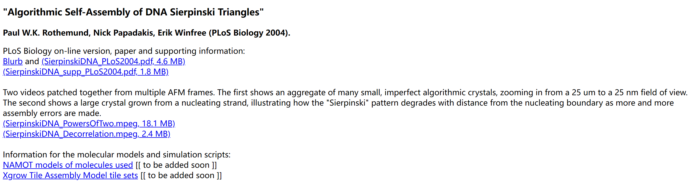
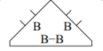
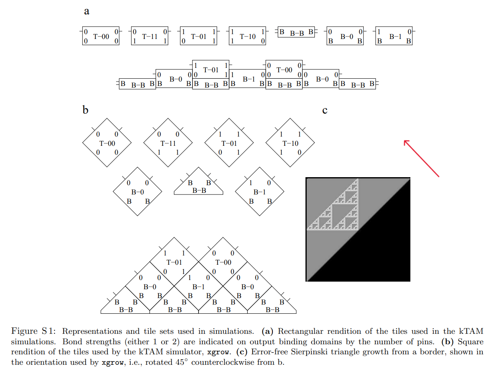
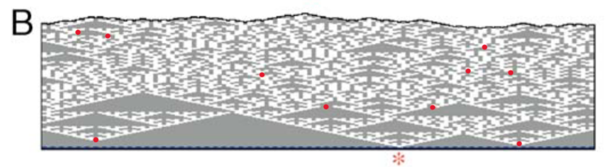
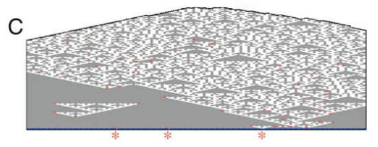
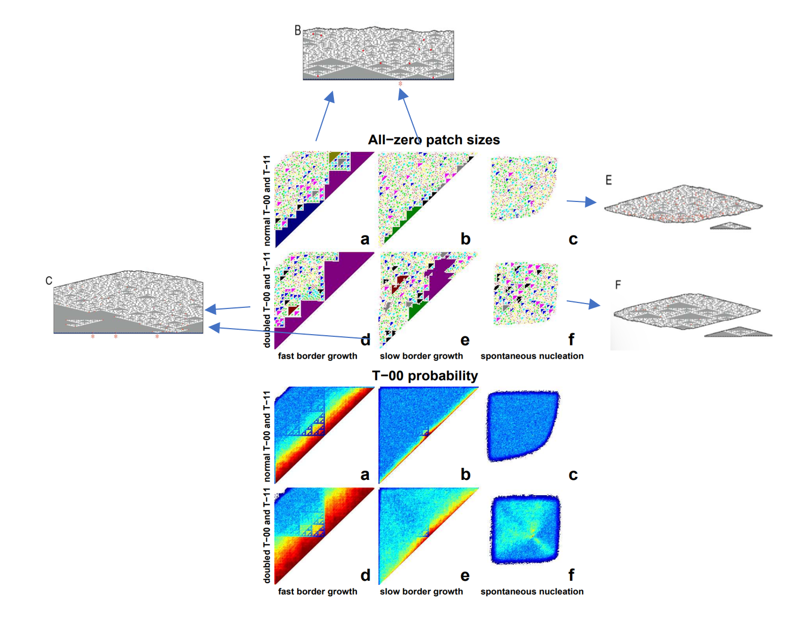
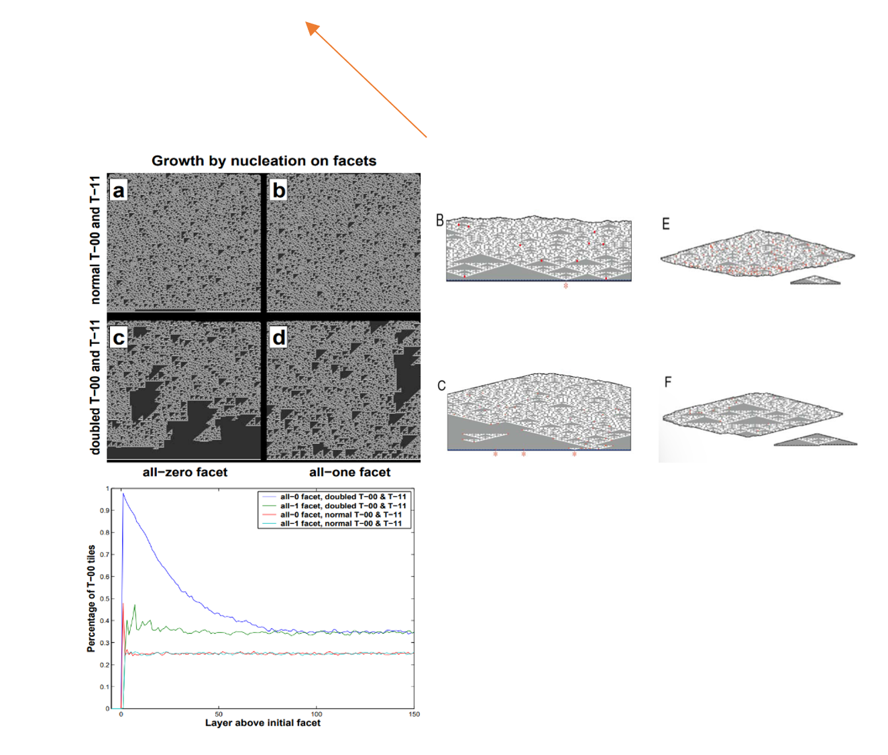

## 5、Materials and Methods

### 5.1 kTAM simulations
kTAM模拟

本论文描述的模拟是使用由Erik Winfree编写的xgrow程序进行的，该程序以及所使用的Tile集可以从http://www.dna.caltech.edu/SupplementaryMaterial获取。

- xgrow程序运行了一系列正方形 Wang Tile 的kTAM模拟（物理参数，如Tile浓度和温度，对晶体生长以及对错误率的影响）（见图S1）。这里使用的 Tile 集包括四个Sierpinski规则 Tile T-00，T-11，T-01和T-10，并增加了三个边界 Tile B-0，B-1 和 B-B，后者用作seed Tile。
- 为了模拟初始输入行的存在，将连接边界 Tile 的结合域视为比其他键强两倍 - 也就是说，它在决定解离速率rr,b = ke-bGse 时计为两个键。

- 通过边界 Tile 的结合速率 rf=k[tilei] = kSie-Gmc，边界行增长，模拟长成核结构变直，其中 Si 是边界 Tile i 与四个Sierpinski规则 Tile 的浓度相对应的配比。

- 由于我们不知道DNA成核结构直化的速度有多快，我们考虑了两种情况：
  - （1）通过设置 Si = 4 来模拟刚性或迅速直化的成核结构，以使在晶体熔化温度附近 Gmc ≈ 2Gse 时边界生长强烈有利。这用于图2B，其中种子 Tile 的化学计量也设置为零，以便将恰好一个种子 Tile 并入成核结构中。
  
  
  
  - （2）通过将边界 Tile 的Si设置为0.25来模拟松弛且缓慢直化的成核结构；在这种情况下，接近熔化温度的边界生长需要通过规则 Tile 的生长来稳定，从而产生带有面的晶体。与T-00和T-11浓度加倍（Si = 2）相结合，这种情况用于图2C，此外，将种子 Tile 化学计量设置为0.01，以使大约有1％的边界 Tile 输出为‘1’，与我们的DAO-E实验中观察到的DNA成核结构内‘1’的占比粗略一致。
  
  

- 这些变化的强烈影响可以在图S2中看到。较慢的边缘生长显着增加了不匹配误差率，导致边界中所包含的信息在几层内丢失。将T-00和T-11的浓度加倍的主要效果是增加生成晶体中全零区域的主导性。不仅所有零区域通常更大，而且边界中的所有零信息传播更加可靠。此外，在这些条件下，我们发现，自组装几乎完全需要最初的全零核。

- 模拟证实，当T-00和T-11的浓度加倍时（图S3），T-00 Tile 会优先成核在全零小平面上。相比之下，即使T-11 Tile 的浓度增加，也没有观察到在小平面上的优先核化，因为无论小平面上呈现什么信息，都无法创建一个层，其中T-11 Tile 超过50％且没有失配;必须有T-01或T-10 Tile 干预。因此，与在全零小平面上的T-00核化相比，核化速率大大降低。

- 这可以通过测量概率p(L) 来在模拟中评估，该概率表示在从小平面生长L层后发现T-00 Tile 的可能性。具有类似于图2C（T-00和T-11浓度加倍）参数的模拟显示，对于全零小平面， p(L) ≈0.66e-L/27 + 0.34，表明有很强的优先核化，但对于所有其他小平面，p(L)迅速松弛到渐近分布。具有类似于图2B（正常的T-00和T-11浓度）参数的模拟没有显示出任何优先核化，因为对于每种小平面类型调查，p(L)立即松弛到渐近分布。

### 5.2 DNA sequence design

DNA序列设计

DNA Wang Tile 的设计分三步进行。

- 首先必须确定Tile和晶格的几何形状。
  - 在这里，确定了每个双螺旋结构域和粘性末端的大小（碱基对的数量），以及其他结构装饰，例如对比度发夹。
  - 这些决定会影响每个Tile分子的稳定性，因为DNA双螺旋的自然几何形状（B型DNA的一圈需要10.5个碱基对）（Wang 1979；Rhodes和Klug 1980）限制了交叉点之间的距离必须是半圈的整数倍数。
  - 在此处使用的双交叉图案（Fu和Seeman，1993）中，DAE-E指的是结构层面的一些选择：双交叉；每个交叉点非交叉链反平行；每个分子内交叉点之间的半圈数（21个碱基对）为偶数；靠粘性末端连接的两个分子中最近的交叉点之间的半圈数（21个碱基对）为偶数。
  - DAO-E指的是类似的选择，只是每个分子中交叉点之间的半圈数为奇数（16个碱基对）。在插入发夹序列进行AFM对比的地方，我们在凸起的三臂连接处加入了两个未配对的T，这已经被证明可以在原始螺旋结构中促进叠合（Ouporov和Leontis，1995），而不会显着影响分子的刚性（Li等，1996）。

- 其次，必须选择特定的序列。
  - 这里的问题是，我们希望防止不期望的链之间结合，从而影响正确的分子结构的形成。
  - 我们使用序列对称性最小化的启发式原理（Seeman 1982，1990）来最小化每个系统（DAO-E和DAE-E）中所有链之间无意的 Watson-Crick 互补子序列的长度和数量。
  - 单链内发生的违规行为比两条链之间的违规行为更为严重；类似地，同一Tile中链之间的违规比不同分子中链之间的违规更重。发现一种简单的自适应行走算法可以有效地最小化违规行为并获得可接受的序列。粘性末端序列的选择要特别小心，以最大程度地减少错误杂交的可能性。

- 最后，我们将DNA Wang Tile概念化为由三个模块组成：粘性末端，核心螺旋区域和装饰物（例如为AFM成像提供对比度的发夹结构）。
  - 通过仅替换一条或两条链，可以为给定的双交叉核心提供不同的粘性末端（重新编程），从而允许重复使用核心设计以实现不同的Tile 集。
  - 根据我们的经验，给定核心的结构和热力学稳定性不受粘性末端序列变化的显著影响。
  - 类似地，通过使用额外的链，给定的核心可以使用发夹装饰或不使用发夹装饰，发夹装饰可以插入不同的位置。
  - 尽管发夹装饰会影响DNA Tile（例如链二聚体或其他高分子量物质）的完整性，但我们很少发现不需要的产品超过材料的20%。

- R-00和S-00的核心序列与先前研究中的A和B Tile完全相同（Winfree等，1998a）。我们通常给Tile起名字，表示它们的核心、粘性末端和装饰。然而，为了清楚起见，在本文的正文中，我们省略了这些变化的指示。例如，R-01更适合称为R-01n-23JC；S-01称为S-01-23JC；RE-01称为RE-01-15J；SE-10称为SE-10-15J，以指定哪些成分链具有发夹，以及这些发夹在哪里。（较短的名称适用于没有装饰的瓷砖。）

### 5.3 DNA tile preparation and gel electrophoresis
DNA Tile 制备和凝胶电泳

所有寡核苷酸都是使用标准方法（Integrated DNA Technologies）合成的，然后经过PAGE凝胶电泳纯化，并用在水中的260 nm紫外吸收来定量。DNA Tile 是通过在TAE/Mg2+缓冲液中混合每种组分链的等摩尔量制备而成，其制备方法如Winfree等人（1998a）所述。通过观察非变性PAGE确认了十个DAE-E和DAO-E Tile 核心的正确形成（10%-15% 19:1 bis:acrylamide，以15 V/cm和4℃下进行3-5小时，每道2 pmol复合物，用Sybr Gold染色20-30分钟，在488 nm下激发，在Bio-Rad Molecular Imager FX Pro Plus上使用530带通滤波器成像）。通过观察单个主要条带（见图S8；通常在标识为部分产物的带中出现5%-20%的总物质，例如缺少链的不完整的 Tile ）。我们重新设计了最初没有形成清晰凝胶条带的一个 Tile （R01）的核心序列；新的 Tile （R01n）在本研究中专门使用。尤其是在DAE-E Tile 中，一些含有该 Tile 的组分链子集的道显示出不完整或重的物种，例如二聚体，但是完整 Tile 的道中这些困难并不明显。形成凝胶还允许我们估计我们浓度测量的相对准确性：化学计量不匹配会导致单链或部分复合物过量生成。估计浓度准确度为±10%。这表明， Tile 复合物的纯化可能会导致更干净的自组装反应和更低的误差率。

### 5.4 Synthesis of the nucleating strand
核化链（初始输入行）的合成

单链核心链使用基于Stemmer组装PCR的程序合成而成（Stemmer等1995）。在组装PCR中，通过对一组弥散的片段进行PCR，生成一个长的、重复的双链产物，这些片段是所需重复序列的亚序列，如图S9所示。为了生成后续 Tile 在核心链上组装所需的单链产物，原则上可以使用引物仅定向PCR，以引物只为两个相互补偶产物链条中的一个。实践证明，这样的反应会产生更多双链产物，几乎不产生单链产物——这可能是因为组装PCR产物的重复性意味着每个3'末端，包括不需求的链条，都可以作为引物。因此，我们将核心结构的长共价链设计为仅包含A、C和T，并通过使用仅含有dATP，dCTP和dTTP的反应混合物来从组装PCR的输出中合成单链核心链。虽然这个反应的输出主要是单链的，但它既有单链也有双链物质。我们不纯化单链，因此双链物质在我们的实验中存在（图S17）。生成DAE-E和DAO-E核心链的弥散链以下列方式给出（见图S10）。注意，为了具有20个碱基的重叠，一些弥散链将互补的弥散链的相同中心三个碱基部分作为互补。

使用稍微不同的原则设计了DAO-E和DAE-E核心链的组装反应。DAO-E核心链采用了更简单的改进设计：生成单个周期性序列，并通过后续自组装反应中使用的输入 Tile 链条的化学计量比来确定“1”位点的分数。链条A4SV和A4-S00都在输入 Tile 的同一位置进行组装，但一个携带“1”黏性末端，而另一个携带“0”黏性末端。DAE-E核心链使用的方法更加复杂，但生成非平凡的输入模式更加强大。通过具有多个可重叠给定序列的弥散链，组装可以定向非确定地选择多种方法来扩展一个序列。因此，组装PCR可以生成任何常规语言（Winfree 1998b）。在这项工作中，我们使用了一组组成（NRE NUE +）*语言子串的弥散链。NRE子序列的分数由SplintNREUE2和SplintNUERE2的量控制，它们介导进入和退出NRE序列的转换。 （在这里，我们将这些弥散链的浓度设置为其他弥散链的五分之一。）NRE输入 Tile 输出“0”和“1”，而NUE输入 Tile 输出“0”和“0”。要生成不同的语言或相同语言中序列的不同分布，必须运行新的组装PCR。（DAO-E采用的更简单的设计方法也适用于DAE-E核心链。）

对于两种方法，PCR协议包括四个阶段，前三个用于组装PCR，最后一个用于生成单链材料。PCR在Stratagene MX 4000实时PCR仪器中进行，使用Perkin-Elmer GeneAMP XL试剂盒，其中含有rTth聚合酶。在第1阶段中，制备一个20μl的反应混合液，其中含有1 pmol的弥散链（其中有N种类型），不含聚合酶（Mix A，每20μl含1μl的1μM混合弥散链，每个1 / N μM;1.6μl的10mM dNTPs，每个2.5mM; 1μl的25mM乙酸镁，6μl的3.3X GeneAMP XL PCR缓冲液; 10μl水）。为避免错误引物事件，将弥散链在反应混合物中37℃退火5min。加入聚合酶（0.4μl），反应进行初始的72℃延伸步骤，随后进行40个循环（94℃ 15s，40℃ 30s，72℃ 10s + 1s /循环;约2小时）。在第2阶段，向第一反应体中添加40μl的新PCR Mix B（Mix A减去弥散链，加入0.4μl聚合酶，水调整为20μl），并进行额外的25个循环（94℃15s，40℃30s，72℃45s + 1s /循环;约1.5小时）。在第3阶段，将60μl的反应体积分成三个20μl的体积，向每个反应物中添加额外的40μl Mix B，并进行额外的20个循环（94℃15s，40℃30s，72℃70s + 1s /循环;约1.3小时）。此时，应该形成长的双链产物。（我们观察到这种产物在琼脂糖凝胶的孔中长期存在，即使20kb的标记物已进入琼脂糖凝胶中。）此外，混合物中的dNTPs可能几乎用完了 - 具体来说，几乎没有剩余的dGTP。（任何剩余的dGTP将在第4阶段早期用完。）在第4阶段中，为了创建单链核心链，将第3阶段产物的5μl与55μl的新PCR混合物（Mix B加上1.6μl的混合物，其中包含2.5mM的每个dATP，dCTP和dTTP，而不是所有四个dNTPs）混合，进行额外的60个阶段3程序循环（94℃15s，40℃30s，72℃70s + 1s /循环）。尽管在此阶段加入不对称引物可能会产生更多的单链产物，但即使不这样做，也可以得到令人满意的单链产物收率。完成最终的PCR后，将反应混合物用苯酚：氯仿：异戊烷醇提取，乙醇沉淀，并在纯化水中重悬;通过UV吸收测量估计收率。通常，将三个60μl的第4阶段产物管汇总到一个恢复步骤中，并将DNA在200μl的水中重悬。新悬浮的DNA可能不稳定，这可能是因为核心链材料集群会散射光。长单链DNA在水中可能容易发生水解或在冻融过程中断裂。但是，经过1年的冷藏，核心链材料仍然能够正常工作（如图S18所示）。

为了检查第4阶段的输出是否适合作为自组装的核心链材料，可以估计核心链材料的结合能力。图S11显示了DAO-E核心链的这种凝胶（非变性PAGE，5％19:1 bis:acrylamide, 1 h, 150 V），检查可以结合多少荧光标记的Cy3-cpBr1。我们观察到几件事情。首先，第3阶段的双链材料不易结合Cy3-cpBr1，如预期的那样。其次，第4阶段的材料可以很好地结合Cy3-cpBr1，量化地吸收了添加的全部量（1μl）。第三，第4阶段材料无法吸收2μl的Cy3-cpBr1，这为我们估计了核心链的结合能力。这对于确定必须添加多少输入瓦片链来确保每个瓦片都组装在核心链的每个位置上非常重要。第四，在PCR过程中存在Sybr Green I似乎不影响所生成的双链或单链材料的质量。

### 5.5 UV melts of tiles and crystals
Tile和晶体的紫外熔化

基于S-00和R-00-23J以及两种 Tile 的混合物（图S12），通过UV260熔解估计出 Tile 和晶体的熔化温度。这些 Tile 也被用于Winfree等人的文章中（1998a），它们与DAO-E Sierpinski系统的R-00和S-00 Tile 相同，但在R-00 Tile 中加入了发夹。单个 Tile 在TAE/Mg2+中的每个组分链中为0.4μ M。当缓慢退火时形成晶体的R-00-23J和S-00的混合物，每个链为0.2μM。在Aviv 14NT-UV-VIS分光光度计上进行熔解，并从15℃开始，逐渐升高到80℃，在数小时内进行。单一 Tile 的熔解与从80℃重新退火到15℃时的再组装重叠，表明测量了平衡值。原始吸收值被归一化。虽然S-00在65℃附近（也适用于大多数没有发夹的其他 Tile ）具有尖锐的熔化转变，但R-00-23J Tile 具有更加渐进的转变，我们将其归因于发夹的存在。在40℃以上，混合物的吸收值等于单个 Tile 的平均吸收值，表明晶体已经完全熔化。晶体熔化转变之前，在36℃到40℃之间，测量中存在显著的噪声，可能是由于光散射引起的。

我们没有对所有 Tile 进行UV260熔解；但是，其他几个DAO-E和DAE-E Tile 在50℃和70℃之间具有类似的转变。因此，我们假设模板和未模板化的Sierpinski晶体在大约40℃处融化，并且在该温度下，DNA Tile 是合理地形成的。

### 5.6 Self-assembly reactions
自组装反应

通过在充满所有相关规则Tile、输入Tile、封顶和成核链的（通常为）50μl的 1X TAE/Mg2+缓冲液（40 mM Tris–acetate [pH 8.0]，2 mM EDTA，12.5mM Mg2+）中进行大量退火来完成自组装，从90℃以1℃/分钟的速率退火到20℃（大约需要1小时）。较长的退火计划（例如，从90℃以1℃/分钟的速率退火到50℃，然后在50℃到20℃的关键区域以1℃/30分钟的速度，总共约15小时）似乎不会降低误差率或未经模板化的管或晶体数量。

DAO-E反应中包含足够的成核链，以绑定0.004μM的输入Tile（根据结合能力凝胶估计），0.2μM的每个封顶和输入Tile链（A1S、A2、A3-nick、A4-S00、cpBr1和A4SV的1/100），以及每个规则Tile链0.2μM（对于使用的五到六个Tile中的每一个）。使用过量的输入Tile链以确保完全覆盖成核链。超量部分的输入Tile似乎不会对算法晶体的自组装产生显着干扰。

DAE-E反应包含足够的成核链，能够捕获0.002-0.008μM的输入Tile（根据PCR的估计产量推断），0.2μM的每个封口和输入Tile链（NRE1到NRE4，NUE1到NUE4，CapNRERE和CapNUERE），以及每种Tile链的0.2μM（对使用的四种Tile的每一种都是如此）。同样，使用过量的输入Tile链以确保完全覆盖成核链。

### 5.7 AFM imaging
原子力显微镜成像技术

AFM成像是在配备有nano Analytics Q-control III和垂直engage J-扫描仪的数字仪器Nanoscope III上，在TAE/Mg2+缓冲液的敲击模式下进行的，使用 NP-S 氧化硅尖端的硅氮化物探针，其窄度为100μM，其力常数为 0.38 N/m，谐振频率约为 9.4 kHz。自组装完成后，将样品滴加 5 μL 在新切割的云母表面上，用热熔胶将其固定在 15mm 的金属圆盘上；在样品和探针中各添加 30μL 缓冲液，然后将样品和液体槽放置在 AFM 头内。接合后，敲击幅度设定值通常为 0.2-0.4 V，驱动振幅通常为 100-150 mV，扫描速率范围从 2 到 5 Hz。低幅度设定值和高驱动振幅值可清晰分辨每个Tile图案。但这样会对样品造成最大伤害，且磁针脚标签不够清晰，有时甚至会完全消失。因此，为了避免对样品的损伤，需要最大化震幅设定值和/或最小化驱动振幅，并使磁块及其磁针脚标签能够清晰可见。 

获取图像后，大多数图像通过从每个扫描线中减去低阶多项式或调整每个扫描线以匹配强度直方图来使其平坦。 对于某些图像（参见图6D-6E和S18，底部），使用手动选择的基准标记将多个扫描线对齐并在Matlab中进行平均。