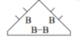
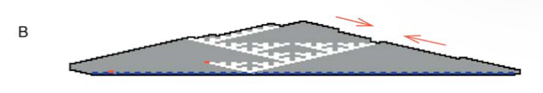
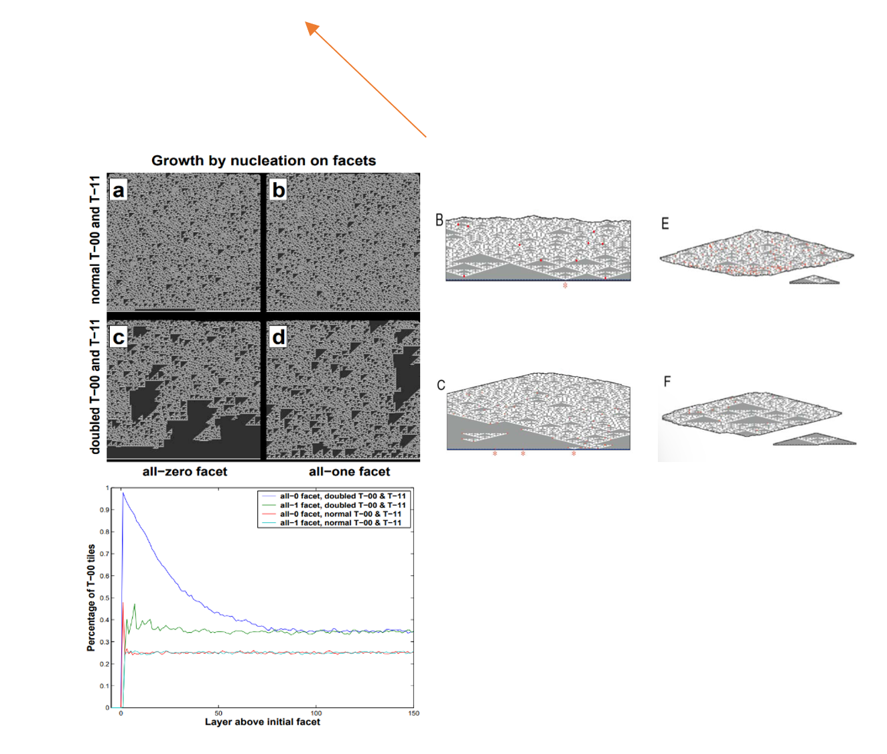
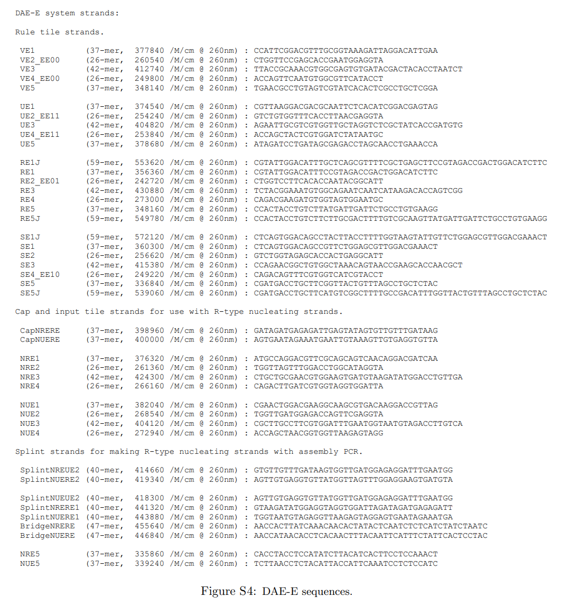
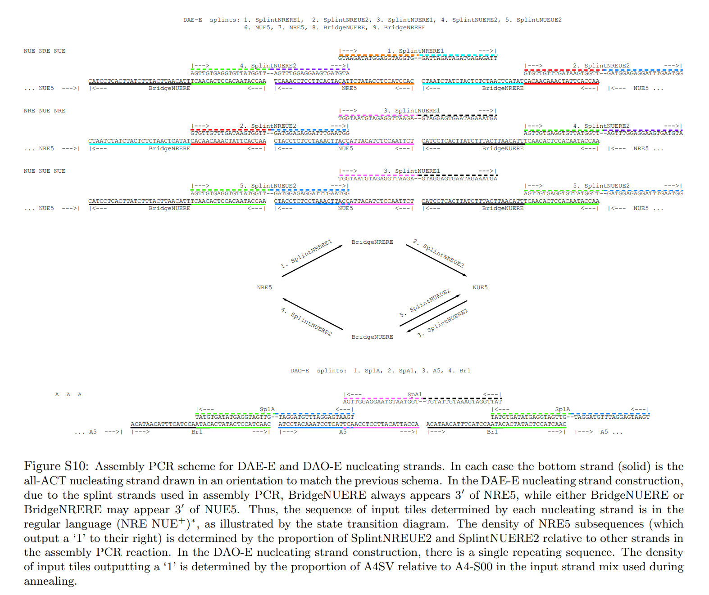
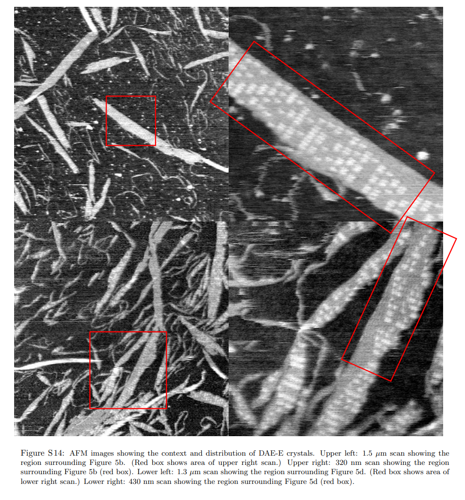

**Algorithmic Self-Assembly of DNA Sierpinski Triangles ，DNA Sierpinski 三角形的算法自组装**

# 一、文章简介

## 1、所属期刊

**PLOS Biology ：**

## 2、作者简介

# 二、文章内容

**缩写：**

AFM, atomic force microscopy; 

aTAM, abstract Tile Assembly Model; 

1D, one-dimensional; 

2D, two-dimensional; 

DNA, deoxyribonucleic acid; 

DAE-E, double-crossover, antiparallel, even intramolecular spacing, even intermolecular spacing; 

DAO-E, double-crossover, antiparallel, odd intramolecular spacing, even intermolecular spacing; 

kTAM, kinetic Tile Assembly Model; 

PCR, polymerase chain reaction; 

RAM, random-access memory; 

XOR, exclusive or

## 1、Abstract

**背景：**算法和信息是生物技术组织结构的基础，也是分子自组装等许多基本物理现象的重要方面

**实验总述：**利用 DNA Tile的二维自组装，在分子层面上实现了一种细胞自动机，其更新规则是一个二进制的异或函数 XOR，在其生长过程中构成了一种分形图案--Sierpinski三角形。

- 为了实现这一目标，我们将抽象 Tile 转化为双交叉的 DNA Tile。

- 长单链 DNA 分子作为计算的初始输入，将 Tile 构造为算法晶体。

**实验结果：**在两个独立的分子实现过程中，原子力显微镜都发现了可识别的Sierpinski三角形，其中正确组装的Tile在100-200 个。组装过程中的错误率在 1%到 10%之间。

**贡献：**尽管实验的结果并不完美，但Sierpinski三角形的构造展示了分子实现任意细胞自动机的所有必要机制。这表明，工程化的 DNA 自组装可以作为图灵通用生物分子系统，能够实现计算或构建任务所需的任何算法。

## 2、Introduction

**背景：**

- 我们发现，生物学中的物质组织结构是最复杂的，从组成生物体的分子（0.1 阿克）到整个生物体（100 千克），往往跨越 24 个数量级以上。这种组织结构以信息为基础：在进化过程中完善的 DNA 序列既编码了组成部分，也编码了指导其发展成为生物体的过程。

- 可以利用计算机科学来描述这种精心策划的组织结构，在计算机科学中，人们使用编程语言、数据结构和算法来指定复杂的信息和行为。

  - 在von Neumann关于[自复制自动机](#自复制自动机)的开创性工作中，他提出了通用构造器的假设，即通过读取指定算法的输入带，可以执行必要的命令来构建任意对象。这表明通用计算对于自主制造任务的重要性得到了认识。 （von Neumann 1966）。

- 如果能成功地在分子环境应用算法的概念，那么该算法将与能量和熵一样，成为理解[物理过程如何创造秩序](#物理过程如何创造秩序)的基本概念。

**挑战：**

- 遗憾的是，由于缺乏合适的物理系统来磨练这种理论，分子算法的研究受到了阻碍：
  - 大自然为我们提供的基本化学反应过于简单，无法编程；
  - 完整的生命系统过于复杂，无法作为模型；
  - 而介于两者之间的系统却很少；
- 如果可以在体外合成可编程的生化系统，我们就可以实现并研究从简单到复杂的各种分子算法，从而探索这一空白。

**研究现状：**

- 生物分子自组装对于探索控制纳米制造任务的分子算法非常具有吸引力。

- 在生物学中，自组装被广泛用于制造病毒外壳、微管和鞭毛等结构，这充分证明了自组装的作用。

- 在各种情况下，少量的蛋白质种类之间通过一系列复杂的组装步骤产生的相互的结合作用足以决定最终结构的形式
  - 这可以简单地视为一种可编程的纳米制造形式，其中的程序是所涉及的分子种类集。
  - 对于合成方法，Seeman，*Nucleic-acid junctions and lattices*，1982；*Biochemistry and structural DNA nanotechnology: An evolving symbiotic relationship*， 2003 已经证明，DNA提供了一种可替代蛋白质的方法，并且可以通过Watson-Crick互补性轻松编程。
  - Adleman，*Molecular Computation of Solutions to Combinatorial Problems*，1994 开创性地利用一维 DNA 自组装作为有限状态机运行，首次在 DNA 自组装和计算之间建立了实验联系。
  - Adleman的文章启发了Winfree，*On the computational power of DNA annealing and ligation*，1996，Winfree借鉴了 Wang Hao，*Proving theorems by pattern recognition*，1961；*An unsolvable problem on dominoes*，1962 将计算嵌入在几何自组装过程中的思想，表明DNA的二维自组装可以执行图灵通用计算。即任何算法原则上都可以嵌入，和引导一个非周期性的结晶过程。
  
  
  
  - 他们指出，在这种 “算法自组装” 范式中，一组 "Wang Tile" 被视为特定计算或分子制造任务的程序（Reif 1999; Rothemund和Winfree 2000; Adleman等2001）。 
  - Winfree等人1998b；Adleman 1994; Mao等人2000，已在实验中证明一维算法自组装具有有限的计算能力，而二维算法自组装不仅为计算和建设提供了新的能力，还呈现了新的物理现象和实验挑战。

**提出新方法：**

一种可以通过二维算法自组装实现的图灵通用计算模型是[一维细胞自动机](#一维细胞自动机)。

[局部细胞自动机](#局部细胞自动机)的一个简单的规则选择是异或（XOR）函数：在每个时间步骤里，每个细胞都被计算为它的两个相邻细胞的[异或](#异或)结果。如图1A左，从一排由全 ‘0’ 组成的行开始，中央插入一个单独的 ‘1’，连续的时间步骤中，细胞自动机状态的快照可以堆叠在一起，形成一个空间-时间历史，它与[Pascal三角](#Pascal三角)（Bondarenko 1993）模2相同，是Sierpinski三角形的离散形式（图1A右）。

- （1A）左：作为时空历史绘制的三个时间步骤的异或细胞自动机执行情况。单元格根据所示的异或方程同步更新。偶数时间步骤的单元格与奇数时间步骤的单元格交错排列；箭头显示信息传播。
- （1A）右：Sierpinski三角形。

为了将这个细胞自动机表示为一种Tile的自组装模式，每一个在时空历史中出现的局部上下文必须有一个相应的Wang Tile，其形状代表了该位置发生的输入和输出（如图1B所示）。

- （1B）将时空历史转化为Tiling。对于每一种可能的输入对（x，y），我们生成一个Tile T-xy，其每个侧面的下半部分代表输入，每个侧面的上半部分代表输出。

因此，我们需要四个Tile（对应异或函数 z = x ⊕ y 的四种可能）、以及一个线性输入行（成核结构）表示细胞自动机的初始状态（蓝色）（图1C）。

- （1C）四个Sierpinski规则Tile，T-00、T-11、T-01和T-10，表示异或（XOR）真值表的四个条目：0 ⊕ 0 = 0，1 ⊕ 1 = 0，0 ⊕ 1 = 1，1 ⊕ 0 = 1。
- （1C）Tile侧面的下半部分结合区域与下层输入匹配；上半部分的结合区域则提供输出到上层的两个相邻的Tile。
- （1C）半圆形区域代表“0”，而矩形区域代表“1”。输出“0”的Tile（T-00和T-11）是灰色的，我们称它们为“0”Tile。输出“1”的Tile（T-01和T-10）是白色的，并称其为“1”Tile。

- （1C）计算的初始条件是由一个[成核](#成核)结构（输入行）（蓝色）提供的。红色星号表示这个成核结构上带有“1”绑定区域的位置；其他位置都具有“0”绑定区域。黑色箭头表示将形成两个键的连接；红色箭头表示将形成一个键的连接。

给定这些Tile和输入行，如果没有失配或缺失Tile地组装成为Sierpinski三角形，它就再现了细胞自动机的时空历史（图1D）。

- (1D) 无误差的生长结果形成Sierpinski图案。

**新的挑战：**

细胞自动机的执行是完美和同步的，而分子自组装是异步的，并且可能存在许多类型的错误。为了成功地通过分子自组装实现细胞自动机，必须解决四个挑战：

- （1）必须将抽象的Tile转化为易于形成二维晶体的分子 Tile
- （2）分子Tile必须编程为具有特定的结合域，以匹配抽象Tile的逻辑
- （3）分子Tile的结合必须足够的匹配，以强制执行正确的装配顺序并防止出现错误
- （4）分子Tile的组装必须发生在指定的成核结构（输入行）上，并且必须抑制虚假成核

解决这些问题不仅对于实现XOR细胞自动机，而且对于任何其他一维细胞自动机都是必要且充分的。

这四个问题的解决都已经单独展示过了：

- 已经设计并展示了几种类型的DNA Wang Tile，可以生长成为微米级二维周期晶体（ **Winfree et al. 1998a**；Mao et al. 1999；LaBean et al. 2000b）；

- 这些Tile之间的相互作用可以通过对特定序列进行编程（Winfree et al. 1998a；**Mao et al. 2000** ）；

- 多个结合域的协同结合确保了特异性，即正确的Tile附加在正确的位置上（Winfree et al. 1998b；**Mao et al. 2000**）；

- 单链模板可以提供自组装过程的输入（LaBean et al. 2000a；**Yan et al. 2003a**）

**贡献：**本文的实验通过Sierpinski三角形的自组装演示，展示了Sierpinski的自组装产生的一种新的非周期晶体——算法晶体，证明了四个挑战可以同时克服，从而确立了实现任意细胞自动机所需的所有机制。

## 3、Results

### 3.1 Modeling Tile-Based Self-Assembly

（基于Tile的自组装的建模）

**承上启下部分：**

- 防止上述错误类型看起来是不可能的。例如，如果单个结合域足够强大，可以将一块Tile牢固地固定在其位置上（图1C中的红色箭头），那么预计会有大约33%的Tile与下一层的Tile不匹配。
- 通过自组装的模拟研究揭示了如何避免这些负面的情况。

**建模：**

采用了两个抽象化层次，以从不同方面解决算法自组装实验设计和分析中的关键问题。

- 通过抽象的Tile组装模型（abstract Tile Assembly Model, aTAM），可以解决 “在异步的组装过程中如何通过Tile设计来编程晶体形态和图案” 的问题（Winfree 1996, 1998a）。
- 通过基于可逆的Tile的结合和解离速率的动力学Tile组装模型（kinetic Tile Assembly Model, kTAM），可以探究物理参数（如Tile浓度和温度）对晶体生长以及对错误率的影响（Winfree 1998a）。

- **abstract Tile Assembly Model, aTAM**

    

    - aTAM模型通过一个阈值 τ 来展现Tile之间的协同作用，该阈值代表一个结合事件必须形成的键数，以使其[热力学稳定](#热力学稳定)：
      - 如果至少有 τ 个结合结构域与现有的晶体相匹配，则可以将一个 Tile 添加到晶体中。
      - 这个细胞自动机被设计为在 τ = 2 时运行。
      - 图1C中黑色箭头表示在 τ = 2 时可能发生的四个结合事件，红色箭头表示在 τ = 1 时可以允许但在 τ = 2 时不能发生的另外两个结合事件。
      - 在aTAM中，孤立的Tile无法在 τ = 2 时相互连接, 必须从预先形成的核结构（图1C中的蓝色部分，输入行）开始，它代表了计算的输入。
      - 重要的是，在 τ = 2 时，只有直到前两个 Tile 都已经存在时，才能添加任何 Tile，这样可以保证尽管事件的顺序是异步的，但结果仍是确定的。因此，无论允许的关联发生的顺序如何，从包含单一“1”域的输入行开始组装，都会生成Sierpinski三角形图案（图1D和2A）。

- (2A) 一个大约130 x 70的无误差模板晶体的子区域。

- 如果允许发生少量的 τ = 1附加联结，则相邻 Tile 之间可能会出现不匹配错误：
  - 在这种情况下，或者输入行中有多个 '1' 的情况下，结果的图案可能会呈现出质的不同
- （1E）从一个带有三个“1”域的成核结构中出现错误的生长。红色交叉表示四个不匹配错误。

- **kinetic Tile Assembly Model, kTAM**（基于可逆的Tile的结合和解离速率的动力学Tile组装模型）

    - 使用kTAM可以理解此类错误发生的速率。

    - 在这个模型中，所有的 Tile 在给定位点上的结合速率 rf  可能与它们的浓度成比例：rf = k[tile] = ke-Gmc，其中 k 是一个速率常数，与浓度无关；Gmc > 0 ，表示由于结合而失去的无量纲熵，即代表着单体的浓度。

    - 解离速率取决于有多少个结合域正确匹配：如果一个 Tile 有 b 个正确匹配的结合域，则它的解离速率由公式 rr,b = ke-bGse 决定，其中 Gse  > 0，是单个结合域的无量纲自由能，代表粘性末端的结合强度。Gse 会随着温度升高而降低。

    - 因此，如果Gse < Gmc < 2Gse，当Tile 在单个结合域匹配时，rf < rr,1 ，在热力学上是不利的，而当 Tile 在两个结合域匹配时，其反应的rf > rr,2，在热力学上是有利的。

      

    - 由于 Gse 表示温度，临界值为 Gmc = 2Gse，当 Gmc > 2Gse 时，此时解离速率 > 结合速率，不利于 τ = 2 结合也不利于 τ = 1 结合，即可以将 Gmc ≈ 2Gse 视为晶体熔化（解链）温度附近。

- 本论文描述的kTAM模拟是使用由Erik Winfree编写的xgrow程序进行的，该程序以及所使用的Tile集可以从http://www.dna.caltech.edu/SupplementaryMaterial获取。

  

  - xgrow程序运行了一系列正方形 Wang Tile 的kTAM模拟（见图S1）。这里使用的 Tile 集包括四个Sierpinski规则 Tile T-00，T-11，T-01和T-10，并增加了三个边界 Tile B-0，B-1 和 B-B，后者用作 seed Tile。

  - 图S1：模拟中使用的Tile集。
    - （a） kTAM模拟中使用的方形Tile的图示。结合强度（1或2）在输出结合域上由引脚的数量指示。
    - （b） 无误差的Sierpinski三角形从边界生长，以xgrow使用的方向所示，即从b逆时针旋转45度
    
    

  - 为了模拟初始输入行的存在，将连接边界 Tile 的结合域视为比其他键强两倍。
    
    
    
  - 边界 Tile 的结合速率表示为 rf=k[tilei] = kSie-Gmc，通过增长边界行增长，模拟长成核结构变直，其中 Si 是每个边界 Tile i 与四个Sierpinski规则 Tile 的浓度相对应的配比。

  - 由于我们不知道DNA成核结构直化的速度有多快，我们考虑了两种情况：

    - （1）通过设置 Si = 4 来模拟刚性或迅速直化的成核结构，以使在晶体熔化（解链）温度附近 Gmc ≈ 2Gse （ Gmc = 17，Gse =  8.8） 时边界生长强烈有利，结果由图2B所示。

      

      

      - （2B）一个有10个不匹配错误（0.1％）的子区域，用红色表示（既有假 “0” 又有假 “1” ）。模板行附近的大片全零区域是完好的Sierpinski图案；对于这些参数的模拟，在[渐近情况](#渐近性)下，仅有约 1％ 的 T-00 Tiles 位于包含超过90个Tile的全零区域。

    - （2）将边界 Tile 的 Si 设置为0.25，来模拟松弛且缓慢直化的成核结构；在这种情况下，接近晶体熔化温度 Gmc ≈ 2Gse 的边界生长需要通过规则 Tile 的生长来稳定，从而产生带有面的晶体。与 T-00 和 T-11浓度加倍相结合，模拟非理想状态下的效应，结果如图2C所示，大约有1％的边界 Tile 输出为‘1’。综上，kTAM模型预测的失配误差率在0.1％至1.0％之间

      

      - （2C）这是由 T-00 和 T-11 Tile 以双倍浓度生长在缓慢生长的核化行上的晶体中的一个子区域。在 Gmc=17，Gse=8.6 生长时，有43个失配错误（即0.3%），会特征性地在角落处终止Sierpinski图案的生长。在这些参数的模拟中，渐近情况下，大约18%的T-00 Tile 以大型区域的形式存在。
  
  - 在这种情况下，正在生长的晶体的侧面存在 ‘0’ 的优先关联，导致Sierpinski三角在角落处终止并产生大面积的全0区域，形成特征性的误差：
  
  
   - 如果在一个'1'Tile的上下面都有一个全为零的晶面发生核化，从'1'开始的正确生长将被'0'夹在中间，那么就会引发更多的错误（图3B，一个被观测到的导致三角形终止或侧向延伸的机制：T-00 在晶面上的优先成核。）。
  
     
  
   - 进一步的错误可能是：
     - （1）在角点处添加不匹配的“0” Tile以终止Sierpinski三角形；
  
     - 或（2）在角点下方的晶面上添加不匹配的“1” Tile，从而创建一个新的小三角形（图3A中的箭头）。
     
       
  

- 造成这些错误的原因是T-00 Tile在全0面层上的优先成核，因为它们的浓度较高（图S3）。通过模拟证实，当T-00和T-11的浓度加倍时（图S3），T-00 Tile 会优先结合在全零小平面上。相比之下，即使 T-11 Tile 的浓度增加，也没有观察到在小平面上的优先核化，即无论小平面上呈现什么信息，都无法找到 T-11 Tile 超过50％且没有失配的一个层；这表面 T-11 Tile的结合必须有T-01或T-10 Tile 干预。因此，与在全零小平面上的T-00核化相比，结合速率大大降低。

  - S3 图：在大型晶面上进行生长的模拟。

    - （a-d）示例运行。底部行是先前存在的晶面（256块Tile），表示所有“0”或所有“1”键类型。T-00和T-11 Tile 可以以正常浓度存在（如图2be所示）或以正常浓度的两倍存在（如图2cf所示）。模拟是在Gmc = 17.0 和 Gse = 8.6下进行的，与图2c相同。Tile的方向如图S1c所示。
    - （下图）对于四种情况的每一种，从100次运行中估计出在晶面上方观察到T-00 Tile 的概率
    - 这可以通过测量概率p(L) 来在模拟中评估，该概率表示在从从初始平面生长出的L层发现T-00 Tile 的可能性。具有类似于图2C（T-00和T-11浓度加倍）参数的模拟显示，对于全零小平面， p(L) ≈ 0.66e-L/27 + 0.34，表明有很强的优先结合性，但对于所有其他小平面，p(L)迅速松弛到渐近分布。具有类似于图2B（正常的T-00和T-11浓度）参数的模拟没有显示出任何优先结合性。      

  - 因此，模型参数的轻微数量变化可以导致观察到的错误形态发生显著的差异。这些变化的强烈影响可以在图S2中看到。较慢的边界生长显著增加了不匹配错误率，导致边界中所包含的信息在几层内丢失。将T-00和T-11的浓度加倍的主要效果是增加生成晶体中全零区域的主导性。不仅所有零区域通常更大，而且边界中的所有零信息传播更加可靠。此外，在这些条件下，我们发现，自组装几乎完全需要最初的全零核。

    - S2 图：模拟晶体生长的行为。下图显示了每个条件的样本运行情况，所有 “0” Tile 均按其大小识别和着色。下图显示了从100次运行中估算的观察到T-00 Tile 的概率

      - 比例尺：1.0（红色）~ 0.0（深蓝色)

      - Sierpinski三角形以观察到 T-00 Tile的概率降低的图案形式出现，而在无误差的生长下，概率将为零

      - （a） 增长如图2b所示

      - （b） 增长如图2b所示，但边界增长缓慢。

      - （c） 增长如图2e所示。

      - （d） 增长如图2c所示，但边界增长较快

      - （e） 增长如图2c所示。Sierpinski三角形在拐角处终止的特征误差几乎只在条件e下发现。

      - （ f ）增长如图 2f 所示。
    
        
    
- kTAM 还可以解释第二种错误，即在缺少成核结构的情况下自发二维成核。
  - 在 Gmc ≈ 2Gse 的条件下，这种未模板化成核受到动力学障碍的抑制，即存在一个临界成核大小（Davey和Garside 2000）。
  - 非模板晶体的生长是在其四个面中任意一个面上通过自发的一维成核形成新的 Tile 层，通过任何单个结合域，总有两个 Tile 可以结合，即 Tile 通过一个输入和一个输出结合区域结合，因此这种成核过程必须有效地创造一个新的信息位，使得信息可以根据XOR逻辑快速向前或向侧面传播，以无误完成层的构建。
  
  
  
  - 这样的晶体可能不会包含不匹配的Tile（参见图2D），但也没有Sierpinski三角形的一些特定外观。
  
    - （2D）一种未模板化的晶体，大约由4000个 Tile 组成且没有错误。插图显示：完美Sierpinski图案的最大子区域很小。
  
      
  
  - 如果增加Gse，相当于降低温度，则形成核更快，但错误更频繁。向后生长是一种 Tile 通过它们的输出域连接到晶体上的方式。由于每一个这样的连接都牵扯到信息的创造（如图3C所示)，因此特别容易出现错误。
  
    - （3C）正向和侧向生长是确定性的：在具有两个结合域的位置上，总是有一个唯一的 Tile 可以形成正好两个键合关系。反向生长是不确定的：在两个结合域一致的位置（例如绿色箭头），有两种可能的 Tile 可以形成两个键合关系（ {T-10，T-01} 或 {T-00，T-11} ）。在结合域不一致的位置（例如，红色箭头），没有 Tile 可以结合形成两个键合关系。由于仅显示了 Tile 的输出类型，因此无法从这些图形中确定反向生长位点的结合域是否一致或不一致。
  
      
  
  
  - 每当两个向后生长的域相遇并在它们创造的信息上发生分歧时，就只能进行错误的生长。
  
    - (2E) 在快速生长的条件下，一个未被模板化的晶体存在多个错误，生长在 Gmc =  17，Gse = 10.4，明显低于熔点温度，导致反向生长方向的错误率更高。需要注意的是，在反向生长的情况下更容易发生错误。仅有大约1％的T-00 Tile 大块拼接、成片出现
  
      
  
  - 然而，对于未模板化的晶体，最明显的影响是由上述非理想性状态（将 T-00 和 T-11 Tile 的相对浓度翻倍）引起的：所有"0" Tile增加了完美的Sierpinski图案的频率和大小（见图2F)。
  
    - （2F）在Gmc = 17，Gse = 8.6，T-00 和 T-11 为双倍化学计量比的情况下，有很少错误的未模板化晶体。值得注意的是，有大量的完美子区域。
  
    - （2F）在这些模拟参数下，大约有25％的 T-00 Tile 在大区块中。
  
    - （2F）根据Winfree（1998a）中使用的近似值，Gmc = 17 对应于 0.8 μM，Gse = 8.5对应于 41.8 °C，Gse = 10.4 对应于 32.7 °C。晶体周围的黑色轮廓是为了清晰，它不代表 Tile 。
  
      
  
  
  - 这些模拟研究表明，这三个难点（Tile 的异步关联、匹配错误和非模板核化）原则上可以通过减缓生长过程来控制。

### 3.2 Design and Preparation of DNA Tiles

（DNA Tile 的设计和制备）

**3.2.1 DNA Tile 序列的设计**

根据早期的方案描述（Winfree等人，1998a），抽象的Wang Tile可以被实现为DNA Tile：每个Wang Tile是一个具有四个粘性末端的双交叉分子， 每个粘性末端为暴露5个碱基的单链(Fu和Seeman，1993)，用作可编程的结合域。我们使用两种双交叉分子，DAE-E和DAO-E分子（Winfree，1996），来呈现四个Sierpinski规则Tile，从而得到了两个独立的分子实现(图4，序列如图S4–S7中所示)。

DNA Wang Tile 的设计分三步进行：

- 首先，必须确定Tile和晶体几何形状
- 其次，选择特定的序列
- 最后，将DNA Wang Tile概念化为由三个模块组成：粘性末端，核心螺旋区域和装饰物

1. 首先，必须确定Tile和晶体的几何形状。
   
    
    
    - 在这里，确定了每个双螺旋结构域和粘性末端的大小（碱基对的数量），以及其他结构装饰，例如AFM对比度[发夹](#DNA发夹)。
     - 这些决定会影响每个Tile分子的稳定性，因为DNA双螺旋的自然几何形状（B型DNA的一圈需要10.5个碱基对）（Wang 1979；Rhodes和Klug 1980）限制了交叉点之间的距离必须是半圈的整数倍数。
     - 在此处使用的双交叉图案（Fu和Seeman，1993）中，DAE-E指的是在结构层面：双交叉；非交叉链反平行；每个分子内交叉点之间的半圈数（21个碱基对）为偶数；靠粘性末端连接的两个分子中最近的交叉点之间的半圈数（21个碱基对）为偶数。
     - DAO-E也是类似的，只是每个分子中交叉点之间的半圈数为奇数（16个碱基对）。
    
    
    
       - 图4. 分子模型
         - (A) 中上部：DAE-E Sierpinski规则 Tile VE-00、UE-11、RE-01和SE-10的抽象表示，突出它们与图1中的 Tile 的区别。
         
           
         
         - (A) DAE-E Tile 上的3‘和5’端的排列规定了每个符号“0”或“1”的互补结合域必须使用两个不同的互补对，通过互补形状的大或小来表示。
         
         - (A) 粉色图例显示了形状与粘性末端序列的映射关系。
         
         - (A) 左上方：VE-00的分子示意图显示每个DAE-E Tile 由五个DNA链组成；小箭头指向交叉点。
         
         - (A) 右上方：RE-01的示意图显示如何将发夹连接到“1” Tile 上以提供AFM对比度
         
         - (A) 下方：Tile 在一个初始输入行上组装。输入行的核心序列（蓝色）是通过组装PCR生成的，经常达到3微米（200个Tile）以上的长度。
         
         - (A) 初始输入行的子序列包含：封顶链（橙色）和输入Tile链，以形成随机输出“0”的输入Tile，一个不同的输入Tile的子序列（星号），在一个侧面输出“1”。
         
         
         
         - (B) 中上部：六个DAO-E Sierpinski规则Tile：S-00、R-00、S-11、R-11、S-01和R-01。
         - (B) 左上和右上：分子示意图强调两个值得注意的特点：
           - (1) R型 Tile 只输出到S型 Tile ，反之亦然，这是分子的3‘/5’极性所决定的，同样的，每个符号需要使用两个不同的互补对结合域。
         
           - (2) DAO-E分子的指示旋转对称性允许每个分子在两个方向上提供服务；不需要明确的S-10或R-10Tile。
         
           - 由于DAO-E的特殊性质，DAO-E Sierpinski Tile组（图4B）由六个分子 Tile 组成。首先，考虑到链的5‘和3’方向，特别是DAO-E Tile顶部和底部的粘性末端极性相反，所以每个Tile只能与“倒置”的相邻Tile结合，形成叠层Tile，我们将其称为R型和S型Tile。此外，DAO-E Tile的糖-磷酸骨架具有对称轴，这意味着R-01和S-01 Tile各自都可以扮演T-01和T-10 Tile 的角色。同样，R-00、R-11、S-00和S-11Tile在两个输入匹配的位置上可以以两种不同方向结合。

2. 其次，选择特定的序列。

   - 这里的问题是，我们希望防止不期望的链之间结合，从而影响正确的分子结构的形成。
    - 使用（Seeman 1982，1990）的序列对称性最小化的启发式原理来最小化每个系统（DAO-E和DAE-E）中所有链之间无意的 Watson-Crick 互补子序列的长度和数量。
      - DNA序列对称性最小化的原理是通过适当设计DNA序列和结构，使其具有一定程度的对称性，最小化不同单元之间的嵌套，从而使DNA结构更加稳定和高度有序。
    - 单链内发生的错误匹配行为比两条链之间的错误匹配行为更为严重；类似地，同一Tile中链之间的错误匹配比不同分子中链之间的错误匹配更重。

3.  最后，我们将DNA Wang Tile概念化为由三个模块组成：粘性末端，核心螺旋区域和装饰物（例如为AFM成像提供对比度的发夹结构）。

   - 通过使用额外的链，给定的核心可以使用发夹装饰或不使用发夹装饰，发夹装饰可以插入不同的位置。
   
   - 通过仅替换一条或两条链，可以为给定的双交叉核心提供不同的粘性末端（重新编程），从而允许重复使用核心设计以实现不同的 Tile 集。
   
   - 根据我们的经验，给定核心的结构和热力学稳定性不受粘性末端序列变化的显著影响。
   
   - 尽管发夹装饰会影响DNA Tile的完整性（例如链二聚体或其他高分子量物质），但我们很少发现不需要的产品超过材料的20%。
     
     - 图S4-S7
     
     
     
     
     
     
     
     

- R-00和S-00的核心序列与先前研究中的 A 和 B Tile完全相同（Winfree等，1998a）。我们通常给Tile起名字，表示它们的核心、粘性末端和装饰。然而，为了清楚起见，在本文的正文中，我们省略了这些变化的指示。例如，R-01更适合称为R-01n-23JC；S-01称为S-01-23JC；RE-01称为RE-01-15J；SE-10称为SE-10-15J，以指定哪些成分链具有发夹，以及这些发夹在哪里。（较短的名称适用于没有装饰的瓷砖。）

**3.2.2 DNA Tile 制备和凝胶电泳**

DAE-E Sierpinski Tile集（图4A）由四个分子 Tile 组成，每个Tile由五条链组成，它们的序列设计旨在最小化形成其他结构的可能性（Seeman 1990），这一点可以通过非变性凝胶电泳的结果得到证实（图S8）。

- 所有寡核苷酸都是使用标准方法（Integrated DNA Technologies）合成的，然后经过[PAGE凝胶电泳纯化](#凝胶纯化)，并用在水中的260 nm紫外吸收来定量。
- DNA Tile 是通过在TAE/Mg2+缓冲液中混合每种组分链的等摩尔量制备而成，其制备方法如Winfree等人（1998a）所述。
- 通过观察PAGE凝胶确认了十个DAE-E和DAO-E Tile 核心的正确形成（10%-15% 19:1 双丙烯酰胺*bis:acrylamide*，15 V/cm ，4C进行3-5小时，每道2 pmol复合物，用Sybr Gold染色20-30分钟，在488 nm下激发，在Bio-Rad Molecular Imager FX Pro Plus上使用530带通滤波器成像）。

- 图S8：DAO-E和DAE-E Tile 的凝胶形成。

- 每条泳道上方的点表示在退火反应中包含哪种链的组合。在大多数泳道中，链仅根据设计的相互作用结合；例如，在DAO-E Tile中，链2和4不结合，而链1和2通常结合在一起作为一种重的链。

- 红色框表示包含所有子链的泳道，是形成的相应的双交叉分子。DAE-E形成凝胶显示了具有不同粘性末端但与VE-00和SE-10-15J相同的核心的Tile。

- 特别地 

  VE2 (26-mer, 252260 /M/cm) CTGGTTCCGAGCACCGAATGGATACC,

  VE4 (26-mer, 251060 /M/cm) TGAGGTTCAATGTGGCGTTCATACCT

  SE4 (26-mer, 251920 /M/cm) TGAGGAGTTTCGTGGTCATCGTACCT 

  使用相应编号的链替代了原有的链

通过观察单个主要条带（见图S8；通常在标识为部分产物的带中出现5%-20%的总物质，例如缺少链的不完整的 Tile ）。我们重新设计了最初没有形成清晰凝胶条带的一个 Tile （R01）的核心序列；新的 Tile （R01n）在本研究中专门使用。尤其是在DAE-E Tile 中，一些含有该 Tile 的组分链子集的道显示不完整或比原来重，例如二聚体，但是完整 Tile 的道中这些困难并不明显。形成凝胶还允许我们估计我们浓度测量的相对准确性：化学计量不匹配会导致单链或部分复合物过量生成。估计浓度准确度为±10%。这表明， Tile 复合物的纯化可能会导致更干净的自组装反应和更低的误差率。

**3.2.3 组装PCR与核化链（初始输入行）的合成**

由于未模板化的晶体不会产生可识别的Sierpinski三角形，因此需要创建适当的成核结构来为算法性自组装提供初始输入。 先前使用DNA Tile 进行自组装的初始边界已被证明非常困难（Schulman等人，2004），因此在这项工作中，我们采用了使用[组装PCR](#组装PCR)（Stemmer等人，1995）来创建一种长的单链分子，作为Sierpinski三角形自组装的初始输入行（LaBean等人，2000a;Yan等人，2003a）（图4A和S9-S11）

- 图4A

单链核心链使用基于Stemmer组装PCR的程序合成而成（Stemmer等1995）。在组装PCR中，通过对一组弥散的片段进行PCR，生成一个长的、重复的双链产物，这些片段是所需重复序列的子序列，如图S9所示。

为了生成作为初始输入行的单链结构 ，原则上可以使用引物定向PCR。实践证明，这样的反应会产生更多双链产物，几乎不产生单链产物并且，组装PCR产物的重复性意味着每个3'末端，包括不需求的链，都可以作为引物。因此，我们将核心结构的长链设计为仅包含A、C和T，并通过使用仅含有dATP，dCTP和dTTP的反应混合物来从组装PCR的输出中合成单链核心链。虽然这个反应的输出主要是单链的，但它既有单链也有双链物质。我们不纯化单链，因此双链物质在我们的实验中存在（图S17）。生成DAE-E和DAO-E核心链的弥散链以下列方式给出（见图S10）。

- 图S10

  - DAE-E和DAO-E成核链的PCR组装图。

  - 在每种情况下，底部链（实线）是所有ACT成核链，其方向与先前的模式相匹配。在DAE-E成核链构建中，由于组装PCR中使用的夹板链，BridgeNUERE始终出现在NRE5的3'端，而在NUE5的3'端可能出现BridgeNUERE或BridgeNRERE。

  - 因此，由每个成核链确定的输入 Tile 序列是正则语言（NRE NUE+）*，如状态转移图所示。 NRE5子序列（将其输出为其右侧的“1”的密度）由SplintNREUE2和SplintNUERE2与组装PCR反应中的其他链的比例确定。在DAO-E成核链构建中，有一个单个重复序列。输出“1”的输入瓦片的密度由在退火期使用的输入链混合物中A4SV相对于A4-S00的比例确定。

    

- 为了具有20个碱基的重叠，一些弥散链将互补的弥散链的相同中心三个碱基部分作为互补。

- 使用稍微不同的原则设计了DAO-E和DAE-E核心链的组装反应。
  - DAO-E核心链采用了更简单的改进设计：
    - 生成单个周期性序列，并通过后续自组装反应中使用的输入 Tile 链条的化学计量比来确定“1”位点的分数。
    - 链条A4SV和A4-S00都在输入 Tile 的同一位置进行组装，但一个携带“1”黏性末端，而另一个携带“0”黏性末端。
  - DAE-E核心链使用的方法更加复杂，但生成非平凡的输入模式更加强大：
    - 通过具有多个可重叠给定序列的弥散链，组装可以定向非确定地选择多种方法来扩展一个序列。
- 因此，组装PCR可以生成任何常规语言（Winfree 1998b）。
- 在这项工作中，我们使用了一组组成（NRE NUE +）*语言子串的弥散链。NRE子序列的分数由SplintNREUE2和SplintNUERE2的量控制，它们介导进入和退出NRE序列的转换。 （在这里，我们将这些弥散链的浓度设置为其他弥散链的五分之一。）
- NRE输入 Tile 输出“0”和“1”，而NUE输入 Tile 输出“0”和“0”。要生成不同的语言或相同语言中序列的不同分布，必须运行新的组装PCR。（DAO-E采用的更简单的设计方法也适用于DAE-E核心链。）

对于两种方法，PCR包括四个阶段，前三个用于组装PCR，最后一个用于生成单链材料。

- PCR在Stratagene MX 4000实时PCR仪器中进行，使用Perkin-Elmer GeneAMP XL试剂盒，其中含有rTth聚合酶。
  - 在第1阶段中，制备一个20μl的反应混合液，其中含有1 pmol的弥散链（其中有N种类型），不含聚合酶（Mix A，每20μl含1μl的1μM混合弥散链，每个1 / N μM;1.6μl的10mM dNTPs，每个2.5mM; 1μl的25mM乙酸镁，6μl的3.3X GeneAMP XL PCR缓冲液; 10μl水）。
    - 为避免错误引物事件，将弥散链在反应混合物中37℃退火5min。加入聚合酶（0.4μl），反应进行初始的72℃延伸步骤，随后进行40个循环（94℃ 15s，40℃ 30s，72℃ 10s + 1s /循环;约2小时）。
  - 在第2阶段，向第一反应体中添加40μl的新PCR Mix B（Mix A减去弥散链，加入0.4μl聚合酶，水调整为20μl），并进行额外的25个循环（94℃15s，40℃30s，72℃45s + 1s /循环;约1.5小时）。
  - 在第3阶段，将60μl的反应体积分成三个20μl的体积，向每个反应物中添加额外的40μl Mix B，并进行额外的20个循环（94℃15s，40℃30s，72℃70s + 1s /循环;约1.3小时）。此时，应该形成长的双链产物。（我们观察到这种产物在琼脂糖凝胶的孔中长期存在，即使20kb的标记物已进入琼脂糖凝胶中。）
    - 此外，混合物中的dNTPs可能几乎用完了，具体来说，几乎没有剩余的dGTP。（任何剩余的dGTP将在第4阶段早期用完。）
  - 在第4阶段中，为了创建单链核心链，将第3阶段产物的5μl与55μl的新PCR混合物（Mix B加上1.6μl的混合物，其中包含2.5mM的每个dATP，dCTP和dTTP，而不是所有四个dNTPs）混合，进行额外的60个阶段3程序循环（94℃15s，40℃30s，72℃70s + 1s /循环）。尽管在此阶段加入不对称引物可能会产生更多的单链产物，但即使不这样做，也可以得到令人满意的单链产物收率。
  - 完成最终的PCR后，将反应混合物用苯酚：氯仿：异戊烷醇提取，乙醇沉淀，并在纯化水中重悬;通过UV吸收测量估计收率。通常，将三个60μl的第4阶段产物管汇总到一个恢复步骤中，并将DNA在200μl的水中重悬。新悬浮的DNA可能不稳定，这可能是因为核心链材料集群会散射光。长单链DNA在水中可能容易发生水解或在冻融过程中断裂。但是，经过1年的冷藏，核心链材料仍然能够正常工作（如图S18所示）。

为了检查第4阶段的输出是否适合作为自组装的核心链，可以估计核心链材料的结合能力。图S11显示了DAO-E核心链的这种凝胶（非变性PAGE，5％19:1 bis:acrylamide, 1 h, 150 V），检查可以结合多少荧光标记的Cy3-cpBr1。

- 图S11：
  - 用于确定DAO-E成核链化学计量数的结合能力凝胶。

  - 被指定为“3”的通道包含在第3阶段纯化后的双链材料，被指定为“4”的通道包含在第4阶段纯化后的材料。被指定为“L”的通道在PCR前向反应混合物中加入了Sybr Green I，被指定为“D”的通道在此阶段没有添加Sybr Green I。

  - 第一组四个通道用作对照，演示了第3阶段和第4阶段的产物仍然粘在孔中。

  - 第二组四个通道添加了1µL的Cy3标记的cpBr1。

  - 第三组四个通道添加了2µL的Cy3标记的cpBr1。

  - 最后三个通道是控制通道：Cy3-cpBr1与其补体Br1结合，Cy3-cpBr1和单独的Br1。

  - 凝胶用Sybr Green I进行后染色，并在以下两种条件下进行成像：

    （1）用488 nm激光激发，并通过530 nm带通滤波器记录发射，从而产生紫色通道 - 这捕捉了Sybr Green I发射

    （2）使用532 nm激光激发，并通过555 nm长通滤波器记录发射，从而产生蓝色条带 - 这捕捉了Cy3的发射。青色假色表示Cy3-cpBr1的荧光。紫色假色表示Sybr Green I染料的荧光，该染料偏好染色双链材料。例如，Br1与Cy3-cpBr1具有相同的迁移率，但仅略微染色。

我们观察到几件事情：

- 首先，第3阶段的双链材料不易结合Cy3-cpBr1，如预期的那样。

- 其次，第4阶段的材料可以很好地结合Cy3-cpBr1，量化地吸收了添加的全部量（1μl）。

- 第三，第4阶段材料无法吸收2μl的Cy3-cpBr1，这为我们估计了核心链的结合能力。这对于确定必须添加多少输入Tile链来确保每个瓦片都组装在核心链的每个位置上非常重要。

- 第四，在PCR过程中存在Sybr Green I似乎不影响所生成的双链或单链材料的质量。

由于这个成核链作为这些 Tile 的底部，所以只需要四条链就可以组装输入瓷砖，还需要使用额外的封顶链在成核链上形成输入Tile之间的双螺旋结构。通过在组装PCR混合物中添加编码单个“1”输出输入瓷砖的链的一小部分，我们确保每个成核结构包含一些随机位置的站点，从这些站点应该生长出一个Sierpinski三角形。

为了使DAO-E晶格的成核结构组装到长的PCR生成的成核链上，输入行上的Tile必须是DAE-O变体。此外，我们简化了构造，使得所有成核链都包含相同的重复序列，但输入Tile链掺杂了一部分含“1”粘性末端的链，同时成核结构中还含有一些随机位置的位点，从中应该生长出Sierpinski三角形。

### 3.3 Self-Assembly of DNA Sierpinski Triangles

自组装的DNA Sierpinski 三角形

原则上，有两种方法可以启动DNA Tile 的算法自组装。

1. 预制Tile的方法：每个Tile都是通过在缓冲液中混合每个组分链的等摩尔量，然后在几个小时内从90摄氏度退火到室温来分别准备的。成核结构同样是通过将成核链与输入Tile和封顶链加热退火而准备的。然后，规则Tile和成核结构混合在一起，在适合晶体生长的温度下进行反应。
1. 大量退火的方法：首先将成核链、封顶和输入Tile链以及所有规则Tile的链混合在一起，然后进行退火反应。

- 由于我们使用的浓度下，Tile本身的熔点大约在60摄氏度到70摄氏度之间，而晶体的熔点在40摄氏度左右（图S12）。在退火过程中，Tile本身首先会形成，然后才会组装成完整的晶体，即Tile可以从成核结构中生长，以克服自发成核的障碍。

- **Tile和晶体的紫外熔化**

  - 基于 S-00 和 R-00-23J 以及两种 Tile 的混合物（图S12），通过 UV260 熔解估计出 单Tile 和晶体的熔化温度。
  - 单个 Tile 在TAE/Mg2+中的每个链为0.4μM。当缓慢退火时形成晶体的R-00-23J和S-00的混合物，每个链为0.2μM。
  
  - 在Aviv 14NT-UV-VIS分光光度计上进行熔解，并在数小时内从15℃开始，逐渐升高到80℃。Tile熔解，再与从80℃重新退火到15℃时组装重叠，测量平衡值。
  
  - 在40℃以上，混合物的吸收值等于单个 Tile 的平均吸收值，表明晶体已经完全熔化。晶体熔化转变之前，在36℃到40℃之间，测量中存在显著的噪声，可能是由于光散射引起的。
  
  - 我们没有对所有 Tile 进行UV260熔解；但是，其他几个DAO-E和DAE-E Tile 在50℃和70℃之间具有类似的转变。因此，我们假设模板和未模板化的Sierpinski晶体在大约40℃处融化，并且在该温度下，DNA Tile 是合理地形成的。
  
- 图S12：

  - R-00-23J和S-00及它们的混合物的熔融曲线。

    

    

这两种方法都有效，但由于大量退火方法的便利性，所有在此报告的样品都是使用该方法制备的。

- 自组装反应
  - 通过在充满所有相关规则Tile、输入Tile、封顶和成核链的（通常为）50μl的 1X TAE/Mg2+缓冲液（40 mM Tris–acetate [pH 8.0]，2 mM EDTA，12.5mM Mg2+）中进行大量退火来完成自组装，从90℃以1℃/分钟的速率退火到20℃（大约需要1小时）。较长的退火计划似乎不会降低误差率或未经模板化的管或晶体数量（例如，从90℃以1℃/分钟的速率退火到50℃，然后在50℃到20℃的关键区域以1℃/30分钟的速度，总共约15小时）。
  - DAO-E反应中包含足够的成核链，能够捕获0.004μM的输入Tile（根据结合能力凝胶估计），0.2μM的每个封顶和输入Tile链（A1S、A2、A3-nick、A4-S00、cpBr1和A4SV的1/100），以及对于使用的五到六个Tile中的每一个规则Tile链0.2μM。使用过量的输入Tile链以确保完全覆盖成核链。超量部分的输入Tile似乎不会对算法晶体的自组装产生显着干扰。
  - DAE-E反应包含足够的成核链，能够捕获0.002-0.008μM的输入Tile（根据PCR的估计产量推断），0.2μM的每个封顶和输入Tile链（NRE1到NRE4，NUE1到NUE4，CapNRERE和CapNUERE），以及每种Tile链的0.2μM（对使用的四种Tile的每一种都是如此）。同样，使用过量的输入Tile链以确保完全覆盖成核链。

最终每块Tile的浓度为0.2 μM。在溶液中自组装后，样品被沉积到云母上，并通过敲击模式原子力显微镜（AFM）成像。

- **原子力显微镜成像技术**
  - AFM成像是在配备有nano Analytics Q-control III和垂直engage J-扫描仪的数字仪器Nanoscope III上，在TAE/Mg2+缓冲液的敲击模式下进行的，使用 NP-S 氧化硅尖端的硅氮化物探针，其窄度为100μM，其力常数为 0.38 N/m，谐振频率约为 9.4 kHz。
  - 自组装完成后，将样品滴加 5 μL 在新切割的云母表面上，用热熔胶将其固定在 15mm 的金属圆盘上；在样品和探针中各添加 30μL 缓冲液，然后将样品和液体槽放置在 AFM 头内。
  - 接合后，敲击幅度设定值通常为 0.2-0.4 V，驱动振幅通常为 100-150 mV，扫描速率范围从 2 到 5 Hz。
  - 低幅度设定值和高驱动振幅值可清晰分辨每个Tile图案。但这样会对样品造成最大伤害，且磁针脚标签不够清晰，有时甚至会完全消失。因此，为了避免对样品的损伤，需要最大化震幅设定值和/或最小化驱动振幅，并使磁块及其磁针脚标签能够清晰可见。 
  - 获取图像后，大多数图像通过从每个扫描线中减去低阶多项式或调整每个扫描线以匹配强度直方图来使其平坦。 对于某些图像（参见图6D-6E和S18，底部），使用手动选择的基准标记将多个扫描线对齐并在Matlab中进行平均。

**DAE-E Tile 集的结果**：

如图5和S13-S15所示。我们观察到的大多数DNA晶体类似于图5A中的晶体：除了许多小的、模糊形成的碎片之外，通常有较大的晶体，这些晶体通常是薄且长的（长达几微米），并且“1” Tile 清晰可见。完全由VE-00 Tile 组成的晶体十分常见；进一步的调查揭示，一些（也许全部）这些晶体形成为DNA管，随后破裂并铺平在云母上（见图S15; Rothemund et al. 2004）。 “011011”排列的图案（图5A中的下箭头）也很常见；它可以由RE-01、SE-10和UE-11 Tile 构建。

- 图5
  - DAE-E晶体的AFM图像
    - （A）大多数样本中出现的几种常见形态，包括全为“0”的晶体（上箭头）和“011011”条纹晶体（下箭头）。全为“0”的晶体可能是在吸附到云母上后打开的管状晶体。
    - （B）一种模板晶体。图中的图块识别见于图1E。交叉标记表示不匹配错误。星号标记着起始链上的 “1”。 
    - （C）一种包含10行无误差Sierpinski三角形的晶体。红色三角形标记了输入行中的晶格缺陷。
    - （D）另一种分辨率更高的Sierpinski三角形。
    - （E）一种包含一个完美的19x6子区域的晶体。可以清晰地看到单个Tile；左下角的三个Tile轮廓显示出来。不幸的是，这个晶体落在了一片薄的DNA上（下箭头），遮挡了Sierpinski三角形的中心列。上箭头标识了一个4个Tile宽的管状晶体，在其打开的点附近。一个五边形标记了一个晶格位错。
    - 比例尺为100纳米。

- 图S13-S15
- 图S13: AFM图像显示DAE-E晶体的背景和分布。
  - 左上：5.0µm扫描显示许多细长晶体。
  - 右上：2.3µm扫描，显示图5a周围的区域（红框）。
  - 左下：830nm扫描显示模板化晶体的表面。注意从几个晶体延伸出来的细尾巴。这些可以是成核链/输入Tile复合物的尚未作为晶体的一部分生长的区域，或者它们可以是在组装PCR方案的不对称PCR步骤之后保持双链的成核链的区域。
  - 右下角：650 nm扫描，显示图5c周围的区域（红框）。

- 图S14: AFM图像显示DAE-E晶体的背景和分布。
  - 左上：1.5 µm 扫描显示图 5b 周围的区域（红框显示右上角扫描区域。）
  - 右上：320 nm扫描显示图5b周围区域（红框）。
  - 左下：1.3µm扫描显示图5d周围的区域（红框显示右下角扫描的区域。）
  - 右下：430 nm扫描显示图5d周围的区域（红框）。

- 图S15: DAE-E晶体和管的AFM图像。
  - 左上：1.0µm扫描显示未打开的管。该管的高度大约是其他晶体的两倍。
  - 右上：随后的扫描显示管部分打开。打开的区域的高度与其他晶体的高度相同；仔细检查发现Tile的长轴与管道轴线平行。
  - 左下：稍后对同一区域的扫描，显示管完全打开。
  - 右下：390 nm扫描显示图5e周围的区域。还可以看到三个未打开的管子（周长大约为4、8和17个Tile）。

**DAE-E晶体的AFM图像总结：**

- 在退火早期，VE-00 Tile 的消耗可能会导致生长偏向于形成 “011011” 图案。
- 可以明显看到从成核结构生长的晶体；图5B–5E显示了错误特别少的示例。在这些晶体中，可以识别单个Tile，并可以确定一种兼容的抽象Tile排列方式（从而确定错误）。观察到包含八行以上完美Sierpinski三角形的大型无误差结构域。
- 在这些例子中，包括其他广泛的片段选择中，错配错误率约为2%，错误率在1%至10%之间变化。我们将这种变化部分归因于退火过程中物理条件的变化，导致Tile不成比例。除了由于嵌入错误的Tile而产生的错误之外，我们还观察到缺失的Tile和晶格位错。通常，如图5E所示，因为样品制备或与 AFM 探头的相互作用而造成的不完美，被遮挡或丢失的Tile的身份是通过假设正确信息传播从相邻Tile推导出来的。

**DAO-E Tile 集的结果**：

如图6和S16-S18所示，DAO-E Tile 也成功地产生了可识别的Sierpinski三角形。

然而，DAO-E Tile 自组装成的片比DAE-E Tile 要大得多，大概是因为DAO-E Tile 的对称性导致应变的消除，从而促进形成平面片。

- 观察到生长超过70行的模板晶体（图6A）。因为R-11 Tile不会出现在无错误的模板晶体中，所以在一些实验中（图6A），我们没有使用这个Tile；然而，我们观察到使用和不使用R-11制备的样品之间没有质量差异。在这些晶体中，我们几乎总是观察到具有特征性错误模式的子区域，这些子区域巧合地导致Sierpinski三角形在其角部和顶部终止，从而创建了大的零区域。

- 即使是未模板化的晶体（图6B）也包含可识别的Sierpinski图案子区域。这些特征可以解释如下：
  - 尽管DAO-E Tile 的混合量相等，但R-00，S-00，R-11和S-11Tile 可以以两个方向结合到任何允许的位置，从而使实验条件类似于图2C-2F的模拟，其中相应Tile的浓度增加了一倍；在模拟中，输入行的缓慢生长可能对应于初始为随机卷曲的核心链的缓慢拉直（见图S17）。
  
  
  
  - 大晶体通常具有明显不同的 Tile 分布和错误率，如图6C和视频S1所示的几个大晶体的合并所示。同样，这可能归因于退火过程中Tile发生的[歧化反应](#歧化反应)，或者归因于成核结构变直时的侧向生长。图6D–6E显示了Sierpinski三角形的特别清晰的例子，这些三角形是从同一晶体的几次扫描中取平均值的。
  
- 图6
  - DAO-E晶体的AFM图像
  - （A）一种大型的5-Tile反应中的模板晶体（无R-11）。输入行（星号）中的单个“1”会启动一个Sierpinski三角形，该三角形随后会由于错误而转移。“0”域中的不匹配错误会生成另外的Sierpinski三角形，并在其拐角处被其他错误终止。
  - （B） 5-Tile反应中的一个大的未模板化片段（无S-11）。可以看到大量“0”的三角形。这类晶体也出现在缺少成核结构的样本中。
  - （C） 6-Tile反应中的几个大晶体，其中一些有更多的“0”，另一些有更多的“1”。很难确定这些晶体是否被模板化。
  - （D）从（C）的方框区域进行了几次扫描的平均值，包含大约1,000个Tile和45个错误。
  - （E）由一个随机误差在大量“0”中引发的Sierpinski三角形的几次扫描的平均值，并由另外三个错误终止（此处400个 Tile 的错误率为1%）。（D）和（E）中的红色交叉线表示已通过目视识别出的Tile相对于它们接收输入的两个Tile是不正确的。
  - 比例尺为100纳米。

- 图S16：显示DAO-E晶体的背景和分布的AFM图像。
  - 左上：4.0µm扫描，显示图6c周围的区域。（红色框显示右上扫描区域。）
  - 右上：500 nm扫描，显示图6d周围的区域（红色框）
  - 左下：2.3µm扫描，显示图6b周围的区域（红色框）
  - 右下：1.8µm扫描，显示图6a周围的区域（红色框）

- 图S 17：边界组件和未模板化的DAO-E晶体的AFM图像。
  - 左上：750 nm扫描显示成核链+输入Tile+S-00。凸起区域表示存在输入Tile和一层S-00。假设较薄的光滑区域（箭头）是双链的，则没有Tile。
  - 右上：仅用5块Tile（无S-11）和无成核结构制备的样本的1.1µm扫描。因此，这一定是一个非模板晶体。（它不可能是已模板化晶体的撕裂碎片。）
  - 左下：用所有6块Tile制备的样品的1.2µm扫描。可以看到成核结构的尾部。晶体特别平整。可以观察到结晶面粗糙化（箭头）。
  - 右下：仅用5块Tile（无S-11）制备的样品的320 nm扫描。

- 图S18：在恒温，接近恒定浓度条件下生长的DAO-E晶体的AFM图像。
  - 为了构建 “0” Tile的厚刚性条带作为生长的初始模板，所有“0”形成核结构均用R-00和S-00 Tile 进行整体退火。这些条带的宽度可变，通常是有多个面的。一旦达到室温，大约每小时加入5个预先形成的规则Tile的混合物，以将Tile浓度提高4至10 nM。据推测，在添加之间的间隔期间，Tile会嵌入晶体中。
  - 左上：510 nm 扫描。
  - 右上：550 nm 扫描。
  - 下图：由3次 980 nm 扫描的合成图像。Jason Rolfe进行的实验。
  - 该图表明：试图优化反应条件以产生具有较低错误率的Sierpinski三角形并没有产生显着的改进。

## 4、Discussion

**4.1 本文的贡献**

DNA Sierpinski三角形的自组装展示了通过结晶进行图灵通用计算所必需的所有四个特征：

- 可以形成可扩展的晶体
- 由粘性末端序列确定的DNA Tile之间可编程交互
- 由多个粘性末端的协同结合强制实现的 Tile 的选择性关联
- 以及由包含输入信息的模板引发的受控生长成核。

这种组装方法可用于实现其他细胞自动机规则：

- 给定一个可能的存储单元状态集合S和一个更新函数 f : S×S→ S、 可以根据图1B的方案创建一组|S|2个Tile的Tile集，每个可能的输入对一个Tile。

  

- 特异性结合的需求限制了粘性末端序列的数量（因此也就限制了|S|的数量）

- 对于此处使用的DAO-E和DAE-E Tile设计，大约只有 20个粘性末端，但这已经足以实现几种已知的通用图灵机和细胞自动机（Lindgren和Nordahl 1990；Rogozhin 1996）。 

- 如果Tile和晶体的熔化温度保持良好区分，则可以通过重新设计DNA Tile分子以使用更长的粘性末端，可以实现更大的粘性末端序列集。

- 因此，这种DNA自组装是可编程和图灵通用的。此外，可以使用自组装计算来控制生长的方向和程度，从而可以有效地创建任意形状（Soloveichik和Winfree 2005）这表明算法自组装不仅限于模拟细胞自动机或图灵机。

**4.2 存在的挑战**

目前限制使用算法自组装进行计算或制造的主要障碍是存在几种类型的错误:

- 我们观察到晶格位错，即结构性错误；
- 未模板化的管道和未模板化的晶体，即对核化控制的错误；
- 以及不匹配的Tile，即生长过程中的错误。
- 准确的算法自组装定量模型将有助于开发控制和减少此类错误的方法。
  - 虽然本文中所描述的kTAM模拟在定性上很有见地，但预测的失配误差率比观察到的误差的实验测量值要小一个数量级。
  - 尽管可以通过仔细控制装配条件来降低错误率，但更有希望的途径是创建执行相同逻辑的容错Tile集（Winfree和Bekbolatov 2004；Chen和Goel 2005；Reif等人2005；Schulman和Winfree 2005）。
  - 对于相同的装配条件，增长率大致相同，kTAM预测这些Tile组可以将不匹配错误率降低许多数量级。尽管模型不准确，但这一结论可能成立。

**4.3 研究算法自组装的意义**

自组装被吹捧为光刻的可能继承者，是纳米技术的基础，也是化学复杂性的一条途径（Whitesides等，1991）。

算法自组装，无论是使用此处演示的DNA Tile还是使用适当设计的小分子，蛋白质甚至宏观瓷砖（Bowden等，1997；Rothemund，2000），都扩展了自下而上制造技术可获得的结构范围。

- 例如，一个二进制计数器，仅使用四个Tile，但它可用于定义自组装结构的大小（Rothemund和Winfree 2000），从而解决合成化学中创建具有可编程大小的单分散粒子的挑战。
- 此外，将合适的逻辑门连接到“0”和“1”块将产生用于RAM电路的译码器。使用算法晶体作为进一步化学加工的模板，可能创建这个和其他有趣的数字电路（Cook等，2004年）（Braun等，1998年; Yan等，2003b年）。

自组装的图灵通用性允许将计算机科学的理论见解应用于自组装：

- 例如，使用aTAM表述的很多问题由于停机问题的不可判定性而在形式上不可判定。如“特定Tile类型（例如Tile类型＃5）是否会合并到装配中？”或者“最终组装的形状是否具有4重对称性？”（Turing 1936；Adleman等，2002）。
- 这表明没有普遍适用的方法来预测晶体的行为或性质。这种困境的一个具体例子是准晶体的5重对称性和非周期性是否可能来自自组装。晶体学家认为，如果是这样，必须修改基于X射线衍射的有序定义，以包括新结构（Senechal 1995）。
- 这里展示的Sierpinski三角形的增长明确表明，自组装可以根据局部规则创建非周期结构。
- 此外，诸如X射线衍射之类的传统测量有序性的方法将不会识别在某些算法晶体中存在的有序性。例如，模拟伪随机数发生器的算法晶体（Wolfram 1986；Jen 1990；Knuth 1997）看起来是无序的，但每个分子都将被精确和确定地定位。因此，算法晶体的生长促使着使用算法定义的有序性（Kolmogorov 1965; Levin 1984; Bennett 1995）来推广晶体学（Mackay 1975）。

算法自组装的研究可以进一步加深我们对生物自组装的理解：

- 由简单的糖基Tile组成的算法晶体作为一种生命形式出现在科幻小说中（Egan 1995）；
- 但事实上，晶体自组装的简单性和多功能性表明，模板作为简单生物体的基础，可能比以前想象的更自然（Penrose和Penrose 1957；Cairns-Smith 1971）。
- 然而，对现代生物体中自组装的研究揭示了许多超出本文考虑的机制，包括构象变化，耗散机制（例如ATP水解）以及与遗传调控网络本身的相互作用，它们本身就是生物化学信息处理器。
- 如果成功，发展一个涵盖这些附加机制的分子算法理论将加深我们对自然中发现的复杂过程、它们的基本限制及其非凡潜力的理解。

## 5、Supporting Information

**Figure S1~S19**

**Video S1**

- 由64个AFM图像组成，这些图像是在 24 μm 到 24 nm 的比例尺下连续拍摄的。
- 每个图像帧都是三个原始图像的平均值。中心是许多单独的算法晶体的合并，每个晶体都有其自身的Tile图案特征（例如，大多数为零，带有小三角形或表现为随机）。虽然在这一系列图像中没有看到大的未损坏的Sierpinski三角形，但在某些帧中，可以看到Tile内的双螺旋，以及螺旋内的主要和次要凹槽。

# 三、基础补充

## 自复制自动机

[回到原文](#自复制自动机回到原文)

**Von Neumann的模型**

它是一种通用构造器，能够构造出任何一种置于 CA 空间中的构型。它在29状态，5邻居的元胞空间上展开，并采用弱旋转对称的规则。弱旋转对称是指，在二维坐标系内，元胞状态连续旋转若干个90度所得到的状态排列也是此元胞具有的状态。这种自动机由四部分组成:信息带，信息带控制器，构建控制器，构建臂。

- 信息带上包含对所要构建的机器的描述，它分为两部分，一部分是需要翻译的信息，这部分信息指导复制的过程，另一部分信息是不需要翻译的数据，它们直接被复制到新的机器当中;

- 信息带控制器阅读信息带上的信息，并将其翻译成其具有相应作用的信号;

- 构建控制器把得到的信号输送到构建臂;

- 构建臂在CA空间中延伸，建造需要建造的机器。

当向一架机器提供已经编好信息的信息带之后，按下“开始”的按钮，就开始了复制的过程。步骤如下:

- 阅读输入信息带上的内容，将需要翻译成指令的信息翻译出来，指导复制过程的进行;
- 在静止的元胞空间上构建我们需要的机器;
- 将信息带翻过来，复制它自己;
- 把信息带的复制品附到新构建的机器上;
- 发信号示意新完成的部分;
- 撤回构建臂。

## 异或

[回到原文](#异或回到原文)

如果a、b两个值不相同，则异或结果为1。如果a、b两个值相同，异或结果为0

## Pascal三角

[回到原文](#Pascal三角回到原文)

杨辉三角，是二项式系数在三角形中的一种几何排列。在欧洲，这个表叫做帕斯卡三角形。它把二项式系数图形化，把组合数内在的一些代数性质直观地从图形中体现出来，是一种离散型的数与形的结合

## 一维细胞自动机

[回到原文](#一维细胞自动机回到原文)

一维细胞自动机的意思是，当前细胞的状态，只能被左右细胞的状态影响，而不能被上下细胞影响（能上下就是二维了）

## 局部细胞自动机

[回到原文](#局部细胞自动机回到原文)

细胞的状态变化只受周遭细胞的影响

## 物理过程如何创造秩序

[回到原文](#物理过程如何创造秩序回到原文)

热力学第二定律：从「无序」到「有序」，需要外界的能量输入。

- 此定律的一种常用的表达方式是，每一个自发的物理或化学过程总是向着熵增高的方向发展。
- 熵是一种不能转化为功的热能，熵的改变量等于热量的改变量除以绝对温度。高、低温度各自集中时，熵值很低；温度均匀扩散时，熵值增高。物体有秩序时，熵值低；物体无序时，熵值便增高。
- 从定义上，孤立系统的自发过程只能向着熵增加的方向进行。在没有外界作用的情况下，系统总是从非平衡态趋向平衡态：当系统达到平衡态时，熵也达到最大值。
- 既然在没有外界作用的情况下，系统总是从非平衡态趋向平衡态，平衡态等于无序。

## 热力学稳定

[回到原文](#热力学稳定回到原文)

热力学稳定是指在化学反应过程生成的过渡态或者中间体（生成物质），其能量是较低的，没有自发的继续发生反应继续转化的趋势

## 渐近性

[回到原文](#渐近性回到原文)

渐近性(asymptopia)是样本量接近于无穷大时统计行为的一个术语。

渐近统计即大样本统计主要研究当样本量n→∞时统计方法的有关渐进性质。

## 成核

[回到原文](#成核回到原文)

“成核”的“核”指的是物体发生相变时需要首先形成的一个可依附的聚合体。也就是说，成核是指只要有一个核稳定地出现,整个系统就会很快地依附着这个核来结晶(crystallization)。

## DNA发夹

[回到原文](#DNA发夹回到原文)

DNA分子自身回折，部分碱基彼此靠近，折叠区域内碱基互补配对，回折部分就形成了发卡结构

“发夹”结构的DNA在一定条件下能够打开双链，并连续互补配对，形成更稳定的长链结构，称为杂交链式反应(Hybridization chain reaction，HCR)。由于DNA性质稳定，碱基序列易于调控，且易于修饰上其他的生物信号分子，在杂交链式反应中，由于每一个待测目标分子都可以触发一个HCR，同时产生一系列检测信号，使检测信号明显增强，因此，“发夹”结构的DNA在现代生物分析传感器的研制中受到人们的广泛关注，并得到广泛应用。

## 凝胶纯化

[回到原文](#凝胶纯化回到原文)

胶纯化是用来在琼脂糖凝胶中回收电泳分离的DNA片段的标准步骤。将胶溶解后，让它通过一种特殊的滤膜，这一步骤使得DNA与其他杂质，如盐，游离核苷酸，酶等分离开，从而可以进行下游的应用操作。

**原理**

从琼脂糖凝胶中回收DNA的基本原理涉及到一系列的结合，清洗和洗脱步骤。当胶完全溶解在溶解缓冲液中后，上样到一个 “离心柱” 上，它通过离心可使DNA分子特异性的结合到硅胶膜上，而其他的杂质则通过柱子到了收集管。

由于凝胶溶解缓冲液中的高盐浓度，使得DNA可以结合到硅胶上。该缓冲液会破坏膜周围的水合结构，在强阴性的膜和阴性的DNA之间建立一个阳离子盐桥。剩余的杂质则被乙醇清洗去掉。

水或低盐缓冲液加到柱子上，被认为会打断阳离子盐桥而将DNA洗脱下来。这样DNA就从胶中被纯化出来。

**步骤**

1. 胶纯化步骤中的第一步是要制备琼脂糖凝胶和对DNA样品跑电泳。跑胶完成后，在紫外灯下观察DNA片段并通过与分子量标准样进行比较来选择要回收的片段。

2. 如果凝胶未被染色，可通过DNA标准样来大致判断带的位置。当用刀片切割胶时，要一定小心用尽可能小体积的凝胶回收到尽可能多的DNA样品。

3. 使用溴化乙锭染色凝胶和在紫外灯前操作时，必须要带上手套和防护眼镜。将目的DNA从凝胶中切割出来后，要依据实验室安全条例步骤正确地处理凝胶和跑胶溶液。
4. 将切割下来的胶条放在一个微量离心管中并在电子称上称重。100毫克的胶重被大致算作100微升体积，将4倍于胶重体积的溶解缓冲液加入含胶条的小管。然后放置在50度孵育来熔化胶。
5. 胶熔化后，将它们加入到离心柱上，离心去掉溶液，这样所有的DNA和其他的颗粒都附着到了滤膜上。
6. 接下来，在滤膜上加入70%乙醇并离心来清洗结合的DNA，去除滤膜上残余的杂质。弃去洗脱物，重复该清洗步骤三次。再将空的滤膜离心一次来去除所有剩余的乙醇，将硅胶滤膜放室温下晾干。最后，加入水或洗脱缓冲液到滤膜并离心，纯化的DNA就被收集到了管子的底部。

上面介绍的是使用硅胶滤膜离心管来进行胶纯化。还有其他的方法也同样用到了DNA先与硅胶结合，然后进行清洗和洗脱的原理。例如，DNA可与被称之为玻璃奶的硅胶悬液混合，然后将其离心下来，清洗，再进行洗脱。此外，也可以使用抽真空的方式来让DNA通过硅胶膜，然后洗脱。

## 组装PCR

[回到原文](#组装PCR回到原文)

组装PCR通过使用多个具有短重叠区的长的寡核苷酸来合成长的DNA链的方法。通过寡核苷酸产生一条条正向或反向DNA链，而寡核苷酸的重叠区则确定链组装的顺序，因此可有选择性的产生最终的长链DNA分子。

使具有互补末端的PCR产物的重叠链延伸，从而将不同来源的扩增片段重叠拼接

## 歧化反应

[回到原文](#歧化反应回到原文)

反应中，若氧化作用和还原作用发生在同一分子内部处于同一氧化态的元素上，使该元素原子（或离子）一部分被氧化，另一部分被还原，则这种自身的氧化还原反应被称为歧化反应。
