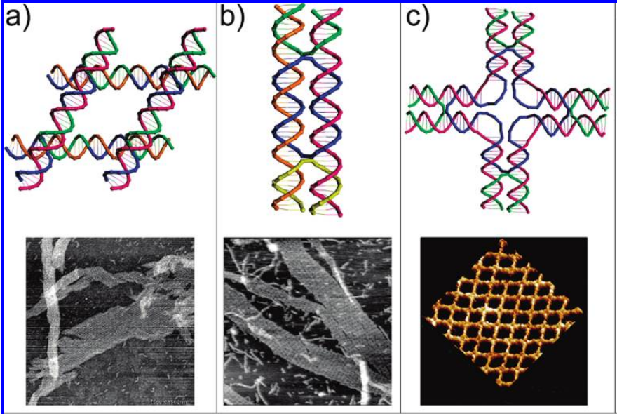
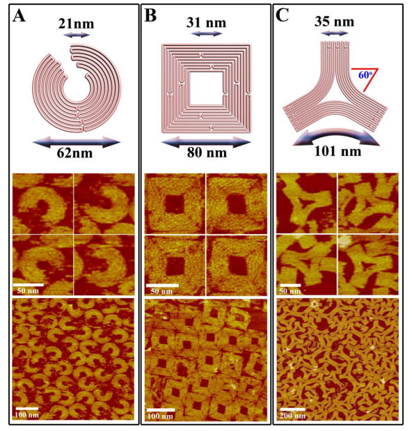
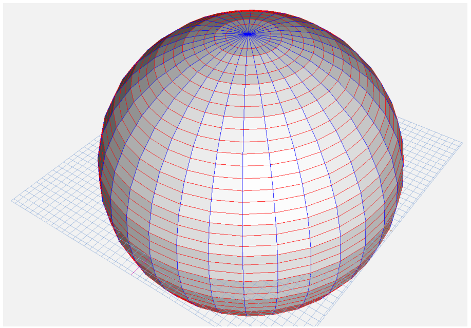

**DNA Origami with Complex Curvatures in Three-Dimensional Space，三维空间中具有复杂曲率的 DNA 折纸** 

# 一、文章简介

# 二、文章内容

## 1、摘要

**实验目的：**

实现一种利用 <u>DNA 折纸技术</u> 设计和构建 <u>自组装 DNA 纳米结构</u> 的方法，这种结构可以在三维空间中形成复杂的曲面。在这种方法中，双螺旋DNA会按照目标物体的圆形轮廓弯曲，并且随后会识别出潜在的链交叉点。

**实验方法：**

- 利用 DNA 同心环生成面内曲率，通过合理设计的几何形状和交叉网络可以将这些DNA同心环限制在二维中。

- 通常情况下，存在形态偏离自然的B型DNA的[扭曲密度](#扭曲密度)的DNA双螺旋结构。通过调整这些相邻的DNA双螺旋之间的交叉点的特定位置和模式以生成面外曲率。

**实验结果：**

组装了一系列具有高曲率的 DNA 纳米结构，例如二维排列的同心环和三维球壳、椭球壳和纳米瓶。

## 2、引言

**研究现状：**

DNA 纳米技术现在可用于组装具有各种几何形状的纳米级结构。

- 通常情况下，是将一系列B型双螺旋结构组合在一起，此时它们的螺旋轴平行于彼此。
- 这样的结构通过 <u>相邻螺旋之间的</u> <u>基于预先存在的B型DNA的结构特征的</u> <u>交叉点</u> 连接在一起。
- 这样形成的DNA纳米结构很大程度上都是多边形形状的变体。

**支架式DNA折纸技术：**

- 使用多个staple短单链来引导、控制scaffold长单链进行折叠的支架式DNA折纸技术，是目前基于平行的B型DNA最成功的构建方法之一。
- 最常用的scaffold（M13）长约7000 nt，通常用于构建数十到数百纳米尺寸的物体。

**传统的基于块的DNA折纸技术：**

以下展示了几个基本的几何三维形状（空心多边形和紧密的长方体），以及一些更复杂的结构（栏杆桥、插槽式或堆叠式的十字结构）

传统的基于块的DNA折纸设计存在的最大限制是其所能实现的细节水平。

- 与数字编码图像类似，DNA折纸结构通常被组织在有限的网格中，网格内的每个正方形/矩形单位（像素）对应于一定长度的双螺旋DNA。
- 通过在网格中填充不同数量的 “DNA像素” 来形成目标形状的细节和曲线的图案
- 对于大多数折纸结构，每个DNA像素与其他像素平行。
- 然而，和所有有限像素技术一样，传统的基于块的DNA折纸设计只能近似地形成圆形元素，并且经常会丢失复杂的细节。

**提出问题：**

尽管这种复杂程度已经足以满足许多用途，但模仿自然界中复杂的几何形状仍然是一个挑战，因为大多数生物分子往往呈现出球形形状，而这些球形结构包含着复杂的三维曲线。

**解决问题/提出新方法：**

最近，Shih 和同事提出了一种巧妙的策略来设计和构建相对复杂的三维 DNA 折纸纳米结构，该结构包含不同的曲率 (18)。

- 该策略通过在一个蜂巢状的紧密交错的螺旋束内选择性地插入和删除碱基对来得到期望的曲率。
- 在该螺旋束中，每个交叉点之间包含7bp，假设B型DNA旋转每个螺旋的碱基对数为10.5bp，则每个交叉点之间的旋转角度为240°
- 将该螺旋束设想为三维细胞阵列，则每个细胞都包含一个7bp长的双螺旋DNA。
- 由于任何阵列单元DNA片段在物理上都受到相邻片段的约束，删除碱基对会导致该片段局部过度旋转和拉力。

尽管如此，在三维表面上设计微妙的曲率仍然是一项艰巨的任务。

**解决问题/提出新方法：**

本文提出了一种DNA折纸设计方案，可以设计出具有非常明显的曲率的、复杂的、任意形状的三维DNA纳米结构。

- 该方法不需要严格遵守传统的设计 “规则” 
- 只需要预先设计好相应的scaffold
- 并且仔细考虑交叉点和缺口点在scaffold上的理想位置
- 得到的结构同时具有灵活性和稳定性。

本文的目标是制定一个可以让研究人员能够通过控制表面曲率来建模任意三维形状的设计原则。这种通用策略脱离了死板的格子模型：首先使用支架（scaffold）定义了目标物体所期望的表面特征，其次定义了DNA构象和和交叉网络的形状。

## 3、实验过程

### 3.1 建立方法的基本设计原则

**设计了一系列弯曲的二维DNA折纸结构，建立方法的基本设计原则（19）。**

1. **第一步是创建所需形状的轮廓。**

- 图C和图D展示了一个7nm宽的同心环结构的例子。这种圆形结构的形状是通过在概念上将双螺旋 DNA“缠绕”成同心环。

- 该结构由三个同心螺旋环组成
  - 螺旋间距离（从一个螺旋的轴心到相邻螺旋的轴心，Δr）为2.5 nm。
  - 这个值基于传统DNA折纸结构中观察到的平行螺旋的紧密程度得出，仅是设计目的的初步近似值（20）。
  - 环的周长（c）应保持螺旋间的距离，因此，Δc = 2π x 2.5nm = 15.7nm。
  - 对于 B 型 DNA，这相当于 48.5 bps，为了设计的简便性和对称性，可以将该值调整为 48 或 50 bps。在图C中，内环、中环和外环分别包含100、150和200 bps。

- 图C：

  - 同心环结构示意图。

  - 长的单链 DNA  scaffold 以浅蓝色显示，短的寡核苷酸staple以各种颜色显示。

  - 相邻环之间需要两个scaffold交叉点以实现三环结构。它们相距较远，位于环的两侧。五个周期性的staple（交叉点）分别连接外环和中环以及中环和内环，将三个弯曲的双螺旋DNA环限制在同一2D平面上。

2. **第二步是在螺旋之间插入周期性的交叉结构(19)。**

- 交叉结构代表着DNA链从一个环切换到相邻的环，跨越螺旋之间的空隙。
- 如果没有这些螺旋之间的交叉，双螺旋DNA的刚性（维持长度约为50纳米）（21）会导致每个环中的DNA完全伸展。
- 交叉点的数量和图案是灵活的，取决于总体设计和每个环的大小。理论上可以考虑Δc（48或50）的任何因子，但是，必须保持灵活性和结构稳定性之间的平衡。若Δc = 48bps，螺旋间的交叉点通常为3、4、6或8个。若Δc = 50bps，交叉点数应调整为5或10。这些值确保交叉点的图案是对称的，并且在连续的交叉点之间有整数个bps。

- 对于连接到两个相邻环的交叉模式（最内环和最外环除外），其必须包含面向相邻螺旋（切线）的核苷酸位置。

- 在图1中，内环/中环和中环/外环在五个不同的交叉点处连接。
  - 因此，内环、中环和外环的交叉点之间分别包含 20、30 和 40 bp，对于 B 型 DNA，分别约等于 2、3 和 4 个螺旋。
  - 对于中环，内环和外环之间的交替交叉点间隔1.5个螺旋，这保证了三个环大致在同一平面上。

3. **最后一步，将长单链scaffold缠绕在每个螺旋的两条链的其中一条上**

- scaffold：图C的浅蓝色链，以典型的含 7249 nt 的M13 scaffold为例
- 每当scaffold从一个环到另一个环时，就会产生一个交叉点；
- 其次，让与scaffold互补的staple作为每个螺旋的第二条链，并产生额外的交叉点以保持结构的完整性（19）。
- 每个staple通常长度为16~60nt，并且在形成交叉点后会改变方向，从而形成稳定的反平行交叉结构（5）。

一旦确定了折叠路径、交叉模式、staple的位置，就会生成一个staple的列表（19）。在完成设计的过程中，还必须考虑到像DNA双螺旋的理想构象等额外的因素。

- 图 C 和 D 所示的每个双螺旋环为10 bps/turn，与10.5 bps/turn的B型DNA非常相似，虽然同心环结构展示了非平行的螺旋在平面上的弯曲，但保持大约10 bps/turn会牺牲一定程度的[设计控制](#设计控制)。
  - 例如，保持约 10 bps/turn 会限制可添加到结构中的同心环的数量。
  - 随着环的半径增加，需要额外的交叉点来双螺旋限制在二维平面中，预计当交叉点之间的碱基对数达到70bps时不能维持所需的刚性水平。
  - 考虑向图C和D中的同心环结构添加第四个、第五个和第六个环：
    - 第四个环将有250个碱基对，五个交叉点，每个交叉点之间有50个碱基对，
    - 第五个环将有300个碱基对，五个交叉点，每个交叉点之间60个碱基对，按照相同的模式，
    - 第六个环将有350个碱基对，五个交叉点，每个交叉点之间70个碱基对。
    - 此时，要稳定外环很可能需要至少一个额外的交叉点，并且得到的双螺旋结构不再符合10bps/turn的标准。

### 3.2 进一步的改进设计与验证

- DNA已被证明具有足够的灵活性，可以兼容某些DNA纳米结构排列中的非自然构象（18）。为了确定适合当前目标物体设计的 DNA 构象范围，我们构建了一系列相邻交叉之间具有不同数量 bp 的三环结构（图 S11），并评估了它们的稳定性 (19)。

- 图S11：
  - 确定同心环设计的稳定DNA构象
  - (A) 六个3环结构a-f和一个4环结构g 连接到一个不对称的基础部分，这些结构旨在评估是否可以利用不同的DNA构象形成稳定的折纸结构。a-f中每个环状结构的构象总结显示在面板C中。基础部分右下角的交错图案被用作对已组装结构进行原子力显微镜成像时的定位。
  - (B) a-f的示意模型。每个环被分为 10 个相等的单位，分别对应于 U1 中的 1 turn、U2 中的 1.5 turn和 U3 中的 2* turn（a为 *1.5 turn和f为 2.5 turn）。相邻环之间的周期性交叉点相隔2个单位，连接U1和U2以及U2和U3的5个交叉点之间有1个单位的偏移。
  - (C) 对于a-f中每个环的单位 (U1、U2、U3) 的碱基对数的总结。
  - (D) 组装而成的整个DNA折纸结构的原子力显微镜图像。子结构 (a-f) 与基础结构之间结合处的灵活性偶尔允许组装好的环折叠回去
  - (E) 直方图展示完全组装的子结构产量。最接近B型DNA的子结构具有最高的产量（10或11 bps/turn），接近100%。过度扭转（8bps/turn）和欠扭转（13bps/turn）的DNA结构会略微降低产量到80~90%。

- 我们发现许多不同的DNA构象与DNA折纸结构是兼容的。这一点在图S13的原子力显微镜图像中得到证实。

- 图S13：
  - 使用AFM图像评估DNA折纸结构中各种双螺旋DNA构象的稳定性。

#### 验证结果

正如预期的那样，最接近自然构象的DNA结构（10和11bps/turn）的产量最高（>96%），而那些与10.5bps/turn偏差最大的结构（8和13bps/turn）的产量最低（图S14）。

- 图S14：
  - 子结构 a-f 的组装产率；图S13包含用于分析的图像
  - 尽管子结构a-f的产量存在差异，但结果表明存在大量不同的DNA构象适用于DNA折纸结构的形成。子结构 c 和 d 的具有非常高的产量，分别为 98% 和 96%。这个结果并不意外，因为这两种结构中的 DNA 构象非常接近自然的 B 型DNA
  - 进一步偏离10.5 bps/turn 会导致产量下降。过度扭转的双螺旋DNA结构（a和b）比欠扭转的结构（e和f）产量略高
  - 上述的产量表明，我们验证过的任何或所有DNA构象都可以用于我们的折纸设计。也就是说，高阶结构的设计不应该局限于单一构象的双螺旋DNA，而可以组合几种不同的构象以实现目标物体所需的曲线和特征。
  - 大多数情况下，我们允许我们结构中的DNA采用自然的构象（或非常接近10.5 bp /turn），只有在必须生成特定曲率时才使用替代构象。

研究结果表明，在设计DNA折纸结构时不必严格遵守10.5bp/turn的限制，这个设计控制的灵活性支持更复杂的设计方案。

### 3.3 二维实例

**九层同心环：**

在考虑了这些参数之后，我们设计了具有更复杂结构特征的物体。图 2A 展示了一种更复杂的同心环设计，含有九层双螺旋环（图 S26）。

- 图2A：
  - 九层同心环结构。该结构中只使用了支架链 7249 个核苷酸中的 3600 个，剩下的单链环未配对，附着在外环上（由于二级结构的形成，经常可见）。

- 图S26：
  - 9层同心环结构示意图
  - scaffold以蓝色表示，代表M13的3600个核苷酸。staple以数字指定，显示为其他不同的颜色，箭头指向3'端。与staple相交的红色短线表示切口。沿scaffold的数字用于识别M13的特定核苷酸。
  - 整个结构被分成8个区域（A-H），每个区域对应一组staple，每个区域用特定的颜色来表示。

这个设计基于Δc = 50 bp，每环的碱基对数从最内环的 200 bp到最外环的 600 bp，每环递增50 bp。随着圆环尺寸的增大，外层螺旋之间需要增加交叉点，以稳定整体结构并保持圆环形状。相邻螺旋之间的交叉点数，最内侧的两个环为 5 个，其余外环为 10 个。表 1 列出了每个同心环层的具体细节。

- 表1：
  - 九层同心环结构的设计参数。
  - 分别列出了每个环中的 bps 数、相邻螺旋之间的交叉数、以 bps/turn 为单位的双螺旋 DNA 构象、半径。

九层同心环结构中的双螺旋 DNA 的构象范围为 9 至 11.7 bps/turn，连续交叉点之间有几种不同的距离。图2A和S16中的AFM图像显示，尽管每个螺旋的弯曲程度不同且包含非B型DNA（19），但九层同心环结构的产量相对较高（约90％）。

- 图2A和S16

**方形框架：**

图2B、S31~S33展示了修改后的方形框架，用它来确定方形元素和圆形元素是否可以组合在单个结构中。

- 图2B：
  - 修改后的11层的同心方形框架结构，外角圆润，内角尖锐

- 图S31：

  - 修改后的带有圆角的方形框架结构的示意图

  - scaffold以蓝色表示，代表M13的6862个核苷酸。

    

  - 各种其他颜色表示staple。在圆角处，红点表示该螺旋中此处的核苷酸面对相邻的螺旋，被视为潜在的交叉点。

  - 该示意图仅供说明目的。staple的真实位置如图S32所示。

- 图S32：

  

  - 将修改后的正方形框架分成了各个部分，显示了staple和切口点的实际位置。

- 图S33：
  
  
  
  - S33-1：修改后的正方形框架的一个部分的放大图。示意图顶部和底部的数字标识核苷酸的位置。示意图左侧的数字指定每个同心正方形。
  
  
  
  - S33-2：这个部分对应于其中一个圆角。
  - S33-3~S33-8：同上

修改后的正方形边框的每个边都基于传统的螺旋平行设计，而每个角都对应着同心圆环设计的四分之一。图 2B和S18的原子力显微镜图像证明：可以使用多种设计策略在单个结构内生成复杂的细节 (19)。

- 图2B和S18

  

**其他结构：**

另外，还构建了几个具有各种结构特征的二维设计（图 S15）。包括有 “开口” 九层环形结构的版本（图S27），以及具有四个明确定义的尖角的未经修改的方形框架（图S28至S30）和三角星形图案（图S34）。

- 图S15：
  - 其他弯曲的二维DNA折纸。
  - 上图：示意图设计；中图：带有50纳米比例尺的放大AFM图像；下图：带有100纳米和200纳米比例尺的缩小AFM图像。
  - (A) 9层同心环结构，展开并将交叉点视为缝合线。
  - (B) 10层同心方形框架结构，带有尖锐的外角和内角。
  - (C) 3角星结构，相邻臂之间的弯曲形成的角度约为60度。

- 图S27：
  - “打开的”九层同心环结构的示意图。
  - 这个 “打开” 的结构与图S26所示的九层同心环结构相同，只是去掉了几根staple
  - 在A区域，不包含staple 1~8；在B区域，不包含staple 5和6。在C区域，不包含staple 6 。
  - 该结构排除了意图穿越一侧的所有5个交叉点的staple，有效地切断了区域B和C之间的链接。
  - 所有使用的staple与未修改的9层同心环结构相同

- 图S28~30：
  - S28：正方形框架结构示意图。scaffold以蓝色显示，表示M13的6720个核苷酸。staple由数字标识，并以各种其他颜色显示，箭头指向3’端。图中穿过staple的短红线表示切口的位置。该图表仅用于说明。实际staple的位置如S29所示。

- 图S34:
  - 3角星结构的示意图。
  - scaffold以蓝色表示，代表M13的7128个核苷酸。staple以不同的颜色表示，箭头指向3‘ 端。
  - 图示顶部和底部的数字标识核苷酸位置。图示左侧的数字标识每个双螺旋。
  - 图中青色、绿色、浅蓝色对应着结构的三个 “臂” ，而其他颜色对应着  “臂” 之间的夹角。设计的所有元素都是对称的，包括scaffold的交叉点。

### 3.4 设计了有曲率的三维DNA折纸结构

- 要生成复杂的三维物体，必须同时在平面内外都创建出曲率。
- 面外曲率可以通过改变DNA双螺旋之间交叉点的相对位置来实现（图E和F）。
- 通常，相邻的B型螺旋（记为 n 和 n+1）由相距21bp的交叉点连接，其中两个螺旋的轴定义了一个平面。
- 第三个螺旋要偏离前两个螺旋所在的平面，可以通过使交叉点产生任意数量的单个核苷酸的偏移，这样的核苷酸数不能等于任何 0.5 turn 的整数倍，否则会导致三个螺旋都处于同一平面上。
- 然而，对于B型DNA，二面角θ，即n和n+1以及n+1和n+2定义的平面之间的角度无法微调，约34.3°/bp是可以实现的最小曲率增量。

- 图E：
  - 在多螺旋 DNA 结构中引入面外曲率的通用方法。所有 DNA 螺旋均呈现天然 B 型构象。θ 有 10 个可能的值，范围从 ~34° 到 ~343°。由于[空间位阻](#空间位阻)，并非所有值都被允许。这里只演示了其中的一些值。
- 图F：
  - 图E中所示结构的各种视图：沿螺旋轴观察、倾斜135°、垂直于螺旋轴

**改进：**

- 可以使用非B型双螺旋来微调 θ 。通过在具有独特构象的双螺旋之间设计合理的交叉点连接（通常在 9 ~ 12 bps/turn），可以实现0~360°的广泛折叠角度旋转（表S5至S10）。
- 尽管这样不能实现所有0~360°之间的角度，但DNA足够灵活，可以近似于最复杂结构中的曲线。

### 3.5 三维实例

1. **建模**

- 一个三维曲面对象的设计流程将这个对象分解成一种线框表示（19）。
- 例如，球体会被分解，就像地球表面被分成纬线圈一样，离赤道越远，纬线圈就越小（图S4）。
- 以球体为例，双螺旋 DNA 缠绕在每个纬线圈上，形成球形的scaffold，从北极开始，不断从一个环到下一个环，穿过赤道，最后到达南极。
- 同心环的确切数量可以变化，取决于可用单链 DNA scaffold的总长度以及目标物体所需的尺寸和直径。

- 图S4：
  - 在STRATA 3D软件中创建的球体模型。
  - 红线和蓝线分别类比于纬线和经线。
  - 为了生成球面，双螺旋DNA从北极到南极沿着红色纬度线指定的路径连续地缠绕成同心圆环。

2. **下一步是生成平面内曲率：**

- 也就是说，确定每个双螺旋环的理想周长（以 bps 为单位）。当从顶部查看线框时，可以观察到二维的同心圆图案（图 S5）。

- 在三维空间中，虽然环的中心距离是恒定的，但是仔细检查二维投影会发现：经线和纬线曲率之间存在复杂的关系。

- 图S5：
  - 球形DNA框架的二维投影。
  - 该视角位于顶部，沿连接北极和南极的轴向向下。在投影中，相邻圆环之间的Δr不是恒定的，在从中心圆环移动到最外层圆环时会逐渐减小。外层环的Δr比内层环小，以便在三维空间中保持相邻环之间的恒定距离。Δc没有像9层同心环结构那样简单对称。
  - 同心圆的二维图案类似于图S1所示的9层同心环结构。
  - 在建模软件中，初始环的周长（bps）随机分配，其余每个环的周长均由其与初始环的关系来确定。
  - 其他的一般因素与二维同心环结构相同：最小环的周长不能小于3纳米，scaffold的长度限制了整个目标的大小等。

3. **设计平面内（纬度）曲率后，必须引入平面外（经度）曲率。**

- 将沿经线的横截面想象为穿过北极和南极的纵截面，在这个截面上可以看到每个纬向环的螺旋轴，这有助于理解。
- 现在仅考虑横截面的一半（东半部分或西半部分）；从北极 的 n 和 n + 1 开始，构想一个通过两个螺旋中心的单一平面。
- 继续此过程，在 n + 1 和 n + 2 以及每对连续的环之间创建一个平面，直到到达南极。
- 纬向环的总数决定了相邻平面之间的二面角 (θ)。
  - 例如，如果球形线框由 10 个双螺旋环构成，则相邻平面之间的角度将为 162°（180° – 180°/环数）。相邻环之间的交叉点（以及每个构成交叉点的核苷酸的位置）应设计近似于162°。
- 最后，使用与二维情况相同的方法引入周期性的交叉点和staple。
  - 每个环的尺寸决定了交叉点的数量，这些交叉点用于维持环的形状，即整体结构的稳定性。
  - 交叉点之间的bp数将决定每个环中DNA的构象，并最终决定用于有道平面外曲率（经度）的角度（表S5~S10）。
  - 面内曲率和面外曲率实际上是耦合的：
    - 因为 DNA 双螺旋的直径是固定的，所以修改球面半径和环周长将改变用于生成球体的环数，即改变 θ。
    - 相反，调整 θ 将改变相应的半径和周长。
- 因此，每个弯曲的三维折纸结构都必须手动设计，并仔细考虑如何最好地引入面内和面外曲率、理想的交叉图案、staple的适当位置和长度。并且，不是所有的 r 和 θ 都是相互兼容的，某些情况可能需要牺牲对一个参数或另一个参数的控制才能产生所需的结构细节。
- 仔细检查所有二维、三维对象的设计原理图将有助于更好地理解设计过程以及 r 、θ 、DNA构象、交叉模式、staple放置的位置等等之间的复杂关系。

**其他结构：**

- 基于这些设计原则，我们创建了平面内外曲率，并创建了几个复杂的三维DNA结构示例，包括半球形、球形、椭球形和 “圆底纳米瓶”（图3）。

- 图3：

  - 带有复杂三维曲率的DNA纳米结构
  - （A）半球的示意图。
  - （B）球体的示意图。
  - （C）椭球体的示意图。

  

  - （D）在[TEM](#TEM)网格上随机沉积的球体的TEM图像。凹面可见为暗区。
  - （E）在TEM网格上随机沉积的球体的TEM图像。由于球的对称性，方向无法确定。
  - （F）椭球体的 TEM 图像。椭球体的轮廓是可见的。 (D)、(E) 和 (F) 中 TEM 图像的比例尺为 50 nm。
  - （G）纳米瓶的示意图。
  - （H）纳米瓶的 AFM 图像。比例尺为 75 nm。
  - （I）在TEM网格上随机沉积的纳米瓶的 TEM 图像。图像中清晰可见烧瓶的圆柱形的颈部和圆形的底部。比例尺为 50 nm。

#### 详细的设计方案

**半球和球：**

图3A所示的半球包含12个同心纬度环，直径范围从北极的5.6 nm到赤道的42.0 nm（图S35）。θ = 172.5° 是一个常数，在图3D和S21中的TEM图像中可以识别半球最明显的特征是赤道环的边界，所观察到的赤道直径与预期值42.0nm（19）一致。有时可以在图 3D 所示的 TEM 图像中看到半球的中空腔（当它随机沉积在倾斜的网格上时），这提供了其三维结构的证据。

- 图S35：
  - 半球体和球体结构的示意图。
  - scaffold通过数字来表示，含有3313个M13核苷酸。
  - scaffold的交叉点由橙色表示。staple用其他各种颜色表示，并在 5‘ 端用数字标记，箭头指向 3’ 端。
  - 对于球体，连接了两个半球体。示意图中最外层的黑色环代表第二个半球的边缘。
  - 标记旁带有 * 的staple表示它们来自第二个半球。对于球体，使用了 M13 的 6626 核苷酸。

- 图S21：
  - 半球结构的TEM图像
  - 上部面板：从多个角度显示的基本设计示意图（显示scaffold交叉点）。
  - 下部面板：已组装结构的TEM图像，可以进行缩放。所选图像中标有比例尺。
  - 这些结构以各种方向随机沉积在TEM网格上。
  - 在许多图像中，半球的凹陷中空表面清晰可见，其中空洞被染色变暗。
  - 中图左上方面板缩放图像中的半球以与TEM图像中的球形相同的方式沉积在TEM网格上，呈现出完美的圆形。

图 3B 所示的完整球体由 24 个环组成，是半球设计的扩展（图 S35）。与半球类似，环的直径从南北极的5.6nm到赤道的42.0nm，而θ = 172.5° 是一个常数（恒定）。在图3E和图S20展示的TEM图像中可以看到球形物体，每个球体的直径约为40 nm（19）。

TEM图像中的每个环的外观一致性表明成功形成了预期的三维球体结构。如果结构未按设计组装，我们可能会看到各种各样的只形成了部分的环，甚至可能会看到几种不同直径的环。球体和半球体（第1至12个环）的设计细节的完整描述在表格S4中展示。

- 图S20：
  - 球形结构的TEM图像
  - 上部面板展示了基本设计的示意图，包括scaffold的交叉部分，以及从不同角度的视角。
  - 下部面板展示了组装结构的TEM图像，包括放大和缩小的视角。在一些选定图像上标有比例尺。
  - 图像中的圆形形状符合预期，非常清晰，几乎没有任何畸变。
  - 由于染色条件的变化，球的外观存在一些差异。

**椭球：**

球体和半球结构证明了我们的方法能够生成具有不同面内曲率（维度、半径）和面外曲率（经度、θ）的三维结构，更进一步的，图3C中展示的椭球结构测试了我们创建半径和θ同时发生改变的结构的能力（图S36）。

在单一结构内逐渐改变面内和面外曲率的能力对于构建具有更复杂设计的 DNA 纳米结构是必要的。该椭球体包含 29 个环，直径范围从两极的 9.8 nm 到赤道的 34.6 nm（表 S4）。在极点附近，θ值较小（曲率较大），而在赤道附近，θ值较大（曲率较小）。

- 图S36：
  - 椭球结构的示意图
  - scaffold以蓝色表示，代表M13的7232个核苷酸。staple用各种颜色显示，箭头指向了它们的 3‘ 端
  - 示意图顶部和底部的数字为核苷酸位置。
  - 示意图右侧和左侧的数字指定每个双螺旋。

图3F和S22中的TEM图像证实了椭球结构的成功形成，并进一步证明了我们的方法的实用性（19）。

- 图S22：
  - 椭球结构的TEM图像
  - 上部面板：从几个角度显示的基本设计的示意图（显示了scaffold交叉点）
  - 下部面板：组装结构的逐步放大和缩小的TEM图像。所选图像上标有比例尺。
  - 形成的椭圆形状符合预期，非常清晰可见，几乎没有畸变。
  - 由于染色条件的差异，椭球体的外观会有所不同。

**纳米瓶：**

最后的演示，我们试图构造一个半径和θ同时变化的非对称物体。图3G展示的 ”纳米瓶“ 反映了大多数自然物体（例如噬菌体病毒）和非自然物体中发现的复杂程度。

- 该瓶由35个同心双螺旋DNA环组成（表S4），构成瓶的颈部的环的直径恒定为 13.2 nm，而圆底则由几个不同尺寸的环组成，最宽处的直径为 40 nm。

- 在瓶颈中，θ 为常数180°，而在圆底最宽处为160°，在瓶颈和底部的交界处最大可达230°。图3H中的AFM图像，以及图3I 和S23中的TEM图像，证明了纳米瓶的成功形成（19）。

- TEM图像中可以清晰地看到瓶的轮廓，特别是三维的结构轮廓；可以通过尺寸的不同清晰地分辨出圆形的底部和圆柱形的颈部。

- 图S23：
  - 纳米瓶结构的TEM图像。
  - 上部面板：从几个角度显示的基本设计的示意图，显示scaffold的交叉点
  - 下部面板：组装结构的放大和缩小TEM图像，选定图像上的比例尺已标出。
  - 烧瓶的形状符合预期，非常清晰，几乎没有明显的变形。
  - 在图像中很容易区分宽大的圆底和狭窄的颈部空腔。
  - 由于染色条件的变化，烧瓶的外观会有所不同。

## 4、挑战

这里介绍的方法相当容易执行，产量与传统的支架 DNA 折纸方法相当。然而，为了充分发挥该技术的潜力，需要解决一些挑战。

- 首先，与传统的 DNA 折纸一样，各种单链scaffold的可用性是有限的。理想情况下，如果可以找到更长的支架替代方案，则可以构建具有更复杂特征的更大物体。
- 另一个重要的持续目标是开发自动化软件以帮助设计过程。因为手动地考虑设计参数之间的复杂关系是最耗时的步骤，并且需要对基本工程原理和互相连接的 DNA 的行为有深入的了解。

尽管对于进一步的发展存在这些挑战，但目前的策略提高了我们控制DNA复杂的纳米结构并创建更多分子工程构建块的能力。

# 三、基础补充

## 扭曲密度

[回到原文](#扭曲密度回到原文)

扭曲密度，twist density，通常用于描述某个物体或系统的旋转量或扭曲程度，是描述线性分子螺旋度的一个参数。

在DNA或RNA分子中，扭曲密度会影响分子的碱基堆叠和骨架的旋转，对于分子的三维结构和功能具有重要的作用。

在数学、物理、化学等学科中都有应用。

## 设计控制

[回到原文](#设计控制回到原文)

是指为保证满足产品设计规定为要求所制订并执行控制和验证产品设计的计划、规程、要求和手段

## 空间位阻

[回到原文](#空间位阻回到原文)

空间位阻效应又称立体效应。空间位阻效应主要指分子中某些原子或基团彼此接近而引起的空间阻碍作用。

## TEM

[回到原文](#TEM回到原文)

透射电子显微镜，显微镜的一种，可以看到在光学显微镜下无法看清的小于0.2um的细微结构，这些结构称为亚显微结构或超微结构。

电子束加速后，撞击样品，当电子穿过密集区域时损失能量，然后，电子穿过物镜，放大图像，将其投影到荧光屏上，荧光屏上涂有一种化学物质，当电子与其接触时，该化学物质会出现亮点。亮点的强度取决于电子撞击荧光屏时所具有的能量。然后。荧光屏下的摄像头捕获亮点形成的图像，显示在计算机屏幕上。
