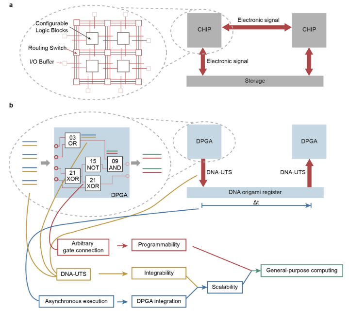
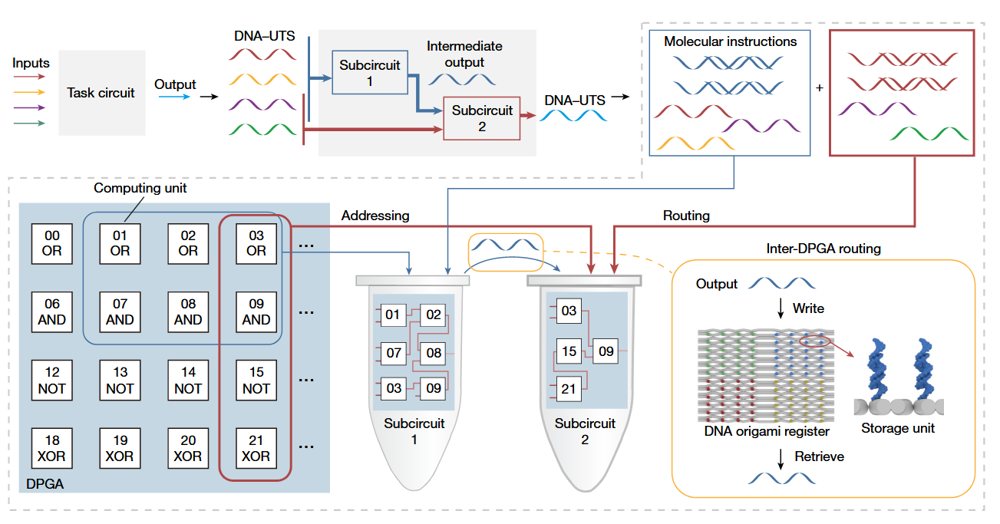

**DNA-based programmable gate arrays for general-purpose DNA computing，用于通用DNA计算的基于DNA的可编程门阵列**

# 一、

# 二、

## 1、摘要

**背景：**

- 过去几十年已经见证了电子和光子集成电路的发展，从特定应用到可编程。[1，2] 。

- 虽然液相DNA电路在编码和执行算法时具有大规模并行性的潜力[3，4]，但通用DNA集成电路（DNA integrated circuits，DICs）的开发仍有待探索。

**提出的新方法：**

- 在这里，我们通过集成多层 基于DNA的可编程门阵列（DNA-based programmable gate arrays，DPGAs）演示了一种DIC系统。

- 我们发现，使用通用的单链寡核苷酸作为统一的传输信号可以可靠地集成大规模DIC，并实现最小的[泄漏](#泄漏电流)和高保真度的通用计算。
- 可以通过布线指令（switch box/Routing Switch）对一个有24个可寻址的双轨门的单个DPGA进行重新配置，从而实现超过1000亿个不同的电路。

- 此外，为了控制分子之间固有的随机碰撞，我们设计了 DNA 折纸寄存器，为[级联](#级联) DPGA 的异步执行提供方向性。

**应用：**

- 我们通过一个求解二次方程的 DIC 来证明这一点，该 DIC 由三层级联的 DPGA 组装而成，该DPGA由 30 个逻辑门和大约 500 条 DNA 链组成。

- 我们进一步展示了，DPGA与[模数转换器](#模数转换器)（analog-to-digital converter）的集成，可以用于分类与疾病相关的 microRNA 。

**意义：**

- 在没有明显信号衰减的情况下集成大规模 DPGA 网络的能力，标志着通用 DNA 计算迈出了关键的一步。

## 2、引言

**背景：**

利用生物分子相互作用的液相生物计算由于其大规模并行性和与生物系统的内在兼容性，已经得到了积极的探索。

已经实现了例如自动机[5]、逻辑电路[6-8]、决策机[9,10]和神经网络[11]的计算DNA反应网络，它们在分子信息处理[4,12]，合成智能装置[13]和生物医学应用[14-16]方面表现出了潜力。

**提出问题：**

尽管取得了这样的进展，但大多数计算系统都是根据要实现的特定算法或有限数量的计算任务，来定制相应的硬件的。

**解决问题：**

通用电子集成电路不需要根据特定的应用来定制硬件，它允许通过软件编程来执行特定的功能。这为原型计算机设备 (的设计) 提供了更高级的平台，无需提前了解底层的物理知识。

值得注意的是，经典的基于硅的计算机、新兴的基于碳纳米管的计算机以及量子计算机也经历了类似的从专用（例如专用集成电路，[ASIC](#ASIC)）到通用的演变。（例如现场可编程门阵列，FPGA）[2,17–20]

**提出问题：**

可编程性和可扩展性构成了实现通用计算的两个关键因素。可编程性使设备能够实现各种算法，而可扩展性则允许通过向系统添加资源来处理越来越多的工作。

电子集成电路中的门是物理定位的，通用电信号以定向方式传输。与电子集成电路不同，DNA集成电路（DIC）中的生物分子组件在溶液中扩散和混合[21]，使得分子间固有的随机碰撞难以控制，这阻碍了可扩展和可编程生物计算设备的开发。

在典型的DNA计算系统中，DNA组件的[正交性](#正交性)的限制和难以控制的分子固有的随机碰撞使得实现通用DNA计算具有挑战性。

人们付出了大量努力来探索 DNA 电路的可编程性[22, 23]。然而，由于对于如何集成这些液相系统整体上缺乏方向性，所以，可编程DNA系统的可扩展性还需要继续探究。

与电子电路或量子电路中的子组件组装类似[24, 25]，空间分离技术已经被引入到生物细胞[26]和人工合成[27-29]的分子反应系统中以增加方向性，但其在系统层面的可扩展性有限[29]。

**解决问题：**

基于硅的FPGA中的电子形成了设备内编程和设备间通信的通用信号，受到它的启发，我们在这里通过使用 通用单链DNA寡核苷酸 作为统一传输信号（DNA-uniform transmission signal，DNA-UTS），开发了高度可扩展的、基于DNA的可编程门阵列（DPGAs；Extended Data Fig.1）

| noun                                     | translation           | explanation                                                  |
| ---------------------------------------- | --------------------- | ------------------------------------------------------------ |
| Configurable Logic Blocks，CLB           | 可配置逻辑块          | 可配置逻辑块是指一个可以根据不同的需求和参数进行设置和调整的模块，其功能可以根据不同的输入和输出进行配置，以实现多种不同的逻辑处理和运算。这种块通常可以被用于不同的软件或系统中，以便于实现功能的定制和灵活的适应性。可配置逻辑块通常使用标准的模块接口进行连接和通信，以方便其在系统中的集成。例如，可配置逻辑块可以用于嵌入式设备的控制逻辑、数据处理和通信协议的处理等方面。 |
| Routing Switch                           | 布线开关              | switch box，可编程门阵列中的switch box（开关盒）是一个包含多个开关（或传输门）的模块，用于控制器件间的信号传输。它通常位于可编程门阵列的输入端，并用于指定输入信号的路由以及对应输出的选择。在可编程门阵列内部，开关盒可以看作一个可编程的交叉开关网络，其作用是将输入引脚的信号传送到正确的门或单元上，以实现特定的逻辑功能。开关盒的大小和复杂度随着可编程门阵列的规模和特性而有所变化，通常由多个相互连接的基本开关组成，例如传输门、开关、多路复用器等。 |
| I/O Buffer                               | 输入/输出缓冲区       | 输入/输出缓冲区是指计算机系统中用于将输入输出数据从处理器与外设之间进行传输的缓冲区，它们起到了数据交互的桥梁作用。输入/输出缓冲区的作用在于解决输入输出速度的不匹配，其中的缓冲可以平滑输入输出之间的速度差异。此外，输入/输出缓冲区还可以降低计算机系统和外设之间的数据传输负载，提高数据传输的效率和可靠性。 |
| CHIP                                     | 芯片                  | CHIP指内含集成电路的硅片，是从多片集合的晶圆(Wafer)上所切割而来，体积很小，常常是计算机或其他设备的一部分。 |
| Electronic signal                        | 电子信号              | 电子信号是指通过电学或电磁学的方式传递的信息信号，可用于在电子设备之间进行通信或数据传输。电子信号分为模拟信号和数字信号两种类型，其中模拟信号是连续的，数字信号则是离散的。电子信号广泛用于通信、计算机、汽车、家用电器和医疗设备等各个领域。 |
| Storage                                  | 存储                  | 存储是指将数据或信息保存在存储介质上，以便随后的存取或使用。 |
| DPGA，DNA-based programmable gate arrays | 基于DNA的可编程门阵列 | 基于DNA的PGA，可编程门阵列（PGA, Programmable Gate Array）是一种数字电路芯片，可以通过编程实现不同的逻辑电路功能，类似于一张白纸，用户可以自行设计所需要的电路。PGA主要由可编程逻辑单元和可编程互联网络组成，逻辑单元是可编程的逻辑门，将输入信号进行逻辑运算后输出结果。互联网络则决定了这些逻辑单元间如何连接，从而构成所需要的逻辑电路。PGA的逻辑单元和互联网络可以被编程修改，使得芯片具有不同的逻辑功能，可灵活适应不同的应用场景。PGA的优点在于能够实现高度自定义的逻辑设计，相比定制的ASIC芯片，设计周期更短，成本更低。 |
| DNA-UTS                                  | DNA统一传输信号       | 使用通用单链DNA寡核苷酸作为统一传输信号                      |
| DNA origami register                     | DNA折纸寄存器         | 寄存器是计算机中尺寸最小、存储容量也最小（通常 4~8 个字节）、但读写效率最高的存储器，位于 CPU 内部。 寄存器无法永久性地存储数据（属于易失性存储器），它的主要工作是暂时存储当前 CPU 正在处理的指令以及 CPU 将要使用的数据或者指令。 |
| Arbitrary gate connection                | 任意门连接            | 可以选择需要的逻辑门进行连接                                 |
| Programmability                          | 可编程性              | \                                                            |
| Integrability                            | 可集成性              | 能够或者可以将一些孤立的事物或元素通过某种方式集中在一起而产生联系的属性。 集成是一些孤立的事物或元素通过某种方式集中在一起，产生联系，从而构成一个有机整体的过程。 |
| Asynchronous execution                   | 异步执行              | 异步执行是一种编程技术，用于让程序在处理某个任务的同时，还能继续处理其他任务，而不需要等待该任务完成后再继续。各语句执行结束的顺序与语句执行开始的顺序并不一定相同。与同步执行不同的是，在同步执行中，在某个任务还没有完成时，程序必须一直等待该任务完成后才能继续处理下一个任务。因此，异步执行可以可以实现多任务并行执行，提高程序的响应速度和效率 |
| DPGA integration                         | DPGA集成              | 级联 DPGA 的异步执行会阻止 DPGA 之间的分子扩散，从而允许 DPGA 集成。 |
| Scalability                              | 可扩展性              | 可扩展或者可扩展性指的是，如果用一台计算机解决了一些问题，当使用两台计算机，只需要一半的时间就可以解决这些问题，或者说每分钟可以解决两倍数量的问题。两台计算机构成的系统如果有两倍性能或者吞吐，就是可扩展性。 |
| General-purpose computing                | 通用计算              | 不局限于只能实现特定的算法                                   |

- Extended Data Fig.1：
  - a：电子芯片集成架构。
  - b：可扩展 DPGA 集成的层次结构图（按逻辑排列显示）。
    - 在电子集成电路中，通用芯片可以在物理上集成，芯片与存储器之间通过电子实现信息交换。
    - 类似于电子信号，DNA-UTS也可以用于传输信息。门与门之间和DPGA之间的信息传输都是通过DNA-UTS实现的。有了这样的统一信号，就可以在门级和DPGA级都实现可集成性。级联 DPGA 的异步执行会阻止 DPGA 之间的分子扩散，从而允许 DPGA 集成。
    - 由此，通过使用 DNA-UTS 和 DNA 折纸寄存器实现了可扩展性。
    - 此外，DPGA允许任意门连接，提供了丰富的编程空间。
    - 总的来说，DICs的可编程性和可扩展性使其支持通用计算。

## 3、可扩展的DPGA架构

如图1所示，在一种通过DNA-UTS实现的 典型的 可扩展的 DPGA架构中，某个任务电路不能仅通过一个DPGA实现，于是这样的任务电路被分成子电路，每个子电路被映射到一个DPGA，并由其执行。

- 图1：DPGA编程的流程示意图

# 三、

## 级联

[回到原文](#级联回到原文)

把二个以上的设备通过某种方式连接起来，能起到扩容（ 1 + 1 > 2 ）的效果就是级联。

## 模数转换器

[回到原文](#模数转换器回到原文)

analog-to-digital converter，ADC。通常是指一个将模拟信号转变为数字信号的电子元件。通常的模数转换器是将一个输入电压信号转换为一个输出的数字信号。将时间连续、幅值也连续的模拟信号转换为时间离散、幅值也离散的数字信号。

这种转换器的基本原理是把输入的模拟信号按规定的时间间隔采样，并与一系列标准的数字信号相比较，数字信号逐次收敛，然后显示出代表此信号的二进制数，模拟数字转换器有很多种，如直接的、间接的、高速高精度的、超高速的等。每种又有许多形式。

模数转换一般要经过采样、量化和编码这几个步骤 ：

- 采样是指用每隔一定时间的信号样值序列来代替原来在时间上连续的信号，也就是在时间上将模拟信号离散化 。

- 量化是用有限个幅度值近似原来连续变化的幅度值，把模拟信号的连续幅度变为有限数量的有一定间隔的离散值 。

- 编码则是按照一定的规律，把量化后的值用二进制数字表示，然后转换成二值或多值的数字信号流。这样得到的数字信号可以通过电缆、微波干线、卫星通道等数字线路传输。

## 泄漏电流

[回到原文](#泄漏电流回到原文)

泄漏电流是指电器在正常工作时，其火线与零线之间产生的极为微小的电流，相当于一般电器的静电一样。绝缘体是不导电的，但实际上几乎没有什么一种绝缘材料是绝对不导电的。任何一种绝缘材料，在其两端施加电压，总会有一定电流通过，这种电流的有功分量叫做泄漏电流，而这种现象也叫做绝缘体的泄漏。

## ASIC

[回到原文](#ASIC回到原文)

ASIC 的全称是专用集成电路。这些电路是特定于应用的，即为特定应用量身定制的 IC。这些通常是根据特定应用程序的要求从根级别设计的。

IC：集成电路，该技术通过增加每个芯片的逻辑门密度来减小电子产品的尺寸。

## 正交性

[回到原文](#正交性回到原文)

简单直观一些来说，想象两条相互垂直的线，其中一条线上的一个点无论如何移动，这个点在另一条线上的投影位置都不会变化。因而“正交”具有一种“不相关”“独立”的含义（解耦性）。

合成生物学中的正交性：通俗地讲，参与生物正交反应的一对反应物只认对方，不理会周围其他的分子，彼此保持高度专一性。

DNA链的正交性：很容易通过序列互补实现精确识别
