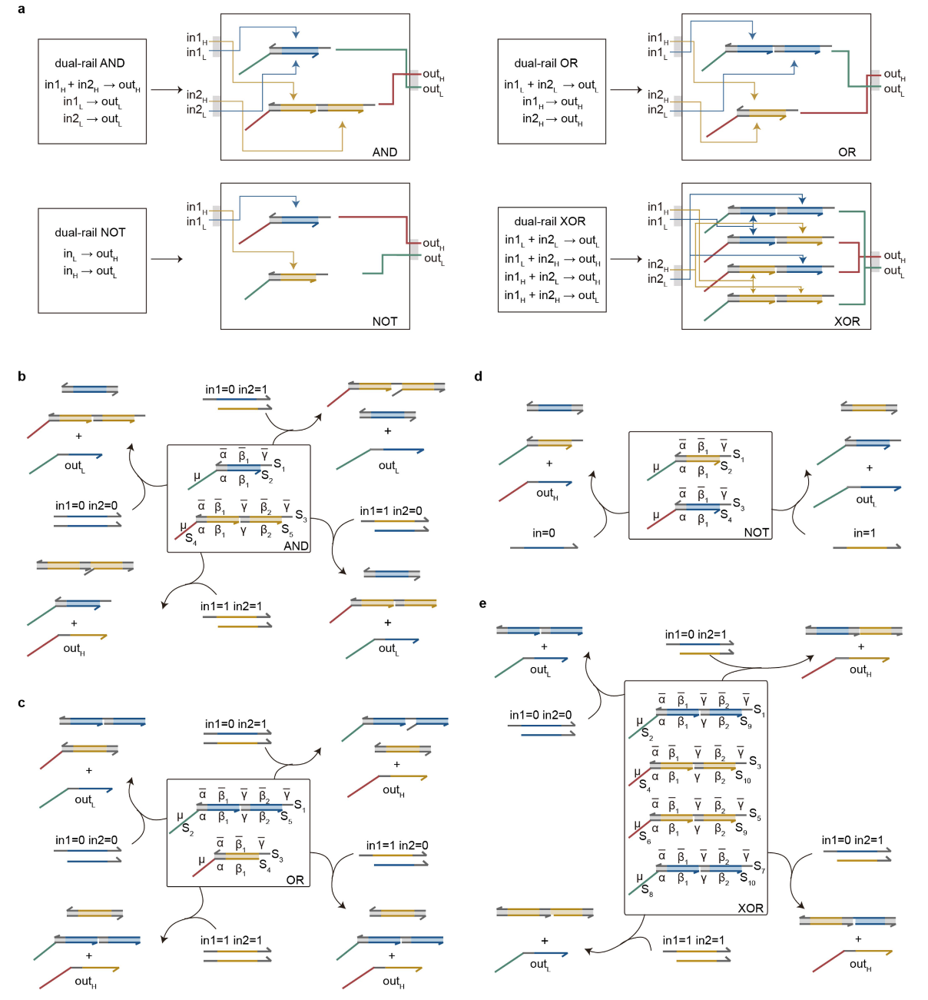
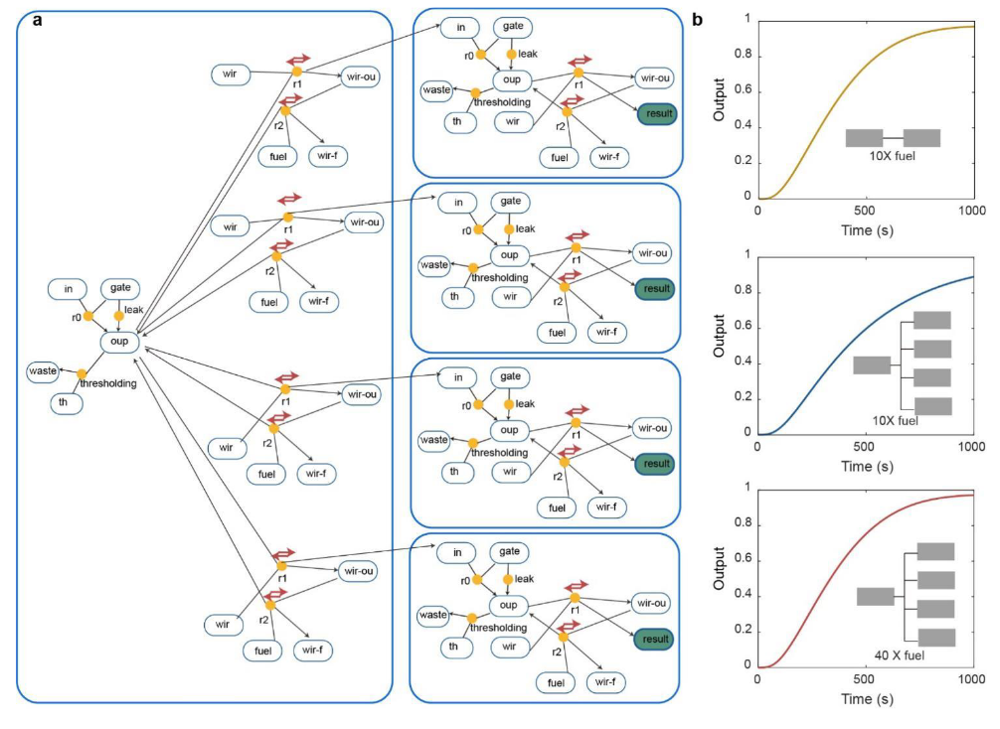
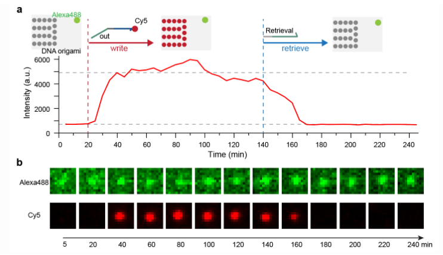
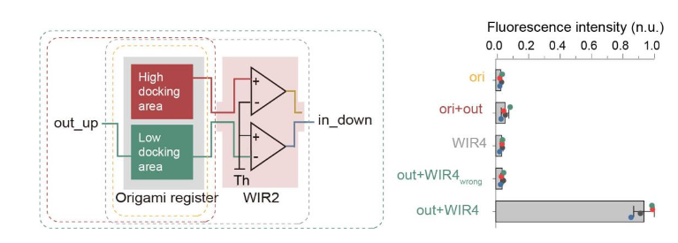
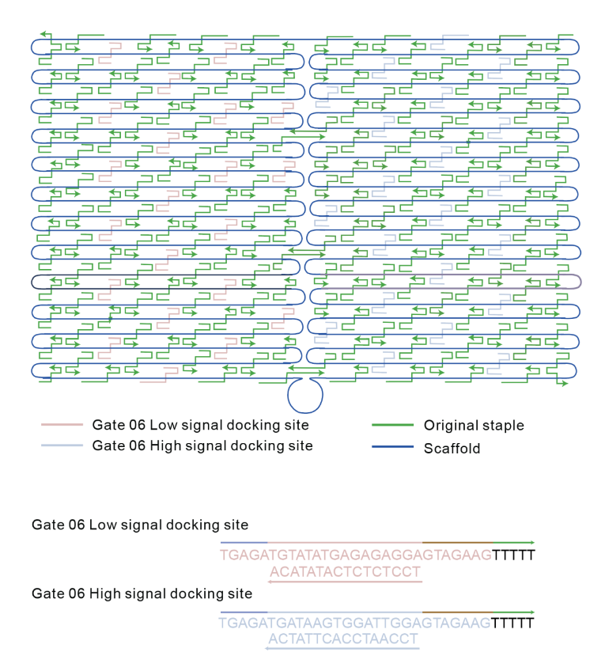

**DNA-based programmable gate arrays for general-purpose DNA computing，用于通用DNA计算的基于DNA的可编程门阵列**

**Supplementary Information**

**副标题：**Large-scale integration of reconfigurable DNA-based programmable gate arrays for generalpurpose DNA computing

实现大规模集成可重新配置的DPGA，来用于通用DNA计算：可编程性+可拓展性

# 一、摘要和引言

## 1、摘要

**背景：** 

- 过去几十年已经见证了电子和光子集成电路的发展，从特定应用到可编程。[1，2] 。

- 虽然液相DNA电路在编码和执行算法时具有大规模并行性的潜力[3，4]，但通用DNA集成电路（DNA integrated circuits，DICs）的开发仍有待探索。

**提出的新方法：**

- 本文通过集成多层 基于DNA的可编程门阵列（DNA-based programmable gate arrays，DPGAs）演示了一种DIC系统。

- 本文发现，使用通用的单链寡核苷酸作为统一的传输信号可以可靠地集成大规模DIC，并实现最小的泄漏和高保真度的通用计算。
- 可以通过接线指令（switch box/Routing Switch/Wiring Instruction）对一个有24个可寻址的双轨门的单个DPGA进行重新配置，从而实现超过1000亿个不同的电路。

- 此外，为了控制分子之间固有的随机碰撞，本文设计了 DNA 折纸寄存器，为级联 DPGA 的异步执行提供方向性。

**应用：**

- 本文通过一个求解二次方程的 DIC 来证明，该 DIC 由三层级联的 DPGA 组装而成，该DPGA由 30 个逻辑门和大约 500 条 DNA 链组成。

- 本文进一步展示了，DPGA与模数转换器（analog-to-digital converter）的集成，可以用于分类与疾病相关的 microRNA 。

**意义：**

- 在没有明显信号衰减的情况下集成大规模 DPGA 网络的能力，标志着通用 DNA 计算迈出了关键的一步。

## 2、引言

**背景：**

利用生物分子相互作用的液相生物计算由于其大规模并行性和与生物系统的内在兼容性，已经得到了积极的探索。

已经实现了例如自动机[5]、逻辑电路[6-8]、决策机[9,10]和神经网络[11]的计算DNA反应网络，它们在分子信息处理[4,12]，合成智能装置[13]和生物医学应用[14-16]方面表现出了潜力。

**提出问题：**

尽管取得了这样的进展，但大多数计算系统都是根据要实现的特定算法或有限数量的计算任务，来定制相应的硬件的。

**解决问题：**

通用电子集成电路不需要根据特定的应用来定制硬件，它允许通过软件编程来执行特定的功能。这为原型计算机设备 (的设计) 提供了更高级的平台，无需提前了解底层的物理知识。

值得注意的是，经典的基于硅的计算机、新兴的基于碳纳米管的计算机以及量子计算机也经历了类似的从专用（例如专用集成电路，ASIC）到通用的演变。（例如现场可编程门阵列，FPGA）[2,17–20]

**提出问题：**

可编程性和可扩展性构成了实现通用计算的两个关键因素。可编程性使设备能够实现各种算法，而可扩展性则允许通过向系统添加资源来处理越来越多的工作。

电子集成电路中的门是物理定位的，通用电信号以定向方式传输。与电子集成电路不同，DNA集成电路（DIC）中的生物分子组件在溶液中扩散和混合[21]，使得分子间固有的随机碰撞难以控制，这阻碍了可扩展和可编程生物计算设备的开发。

在典型的DNA计算系统中，DNA组件的正交性的限制和难以控制的分子固有的随机碰撞使得实现通用DNA计算具有挑战性。

人们付出了大量努力来探索 DNA 电路的可编程性[22, 23]。然而，由于对于如何集成这些液相系统整体上缺乏方向性，所以，可编程DNA系统的可扩展性还需要继续探究。

与电子电路或量子电路中的子组件组装类似[24, 25]，空间分离技术已经被引入到生物细胞[26]和人工合成[27-29]的分子反应系统中以增加方向性，但其在系统层面的可扩展性有限[29]。

**解决问题：**

基于硅的FPGA中的电子形成了设备内编程和设备间通信的通用信号，受到它的启发，我们在这里通过使用 通用单链DNA寡核苷酸 作为统一传输信号（DNA-uniform transmission signal，DNA-UTS），开发了高度可扩展的、基于DNA的可编程门阵列（DPGAs；Extended Data Fig.1）。

- Extended Data Fig.1：
  - a：电子芯片集成架构。
  - b：可扩展 DPGA 集成的层次结构图（按逻辑排列显示）。
    - 在电子集成电路中，通用芯片可以在物理上集成，芯片与存储器之间通过电子实现信息交换。
    - 类似于电子信号，DNA-UTS也可以用于传输信息。门与门之间和DPGA之间的信息传输都是通过DNA-UTS实现的。有了这样的统一信号，就可以在门级和DPGA级都实现可集成性。级联 DPGA 的异步执行会阻止 DPGA 之间的分子扩散，从而允许 DPGA 集成。
    - 另外，DPGA中的双轨门可以被多次调用，允许电路重新配置而不需要重新设计DNA序列。并且所有逻辑门的序列都是正交的。
    - 由此，通过使用 DNA-UTS 和 DNA 折纸寄存器实现了可扩展性。
    - 此外，DPGA允许任意门连接，提供了丰富的编程空间。DPGA的配置是通过寻址和连接目标电路所需的门来实现的。在这些情况下，配置的DPGA可以抽象为更高级别的计算单元，其中输入层逻辑门的输入端口和输出层逻辑门的输出端口分别用作DPGA级输入和输出端口。
    - 总的来说，DICs的可编程性和可扩展性使其支持通用计算。

| noun                                     | translation             | explanation                                                  |
| ---------------------------------------- | ----------------------- | ------------------------------------------------------------ |
| Configurable Logic Blocks，CLB           | 可配置逻辑块            | 可配置逻辑块是指一个可以根据不同的需求和参数进行设置和调整的模块，其功能可以根据不同的输入和输出进行配置，以实现多种不同的逻辑处理和运算。这种块通常可以被用于不同的软件或系统中，以便于实现功能的定制和灵活的适应性。可配置逻辑块通常使用标准的模块接口进行连接和通信，以方便其在系统中的集成。例如，可配置逻辑块可以用于嵌入式设备的控制逻辑、数据处理和通信协议的处理等方面。 |
| Routing Switch                           | 布线开关/信息传送转换器 | switch box，可编程门阵列中的switch box（开关盒）是一个包含多个开关（或传输门）的模块，用于控制器件间的信号传输。它通常位于可编程门阵列的输入端，并用于指定输入信号的路由以及对应输出的选择。在可编程门阵列内部，开关盒可以看作一个可编程的交叉开关网络，其作用是将输入引脚的信号传送到正确的门或单元上，以实现特定的逻辑功能。开关盒的大小和复杂度随着可编程门阵列的规模和特性而有所变化，通常由多个相互连接的基本开关组成，例如传输门、开关、多路复用器等。 |
| I/O Buffer                               | 输入/输出缓冲区         | 输入/输出缓冲区是指计算机系统中用于将输入输出数据从处理器与外设之间进行传输的缓冲区，它们起到了数据交互的桥梁作用。输入/输出缓冲区的作用在于解决输入输出速度的不匹配，其中的缓冲可以平滑输入输出之间的速度差异。此外，输入/输出缓冲区还可以降低计算机系统和外设之间的数据传输负载，提高数据传输的效率和可靠性。 |
| CHIP                                     | 芯片                    | CHIP指内含集成电路的硅片，是从多片集合的晶圆(Wafer)上所切割而来，体积很小，常常是计算机或其他设备的一部分。 |
| Electronic signal                        | 电子信号                | 电子信号是指通过电学或电磁学的方式传递的信息信号，可用于在电子设备之间进行通信或数据传输。电子信号分为模拟信号和数字信号两种类型，其中模拟信号是连续的，数字信号则是离散的。电子信号广泛用于通信、计算机、汽车、家用电器和医疗设备等各个领域。 |
| Storage                                  | 存储                    | 存储是指将数据或信息保存在存储介质上，以便随后的存取或使用。 |
| DPGA，DNA-based programmable gate arrays | 基于DNA的可编程门阵列   | 基于DNA的PGA，可编程门阵列（PGA, Programmable Gate Array）是一种数字电路芯片，可以通过编程实现不同的逻辑电路功能，类似于一张白纸，用户可以自行设计所需要的电路。PGA主要由可编程逻辑单元和可编程互联网络组成，逻辑单元是可编程的逻辑门，将输入信号进行逻辑运算后输出结果。互联网络则决定了这些逻辑单元间如何连接，从而构成所需要的逻辑电路。PGA的逻辑单元和互联网络可以被编程修改，使得芯片具有不同的逻辑功能，可灵活适应不同的应用场景。PGA的优点在于能够实现高度自定义的逻辑设计，相比定制的ASIC芯片，设计周期更短，成本更低。 |
| DNA-UTS                                  | DNA统一传输信号         | 使用通用单链DNA寡核苷酸作为统一传输信号                      |
| DNA origami register                     | DNA折纸寄存器           | 寄存器是计算机中尺寸最小、存储容量也最小（通常 4~8 个字节）、但读写效率最高的存储器，位于 CPU 内部。 寄存器无法永久性地存储数据（属于易失性存储器），它的主要工作是暂时存储当前 CPU 正在处理的指令以及 CPU 将要使用的数据或者指令。 |
| Arbitrary gate connection                | 任意门连接              | 可以选择需要的逻辑门进行连接                                 |
| Programmability                          | 可编程性                | \                                                            |
| Integrability                            | 可集成性                | 可以将一些孤立的事物或元素通过某种方式集中在一起而产生联系的属性。 集成是一些孤立的事物或元素通过某种方式集中在一起，产生联系，从而构成一个有机整体的过程。 |
| Asynchronous execution                   | 异步执行                | 异步执行是一种编程技术，用于让程序在处理某个任务的同时，还能继续处理其他任务，而不需要等待该任务完成后再继续。各语句执行结束的顺序与语句执行开始的顺序并不一定相同。与同步执行不同的是，在同步执行中，在某个任务还没有完成时，程序必须一直等待该任务完成后才能继续处理下一个任务。因此，异步执行可以可以实现多任务并行执行，提高程序的响应速度和效率 |
| DPGA integration                         | DPGA集成                | 级联 DPGA 的异步执行会阻止 DPGA 之间的分子扩散，从而允许 DPGA 集成。 |
| Scalability                              | 可扩展性                | 可扩展或者可扩展性指的是，如果用一台计算机解决了一些问题，当使用两台计算机，只需要一半的时间就可以解决这些问题，或者说每分钟可以解决两倍数量的问题。两台计算机构成的系统如果有两倍性能或者吞吐，就是可扩展性。 |
| General-purpose computing                | 通用计算                | 不局限于只能实现特定的算法                                   |

# 二、补充文本

## S1 计算组件设计

DPGA 包含四种类型的逻辑门：AND、OR、NOT 和 XOR。

为了在单个DPGA上提供高编程空间，为了使用一个DPGA实现各种功能，我们为每种类型提供了六个门。

每个门都被赋予了一个逻辑地址，因此可以通过其地址对其进行抽象。

DPGA中的全套组件如图S1所示。

- 图S1：**DPGA中计算单元的逻辑排列**

除了NOT门之外的门都有两个输入端口。为了方便寻址，输入端口ID设置为1和2。

### S1.1 操作组件说明

表S3显示了所有涉及的分子，根据其功能命名了规则。

- 表S3：用于DPGA编程的分子命名规则

| 分子类型    | 公式            | 含义                                  | 例子                                                      |
| ----------- | --------------- | ------------------------------------- | --------------------------------------------------------- |
| Input/输入  | <in,m,n,v>      | 数字 n 输入到单位 m，值为 v           | <in,01,0,1> 数字 0 输入到门 01，值为1                     |
| Gate/门     | <typ,m>         | 编号为 m 的单位，类型 typ             | <and,08> 编号为08的门，类型为“and”                        |
| Output/输出 | <out,m,v>       | 单位 m 的输出，值为 v                 | <out,12,1> 门 12的输出，值为1                             |
| Wire/电线   | <wir,t,m1,m2,n> | 从 m1 到 m2 的电线，端口号 n ，类型 t | <wir,2,03,09,1>  从03号门到09号门的电线，端口为1，类型为2 |

### S1.2 双轨门的必要性和优势

单轨门使用分子的存在表示1，分子的缺失表示0。输出信号的快速增加表示1输出，缓慢增加表示0输出。

**负逻辑函数/负操作逻辑电路在双轨门中的实现：**

[负逻辑函数](#负逻辑函数)不能直接通过单轨门实现，这些函数应该被转换成双轨表达式。

双轨门的定义是为了使得任意逻辑功能能直接实现。根据这个定义，每个I/O端口允许两个分子通过：一个代表高信号，一个代表低信号。

双轨门不使用分子缺失来表示0，而是使用低信号分子的存在来表示0。

在双轨门中，理想情况下，将 in = 0 实现为低信号的存在和高信号的缺失，从而克服了直接实现 NOT 门的困难。

因此，包含负操作的逻辑电路可以直接映射到DPGA上，而无需双轨表示，从而避免了额外的设计复杂性。

**DPGA 中包含了四种类型的计算单元：**

为了能用更简单的 DNA 电路实现任意函数，我们在 DPGA 中包含了四种类型的计算单元。

除了常规使用的 AND、OR 和 NOT 门外，XOR 逻辑也被定义为一种可以直接实现的基本逻辑门。

如果使用传统的单轨AND/OR门，则实现一个2输入的XOR门需要6个门的组合（Extended Data 图3c）。

- 图S2：**使用AND，OR，NOT和XOR门代表一个布尔逻辑的完备集。**

  - 任何双输入函数都可以使用这四个门的组合来实现，这样的组合不超过两个门。

  - 我们使用了四种类型的门，而不是一种，主要是基于对布尔完备性和电路性能的考虑。

  - 如果只能使用一种类型的逻辑门，则只有NOR或NAND是布尔完备的。

  - 例如，在使用NOR的情况下，实现另一个双输入逻辑（NAND）需要多达4个NOR门，这使得链的复杂性（DNA链的数量）过高。

  - 因此，我们使用AND、OR、NOT和XOR门作为计算单元，允许用最多两个计算单元实现一套完备的2输入布尔函数。

**双轨门的输出信号：**

对于双轨门，我们有两个输出信号：高信号和低信号。

最终结果使用公式计算：dual-rail result = (OutH-OutL+1)/2。假定结果为 True，则理想的计算将生成 outH=1 和 outL=0。则计算结果为 （1-0+1）/2=1。否则，理想的计算将导致结果为 0，即结果应该是 False，这与单轨门相同。

在计算实验开始时， outH和 outL 均为 0，则dual-rail result为 0.5。

对于双轨门，结果信号从0.5开始逐渐上升以接近1，表示为输出True；或从0.5逐渐下降以接近0，表示为输出False。它的动力学特性与单轨门非常不同。（Extended Data 图3b）

- Extended Data 图 3b：

  - 一个双轨门接收一个代表1的分子或另一个代表1的分子作为输入，并产生一种输出=0或输出=1的分子。

  - 输出信号由两个输出信号之差表示。当输出=1时，输出信号增加；当输出=0时，输出信号减小。

**误差分析：**

实际反应系统始终具有[信噪比](#信噪比)（signal-to-noise ratio，SNR），其计算公式为：

- SNR(dB) = 20*log(Asignal / Anoise) = 20\*log(A1 / A1leak)。

其中Asignal是输出信号的值（在单轨门中记为A1），Anoise是噪声值（在单轨门中为A1leak）。

由于 dual-rail result = (OutH-OutL+1)/2，则双轨门的SNR为：

- SNR(dB) = 20*log(Asignal / Anoise) = 20\*log[ (A1-A0leak+1) / (A1leak-A0+1) ]。

假设[泄漏](#泄漏)为0.4×，单轨门的SNR为8 dB，双轨门的SNR为12 dB，这表明双轨门可以获得更高性能的计算。

此外，我们可以通过计算一个错误标志的值来评估，该值定义为：

- Error flag = ||OutH-OutL|−1| / 2 + |OutH+OutL−1| / 2

这个公式的第一部分衡量高信号与低信号之间的差值，第二部分衡量高信号和低信号之和。理想情况下，当结果应该是 1 时，outH 应该是 1，outL 应该是 0，所以差值和总和都应该是 1，所以错误标志应该计算为 0。

为了解释实验结果，使用低阈值和高阈值将获得的模拟信号转换为二进制值：

- 0 <= output <0.4 , result = 0；0.6 < output <= 1 , result = 1

对于假定为 0 的输出，outH和outL的所有可能组合都可以产生三种双轨结果（Extended Data 图3d）：

- 落入上三角形的 outH和outL 组合生成正确的双轨结果；落入下三角形的 outH和outL 组合则会产生错误的双轨结果; 
- 落入中间间隙的  outH和outL 组合会产生未定义的双轨结果。

对于错误标志，我们设置一个临界值为0.4，所有可能的结果从好到坏落在 5 个可能区域（Extended Data 图3d 右）：

- 正确的结果且没有错误；正确的结果带有警告；无法分辨的结果；有警告的错误结果；错误的结果但没有警告。

- Extended Data 图3d：
  - 左图显示了当结果应该为0时，所有可能的高信号和低信号组合而成的结果值。
  - 上红线上方的三角形区域表示得到的双轨结果小于0.4。
  - 右图显示了所有可能的高信号和低信号组合而成的误差标志。
  - 绿色框内的区域的误差标志值低于0.4。

表 S4 显示了八个代表性操作状态下，单轨道输出与双轨道结果之间的关系。在与理想值存在一定偏差的情况下，我们仍然可以通过错误标志的值显示警告信号来得到正确的结果。

- 表S4：单轨道输出与双轨道结果
  - 当高信号和低信号都正确时，结果是正确的，错误标志小于 0.4。
  - 当一个信号是正确的，而另一个信号在一定程度上是错误的时，我们仍然可以得到正确的计算结果，但我们会得到一个 "错误标志 > 0.4" 的警告。
  - 当情况变得更糟时，无法获得正确的结果。
  - 当两个输出信号都错误时，错误标志无法显示性能。

以上定义的缺点是，仅通过错误标志无法区分无误差的正确结果和无警告的错误结果。但是，我们在进行实验时没有遇到过这种极端条件，因此错误标志对于评估计算实际上是有效的。Extended Data 图3f-g 展示了输出应为1的双轨结果和错误标志。

- Extended Data 图3f-g：
  - f：
    - 左图显示了当结果应该为1时，所有可能的高信号和低信号组合而成的结果值。
    - 下红线下方的三角形区域表示得到的双轨结果大于0.6。
    - 右图显示了所有可能的高信号和低信号组合而成的误差标志。
    - 绿色框内的区域的误差标志值低于0.4。
  - g：
    - 假定结果为1时，存在的五种可能的计算状态

由于在实验过程中没有遇到错误的结果，在正文的图2和图4中，我们将输出为1和0的正确区域和未定义区域合并成一个三角形。三角形用白色或黑色线分隔。

## S2 用于接线指令的SDR设计

DNA链置换反应，Strand- Displacement Reaction，SDR 

布线指令/接线指令，wiring instructions

### S2.1 接线指令的定义

为了能在DPGA上调用对于特定任务所需的门，我们定义了三种类型的接线指令，如表S5所示。

- 类型 1 指令通过输入端口将输入信号链接到门。一个 AND、OR 或 XOR 门有两个端口。当端口号为1时，输入通过第一个端口进入门;当端口号为2时，输入通过第二个端口进入门。

- 类型 2 指令将输出从一个门传输到另一个门的输入端口。

- 类型 3 指令将门的输出读出给报告器（reporter），并将值赋值给输出变量。

如表 S5 所示，类型 1、2 和 3 指令分别具有三个属性（参数）：

- WIR1：输入变量、门地址、输入端口ID
- WIR2：上行门地址，下游门地址、输入端口ID
- WIR3：输出变量名称、门地址、DPGA级输出端口ID

WIR4有四个属性：上游DPGA ID、下游DPGA ID、输出端口ID、输入端口ID

- 表S5：**接线指令的定义**

| 指令类型 | 指令格式               | 功能                                                 |
| -------- | ---------------------- | ---------------------------------------------------- |
| 类型 1   | WIR1(m, n, variable)   | 输入变量 variable 通过端口 n 输入到门 m              |
|          | WIR1(m, n, v)          | 输入值 v 通过端口 n 输入到门 m                       |
| 类型 2   | WIR2(m1, m2, n)        | 门 m1 和 m2 接线，通过 m2 门上的端口 n               |
| 类型 3   | WIR3(variable, m1, m2) | 从门 m1 读出结果到报告器 m2，分配给输出变量 variable |
| 类型 4   | WIR4(m1, m2, n1, n2)   | DPGA m1 的输出接口 n1 和 DPGA m2 的输入端口 n2 接线  |

### S2.2 类型2接线指令的SDR

在先前实现的小规模的DNA数字电路的研究中，设计了threshold和放大器[3]。为了实现大规模集成，我们受到高效泄漏抑制和高效信号恢复的跷跷板电路设计的启发[6]，优化了WIR2的分子实现，以允许四种类型双轨门的平等寻址和连接。

采用独立的双轨信号传输方案，使WIR2兼容双轨逻辑门；采用通用的 threshold 浓度保证所有 WIR2 的分子结构和链的比率都相同；双链区域的缩短导致了threshold-over-amplifier的结合优先性，这有助于减少输入和threshold之间的非特异性的短暂的结合。（Extended Data 图6）

- Extended Data 图6：WIR2和WIR3的实验优化和性能评估

  - a：

    - WIR2和WIR3的SDR

    - 低信号（绿色）和高信号（红色）信号独立传输。
    - 虚线表示上游结合区域

  - b：

    - 为了引入threshold-over-amplifier结合优先级，双链区域被缩短了2bp，减少了输入和threshold之间的非特异性结合和泄漏

  - c：

    - 如果没有threshold，门的输出可以被放大（amplified）到接近1
    - 但是，微弱的信号泄漏也可能被放大，导致错误的结果
    - 因此，threshold对于在放大（amplification）之前抑制泄漏是必不可少的

  - d：

    - 我们使用了可以快速与输出相互作用的threshold分子（Th）。
    - 在 0.4× 泄漏信号的条件下，我们发现Th的浓度高于0.4×可以有效抑制泄漏。
    - 在1× 输出信号的条件下，我们发现信号传输速度随着Th浓度的增加而降低。
    - 为了平衡泄漏抑制和计算速度，我们在实验中使用0.4×～0.6×的threshold。

  - e：

    - 在0.4× threshold的条件下，高信号的信号接线（左）和低信号的信号接线（右）

如图3b所示，WIR2由三个基本元件组成：

- 将输出信号（07.out）转换为输入信号（09.in-2）的转换器;
- 将产生的下游输入信号放大到特定浓度的放大器，以避免信号随着电路层数的增加而衰减;
- 以及一个threshold，用于在放大之前滤除泄漏的信号，将放大泄漏最小化，以减少对下游门的错误输入。
- threshold模块由四条链实现（S1-S4），转换器和放大器由六条链实现，以实现双轨布线。
- 所有类型2的接线指令都具有统一的功能组件

如图S3a所示，来自上游门的高低输出信号并行传输。泄漏首先用threshold过滤，然后穿过threshold的信号被放大并转换为下游门的输入信号。

低信号和高信号的SDR分别如图S3b和c所示：

- 以低信号通道为例，通过较长的toehold快速SDR，out_upL被Threshold分子优先吸收。
- 然后左侧进入缓慢而可逆的路径来替换in_downL。
- 接着，用浓度更高的FuelL替换已结合（hybridized）的out_upL，通过这种方式，out_upL可以被再次利用来产生特定浓度的in_downL。

- 图S3：类型2接线指令的链置换反应网络，虚线表示上游结合区域。

- 图3d：陡峭的斜坡表明，可以有效地抑制泄漏的信号以接近0，并将真实输出放大接近1。

### S2.3 类型3接线指令的SDR

WIR3的分子实现与WIR2相似，不同之处在于释放的链用于报告器（reporters）而不是下游门的输入。

- 图S4：类型3接线指令的链置换反应网络，虚线表示上游结合区域。

### S2.4 类型4接线指令的设计

WIR4的详细操作流程如图S5所示：

- 在上游DPGA（DPGA_U）执行后，将DNA折纸寄存器添加到试管中。

- 输出信号通过SDR写入DNA折纸，SDR由暴露的toehold（5 nt）介导，该toehold由另一端具有较长toehold（7nt）的检索链读出。
- 然后通过PEG沉淀法纯化DNA折纸纳米结构，去除输出信号以外的DNA分子。
- 接下来，将带有输出信号的DNA折纸添加到下游DPGA的管中，并使用Rescure链将寄存器输出信号释放到DPGA_D中。
- 随后，已释放的输出信号被转换为输入信号，使用 WIR2 传输到 DPGA_D 中相应的门。

- 图S5：类型4接线指令在DPGA间的SDR路径

- 图S6：WIR4的两种实现信号传输的方案
  - a：一种基于PEG沉淀法的信号传输方法，需要一个离心过程来将 <u>与输出信号结合的DNA寄存器</u> 与 <u>DPGA反应系统</u> 分离
  - b-c：一种磁场介导的传输方案，可以仅在单管中实现级联 DPGA 的反应。

## S3 所需的计算组件的DNA分子设计

### S3.1 双链DNA链的系统设计

根据 图2b 和 Extended Data图4 所示的模块化结构设计策略，只需要5种双链分子就可以在单个DPGA上实现电路。

- 图2b：计算单元的模块化和自动化分子实现。对于双轨AND门，根据所需的逻辑功能生成了开关方案，然后生成了相应的分子开关

- Extended Data图4：四种双轨门的内部结构和运算机制
  - a：
    - 双轨门内部结构的示意图
    - AND门具有两个串联开关，分别响应in1H和in2H，当in1H和in2H同时存在时，生成outH。
    - 另一个开关响应两个L输入，当in1L或in2L存在时，生成outL。
    - OR门具有与AND门相反的内部结构。
    - NOT门有两个开关，一个用于L输入，另一个用于H输入。
    - XOR包含四个输入控制（input-controlled）开关
  - b-e：
    - AND（b），OR（c），NOT（d）和XOR（e）门的所有可能的输入组合的信号传输路径。
    - 高信号以红色显示，低信号以绿色显示。
    - 输入单链与逻辑门结合，并通过SDR释放相应的输出链。
    - 对于AND门，in1L和in2L都与s1杂交，以替换出s2（其中in1L表示in1=0，s2=outL）。
    - in2H与S3杂交，以取代S5，暴露出toehold γ ，以便in1H替换S4（=outH）。

它们的域级别（domain-level）描述如S7图的左面板所示，其中α和γ域为通用域，而β和μ域为特定域。为了抑制由堆积引起的不必要泄漏，使用了一个2 nt的夹子，这个夹子是由Qian和Winfree[3]提出的。

（a）和（b）所示的分子用于双轨门。（c）和（d）所示的分子用于类型2和类型3接线指令。（e）所示的分子用作报告器来读取计算结果。

如果S2是下游门中串联开关分子的第一个输入，那么α域会被移除。

通过这种模块化结构，可以使用如下所示的通用规则自动生成所有硬件分子和接线指令的序列。

- 图S7：DPGA上的计算组件的详细分子结构
  - a：门中的单个开关
  - b：门中的串联开关
  - c：接线指令中的转换器
  - d：接线指令中的threshold
  - e：报告器

### S3.2 随机序列的生成和筛选

为了准备特定域β和μ的序列，本文编写了一个 Python 程序来筛选生成的序列以获得正交序列库。对于参与计算的所有组件，通用域 α 选择为“CATAT”，γ 选择为“TCTAC”。为了减少泄漏，使用了一个“夹子”结构[3]。可变区域 β 和 μ 的长度为 12 nt。

我们使用 “ACT” 生成了所有可能的12nt的三字母序列，并按照以下规则进行了筛选：

- 不包含TTTT、AAAA、CCC序列

- 任意两个序列的[汉明距离](#汉明距离) > 4bp
- 任意两个序列的公共子序列的最长长度 < 8bp
- 同一位置相同碱基的最长长度 ≤ 5bp
- 如果同一位置相同碱基的最长长度=5bp，则两个序列相同区域之前和之后的碱基不应为C-T对，以避免形成T-G键，这是一种相对强烈且不必要的力。

筛选后的序列被保存到一个变量库中，以便进一步用于设计所有计算组件的序列。

### S3.3 门和接线指令的序列设计

每个门的β和μ域都是从库中读取的，然后与通用的 α 和 γ 一起，生成了门的序列（for synthesis）。

接线指令也以类似的方式生成，但其可变区域的序列取决于相应的门的序列。

构建了一组公式，来描述生成用于DPGA编程的分子组件的序列的规则。因此，可以自动生成DPGA上的每种操作组件的DNA分子。详细规则如下所示：

**AND门：**

- 图S8：AND门的输入、门、输出的域图示（地址 = 1006）

- 𝜍是一个变量，由释放位置决定。β<>表示该链的β域。

**OR门：**

**XOR门：**

**NOT门：**

**接线指令：**

### S3.4 自动化的序列生成

我们按照上述规则编写了Python程序，可以自动生成所有在DPGA上操作的分子的序列。

- 首先，我们为DPGA中的门生成序列，并将它们保存在数据库中具有num ( number )、type、seq ( sequence ) 属性的表中。然后生成报告器的序列。
- 接下来，我们根据门和报告器的序列生成类型2和类型3接线指令的序列。threshold是根据门的序列生成的。
- 最后，我们构建了一个表来描述能在DPGA上执行的指令集。特定的计算任务可以由指令集的子集来表示。

所有涉及的DNA分子的对应序列在补充文件中，作为 “ Supplementary Data 2 ”，包含三个表：“ Dual-rail Gates ”, “ Wiring Instructions ”, and “ Reporters ”.

- 图S14：分子序列的生成过程

## S4 逻辑门的DNA结构设计

### S4.1 串联开关的分子结构优化

**凸起结构：**

为了在双轨逻辑门内构建串联开关，本文首先设计了一个具有两个可变域的结构（图S15 a），这两个域之间存在凸起。

在第一个输入信号与结构结合后，凸起被打开并充当第二个toehold。但当我们测试该结构的性能时，在第一个输入结合后，位于两个双链之间的toehold打开后，会使得第二个输入很难替换输出链。因此，来自上游门的输入信号无法产生下游门的响应。

- 图S15：由凸起连接的串联开关可以执行AND逻辑，但对上游信号没有响应。
  - a：示意图显示了具有凸起结构的串联开关的SDR，这个开关有一个直接输入和一个上游释放（ upstream-released ）输入。
  - b：具有凸起结构的串联开关的性能，这个开关有两个直接输入。
  - c：一个来自上游门的输入进入第二个输入端口时无法产生响应。

**三链结构：**

然后，我们设计了图2d所示的三链结构，没有凸起。

- 图2d：采用间隙为1nt的S3/S4/S5结构实现串联开关，以优化计算速度和信号泄漏。

由于自发的相互作用是不可避免的，因此必须平衡所需的反应和不必要的泄漏。串联开关的预期操作应通过两个步骤：

- in2H结合并替换S3，暴露出用于结合in1H的toehold
- in1H结合并释放output

然而，即使不存在in2H，也可能发生泄漏反应，因为双链体的碱基对末端可能会发生解离。串联开关的泄漏水平取决于一种泄漏反应途径，在该途径中，in1H在没有in2H的情况下直接置换出output。当起始toehold与生成的toehold具有相同的长度时，链置换反应是可逆的，因此效率可能不够高。

因此，我们在三链结构中引入了1nt的间隙。MD仿真表明，1nt和2nt间隙的双链末端的碱基具有较低的双链占用（图S17）。通过使用分子动力学（molecular dynamics，MD）模拟0nt、1nt、2nt的间隙结构在泄漏反应途径中的SDR动力学，我们发现反应速度和泄漏水平与间隙长度密切相关。

- 图S16：使用 oxDNA 对具有 2nt（a）、1nt（b） 和 0nt（c） 间隙的系统进行泄漏模拟的示意图。
  - 碱基顶部的红色数字表示每个核苷酸的索引。
  - 一个陷阱 ( trap ) 被用于加速模拟（位置用橙色框标出）。
  - 测量了T(21)-A(51)、C(10)-G(62)和C(0)-G(72)之间的距离。

- 图S17：0nt、1nt、2nt间隙结构中每个碱基的双链占用。

当间隙为2nt时，在 toehold区域，in1H和S3之间的稳定氢键很快形成；然而，即使延长5倍的模拟时间，0nt和1nt间隙的结构在toehold区域内无法形成稳定的氢键（图2e，Extended Data图5，图S18）。

- 图2e：0nt、1nt、2nt间隙的图2c中的结构在泄漏反应途中的分子动力学模拟（MD）表明，1nt间隙能够有效地抑制类似于0nt间隙的泄漏反应。

- Extended Data图5：a表示图2e一整个模拟过程的时间轨迹，b表示模拟期间的距离分布
  - 带有1nt间隙时，d1可能会发生短暂的结合（中间面板的插图，Distance 1 轨迹），这并没有导致进一步的分支迁移（branch migration）（Distance 2和3波动较大）。
  - 因此，仅存在in1H不会产生故障结果，允许与0nt间隙类似的可忽略泄漏。
  - 然而，2nt间隙允许in1H的稳定结合（左图，Distance 1轨迹，由H键箭头指示），并且输出链通过分支迁移被替换（左图，Distance 2和3轨迹，由H键箭头表示）。
  - （b） 中的插图：Distance 1 的分布范围为 0.5 nm 至 2.5 nm。

- 图S18：在模拟过程中使用0、1和2nt间隙进行泄漏反应时，每条链的双链占用情况。

我们对2nt、1nt和0nt间隙结构的泄漏动力学进行了实验测试，并发现1nt和0nt间隙的泄漏水平相同，低于2nt间隙的泄漏水平（图S19b）。

我们用NUPACK[5]计算了泄漏反应的自由能变化，结果显示，随着间隙长度的增加，自由能的变化更大（图S19c）。

由于"端部磨损"作用[6]，1nt间隙可能导致S1上出现1nt至3nt的单链段，这与观察到的泄漏一致，该泄漏落在具有1nt和2nt toehold的结构之间

- 图S19：间隙长度对泄漏的影响
  - a：紧密相连（fully hybridized）的串联开关的示意图（左）和 “端部磨损”的可能结构（右）。
  - b：
    - 上面板：不同间隙长度和toehold长度的泄漏动力学。
    - 下面板：0nt、1nt 和 2nt 的泄漏比较。
  - c：
    - 左面板：泄漏反应以及不同间隙长度的所需反应的第一步的自由能变化。
    - 右面板：不同的间隙长度对应的可能会出现泄漏的toehold长度。

同时，也测试了所需反应的速率（图S20）。

我们发现1nt间隙的反应速率与2nt间隙的反应速率相当，高于0nt间隙。第一步的自由能变化表明，1nt间隙导致ΔG<0（图S19c），从而允许链置换。数值模拟还表明，在相同的泄漏率下，较高的反应速率可能导致更高的ON/OFF对比度（图S20c）。

为了确保低泄漏和高速计算，我们使用了1nt间隙的结构来构建包含串联开关的逻辑门。

此外，我们发现 1nt间隙结构的计算速度与 2nt间隙结构相当，而明显高于 0nt间隙结构（图 S20）。因此，使用1nt间隙的结构优化了速度和泄漏，以实现高效的DNA计算。

- 图S20：间隙长度对所需反应的速率的影响。
  - a：串联开关所需的反应途径。
  - b：反应动力学表明，具有1nt间隙、2nt间隙和5nt的toehold的分子表现出相当的反应速率，表明存在间隙的S1和S3结构可以快速地进行第一步SDR，使得两步SDR等同于单步反应。
  - c：数值模拟表明，在相同的泄漏率下，更高的反应速率可能导致更高的ON/OFF对比度（higher ON/OFF contrast）。

### S4.2 杂交链的浓度比

- 图S21：用于实验测试的杂交链之间的浓度比。

我们评估了DNA浓度定量不确定性的影响，该不确定性模拟了非纯化引起的不确定性。

设计原则是：对于释放信号的分子，则要结合的链略多于要释放的链；对于产生浪费的分子，则浪费的分子略多于要结合的链。例如，当准备OR门的S3-S4复合物时，我们故意使顶部链比输出链多0.1×。

我们证明了这种设计可以消除UV定量误差（通常约为 5%），以确保要释放的链的完全杂交。这种提高容错性的设计原则可能适用于其他DNA计算系统。

- 图S22：适度过量的S1、S3和S5链可以抑制定量不确定性引起的泄漏。
  - a：OR门的杂交链之间的浓度比。
  - b：来自三次独立测量的五条链的量化浓度。误差棒为标准差(s.d.，Standard deviation)，n=3。
  - c：标准差表明，定量不确定性低于0.06，说明0.1x 过量的S1、S3和S5链可以保证输出链能够完全杂交，从而最小化初始泄漏。
  - d：一个OR门的三次重复测试的高信号强度。
  - d：来自三次重复实验的高输出信号。表明通过控制链之间的比例可以实现低泄漏性和高稳健性。误差棒为标准差，n=3.

- 图S23：
  - 经过链退火制备的OR门，不经PAGE纯化（左），或经过PAGE纯化（中）。
  - 添加相应水平的S1、S3和S5链（右），结果为几乎相同的泄漏水平和计算速度。

## S5 计算实验

### S5.1 单开关和串联开关

- 图S24：单开关和串联开关的反应动力学。
  - a：一个单开关到报告器的反应途径
  - b：一个串联开关到报告器的反应途径
  - c：单开关的反应动力学
  - d：串联开关的反应动力学

### S5.2 单个门

- 图S25：单个 OR、NOT 和 XOR 门的典型计算过程。

### S5.3 门之间的接线指令

我们使用Matlab SimBiology模拟了放大器的效率（functional dynamics），以测试其传输能力和浓度恢复能力。

我们使用了MassAction KineticLaw：

- 初始浓度设定如下：1× oup、2× wir 和 20× fuel。
- 反应速率kf和rkf被设定为相同的值0.005，以使输出速率接近于实际情况。
- 结果显示，[wir]迅速下降，[in]在50分钟内增加到0.9以上（图S26）。
- 当初始的[oup]设定为0.5时，in 信号增长较慢，但最终达到与 [OUP]= 1 几乎相同的水平（图 S26），显示了实现信号恢复的能力。

- 图S26：接线指令中的放大器的数值模拟

- 图S27：一个OR门的outH的计算动力学（Computing kinetics for outH），这个OR门的threshold分子缩短了底部链（实线），延长了顶部链（虚线）

在分层电路中，泄漏可能会作为输入信号进入下一层，导致错误的输出。因此，每层threshold的过滤功能对于防止泄漏在层间积累是非常重要的。然而，过滤效率和计算速度之间需要权衡。为了有效过滤泄漏，threshold的浓度不能过低。同时，如果threshold的浓度过高，则会过滤掉大部分正确输出，进入放大器的那一部分将会被减少，从而需要更多时间才能完成计算过程。而且，由于结合的随机性，当计算时间增加时，泄漏也会增加。

因此，重要的是要确定一个既不太低也不太高的threshold浓度，以实现计算系统的最佳性能。我们测试了一个单层电路，其threshold浓度从0× 变化到 1×（Extended Data 图6c）。在0.4×泄漏时，我们发现浓度高于0.4×的threshold（Th）可以有效抑制泄漏。在1× 输出信号的条件下，我们发现信号传输速度随着Th浓度的增加而降低。为了平衡泄漏抑制和计算速度，我们在实验中使用0.4×～0.6×的threshold。

- Extended Data 图6：WIR2和WIR3的实验优化和性能评估

  - a：

    - WIR2和WIR3的SDR

    - 低信号（绿色）和高信号（红色）信号独立传输。
    - 虚线表示上游结合区域

  - b：

    - 为了引入threshold-over-amplifier结合优先级，双链区域被缩短了2bp，减少了非特异性的input-threshold的结合和泄漏

  - c：

    - 如果没有threshold，门的输出可以被放大（amplified）到接近1
    - 但是，微弱的信号泄漏也可能被放大，导致错误的结果
    - 因此，threshold对于在放大（amplification）之前抑制泄漏是必不可少的

  - d：

    - 我们使用了可以快速与输出相互作用的threshold分子（Th）。
    - 在 0.4× 泄漏信号的条件下，我们发现Th的浓度高于0.4×可以有效抑制泄漏。
    - 在1× 输出信号的条件下，我们发现信号传输速度随着Th浓度的增加而降低。
    - 为了平衡泄漏抑制和计算速度，我们在实验中使用0.4×～0.6×的threshold。

  - e：

    - 在0.4× threshold的条件下，高信号的信号接线（左）和低信号的信号接线（右）

### S5.4 使用WIR3将单个门连接到DPGA的输出端口的实验结果

- 图S28：高信号和低信号的荧光动力学，与WIR3相连的单个门计算出的双轨结果和错误标志

- 图S29：高信号和低信号的荧光动力学，单个门与类型3接线指令的退火混合物计算出的双轨结果和错误标志
  - 将07、00、12门混合在单个管里并退火
  - 然后测试每个门的性能，显示出与分别制备的门有相似的性能（图S28）。
  - 这表明，DPGA的计算单元有可能通过一锅退火实现批量生产

### S5.5 双轨门的级联

- 图S30：二层电路的计算动力学、双轨结果和误差标志的典型情况。
  - (a-d) 四个代表性的两层电路，具有不同的门和接线模式。

- 图S31：三层电路的计算动力学、双轨结果和误差标志的典型情况。
  - a和b显示了两个具有代表性的三层电路。

- 图S32：双轨电路的检错和纠错能力的实验结果
  - a：电路图和对应的真值表
  - b：当遇到一个错误的高信号时，电路计算出正确的双轨结果，并带有警告标志。
  - c：优化高信号计算通道后的电路性能。

### S5.6 扇入和扇出电路

**扇入电路：**

在扇入电路中，泄漏时最有可能存在的问题，当两个泄漏输出进入一个门中时，这两个泄漏输出都会导致当前层的泄漏。

我们使用Matlab SimBiology建立了一个模型，这个模型假设泄漏水平为0.1 ×，结果表明，运行时间内的泄漏低于0.15 × (图S33 )，这是可以接受的。

- 图S33：扇入电路的数值模拟
  - a：SimBiology中使用的反应模型。
  - b：模拟结果

- 图S34：高信号和低信号的荧光动力学，扇入电路计算出的双轨结果和错误标志
  - a：电路图
  - b：真值表
  - c：计算动力学、双轨结果、错误标志

**扇出电路：**

对于一个扇出电路，主要的潜在问题在于一个门能否驱动多个门。

如图 S35 所示，输出信号需要输入 n 个门，因此每个下游门与其他门竞争，结果是每个下游门的输入可能不够高。

使用接线指令，我们可以确保最终1～n的输出信号都达到一个高的电平，因为这些门的输入信号电平取决于wir分子的浓度（也就是接线指令中的S56或S78）。然而，需要考虑fuel分子的浓度是应该保持不变还是随着wir分子的浓度的变化而变化。

SimBiology仿真表明，当n = 4、使用10× fuel时，生成的 in 信号增加的速度远慢于n = 1。相比之下，令wir与fuel之间保持一定的比例，即使用 40× fuel，产生in信号的动力学与n=1类似。

在我们的实验中，每个接线指令中的fuel链的浓度为10×，因此在一个扇出电路中，总共有10×n×fuel链，这使得扇出电路的计算速度得以保持。

- 图S35：扇出电路的数值模拟
  - a：反应示意图
  - b：模拟了不同fuel浓度下的动力学

- 图S36：高信号和低信号的荧光动力学，扇出电路计算出的双轨结果和错误标志 
  - a：电路示意图
  - b：真值表
  - c：计算动力学、双轨结果、错误标志

### S5.7 算术计算实验的补充实验结果

- 图S37：二位乘法。两个输入进入到电路中并计算出一个4位的结果。
  - 进行了所有16种可能的计算，并产生了正确的结果，当期望为1时大于0.6，当期望为0时低于0.4。
  - 所有四个输出的动态范围都超过0.5，表明乘法电路在高ON/OFF对比度下正常工作
  - a：电路图和真值表
  - b-e：四个输出信号的计算动力学、双轨结果、错误标志

- 图S38：DPGA上的全减器
  - a：三个输入进入电路，计算出一个2位的结果，sn表示差值，b_out表示借位
  - b：进行了所有8种可能的计算，并产生了正确的结果，当期望为1时大于0.6，当期望为0时低于0.4。

- 图S39：DPGA上的2位加法
  - a：两个2位输入进入电路，计算出一个3位的结果，代表两个输入之和
  - b-d：进行了所有16种可能的计算，并产生了正确的结果，当期望为1时大于0.6，当期望为0时低于0.4。

- 图S40：DPGA上的2位比较运算
  - a：电路图和相应的真值表
  - b：计算结果

- 图S41：2位有效数字的平方根运算
  
- 鉴于DPGA的模块化特性，我们进一步测试了可重构的DPGA是否可以集成到更大规模的电路中，以实现实际的计算能力。原则上，对于那些可分割成独立部分的算法，都可以通过并行DPGA电路实现。作为概念验证，我们并行使用了三个不同配置的DPGA实，实现了平方根函数。
  
  - a：电路图和相应的真值表。
    
    - 这个DPGA电路涉及21个双轨门，超过300条DNA链，其中最大的子电路包含130条链。
    
    - 为执行此功能，我们将指令子集分为三组，每组使用一个配置的DPGA来执行。
    - 也就是说，DPGA1计算了整数位数字，而小数位数字则由DPGA2和DPGA3分别计算，每个DPGA都被唯一配置以解决两个位（图5c）。
    - 我们使用表示0～9的所有有效的4位变量来测试并联的DPGA电路。所有10个输入值都生成了正确的平方根，四舍五入到最近的十分位（图5d）。
    - 例如，代表数字5的二进制输入0101产生了二进制输出10.0010，它表示十进制中的2.2
    
  - b：就算结果。
    - 我们测试了所有可能的输入组合，包括超出定义范围的输入(用红色虚线框表示)，以获得完整的电路性能。
    - 所有的合法的输入都产生了正确的结果。对于所有实验，整个DPGA电路在2小时内计算出结果。

- 图5c：三个并联的DPGA的逻辑门布局

- 图5d：所有10个有效输入的计算结果

### S5.8 DNA折纸寄存器存储和检索信号的性能

DNA 折纸寄存器的使用极大地抑制了限制电路大小的瞬态结合和限制电路深度的信号衰减，从而促进了多层 DPGA 的高阶集成并增加了可以实现的程序复杂性。尽管基于DNA的寄存器设计需要手动干预，但它允许引入具有高复杂性和可扩展性的全DNA电路，而不需要其他生物分子组分（例如酶、光/电子传感器、微流体等等）

原子力显微镜（AFM）成像直观地显示了WIR4信号的信号寄存过程，这表明生物素标记的输出链能够通过吸收能与生物素结合的链霉亲和素分子，从而有效地写入到DNA折纸寄存器中（图3f）

- 图3f：原子力显微镜( AFM )图像显示了用DNA折纸寄存器对输出信号的时间存储和读出。比例尺为100nm

加入Retrieval链后，我们发现链霉亲和素点从折纸表面消失，说明暂时存储在DNA折纸寄存器中的输出可以被释放。

用一个荧光标记的报告器来量化 “写入” 和 “读取” 的效率，发现97%的输出信号被写入到DNA折纸寄存器中，将近100%的输出信号被Retrieval链检索（图S42）

- 图S42：DNA折纸寄存器中自由输出信号的浓度变化。
  - 在使用DNA折纸寄存器之前，对输出结合链b和输出链的结合效率进行了验证。
  - 将输出结合链和输出链按照摩尔比为1.2:1、1.5:1的比例混合，在1×TAE-Mg2+缓冲液中通过将其加热2分钟至95°C，然后每6秒降温0.1°C慢慢冷却至室温，以合成双链DNA（St-out）。
  - 将这2个St - out分子加入到有或没有Retrieval链的报告器中，读出自由输出链的浓度。Buffer、B链、Retrieval链和output链与报告器混合作为对照样本。
  - 100 μL体系在1×TAE - Mg2 +缓冲液中的终浓度为：subgroups of 1 μM B strand , 1 μM Retrieval strand, 100 nM Output ssDNA, 100 nM St-out(1.2:1) and 100 nM St-out(1.5:1)
  - 分别测试DNA折纸寄存器( 10 n M )、DNA折纸寄存器加输出链( 100 n M )、DNA折纸寄存器加输出链( 100 n M )后再加检索链( 1μM )。
  - 在室温下反应两小时后，测量荧光强度。

- 图S43：图3f的原始AFM图像，显示输出信号的写入和检索。

- 图S44：单个DNA折纸水平上的中间信号写入和检索动力学。
  - a：一个具有代表性的荧光轨迹，显示从DNA折纸寄存器写入和释放的输出信号。
  - b：DNA折纸标记（绿色）和存储的输出信号（红色）的荧光图像。
    - 将DNA折纸寄存器附着在载玻片表面，在中间信号的写入和读取过程中记录每个DNA折纸的单粒子荧光（single-particle）。
    - 结果表明，信号分子在20分钟内被写入DNA折纸寄存器，当加入Retrieval链时，信号分子被读出到反应溶液中。

- 图S45：DNA折纸寄存器的写入和读取效率。

  - a：

    - 具有两个对接区域的DNA折纸寄存器存储双轨信号的功能与具有一个对接区域的折纸一致。

    - 结果表明，一个折纸结构可用于同时进行双轨信号传输。
    - 一个具有两个对接区域的折纸包含42个对接位点，以保证折纸在反应体系中的浓度降低10倍，从而减少折纸的引入对原体系的影响。

  - b：

    - 没有DNA折纸寄存器的输出分子在磁场介导的分离后被存储和检索的标准化浓度
    - 这里使用了具有两个对接区域的DNA折纸寄存器。误差棒为标准差，n = 3 .

### S5.9 WIR4的性能

- 图S46：显示WIR4性能的下游输入的标准化荧光强度。
  - 每个组的标签颜色代表了左侧面板中的虚线框内测试部分的标签颜色。
  - 误差棒表示4次重复实验的标准差

- 图S47：信号延迟对AND门性能的影响。
  - a：下游双轨AND门的分子元件，其中一个输入( in2-0 )迟于另一个输入( in1-1 )到达。
  - b：模拟了in2-0在不同延迟时间加入的计算动力学。
  - c：最初添加了两个输入的双轨DNA门的实验结果。
  - d：双轨AND门的实验结果，其中in1在t=0时加入，in2在t=1h时加入。随着时间延迟，需要更长的计算时间，从而导致更严重的泄漏。

- 图S48：图3g中用WIR4计算级联电路的动力学。
  
  - 该11层电路由11个具有不同地址的双轨门组成，便于用一个DPGA实现电路或分成多个DPGA。首先，我们从左到右增加电路深度，并在一个单一的反应系统中执行每个计算。我们发现，当电路深度达到五层时，计算速度显著降低，信号下降到泄漏水平(图3h)。此外，双轨结果随着电路层的衰减。计算结果显著偏离正常的 ON 或 OFF 状态在五层深度(图3i)。
    - 3h：计算单个DPGA执行的一到六层子电路的动力学，其中没有WIR4，分别以门12的输入0（左）和1（右）为输入。
    - 3i：级联电路的双轨结果表明，当由一个DPGA实现时性能下降，而当由连接了WIR4的三个DPGA实现时性能保持不变。
  
  
  
  - 接下来，我们将电路分成三个子电路，每个子电路用一个配置的 DPGA 实现，其中的信息通过 WIR4传输。我们发现，当电路深度增加到11层时，结果仍然在正确的范围内(图3i 和图S48)。进一步的分析表明，WIR4，特别是内部 DNA 折纸寄
  
    存器，主要通过限制瞬态结合和时间延迟来改善可实现的电路大小和深度(图S47)。
  
  - 图3g：一个包含11层双轨门的级联电路的电路图，由3个配置的DPGA进行划分和实现。
  - a：DPGA1的计算动力学
  - b：DPGA2通过WIR4接收DPGA1的输出后的计算动力学。
  - c：DPGA3通过WIR4接收DPGA2的输出后的计算动力学。

### S5.10 条件分支函数

由于DPGA可以与WIR4集成，因此配置的DPGA可以串行组装以实现高深度电路，为了证明这一点，我们通过条件分支实现了有限状态机。

在条件分支函数中，状态转换算法根据表示当前日期的输入数字 i 来计算表示下一天的数字。

状态转换按照规则进行：当i为7时，输出应为1；否则，输出为i + 1。

本算法使用了两个已配置的DPGA（图5f），其中一个DPGA被配置为条件电路，用于确定输入是否为7，另一个DPGA被配置为处理电路，根据来自条件电路的接收信号生成1或i+1。来自条件电路的中间数据 c 经过一个接线指令WIR4(1,2,00,00)被传输到了处理电路，这个接线指令包含了一个带地址的DNA折纸寄存器。

- 图5f：逻辑门的布局

DNA折纸寄存器上存储信息的位置如图S49所示。

- 图S49：条件分支电路中的用于连接DPGA1和DPGA2的DNA折纸寄存器的详细设计

为了验证DPGA实现的条件电路和处理电路是否能够有效的连接，我们测试了条件电路的性能(图S50a )，然后测试了条件电路产生的输出信号是否可以被记录（registered）(图S50b )。

用一个报告器来读出自由低信号（CL），我们发现，在折纸寄存器存在的情况下，条件电路剩余约10 %的CL处于自由状态。

报告器显示了在条件电路中产生的CL与直接向寄存器中添加标准浓度的CL具有相似的强度，这表明在DPGA之后使用DNA折纸寄存器是可行的。

- 图S50：条件电路的运算，这个条件电路后紧跟着一个双轨DNA折纸寄存器
  - a：条件电路的计算动力学及结果
  - b：存储了在DPGA1中执行条件电路而产生数据c的DNA折纸寄存器的示意图
  - c：用报告器读出条件电路低输出信号的浓度。
    - 荧光强度表示所示过程中自由CL分子的浓度。
    - CL + ori，直接在折纸寄存器中加入100 nM CL；
    - CL + ori + R，向折纸寄存器中加入100 nM CL，由retrieval链( R )释放
    - CCircuit + ori，将已执行的条件电路添加到折纸寄存器中
    - CCircuit + ori + R，向CCircuit + ori中加入R，释放存储的CL；
    - CCircuit + ori + PEG_puri，CCircuit + ori后使用PEG进行折纸纯化；
    - CCircuit + ori + PEG_puri + R，在CCircuit + ori + PEG_puri中加入R。
    - 误差棒表示标准差，n=3

- 图S51：接收来自DPGA1的信号 c 的处理电路的计算动力学和结果，DPGA1通过基于PEG沉淀的传输方式实现了条件电路

- 图S52：接收来自DPGA1的信号 c 的处理电路的计算动力学和结果，DPGA1通过基于磁场介导的传输方式实现了条件电路

- 图S53：比较了两种不同的DPGA之间信号传输方式对条件分支电路计算结果的影响。
  - a：通过PEG沉淀得到计算结果
  - b：通过磁场介导的信号传输得到的计算结果
  - c：两种传输方式所得结果的散点图表现出一致的性能，所有散点都靠近表示 “磁性介导结果 = PEG结果” 的线
  - 这表明DPGA的可扩展性是固有的，并且与传输方法无关。

### S5.11 求解一元二次方程

DPGA 的模块化设计允许将多个 DPGA 集成到一个网络中。接下来，我们开发了一个DPGA网络来求解表达式x2 – bx + c = 0的二次方程，其中b和c是两位整数（图5h）。

- 图5h：一个解方程电路，用于计算二次方程的较大根。此方程的根公式被分成了五个部分，每个部分分配给一个DPGA。

给出所有可解的方程：

x^2-3x=0; x^2-3x+2=0; x^2-2x=0; x^2-x-2=0; x^2-2x+1=0; x^2-x=0; x^2-1=0; x^2+x-2=0; x^2=0; x^2+x=0; x^2+2x=0; x^2+3x=0; x^2+2x+1=0; x^2+3x+2=0.

- 图S54：方程求解电路中DPGA1和DPGA2之间的DNA折纸寄存器1的详细设计。

- 图S55：方程求解电路中连接DPGA2和DPGA3、4、5的DNA折纸寄存器2的详细设计。

方程求解是一种有符号的计算算法，输入变量和输出变量都有符号位和值位，表示值是负数还是正数。

为了评估通过WIR4实现的DPGA的实际可扩展性，我们通过比较WIR4介导的DPGA网络和直接添加理想输入的单个DPGA来评估了DGPA网络的性能。（图S56、Extended Data 图 9 ）

我们发现，从这两种操作状态中获得的VP角度、输出、泄漏和错误标志之间没有统计学差异，这表明，接线指令中的threshold和放大器能有效保持DPGA的计算性能。（图5k，Extended Data 图 9e-g ）

然而，我们还注意到，由于纯化过程中的信号损失，下游DPGA完成一半的时间比单独运行的时间平均增加了3倍。（Extended Data 图 9d）

- 图S56：方程求解电路中DPGA的计算动力学。
  - 左图，DPGA是单独执行的。
  - 右图，相应的DPGA在通过WIR4连接的DPGA网络中执行。

- 图5k：比较通过WIR4s连线的DPGA网络和单独运行的DPGA所获得的VP角度。

- Extended Data 图 9：DPGA级联过程中的信号衰减。
  - a-b：电路深度图示：
    - 最大电路深度（a）及包含30个步骤的相应SDR路径（b），超出了单个反应可实现的范围。
  - c：示意图显示了经过测试的系统，包括直接的理想输入和通过WIR4传输的输入。
  - d：成对比较显示了半竞争时间（the half- competition time（t1/2））的增加。
  - d-g：输出、泄漏和误差显示，使用直接输入和传输输入的DPGA之间没有显着差异。
  - 因此，DPGA网络的发展尽管以时间消耗为代价，但仍有可能实现用于高复杂操作的大规模集成电路

- 图S57：基于DPGA的数字计算与现有的基于SDR的逻辑计算系统之间的比较
  - a：规模比较。左：门数量。右：参与的链数。
  - b：深度比较。左：门的深度。右：涉及的SDR深度。[4，7-14]
  - 与先前具有门级可扩展性特征的基于 SDR 的逻辑计算系统相比，DPGA的可扩展性达到了设备级别（电路和网络），具有前所未有的电路规模和深度，尽管DPGA之间的传输目前还需要手动传输。

### S5.12 KIRC分类器

已经开发了用于鉴定疾病相关生物标志物的分子电路[15，16]，但通常是线性的，因此在处理来自多个生物标志物的信息时受到限制，而这些生物标志物可能并不总是线性可分离的。

**建模：**

使用来自于The Cancer Genome Atlas (TCGA) 的公开可用的肾透明细胞癌（kidney renal clear cell carcinoma ，KIRC）miRNA表达数据，来训练一个基于计算机的非线性分类器，具体来说是一个决策树电路。

由此产生的模型包括三个miRNA输入：与threshold相关的miR-200c、miR-204和miR-887，在此基础上，我们使用包含414个KIRC和59个健康样本的训练集，实现了100％的KIRC识别准确率（图6a和图S58）。

- 图6a：使用三个miRNA作为输入在计算机中训练的非线性分类器模型

- 图S58：计算机训练分类器在训练集和测试集中的性能。
  - 在训练集中，所有的KIRC和健康样本都被正确标记为100%。分类准确率为100%。
  - 在测试集中，99%的KIRC和100%的健康样本被正确标记了。分类准确率为99.1%

从原理上讲，决策树电路的功能相当于对三维空间进行非线性划分。如图6f所示，有色区域被归类为KIRC，而外部是健康区域。

- 图6f：从测试集中随机选择了23个案例，经过训练的分类器模型和实验结果的可视化。
  - 黄色边框区域表示计算机训练中KIRC的空间
  - 彩色点表示从具有119个案例的测试集中挑选出来的实验测试集。测试集表示为灰色点
  - 输出水平由右侧彩色条中相应的颜色表示

使用这种非线性模型，测试集中的样品标记准确率为99.1%，优于先前使用的线性模型。

**实现：**

为了实现这个决策树模型，本文设计了一个电路来集成模数转换器（analog-to-digital converters，ADC）和DPGA，这个电路允许数字电路通过接收和发送DNA-UTS的I/O端口和生物分子信息进行通信。（图6b）

- 图6b：KIRC分类器的电路图。单轨的RNA输入通过ADC模块转换为双轨的DNA输出。

ADC的DNA版本可以将一个单轨miRNA信号转换为一个双轨的DNA-UTS，然后这样的DNA-UTS就可以在DPGA上进行进一步的处理了。（图6c）

- 图6c：ADC的SDR网络。
  - 当miRNA水平高于threshold时，多余的miRNA会被扩增并且转换为ADC的输出结果 (outH)。
  - 当miRNA水平低于threshold时，将不会生成outH，而是保留outL以产生低信号。

ADC通过SDR在分子水平上实现。在实验测试中，数据库中mi204、200c和887的表达值被缩放至0-100 nM。miRNA的线性扩增可以使用现有的方法实现，例如，Zhang等人开发的LATE-PCR方法[15]。

- 图S59：不同输入浓度下ADC的反应动力学
  - a：以mir-204的DNA链作为输入的SDR网络。
  - b：随着输入DNA水平从0到1× 的变化，outL和outH的动力学变化。
  - c：以人工合成的mir-204的RNA链作为输入的SDR网络。
  - d：随着输入RNA水平从0到1× 的变化，outL和outH的动力学变化。

- 图S60：ADC的性能
  - 分别向相应的ADC加入了0.8x和0.2x的mir-200c、mir-204、mir887的单轨输入。
  - 孵育4小时后，加入WIR2和报告器以读取ADC的输出。
  - 当添加0.8×microRNA时，每个ADC产生高输出并消耗低输出。
  - 当添加0.2×microRNA时，产生的高信号很少，低信号得以保留。

### S5.13 血清兼容性

为了验证这种 “已经在概念上证明” 的DNA分类器在更具临床相关性的环境中的性能，本文在血清中测试了DPGA。

使用活性和热处理的胎牛血清（FBS，赛默飞世尔科技，Thermo Fisher Scientific）。

FBS储存在-20°C。活性FBS在使用前新鲜解冻，并在TE缓冲液中稀释以制备10%FBS。对于热处理，将FBS在95°C水浴中加热15分钟。

使用经过热处理的FBS或10％ FBS代替TE缓冲液，采用与使用TE缓冲液相同的方案进行实验。本文发现，虽然血清中含有许多生物分子，但DPGA的性能并没有受到太大影响。

- 本文首先在经过热处理的胎牛血清中进行了 DPGA 电路测试。虽然 FBS 的存在略微降低了 DPGA 的运行速度，但本文在 2 小时内获得了正确的计算结果，并且泄漏最小，结果的动态范围没有明显降低（TE缓冲液为0.82，热处理FBS为0.78）。

- 其次，本文探讨了DNA分子是否会在生理环境中被核酸酶降解。本文在10%非加热FBS中测试了DPGA电路，获得了正确的结果且优化了反应速度。
- 第三，本文部署了一个非线性分类器来对单轨miRNA信号进行分类，以证明DPGA在血清中的适用性。本文进行了实验，以评估ADC在包含稀释的FBS的模型系统中的性能（FBS的最终浓度为10% v/v）。我们发现，当浓度分别为0.12×和0.86×的mir-204加入ADC中时，高信号和低信号在反应4小时后都达到了正确的范围。总的来说，这些数据共同表明，基于DPGA的分子判断方法在体液中也是很可靠的。

通过优化缓冲条件（例如添加 SDS）可以实现进一步的改进[17]。

- 图S61：DPGA与含血清溶液的兼容性。

- 图S62：FBS中mir-204的模数转换器（ADC）的性能

## S6 单个DPGA的计算多样性的性能评估（diversity estimation）

### S6.1 使用布线指令评估DPGA多任务重新配置的通用性和鲁棒性

我们使用动态范围和向量接近度（vector proximity，VP）来检测DPGA重新配置（DPGA reconfiguration）在执行多样化功能时的鲁棒性。

- 动态范围由最高OFF状态值和最低ON状态值之间的差定义，用于量化计算结果的ON/OFF对比度。

- 将VP角定义为由信号向量和真值表向量之间的角度，使用VP角度来量化每个函数的正确性（图S64c）。

- 图S64c：我们使用动态范围和 VP 角度的示意图来量化已实现电路的性能。
  - 所有可能的输入组合的理想值和相应的实验结果都以向量表示。
  - 对于AND-XOR电路，真值表向量为<0,1,0,1,1,0>。
  - 在使用配置的DPGA进行计算后，对应的信号向量为<0.19，0.89，0.12，0.92，0.18，0.90，0.91，0.11>。
  - 该电路的动态范围为0.70，VP角度为9.69 ̊。

通过绘制所有103个测试函数的VP角度和动态范围的散点图，我们发现在97%的函数中，VP角度为<30°（所有函数均为<45°，图 4g），这表明在各种计算中DPGA的鲁棒性。所有函数的动态范围均高于 0.2，表明结果应为 0 和应为 1 之间存在明显差距。

- 图4g：每个电路的VP角度与相应的动态范围绘制在图表上。
  - n=103（Supplementary Table 6）
  - 插图，动态范围和VP角的示意图，用于量化已实现电路的性能

为了估计单个DPGA的编程空间，我们评估了动态范围和VP角度的变化，其中涉及许多逻辑门（图4h）。如预期一样，随着参与门数量的增加，动态范围和VP角度呈现出衰退趋势，这是由于参与DNA链增多导致非特异性增加的结果。

- 图4h：基于电路大小的动态范围和VP角的散点图。

重要的是，尽管存在衰退趋势，但通过使用接线指令连接 DPGA，即使有11个双轨门，也实现了可靠的 DIC 计算。（图S63）

- 图S63：使用接线指令对DPGA进行连接可提高基于DNA的数字电路的可扩展性。
  - a：预配置门连接的示意图。
  - b：DPGA 中可配置门连接的示意图。
    - SDR与配置的DPGA中的thresholding和 amplification相结合，有助于以多种方式提高DIC在单个反应中的可扩展性。
    - 首先，1nt 间隙结构可以引导低泄漏的高效反应。
    - 其次，与在门之间具有确定连接的预配置计算电路[3]相比，我们的DPGA架构将信号处理（通过双轨门实现）和信号传输（通过接线指令实现）的功能分开，从而可以分别优化这两个部分。
    - 第三，接线指令中的threshold和放大器使传输信号具有正交性，且具有噪声抑制和信号恢复特性。

### S6.2 使用单个DPGA进行实用程序的多样性估计

由于我们使用单个DPGA测试的最复杂电路包含11个双轨门，因此我们设定了一个上限，为11个门，以估计单个DPGA上的实际程序多样性。

在仅考虑树形电路的情况下，在输入级别，只有一个门，它作为树形结构的根节点。

由于 NOT 门只有一个输入端口，而其他三种门都有两个输入端口，因此首先考虑双输入门形成的模式。

然后，NOT 门被插入到生成的模式中。

具有n个双输入门的可能的二叉树结构模式等于 结点数为n 的未标记的二叉树个数 （Catalan 数）：T(n) = (2n)!/[(n+1)!n!]

- 这里仅指结构模式，不包含顺序
- 如当n = 3，其可能的二叉树的结构模式有 T(3) = 5 种
  

对于已经包含n个双输入门的电路，有2*n+1个位置可以插入最大数量为6的NOT门。

因此，NOT插入组合计算如下。

- 表S7:
  - DPGA中不超过11个门的多样性估计。
  - 因此，当将参与门数目限制为11时，DPGA方案允许超过 1011 个具有二叉树布局的特定电路图案。至少比现有方法（MAYA-III、IBC23）高两个数量级。
  - 对于 IBC18，每个门具有32个可能的功能，因此模式的总数为 326 = 109
  - 对于 MAYA-III19，有16个可配置的门。
  - 每个门要么被阻塞，要么被激活
  - 可能的组合为 216 = 65536 

## S7 用于自动生成指令的编译器

### S7.1 一个简单的编译器，用于将用户程序转换为指令

DPGA编译器为DNA计算的发展提供了一个高度通用和用户友好的接口，它可以自动编译目标函数并生成相应的DNA指令，而不需要知道它们的内部实现。

- 图S65：示意图说明DNA编译器的功能。

### S7.2 将计算任务自动编译成接线指令

通过可寻址性，DPGA可以使用定义的指令进行编程。由于这些指令具有明确定义的结构，我们可以通过编译所需的功能来自动生成它们。为了证明这一点，我们编写了一个编译器，可以将命令转换为DPGA指令。受典型编译器20的启发，DNA编译器包含四个模块：词法分析器（lexcial analyzer）、语法分析器（syntax analyzer）、中间代码生成器（intermediate code generator）和代码生成器（code generator.）。编译过程如图S66所示。

- 图S66：编译器中的编译过程。
  - 词法分析器接收字符流，对其进行分析并将其拆分为token stream。

在当前的编译器中，词法分析器可以识别保留字（'=='， '='， '（'， '）'， ';'， '+'， '-'， '*'， '/'， '<='， '>='， '！='， '：'， '<'， '>'， 'and'， 'or'， 'xor'， 'not'， 'for'， 'while'， 'if'， 'else'）、自定义变量和常量，并赋予它们相应的标签。

根据规定，‘num’、‘id’和‘reserved’分别表示数字、变量和保留字的标签号码。

根据DNA编程语言的语法，字符流中相邻的两个字符之间通过空格分隔。The laxer program会识别每个字符的类型并加以标记，然后生成一个名为“token stream”的列表。token stream中的每个元素是一个包含字符和类型的二元列表。由词法分析器生成的token stream接着进入语法分析器，然后被转换成语法树。

为了实现这个功能，我们编写了解析器程序。考虑到不同运算符的优先级，我们使用了嵌套表示结构，其方案如下：

laxer将每个语句转换为语法树。根节点是运算符，每个节点根据操作数的数量有两个或三个子节点。例如，一个“if”节点有三个子节点，而一个“assign”节点有两个子节点。语法树以列表形式保存，其中每个元素表示一个节点，记录其运算符、父节点和子节点。

中间代码生成器分析语法树，并为每个节点设置一个具有特定命令地址的中间语句。命令地址是一个标志，用于进一步的程序识别语句之间的连接。

在不损失通用性的情况下，我们定义了 2 位的带宽。每个中间语句的输入和输出信号分为两个信号：位 0 和位 1 信号。代码生成程序为每个中间语句中的操作分配硬件单元，然后生成指令以连接所需的单元。该程序还会检查常数和变量，并生成输入指令。然后根据报告器，输出接口自动决定需要读出哪些输出，并生成类型3的接线指令。

例如，如果需要减法运算，DNA编译器的操作如下：

通过迭代编译过程，结合基本功能编译复杂任务。因此，包含不同类型操作和不同优先级的语句可以编译成机器指令（Extended Data图8）。

- Extended Data 图8：WIR4s的信号继电器功能。
  - a：可能存在不匹配分子之间的短暂结合反应，可能会影响电路性能。
  - b：考虑短暂结合反应的从上游输入到下游输入的计算过程的数字模拟。随着电路尺寸的增加，暴露的toehold更有可能被不匹配的链占据而导致计算速度降低。
  - c：分别向一个OR门引入0、500、1000和1500nM的不匹配threshold分子，以计算动力学。
  - d：在不同不匹配threshold水平下，与OR门连接的WIR3的双轨输出结果。
  - e：使用单个DPGA实现图3g中的11层级联电路。
  - f：在没有WIR4的情况下，使用单个DPGA实现1到11层子电路的模拟计算动力学。
  - g：级联电路的双轨仿真结果显示，随着电路深度的增加，性能衰减，与实验结果基本吻合。
  - h：包含 11 层双轨门的级联电路的电路图，该电路由三个配置的 DPGA 划分和实现。
  - i：由WIR4s连接的级联DPGA中子电路的模拟计算动力学。

- 图3g：包含 11 层双轨门的级联电路的电路图，该电路由三个配置的 DPGA 划分和实现。

作为概念上的证明，我们使用编译器作为2位操作系统，所有数据默认设置为2位，以实现软件的可扩展性，并忽略溢出。我们的编译器方案还允许修改以避免溢出。我们提供了一个无溢出版本的加法和乘法。使用固定版本和无溢出版本编译器生成的指令在S67图中显示。

- 图S67：使用通用2位数据总线进行可扩展编译（左）；无溢出编译（右）。

## S8 Visual DSD 源码

- Please refer to Code Availability for codes for other circuits.

# 三、补充参考文献

# 四、基础补充

## 淬灭剂

[回到原文](#淬灭剂回到原文)

淬灭剂可以通过分子间的能量转移，迅速而有效地将激发态分子（单线态氧和三线态物质）淬灭，使转变成热能或转变成荧光或磷光，而辐射散失，回到基态的一类物质。

## 负逻辑函数

[回到原文](#负逻辑函数回到原文)

负逻辑（Negative Logic）是相对正逻辑（Positive Logic）而言的

广义上来讲，和规定逻辑相反的逻辑可以称为负逻辑或反逻辑；更多用于数字电路领域，将高电平对应逻辑为0，低电平对应逻辑为1，这种逻辑称为负逻辑。

## 信噪比

[回到原文](#信噪比回到原文)

是指一个电子设备或者电子系统中信号与噪声的比例。

这里面的信号指的是来自设备外部需要通过这台设备进行处理的电子信号，噪声是指经过该设备后产生的原信号中并不存在的无规则的额外信号（或信息），并且该种信号并不随原信号的变化而变化。

## 泄漏

[回到原文](#泄漏回到原文)

泄漏电流是指电器在正常工作时，其火线与零线之间产生的极为微小的电流，相当于一般电器的静电一样。绝缘体是不导电的，但实际上几乎没有什么一种绝缘材料是绝对不导电的。任何一种绝缘材料，在其两端施加电压，总会有一定电流通过，这种电流的有功分量叫做泄漏电流，而这种现象也叫做绝缘体的泄漏。

## 汉明距离

[回到原文](#汉明距离回到原文)

汉明距离是使用在数据传输差错控制编码里面的

汉明距离是一个概念，它表示两个（相同长度）字符串对应位置的不同字符的数量，我们以d（x,y）表示两个字x,y之间的汉明距离。

对两个字符串进行异或运算，并统计结果为1的个数，那么这个数就是汉明距离。