# 一、引言

**背景：**

利用生物分子相互作用的液相生物计算由于其大规模并行性和与生物系统的内在兼容性，已经得到了积极的探索。

已经实现了例如自动机[5]、逻辑电路[6-8]、决策机[9,10]和神经网络[11]的计算DNA反应网络，它们在分子信息处理[4,12]，合成智能装置[13]和生物医学应用[14-16]方面表现出了潜力。

**提出问题：**

尽管取得了这样的进展，但大多数计算系统都是根据要实现的特定算法或有限数量的计算任务，来定制相应的硬件的。

**解决问题：**

通用电子集成电路不需要根据特定的应用来定制硬件，它允许通过软件编程来执行特定的功能。这为原型计算机设备 (的设计) 提供了更高级的平台，无需提前了解底层的物理知识。

值得注意的是，经典的基于硅的计算机、新兴的基于碳纳米管的计算机以及量子计算机也经历了类似的从专用（例如专用集成电路，ASIC）到通用的演变。（例如现场可编程门阵列，FPGA）[2,17–20]

**提出问题：**

可编程性和可扩展性构成了实现通用计算的两个关键因素。可编程性使设备能够实现各种算法，而可扩展性则允许通过向系统添加资源来处理越来越多的工作。

电子集成电路中的门是物理定位的，通用电信号以定向方式传输。与电子集成电路不同，DNA集成电路（DIC）中的生物分子组件在溶液中扩散和混合[21]，使得分子间固有的随机碰撞难以控制，这阻碍了可扩展和可编程生物计算设备的开发。

在典型的DNA计算系统中，DNA组件的正交性的限制和难以控制的分子固有的随机碰撞使得实现通用DNA计算具有挑战性。

人们付出了大量努力来探索 DNA 电路的可编程性[22, 23]。然而，由于对于如何集成这些液相系统整体上缺乏方向性，所以，可编程DNA系统的可扩展性还需要继续探究。

与电子电路或量子电路中的子组件组装类似[24, 25]，空间分离技术已经被引入到生物细胞[26]和人工合成[27-29]的分子反应系统中以增加方向性，但其在系统层面的可扩展性有限[29]。

**解决问题：**

基于硅的FPGA中的电子形成了设备内编程和设备间通信的通用信号，受到它的启发，我们在这里通过使用 通用单链DNA寡核苷酸 作为统一传输信号（DNA-uniform transmission signal，DNA-UTS），开发了高度可扩展的、基于DNA的可编程门阵列（DPGAs；Extended Data Fig.1）。

- Extended Data Fig.1：
  - a：电子芯片集成架构。
  - b：可扩展 DPGA 集成的层次结构图（按逻辑排列显示）。
    - 在电子集成电路中，通用芯片可以在物理上集成，芯片与存储器之间通过电子实现信息交换。
    - 类似于电子信号，DNA-UTS也可以用于传输信息。门与门之间和DPGA之间的信息传输都是通过DNA-UTS实现的。有了这样的统一信号，就可以在门级和DPGA级都实现可集成性。级联 DPGA 的异步执行会阻止 DPGA 之间的分子扩散，从而允许 DPGA 集成。
    - 另外，DPGA中的双轨门可以被多次调用，允许电路重新配置而不需要重新设计DNA序列。并且所有逻辑门的序列都是正交的。
    - 由此，通过使用 DNA-UTS 和 DNA 折纸寄存器实现了可扩展性。
    - 此外，DPGA允许任意门连接，提供了丰富的编程空间。DPGA的配置是通过寻址和连接目标电路所需的门来实现的。在这些情况下，配置的DPGA可以抽象为更高级别的计算单元，其中输入层逻辑门的输入端口和输出层逻辑门的输出端口分别用作DPGA级输入和输出端口。
    - 总的来说，DICs的可编程性和可扩展性使其支持通用计算。

# 二、正文

## 计算组件设计

DPGA 包含四种类型的逻辑门：AND、OR、NOT 和 XOR。

为了在单个DPGA上提供高编程空间，为了使用一个DPGA实现各种功能，我们为每种类型提供了六个门。

每个门都被赋予了一个逻辑地址，因此可以通过其地址对其进行抽象。

DPGA中的全套组件如图S1所示。

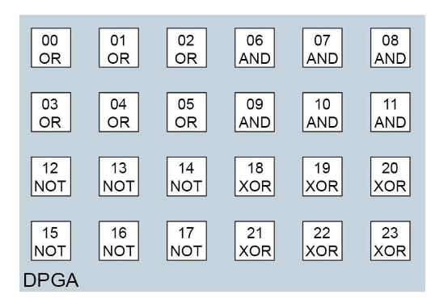

- 图S1：**DPGA中计算单元的逻辑排列**

除了NOT门之外的门都有两个输入端口。为了方便寻址，输入端口ID设置为1和2。

### 操作组件说明

表S3显示了所有涉及的分子，根据其功能命名了规则。

- 表S3：用于DPGA编程的分子命名规则

| 分子类型    | 公式            | 含义                                  | 例子                                                      |
| ----------- | --------------- | ------------------------------------- | --------------------------------------------------------- |
| Input/输入  | <in,m,n,v>      | 数字 n 输入到单位 m，值为 v           | <in,01,0,1> 数字 0 输入到门 01，值为1                     |
| Gate/门     | <typ,m>         | 编号为 m 的单位，类型 typ             | <and,08> 编号为08的门，类型为“and”                        |
| Output/输出 | <out,m,v>       | 单位 m 的输出，值为 v                 | <out,12,1> 门 12的输出，值为1                             |
| Wire/电线   | <wir,t,m1,m2,n> | 从 m1 到 m2 的电线，端口号 n ，类型 t | <wir,2,03,09,1>  从03号门到09号门的电线，端口为1，类型为2 |

### 双轨门的必要性和优势

单轨门使用分子的存在表示1，分子的缺失表示0。输出信号的快速增加表示1输出，缓慢增加表示0输出。

**负逻辑函数/负操作逻辑电路在双轨门中的实现：**

[负逻辑函数](#负逻辑函数)不能直接通过单轨门实现，这些函数应该被转换成双轨表达式。

双轨门的定义是为了使得任意逻辑功能能直接实现。根据这个定义，每个I/O端口允许两个分子通过：一个代表高信号，一个代表低信号。

双轨门不使用分子缺失来表示0，而是使用低信号分子的存在来表示0。

在双轨门中，理想情况下，将 in = 0 实现为低信号的存在和高信号的缺失，从而克服了直接实现 NOT 门的困难。

因此，包含负操作的逻辑电路可以直接映射到DPGA上，而无需双轨表示，从而避免了额外的设计复杂性。

**DPGA 中包含了四种类型的计算单元：**

为了能用更简单的 DNA 电路实现任意函数，我们在 DPGA 中包含了四种类型的计算单元。

除了常规使用的 AND、OR 和 NOT 门外，XOR 逻辑也被定义为一种可以直接实现的基本逻辑门。

如果使用传统的单轨AND/OR门，则实现一个2输入的XOR门需要6个门的组合（Extended Data 图3c）。

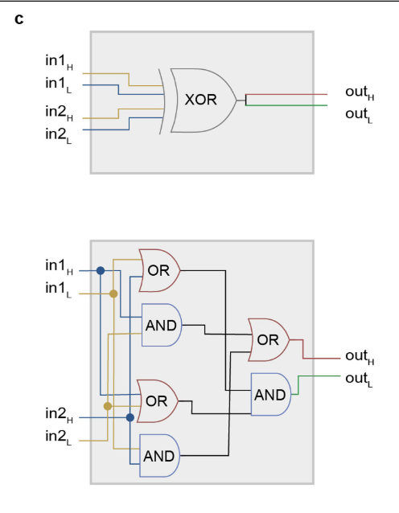

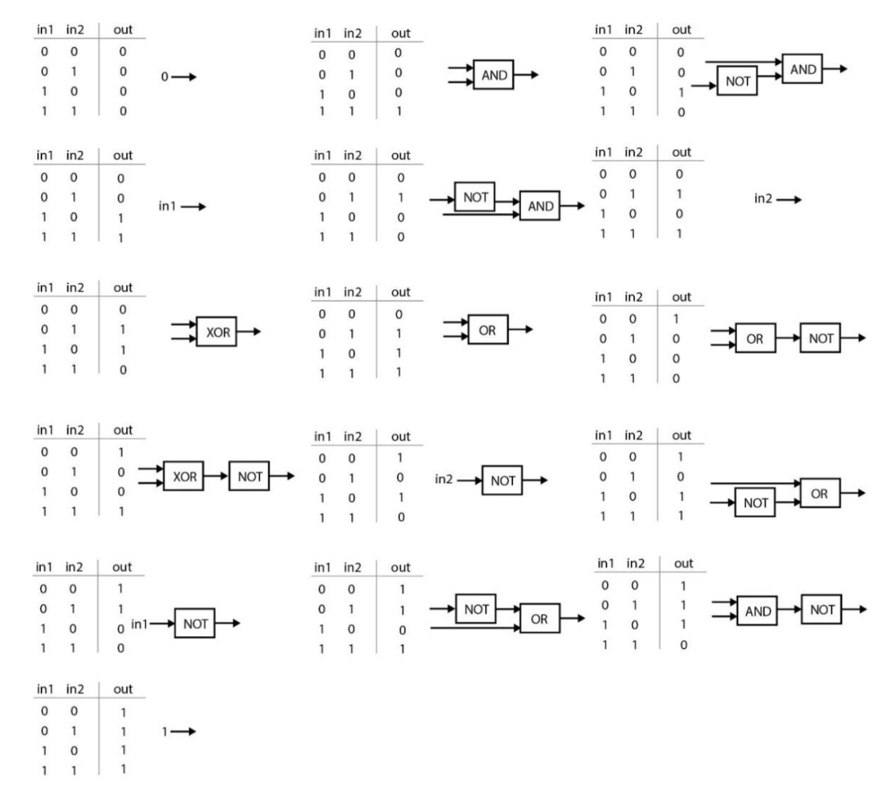

- 图S2：**使用AND，OR，NOT和XOR门代表一个布尔逻辑的完备集。**

  - 任何双输入函数都可以使用这四个门的组合来实现，这样的组合不超过两个门。

  - 我们使用了四种类型的门，而不是一种，主要是基于对布尔完备性和电路性能的考虑。

  - 如果只能使用一种类型的逻辑门，则只有NOR或NAND是布尔完备的。

  - 例如，在使用NOR的情况下，实现另一个双输入逻辑（NAND）需要多达4个NOR门，这使得链的复杂性（DNA链的数量）过高。

  - 因此，我们使用AND、OR、NOT和XOR门作为计算单元，允许用最多两个计算单元实现一套完备的2输入布尔函数。

**双轨门的输出信号：**

对于双轨门，我们有两个输出信号：高信号和低信号。

最终结果使用公式计算：dual-rail result = (OutH-OutL+1)/2。假定结果为 True，则理想的计算将生成 outH=1 和 outL=0。则计算结果为 （1-0+1）/2=1。否则，理想的计算将导致结果为 0，即结果应该是 False，这与单轨门相同。

在计算实验开始时， outH和 outL 均为 0，则dual-rail result为 0.5。

对于双轨门，结果信号从0.5开始逐渐上升以接近1，表示为输出True；或从0.5逐渐下降以接近0，表示为输出False。它的动力学特性与单轨门非常不同。（Extended Data 图3b）

- Extended Data 图 3b：

  - 一个双轨门接收一个代表1的分子或另一个代表1的分子作为输入，并产生一种输出=0或输出=1的分子。

  - 输出信号由两个输出信号之差表示。当输出=1时，输出信号增加；当输出=0时，输出信号减小。

**误差分析：**

实际反应系统始终具有[信噪比](#信噪比)（signal-to-noise ratio，SNR），其计算公式为：

- SNR(dB) = 20*log(Asignal / Anoise) = 20\*log(A1 / A1leak)。

其中Asignal是输出信号的值（在单轨门中记为A1），Anoise是噪声值（在单轨门中为A1leak）。

由于 dual-rail result = (OutH-OutL+1)/2，则双轨门的SNR为：

- SNR(dB) = 20*log(Asignal / Anoise) = 20\*log[ (A1-A0leak+1) / (A1leak-A0+1) ]。

假设[泄漏](#泄漏)为0.4×，单轨门的SNR为8 dB，双轨门的SNR为12 dB，这表明双轨门可以获得更高性能的计算。

此外，我们可以通过计算一个错误标志的值来评估，该值定义为：

- Error flag = ||OutH-OutL|−1| / 2 + |OutH+OutL−1| / 2

这个公式的第一部分衡量高信号与低信号之间的差值，第二部分衡量高信号和低信号之和。理想情况下，当结果应该是 1 时，outH 应该是 1，outL 应该是 0，所以差值和总和都应该是 1，所以错误标志应该计算为 0。

为了解释实验结果，使用低阈值和高阈值将获得的模拟信号转换为二进制值：

- 0 <= output <0.4 , result = 0；0.6 < output <= 1 , result = 1

对于假定为 0 的输出，outH和outL的所有可能组合都可以产生三种双轨结果（Extended Data 图3d）：

- 落入上三角形的 outH和outL 组合生成正确的双轨结果；落入下三角形的 outH和outL 组合则会产生错误的双轨结果; 
- 落入中间间隙的  outH和outL 组合会产生未定义的双轨结果。

对于错误标志，我们设置一个临界值为0.4，所有可能的结果从好到坏落在 5 个可能区域（Extended Data 图3d 右）：

- 正确的结果且没有错误；正确的结果带有警告；无法分辨的结果；有警告的错误结果；错误的结果但没有警告。

- Extended Data 图3d：
  - 左图显示了当结果应该为0时，所有可能的高信号和低信号组合而成的结果值。
  - 上红线上方的三角形区域表示得到的双轨结果小于0.4。
  - 右图显示了所有可能的高信号和低信号组合而成的误差标志。
  - 绿色框内的区域的误差标志值低于0.4。

表 S4 显示了八个代表性操作状态下，单轨道输出与双轨道结果之间的关系。在与理想值存在一定偏差的情况下，我们仍然可以通过错误标志的值显示警告信号来得到正确的结果。

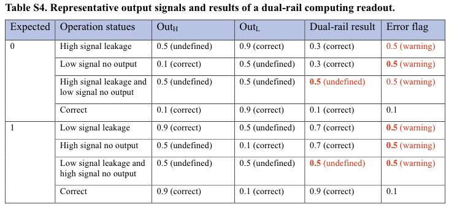

- 表S4：单轨道输出与双轨道结果
  - 当高信号和低信号都正确时，结果是正确的，错误标志小于 0.4。
  - 当一个信号是正确的，而另一个信号在一定程度上是错误的时，我们仍然可以得到正确的计算结果，但我们会得到一个 "错误标志 > 0.4" 的警告。
  - 当情况变得更糟时，无法获得正确的结果。
  - 当两个输出信号都错误时，错误标志无法显示性能。

以上定义的缺点是，仅通过错误标志无法区分无误差的正确结果和无警告的错误结果。但是，我们在进行实验时没有遇到过这种极端条件，因此错误标志对于评估计算实际上是有效的。Extended Data 图3f-g 展示了输出应为1的双轨结果和错误标志。

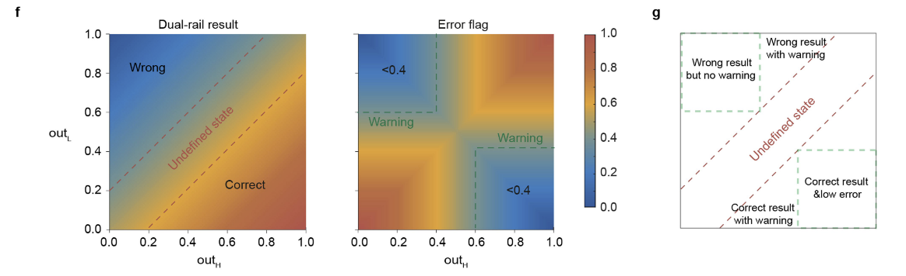

- Extended Data 图3f-g：
  - f：
    - 左图显示了当结果应该为1时，所有可能的高信号和低信号组合而成的结果值。
    - 下红线下方的三角形区域表示得到的双轨结果大于0.6。
    - 右图显示了所有可能的高信号和低信号组合而成的误差标志。
    - 绿色框内的区域的误差标志值低于0.4。
  - g：
    - 假定结果为1时，存在的五种可能的计算状态

由于在实验过程中没有遇到错误的结果，在正文的图2和图4中，我们将输出为1和0的正确区域和未定义区域合并成一个三角形。三角形用白色或黑色线分隔。

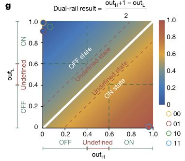

## 用于接线指令的SDR设计

### 接线指令的定义

为了能在DPGA上调用对于特定任务所需的门，我们定义了三种类型的接线指令，如表S5所示。

- 类型 1 指令通过输入端口将输入信号链接到门。一个 AND、OR 或 XOR 门有两个端口。当端口号为1时，输入通过第一个端口进入门;当端口号为2时，输入通过第二个端口进入门。

- 类型 2 指令将输出从一个门传输到另一个门的输入端口。

- 类型 3 指令将门的输出读出给报告器（reporter），并将值赋值给输出变量。

如表 S5 所示，类型 1、2 和 3 指令分别具有三个属性（参数）：

- WIR1：输入变量、门地址、输入端口ID
- WIR2：上行门地址，下游门地址、输入端口ID
- WIR3：输出变量名称、门地址、DPGA级输出端口ID

WIR4有四个属性：上游DPGA ID、下游DPGA ID、输出端口ID、输入端口ID

- 表S5：**接线指令的定义**

| 指令类型 | 指令格式               | 功能                                                 |
| -------- | ---------------------- | ---------------------------------------------------- |
| 类型 1   | WIR1(m, n, variable)   | 输入变量 variable 通过端口 n 输入到门 m              |
|          | WIR1(m, n, v)          | 输入值 v 通过端口 n 输入到门 m                       |
| 类型 2   | WIR2(m1, m2, n)        | 门 m1 和 m2 接线，通过 m2 门上的端口 n               |
| 类型 3   | WIR3(variable, m1, m2) | 从门 m1 读出结果到报告器 m2，分配给输出变量 variable |
| 类型 4   | WIR4(m1, m2, n1, n2)   | DPGA m1 的输出接口 n1 和 DPGA m2 的输入端口 n2 接线  |

### 类型2接线指令的SDR

在先前实现的小规模的DNA数字电路的研究中，设计了threshold和放大器[3]。为了实现大规模集成，我们受到高效泄漏抑制和高效信号恢复的跷跷板电路设计的启发[6]，优化了WIR2的分子实现，以允许四种类型双轨门的平等寻址和连接。

采用独立的双轨信号传输方案，使WIR2兼容双轨逻辑门；采用通用的 threshold 浓度保证所有 WIR2 的分子结构和链的比率都相同；双链区域的缩短导致了threshold-over-amplifier的结合优先性，这有助于减少输入和threshold之间的非特异性的短暂的结合。（Extended Data 图6）

- Extended Data 图6：WIR2和WIR3的实验优化和性能评估

  - a：

    - WIR2和WIR3的SDR

    - 低信号（绿色）和高信号（红色）信号独立传输。
    - 虚线表示上游结合区域

  - b：

    - 为了引入threshold-over-amplifier结合优先级，双链区域被缩短了2bp，减少了输入和threshold之间的非特异性结合和泄漏

  - c：

    - 如果没有threshold，门的输出可以被放大（amplified）到接近1
    - 但是，微弱的信号泄漏也可能被放大，导致错误的结果
    - 因此，threshold对于在放大（amplification）之前抑制泄漏是必不可少的

  - d：

    - 我们使用了可以快速与输出相互作用的threshold分子（Th）。
    - 在 0.4× 泄漏信号的条件下，我们发现Th的浓度高于0.4×可以有效抑制泄漏。
    - 在1× 输出信号的条件下，我们发现信号传输速度随着Th浓度的增加而降低。
    - 为了平衡泄漏抑制和计算速度，我们在实验中使用0.4×～0.6×的threshold。

  - e：

    - 在0.4× threshold的条件下，高信号的信号接线（左）和低信号的信号接线（右）

如图3b所示，WIR2由三个基本元件组成：

- 将输出信号（07.out）转换为输入信号（09.in-2）的转换器;
- 将产生的下游输入信号放大到特定浓度的放大器，以避免信号随着电路层数的增加而衰减;
- 以及一个threshold，用于在放大之前滤除泄漏的信号，将放大泄漏最小化，以减少对下游门的错误输入。
- threshold模块由四条链实现（S1-S4），转换器和放大器由六条链实现，以实现双轨布线。
- 所有类型2的接线指令都具有统一的功能组件

如图S3a所示，来自上游门的高低输出信号并行传输。泄漏首先用threshold过滤，然后穿过threshold的信号被放大并转换为下游门的输入信号。

低信号和高信号的SDR分别如图S3b和c所示：

- 以低信号通道为例，通过较长的toehold快速SDR，out_upL被Threshold分子优先吸收。
- 然后左侧进入缓慢而可逆的路径来替换in_downL。
- 接着，用浓度更高的FuelL替换已结合（hybridized）的out_upL，通过这种方式，out_upL可以被再次利用来产生特定浓度的in_downL。

- 图S3：类型2接线指令的链置换反应网络，虚线表示上游结合区域。

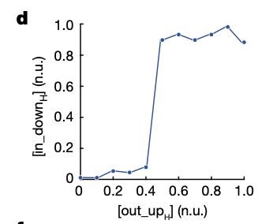

- 图3d：陡峭的斜坡表明，可以有效地抑制泄漏的信号以接近0，并将真实输出放大接近1。

### 类型3接线指令的SDR

WIR3的分子实现与WIR2相似，不同之处在于释放的链用于报告器（reporters）而不是下游门的输入。

- 图S4：类型3接线指令的链置换反应网络，虚线表示上游结合区域。

### 类型4接线指令的设计

WIR4的详细操作流程如图S5所示：

- 在上游DPGA（DPGA_U）执行后，将DNA折纸寄存器添加到试管中。

- 输出信号通过SDR写入DNA折纸，SDR由暴露的toehold（5 nt）介导，该toehold由另一端具有较长toehold（7nt）的检索链读出。
- 然后通过PEG沉淀法纯化DNA折纸纳米结构，去除输出信号以外的DNA分子。
- 接下来，将带有输出信号的DNA折纸添加到下游DPGA的管中，并使用Rescure链将寄存器输出信号释放到DPGA_D中。
- 随后，已释放的输出信号被转换为输入信号，使用 WIR2 传输到 DPGA_D 中相应的门。

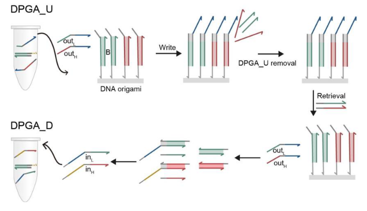

- 图S5：类型4接线指令在DPGA间的SDR路径

- 图S6：WIR4的两种实现信号传输的方案
  - a：一种基于PEG沉淀法的信号传输方法，需要一个离心过程来将 <u>与输出信号结合的DNA寄存器</u> 与 <u>DPGA反应系统</u> 分离
  - b-c：一种磁场介导的传输方案，可以仅在单管中实现级联 DPGA 的反应。

## 所需的计算组件的DNA分子设计

根据 图2b 和 Extended Data图4 所示的模块化结构设计策略，只需要5种双链分子就可以在单个DPGA上实现电路。

- 图2b：计算单元的模块化和自动化分子实现。对于双轨AND门，根据所需的逻辑功能生成了开关方案，然后生成了相应的分子开关

- Extended Data图4：四种双轨门的内部结构和运算机制
  - a：
    - 双轨门内部结构的示意图
    - AND门具有两个串联开关，分别响应in1H和in2H，当in1H和in2H同时存在时，生成outH。
    - 另一个开关响应两个L输入，当in1L或in2L存在时，生成outL。
    - OR门具有与AND门相反的内部结构。
    - NOT门有两个开关，一个用于L输入，另一个用于H输入。
    - XOR包含四个输入控制（input-controlled）开关
  - b-e：
    - AND（b），OR（c），NOT（d）和XOR（e）门的所有可能的输入组合的信号传输路径。
    - 高信号以红色显示，低信号以绿色显示。
    - 输入单链与逻辑门结合，并通过SDR释放相应的输出链。
    - 对于AND门，in1L和in2L都与s1杂交，以替换出s2（其中in1L表示in1=0，s2=outL）。
    - in2H与S3杂交，以取代S5，暴露出toehold γ ，以便in1H替换S4（=outH）。

它们的域级别（domain-level）描述如S7图的左面板所示，其中α和γ域为通用域，而β和μ域为特定域。为了抑制由堆积引起的不必要泄漏，使用了一个2 nt的夹子，这个夹子是由Qian和Winfree[3]提出的。

（a）和（b）所示的分子用于双轨门。（c）和（d）所示的分子用于类型2和类型3接线指令。（e）所示的分子用作报告器来读取计算结果。

如果S2是下游门中串联开关分子的第一个输入，那么α域会被移除。

通过这种模块化结构，可以使用如下所示的通用规则自动生成所有硬件分子和接线指令的序列。

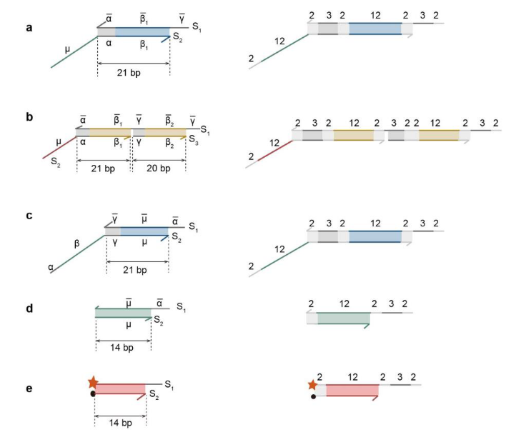

- 图S7：DPGA上的计算组件的详细分子结构
  - a：门中的单个开关
  - b：门中的串联开关
  - c：接线指令中的转换器
  - d：接线指令中的threshold
  - e：报告器

## KIRC分类器

已经开发了用于鉴定疾病相关生物标志物的分子电路[15，16]，但通常是线性的，因此在处理来自多个生物标志物的信息时受到限制，而这些生物标志物可能并不总是线性可分离的。

**建模：**

使用来自于The Cancer Genome Atlas (TCGA) 的公开可用的肾透明细胞癌（kidney renal clear cell carcinoma ，KIRC）miRNA表达数据，来训练一个基于计算机的非线性分类器，具体来说是一个决策树电路。

由此产生的模型包括三个miRNA输入：与threshold相关的miR-200c、miR-204和miR-887，在此基础上，我们使用包含414个KIRC和59个健康样本的训练集，实现了100％的KIRC识别准确率（图6a和图S58）。

- 图6a：使用三个miRNA作为输入在计算机中训练的非线性分类器模型

- 图S58：计算机训练分类器在训练集和测试集中的性能。
  - 在训练集中，所有的KIRC和健康样本都被正确标记为100%。分类准确率为100%。
  - 在测试集中，99%的KIRC和100%的健康样本被正确标记了。分类准确率为99.1%

从原理上讲，决策树电路的功能相当于对三维空间进行非线性划分。如图6f所示，有色区域被归类为KIRC，而外部是健康区域。

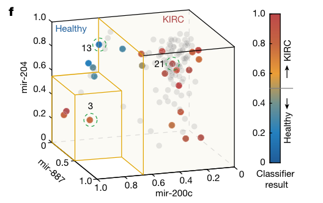

- 图6f：从测试集中随机选择了23个案例，经过训练的分类器模型和实验结果的可视化。
  - 黄色边框区域表示计算机训练中KIRC的空间
  - 彩色点表示从具有119个案例的测试集中挑选出来的实验测试集。测试集表示为灰色点
  - 输出水平由右侧彩色条中相应的颜色表示

使用这种非线性模型，测试集中的样品标记准确率为99.1%，优于先前使用的线性模型。

**实现：**

为了实现这个决策树模型，本文设计了一个电路来集成模数转换器（analog-to-digital converters，ADC）和DPGA，这个电路允许数字电路通过接收和发送DNA-UTS的I/O端口和生物分子信息进行通信。（图6b）

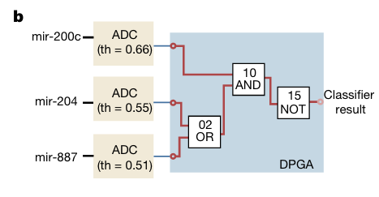

- 图6b：KIRC分类器的电路图。单轨的RNA输入通过ADC模块转换为双轨的DNA输出。

ADC的DNA版本可以将一个单轨miRNA信号转换为一个双轨的DNA-UTS，然后这样的DNA-UTS就可以在DPGA上进行进一步的处理了。（图6c）

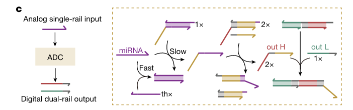

- 图6c：ADC的SDR网络。
  - 当miRNA水平高于threshold时，多余的miRNA会被扩增并且转换为ADC的输出结果 (outH)。
  - 当miRNA水平低于threshold时，将不会生成outH，而是保留outL以产生低信号。

ADC通过SDR在分子水平上实现。在实验测试中，数据库中mi204、200c和887的表达值被缩放至0-100 nM。miRNA的线性扩增可以使用现有的方法实现，例如，Zhang等人开发的LATE-PCR方法[15]。

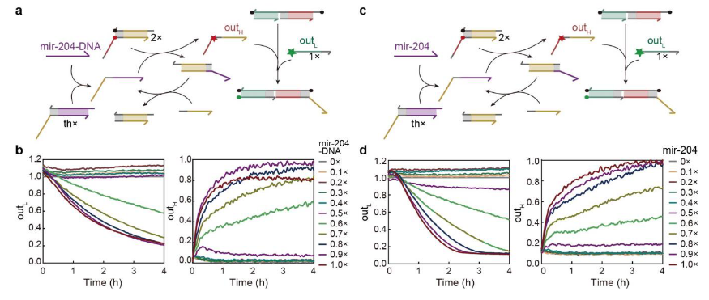

- 图S59：不同输入浓度下ADC的反应动力学
  - a：以mir-204的DNA链作为输入的SDR网络。
  - b：随着输入DNA水平从0到1× 的变化，outL和outH的动力学变化。
  - c：以人工合成的mir-204的RNA链作为输入的SDR网络。
  - d：随着输入RNA水平从0到1× 的变化，outL和outH的动力学变化。

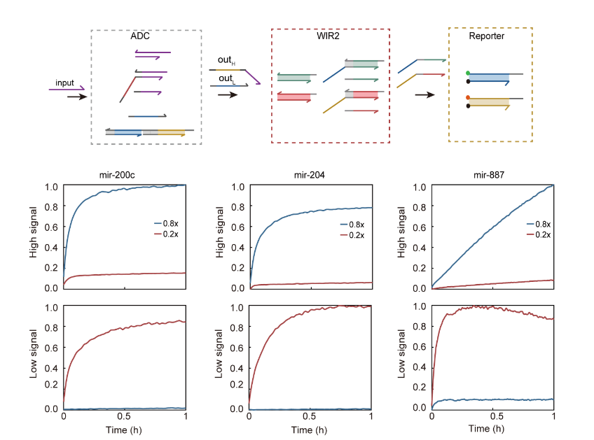

- 图S60：ADC的性能
  - 分别向相应的ADC加入了0.8x和0.2x的mir-200c、mir-204、mir887的单轨输入。
  - 孵育4小时后，加入WIR2和报告器以读取ADC的输出。
  - 当添加0.8×microRNA时，每个ADC产生高输出并消耗低输出。
  - 当添加0.2×microRNA时，产生的高信号很少，低信号得以保留。

### 血清兼容性

为了验证这种 “已经在概念上证明” 的DNA分类器在更具临床相关性的环境中的性能，本文在血清中测试了DPGA。

使用活性和热处理的胎牛血清（FBS，赛默飞世尔科技，Thermo Fisher Scientific）。

FBS储存在-20°C。活性FBS在使用前新鲜解冻，并在TE缓冲液中稀释以制备10%FBS。对于热处理，将FBS在95°C水浴中加热15分钟。

使用经过热处理的FBS或10％ FBS代替TE缓冲液，采用与使用TE缓冲液相同的方案进行实验。本文发现，虽然血清中含有许多生物分子，但DPGA的性能并没有受到太大影响。

- 本文首先在经过热处理的胎牛血清中进行了 DPGA 电路测试。虽然 FBS 的存在略微降低了 DPGA 的运行速度，但本文在 2 小时内获得了正确的计算结果，并且泄漏最小，结果的动态范围没有明显降低（TE缓冲液为0.82，热处理FBS为0.78）。

- 其次，本文探讨了DNA分子是否会在生理环境中被核酸酶降解。本文在10%非加热FBS中测试了DPGA电路，获得了正确的结果且优化了反应速度。
- 第三，本文部署了一个非线性分类器来对单轨miRNA信号进行分类，以证明DPGA在血清中的适用性。本文进行了实验，以评估ADC在包含稀释的FBS的模型系统中的性能（FBS的最终浓度为10% v/v）。我们发现，当浓度分别为0.12×和0.86×的mir-204加入ADC中时，高信号和低信号在反应4小时后都达到了正确的范围。总的来说，这些数据共同表明，基于DPGA的分子判断方法在体液中也是很可靠的。

通过优化缓冲条件（例如添加 SDS）可以实现进一步的改进[17]。

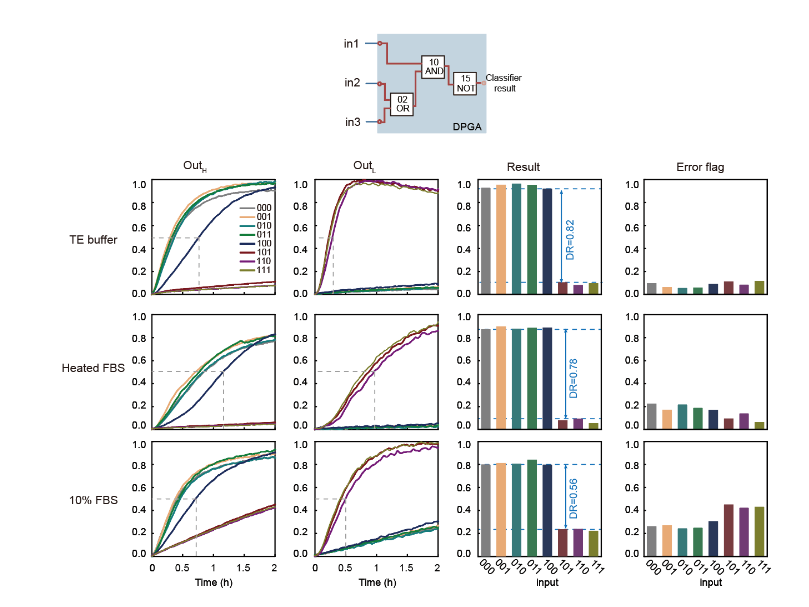

- 图S61：DPGA与含血清溶液的兼容性。

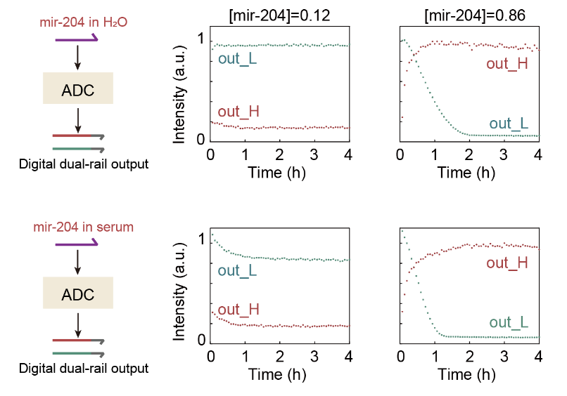

- 图S62：FBS中mir-204的模数转换器（ADC）的性能

