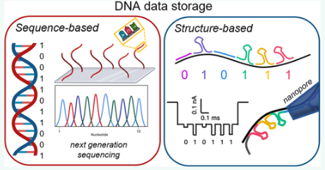
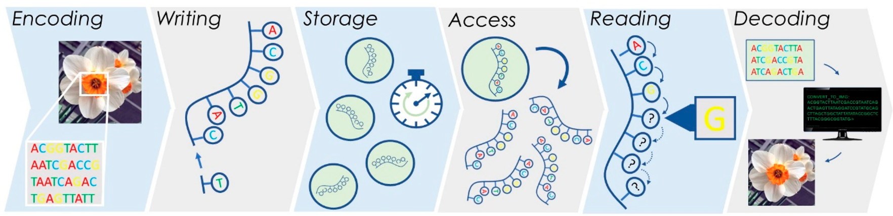
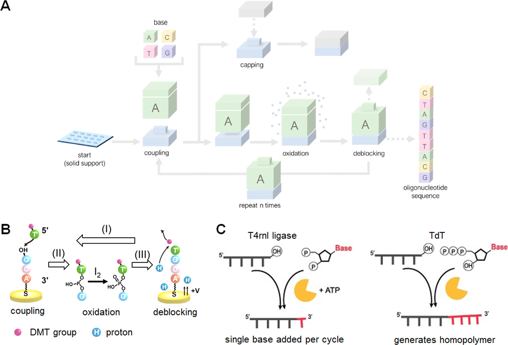
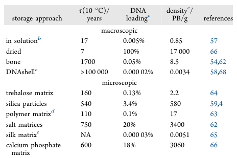

Emerging Approaches to DNA Data Storage: Challenges and Prospects

# 一

# 二

## 1、Abstract

**提出问题：**

随着全球数据总量不断增长，预计到2025年，全球数据存储需求将增长到1.75×1014 GB。传统的存储方法难以跟上步伐，因为当前的存储介质的最大密度为 103 GB/mm3。因此，数据产量将远远超过当前可用的存储方法的容量。当前技术下，数据存储和数据传输的成本、有限的存储寿命、数据丢失等问题，也要求先进的信息存储解决方案。

**解决问题：**

大自然提供了一种强大的替代方案来存储信息，这些信息以位于DNA分子中的独特的碱基序列定义了生物体。DNA分子作为信息载体，与传统的存储介质相比，具有许多优势。它们的高存储密度、低维护成本、易于合成和[化学改性](#化学改性)使其成为信息存储的理想选择。为此，过去十年里，通过利用使用者自定义的DNA材料来编码信息的方法取得了快速进展。

**文章总述：**

在这篇综述中，我们讨论了基于DNA的数据存储的最新进展，重点关注这一有前途的领域仍然存在的挑战，包括当前数据写入和读取的低速度以及每字节存储的高成本。

此外，还提出了依赖于DNA纳米结构（而不仅仅是DNA序列）以及其他纳米材料和生物分子的组合的数据存储方案，这是一种有前途和经济优势的技术。

在总结已经取得的进展并强调仍然存在的挑战时，我们为这个快速发展的领域的这项持续发展中的研究提供了一份路线图，这将有助于开发技术解决方案，以满足全球对卓越存储方法的需求。

**KEYWORDS :**  

DNA, datastorage, sequencing, random access, errorcorrection, DNA nanostructure, DNA preservation, reading, decoding, costs

## 2、Introduction

**提出问题：**

在当今的数字时代，数据量呈指数增长，全球对数据存储的需求预计将在2025年达到1.75×1014 GB，到本十年末将增加一个数量级1。对于密度更高和寿命更长的信息储存设备的需求也在增加2。目前的储存技术，包括光学和磁性设备，已经达到了信息密度的极限，因此不适用于长期（>50年）的存储。这意味着，如果要为后代保存有价值的信息，需要定期将其转移到更新的储存介质中。为了避免这种繁琐和昂贵的过程，以及解决与当前存储介质相关的其他缺陷（包括能源消耗和不足的数据密度），需要创新的方法来实现长期信息存储3。

**解决问题：**

稳定性与低功耗：

- 自然提供了一个鼓舞人心的例子，就是通过使用DNA，以四个核苷酸序列的形式，编码、传输、保护、储存所有的遗传信息。正如DNA在遗传信息的传承中发挥重要作用一样，这些分子在适宜的储存条件下可以稳定保存数千年4。例如，已成功测序出一只30万年前的熊的线粒体DNA5。这个DNA样本保存在骨骼中，由此证明了DNA存储所需的功耗非常低，这是与传统数据存储媒介相比的另一个好处。

数据密度：

- 除了稳定性和低存储成本外，与现有的数据存储设备相比，DNA还具有一个主要的关键优势：数据密度。基于其物理尺寸，DNA的理论数据密度为：1nm的聚合物可以存储6bit，也就是大约 4.5×107GB/g 6，这比传统设备可实现的密度高了几个数量级 7-8。

**基于序列的数据存储：**

近年来，在将DNA用作数字信息存储介质方面取得了重要进展9-14。现有的将任意信息编码成DNA的策略是：将所需数据直接翻译成核苷酸序列（如电影、书籍或图片），这意味着将使用化学DNA合成来写入每个数据字符串15。这种基于序列的DNA数据存储的主要步骤包括：

1. 编码数字信息
2. 数据写入（合成新的核苷酸）
3. 将DNA储存于物理或生物条件中
4. 随机存取
5. 通过DNA测序进行数据读取
6. 将DNA序列解码成原始的数字编码，如图1所示8，12。

- 图1：DNA数据存储的一般策略，其中数据直接存储在寡核苷酸序列中。描述了六个主要步骤-编码、写入、存储、访问、读取和解码。

在过去的几十年里，生物技术的实质性进步大大加强了DNA数据存储技术，包括化学DNA法和酶促DNA合成法16，17、用于DNA扩增的PCR18、DNA测序19。尽管这些技术最初并非为数字数据存储而设计，但这些技术的显著发展使得我们如今可以对编码在DNA序列中的数据进行写入、随机存取、读取、编辑等10，11。然而，DNA数据存储中涉及的每个步骤——编码、写入、存储、随机存取、读取和解码——都存在重要的技术局限性，这使得DNA数据存储目前无法与磁性和固态存储设备竞争。

- 由于长DNA序列的[de novo合成](#de novo合成)仍然具有挑战性20，因此这些序列必须被分成较小的片段（约200个碱基），这需要制作大量独特的DNA序列。
- 数据的读取也面临着几个挑战：尽管在理论上类似于硬盘驱动器的磁读取，但必须使用DNA测序来读取存储在单个寡核苷酸中的信息。
- 测序通常依赖于荧光输出，这需要昂贵的荧光染料、光学设备和受训练研究的人员，以及大量的DNA和长时间的读取时间（图2a，b）。在本综述的进一步详述中，三代测序（Nanopore）将会作为一种有吸引力的替代方案出现。
- 使用当前技术，据估计每TB的DNA存储成本为8亿美元，相比之下，磁带存储的成本约为每TB 15美元12。
- 使用现有的方法写入DNA数据的高昂价格，阻碍了其成为主流的信息存储材料。

**基于结构的数据存储：**

规避这些困难的一个策略是使用可编程的DNA三维结构（图2c，d）。

- 图2：迄今为止文献中所述的基于序列的DNA数据存储和基于结构的DNA数据存储之间的主要差异比较。
  - A，B：基于序列的存储依赖于DNA链的de novo合成，并且这些实体的后续测序使用下一代测序法进行（Next-generation sequencing, NGS，高通量测序技术，High-throughput sequencing, HTS）。图片引用自12。
  - C：相比之下，基于结构的方法利用自组装，将信息编码到三维形状中。图片引用自21，22
  - D：然后，可以使用单分子方法读取这些形状，包括荧光、原子力显微镜、Nanopore技术。图引用自23。

DNA纳米结构利用含氮碱基的特定碱基配对性，可以创建任意的二维和三维形状24。使用这些方法可以在纳米尺度上生成定义明确的自定义对象。可以利用成像技术读取信息，因此，信息可以存储在这些组装而成的三维结构中，而不是依赖于序列，例如超分辨率成像22，或使用单分子纳米孔测量23，25。

- 基于结构的策略可以通过简单的自组装来实现数据的擦除和重写，从而减少必须合成的DNA序列的数量。
- 这些基于结构的方法还消除了下一代测序的需求，而下一代测序是DNA数据存储中最耗时的方面之一。
- 由于基于DNA纳米技术的方法利用了DNA序列的自组装，所以所得到的结构本质上是可重构的，这使得无需进一步合成即可进行数据擦除和重写26。
- 此外，可以利用这些组装结构的动态特性来执行数据操作（或运算）13，27，从而允许DNA数据存储直接集成到DNA计算领域。

**小结：**

在本综述中，我们将详细描述上述两种方法，简称为“基于序列”的DNA数据存储和“基于结构”的DNA数据存储。对它们进行比较，突出这些方法的相似之处和不同之处，为DNA数据存储的最新技术提供一个概述。

最后，我们还重点介绍了DNA数据存储和操作的潜在应用，包括档案存储，条形码，密码学11，和DNA计算。

尽管实现DNA数据存储是必须克服一些困难，但重要的是要记住DNA在生物系统中发挥着不可替代的作用。因此，DNA永远不会成为过时的数据存储介质。我们认为，DNA的基本特性与DNA数据存储的高密度性和低能耗性相结合，将继续推动这个快速增长的领域的研究。

## 3、Sequence-based DNA data storage methods

### 3.1、DNA数据存储中的数据：从编码到写入

任何数字数据（例如文本和图片等各种文件）都可以表示为一系列位（即0和1）。一种可能的数据存储方法是使用一组长度为60-200 nt的DNA序列。DNA序列长度的限制来源于DNA的化学合成；长度超过几百nt的DNA链在合成时会引入大量错误到序列中。一旦正确编码，数据被写入合成的DNA序列中（图3）。

- 图3：合成自定义DNA序列的化学合成法和酶促合成法的概述
  - A：Phosphoramidite合成——最广泛使用的化学合成法——将核苷酸依次添加到锚定在固体支撑上的生长链上。使用保护基团来确保每一步只添加一个核苷酸，然后通过化学脱块（deblock）去除保护基。
  - B：脱块也可以通过电化学进行。图引用自31。
  - C：依赖于T4rnl连接酶或TdT酶的酶促方法也可用于在水环境中特异性地向生长的寡核苷酸添加碱基，从而消除了对有机溶剂的需求。图引用自32。

**化学合成法：**

有机化学为我们提供了大量的DNA合成技术，正如之前提到的，可以很容易地合成长达200个碱基的DNA链。合成通常使用亚磷酰胺化学合成法进行，这是一种四步循环反应，该反应将所需的核苷酸添加到固定在一个固体支撑物上的生长寡核苷酸链上（图3A，B）28。使用固体支撑可以实现广泛的并行合成，以及化学过程的自动化，这将是采用DNA进行数据存储应用的基础29，30。虽然亚磷酰胺合成法有很多优点，但值得注意的是，它需要使用无水溶剂，这会产生有毒废物。

**酶促合成法：**

一种化学合成法的替代方法是基于酶的方法，但这种方法仍处于初级阶段。到目前为止，通过酶合成法只能储存少量的数据（几百bit），而通过亚磷酰胺合成法则可以储存包含数十亿bit的数据。酶促DNA合成的概念起源于特定DNA聚合酶的发现，并且这种方法在数据存储的应用中有望成为比亚磷酰胺合成法更实惠更快速的方法40。

然而，一个主要的限制是DNA聚合酶需要一个模板链。为了像化学方法那样创建用户自定义的DNA序列，需要一种能够独立于模板的聚合酶（template- independent polymerases）来扩展单链DNA（ssDNA）的3‘端，如PNPase、T4RNA连接酶、TdT（图3）32。特别地，TdT作为一种具有模板独立性的聚合酶，用它来合成DNA寡核苷酸，被证明是一种有希望代替化学合成法的方法33，16。

- 其中，Lee等人16提出了一种基于具有模板独立性的TdT聚合酶和nanopore读取的酶促合成和数字编码技术。这种策略允许在DNA中存档信息而无需强制性的单碱基精度，并且由于微型化和酶回收利用而降低了成本。此外，通过使用均聚物（只由一种单体聚合而成的聚合物，即用重复单元表示高分子结构）合成1000个核苷酸长的链，可以缩短合成时间（图3）。
- Palluk等人28，33还描述了一种寡核苷酸合成策略，该策略使用TdT，并证明了TdT-dNTP偶联物可以在10-20秒内定量地一个引物延长1nt。至关重要的是，该方案可以迭代地写入用户定义的序列。

与在有机溶液中进行的化学合成法相比，酶促合成法与水性条件相容。

**存在的问题与具有代表性的几种合成方法：**

无论是化学合成法还是酶促合成法，在这些过程中都受到了低速的严重限制29，39。为了实现必要的并行写入能力，同时保持现实的基础设施占地面积，需要最大限度地增加在单个平台上每单位面积可以合成的不同序列的数量。最节省空间的提高合成密度的方法是减小每个唯一序列生长的区域（特征尺寸）、或特征之间的距离（间距）、或两者兼具。

- 为了实现这个目标，光掩膜阵列 (photomask arrays) 已被证明能够产生高密度的寡核苷酸34；然而，这种技术依赖于一系列定制的光刻掩膜来合成一组特定的序列，也就是说，必须为每个想得到的序列创建相应的掩膜。
- 另一种可替代的方法是使用电极阵列，并利用半导体行业的规模和生产路线图，在半导体行业，小到5nm的特征现在很常见。例如，Nguyen等人35制造了一个电极阵列，并展示了不同电极能够独立地特定地控制DNA合成的能力，其电极尺寸和间距使得合成密度达到每平方厘米2500万个寡核苷酸（图3C）。
- 最后，印刷（printing）合成方法迅速成为最常用的方法。（也感谢商业技术平台，如Agilent和Twist）

**解决 “引入错误” ：**

需要合成的序列由编码过程定义，该过程将数据映射到一组DNA序列，以便相应的解码器可以重构信息，尽管DNA的写入、读取和存储会引入错误9，14，36，7，37，29，38，16，39-41。通过物理冗余和逻辑冗余，DNA存储系统克服了这些错误，并且不丢失数据。

- 物理冗余是通过创建许多序列副本来实现的，虽然这些副本有时不准确，这使得数据被读取时，可以达成共识。但仅仅靠物理冗余无法解决一些错误。
- 逻辑冗余保证了即使在发生错误时也能进行信息的重构。
- 在合成过程中，物理冗余会自动发生，每个序列总是会产生许多副本。但需要应用专用的算法来在初始编码过程中实现逻辑冗余，这是非常重要的。
- 编码算法以合理的方式向要存储的数据添加冗余，以便解码算法可以从嘈杂的读取中重构数据。（图3A）

在2010年代，算法开发方面的广泛创新使得即使在存在显著错误的情况下，数据的可靠存储也成为可能。Grass等人4在DNA存储的背景下使用了现代纠错码，同时还提出了各种不同的方案4，42-50，36，14。虽然物理冗余和逻辑冗余会降低DNA的存储密度，但最近的研究提出了使用复合的自然字母7，51，52或使用化学修饰的核苷酸53来扩展DNA字母表，从而提高存储密度。

### 3.2 存储和降解问题

**降解问题：**

尽管DNA在受控环境（如古代骨骸）中具有长期稳定性，存储时间可长达数十万年54，55，但在水溶液的或干燥的环境条件下的DNA，其半衰期仅为几个月到几年56。因此，对于数据编码的DNA的物理存储的考虑是至关重要的，要使其具有长期存储数据的潜力。在缺乏适当保护的情况下，DNA（以及其中编码的数据）会受到由环境因素引起的多种机制的降解，包括链断裂、核苷酸突变、紫外线引起的链交联、氧化、水解、烷基化或机械应力。其中，水解是主要的降解途径57，58。

**微观容器与宏观容器保护法：**

因此，所有适用的DNA存储方法都专注于使用微观容器（即单个分子水平）或宏观容器（即单个池水平）来保护DNA免受潮湿和氧气的影响。

- 例如，微观容器的做法包括：封装在二氧化硅颗粒中56，59-61；嵌入在碱性盐62，聚合物63，糖64或丝蛋白65基质中；以及与模拟骨骼的磷酸钙66共沉淀。
- 对于宏观容器，干燥或冻干的DNA被存储在装在带有惰性气体57，58，67，68的密封胶囊里的滤纸上64；或者，以一种生物学实践中常见的方式：直接冷冻在水溶液中，并在−20或−80°C下储存69。

通常情况下，所有的存储方法都用存储密度降低1-3个数量级来换取长期稳定性，这是由于DNA和载体之间的低负载率引起的（表1）。

- 表1：对于微观和宏观存储方法，在假定存储池大小为5.5 TB的情况下，比较了DNA负载（g DNA/g载体），实现的信息密度（PB/g）和推断的半衰期71，ɑ。
  - a：所有数值均在10°C下考虑，并假设DNA长度为150bp，信息密度为17 EB/g。使用Arrhenius定律进行温度修正，其中DNA链断裂的活化能为155 kJ/mol57，4。
  - b：合成DNA的典型浓度为500ng/μL。
  - c：假设每个DNA外壳的存储容量为5.5TB。DNA外壳的重量至少为1.3g58。
  - d：聚合物的密度假定为与聚乙二醇相似，为 1.12g/cm3。
  - e：滤纸的密度约为85kg/m2。

**容量限制：**

此外，实施保护所需的时间和成本也可以作为区分DNA数据存储系统的因素，尽管对于长期存储应用而言影响较小69。单个DNA池的大小对于设计DNA存储介质是一个重要考虑因素，因为随机存取的索引大小、PCR的限制以及检索所需的物理冗余意味着池中寡聚物的数量存在一个上限69，6。这代表了一个单个宏观存储容器所能存储的最大数据量，估计在几TB到几百TB之间56，6，70。我们通过使用已经证明的具有5.5TB的随机访问的最大模型池尺寸，在表1中比较了微观和宏观存储方法的存储密度和半衰期。

**长度限制：**

当前对DNA数据编码的方法，如使用改变的DNA拓扑结构23，72和第三代测序平台，对数据存储提出了新的挑战，因为这些方法依赖于含有数百到数千个核苷酸的寡核苷酸，而与下一代测序（NGS）70中常用的数百个核苷酸相比，长度更长。尽管微观和宏观存储系统都不依赖序列长度，但DNA水解引起的衰变与每个寡核苷酸中的核苷酸数目成比例，因此预计错误数量会相应地增加73。考虑到某些类型的单位点错误，例如链断裂，可能导致整个寡核苷酸和其中的数据无法读取，使用更长的序列进一步增加了对持久存储的需求，以防止数据在实验时间范围内过早衰变。对此，仍然缺乏对许多DNA数据编码方法的衰变机制和速率进行的系统研究，对于这种严重依赖于结构完整性进行数据检索的方法，这是一个关键因素。

**小结：**

目前，只有在保护材料中并且DNA负载仅为几个百分点的情况下，长期存储才是可行的。因此，对于接近DNA真实存储密度的长期DNA数据存储系统的需求仍然存在。事实上，通过改进编码算法或降低逻辑冗余等手段来进一步提高编码密度以接近DNA的香农容量的努力，很大程度上被存储矩阵引起的存储密度的普遍缺失所掩盖了。相反地，由依赖于DNA拓扑结构的编码方法造成的编码密度的损失，因为存储开销而变得不那么严重，而这些方法与更密集的存储系统之间的相互作用是值得研究的。

### 3.3 随机存取

如上所述，仅能选择DNA分子的子集进行读取的能力限制了单个DNA数据池的当前数据容量。

# 三

## 化学改性

[回到原文](#化学改性回到原文)

化学改性是通过化学反应改变聚合物的物理、化学性质的方法。如聚苯乙烯的硬链段刚性太强，可引进聚乙烯软链段，增加韧性；尼龙、聚酯等聚合物的端基(氨基、羧基、羟基等)，可用一元酸(苯甲酸或乙酸酐)、一元醇(环己醇、丁醇或苯甲醇等)进行端基封闭；由多元醇与多元酸缩聚而成的醇酸聚酯耐水性及韧性差，加入脂肪酸进行改性后可以显著提高它的耐湿性和耐水性，弹性也相应提高。

对于DNA来说，可能是变性。

## de novo合成

[回到原文](#de novo合成回到原文)

de novo合成指从头合成，比如用最简单的氨基酸和二氧化碳等原料合成核苷酸。一半为初始、原发、从头开始的意思。