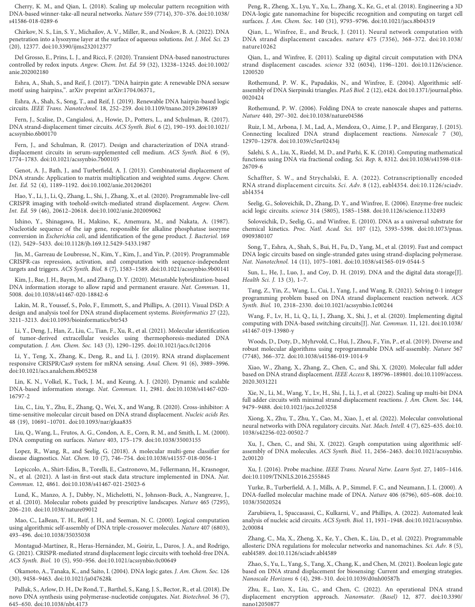

# 一、文章简介

题目：**DNA strand displacement based computational systems and their applications，基于DNA链置换的计算系统及其应用**

所述期刊：

# 二、文章内容

## 1、摘要

**DNA计算：**

DNA计算因其优异的并行处理能力、数据存储能力和低能耗特性而成为计算研究的重点。通过序列特异性和碱基配对原则，DNA计算单元可以被精确地编程。然后，计算单元可以级联和集成以形成大型DNA计算系统。

**DSD：**

其中，DNA链置换（DSD）是构建DNA计算系统最简单但最有效的方法。DSD的输入和输出是可以传输到下一个单元的信号链。DSD已被用于构建逻辑门，集成电路，人工神经网络等。

**小结：**

本综述了基于DSD的计算系统的最新发展及其应用。还讨论了一些与DSD相关的工具和问题。

**KEYWORDS：**

DNA strand displacement, DNA computing, integrated circuits, artificial neural networks, cancer detection

## 2、引言

**DNA用于信息存储：**

DNA作为一种天然材料，具有生物相容性和可编程性。随着生物技术的发展，DNA可以通过各种工具精确地合成，控制和检测 *（Beckwitt 2018；Palluk 2018；Del Grosso 2020）*。

它的序列可以编程为4位编码信息（ATGC四个核苷酸），其信息密度高于2位电子设备（0和1）*（Ceze 2019）*。

在这种策略中，1克DNA可以存储大约一个EB的数据*（Sun 2019）*。

此外，DNA作为信息存储载体，可以在-25°C下保存10,000年。这些特性使DNA成为完美的信息材料。

**DNA用于计算设备：**

DNA可用于构建许多计算设备。它们的尺寸是可预测和可控的。

B型DNA的一个双螺旋的长度为3.4 nm，宽度为2 nm。单链DNA是柔性的，而双链DNA是最硬的聚合物之一，在0.1 M水性NaCl中的持久性长度为50 nm*（Chirkov 2022）*。

因此，DNA链及其复合物可用作计算设备*（Chen 2020；Chen 2022a；Xu 2022）*。

**不同的DNA计算模型：**

到目前为止，已经提出了许多DNA计算模型。根据DNA结构，这些模型可以归类为：

- 基于单链的计算模型*（Adleman 1994；Liu 2000）*
- 基于DNA Tile的模型*（Mao 2000；Rothemund 2004）*
- 基于DNA折纸的模型*（Woods 2019；Amir 2014）*
- 混合模型*（Xu 2016）*

其中，基于单链的计算模型是最简单、最容易构建的方法。研究人员不必设计复杂或大型的结构。单条DNA链被用作输入和输出，可以对其进行编程和级联以解决复杂的问题。

**DSD：**

最流行的基于单链的计算方法是DNA链置换（DSD）反应。DSD是基于单链的计算模型的理想技术。DSD最初是由Yurke等人（2000）提出的。他们构建了一种DNA镊子，可以通过DNA链置换反应传递两种状态。

DSD包含短单链结构域（toehold 结构域）和配对双链结构域的置换（migration 结构域）。输入链可以与由toehold区域介导的DNA复合物反应，并产生输出链（如图1所示）。

- 图1：toehold介导的链置换机制。
  - 输入链与DNA复合物反应并产生输出链。
  - DNA复合物包含一个未配对的toehold域和一个成对的migration域。
  - 红色部分是toehold域；绿色部分是migration域。
  - 输入链将从toehold域开始与复合物反应。
  - DSD机制涉及到链的热力学稳定过程。
  - 未完全匹配的链（DNA复合物）将被完全匹配的链所取代。

**DSD用于数学运算、化学反应系统、逻辑电路：**

DSD反应可以用来解决计算问题。许多数学运算已使用DSD完成，例如：

- 指数运算*（Salehi 2018）*
- 乘法运算*（Genot 2013）*
- 布尔运算*（Zhao 2021）*
- 可满足性问题*（Liu 2000）*

此外，DSD反应是任意化学反应的近似表示。因此，已经建立了许多基于DSD的化学反应系统，包括振荡器，混沌系统和反馈数字逻辑*（Soloveichik 2010）*。

DSD反应是不需要酶的，并且可以用于逻辑门，包括AND、OR、YES、NOT、NOR、NAND、XOR、Threshold、Inhibited门等等*（Okamoto 2004；Seelig 2006；Carell 2011；Song 2019）*。基于DSD的门可以级联成集成电路，以解决复杂的计算问题。更重要的是，集成的DSD电路可以用作人工神经网络（ANN）并执行机器学习（ML）算法。已使用DSD实现了以下算法：

- 多层感知机（MLP）*（Arredondo and Lakin 2022）*
- 支持向量机（SVM）*（Lopez 2018）*
- 霍普菲尔德网络*（Qian 2011）*
- 卷积神经网络（CNN）*（Xiong 2022）*

**DSD与其他技术的结合与应用：**

DSD可以与其他技术结合使用，并用于广泛的应用：

- CRISPR 技术*（Ishino 1987；Montagud-Martinez 2021）*
- DNA折纸*（Rothemund 2006；Zhang 2022）*
- 酶*（Bucci 2022；Schaffter and Strychalski 2022）*
- 蛋白质*（Fern and Schulman 2017）*

这些组合有效地扩展了DSD的应用场景，已经被应用到：

- 信息存储*（Lin 2020；Banal 2021）*
- 数据加密*（Zhu 2022）*
- 医疗*（Peng 2018）*
- 生物传感*（Li 2021）*

**小结：**

在这篇综述中，我们首先介绍了DSD计算系统及其解决计算问题的能力，聚焦于DSD集成电路，基于DSD的人工神经网络。

然后，我们介绍了DSD的应用，包括与DSD结合的分子和技术。

最后，我们介绍了一些有用的DSD工具，还讨论了DSD的缺陷和问题。

图2展示了本综述的摘要。

- 图2：DNA链置换系统摘要，介绍了基于DSD的计算系统及其应用。

## 3、DSD计算系统

### 3.1 算术运算

分数编码（Fractional coding）和矩阵乘法是计算系统的两个重要操作。分数编码是其他复杂算术运算的基础，它是一种用于表示带小数部分的数字的数字格式。而矩阵乘法对于深度网络的实现至关重要，它广泛用于深度学习，因为它是表示和操作复杂数学关系的有效方法。

**分数编码：**

*Salehi 2018* 构建了两种类型的分数编码。一种是单极分数编码，另一种是双极分数编码。定义如公式1、2所示。

- x是变量。一对分子X0和X1被分配给x，变量的值由被分配的这对分子的浓度之比确定。因此，x的取值范围限定在区间[0,1]之间。这种策略就是单极分数编码。

- 同样地，公式2表示的变量x的取值范围位于区间[−1,1]中。这是双极分数编码的定义。

此外，他们实现了数学函数，包括指数函数、sigmoid函数、正弦函数、余弦函数和双曲正切函数*（Salehi 2018 ）*。他们将五种基本的DSD反应定义为：乘法 (Mult)、Nor-Mult (NMult)、多路选择器、双极Mult、双极NMult。然后，数学函数被转换为泰勒展开，并由这五个单元构造（图3A）。

- 图3A：数学函数转换为泰勒展开，并由DSD化学反应网络（CRN）执行。引用自*（Palluk 2018）*。

**矩阵乘法：**

矩阵乘法可以通过DSD反应进行。*Genot 2013* 是第一个明确说明使用DSD实现矩阵乘法的研究。*Genot 2013* 设计了 2 × 2 向量乘以 2 × 1 矩阵的典型乘法。他们利用了toehold域和migration域的组合，并实现了 2 × 2 向量乘以 2 × 1 矩阵的乘法。在这项研究中，toehold和migration结构域动态地组合起来，形成代表矩阵的DNA复合物。n个toehold域和n个替换域可以形成n²个替换复合物，大大减少所需链的数量，提高了计算能力。运算过程如图3B所示。

- 图3B：DSD的矩阵乘法运算。矩阵乘法的计算是通过链反应来实现的。引用自*（Genot 2013）*。

- 矩阵M中的元素由链 { d1b1，d1b2，d2b1，d2b2 }，矩阵X由 { ¬b1t1，¬b2t2 }，“¬” 帽表示其互补序列。此矩阵乘法的输出是矩阵 Y，由两条链 { Y1，Y2 } 表示。

**其他实现：**

基于DSD的化学反应网络可以使用可编程语言设计，用于解决数学问题：

- *Tang  2021* 通过 DSD 设计了加权反应、求和反应、threshold模块，并解决了三元 0-1 背包问题。
- *Lopiccolo 2021* 通过 DSD 实现了后进先出的堆栈结构
  - 这个栈结构可以存储两个信号，信号的释放顺序是由输入链决定的。
  - 栈可以被激活链重新启动。

### 3.2 逻辑门和集成电路

逻辑门是集成电路的主要单元。它们是现代计算机系统的基础。DSD和经调整的DSD反应可以编程并用作逻辑门。

**跷跷板门：**

改进DSD反应的杰出研究之一是由 *Qian，Winfree 2011* 提出的跷跷板门。跷跷板门的机制是可逆的DSD反应。图4A描述了反应原理。

- 图4A：跷跷板门。它由输入、threshold、输出门和报告器组成
  - 输入链将首先与threshold反应，直到所有threshold都被消耗掉。
  - threshold链拥有更长的toehold区域，保证了第一步的进行。
  - 然后，过量的输入可以与输出门反应，并产生输出链。
  - 最后，输出链将与报告门反应并发出荧光报告信号。
  - 因为fuel链和输入链具有相同的toehold和migration域。fuel链可以从第二步产生的副产品中替换出输入链。

**DNA发夹-跷跷板门：**

涉及DSD逻辑门的主题很多，包括可调用性、信号恢复、时间响应等。可再生门就是其中之一。*Eshra 2017* 将跷跷板门结构修改为发夹，称为“DNA发夹-跷跷板门”。如图4B内部的两个发夹结构所示。

- 图4B：2-输入可再生电路。该电路中的发夹门是可再生的。引用自*（Eshra 2019）*
  - 内部的两个发夹架构从 5‘ 到 3’ 的序列是 { S1, T2 ,S3, T1\*, S1\*, T1\* } and { S2, T2, S3, T1\*, S2\*, T1\* } ( “*帽” 代表互补序列 )。
  - S1与 S1\* 配对形成发夹，S2与 S2\* 配对形成另一个发夹。
  - 两个toehold域 T1\*和 T2 位于这些结构的两侧，类似于原始的跷跷板门。
  - 此外，他们增加了两个提取器来初始化发夹跷跷板门，从而实现了可再生过程。
  - 这个发夹门可以在连续计算中重复使用三次以上。

他们通过这个结构构建了一个 2-输入可再生电路*（Eshra 2019）*，如图4B所示。

**其他逻辑门实现：**

基于DSD的与门和异或门，可以组装半加器或全加器电路。

- *Xiao 2020* 构建了一个三位的全加器。
- *Xie 2022* 使用了三个双轨逻辑门，组装了一个四位全加器。

**集成电路：**

*Wang 2020* 设计了DNA开关电路（DNA Switch Circuits，DSCs）。

- 输入链与门交互作用，生成输出链。然后输出链传送并到达下一个门。
- 门将根据输出链改变其状态。因此，表示“是”/“否”的 ON / OFF 状态将被切换。
- 输出链的传播就像电流通过DSC的门。
- 此外，此DSC方案不使用双轨策略来设计非门。
  - 双轨策略指的是数字电路中使用的一种设计方法，它采用两条并行的设计通路。
  - 这两条通路并行运行，并定期相互交互，以使两者都朝着最终目标前进。
  - 例如，全加器的两个路径是加路径和进位路径。
- 与当前的DSD电路相比，其所需的链减少了3/4。实现方案如图4C所示。

- 图4C：DNA开关电路（DSC），DSD门根据输入信号切换其状态。引用自*（Wang 2020）*

*Liu 2020* 构建了一个交叉抑制门（cross-inhibit gate），然后使用该门执行了四输入的时间敏感电路（time-sensitive circuits）。

- 信号链A可以与检测器DA反应，产生输出OA与Kill链KA，如图4D所示。
- 随后，链KA可以与检测器DB反应，从而抑制信号链B和检测器DB的反应。
- 结果，信号A抑制了信号B。
- 如果首先添加信号B，则情况正好相反。
- 这种基于DSD交叉抑制的策略是构建时间敏感电路的一种简单有效的方法。

- 图4D：交叉抑制门。信号 A 和 B 被禁止交叉。引用自*（Liu 2020）*

*Fern 2017* 还设计了延时DSD电路（time-delayed）。他们创建了一个简单的DSD电路，这个电路具有八条链，可以以恒定速率在数小时到数天内释放目标DNA链至溶液中。结果如图4E所示。

- 图4E：延时电路。目标链在数天内释放到溶液中。引用自*（Fern 2017）*

### 3.3 机器学习与人工神经网络算法

机器学习算法和人工神经网络可以通过DSD反应来实现。

**机器学习算法：**

1. 决策树是一种经典的分类 ML 算法。它根据已知的发生概率，来处理分类路径。其分类途径可以通过DSD反应执行。

*Chen 2022b* 设计了一个多米诺骨牌式的DSD顺序系统，该系统可以执行决策路径的四个步骤。如图5A所示。

- 一个通过DSD实现的井字游戏。这种DSD复合体代表了一个 “四步骤 —— 一结果” 的决策路径。引用自*（Chen 2022b）*。

2. 支持向量机 （SVM） 是另一种强大的 ML 算法。它是一种两类分类算法。其基本方法是在特征空间中找到最大分类间距。

*Lopez 2018* 进行了基于基因分类的 SVM 系统研究。

- 每类选择的基因在硅基计算机上进行预训练。

- 然后，这些基因转录成RNA，并在SVM算法的指导下与DNA复合物反应。
- 每个基因的权重由转录次数实现，如图5B所示。

- 通过DSD实现的SVM算法。五个选定的基因转录到它们的RNA并与DSD复合物发生反应。引用自*（Lopez 2018）*。

**人工神经网络：**

1. *Qian 2011* 利用跷跷板门和双轨策略，年进一步构建了Hopfield网络。这个网络包含24个电路，可以“记住”4种模式。

2. 2018年，Qian等人扩展了跷跷板门的计算边界。他们在不使用双轨策略的情况下构建了一个winner-take-all的神经网络。*（Cherry and Qian 2018）*。

- 该网络是一个三层、完全连接的人工网络。
- 输入是 100位 DNA 链，具有 10 × 10 种模式。
- 隐藏层包含20个不同的DNA分子，可以通过DSD反应与这些100位DNA链发生反应。
- 输出图层显示手写数字“1”到“9”的分类结果。
- 这是第一次使用DSD构建复杂ANN的研究尝试。

3. 卷积神经网络（CNN）也可以通过DSD反应来实现。卷积运算的本质是矩阵乘法。*Xiong 2022* 采用与 *Genot 2013* 相同的矩阵乘法策略。

- 他们设计了矩阵操作DSD系统，包括两个矩阵的乘法，矩阵加法和矩阵减法。
- 矩阵乘法为 |X2×2|× |W2×1|，结果为 y1 和 y2。
- 然后，将y1和y2相加或相减以产生最终的结果Y，即卷积过程的结果。
- 他们实现了这个内核|W2×1|来卷积输入的"图像"（图像转化为12×12模式下的144个bit的DNA链）。
- 他们使用这种基于DSD的CNN方法，成功地识别了甲骨文、英文字母和阿拉伯数字。

- 图5C：通过DSD实现的CNN系统。左图为矩阵乘法过程。右图为卷积结果。

## 4、DSD计算的应用

DNA具有生物相容性，并且DNA结构可以被细胞内吞。此外，DNA可以被修饰并与药物，蛋白质和其他分子连接。DSD计算系统与分子和生物技术相结合，在医学、生物传感器、信息学等领域都有应用。

### 4.1 DSD与CRISPR技术相结合

**CRISPR：**

Clustered Regularly Interspaced Short Palindromic Repeats，CRISPR首先由 *Ishino 1987* 从大肠杆菌中发现。CRISPR系统由人工设计的sgRNA（single-guide RNA）和Cas蛋白的复合体组成。sgRNA具有与靶基因匹配的约20 nt的引导序列（guide sequence），然后上游的PAM序列可以在Cas蛋白的帮助下切割、抑制和激活靶基因。由于 sgRNA 是大约 100 nt 的 RNA 片段，因此可以对其进行编程。

**DSD结合CRISPR：**

CRISPR和DSD的结合使一些细胞内的逻辑回路成为可能，甚至可以实现细胞内基因调控。

*Jin 2019* 在sgRNA的5'端（指导序列）和3'端（scaffold结构）添加了toehold域，但没有影响其活性。由于sgRNA的指导序列对其本身的形成非常敏感，因此可以利用toehold域的结合和解离来控制其活性。然后，他们使用设计好的CRISPR作为开关，来控制一个DSD系统。

*Li 2019* 设计了sgRNA的scaffold结构，如图6A所示。

- 图6A：用于DSD系统的sgRNA的结构设计。引用自*（Li 2019）*
  - 常规sgRNA由引导序列（黄色部分）和scaffold序列（黑色部分）组成。
  - 他们在sgRNA中加入了mRNA感知序列（绿色部分）和toehold域（红色部分），称其为msgRNA。
  - 该结构被设计用于破坏sgRNA的scaffold，使其无法与Cas9蛋白结合。
  - 当添加mRNA后，链置换反应会打开msgRNA的发夹结构，恢复sgRNA的活性。
  - *Hao 2020* 等人通过封顶链破坏了sgRNA的结构。然后他们添加一条替换链与封闭链反应，从而恢复sgRNA的活性

完全配对的双链DNA（double-stranded DNA，dsDNA）通常被认为是DSD反应的浪费产物（waste）。然而，*Montagud-Martínez 2021* 年通过 CRISPR 技术使废链有用，如图 6B 所示。

- 图6B：CRISPR Cas9系统被用于切割DSD反应的副产物（dsDNA）。引用自*（Montagud-Martínez 2021）* 
  - 常规dsDNA被CRISPR Cas9切割并产生输出2。
  - 然后输出2将通过DSD反应与预杂交的ssDNA反应并产生输出3。
  - 最后，output3可以在T7 pol的帮助下调节靶基因。
  - 整个系统包括CRISPR介导的反应、toehold介导的反应和转录过程。

从上述设计中，我们可以得出结论，DSD反应可以作为控制CRISPR过程的开关。上述研究有一个共同的策略，即在sgRNA序列中对DSD反应域进行编程。这种策略是直接而有效的。

### 4.2 DSD与分子结合

基于DSD反应，DNA结构可以设计为分子机器人，分子机器和许多其他分子装置。这些设备可以通过DSD反应进行精确控制。DSD与各种分子相结合可以使这些设备在许多应用中高效。

#### 4.2.1 DSD与折纸相结合

**DNA折纸：**

DNA折纸是设计任意形状的DNA结构的强大工具*（Rothemund 2006）*。它涉及一条长的scaffold链和数百个短链，这些短链有助于结合到预设计的结构上。折纸结构的每个位置都可以通过结合链进行编程。因此，DNA折纸可用作DSD反应的平台。

**DSD结合DNA折纸：**

*Lund 2010* 设计了一个分子机器人；称为分子spider。这只蜘蛛的三条腿是特定的DNA酶链，可以通过DSD反应在DNA折纸上行进。

*Chao 2019* 设计了一种DNA巡航机器人，可以在DNA折纸平台上沿着设计好的路径实现分子反应。该机器人能够通过受控的DSD反应找到DNA折纸迷宫的路径。他们使用AFM和DNA-PAINT成像表征技术观察DNA巡航机器人在迷宫中的所有行走路径。

这种DSD和折纸联合方法为单分子诊断和治疗提供了一种策略。如图7A所示。

- 图7A：DNA巡航机器人通过DSD反应在折纸平台上行走。引用自*（Chao 2019）* 

*Ruiz 2015* 将DSD系统捆绑在DNA折纸平台上，使反应比溶液中的反应更快。并且，门之间的反应仅限于它们的相邻元件之间，他们通过这种方法设计了许多逻辑门。如图7B所示。

- 图7B：在折纸平台上实现的DSD逻辑门。引用自*（Ruiz 2015）*。

*Zhang 2022* 使用DSD反应作为开关来控制折纸纳米机器。他们设计了一种远程变构（long-range allosteric）折纸纳米机器。DNA复合物在结合位点被编程。然后，通过DSD反应，变构纳米机器可以通过输入链打开或关闭。如图7C所示。

- 图7C：DSD作为开关来控制远程变构折纸纳米机器。引用自*（Zhang 2022）*

DSD反应很难进行可视化。通常的方法是使用荧光信号作为报告器。上述过程是可视化的。DSD开关的开/关状态可以由折纸的形状代表。巡航机器人和蜘蛛在DNA折纸上的轨迹路径可以通过AFM可视化。

当DSD与折纸相结合时，这些设备变得有趣和可信。

#### 4.2.2 DSD与酶结合

DSD计算系统中的酶可以用作调节剂来控制其反应。

*Bucci 2022* 设计出一种阻断链，可以与toehold域结合，从而阻止了DSD反应。然后他们采取了两个步骤来恢复DSD的活性。

- 首先，他们使用RNase H酶剪切阻塞链，从而暴露出toehold域。
- 其次，他们使用甲酰肼嘧啶DNA醣基化酶或尿嘧啶-DNA醣基化酶来降解阻塞链。
- 这两种醣基化酶的降解速率不同。因此，可以控制DSD系统的反应速率。

*Schaffter 2022* 设计了一种具有特定序列的 DNA 链，可以转录为细胞中的 RNA 复合物。在转录酶的帮助下，DSD系统可以部署在细胞中。这种特定的DNA链被细胞内吞，然后在细胞中转录。因此，整个RNA电路在细胞中得以实现。

*Fern and Schulman 2017* 在DSD复合物的5'和3'末端设计了一个发夹结构，可以防止结合酶被血清中的其他蛋白质破坏。

**小结：**

酶可以调节DSD系统的表达或反应。在酶的帮助下，可以实现具有多种协调功能的复杂调控网络。然而，多余的酶可能会使反应环境复杂化，这可能导致系统不稳定。

### 4.3 DSD在信息学中的应用

ATGC的四个核苷酸可以用作4位编码信息，并且合成的DNA链已被用作数据存储材料。通常，一条DNA数据由寻址域，信息域和校正域组成。DSD反应可以部署在这些域上。DSD的输入链可用作信息加密、信息读取器、启动器等。基于DSD的信息处理简单有效。

*Lin 2020* 将T7启动子和单个悬链（single overhang strand）插入信息域。悬链可以在T7启动子的帮助下完成DNA信息的标记、锁定、替换和删除过程。此外，DNA数据可以通过PCR过程读出，而不会破坏原始DNA链。Lin通过使用DSD系统增加了信息容量并降低了编码复杂性，避免了引物对DNA编码区域的影响。如图8A所示。

- 图8A：T7启动子和单条悬链执行DNA信息存储过程。

*Kim 2020* 使用DSD反应提取存储在DNA链中的图像数据。他们编码了一个虚假消息编码的链，该链与真正的消息编码链具有相同的引物和长度。通过DSD反应和PCR过程可以从真链中提取正确的信息，而假链则不能。然而，如果整个系统被加热到95°C以上并保持5分钟，正确的信息和错误的信息将会混合在一起，导致解码失败，相关的数据无法恢复。这可以作为一种快速清除目标信息的方式。如图8B所示。

- 图8B：使用DSD反应作为数据删除过程。

*Banal 2021* 将 DNA 信息密封在不透水的二氧化硅胶囊中。硅胶表面用单条悬垂的DNA链标记，代表存储信息的特征。当需要信息检索时，将向溶液中添加具有磁珠修饰DNA链的互补链。这两条链将通过DSD反应发生反应，并通过磁性吸附捕获硅胶囊数据。

*Zhu 2022* 使用 DSD 反应作为加密方法。这种加密方法包括通过霍夫曼编码将信息转换为DNA序列。然后，该DNA信息的key通过降解反应传递。最后，DSD传输的密钥通过催化反应进行扩展，这增加了解密的复杂性。如图8C所示。

- 图8C：DNA信息的key通过DSD降解反应传递。引用自*（Zhu 2022）*。

### 4.4 DSD在医学和生物传感中的应用

DSD可以设计为癌症检测的工具。用核酸适配体修饰的DNA链可以靶向癌细胞表面，检测信号或药物可以通过DSD反应释放。在这些应用中，配体靶向特定细胞，DSD系统被用作开启药物释放或癌症检测过程的开关。

*Peng 2018* 构建了一种基于DNA的三维纳米机器，可以靶向癌细胞。

- 这种纳米机器可以识别由SELEX癌细胞产生的DNA适配体。
- 当纳米机器与癌细胞表面结合时，它将通过DSD反应产生荧光信号。如图9A所示。
- 这种基于DSD的癌症检测方法对癌细胞具有超高灵敏度，可以作为早期癌症识别的工具。

- 图9A；三维DNA纳米机器附着在癌细胞表面并检测SELEX癌细胞。引用自*（Peng 2018）*。

*Li 2021* 使用热泳介导的 DNA 计算设备来鉴定 tEVS（tumor-derived extracellular vesicles，肿瘤来源的细胞外囊泡）。

- 他们构建了一个由EpCAM-ST2和HER2-S-T2蛋白组成的AND门。
- tEVS导致两种蛋白质的过表达。
- 整个 tEVS 通过 CD63 适配体与微珠结合。
- 最后，他们将DNA发夹链添加到溶液中，然后AND门产生荧光信号，可以代表tEV的表达水平。

*Chang 2019* 通过DSD逻辑设备从大量相似细胞中鉴定并缩小了一个癌细胞类型亚群的确定范围。

- 他们在AND逻辑门上编程了两种癌症表达蛋白，适配体Sgc8c-S-T1和TCO1-S-T2。
- 这两种适配体可以识别目标癌细胞并附着在其表面。
- 然后，输入链可以与AND门反应并产生荧光信号。该方法的方案如图9B所示。

- 图9B：通过DSD反应识别tEV的DNA计算设备。引用自*（Li 2021）*。

这两种方法（Li和Chang）具有相似之处。他们都使用两个适配体来识别癌症，然后组装一个AND门。最终的信号报告是通过DSD和AND的反应完成的。

- 图9C：DSD、AND门被附着在癌细胞上。引用自*（Chang 2019）*。

## 5、DSD的工具

Visual DSD*（Lakin 2011）*是为DSD研究人员创建的计算机模拟软件。

- 作者为DSD语言设计了特定的语法约定，可以在各种情况下编程DSD复合物或单个DNA链。
- DSD语法可以编程和构建以形成复杂的化学反应网络（CRN）。
- 此外，可以随意设置初始条件，CRN条件和其他参数。
- 此外，还为不同的实验提供了许多热力学算法，如确定性模拟、随机模拟、空间模拟等。
- 可视DSD自动生成所有可能的反应和产物。
- 它可以帮助研究人员构建复杂的DNA反应网络，而无需手动设计，并且结果可以可视化。
- 在DSD反应中可能发生泄漏。如果两个DNA复合物之间存在部分配对的序列，它们可以在没有toehold中介的帮助下相互反应。可视DSD不考虑泄漏。

*Zarubiieva 2022* 提出了一种用于视觉 DSD 的泄漏分析方法，由泄漏反应枚举算法和泄漏概率预测组成。他们扩展了Visual DSD的逻辑编程功能。

Badelt 等人（2020 年）提出了一种域级 DSD 反应模拟软件;他们把它命名为 “Peppercorn” 。

- Peppercorn比视觉DSD更通用。
- 它考虑了与核酸生物物理学的自然联系，仍然适用于结构分析。
- 作者针对不同情况实现了三种不同的算法。他们提出了DSD反应网络的枚举算法。CRN 的冷凝算法使用慢反应。DNA结构域水平系统的近似速率模型。
- 最后，他们进行了多个案例研究，将他们的模型与真实实验进行了比较。
- Peppercorn分析在结构域水平上检查DSD反应，可以在不知道核酸或聚合物的具体类型的情况下对其进行严格分析。

## 6、总结

DNA计算是一种结合DNA纳米技术和计算机科学的有前途的技术。

- 它利用了分子的大规模平行性质。DSD是最简单的DNA计算策略，涉及信号DNA链的输入和输出。
- 更重要的是，DSD可以被编程并级联到复杂的化学反应网络中。DSD集成电路已被实现，以实现机器学习和人工神经网络。
- 在分子和生物技术的帮助下，DSD计算系统可用于各种应用。采用CRISPR技术的DSD已被应用于构建细胞内电路和生物传感。DSD已被证明具有检测癌细胞的能力。
- DSD在数据存储和加密方面也很有用。虽然DSD已经得到广泛应用，但它有很大的发展潜力。
- DSD是一个简单的工具，其发展取决于其他生物技术的相互施肥。

## 7、参考文献

