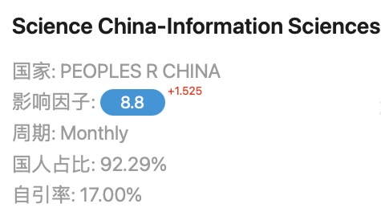
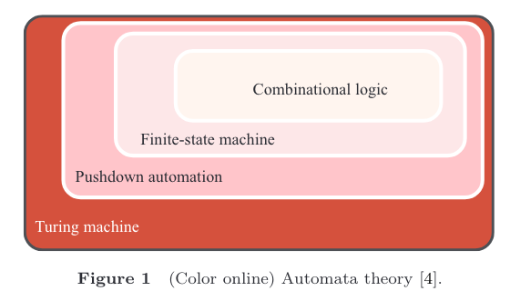
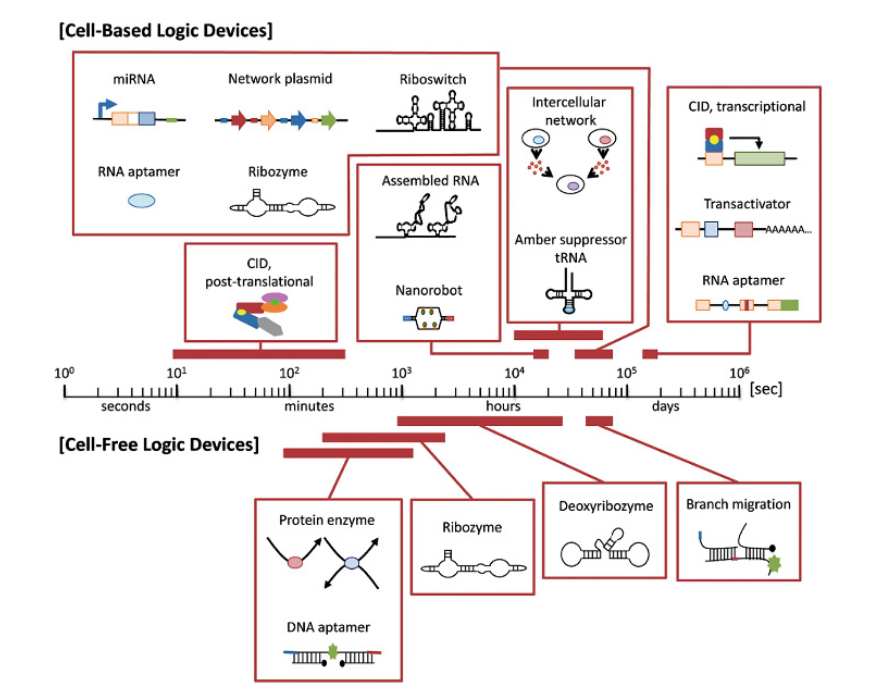

**DNA computing for combinational logic，用于组合逻辑的DNA计算**

# 一、

# 二、

## 1、摘要

**背景：**

随着半导体特征尺寸的逐步缩小，人们期待 “More Moore” 和 “More than Moore” 。

**提出新方法：**

为了提供一种可能的替代实现过程，研究人员正在试图找出一种可行的从硅到分子计算的转移。

- 这种转移基于基于生物的模块编程，这种编程具有类似计算机的逻辑，旨在实现图灵机。
- 要做到这一点，基于DNA的组合逻辑必然是我们关心的第一步。

**文章总述：**

本文将分别从模拟和数字（analog and digital）两个角度介绍DNA计算中合成的组合逻辑。

**展望：**

本文总结了最新的研究进展，供有兴趣的读者快速了解DNA计算，发起对现有技术的讨论并启发创新解决方案。我们希望本文可以为未来的DNA计算合成做铺垫。

**Keywords：**synthetic biology, DNA computing, DNA strand displacement reactions, chemical reaction networks, combinational logic

## 2、引言

**背景：**

随着人们对More Moore和More than Moore [ 1、2 ]的强烈追求，其他计算模式应运而生，以满足人们对计算速度和计算容量两方面日益增长的需求。其中，分子计算，尤其是DNA计算，由于其大规模的并行操作和较高的计算速度，引起了广泛的研究兴趣。如图1所示，DNA计算的最终目标是作为图灵机运行，要实现这一目标，合成组合逻辑是第一步[3,4]。

- 图1：自动机理论

在蓝图中，如合成生物学领域[ 5 ~ 7]，细胞被用作生命器件来执行有用的任务，如疾病诊断和体内治疗药物释放[ 8 ]。然而，由于现有技术的限制，目前的共识是——用计算机逻辑来编程基于生物的模块。

**文章总述：**

鉴于其毋庸置疑的重要性，学术界和工业界都对基于DNA计算的组合逻辑的研究给予了极大的关注。

本综述通过对这一时间性专题的介绍和讨论，总结了DNA计算中组合逻辑的主要合成技术。我们希望本研究能够帮助读者从模拟和数字两个角度对前沿技术和进展有一个简要的了解。在此基础上，希望激发出更多的创新解决方案，为DNA计算的实现铺设道路。

本文的其余部分组织如下。

- 第2节回顾了DNA计算的历史、性质和应用。本节还给出了一些预备知识，如基因表达的解释，以便作进一步的解释。
- 第3节详细阐述了基于DNA的模拟电路设计。
- 第4节从数字电路的角度回顾了组合逻辑，强烈呼吁模拟与数字相结合的趋势。
- 最后，第5节对整个研究进行了总结，并指出了组合逻辑在DNA计算中未来可能的发展方向。

## 3、DNA计算

早在20世纪50年代，纳米技术的创始人Feynman就设想，我们可以在很小的规模上制造出我们想要的物体[ 9 ]。

然而，直到1994年，Adleman才实现了在分子水平上进行计算[10]。由于他在DNA计算方面的开创性工作，DNA计算领域得以初步发展。从那时起，在这个有趣而又新生的领域，进行了大量理论和实验上的研究。

### 3.1 DNA vs. 硅

DNA计算的基本思想是从硅转向碳[ 11 ]。通过用DNA分子替换数字开关元件，可被定义为"执行计算架构所作用的物理物质"的计算基底从硅变成了DNA [ 12 ]。

对于传统的冯·诺依曼架构的硅基计算机[ 13 ]，存在两个主要的障碍，阻碍了其在小规模上的进一步发展。

- （1）由计算机结构造成的内在的冯·诺依曼瓶颈[14]。从字面上看，这个冯·诺依曼瓶颈是指在中央处理器( CPU )和存储器之间传输单个字的连接管。在这个瓶颈中来回传输大量词语时，不可避免地存在大量的数据流量，这严重限制了 CPU 的有效处理速度。随着数据规模的增大，瓶颈问题变得更加突出，并且限制了计算机的速度。
- （2）由计算基底——硅，导致的局限性。曾经，一些专家预计5纳米硅技术节点将是摩尔定律的终结，因为在小于7纳米尺度的晶体管中会发生量子隧穿现象[1]。因此，不需要的干扰严重影响了整体性能。

为了克服传统硅基计算机的这两个障碍，一些人正在寻求其他的计算模式。他们的努力主要是为了两件事。

- （1）突破冯·诺伊曼瓶颈给出的 “逐字阅读” 的思维方式，寻求新的计算机体系结构的非冯·诺伊曼原则。
- （2）证明新方案优于传统方案，然后考虑投资，为进一步发展提供经济基础。

有前途的候选者包括量子、光学和基于DNA的计算机，本研究关注DNA计算，因为它具有高存储密度和巨大的并行性。

### 3.2 优点和缺点

#### 3.2.1 DNA计算的优势

- **巨大的并行性：**DNA计算最吸引人的优势是它能够同时处理数百万次运算[15]。如果被迫按顺序操作，DNA计算机将失去它的优势[ 16 ]。
- **巨大的存储容量：**在将信息密集地包装成大肠杆菌基因中一样的密度的前提下，一千克的DNA就可以满足全世界的存储需求。据估计，细菌DNA的数据密度约为 1019 bit/cm3 ，可保存100多年[17]。
- **强大的计算能力：**对于DNA计算，Adleman所做的开创性工作揭示了其解决传统计算机难以解决的复杂计算问题的能力[18]。
- **易得性：**DNA作为一种无毒物质，只要有细胞生物存在，就很容易从自然界中提取。如此大的供应量使得DNA成为一种可负担的资源[ 19、20 ]。

#### 3.2.2 DNA计算的局限性

- **一次性的"实例"计算机：**目前的DNA计算机擅长于解决一个具体问题的一个实例，通常只能进行一次计算[16]。
- **耗时长：**由于大规模和杂乱无章，反应本身是非常缓慢的，需要在数小时或数天内才能得到最终的计算结果。
- **有限的合成技术：**DNA计算需要DNA合成和测序。如果需要没有缺陷的高质量合成，则目前合成寡核苷酸的实际长度不超过150-200个碱基[21-23]。这阻碍了所构建的基于DNA的计算机处理更大规模问题的能力
- **易出错的特征：**DNA合成容易出错[ 15 ]。即使是最简单的混合操作，有时也会出现问题。
- **资源密集型问题：**采用 Adleman 开发的计算范式，即使是一些相对简单的问题，也可能需要无限制的解空间和不切实际的内存量 [12]。
- **缺少可视化输出机制：**自[ 11 ]设想以来，所设计的基于DNA的计算机是内含液体的管状结构。这种液体计算机的最终结果很难通过肉眼观察到。应该有一种机制对计算结果进行深入分析和可视化展示。

### 3.3 DNA计算机是什么样子的

对于肉眼而言，试管中的清水溶液可以是一台DNA计算机，而不是存在的机械装置。

令人惊讶的是，一滴水中竟然含有万亿个生物分子设备。

结果是通过一种技术解析的，这种技术允许科学家看到最终DNA分子的长度[16]，而不是显示在计算机屏幕上。

### 3.4 应用：基于DNA的计算机能做什么?

毫无疑问，DNA计算机几乎可以做到硅基计算机所能做的事情。

考虑到硅基计算机以线性方式运行，而DNA计算机擅长并行处理。如果DNA计算机被迫像硅计算机那样按顺序进行，可能需要数小时甚至数年的时间等待最终结果。这是不能容忍的。

因此，DNA计算机领域要想发展得更好，可能需要涵盖那些并行化问题的算法，而不是像硅基计算机通过顺序算法来解决这些问题。 

**疾病治疗：**

DNA计算机可以为疾病治疗提供帮助。早在2004年，研究人员构建了一个简单的分子级别的DNA计算机，带有输入和输出模块[24]。它在理论上能够进行正确的癌症诊断，此外还可以释放相应的抗癌药物。

**DNA 2 DNA应用：**

这种应用是DNA to DNA计算的简称，传统的计算机不能超越DNA计算机[25]。其核心思想是利用某些已知的DNA链进行DNA计算，以此对未知的DNA片段进行操作。对未知的DNA片段进行重新编码后，可以对其进行合理的计算，从而解决许多有趣的问题。与"经典"的DNA计算不同，这些DNA 2 DNA计算并不需要完美的操作。因此，结果具有更强的容错性。

**DNA密码学：**

由于一次性密码本的大小，在传统的电子媒体中，基于一次性密码本的加密系统的实际应用有所限制。DNA计算可以应用于密码学领域，因为可以对自然DNA和人工DNA编码的二进制数据进行加密[26，27]。

### 3.5 几个类别

- 在文献[ 28 ]中，基于生物分子的布尔逻辑门分为两类：细胞内和无细胞系统。

- 根据底物的不同，它们也可以分为两类：基于核酸的计算和基于蛋白质的计算。

- 根据是否含有酶，基于核酸的计算包括基于酶的计算和无酶的计算。

图2生动而准确地显示了基于细胞和无细胞逻辑器件的激活时间的时间范围。

- 图2：图2生动而准确地显示了细胞和无细胞逻辑器件的激活时间的时间范围。

### 3.6 化学反应网络

化学反应网络( Chemical reaction networks，CRNs )可以作为一种可编程的语言来模拟分子系统，这些分子系统由一组反应物、产物和反应组成。此外，CRNs不仅可以用来分析现有的化学体系，还可以方便地构建新的化学体系，而无需考虑物理底物。

- 利用CRNs，研究人员设计了新颖的分子器件，实现了原本在电子领域的功能，如组合逻辑、时序逻辑、离散时间信号处理计算和算术元素等[ 29-47 ]。
- CRNs可以通过常微分方程（ODEs）[48-51]进行演示，并且始终可以用质量作用动力学进行建模[52，53]。因此，基于ODE的仿真通常用于验证基于CRN的设计。基于CRN的设计经过仿真验证后，需要工程材料对分子器件进行物理实现。

DNA是基于CRN的分子器件的理想工程材料主要有3个原因：

- （1）DNA是中心法则的重要组成部分[54]，也是大多数生物的遗传物质。因此，DNA设备可以与生物体接口，而不会引起类似于硅基设备可能引起的任何排斥反应。
- （2）由于DNA分子严格遵循Watson - Crick互补原则，可以通过简单的DNA序列设计来实现不同的反应机理。这表明了使用DNA实现CRN的方便性和灵活性。
- （3）文献[55]从理论上证明，只要一个CRN只包含二分子和一分子反应，它就可以映射到DNA链置换反应中。这使得基于CRN的设计在生物医学应用中具有广阔的前景。

### 3.7 DNA链置换反应

对于toehold介导的分支迁移和链置换反应，DNA链置换反应可以被看作是一种在物理上执行复杂计算或行为的方法。
