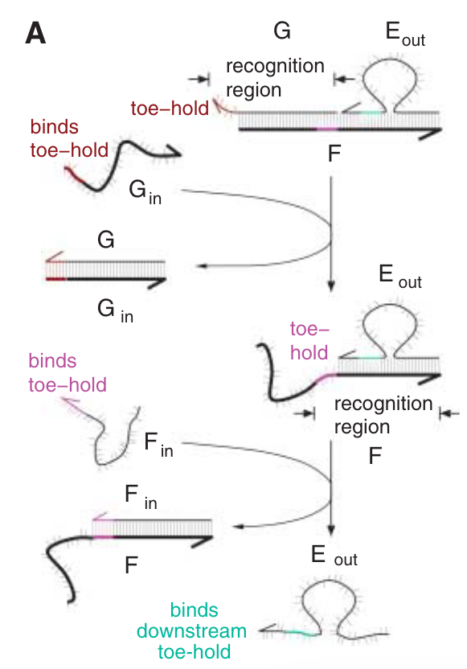
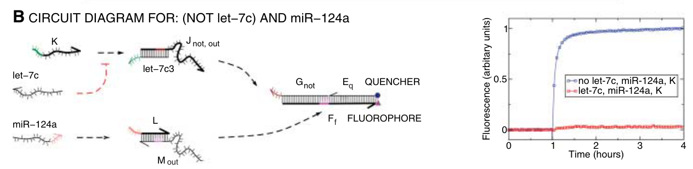
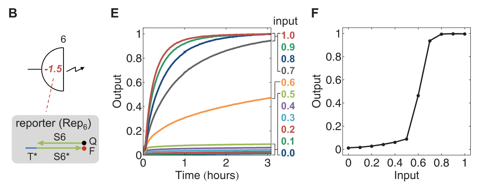
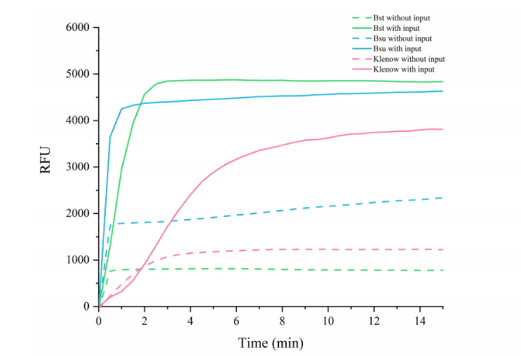
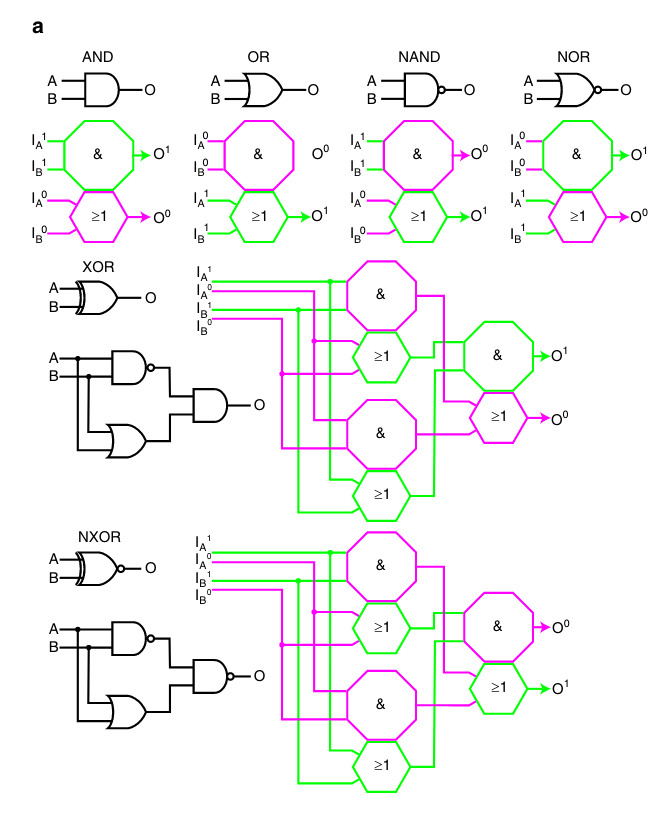

# Enzyme-Free Nucleic Acid Logic Circuits

- 无酶的核酸逻辑电路, 2006

**Georg Seelig, David Soloveichik, David Yu Zhang, Erik Winfree**

## 摘要

**背景：**

生物有机体能够利用复杂的生化电路执行复杂的信息处理和控制任务，但与电子电路相比，生化电路的工程化仍然是无效的。

为了系统地创建复杂而可靠的电路，电气工程师使用数字逻辑来设计电路

- 在这样的电路中，门和子电路是模块化组成的，并且存在信号恢复机制，以防止信号退化。

**提出的方法：**

本文提出了基于DNA的数字逻辑电路的设计和实验实现。演示了AND，OR和NOT门，信号恢复，放大，反馈（feedback）和级联。

- 门的设计和电路的构建是模块化的。门使用单链核酸作为输入和输出，机制完全依赖于序列识别和链置换。

**应用：**

生物核酸如microRNA可以作为生物信息的输入，在生物技术和生物工程中具有潜在的应用价值。

## 实验目的

**使用核酸逻辑开关构建化学逻辑门、大型电路**

- 先前的研究：
  - 1、已经证明，将小分子作为输入的变构核酶可以执行逻辑功能。但是这种电路的输出的形式与输入不同。因此，级联是困难的[3]。
  - 2、另一种方法使用序列识别来控制酶催化共价键的形成和断裂。
- 逻辑电路的发展：
  - 最近，基于杂交和构象变化的工程化核酸逻辑开关已经成功地在生物体内进行了验证。
  - 剩下的挑战是设计可组合的化学逻辑门，以构建大型、可靠的电路。

## 实验结果

我们提出了一种体现数字化设计原则的体外DNA逻辑门和电路，并且对它们进行构建，这样的设计原则体现在：逻辑、级联、恢复、扇出和模块化。

### 总述

**输入和输出：**

- 这些电路使用短的寡核苷酸作为输入和输出，实现了一组完整的布尔逻辑函数( AND , OR , NOT)。
- 由于输入和输出具有相同的形式，因此可以将门级联起来，从而创建多层电路。
- 逻辑值' 0 '和' 1 '分别用低浓度和高浓度表示。

**阈值与放大器：**

- 信号恢复是通过阈值和放大器门进行的，以防止噪声、信号丢失和泄漏反应。

- 放大器门也可以用来保证一个逻辑门可以产生足够的信号来驱动多个下游目标。

**可编程性：**

- 模块识别域之间的Watson - Crick相互作用决定了门的连通性。
- 可以在很少的约束条件下选择序列，从而可以构造任意电路，且交叉激活可以忽略不计。
- 此外，模块化结构允许与现有的分子组件进行接口连接- -无论是预先设计的子电路还是自然存在的核酸。

### 门

门功能完全由碱基的配对和断裂决定。

- 每个门都由一条或多条门链和一条输出链组成（图1A、图S1）。
- 输出链可以作为下游逻辑门的输入，也可以使用染料进行修饰、标记，以便在荧光实验中读出。
- 输出链的两端(图1A )，或者只有一端(图2中的翻译器门)，都可以连接到门复合体上。

图1A显示了一个由一条输出链和两条门链组装而成的 AND 门。

- 每个门链包含一个与其输入互补的识别区域。将单链输入添加到包含门的溶液中，将启动计算。
- 最初，除了离输出链最远的toehold外(图1A中的G链)，所有构成门的链的识别区域都是双链，因此是惰性的。
- 当第一个输入与这个toehold结合时，它通过链置换取代第一个门链，暴露toehold以供后续输入，并产生惰性双链废物产物。
- 对于第二个输入，也可以发生类似的过程。
- 当且仅当两个输入都存在时，输出链被释放。

- 图1A：2-输入 AND 门。
  - 该门由3条DNA链组成，分别为Eout ( 57 nt )、F ( 60 nt )和G ( 36 nt )。
  - 3′ 端用箭头标出。
  - toehold 和 toehold结合域 ( 6 nt ) 用颜色表示。
  - 输入链Fin和Gin ( 36 nt )与相应的门链F和G中的识别区域互补。

- 图S1：门的设计。
  - 实线箭头表示化学反应：Aout + B + C + D→ABCD。
  - 虚线箭头表示输入链或输出链可能与下游门复合体中的一个toehold结合，从而作为门的输入。
  - 所有的toehold序列和toehold结合域序列都用颜色表示。相同颜色的序列相互结合。
  - 数字指的是碱基，每个子序列(即不同颜色的区域)中的第一个碱基都被标明。在未结合的链中，该链的最后一个碱基也被标记。
  - A：门的设计和组装
    - 图中展示了一个三输入AND门的组成链和最终组装的门。
    - 指出了识别区域。如果输出链Aout结合，则双链的红色的toehold结合序列和单链环之间有三个碱基对。
    - 由于缺口处双螺旋的自发断裂，且为了尽量减少输出链与下游门的相互作用，toehold结合域向内移动。
    - 这意味着上游的输入和下游的识别域共有九个核苷酸是相同的。
  - B：2-阶段的级联翻译器
    - 第一个翻译器识别域的长度由microRNA的长度决定。
    - 只有输出链Nout的一端与O链结合。
    - 为了更好地保护toehold结合序列，引入了三碱基的夹子。
    - 值得注意的是，链O比输入链miR - 122a更长，并且当输入的miR - 122a被完全结合时，构成夹子的三个核苷酸仍然是单链的。
    - 链O上的三个碱基原则上为逆反应提供了一个toehold，即Nout与O结合并去除miR-122a。
    - 然而，这个toehold很短，而且这种翻译似乎并不重要。
    - 级联中的第二个翻译器(门H I )的设计与( A )中描述的门类似。

双输入AND门在其真值表中有4个条目(图1B )，通过荧光动力学实验和凝胶电泳(图1 , C和D)测试，证明其功能正确。

- B：两个输入AND门的真值表。释放的输出链被突出显示。
- C：
  - 在荧光实验中，链 Ff （3‘端为TAMRA荧光基团）和链 Eq （5’端为lowa Black RQ淬灭剂且无凸起环）被用来代替 F 和 Eout 。
  - 输出链的释放导致荧光增强。
- D：
  - 非变性凝胶电泳直接确认每个可能的输入组合的反应中间体和废弃产物。
  - 泳道1 ~ 4：样本如真值表的第1 ~ 4个条目所述。

我们也用同样的原理设计了多输入的AND门，并表明它们能够可靠地工作（图S2）。

- 图S2：门操作示意图。
  - A：
    - 该门由四条DNA链组成，分别标记为A (输出链, 57 mer)，B ( 60 mer )，C ( 60 mer )和D ( 36 mer )
    - 所有链的3 '端用箭头标出
    - toehold和toehold结合区域用颜色表示（6nt）
  - B：
    - 三输入的逻辑AND的计算
    - 输入链Bin、in、和Din是与相应的门链B、C和D中的识别区域互补的36个核苷酸单元组成的。其中，链D完全由其识别区域组成
    - 计算通过一系列toehold介导的链置换反应进行。
    - 输入链Din结合在链D暴露的toehold (蓝色)处，然后通过三次链置换将D从门中置换出来。
    - 在此过程中，产生了废弃产物 D Din，并为Cin（青色）提供了一个toehold
    - 随后，输入Cin释放链C，形成C Cin 双链体。
    - 然后，输入Bin与链B形成双链，输出链Aout释放到溶液中。
  - C：
    - 三输入的AND门的真值表。
    - 只有当三个输入都存在时，输出链才会被释放( 条目 8 )。
    - 释放的输出链被突出显示。
  - D：
    - 荧光实验
    - 荧光实验所用的门如插图所示，并标明荧光团( F )和淬灭剂( Q )的位置。
    - 荧光最初被淬灭；荧光值的增加是反应进行的一个衡量标准。
    - 输入是按顺序添加的，每次添加之间有一个小时的延迟。
    - 添加输入的顺序按三个荧光图像循环地排列。这样，三个实验就能覆盖真值表的全部8个条目。
    - 例如，在蓝色曲线中，我们从门和无输入(条目1 )开始，然后添加Bin (条目2 )，然后是Cin (条目5 )，最后是Din (条目8 )。
    - 图中的数字指的是真值表中的条目。
    - 所有物种均在25°C，浓度为500 n M的条件下进行实验。
  - E：
    - 凝胶电泳
    - 第0泳道：10 bp比例尺。
    - 泳道1 ~ 8：样本如真值表第1 ~ 8条所述。
    - 本实验中使用的门如( A )所示，只是由于历史原因使用了链A而不是Aout；这些链仅在凸起环序列上存在差异。

我们所有实验中的门在触发"泄漏"复合物后通过凝胶电泳进行纯化（图S3）。

- 图S3：三输入AND门的荧光数据：纯化门和未纯化门的比较。
  - A：在500 nM浓度下纯化AND门 A B C D。
  - B：在500 nM浓度下，未纯化的AND门A B C D。（A）和（B）中的门是相互独立制备的，制备时间相隔不到几天。两个门所用的链来自相同的DNA库。
  - C：纯化250 nM浓度的AND门 A B C Dm。
  - D：在250 nM浓度下，未纯化的AND门 A B C Dm。（C）和（D）的门也是相互独立制备的，使用的DNA链来自相同原液。
    - 制备时间相隔不到几天。
    - 值得注意的是，D链和Dm链的唯一区别在于其6个核苷酸的toehold。
    - 这些门在其他方面都是完全相同的。
    - ( A )和( B ) (或( C )和( D ) )的比较表明，纯化显著降低了假正信号的数量。
    - 对于含有未纯化门的样本(见( B )和( D ) )，即使只有某些输入子集存在，也会观察到虚假信号。
    - 另外需要注意的是，虽然净化总是减少泄漏，但净化后的样品并不总是同样纯净。
    - 显然，用于( C )的样品似乎比用于( A )的样品更容易泄漏。

一个门的输出链可以是下游门的输入链。因此，在释放之前，输出链与下游门的交互至关重要。保护上游门的输出链的toehold结合区域可以防止这种相互作用。我们构建了一个由1个AND门和2个翻译器门组成的电路，证明了这一原理(图2A和图S4)。

- 图2A：虚线箭头表示输入或输出链可以作为下游门的输入。
  - 在37°C下，用总RNA背景下的RNA输入和DNA门对电路进行操作。
  - 所有门均为25 n M，合成的RNA输入为30 n M，总RNA (小鼠脑)浓度为200 𝒰g / ml。
  - 观察到了适当的功能。为了进行比较，进行了没有总RNA的实验，使用两种RNA输入或两种DNA输入。

- 图S4：
  - A：逻辑AND：DNA和RNA输入的反应动力学比较。
    - 门浓度为250 n M，输入浓度为300 n M。
    - 在没有总RNA的情况下，反应在25℃下进行。
    - 蓝色和红色轨迹：DNA输入。两个轨迹之间的输入添加顺序是互换的。
    - 这样，真值表(没有输入、只有miR - 124a 、只有let - 7c 、两者都有输入)的所有四种情况都可以在仅进行两次实验的情况下进行测试。
    - 绿色和黑色轨迹：RNA输入。当RNA作为输入时，动力学似乎稍慢一点，但门仍然可靠地运行(尽管RNA - DNA结合比DNA - DNA结合强)。
  - B：隐式OR
    - 门浓度为250 n M，输入浓度为300 n M。
    - 实验在25℃下进行，并且接下来的所有实验也是。
    - 使用了生物学上microRNA的DNA等价物。
    - 正如预期的那样，只有当 miR - 15a或miR - 10b中至少一个、Bin、Cin (蓝色、红色和绿色痕迹)同时存在时，才会触发输出。

### 翻译器（转换器）

翻译器门将输入链中编码的信号转换为输出链中编码的信号。

翻译器门 JK 和 LM 将两条生物microRNA序列(小鼠let-7c 和 miR - 124a)翻译成与链Gin和Fin具有相同识别区域的输出。

如果两个翻译器级联，则初始输入链和最终输出链之间不存在顺序限制。这被称为全译器；NO和HI的级联就是一个例子（图3和图S1）。

- 图3：通过AND、OR、序列翻译、输入放大、信号恢复等复杂的化学电路，实现信号传播。
  - 这个五层电路共由11个门组成，接受6个输入。
  - 除阈值门为100 nM，Th2in链为150 nM外，所有门均为每门200 n M ( 1 × )。
  - 除非另有规定，输入量均为250 nM ( 1.25 × )。
  - miR143以50 nM ( 0.25 × )的浓度加入，然后被输入放大器放大。
  - (插图)无信号恢复模块(阈值加放大器)和有信号恢复模块(阈值加放大器)时电路运行的荧光痕迹。输入条件对应于逻辑TRUE输出( ON )的轨迹与逻辑FALSE输出( OFF )明显不同。
  - 测试的案例包括当所有输入都存在时、仅有一个输入缺失的所有情况，以及关闭一个OR子句的输入组合。
  - 假设满足单调性，保留额外的输入不会导致合乎逻辑的TRUE输出。
  - 为了确定电路对泄漏OFF信号的响应，以50 nM ( 0.25 × )的浓度加入miR - 124a，而其他输入均正常加入。

对于toehold和识别区域，翻译器可以连接不先验使用相同序列的子电路。这对于使现有电路适应于任意生物输入的计算尤为有用。

图2A的电路也在与潜在的生物应用有关的条件下进行了测试。由于门功能仅依赖于Watson - Crick互补性(图2A和图S4)，该电路与RNA输入和DNA输入的工作原理相当。将温度提高到37 ° C不会降低电路性能。最后，在门复合物和输入链浓度过高时，在存在潜在干扰生物RNA (小鼠脑总RNA)的情况下，电路功能良好。

由于只需一小部分逻辑门( AND , OR , NOT)足以有效计算任意布尔函数，因此我们开发了DNA门来执行这些操作。逻辑OR功能是通过使用产生相同输出的两个门来获得的。我们构建了一个三门的化学电路，其中一个逻辑OR注入到一个逻辑AND（图S4B）。逻辑OR表现为，翻译器门ST和UV接受不同的输入( miR - 15a和miR - 10b)，但释放具有相同识别区域的输出信号。如果布尔值由一条链( ' 0 ')或另一条链( ' 1 ')的存在来表示，即所谓的"双轨"表示，那么AND和OR本身就足以计算任何布尔函数。

如果一个布尔值由单个输入串的存在或不存在来表示，则可能需要一个非门。我们修改了图2A所示的电路，反转了let - 7c输入（图2B）。NOT门利用了一个额外的“反转器”链，除非输入链作为竞争性抑制剂存在，否则会触发门的反应。由于“反转器”链必须与输入链同时加入，因此NOT门被限制在电路的第一层。这足以创建一个双轨表示，通过该表示形式，可以使用AND和OR进行任意的后续计算。

- 图2B：NOT门由一个翻译器门和一个与let - 7c互补的反转器链组成。
  - 门、反相链和输入浓度分别为250 n M、300 n M和300 n M。
  - 在这里和所有后续实验中，温度均为25℃，并使用生物microRNA的DNA等价物（当量/equivalents）。
  - 若let - 7c存在，则反转链K优先与let - 7c杂交。否则，反转链K触发了翻译器。

### 阈值

一个门可能以两种方式失效：触发时可能无法产生足够的输出，或者通过自发地释放输出链而"泄漏"。这两种类型的错误都需要信号恢复；前者要求增加适度的输出量至完全激活水平，后者要求减少少量的输出量至可忽略水平。为了实现信号恢复，我们开发了用于放大和阈值化的门。

阈值门(图2C )是一个三输入与门，具有相同的第一和第三输入。第二个输入只是为了结构形式而必需的，它始终存在，可以视为阈值单元的一部分。亚化学计量比（substoichiometric）的输入(相对于阈值门而言)将导致大多数门只失去其第一和第二门链，从而释放不出输出。输入浓度两倍于阈值门的浓度将导致大多数门产生输出。

- 图2C：
  - 阈值门，使用染料/淬灭剂标记的读出门来监测输出。
  - 链Th2in是阈值单元的一部分，在实验开始前添加。
  - 使用两个不同的阈值浓度，绘制最终荧光强度与输入浓度之间的关系图。

阈值门的浓度设定了S形非线性的阈值（图2C、图S5）

- 图S5：图2C中的阈值电路的荧光数据。所有3个数据集(见( A )、( B )和( C ) )都被归一化到各自实验集内达到的最大信号。
  - A：250 nM的阈值门和读出门，300 nM的Th2in、输入浓度不同。
  - B：阈值和读出门为125 nM，Th2in为150 nM、输入浓度不同。
  - C：与( A )相同，但门来自不同纯化器。
  - D：每个数据点对应于一次动力学实验中所达到的最终(归一化)荧光值。
    - 最终荧光值与输入浓度绘制在一个图表上。
    - 蓝色和红色曲线与图2C相同。
    - 蓝色曲线由( B )中的数据得到，红色曲线由( A )中的数据得到，绿色曲线由( C )中的数据得到。
    - 红色和绿色曲线的比较表明，阈值行为可以用来自不同纯化的门来重现。

### 放大器

由于阈值门的输出不能超过输入信号的一半，因此需要进行后续放大。先前已经证明了一种基于杂交的催化扩增系统[22]。在稍加修改的情况下，该系统既可以作为输入放大器又可以作为全翻译器(图S6和图3 ,左, miR - 143翻译器)，或者作为荧光读出器(图S7A和图3 ,右)。或者，可以设计基于反馈逻辑的放大器（图S6）。

- 图S6：输入放大器。
  - 每条链的3 '端用箭头表示。
  - toehold用颜色表示，颜色相同的细线和粗线互补。
  - 为了提高放大器的稳定性，引入了3个碱基对的夹子。
  - 放大器复合物被困在一种亚稳态构型中，在这种结构中并不是所有可能的碱基对都可以形成。
  - 输入链的结合打开了放大器复合体的一个臂。
  - 这种结合事件会导致构象重排，放大器复合物分解成为两个双链废物产物达到最小能量状态。
  - 在这个过程中，输出链被释放，重要的是，输入也被释放。
  - 因此，输入链可以与另一个放大器进行交互。

- 图S7：信号放大电路。
  - A：基于文献[S2]中的杂交催化剂的信号放大器。
    - 放大器门的浓度为250 n M。
    - 序列相对于原始的杂交催化剂进行了修改，使得链Thout可以作为输入使用。
    - 对于原始序列，在250nM的单次翻转(a single turnover)情况下的反应半衰期约为5-10分钟，在多次翻转(a multiple turnover)情况下，单个催化剂链（输入）可以催化多达40个放大器门的衰变（称为“燃料复合物”）。
    - 这里的反应半衰期约为20 ~ 30 min，单链仅翻转约10个放大器分子。
    - 值得注意的是，这里使用的输入(链Thout)比文献中的输入(催化剂链)长得多。二级结构效应可能会减慢与放大器的结合。
  - B：基于反馈（feedback）的放大器。
    - 在这里，一个二门的反馈电路放大了荧光输出信号，而不产生输出信使链。
    - 它由两个翻译器构成，其中第一个翻译器的输出作为第二个翻译器的输入，第二个翻译器的输出作为第一个翻译器的输入。
    - 这个荧光放大器会随着时间线性地增强输出信号。
    - 两个门的浓度均为500 n M。
    - 在这些实验中，使用A链(作为门WY的输入)来启动反馈回路。
    - 当放大器用于电路中时，Thout链输出将充当输入。
    - 值得注意的是，Thout是染料标记门Qout Pf的输入，因此Qout Pf本身可以作为读出门。
    - 对于放大器的测试，A链是一个更好的选择，因为需要触发两个门才能观察到信号增加。
    - 单次翻转情况下(在500 n M)，半衰期在5 min左右。
    - 在没有输入的情况下，反馈系统的稳定性不如催化放大器。
    - 当门控WY加入到含有Qout Pf的溶液中时，可以观察到一些明显的自发触发现象。

阈值门和放大门一起构成信号恢复模块，它在多个中间点并入大型电路，以确保数字表示的稳定性。

### 模块性和可扩展性

最后，为了展示模块性和可扩展性，我们将11个门组成一个更大的电路。该电路将之前介绍的输入翻译和放大、AND和OR的计算、以及信号恢复模块组合在一起（图3）。该电路的输入为6个小鼠microRNA的DNA类似物。为了确定信号恢复的有效性，我们构建了一个未进行信号恢复的等效电路，并对两个电路进行了测试，输入信号的强度为全开信号的四分之一( 0.25 × )，以模拟一个较大的上游泄漏。完整电路保持了较低的输出信号，而未进行信号恢复的电路出现了≈25 %的输出泄漏（图3插图）。

为了验证其他电路元件，构建了多个子电路，并进行了独立测试（图S8、S9）。

- 图S8：隐式OR和全译器。
  - 所有门的浓度均为250 n M，输入为300 n M。
  - 该电路是图S4B所示隐式- OR电路的扩展版本。
  - 这里miR - 122a被用作输入并被翻译成Hout，而不是像以前那样直接添加输入链Bin。
  - Hout的识别区域与Bin具有相同的序列。值得注意的是，输入的Hout序列与miR - 122a的序列完全无关。
  - 如果使用单一的翻译器而不是完整的翻译器(即两个翻译器的级联)，将会出现错误。
  - 实际上，链Nout与miR - 122a有6个相同的核苷酸。

- 图S9：带有输入放大器的电路。
  - 所有门为250 nM，除miR - 143外的所有输入都为300 nM ( 1.20x )，而miR - 143为50 n M ( 0.20x )。
  - 值得注意的是，miR - 122a和miR - 143耦合在一个OR子句中。因此，只有这两个输入中的一个是逻辑TRUE输出所必需的。
  - 在miR - 122a缺失(和miR - 143存在)的情况下，反应动力学相对缓慢，因为需要对亚化学计量的输入进行催化放大，以便充分触发荧光标记的三输入AND门。

测试了反馈荧光放大器作为输出端的催化放大器的替代方案，得到了一个包含12个门的电路（图S10）。

- 图S10：具有反馈放大输出的电路。
  - 除阈值外的所有门都为200nM，阈值门为75nM。
  - miR - 143的输入浓度为50 nM ( 0.25x )，其他的输入浓度均为250 nM ( 1.25x )。
  - 总共有12个门，这是迄今为止我们所构建的最大的电路。
  - 我们测试了所有输入都存在的情况(蓝色轨迹)，所有只有一个输入缺失(红色、绿色、黑色、青色、紫色和黄色轨迹)的情况，此外，我们测试了构成OR子句(棕色和橙色轨迹)的输入的保留组合。
  - 假设单调性，则保留额外的输入永远不会导致逻辑上的TRUE输出。(值得注意的是,在这一系列的实验中,我们没有测试模拟泄露的miR - 124a的输入。)

随着电路规模越来越大，速度成为一个限制因素。无信号恢复的电路需要2小时才能达到一半的激活（图3左插图）。带有信号恢复的电路有两个额外的层，并且需要10小时才能实现半激活（图3右插图）。尽管操作速度较慢，在这两种情况下，关闭状态和开启状态之间的明显差异可以更早地被区分出来。加快单个门的响应速度（例如，缩短识别域）或更改其他反应条件可能会改善整个电路的性能。

### 总结

我们在创建大型电路中的成功可归因于遵循数字逻辑的原则，将toehold隔离与分支迁移和链置换相结合，通过纯化减少泄漏反应，以及设计的模块化。这里开发的逻辑门和它们所基于的原理也可用于构建模拟或混合电路，并可能被证明与其他构建体外和体内分子自动机的方法兼容。因为有证据表明，我们的逻辑门可以使用天然RNA作为输入，并且在小鼠总RNA存在的情况下，它们的行为是正确的，我们的基于杂交的电路可能适用于复杂表达模式的原位检测，甚至是体内逻辑处理。

# Scaling Up Digital Circuit Computation with DNA Strand Displacement Cascades

- 利用DNA链置换级联来扩大数字电路的计算，2011

**Lulu Qian, Erik Winfree**

## 摘要

**背景：**

要从零开始建立复杂的生化电路，需要了解基本构建模块的简单性以及这样的电路如何强大地扩展。

**实验结果：**

采用基于可逆链置换过程中的简单的DNA反应机制，本文实验性地展示了几个数字逻辑电路，最终构建了一个由130条DNA链组成的四位平方根电路。

- 这些多层电路在每个逻辑运算中包括**阈值**和**催化**，以执行数字信号恢复，这使得在具有大致恒定的开关时间和线性信号传播延迟的大型电路中实现快速和可靠的功能。
- 该设计自然地融入了大规模电路的其他关键元素，如通用调试工具、并行电路制备和由自动电路编译器支持的抽象层次结构。

## 实验目的

**创建具有可扩展性的DNA电路结构：**

toehold介导的DNA链置换的引入，使无酶DNA机器可以通过单独杂交实现自动化。

DNA链在自由时可以作为信号，但当它与互补链结合时就会被抑制。单链DNA信号首先可以通过一个称为toehold的单链结构域与部分双链复合物结合，然后在发生分支迁移后释放原先结合的链。因此，在输入信号到来时可以激活输出信号，并且反应速率可以通过toehold的长度进行控制。

这一原理激发了丰富的DNA链置换电路理论[ 9、10 ]和实践[ 11 ~ 13 ]的发展，产生了广泛的应用，如体内医学治疗学[ 14 ]、原位分子仪器[ 15 ]、体外生物医学诊断[ 16 ]等。

迄今为止，利用DNA链置换级联构建的最大数字电路涉及12种初始DNA物种。然而，它们的逻辑门是用多链的DNA复合物构建的，需要具有挑战性的序列设计约束，并且信号恢复仅发生在电路输出端，这也许可以解释为什么性能随规模衰减惊人。

我们使用抽象的形式来表示所有的电路，它简明地定义了DNA的种类和它们的初始状态，从而确定了电路的布线、逻辑功能和时序行为。

## 实验结果

### 总述

为了创建具有可扩展性的 DNA 电路结构，我们提出了简单的 DNA 门基序（gate motif）——基于toehold交换原理的具有可逆链置换反应的“跷跷板”门。

 **“跷跷板”门：**

- 是指可逆反应，可以交换 DNA 信号的活性；
- 一对“跷跷板”步骤完成了一个催化循环，实现信号放大和隔离。
- 一对跷跷板门可以执行AND或OR操作，足以使用双轨逻辑进行通用布尔函数求值。

**阈值和催化：**

- 通过在每个逻辑运算中嵌入阈值和催化作用来消除信号退化，从而实现鲁棒性。

**跷跷板门的级联：**

- 通过使用“即插即用”的分子元件，门可以很容易地连接到每个门处具有任意数量的输入(扇入)和输出(扇出)的电路中，并且可以通过简单的浓度调整来重新配置它们以执行AND或OR逻辑功能。

- 由于链结构域的独立性，DNA序列设计是直接的。门结构的简易性使得并行DNA合成和电路制备成为可能。

采用跷跷板结构实现的电路规模比以往任何一种链置换电路都要大，用电路中初始DNA物种的数量为度量标准，至少要大5倍。

### 跷跷板门

在跷跷板的抽象中，每个DNA门由一个双侧节点（two-sided node）表示（图1A、图S1 A和B）。

每条DNA信号都用一条导线来表示。

节点的每一侧都可以连接任意数量的导线。每根导线连接两个节点的不同侧面。

每个红色数字表示一个DNA物种的初始相对浓度；导线上的每个数字对应一条自由的信号链；导线末端节点内的每个数字对应一个结合的信号链(正数)或到达门时吸收信号的阈值(负数)。

一个将DNA信号转化为荧光信号的报告器用半个带有锯齿箭头的节点所代表（图1B），其初始相对浓度类似于阈值的写法。

- 图1A：跷跷板门基序及其DNA实现

  - A：门的抽象示意图。

    - 黑色数字表示节点，或者是与网络中的节点的接口。

    - 节点内或连线上的红色数字表示不同初始DNA物种的相对浓度。
    - 每个物种在一个门内扮演一个特定的角色(例如,输入)，在一个网络内有一个独特的名字(例如, W2,5 )。
    - 彩色线条表示DNA链的域，箭头标记它们的3' 端，颜色表示不同的DNA序列。
    - S2、S5和S6是15个核苷酸的长识别域，对应着节点2、5和6。
    - S7不与网络中的其他节点交互，但保留了信号链的统一格式。
    - T是5个核苷酸的短的toehold结构域，T*是T的Waston-Crick互补。
    - s2\*为 S2\*从3′端开始的前几个核苷酸。

- 图S1 A、B：跷跷板的DNA基序的表示和机理
  - A：
    - 螺旋水平、序列水平和结构域水平图解了一个跷跷板DNA门。
    - S5和S6为长识别域。T是一个短的toehold域。
    - T\*是T的Watson - Crick补等。
  - B：
    - 以初始状态和最终状态为例，给出了一个跷跷板门基序的抽象示意图。
    - 红色数字表示初始物种( 0.6 ×输入, 0.5 ×阈值, 1 ×门-输出复合体, 10 ×燃料)和最终物种( 0.1 ×输入, 1 ×门-燃料复合体, 1 ×输出, 9 ×燃料)的相对浓度。
    - 最终状态的数字为近似值。

每个信号都是单链DNA分子，具有两个识别域，用于识别连接的两个门，一个位于中央toehold区域的一侧。

每个门都与一个基础门链相关联，该链具有一个被夹在两个toehold区域之间的识别域的互补链。当一条信号链被结合到一个门时，它与门的基链形成一个门-信号复合体。在任何时刻（不包括图S1C中反应的瞬态状态），一个门基础链始终有一个信号链绑定在一侧，而另一侧的toehold不被绑定。

- 图S1C：
  - 具有阈值的跷跷板催化的反应路径
  - 带阴影的方框表示初始种类，透明的方框表示最终种类。
  - 实心箭头表示前向反应的流向，空心箭头表示相应的后向反应的流向。
  - 匹配的颜色和域名表明可以发生结合或分支迁移的位置
  - s2\*是从S2\*的3 '端开始的前几个核苷酸，与T一起形成一个较长的toehold。

在一个跷跷板网络中有三个基本反应(图1C和图S1C)。

- 第一个是跷跷板：一个门的一侧的自由信号可以通过toehold介导的链置换释放门的另一侧的信号。该过程始于自由信号链（例如，W2,5）与门-信号复合物（例如，G5:5,6）在未覆盖的toehold域（例如，T*）处杂交，然后通过识别域（例如，S5）进行分支迁移。当先前的信号只通过短toehold与门基础链结合时，它就会脱落。由此得到的门-信号复合物(例如G2,5:5)将在另一侧有一个未覆盖的toehold，因此现在自由的信号(例如W5,6)可以对称地反转这个过程。
- 第二个是阈值：与门相关的阈值和一个进入的信号可以通过一个更长的toehold（例如s2\*T\*）与发生反应，只产生没有暴露toehold的惰性废物物种。阈值反应比跷跷板反应快的多，因为toehold介导的链置换速率随toehold长度呈指数增长。因此，只有当输入信号超过阈值时，才能有效地发生跷跷板效应。
- 第三个是报告器：一个类似于阈值的报告物种，但修饰了荧光团和淬灭剂对，可以在接收信号的同时产生荧光信号。与阈值不同的是，报告器并不会与跷跷板竞争，因此不需要更长的toehold。

- 图1C：
  - 在跷跷板网络中涉及到三种基本的反应机制：跷跷板( seesawing )、阈值( threshold )和报告( reporting )。
  - 具有两种颜色的实心圆表示具有两侧（two sides）的信号链。
  - 彩色的“吃豆人”表示阈值或报告复合物。

### 催化反应（放大器）

DNA信号可以扮演不同的角色，如输入、输出和燃料。一个带有几根导线的跷跷板门可以创建一个催化循环，在这个循环中，输入将自由燃料转化为自由输出，而不会在这个过程中被消耗（图1D、图S1 B和C）。

- 图1D：
  - 一次跷跷板循环催化反应
  - 最初，输出信号结合在门的右侧；输入和燃料信号是自由的(在我们的类比中,输出是骑在跷跷板的右侧。输入和燃料在四处游荡)。
  - 输入信号首先释放输出信号并绑定到门上（输入信号跳上了板子的左边，使输出信号跳下来）。
  - 然后燃料信号通过以同样的方式结合于门上而取代了输入信号（燃料信号将输入信号推开）。

这些反应是由跷跷板反应的熵驱动向前推进的。少量的自由输入可以催化大量自由输出的释放（图S2）。

- 图S2：跷跷板催化剂的演示。
  - A：在彩色方框中突出显示跷跷板催化剂的初始相对浓度。
  - B：在彩色方框中突出显示报告器的初始相对浓度。
  - C：与报告器相连的跷跷板催化剂的抽象图。黑色数字标识跷跷板门。
  - D：跷跷板催化剂和荧光基团标记的报告器的DNA实现。匹配的彩色方框突出了抽象图中所代表的DNA物种。括号中的文本是这些物种的名称，遵循了跷跷板网络的系统命名方案。
  - E：跷跷板催化剂的动力学实验。
    - 门-输出复合物，燃料链和报告器复合物分别以1 ×，2 ×和1.5 ×的相对浓度混合在溶液中（1× = 100nM）
    - 然后加入输入链，浓度从0.0×变化到1.0×，每次增加0.1×。
    - 用5 ' Iowa Black RQ淬灭剂对报告复合物的顶链进行修饰；底部链用3 ' ROX荧光团修饰。
  - F：E的输入-输出图。

### 阈值

阈值可以直接与跷跷板催化剂相结合，以支持数字抽象，这是电子中数字逻辑的基本原理：通过将固有的模拟信号推向理想的ON或OFF值。荧光动力学实验(图1E )证明了图1A中的电路与图1B中的报告器相连。输入-输出关系(图1F)揭示了一个非常适合信号恢复的阈值。

- 图1B、E、F：
  - B：报告器简图；F和Q分别表示荧光团和猝灭剂。
  - E：具有阈值的跷跷板DNA催化剂的动力学实验。
    - 将阈值配合物、门输出配合物、燃料链和报告配合物分别以相对浓度为0.5 ×、1 ×、2 ×和1.5 ×的溶液混合(标准浓度1 × = 100 n M)。
    - 然后以0.1 ×的增量将输入链以0.0 ×到1.0 ×的方式添加。
  - F：( E )的输入-输出图。

### 跷跷板门的级联

两个跷跷板门的级联可以计算逻辑函数OR或AND。为了说明这一点，我们介绍了两种用于数字电路的可组合跷跷板组件。我们首先将信号X的总产量定义为最终从门释放的总量：

受序列设计约束的启发，我们定义了两种类型的前馈跷跷板门，每一种都假设一个不可逆的下游门 (图 S3和S4)。

**放大门：**

第一种类型称为放大门。该机制具有一个阈值和燃料。如果其输入的总产出大于初始阈值的数量，则输出将继续催化释放，直到达到最大产出，最大产出就是结合输出的初始数量；否则，输出将保持为零。一个放大门可以支持多路输出。只需要为每个输出链添加一个绑定的输出信号即可实现此功能。这些门-输出复合物会有相同的门基链，这些门基链被具有不同右端识别域的信号链绑定，以连接到不同的下游门。为了充分驱动所有输出的释放，初始自由燃料量将是所有初始约束输出之和的两倍：

**集成门：**

第二种类型称为集成门。它没有阈值或燃料。输出与输入按化学计量比释放。一个集成门可以支持多个输入。这可以通过为每个输入链添加一个输入信号来简单完成。这些输入链将具有相同的右侧识别域，但不同的左侧识别域连接到不同的上游门。当有多个输入时，输出将是所有输入的总和。为了确保所有的自由输入能够转化为自由输出，绑定输出的初始值至少必须等于可能到达的所有输入的最大总和：

一个集成门和一个放大门可以计算OR或AND（图2A）。

- 图2：以跷跷板DNA基序实现的数字逻辑门。
  - A：根据阈值的初始浓度，计算OR或AND的跷跷板电路的抽象图。输入信号x1 ( W1 , 2)和x2 ( W3 , 2 )在门2处相加，如果超过阈值，则由门5放大，产生输出信号y ( W5 , 6 )，由报告器6中的ROX荧光团报告。
  - B：域级DNA双输入AND或OR门的实现。
  - C：动力学实验：输入链为0.1 × ( 0 ,逻辑关断)或0.9 × ( 1、逻辑ON)，其中1 × = 100 nM。链的序列列于表S2和S3，电路3。实验在20℃下进行。

一个两输入OR门将具有一个集成门（integrating gate），它输出两个输入的和。当总和大于0.6时，下游放大门将输出1，否则输出0。在实际中，由于虚假或不完全的反应，输出不会恰好为0或1，因此必须保证逻辑门在输入不完美的情况下也能正确工作。假设一个数字抽象，OFF信号可能在0至0.2的范围内，而ON信号在0.8至1的范围内。只有当两个输入都是OFF时，输出才能保持为OFF状态。将阈值从0.6变化到1.2，计算AND。在这种情况下，只有当两个输入都为ON时，总和才能超过阈值，并催化输出为ON。

在动力学实验中，使用报告门提供不可逆的输出，并将输出转化为荧光信号。使用完全相同的一组分子(图2B )，但阈值的初始浓度不同，进行了OR和AND计算(图2C )。AND门的表现比OR门慢，因为阈值的初始浓度较高，所以上游信号超过阈值需要更长的时间。由于阈值和催化的作用，即使输入不完美（OFF输入使用了0.1，ON输入使用了0.9），输出仍然可以达到理想的OFF和ON信号水平，保持数字抽象。

用OR - OR、AND - OR、OR - AND和AND - AND证明了两层级联（图S5）。

- 图S5：两层 AND/OR 级联。
  - A：两层跷跷板AND / OR级联的抽象示意图。功能依赖于阈值的初始浓度。
  - B：双层AND/OR级联的动力学实验。链的序列列于表S2和S3，电路4。轨迹及其对应的输入具有匹配的颜色。分别加入相对浓度为0.1 × ( 0 ,逻辑关断)或0.9 × ( 1、逻辑ON)，其中标准品浓度1 × = 100 nM。实验在20℃，含12.5 mM Mg2 +的Tris-acetate- EDTA缓冲液中进行。

在所有测试情况下，输出均进入正确的ON或OFF状态。一个3层OR级联的(图S6 A和B)和一个4层OR级联的(图S6 C和D)也起作用。

- 图S6：多层OR级联。
  - A：三层跷跷板OR级联的抽象示意图。
  - B：三层OR级联的动力学实验。链的序列列于表S2和S3，电路5。
  - C：四层跷跷板OR级联的抽象示意图。
  - D：四层OR级联的动力学实验。链的序列列于表S2和S3，电路6。轨迹及其对应的输入具有匹配的颜色。
  - 对于OR级联延迟和切换时间图（图3A、B），数据来自于所有OR级联（图2、S5、S6），只要输入仅由一个ON信号组成，但图S5B的红色轨迹除外，该轨迹异常缓慢（可能是由于序列设计问题引起的）。
  - 分别加入相对浓度为0.1 × ( 0 ,逻辑OFF)或0.9 × ( 1、逻辑ON)，其中标准品浓度1 × = 100 nM。实验在20℃，含12.5 mM Mg2 +的Tris- acetate- EDTA缓冲液中进行。

电路计算所需的延迟时间随层数线性增加（图3A）。然而，一旦超过输出门的阈值，信号的增加速度大致与较小电路中相同（图3B）。在一个4层、2个"与"门和3个"或"门的电路中，通过12种不同的输入组合，输出在8小时内达到清晰和正确的ON或OFF状态（图3C）。

由于集成门（integrating gate）支持多个输入，而放大门支持多个输出，因此由它们构建的逻辑门可以轻松支持扇入和扇出。在具有四输入OR门的电路中，只有当所有来自上游OR门的输入都是OFF时，输出才保持OFF（图3D）。在一个四输出或门的电路中，每个输出从上游或门复制正确的逻辑（图3E）。图S8C和图S9C分别为一个四输入与门和一个四输出与门的电路。

- 图S7：一个具有5个AND / OR门和4层的电路。
  - A：跷跷板电路的抽象图。
  - B：跷跷板电路的动力学实验。这与图3C中绘制的数据相同。值得注意的是，三个最慢的轨迹是输入，需要电路等待一个慢的AND门。链的序列列于表S2和S3，电路7。轨迹及其对应的输入具有匹配的颜色。分别加入相对浓度为0.1 × ( 0 ,逻辑OFF)或0.9 × ( 1、逻辑ON)，其中标准品浓度1 × = 100 nM。实验在20℃，含12.5 mM Mg2 +的Tris缓冲液- EDTA缓冲液中进行。

- 图S8C：4个或门扇入与门电路的动力学实验。
  - 链的序列列于表S2和S3，电路8。轨迹及其对应的输入具有匹配的颜色。分别加入相对浓度为0.1 × ( 0 ,逻辑OFF)或0.9 × ( 1、逻辑ON)，其中标准品浓度1 × = 100 nM。实验在20℃，含12.5 mM Mg2 +的Tris- acetate- EDTA缓冲液中进行。

- 图S9C：带扇出与门的电路到4个或门的动力学实验。
  - 链的序列列于表S2和S3，电路9。轨迹及其对应的输入具有匹配的颜色。分别加入相对浓度为0.1 × ( 0 ,逻辑关断)或0.9 × ( 1、逻辑ON)，其中标准品浓度1 × = 100 nM。实验在20℃，含12.5 mM Mg2 +的Tris- acetate- EDTA缓冲液中进行。

- 图3：以跷跷板DNA基序实现的数字逻辑合成。
  - A：OR级联中的电路层延迟。在OR级联电路(图2和图S5和S6)中，单输入为ON的七个选定实验的半完成时间对激活输入的深度作图。
  - B：OR级联中的电路层开关时间。将上述7次实验完成20 % ~ 80 %的时间间隔对激活输入的深度作图。
  - C：具有四层和五个AND或OR门的电路。与六个输入导线对齐的数字是来自12个不同实验的相应输入的逻辑值。矩形表示输出保持关闭的实验。轨迹及其对应的输入具有匹配的颜色。
  - D：一个具有四输入或门的电路。
  - E：具有四路输出或门的电路。电路图中从上到下的输出对应着左上、右上、左下和右下的图示数据。( C )，( D )和( E )中的跷跷板电路的抽象图分别来自于图S7、S8和S9。表S2和S3中分别列出了链的序列，电路7、8和9。实验在20℃下进行，1 × = 100 n M，OFF使用0.1 ×，ON输入使用0.9 ×。

**一个计算四位二进制数的平方根的整数部分的电路：**

为了展示一个有趣功能的数字电路，我们构建了一个可以计算四位二进制数的平方根的整数部分的电路（图4A）。它不是一个优化的数字逻辑电路；它被设计用于显示逻辑门的AND，OR，NOT，NAND，NOR，扇入和扇出，以及输入信号的扇出。

使用基于单个DNA种类的存在与缺失来确定输入的开启或关闭状态，直接实现非门是很困难的：由于在没有输入的情况下，非门就已经产生了ON信号，并且对于一次性使用的电路(如跷跷板电路)，计算不能被撤销，所以电路可能会在所有输入链被添加之前计算出一个错误的输出。因此，我们采用双轨逻辑（图S10B）。

每个输入用一对输入来代替，分别代表逻辑ON和OFF。每个逻辑门由一对AND或OR门替换。以NOR门为例，输出为OFF是两个输入都为ON的OR；输出为ON是两个输入为OFF的AND 。最初，这对输入是不存在的，这表明这个信号的逻辑值是未知的。在计算开始时，将增加该对的一个输入，表示逻辑ON或OFF。这样，在输入信号到达之前不会进行计算。通过使用双轨逻辑，任何AND-OR-NOT电路都可以转换为只有AND或OR门的等效电路。然后，任何AND-OR电路都可以进一步转换为具有我们上述描述的结构的等效跷跷板电路，并且可以转化为DNA。

图4A中与平方根电路等效的跷跷板电路如图4B所示。该电路有74个初始DNA物种，不包括输入。当它运行时，在一个试管内有130条不同的DNA链相互作用，每条链由15到33个核苷酸组成。通过从0000到1111的所有可能输入，输出正确地达到了ON状态或OFF状态。在图4C中，16个图表被叠加在一起显示，在图4D中分别显示了四个选定的例子。

- 图4：采用跷跷板DNA基序实现的平方根电路。
  - A：一个数字逻辑电路，用于计算四位二进制数的平方根的整数部分。
  - B：等效于平方根数字逻辑电路的翘翘板电路的抽象图。xi0 和 xi1 是 xi 的双轨输入，它们分别表示逻辑 OFF 和 ON（输出遵循相同规则）。每一对跷跷板门实现一个AND (∧)或OR (∨)门。每一对双轨AND或OR门实现一个ANDNOT、OR、NAND或NOR门。红色点表示正红色数字，指定自由或结合信号的初始相对浓度；红色圆圈表示负红色数字，指定阈值或报告器的初始相对浓度。重点介绍了一个两输入两输出OR门的例子；详细信息见图S10。
  - C：输入从0000到1111的所有组合的平方根电路的动力学实验。所有16个图分别见图S11。
  - D：计算0，1，4和9的平方根的动力学实验。轨迹及其对应的输出具有匹配的颜色。点线和实线分别表示代表逻辑OFF和ON的双轨输出。链的序列列于表S4至S7。实验在25℃下进行，1 × = 50 n M，OFF使用0.1 ×，ON输入使用0.9 ×。

- 图S10：平方根电路的抽象图。
  - A：一种计算四位二进制数平方根的整数部分的数字逻辑电路。
  - B：等效于平方根电路的双轨电路的抽象图。
  - C：等效于双轨电路的跷跷板电路的抽象图。

- 图S11：
  - 进行了具有从0000到1111的16种输入组合的平方根电路的动力学实验。
  - 相同的数据以浓缩形式(叠加)呈现在图4C中。
  - 链序列见表S4 ~ S7。轨迹及其对应的输出具有匹配的颜色。
  - 虚线表示表示逻辑OFF的双轨输出；实线表示表示逻辑ON的双轨输出。ROX、FAM、TYE563和TYE665荧光染料同时用于报告两对双轨输出。
  - 分别加入相对浓度为0.1 × ( 0 ,逻辑OFF)或0.9 × ( 1、逻辑ON)，其中标准品浓度1 × = 50 nM。实验在25℃，含12.5 mM Mg2 +的Tris- acetate- EDTA缓冲液中进行。

**第五个报告器：**

随着电路规模的增大，一个通用的调试工具将是很有用的。除了平方根电路的四个输出报告器外，我们有一个第五个报告器，每次读取一个任意的内部输出（图S12）。

- 图S12：用第五个报告器连接到一个内部门的平方根电路的抽象图。
  - A：原始的数字逻辑图，用蓝色突出显示目标门。
  - B：双轨逻辑图，用蓝色突出显示目标门。使用单个调试报告器时，一次只能读取 NOR 门的双轨信号中的一条。这里选择 x1 OR x2 的内部输出代表逻辑OFF信号。
  - C：跷跷板电路中的目标门用蓝色高亮显示，调试报告器明确显示。

要做到这一点，只需要在电路中增加一条额外的导线，将目标门与第五个报告器连接。这对应于一个单个束缚信号链，作为目标门的附加输出。在不影响平方根电路工作的情况下，观察到了OR门、AND门和ANDNOT门的内部输出（图S13）。

- 图S13：用第五个报告器连接三个内部门(三种不同的构型)的平方根电路的动力学实验。
  - A：确定了具有目标内部门的平方根电路，以及它们所关联的（带有颜色编码的）逻辑公式和将目标门连接到调试报告器所需的门-信号复合体。
  - B：读出门28 (蓝色)，同时读出y10，y11，y20和y21，以便与使用相同输入的图S11的实验进行比较。
  - C：读取门21（绿色）。读出门31 (橙色)。链序列见表S4 ~ S7。Cy5.5荧光团被用于第五个报告器。分别加入相对浓度为0.1 × ( 0 ,逻辑OFF)或0.9 × ( 1、逻辑ON)，其中标准品浓度1 × = 50 nM。实验在25℃，含12.5 mM Mg2 +的Tris-acetate- EDTA缓冲液中进行。

### 夹子

在我们的实验中，特别是随着电路规模的增大，我们遇到了与序列设计和实验条件相关的问题。例如，我们添加了"夹子"来消除一种类型的泄漏反应(图1、S14 ~ S16)，选择了一个最佳的toehold长度(图S17 )，选择了DNA链的合成程序(图S18 )，并调整了运行温度(图S19 )。

- 图S14：跷跷板夹子的机制
  - A：缺乏夹子的DNA实现中，门-门的泄漏机制（见图S15）
  - B：用于抑制门-门的泄漏的跷跷板夹子机制，同时保留需要的链置换反应（见图S16）
  - C：跷跷板OR级联的抽象示意图。
  - D：无夹子的跷跷板OR级联的动力学实验。链的序列列于表S8。
  - E：有夹子的跷跷板OR级联的动力学实验。链的序列列于表S2和S3，电路4。
  - 曲线及其对应的输入具有匹配的颜色。在含12.5 mM Mg2 +的Tris- acetate- EDTA缓冲溶液中，加入相对浓度为0.2 × ( 0 ,逻辑OFF)或0.8 × ( 1、逻辑ON) (标准浓度1 × = 30 nM )的输入，在20℃下进行实验。

- 图S15：无夹子的序列设计实例

- 图S16：带夹子的序列设计实例

- 图S17：不同阈值长度下的阈值性能。
  - A：带阈值的跷跷板催化剂的抽象示意图。
  - B：toehold长度为4的跷跷板阈值的动力学实验。链的序列见表S8。在含12.5 mM Mg2 +的Tris- acetate - EDTA缓冲溶液中，标准品浓度为1 × = 100 nM，在20℃下进行实验。同样的实验条件适用于D .
  - C：B在15 h后的输入-输出图。
  - D：toehold长度为5的跷跷板阈值的动力学实验。链的序列列于表S2和S3，电路2。
  - E：D在3小时后的输入-输出图。

- 图S18：不同纯化化学合成DNA方法的电路性能。
  - A：两层OR级联的数字逻辑图。
  - B：两层OR级联的跷跷板电路图。
  - C：IDT PAGE纯化链、IDT未纯化链、IDT未纯化门链与IDT PAGE纯化输入链的双层OR级联的动力学实验。链的序列列于表S2和S3，电路4。标准品浓度为1 × = 30 n M，在含12.5 m M Mg2 +的Tris- acetate- EDTA缓冲液中20 ° C下进行实验。

- 图S19：不同温度下的电路性能。
  - A：来自平方根电路的或门的数字逻辑图。
  - B：OR门的双轨电路图。
  - C：跷跷板双轨电路的电路图。33、35、37和38号门的燃料量与全平方根电路中的燃料量相当。在20℃，25℃和30℃下进行了平方根子电路的动力学实验。链的序列见表S4至S7。标准品浓度为1 × = 50 n M，实验在含12.5 m M Mg2 +的Tris缓冲液- EDTA缓冲液中进行。

### 发夹

跷跷板电路中的所有元件都可以很容易地从单链DNA前体中获得(图S20 )，这有利于使用DNA微阵列进行并行合成和并行电路制备。

- 图S20：由发夹产生的Seesaw门和阈值。
  - A：利用IIs型限制酶HgaI和MlyI产生门的机制。
  - B：阈值产生机制
  - C：非变性PAGE分析限制酶切割跷跷板发夹前体形成成熟的门和阈值复合物。每个分子种内的核苷酸数目在括号中给出。链的序列见表S9。

在退火过程中，分子内发夹首先形成，并在其他分子间反应发生之前被捕获。然后，通过酶切或光切的方法去除不需要的茎环（stem-loop）片段。动力学实验表明，单个跷跷板门的阈值和催化作用与由发夹制备的DNA复合物配合作用良好（图S21）。

- 图S21：由跷跷板发夹制备的门和阈值复合物展示了跷跷板催化剂和阈值。
  - A：带有阈值与跷跷板催化剂的DNA分子。值得注意的是，在动力学实验过程中，没有出现茎环片段，因为门和阈值复合物在酶切后被凝胶纯化和定量。还注意到，报告器是使用一般程序将其两条链一起退火并分开制备的。
  - B：跷跷板催化剂的抽象示意图。
  - C：带阈值的跷跷板催化剂的抽象示意图。
  - D：跷跷板催化剂的动力学实验。
  - E：具有阈值的跷跷跷板催化剂的动力学实验。
  - F：D的输入-输出图。约2小时后的输出对初始输入的相对浓度重新绘制。
  - G：E的输入-输出图。约5.5小时的输出对初始输入的相对浓度重新作图。
  - 输入链以0.1 ×为间隔添加浓度从0.0 ×到1.0 ×不等。与图1E和图S2E相比,这些实验中的高泄漏可能是由于历史原因：使用的燃料浓度高达15倍。用5 ' TET荧光团修饰报告复合物的顶端链；底部链用3 'Black Hole淬灭剂进行修饰。链的序列列于表S9。在含12.5 mM Mg2 +的Tris- acetate- EDTA缓冲液中，标准品浓度为1 × = 30 nM，在20℃下进行实验。

### 总结

跷跷板电路简单而系统的架构使得建立量化模型和编译数字逻辑网络一直到它们的DNA实现成为可能。在仅有5个速率常数参数的情况下，我们的模型很好地匹配了单门数据(图S22和S23)，并且半定量地再现了所有其他实验数据（图S24-S31）。编译器（图S32和S33 )自动将任意前馈逻辑电路转化为其等效跷跷板电路和DNA序列，生成 “数学软件（Mathematica）和系统生物学标记语言”( Systems Biology Markup Language，SBML ) 代码用于化学反应层面的模拟，生成DNA链置换演算代码用于领域层面的可视化和模拟。

三个一般原则指导我们成功地扩大了DNA链置换电路的复杂性：

- 简易性：仅包含三个基本反应(跷跷板、阈值化、报告)只涉及4种类型的活性物种(自由或束缚的信号、阈值和报告器)，包含的短链不超过2条，因此有可能发展出一个概括到复杂网络中所有单元的详细理解。
- 抽象性：通过五个层次的抽象( DNA序列、DNA结构域、跷跷板电路、双轨逻辑、AND - OR - NOT逻辑)，设计和分析可以在更高的层次上进行，而忽略不相关的细节。
- 容错性：每一个逻辑运算中的信号恢复都确保了即使在合成和操作缺陷不可避免的情况下也能保持数字抽象。

# High-efficiency and integrable DNA arithmetic and logic system based on strand displacement synthesis

- 基于 <u>链置换合成</u> 的高效可集成的DNA算术逻辑系统，2019

**Haomiao Su , Jinglei Xu, Qi Wang, Fuan Wang & Xiang Zhou**

## 摘要

**背景：**

强大的信息处理能力和无处不在的计算能力对于所有机器和生命体来说都是至关重要的。Watson - Crick碱基配对原理赋予了DNA优异的识别和组装能力，为设计DNA计算机实现智能系统提供了便利。然而，目前的DNA计算系统总是受到集成效率低、器件结构复杂或计算功能有限的限制。

**提出新方法：**

在这里，我们展示了一个DNA算术逻辑单元( ALU )，它由使用 <u>聚合酶介导</u> 的链置换的DNA逻辑门组成。酶的使用产生了适用于多重和级联计算的高效逻辑门。

基于我们的基本单轨DNA构型，我们构造了额外的组合逻辑门(例如,一个全加器和一个4 : 1多路复用器)。最后，我们对门进行了集成，并对关键的ALU进行了组装。

**贡献：**

我们的策略为组装大规模复杂DNA计算机系统提供了一种简便的策略，突出了编程复杂生物系统分子行为的巨大潜力。

## 实验目的

虽然大多数生物系统将其遗传信息存储在DNA中，但酶赋予生命过程高效率。为了探索分子计算机系统的潜力，许多DNA计算系统已经开发了有或无酶的DNA计算系统

通过与限制性酶和切割酶相结合，链置换合成已被用于构建动态DNA电路。固有的可持续和高效的酶介导的链置换方法启发我们基于这种酶催化法来实现逻辑运算。

**优点：**

虽然我们的方法和无酶DNA链置换在形式上有一些相似之处，但基本策略是不同的。无酶逻辑门系统无偏置地集成不同的输入，通过比较不同阈值下的和来获得不同的逻辑运算，这实际上是一种数学上的解决方案。因此，多余的输入可以触发AND门。相比之下，我们的方法使用不同架构的(串联或并联结合位点)进行严格的逻辑运算，这实际上是一种物理解决方案。同时，与典型的无酶体系相比，我们的体系提供了~ 50倍的效率，同时只需要约 1 / 3的链和1 / 4的组件（表S1）。而且，即使是专门设计的无酶单轨半加法器，所需的链数也与我们构建双轨半加法器所需的链数相同。最后，酶的引入可以通过酶筛选或工程改造提供额外的空间来提高效率和保真度。

## 实验结果

本文设计了基于聚合酶介导的链置换合成的高效率、结构紧凑、能够构建级联电路的DNA逻辑门。

我们通过将单轨AND门和单轨OR门并行来构建双轨DNA逻辑门，从而构建任意的逻辑表达式。

此外，我们利用我们的DNA逻辑门成功构建了1 - bit全加器和4：1多路复用器。

最后，我们将1bit全加器和4：1多路复用器集成在一起，得到了一个关键的DNA ALU，它是一种多功能器件，可用于直接组装数字计算机的中央处理器( CPU )。

我们构建的DNA ALU内部有16个等价的逻辑门，由27个DNA物种和74条DNA链组成。复杂的DNA ALU的成功构建揭示了为我们的设计构建DNA计算机系统的强大能力。

### 用DNA链置换实现基本逻辑门

尽管DNA计算系统已经经历了许多进步，但它们仅用于与逻辑门的简单组合，远远不能成为高度功能化的生物计算设备；这些局限性需要在实际应用之前得到解决。为了构建一个高效、复杂的DNA计算系统，我们认为有三个问题需要考虑：

( I ) 保持输入输出形式一致，使其适用于级联电路；

( II ) 构建具有紧凑DNA构型的逻辑门；

( III ) 开发高效的计算系统。

由于先前的报道没有很好地满足这些标准，我们设计了一个基于DNA链置换合成的DNA生物计算机系统来解决这些问题。

我们开始设计我们的DNA生物计算机，其具有一个特征AND门，该特征AND门由3条链组成：AND - i、AND - ii和O（图1a）：

- 输入A与链AND-i中的基本序列a*结合。随后，通过聚合酶的驱动下，输入A的延伸会取代链AND-ii，从而暴露输入B的结合位点。然后，输入B可以延伸以释放输出O（图1b）。

- 由于输入B的结合位点被链AND-i所阻塞，构建的DNA装置只能在同时存在输入(A和B)时释放输出O，这与AND门的要求相一致。我们的模块化和紧凑的DNA生物计算机系统可以很容易地被调整，以构建具有两条链的OR门：OR - i和O（图1c）。

- 当输入A和B的结合位点都被打开时，A或B的存在将直接导致链OR - i的杂交，释放出O（图1d）。

- 重要的是，输入和输出链的连贯形式有助于使用我们的逻辑系统来构建级联电路（对应于问题（ I ））。此外，简单的配置使其结构紧凑(对应于问题（ II ）)。
- 为了更好地呈现下面的级联逻辑门，我们将AND和OR门抽象为正八边形和一个正六边形，左边有两条钝线，用于两个输入的绑定位点，右边是一条代表输出的向量线（图1a、b）。
- 最后，我们使用带有荧光记和淬灭剂的报告器（图S1）来可视化我们的装置（图1e），因为释放的输出O可以使带有淬灭剂的链被置换，从而恢复传导元件的荧光。

- 图S1：
  - TRI / TRIII：TR-i / v的5 '端用FAM标记，TR-ii / v的3 '端用BHQ1标记。
  - FRI / FRIII：FR-i / v的5 '端用ROX标记，FR-ii / v的3 '端用BHQ2标记。
  - TRII：TRiii的5 '端用HEX标记，TR - iv的3 '端用BHQ1标记。
  - FRII：FR - iii的5 '端用ROX标记，FR - iv的3 '端用Cy5标记。
  - 对于不同的报告器来说，OT和OF序列元件是不同的。TR和FR分别是真实报告器和虚假报告器的缩写。链的序列列于附表2。

通过退火两个门的DNA元件，我们成功组装了目标结构（图S2）。用非变性聚丙烯酰胺凝胶电泳( PAGE )纯化链后，我们测试了我们的逻辑门，并用实时PCR和PAGE后凝胶成像对结果进行了可视化。

- 图S2：逻辑门的组装及其与输入链的结合。每个泳道都与指示链退火。PAGE结果表明，所设计的结构组装成功，实现了对输入链的绑定。

所有结果表明，DNA元件能够正确地执行所需的逻辑运算（图1f、g和图S3）。此外，较短的计算时间也证实了系统的高效性，满足第3条要求( 约6和3 min分别进行AND和OR操作)。

- 图1f、g：AND和OR门的反应动力学与所有可能的输入组合。使用3.2 U Bst聚合酶(大片段)和TRI在35 ° C下进行反应。通过将循环值转化为反应时间绘制曲线。输出结果被归一化为在FAM通道中具有最高信号的相对荧光单位（RFU）值。原始信号绘制在图S3中。DNA链的序列列在表S2中。

- 图S3：
  - a：图1e中未归一化的反应动力学。
  - b：图1f中未归一化的反应动力学。
  - c：对逻辑门产生的产物进行PAGE分析。由于探针已经淬灭，恢复的荧光条带表明输出链的释放，与真实输出相对应。

我们还对反应条件进行了优化（图S4-S6）。这些结果表明，不同的DNA聚合酶具有不同的信号泄漏，这可以归因于酶促生物转化的特异性较差。我们选择了Bst聚合酶，因为它显示出最低的渗漏和令人满意的转化效率。

- 图S4：3种不同链置换DNA聚合酶在AND门上的性能。虽然Bsu聚合酶给出了较高的反应速度，但它显示出相对较高的泄漏。因此，我们选择Bst聚合酶作为后续实验的酶。

除了AND和OR逻辑门之外，NOT操作对于构建函数完备集也是必不可少的，任何逻辑计算都可以用NOT操作来构建。在一次性电路中，由于下游的非门并不等待上游生成信号，而是在此之前输出为True，所以非门的实现较为困难。我们将逻辑门发展为双轨AND门，通过对链的反定义、构建了单轨AND门和单轨OR门以及定义一组FALSE输入/输出，实现了NOT操作（图2a，更多细节见图S7、12）。

- 图2a：AND、OR、NAND、NOR、XOR、XNOR双轨门的构建。上边正八边形为单轨AND门，下边正六边形为单轨OR门。绿色和品红色分别表示定义的TRUE和FALSE信号。上标1和0分别表示TRUE和FALSE的输入和输出。当进行计算时，必须添加一组输入串，例如，输入（1，0）表示添加输入IA1（TRUE）、IB0（FALSE）。

- 图S7：双轨AND门中的反应细节。上述图显示了所有输入的所有可能的反应。只有在将特定的输入组合添加到系统中时，给定输入的下游反应才会发生。

- 图S12：通过重新排列元件序列或增加额外的序列元件和DNA元件，可以构建具有相同输入输出的基本双轨逻辑门。小写字母表示序列元件，*表示互补序列。每个序列元件包含18个碱基。( A-F )：AND、OR、NAND、NOR、XOR和XNOR 门。

需要注意的是，现在的“0”表示添加/释放一个“FALSE”的输入/输出链，并且双轨门中有四个不同输入的入口。此外，我们添加了一个错误报告器( FRI )来检测ROX通道中的错误信号。图2b显示了我们的双轨AND门(运算时间< 8min)的良好和高效的性能。

- 图2b、c：双轨AND和XOR门在所有可能的输入组合下的反应动力学。使用3.2 U Bst聚合酶(大片段)，TRI和FRI在35℃下进行反应。通过将循环值转化为反应时间绘制曲线。将输出归一化到信号最高的FAM和ROX通道中的RFU值。FAM和ROX信号分别对应于TRUE和FALSE返回值。

PAGE进一步证实了我们的结果(图S9a)。

- 图S9a：对双轨AND门生产的产品进行PAGE分析。绿色和红色分别用于FAM和ROX通道的可视化。根据我们的定义，绿光波段和红光波段分别表示TRUE和FALSE输出。

除了双轨AND门，我们还通过重新排列基本序列( XOR、NAND和NOR)或添加更多的基本序列和DNA元件( XOR 和 XNOR ;图S12)，构建了五个输入和输出相同的基本逻辑门。

值得注意的是，简单和公式化的构造证明了该系统非常适合于逻辑门的构造。我们对构建的门进行了测试，它们都表现出了可靠和高效的性能（图2c、图S9-S11）。

- 图S9b、c：

  - b：双轨OR门在所有可能的输入组合下的反应动力学。反应使用3.2 U Bst聚合酶(大片段)，TRI和FRI在35 ° C下进行。

  - c：对双轨OR门生产的产品进行PAGE分析。绿色和红色分别用于FAM和ROX通道的可视化。根据我们的定义，绿光波段和红光波段分别表示TRUE和FALSE输出。通过将循环值转化为反应时间绘制了曲线。将输出归一化到信号最高的FAM和ROX通道中的RFU值。FAM和ROX信号分别对应于TRUE和FALSE返回值。

此外，将XOR和XNOR门与级联单门进行组装，初步证实了可以构建复杂的DNA数字系统。

### 构建具有DNA逻辑门的数字器件

#### 全加器

在掌握了基本组件之后，我们开始探索一些数字设备。加法器是包含许多算术运算单元的基本部件，几乎存在于所有的计算机中。一个全加器用于添加两个加法器( A和B )和前一个并行加法器( Cin )的结果。一个全加器的计算产生两个输出：一个“和”( S )和下一个加器的输出( Cout ;图3a展示了一个典型的构型)。

- 图3a：全加器

我们用DNA逻辑门组装了一个全加器(图3b、图S13)。

- 图3b：具有DNA逻辑门的全加器。

- 图S13：全加器中的反应细节。上述图显示了所有输入的所有可能的反应。当系统中加入特定的输入组合时，只有给定输入的下游反应才会发生。

该系统仅由18个DNA物种组成，包括45条不同的DNA链，而基于经典的跷跷板DNA逻辑系统构建的类似装置通常需要72个DNA物种和126条不同的DNA链。可以通过对我们系统的简单配置，使DNA生物计算机更容易实现，操作更简单。此外，我们还加入了一对报告器( TRII和FRII)来同时检测Hex / Cy5通道的Cout信号。

正如预期的那样，我们的全加器按照设计执行（图3c、图S14）。虽然全加器要比单逻辑门复杂得多，但计算仍然在20 min内完成。

- 图3c：汇总所有由DNA全加器计算的输出。

#### 多路复用器

然后，我们组装了一个多路复用器来构建一个多功能的DNA计算机。多路复用器，也称为数据选择器，是一种可以从多个输入中选择一个输入并将其输出的设备。多路复用器使得在一个器件上实现多种功能成为可能，这对于在组合电路中广泛使用的复杂处理系统是非常重要的 (如处理器) 。

4：1多路复用器有四个输入，一个输出和两个选择信号(图3e展示了一个典型的构型)。选择信号的四个组合[(0,0)，(0,1)，(1,0)和(1,1)]将不同的输入(D0–D3)传递到输出端。

为了获得更紧凑的结构，我们将两个AND门集成到一个3输入AND门中，只需在单轨AND门中添加一条链，在单轨OR门中添加一个基本序列即可（图S15）。

- 图S15：将2输入双轨与门转换为3输入双轨与门。大写字母中的名称为序列名称，小写字母中的名称为序列元素，*表示互补序列。每个序列元素包含18个碱基。Tri-AND-i 和 Tri-AND-iii 中的暗色间隔序列包含4个碱基，Tri-AND-iii 中的间隔序列包含8个碱基。

我们通过PAGE和qPCR对该系统进行了评估，发现该系统是按照设计和工作特性组装的（图S14、S17）。

- 图S17：
  - a：3输入AND门与所有可能的输入组合的反应动力学。反应使用3.2 U Bst聚合酶(大片段)，TRI和FRI在35 ° C下进行。通过将循环值转化为反应时间绘制了曲线。将输出归一化到信号最高的FAM和ROX通道中的RFU值。FAM和ROX信号分别对应于TRUE和FALSE返回值。DNA链的序列列于附表2。
  - b：Tri - AND门的所有输出汇总。

然后，我们用我们的DNA元件组装了一个DNA 4：1多路复用器（图3e、图S18）。

- 图3e：4:1多路复用器的数字逻辑电路

- 图S18：多路复用器中的反应细节。上述图显示了所有输入的所有可能的反应。当系统中加入特定的输入组合时，只有给定输入的下游反应才会发生。

该系统包含了14种DNA物种、39条不同的DNA链。我们测试了所有的输入组合，并发现该系统在较短的反应时间内能够将输入转化为正确的输出（约20min）（图3g、h、图S19）。

- 图3g：汇总所有由4:1多路复用器计算的输出
- 图3h：4:1多路复用器在所有可能的输入组合下的反应动力学。对于4:1多聚体，使用6.4 U Bst聚合酶(大片段)、TRⅢ和FRⅡ进行反应。将输出归一化到信号最高的FAM和ROX通道中的RFU值。TRIII ( FAM )和FRIII ( ROX )信号分别对应于TRUE和FALSE返回值。

### DNA ALU与DNA逻辑门的组装

- 图4：用我们的DNA逻辑门构建DNA ALU
  - a：典型ALU的抽象示意图。
  - b：具有数字逻辑电路的1 - bit ALU的典型构造。A和B：输入；Cin：carry in；S0和S1：选择信号；Y：输出；Cout：carry out。
  - c：将4：1多路复用器与DNA元件组装。集成逻辑门的细节如图S20所示。
  - d：DNA ALU的功能表。
  - e：总结ALU的输出结果。
  - f、g：ALU与所有可能的输入组合的反应动力学。反应使用12 U Bst聚合酶(大片段)、TRⅢ、FRⅢ、TRⅡ和FRⅡ进行。通过将循环值转化为反应时间绘制了曲线。将输出归一化到信号最高的FAM、ROX、HEX和Cy5通道中的RFU值。TRIII ( FAM )和FRIII ( ROX )信号分别对应Y的TRUE和FALSE返回值。TRII ( HEX )和FRII ( Cy5 )信号分别对应Cout的TRUE和FALSE返回值。单个门的反应动力学在图S22中。

受全加器和4：1多路复用器良好性能的启发，我们通过集成这些成熟的逻辑器件，构建了1 - bit ALU。ALU是CPU的主要组成部分，也是大多数计算机系统的心脏。当加入不同的操作码时，ALU执行不同的操作，因此可以在一个设备中实现多种功能（图4a、b）。

据我们所知，目前还没有实现DNA ALU，因为ALU中的信息传递受限于复杂的结构和低效率。因此，我们引入了额外的集成门，而不是直接组合全加器和多路复用器，以保持系统的效率（图4c、图S20）。

- 图S20：图4d中集成逻辑门的详细结构

然后，我们制备了由27个DNA物种，包括74条DNA链组成的4功能ALU（图4c）。此外，通过3个逻辑函数( NAND、OR和AND)和1个算术函数(全加器)，组装的ALU工作正常且高效（图4d、f，图S22）。虽然ALU在输出Y上有相对较高的泄漏，但TRUE和FALSE输出仍然很容易区分。

