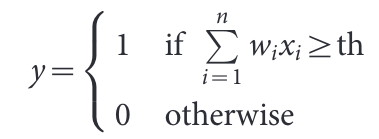
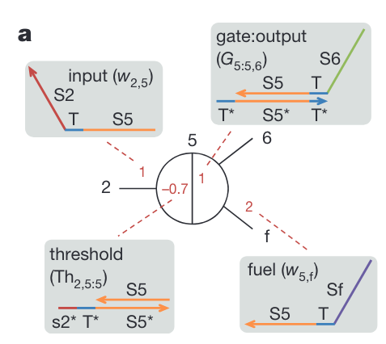
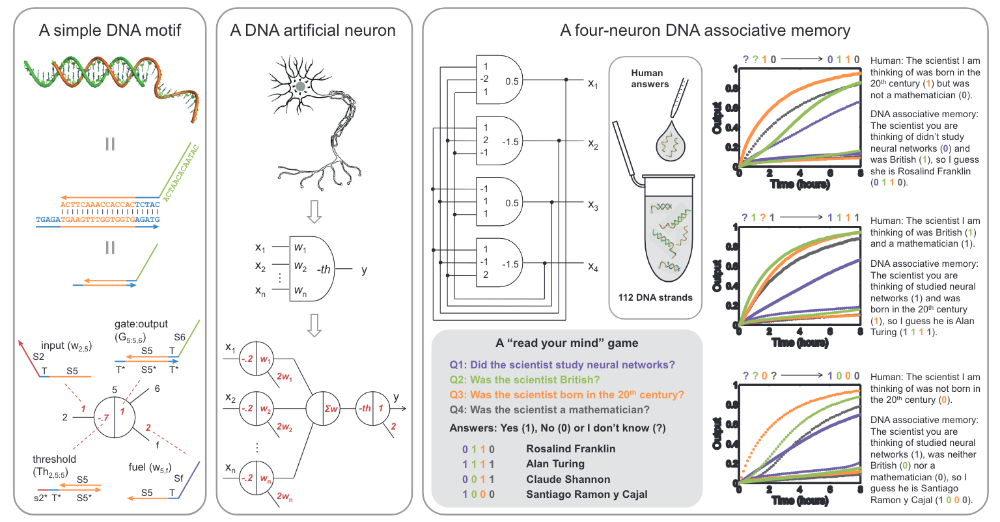

**Neural network computation with DNA strand displacement cascades**

使用DNA链置换级联进行神经网络计算

# 一

# 二

## 摘要

**背景：**

哺乳动物大脑强大的能力，包括感知、模式识别、记忆形成、决策以及运动活动控制，激发了他们在人工智能系统中广泛的再创造，如人脸识别、异常检测、医疗诊断和机器人车辆控制等1。然而，在基于神经元的大脑出现之前，复杂的生物分子回路为个体细胞提供了生存所需的"智能"行为2。

**提出问题：**

然而，对于分子如何"思考"的研究，并没有产生种类齐全的人工化学体系的计算模型及应用。尽管有学者假设生物分子系统可以进行类似神经网络的计算3,2,4，并且人工化学类似物的合成已经在理论上被提出5-9，但迄今为止的实验工作10-13仍然无法完全实现单个神经元的功能。

**解决问题：**

在这里，基于DNA计算14和链置换电路15的丰富性，我们展示了分子系统如何表现出自主的类脑行为。利用一种简单的DNA门控架构16，可以实验性地扩大多层数字电路的规模17，我们系统地将任意线性阈值电路18（一种人工神经网络模型）转化为DNA链置换级联形式的小型神经网络。

我们的方法甚至能够使用四个完全连接的人工神经元实现一个Hopfield联想记忆器19，经过计算机模拟训练后，它能够记忆四个单链DNA模式，并在呈现不完整模式时回想起最相似的模式。

我们的研究结果表明，DNA链置换级联反应可以赋予自主化学系统识别分子事件模式、作出决策和对环境作出反应的能力。

# 三

## 线性阈值电路

**神经元：**

人脑由约1011个神经元组成，每个神经元有数千个突触。每个突触可以接收来自其他神经元的信号，从而提高或降低神经元内部的电位。当电位达到阈值时，神经元就会产生脉冲（fire），并将脉冲通过轴突发送给其他神经元。

**线性阈值门：**

- 神经元最简单的数学模型是感知机，也称为线性阈值门1，18，20。一个线性阈值门有多个输入，x1、x2、...、xn，xn∊{0，1}，这可以解释为到达每个突触的一个模拟权重 w1、w2、...、wn。当所有输入的加权总和超过阈值th时，线性阈值门才会处于“开启”状态。

输出

可以解释为轴突上的放电（firing）活动。

- 线性阈值门可以用来构造多层电路，这些多层电路是布尔完备的，更重要的是，对于广泛的函数类别来说，它比 AND - OR - NOT 电路紧凑得多，这种紧凑性呈指数级增长18，21，22。循环（递归，recurrent）线性阈值电路甚至为类脑计算提供了见解，如内容可寻址的联想记忆19。

- 大脑的一个显著特点也是分子电路所需要的，那就是能够通过仅有几层甚至含有不可靠组件的网络来进行复杂计算，这个特点与线性阈值电路相似23。

我们首先介绍了简单的DNA门结构，这种结构我们称之为"跷跷板"门，我们使用这个结构来构建任意线性阈值电路。由于DNA杂交主要依赖于Watson-Crick碱基配对逻辑，因此可以选择创建相同分子构型（motif），但为每个逻辑结构域分配不同的序列选择，来创建许多实例。跷跷板门模体（motif）的抽象图（图1a）提供了一个完整的DNA实现的简洁表示，并且这个抽象图可以系统地转化为域级别，然后转化为序列级别，最后转化为分子级别（图S1）。

- 图1a：一个跷跷板门模体的抽象图及其DNA实现。
  - 黑色数字表示每个节点 (或者在更大的网络中与该节点的接口) 。
  - 红色数的位置和符号表示不同的DNA种类，而它们的绝对值表示初始相对浓度。
  - 在门中，每个物种都有特定的角色（例如，作为输入），并且在网络中具有唯一的名称（例如w2,5）。
  - 彩色线条表示域级别上的DNA链，箭头标记其3'端，颜色表示不同的DNA子序列。
  - S2、S5、S6和Sf是长的识别域。T是一个短的toehold域。T*是T的Watson-Crick补体，以此类推。s2\*是S2\*从第39位开始的前几个核苷酸。

- 图S1：利用DNA链置换级联进行神经网络计算的综述。
  - **左面板：**一个跷跷板的DNA模体，以线和节点的抽象图。这个抽象图提供了一个完整的DNA实现的简洁表示，并且这个抽象图可以系统地转化为域级别，然后转化为序列级别，最后转化为分子级别。跷跷板模体在理论上足以实现各种模拟和数字电路1，并且已经在多层的AND-OR-NOT电路中得到了实验验证2。
  - **中间面板：**用简单的DNA模体构建了一个人工神经元。Seesaw网络被重新配置以捕获神经元行为的基本特征。如人工神经网络模型（线性阈值门）所述，这些特征包括模拟权重、模拟求和、可调节的阈值和任意的扇入扇出程度。一个n输入的线性阈值门可以通过一个具有n + 2个节点的跷跷板网络系统地实现。
  - **右面板：**采用循环线性阈值电路构建的四神经元Hopfield联想记忆。它被训练用于记住四种模式，并在引入一组单链DNA分子表示的不完整模式后回忆最相似的模式。训练是在计算机上进行的，以确定权值和阈值的值，然后用这些数值来确定构成记忆的 72 个 DNA 物种的浓度。原则上，记忆可以被训练为：记住大约500组不同的模式集合中的任意一个。
  - 传统的Hopfiled联想记忆的每个神经元有两种状态：ON（“1”）和OFF（“0”），与传统的Hopfiled联想记忆不同，我们使用了一种双轨单调模型，允许两种额外的状态：未知（“?”）和无效（“x”），这导致了新的特性，比如识别一个 与任何一个记忆模式都不兼容 的模式。
  - 我们在一个名为“读心术”的游戏中展示了Hopfield记忆，这个游戏是在人类与试管中的4-神经元（four-neuron）DNA联想记忆之间进行的。人类设想出一个科学家，通过向试管中添加相应的DNA链，“告诉”DNA联想记忆问题Q1到Q4的一些答案。DNA联想记忆会“猜测”人类脑中的人物，并通过荧光信号“告诉”人类其余的答案。
  - 实验数据可以被巧妙地解释为具体的"对话"。
  - 跷跷板结构具有简单性，即所有组件都比具有单链尾部的双链DNA更简单，所有反应也没有比“来回移动”（ back-and-forth movement ）更复杂，这种简单性提供了一种一致性，而这种一致性可能是提高电路复杂性所必需的。这一点通过半定量地再现所有实验数据的建模和模拟得到了极大的证实。
  - 以前实现DNA神经网络的尝试主要使用基于杂交的DNA电路技术，即将DNA作为“静态积木”，需要手动进行实验步骤的组装、拆卸和处理。
  - 相比之下，我们的方法利用了基于链置换的DNA电路，其中DNA被用作 "动态积木"，在单个反应容器内执行自主的、可编程的任务。通过提供一种通用的结构来实现任意电路的一次性线性阈值门，并通过展示几个前馈和循环神经网络电路，我们已经证明了极其简单的DNA链置换机制足以使化学系统具备识别模式和做出智能决策的能力。

