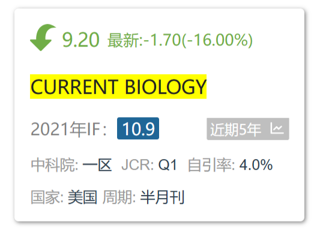
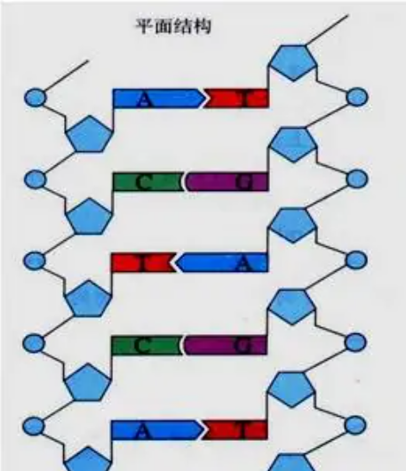
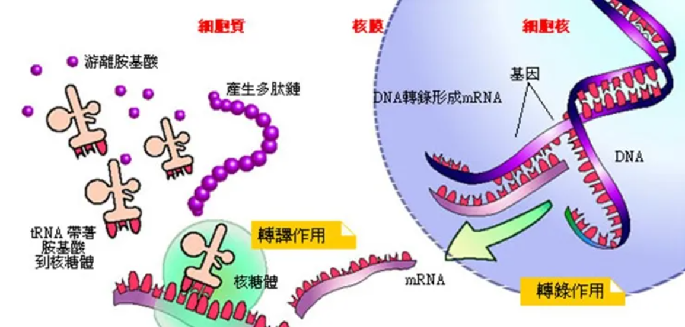
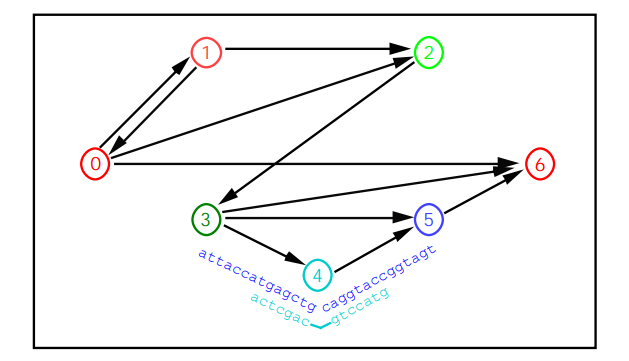
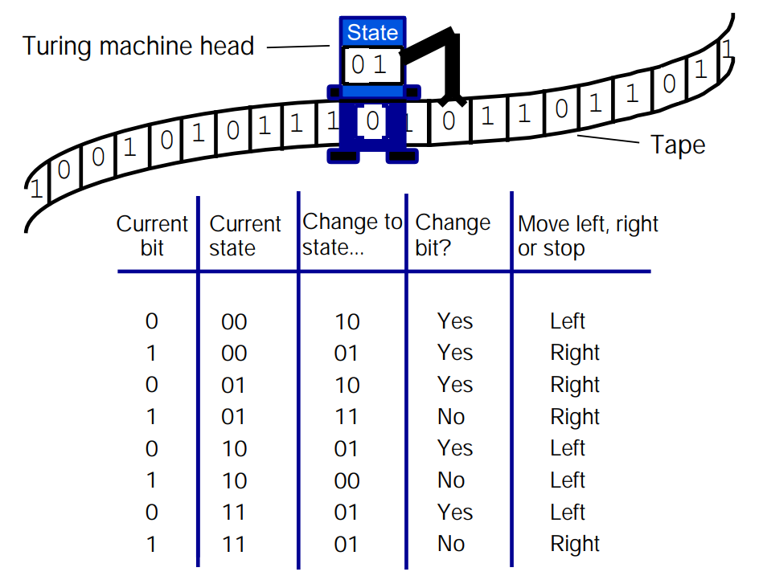
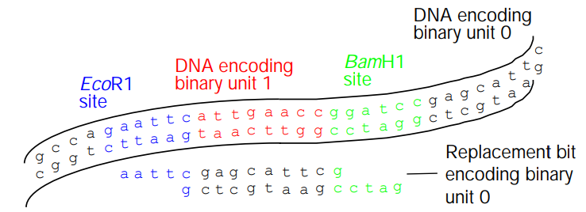

# 一、文章简介

# 二、文章内容

## 1、引言（Introduction）

The demonstration that DNA molecules can act as parallel processors to solve hard problems has excited interest in the possibility of developing molecular computers based on recombinant DNA techniques.

DNA 分子可以作为并行处理器来解决难题，这一证明激发了人们对基于 DNA 重组技术开发分子计算机可能性的兴趣。

**背景 1：**DNA分子可以充当[并行处理器](#并行处理器)来解决难题的证明

- 主要是DNA分子可以用来解决计算难题

**背景 2：**激发了人们对开发基于[重组DNA技术](#重组DNA技术)的[分子计算机](#分子计算机)的可能性的兴趣。

- 主要是DNA分子可以作为分子计算机

<u>**DNA分子：**</u>

- <u>DNA，Deoxyrido Nucleic Acid，其基本组成单位是deoxynucleotide，脱氧核苷酸</u>

  

- <u>deoxynucleotide由碱基、脱氧核糖、磷酸 (H3PO4) 组成</u>

  

- <u>碱基，又称含氮碱基，是形成核苷（酸）的含氮化合物。碱基可以形成碱基对，且彼此堆叠，因此，它们是长链螺旋结构，例如脱氧核糖核酸（DNA）的重要组成部分。嘌呤：A、G，嘧啶：C、T（DNA）、U（RNA）。A-T（2个氢键）和 C-G（3个氢键）配对。DNA的碱基互补配对过程本质是个自发的热力学平衡过程，形成的双链DNA长度越长，热力学能越低，也就越稳定。</u>

## 2、正文

**正文分为了两个方向说明：**

- 1、第一部分：使用分子生物学技术来解决计算上 “困难” 的问题
- 2、第二部分：开发分子计算机（DNA作为图灵机）

### 第一部分

**提出一个问题：**

- 在DNA序列中编码蛋白质功能的算法有简明性，且生物有机体有强大的灵活性和适应性

  - <u>**DNA编码蛋白质：**（mRNA作为翻译的模板；tRNA作为携带氨基酸的运输工具，上面有反密码子，和mRNA上的密码子可以互补配对；rRNA和蛋白质构成核糖体，而翻译的场所就是核糖体）</u>

- 计算机具有非凡的信息存储能力和解决问题的速度
- 自然地想到将二者结合起来：
  - 神经网络、遗传算法和细胞自动机都已经在计算机中展现生物系统的优势
  - 但是，在生物体中实现计算机的计算速度仍然是无法实现的，即使机器代码的二进制逻辑表面上与碱基配对的四元逻辑相似

<u>**神经网络：**不是指动物或者人的神经网络，而是为计算机量身定制的神经系统。它是一种模仿生物的神经网络或者是动物的神经中枢，特别是大脑的结构和功能，它是一种数学模型或者是计算机模型。它由大量的人工神经元联结进行计算，大多数情况下，人工神经网络能在外接的信息基础上改变内部结构，是一种自己逐渐适应的过程。现代神经网络是一种基于传统统计学建模的工具，常用来对输入和输出间复杂的关系进行建模或来探索数据间的模式。</u>

<u>**遗传算法：**（Genetic Algorithm，GA）是根据大自然中生物体进化规律而设计提出的。是模拟达尔文生物进化论的自然选择和遗传学机理的生物进化过程的计算模型，是一种通过模拟自然进化过程搜索最优解的方法。该算法通过数学的方式,利用计算机仿真运算,将问题的求解过程转换成类似生物进化中的染色体基因的交叉、变异等过程。在求解较为复杂的组合优化问题时,相对一些常规的优化算法,通常能够较快地获得较好的优化结果。遗传算法已被人们广泛地应用于组合优化、机器学习、信号处理、自适应控制和人工生命等领域。</u>

<u>**细胞自动机：**（CA）是一种离散动态系统，在简单的局部规则基础上表现出复杂的行为。细胞自动机是一个自动机（单元）阵列，其中一个单元的输入是附近单元的当前状态。假设细胞的状态只受其当前状态和相邻细胞状态的影响。根据此想法，假设最开始你有一个初始的细胞群，且每个细胞都有一个初始状态，然后你让这个细胞群进行分裂。当时间为t时，你获得了所有细胞的位置和状态；然后运用规则，根据每个细胞的当前状态和相邻细胞的状态推测出此细胞的状态。当时间为t+1时，所有细胞都能按照相同的规则改变其状态。</u>

**问题的解决：**

**并行计算与哈密顿路径**

- 1994年末， Leonard Adleman发表了一篇论文[1]，他展示了如何使用分子生物学技术来解决计算上“困难”的问题。具有代表性的是那些需要暴力地列举或判定所有可能的答案的计算问题
- 传统计算机虽然能很容易地在有限的步骤中顺序推导出答案，但是当要求对数十亿个可能的答案进行采样和重新采样时，它们就会变得极其缓慢

<u>**数据采样：**指的是从已有的数据中按照一定的规则抽取部分数据进行分析</u>

<u>**数据重新采样：**指的是在原有的数据中增加或减少采样点数量，以改变数据的分布和精度。</u>

- 相比之下，分子可以在仅受扩散限制的时间范围内，从极其复杂的混合物中挑选出相容的化学表面

<u>**扩散限制：**当扩散的速率小于化学反应的速率或化学反应的速率被扩散速率所限制的现象</u>

<u>**相容的化学表面：**（相容的化学界面），相与相之间的交界面指两相间的接触表面。如固-固、液-液、固-气等等。界面化学相容性是指界面上不同分子之间不会产生化学反应，在界面上两相是达到相平衡的关系的，即稳定</u>

- 也就是说，对传统计算机来说的大规模计算问题， 在 “分子计算机”中，如果进行适当编码，就可能实现并行地执行数十亿个计算操作

Adelman[1]解决了所谓的哈密顿路径问题，其任务是通过一个有向图找到一条路径，该路径在定义的节点开始和结束，并且访问每个节点一次

在每个节点之间的许多可能的路径中，从0开始，到6结束，唯一正确地解决哈密顿路径问题的是：0→1→2→3→4→5→6。

**实验综述：**

1、Adleman使用一些分子生物学的基本工具来确定一条七节点哈密顿路径

- 寡核苷酸：指短的DNA或RNA分子，是一类只有20个及以下碱基对的短链（可以是DNA或RNA），寡核苷酸可以很容易地和它们的互补对链接，所以常用来作为探针确定DNA或RNA的结构，可以作为合成DNA的引物，经常用于基因芯片、电泳、荧光原位杂交等过程中。

  - <u>**探针：**简单说DNA探针就是一段带有标记的DNA片段。这个标记可以是，也可以是荧光标记。</u>
  - <u>**引物：**是指在核苷酸聚合作用起始时，起刺激作用的的，一种具有特定核苷酸序列的大分子，与反应物以氢键形式连接，这样的分子称为引物。引物通常是人工合成的两段寡核苷酸序列，一个引物与靶区域一端的一条DNA模板链互补，另一个引物与靶区域另一端的另一条DNA模板链互补，其功能是作为核苷酸聚合作用的起始点，核酸聚合酶可由其3'端开始合成新的核酸链。体外人工设计的引物被广泛用于聚合酶链反应、测序和探针合成等</u>
- 聚合酶链反应(PCR)：
  - PCR的原理是DNA半保留复制
  - PCR是一种用于放大扩增特定的DNA片段的分子生物学技术，它可看作是生物体外的特殊DNA复制，PCR的最大特点是能将微量的DNA大幅增加。因此，无论是化石中的古生物、历史人物的残骸，还是几十年前凶杀案中凶手所遗留的毛发、皮肤或血液，只要能分离出一丁点的DNA，就能用PCR加以放大，进行比对
  - PCR是利用DNA在体外摄氏95°高温时变性会变成单链，低温（经常是60°C左右）时引物与单链按碱基互补配对的原则结合，再调温度至DNA聚合酶最适反应温度（72°C左右），DNA聚合酶沿着磷酸到五碳糖 (5'-3'、DNA复制只能5'到3') 的方向合成互补链。基于聚合酶制造的PCR仪实际就是一个温控设备，能在变性温度，复性温度，延伸温度之间很好地进行控制
- 亲和纯化（亲和层析法纯化）：是一种通过分子间的特异性识别和相互作用来分离纯化物质的层析方法。如酶与底物、抗原和抗体之间专一的相互作用等。将其一作为配基固定在填料上，就可以从初始样品中吸附相应的生物分子，然后通过合适的洗脱将其解离达到纯化的目的。

2、每个节点由一个20碱基的DNA寡核苷酸表示，节点之间的路线由一个节点的5 '端和另一个节点的3 '端互补的DNA寡核苷酸表示。

3、当所有的节点和路径寡核苷酸混合在一起时，它们被退火，形成不同长度的双链dna。每个双链DNA片段勾勒出一条特定的路径(不一定是哈密顿的)。

4、然后每条路径的寡核苷酸被退火，连接在一起以便 “固定” 。通过使用与这些节点对应(或互补)的寡核苷酸作为PCR引物，从混合物中扩增出开始和结束于特定节点的路径。

- <u>**退火(anneal)：**DNA由单链复性、变成双链结构的过程。来源相同的DNA单链经退火后完全恢复双链结构的过程，同源DNA之间、DNA和RNA之间，退火后形成杂交分子。</u>

**总结：**

Adleman将节点之间的路径编码为随机寡聚物，并将节点本身编码为一条路径的一半的3′补和和下一条路径的一半的5′补。

这些路径(深蓝色)与节点（如节点4）(浅蓝色)夹在一起。

这种贯穿整个图的 “夹合” 允许对哈密顿路径问题的正确解决方案进行双链DNA编码

**实验结果验证（哪些是哈密顿路径）：**

- 首先，由于选择的路径应该包含所有的节点，只有至少与所有节点串在一起的寡核苷酸才能从琼脂糖凝胶中洗脱出来
  - <u>**琼脂糖凝胶电泳：**用于根据核酸（DNA或RNA）片段的大小进行分离，是用琼脂或琼脂糖作支持介质的一种电泳方法。对于分子量较大的样品，如大分子核酸、病毒等，一般可采用孔径较大的琼脂糖凝胶进行电泳分离。琼脂糖凝胶电泳是用于分离、鉴定和提纯DNA片段的标准方法。</u>
  - <u>**琼脂糖：**是从琼脂中提取的一种多糖，具亲水性，但不带电荷，是一种很好的电泳支持物。</u>
- 其次，哈密顿路径应该包含每个节点：与每个不同节点互补的寡核苷酸被附加到亲和列上，并用于依次分离包含每个节点的正确长度的路径。例如，利用节点1的补体分离含有节点1的寡核苷酸
- 然后，将这些路径传递给包含节点2补集的列，依此类推。将节点0作为一个引物，将节点0的互补物依次作为另一个引物，进行PCR反应，最终验证了哈密顿路径
- 由于在人造图上只有一条独特的哈密顿路径，因此只有全长连接的寡核苷酸产生可预测大小的PCR产物。即“节点0 +节点1补体”的PCR引物得到大小为0→1的片段，“节点0 +节点2补体”的PCR引物得到大小为0→1→2的片段，以此类推

**新的问题：**

- Adleman的实验使用的方法对于解决更大的问题可能是不切实际的。
- Lineal和Lineal[2]：随着顶点数量的增加，解决哈密顿通路问题的复杂性呈指数级增加。对于长度为20的节点，一个“n”节点通路将需要大约20n(logn)n个碱基对的输入。例如，比Adleman的路径大一个数量级 (70个节点) 的路径将需要“实验中涉及的核苷酸的总质量达到1025公斤DNA
- Stemmer[3]：即使使用递归方法来减少所需的DNA数量，也可能会牺牲溶液的准确性，其他资源也有限
- Lo, Yiu和Wong[4]：25个节点的路径需要大量的酶，并且不可能通过琼脂糖凝胶电泳进行分析
- 易出错的生物学和无差错计算之间固有的不协调[5]：
  - 使用PCR再生路径存在潜在的困难，因为扩增中使用的聚合酶的保真度不是绝对的。同样，引物和路径退火强烈依赖于反应条件，如温度、pH值和反应体积，这些条件可能因实验而异
    - <u> **DNA聚合酶的保真度：**是指准确复制目的模板的结果</u>
  - 这些缺陷可能会导致PCR伪影，并且这种伪影可能会超过并模糊真实答案
    - <u>**伪影 (Artifacts)：**是指原本被扫描物体并不存在而在图像上却出现的各种形态的影像。</u>
  - 最后，该系统被限制为相当短的序列，因为随着序列长度的增加，获得成功退火所需的时间也在增加。特别是这种限制，规避了大量分子并行性的固有优势

**Aldeman[6]的回应：**

- 尽管分子计算机目前在应用上是有限的，但它们仍处于“胚胎”阶段

- 随着该领域从概念化转向工程实践，研究人员必须开始解决一些重要问题：
  - 首先，分子计算机最能回答哪些问题？
  - 第二，在分子生物学家使用的众多工具中，哪一个最能促进分子计算?
  - 第三，怎样才能最好地设计分子计算机的结构?

**第一个问题的解决：**

- Richard Lipton[7]遵循Adleman实验的路径，提出了一系列基于dna计算的实验来解决计算机科学中的可满足性(SAT)问题。SAT问题的目的是找到 “与或函数方程”（AND and OR functions）的解。
  - Lipton以 **F = ( x OR y ) AND ( ¬x OR ¬y )** 为例
  - 变量 x 和 y 假设布尔值为 0 或 1（“假”或“真”）；¬x 和 ¬y 分别是 x 和 y 取反，因此当 x 为 0 时，¬x 为 1，反之亦然。问题是找到 x 和 y 的值，使整个命题F为真
  - 为了解决这个问题，Lipton提出用寡核苷酸编码二进制数字。让可满足性问题的每一可行解对应一个n位二进制数，在这里就是两位，通过构造网络Gn，将n位二进制数据池对应成网络Gn的从起点 a1到终点an+1的有向路。Adleman本质上是将寡核苷酸任意命名为节点或路线，而Lipton的方案允许对SAT问题的每个答案进行直接编码
  - 这种差异类似于具有符号结构的计算机语言与0和1的机器语言之间的差异
    - <u>**约束可满足性问题（CSP）：**由三个基本元素组成：变量集 V ={ V1 , V2 , ... , Vi }，变量的域 D = { D1 , D2 , ... , Di }，约束 C 。变量的域 D 是变量可能取值的集合，变量 V 只能在域 D 内取值，约束 C 表述了变量 V 之间必须满足的关系。求解约束问题就是在各变量的域 D 中找到一个值 S 使得各变量之间满足约束 C ，约束问题也可以表示为三元组 < V , D , C > 。</u>
    - <u>**命题逻辑可满足性问题 （Propositional Satisfiability，SAT）：**是目前研究最为广泛的一类 CSP 问题。SAT 问题是一个经典的判定问题，同样是第一个被证明为 NP 完全的问题。</u>
      - <u>首先在SAT问题中，我们一般给定一组有 n 个变量（variable）的集合 = {x1, x2, ⋯ , }</u>
      - <u>以及与其中的每一个变量相关联的2个文字（literal）组成的集合 = {x1, ¬x1, x2, ¬x2, ⋯  }，其中，对于变量而言，¬ 是负文字</u>
      - <u>子句（clause）则是由文字集合中的部分若干文字的析取（disjunction）所构成的（也就是 “或” 操作），即每个子句都可以写成 c = x1 or x2 or x3⋯的形式</u>
      - <u>然后我们通过将 m 个子句 c1 c2 c3... cn 用与（and）的形式进行合取，这样我们就很容易的构成了一个合取范式（Conjunctive Normal Form，CNF）形式的命题公式 F，即 F = c1 and c2 and ⋯ and cm</u>
      - <u>显而易见，公式 中的任意一个子句都处于下列两种状态之一：满足（satisfied）状态或者未满足（unsatisfied）状态</u>
      - <u>SAT问题也就是判断是否存在一个完整的赋值方案 ，这个赋值方案能使得F中的所有子句都能被满足（也就是所有子句都为真）</u>
- Lipton在概念上的进步可能允许直接从寡核苷酸混合物中提取SAT问题的解决方案。例如，对于上面的方程，将构建一系列寡核苷酸，其中一个位置的x值与另一个位置的y值相结合。

  - 首先，原始混合物中有四种不同的寡核苷酸，其序列对应于值(0,0)，(0,1)，(1,0）和（1,1)。为了满足SAT问题的第一条，将首先使用适当的互补寡核苷酸提取那些具有x=1或y=1的寡核苷酸。提取的寡核苷酸将包括编码值为（0,1)、(1,0）和（1,1）的寡核苷酸。

  - 从这个集合中，提取那些满足SAT问题第二条的寡核苷酸 ¬x=1或 ¬y=1的序列。最终选择的集合将只包括编码值为 ( 0,1 ) 和 ( 1,0 ) 的寡核苷酸。

  - 这些是这个特定SAT问题的正确答案。更一般地说，答案取决于特定DNA位置上特定DNA编码是否存在。因此，在构造了所有可能的编码路径池之后，就可以简单地提取出符合方程条件的序列
- 与哈密顿路径问题一样，计算机需要通过迭代地搜索大量可能的答案来解决SAT问题，相比之下，分子计算机的大规模并行特性可能会加速这类问题的解决。

  - 解决SAT的最佳方法需要测试2n个可能的解决方案，其中n是变量的数量 ( 在上面的例子中，n = 2 )
  - 相比之下，分子计算机可以通过一些运算来解决这些问题，并且这些运算随着n的增加呈线性 ( 而不是指数 ) 增长
  - 为了满足SAT问题方程的第一部分，比如上面的方程，你可以提取所有在第一个位置上有1(代表“真”)的路径；然后，您可以进一步从该管中提取在第二个位置具有所需编码的成员，以此类推。
- 尽管DNA计算机还没有解决真正的SAT问题，但这一概念上的突破可以让解集呈指数级扩展的问题 ( “np完全” 问题 ) 得到尝试

  - 例如，Lipton及其同事[8]提出了一种“破解”数据加密标准的方案，该标准是银行和军事保密代码的算法基础，该方案依赖于这样一个事实，即通过传统计算方法破解np完全问题需要的计算资源太大而不实用。
- 当然，Lipton的实验仍然面临着现实世界中那些同样限制了Adleman实验的困难

### 第二部分

**DNA作为图灵机**

**提出问题：**

- Adleman和Lipton的 “计算机” 在传统意义上都不是可编程的，因为它们不能解决任何存在可编程算法的问题[9]。
- 虽然为一个哈密顿路径问题产生的DNA寡核苷酸可以潜在地用于解决类似的哈密顿路径问题，但是它们的通用性存在限制。
- 如何DNA用来编码为图灵机，以扩展比特和碱基之间的等价性？

**问题的解决：**

DNA作为图灵机

- 图灵机：
  - 图灵机是最简单的可编程通用计算模型，可以用三个基本组件来描述：
    - 无限信息磁带
    - 访问(读写)磁带的磁头
    - 以及根据有限规则集(转换表)做出确定性决策的控制器
  - 磁带本质上是一系列存储位，每个存储表示一组定义的符号的单个信息
  - 磁头每次位于一个内存位置上，读取内存位置中的内容，并执行复杂的操作
  - 磁头根据控制器中的一组指令，编辑存储器位置中的信息、向左或向右移动、或停止，取决于控制器的状态
  - 在每次操作期间，控制器的状态以一种确定的方式改变，这取决于从存储器中读取的是哪个符号以及磁头的当前状态
  - 对于每个存储器位置和控制器状态，转换表编码一个特定的操作，该操作指示磁头改变磁带符号，改变控制器状态，然后移动到相邻的存储器位置或停止

**几种可能的实现：**

特定的限制性酶切位点围绕着一个二进制编码的寡聚物，可以用适当的限制性酶切除，然后用一个含有互补的粘性末端和一个改变的内部二进制单元的片段来代替。

<u>**DNA encoding binary unit 0/1：**DNA编码二进制单元，也就是这段DNA被编码为二进制的0或1</u>

<u>**Replacement bit encoding binary unit 0 ：**替换位编码二进制单元，利用酶切将红色这一段替换为黑色这一段就实现编码</u>

<u>**BamH1、EcoR1：**常见的限制性核酸内切酶</u>

- <u>生物体内能识别并切割特异的双链DNA序列的一种内切核酸酶。它是可以将外来的DNA切断的酶，即能够限制异源DNA的侵入并使之失去活力，但对自己的DNA却无损害作用，这样可以保护细胞原有的遗传信息。由于这种切割作用是在DNA分子内部进行的，故名限制性内切酶（简称限制酶）。</u>
- <u>限制性内切酶能特异地结合于一段被称为限制性酶识别序列的DNA序列之内或其附近的特异位点上，并切割双链DNA。</u>
- <u>绝大多数Ⅱ类限制酶围是识别长度为4至6个核苷酸的回文对称特异核苷酸序列（如EcoRⅠ识别六个核苷酸序列：5'- G↓AATTC-3'），有少数酶识别更长的序列或简并序列。</u>
- <u>Ⅱ类酶切割位点在识别序列中，有的在对称轴处切割，产生平末端的DNA片段（如SmaⅠ：5'-CCC↓GGG-3'）；有的切割位点在对称轴一侧，产生带有单链突出末端的DNA片段称粘性末端，如EcoRⅠ切割识别序列后产生两个互补的粘性末端。</u>

<u>**site：**酶切位点</u>

- Beaver[10]指出：文本的识别、删除和插入可以通过DNA定点突变来实现，并可用于使DNA分子充当图灵机。
  - <u>**定点突变：**是指通过聚合酶链式反应（PCR）等方法向目的DNA片段（可以是基因组，也可以是质粒）中引入所需变化（通常是表征有利方向的变化），包括碱基的添加、删除、点突变等。定点突变能迅速、高效的提高DNA所表达的目的蛋白的性状及表征，是基因研究工作中一种非常有用的手段。</u>
- Rothemund[9]描述了一种DNA图灵机，它可以通过识别和改变DNA序列中的单个碱基来运行，这可以用现有的限制性内切酶来实现
  - 他的方案使用DNA序列 ( 而不是单个碱基 ) 来编码符号，识别位点和当前符号之间的间距编码图灵机读写头的状态。
- Winfree[11]描述了一种基于寡核苷酸自组装网络的空间图灵机
  - 他的观点是，具有两个不同末端的寡核苷酸将倾向于与其他互补的寡核苷酸结合
  - 用一小部分双端寡核苷酸末端之间的结合亲和力表示一组逻辑操作
  - 固定在表面上的一系列寡核苷酸将代表数据存储器和程序存储器的初始组合
  - 通过允许溶液中的寡核苷酸结合到这个初始组合的第一行，然后结合到第二行，依此类推，来执行给定的程序。
  - 退火寡核苷酸网络相当于并行计算中每一步的完整记录，如Adleman和Lipton给出的例子。

**存在的问题：**

- 从实际的角度来看，DNA图灵机和Adleman的方案存在一些相同的问题：需要大量的材料来编码存储器位置、控制器状态和过渡表。

- 此外，DNA图灵机至少部分是串联的，而不是完全并行的，这就消除了DNA计算机的一些潜在优势
- 与更专业的机器和算法相比，电子图灵机本质上是低效的，但与它们相对应的DNA图灵机很可能还要更慢
- 尽管分子计算机可能允许计算时间随问题规模呈线性而不是指数增长，但它们也可能将固定的机器体积换成巨大的液体体积。
  - 例如，Rothemund[9]估计，他的图灵机版本将需要数公斤的DNA，其流体存储器体积大约是奥林匹克游泳池体积的十分之一

## 3、结语

**举例说明应用价值或意义：**

在DNA中嵌入逻辑元素将刺激分子生物学家和计算机科学家产生新的更好的想法，并重新审视什么是计算（或者说什么元素定义了计算）

- Bunow[12]和Reif[5]指出：体外进化技术[13]是一种计算形式，其中约有1013个DNA或RNA分子同时被筛选以获得某些配件结合或催化活性。
  - <u>**体外进化技术：**DNA改组是目前最方便、有效的一种分子水平的体外定向进化技术</u>
    - <u>DNA改组实际上是依赖于PCR的体外诱变技术</u>
    - <u>它是将单个基因或相关基因家族的靶序列通过物理或化学方法随机片段化，由于这些小片段之间具有一定的同源性，通过无引物PCR和有引物PCR组装成全长的嵌合体基因即嵌合体文库</u>
    - <u>然后对嵌合体文库进行高通量或超高通量的筛选，选择具有改进功能或全新功能的突变体作为下轮DNA改组的模板</u>
    - <u>重复上述步骤，进行多轮改组和高通量的筛选，直到获得理想的突变体</u>
- 生物学家自己可能不会提出上述说法

**今后发展的主要问题：**

- 真正的问题在于技术方面
- Smith[14]指出：

  - 在开发现实的分子计算模型方面，“实际的实验室中，属于生物化学类型的，严重不足”。
- 分子生物学家必须专注于确定哪些系统最适合分子计算，以及哪些计算最适合分子或生物体。
  - 例如，可以在质粒或其他载体中编码简单的逻辑元素，例如二进制计数器或有限转换表（有限跃迁表）。然后，这些载体将根据他们所看到的环境以及这些环境如何修改编码的逻辑元素，来决定是打开还是关闭基因。
- 这种方案与生物学已经用于调节基因表达的方案没有太大区别，但其优势在于，它们可以被编程，用于独特的生物技术中。

- <u>**载体：**</u>

  - <u>把一个目的基因通过基因工程手段送到生物细胞（受体细胞），需要运载工具（交通工具）携带外源基因进入受体细胞，这种运载工具就叫做载体（vector）</u>

  - <u>基因工程上所用的载体是一类能自我复制的DNA分子，其中的一段DNA被切除而不影响其复制，可用以置换或插入外源(目的) DNA而将目的DNA带入宿主细胞。常用的载体有质粒、噬菌体、病毒等</u>

**展望：**分子计算领域有许多问题，但未来充满希望，随着分子生物学家和计算机科学家之间的合作不断发展，他们所创造的科学也将不断发展

## 4、参考文献

1. Adleman LM: Molecular computation of solutions to combinatorial problems. Science 1994, 266:1021–1024.
2. Linial M, Linial N: On the potential of molecular computing.Science 1995, 268:481. 
3. Stemmer WPC: The evolution of molecular computation.Science 1995, 270:1510. 
4. Lo YMD, Yiu KFC, Wong SL: On the potential of molecular computing. Science 1995, 268: 482. 
5. Reif JH: Parallel molecular computation: models and simulations. Available at: http://www.cs.duke.edu/reif.HomePage.html. 
6. Adleman LM: On the potential of molecular computing.Science 1995, 268:483–484  
7. Lipton RJ: DNA solution of hard computational problems.Science 1995, 268:542—545. 
8. Boneh D, Dunworth C, Lipton R: Breaking DES using a molecular computer. Available at: http://www.CS.Princeton.EDU/dabo.biocomp.html. 
9.   Rothemund PWK: A DNA and restriction enzyme implementation of Turing Machines. Available at: http://www.ugcs.caltech.edu/~pwkr/oett.html
10. Beaver D: Molecular computing. available at: http://www.cse.psu.edu/~beaver/publications/tm.ps.z. 
11. Winfree E: On the computational power of DNA annealing and ligation. Available at http://dope.caltech.edu/winfree/papers/ligation.ps. 
12. Bunow B: On the potential of molecular computing.Science 1995, 268:482–483. 
13. Bartel DP, Szostak JW: Isolation of new ribozymes from a large pool of random sequences. Science 1993: 261:1411–1418  
14. Smith WD: Summary of the Mini DIMACS workshop on DNA-based computers. Available at: http://www.neci..nj.nec.com/homepages/smith/workshop.summary.ps

# 三、基础扩充

## 并行处理器

parallel processors，在同一个时刻，存在两个以上任务在同时运行

## 重组DNA技术

基因工程、基因拼接技术、DNA重组技术；将不同来源的基因按预先设计的蓝图，在体外构建杂种DNA分子，然后导入活细胞，以改变生物原有的遗传特性、获得新品种、生产新产品的遗传技术。</u>

**重组DNA技术（或称基因工程）相关概念：**

- **DNA克隆：**用分离纯化或人工合成的DNA在体外与载体DNA结合，成为重组DNA（复制子），用以转化宿主（细菌或其它细胞），筛选出能表达重组DNA的活细胞，加以纯化、传代、扩增，成为克隆（clone）。因此，基因工程也称为基因克隆（gene cloning）或重组DNA
- **工具酶：**在重组DNA技术中，常需要一些基本工具酶进行基因操作
- **目的基因：**需要特异表达的特定的DNA片段
- **载体：**能把目的基因能运载到宿主细胞内，并能进行表达的DNA片段
- **限制性核酸内切酶(restriction endonuclease, RE)：**是识别DNA的特异序列, 并在识别位点或其周围切割双链DNA的一类内切酶

## 分子计算机

利用分子能进行信息的处理且计算的能力制造而成的计算机

