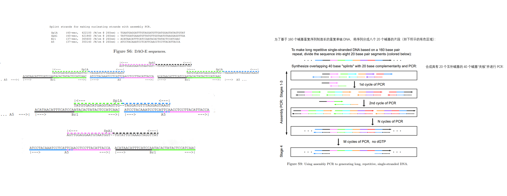
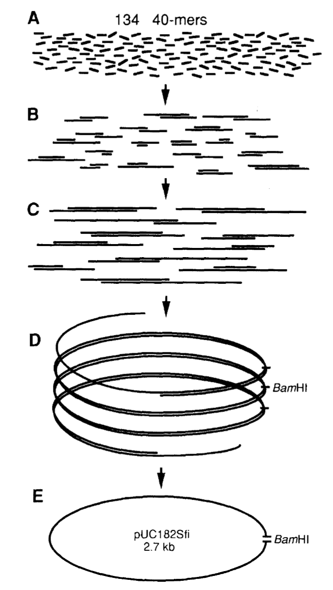
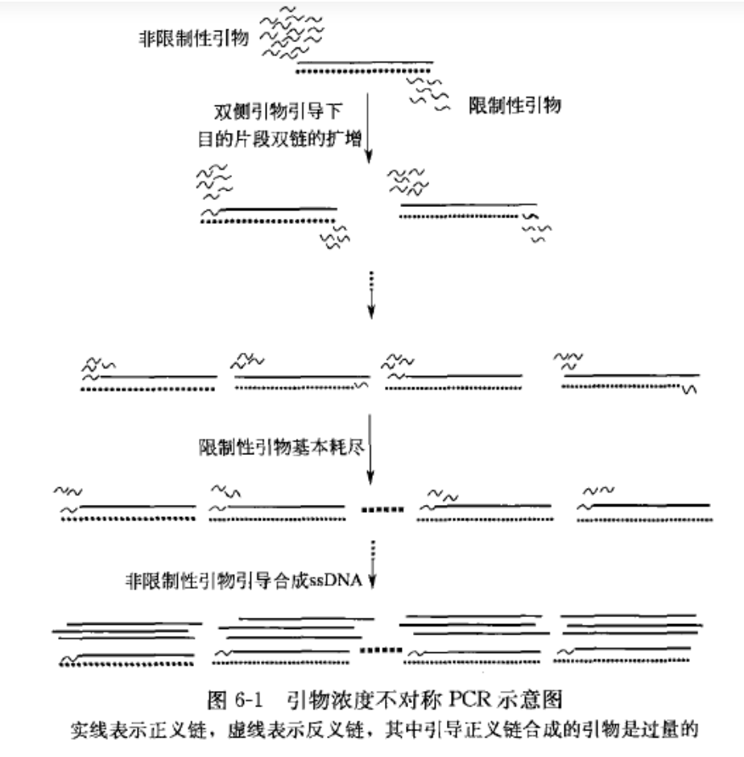

Assembly PCR

1、Algorithmic Self-Assembly of DNA Sierpinski Triangles（前三阶段是组装PCR，第四阶段是不对称PCR）

- 在第1阶段中，制备一个20μl的反应混合液，其中含有1 pmol的弥散链，不含聚合酶 --> Mix A

  - Mix A : 每20μl含1μl的1μM混合弥散链，每个1 / N μM;1.6μl的10mM dNTPs，每个2.5mM; 1μl的25mM乙酸镁，6μl的3.3X GeneAMP XL PCR缓冲液; 10μl水

  - 为避免错误引物事件，将弥散链在反应混合物中37℃退火5min。加入聚合酶（0.4μl），反应进行初始的72℃延伸步骤，随后进行40个循环（94℃ 15s，40℃ 30s，72℃ 10s + 1s /循环;约2小时）。
- 在第2阶段，向第一反应体中添加40μl的新PCR Mix B

  - Mix B : Mix A减去弥散链（退火），加入0.4μl聚合酶，水调整为20μl，并进行额外的25个循环（94℃15s，40℃30s，72℃45s + 1s /循环;约1.5小时）。
- 在第3阶段，将60μl的反应体积分成三个20μl的体积，向每个反应物中添加额外的40μl Mix B，并进行额外的20个循环（94℃15s，40℃30s，72℃70s + 1s /循环;约1.3小时）。

  - 用琼脂糖凝胶观察，此时应该形成长的双链产物。

  - 此外，混合物中的dNTPs可能几乎用完了，具体来说，几乎没有剩余的dGTP。（任何剩余的dGTP将在第4阶段早期用完。）
- 在第4阶段中，为了创建单链核心链，将第3阶段产物的5μl与55μl的新PCR混合物 Mix C 混合

  - Mix C : Mix B加上1.6μl的混合物，其中包含2.5mM的每个dATP，dCTP和dTTP，而不是所有四个dNTPs
  - 进行额外的60个阶段3程序循环（94℃15s，40℃30s，72℃70s + 1s /循环）。尽管在此阶段加入不对称引物可能会产生更多的单链产物，但即使不这样做，也可以得到令人满意的单链产物收率。

2、 Single-step assembly of a gene and entire plasmid from large numbers of oligodeeoxyribonucleotides

3、Web

**Polymerase cycling assembly** (or **PCA** , or **Polymerase chain assembly** , also known as **Assembly PCR**)：

在聚合酶循环过程中，寡核苷酸与互补的片段结合，然后被聚合酶填充。

因此，每个循环随机地增加各种片段的长度，取决于哪些寡核苷酸会结合。关键是所有片段都有某种方式的互补性，否则最终的完整序列将无法产生，因为聚合酶需要依据模板。

在这个初始构建阶段之后，添加涵盖两端的额外引物以执行常规PCR反应，将目标序列扩增到所有较短的不完整片段之外。然后可以使用凝胶纯化来识别和分离完整的序列。

**不对称PCR（Asymmetric PCR）**：

不对称PCR，可选择性的扩增出靶DNA的一条链，从而用于测序反应或制备单链杂交探针。反应中限制一个引物的加入量，随着这一引物的用尽，后续的扩增中另一引物延伸的产物量大大过量。这一技术的关键是使用的限制引物的量要合适，引物量过多，则产物主要是双链DNA；引物量过少，在前几轮循环就被耗尽，结果导致单链的产量减少。在不对称PCR的基础上发展出Linear-After-The-Exponential-PCR (LATE-PCR，线性指数PCR)，使数量限制的引物比过量的引物的解链温度更高，从而维持较高的反应效率。

引物浓度不对称 PCR 的基本原理是通过不等量的一对寡核苷酸引物引导扩增得到大量单链 DNA 的反应，在不对称 PCR 中限制性引物与非限制性引物在每一反应中的摩尔物质的量浓度相差悬殊，其最佳比例一般是 1 : 50~1 : 100，关键是限制性引物的绝对量。在扩增反应的开始 10~15 个循环中，两引物都与模板发生退火，引导 DNA 链的合成，所以全部产物都是双链 DNA, 而且几乎是以指数速率扩增，在 12~15 个循环以后，其中的限制性引物的浓度降低，甚至基本耗尽，从而制约了反应的进行，双链 DNA 的合成速率显著下降，此时非限制性引物将继续引导单链 DNA 的合成，故反应的最后阶段只产生初始 DNA 中一条链的拷贝（非限制性引物引导合成的单链），随后的合成和变性过程中仅单链产物以线性速率扩增。

**实例操作笔记：**

https://openwetware.org/wiki/Assembly_pcr

- **Introduction**

  - Assembly PCR can be used to assemble two gene-sized pieces of DNA into one piece for easier cloning of fusion genes/parts. Briefly, it essentially involves PCR'ing the two pieces separately with primers that have a 20bp overlap and then doing an extra PCR step using the two products as the template. This is essentially just for ease of cloning. Instead of trying to PCR or cut out of a vector two separate pieces and then assemble them by endonuclease digestion and ligation (aka 3-way ligation), it can be easier simply to PCR the first piece w/ a reverse primer that overlaps with the forward primer of the second piece, and then use the product of the first PCR reactions as a template for the assembly reaction. If the reverse primer for the 5' piece and the forward primer for the 3' piece overlap by ~20bp, the product of the first PCR reactions should anneal in the overlapping region and create a full length (gene fusion) product. Using the forward primer for the first piece and the reverse primer for the second piece in the assembly reaction then amplifies the desired full-length product. The merits for this technique are that it's arguably faster than standard 3-way ligation assembly (because you need good-quality DNA to make that work well, which usually means sub-cloning each piece, in my experience), and it's more reliable (the quality of the product is very good so you can clone it directly into the desired vector; in my hands, PCR assembly has worked every time I've tried it (~8times)).

- Method

  Remember, that this technique is good if: You want to assemble in series two long pieces of DNA from PCR product.

  - **\1)** Design the reverse primer for the DNA that will be 5' w/ significant overlap w/ the forward primer for the 3' piece. Essentially, as long as one of the primers has ~20bp overlap w/ the 'reverse complement' of the other primer, the products should anneal in the assembly reaction.

  - **\2)** Do PCR as normal for the two (5' and the 3') pieces using the longer primers that correspond to each piece.

  - **\3)** Check on a gel to make sure you got product from the first PCR reaction. Some people like to cut out the product band and use the purified products as template for the next reaction. I just use the PCR product straight from the first reactions w/o any purification; the logic is that the undesired primers/templates will be in such low concentrations that the intended reaction will be highly favored. Besides, if the residual "middle" primers did create product, they would just be making more starting template, which shouldn't hurt your rxn.

  - **\4)** Set up the assembly reaction like a regular PCR, except: 1) as template use equal amounts of product from the first reactions, and 2)use the Forward primer for the 5' piece and the Reverse primer for the 3' piece to amplify the annealed template. (I use 45µl of Invitrogen Taq HIFI supermix, 2µl of 5µM primer each, and 0.5µl of each PCR product as template). Cycle like you did for the first reactions, except w/ longer extension time corresponding to the length of your product.

  - **\5)** Run the product on a gel. If the reaction worked, you should see a band the size of the sum of your two templates.

  - **\6)** Purify the product (I use the Quiagen PCR pur. kit), cut w/ desired endonucleases, and clone away! The quality of the product from this reaction is usually very good and very plentyful and I can get up to >100 transformants.

  - **\7)** An arguable disadvantage of this technique, besides slightly higher up-front cost for primers, is that it requires sequencing following assembly to make sure the PCR rxn hasn't produced mutations. Use HiFi polymerase and you shouldn't really have a problem, though... but don't be lazy: you should still get your clones sequenced.

  - Also: If you already have one piece that you've cloned successfully and you want to cut out and assemble in series w/ the second piece (a PCR product), I still think it's it's easier just to do the PCR for the piece you already have cloned. For me, the assembly reaction product is well worth the cost of the extra primers (<$20) and PCR step.