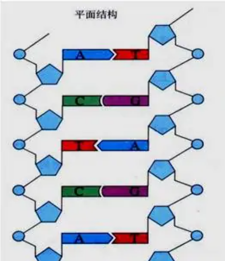
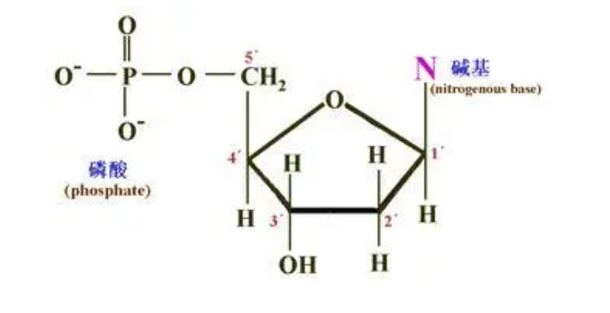
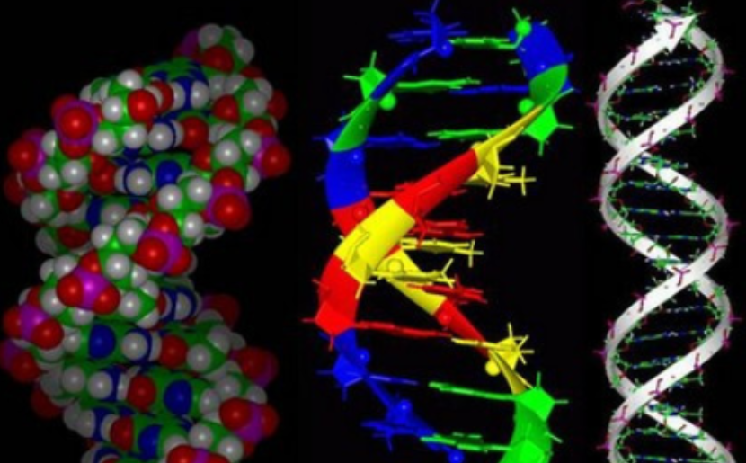
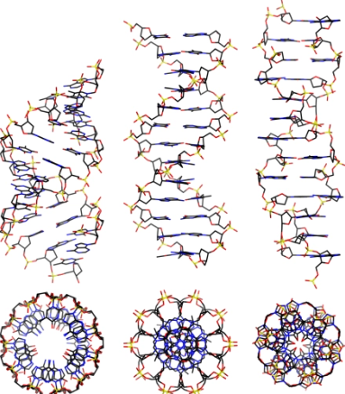

# Deoxyrido Nucleic Acid

- DNA，Deoxyrido Nucleic Acid，其基本组成单位是deoxynucleotide，脱氧核苷酸

  

- deoxynucleotide由碱基、脱氧核糖、磷酸 (H3PO4) 组成

  

- 碱基，又称含氮碱基，是形成核苷（酸）的含氮化合物。碱基可以形成碱基对，且彼此堆叠，因此，它们是长链螺旋结构，例如脱氧核糖核酸（DNA）的重要组成部分。嘌呤：A、G，嘧啶：C、T（DNA）、U（RNA）。A-T（2个氢键）和 C-G（3个氢键）配对。DNA的碱基互补配对过程本质是个自发的热力学平衡过程，形成的双链DNA长度越长，热力学能越低，也就越稳定。

- 基本数据（以B型DNA分子为例）

  

  | 名词                     | 释义          |
  | :----------------------- | ------------- |
  | Base pairs               | 碱基对        |
  | Sugar-Phosphate backbone | 糖 - 磷酸骨架 |
  | Major groove             | 大沟          |
  | Minor groove             | 小沟          |
  | one helical turn         | 一个螺旋      |
  | Helix pitch              | 螺旋螺距      |
  | Axial rise               | 轴向上升      |
  | Helix diameter           | 螺旋直径      |

- B型DNA分子

  

  - 1、DNA分子是由两条方向相反的平行多核苷酸链围绕同一中心轴构成的右手双螺旋；
  - 2、在两条链中磷酸与脱氧核糖位于螺旋外侧，碱基平面位于螺旋内侧，脱氧核糖平面与碱基平面垂直，螺旋表面形成大沟与小沟；
  - 3、双螺旋直径2nm，碱基平面与螺旋纵轴垂直，相邻碱基平面距离0．34nm，旋转夹角36°，每10个核苷酸旋转一周，螺距（相邻两螺纹之间的距离）3．4nm；
  - 4、两条核苷酸链之间通过碱基形成氢键，遵循A-T、G-C碱基互补原则；
  - 5、双螺旋结构横向稳定靠两条链之间的氢键，纵向稳定则依靠碱基平面之间的疏水性碱基堆积力。

- DNA二级结构

  - Watson和Crick提出的DNA双螺旋结构模型被称为B- DNA或B型DNA，是基于与细胞内相似的温度环境中进行X线衍射所得的分析结果，这是DNA在水性环境下和生理条件下最稳定和最普遍的结构形式。

  - 但这种结构不是一成不变的，溶液的离子强度或相对湿度的变化可以使DNA双螺旋结构的沟槽、螺距、旋转角度等发生变化。
    - 例如降低环境的相对湿度，B型DNA会发生可逆性的构象改变，被称为A型DNA。尽管两型都为右手螺旋，但A型DNA较粗，每两个相邻碱基对平面之间的距离为0. 26 nm，每圈螺旋结构含有11个碱基对，双螺旋结构的直径为2. 55 nm，而且比B型DNA的刚性强。
    - 1979年，美国科学家A·Rich等在研究人工合成的CGCGCG晶体结构时，发现这种DNA具有左手螺旋（left-handed helix）的结构特征。后来证明这种结构在天然DNA分子中同样存在，并称为Z型DNA。不同结构的DNA在功能上可能有所差异，与基因表达的调节和控制相适应。

  - 几种主要的DNA二级结构对照表

    | DNA模型 | 螺旋方向 | 直径(nm) | 碱基数/螺旋 | 螺距(nm) | 旋转角度/碱基 | 其他结构特征                                                 | 存在情况                                                     |
    | ------- | -------- | -------- | ------------- | -------- | ------------- | :----------------------------------------------------------- | ------------------------------------------------------------ |
    | B-DNA   | 右手     | 2.37     | 10（10.5）      | 3.54     | 36°           | 平滑旋转梯形螺旋结构                                         | 92%RH，钠盐，溶液和细胞中天然状态中的DNA多以此状态存在       |
    | A-DNA   | 右手     | 2.55     | 11            | 2.53     | 32.7°         | 碱基不与中心轴垂直，呈20°倾角                                | 75%RH，钠盐                                                  |
    | C-DNA   |          |          | 9.3           | 3.1      | 38°           |                                                              | 66%RH，锂盐，可能存在于某些病毒DNA中                         |
    | Z-DNA   | 左手     | 1.84     | 12            | 4.56     | -30°          | 主链中P原子连接线呈锯齿形，似“Z”字，分子细长伸展，碱基对偏离中心轴而靠近外侧，螺旋表面只有小沟，无大沟 | 在一定条件下右旋DNA可转变为左旋，DNA左旋化可能与致癌、突变及基因表达调控有关 |

    

    - 另外还有D型和E型等，研究少一些。DNA二级结构也还存在三股螺旋DNA，三股螺旋DNA存在于基因调控区和其他重要区域，因此具有重要生理意义。
    - DNA的锂盐在相对湿度44%~46%下为不同构型，称C-DNA，其螺距为3.09nm，每转螺旋含9.33个碱基对，碱基对倾斜6°。C-DNA可能是特定条件下B-DNA和A-DNA转化的中间产物
