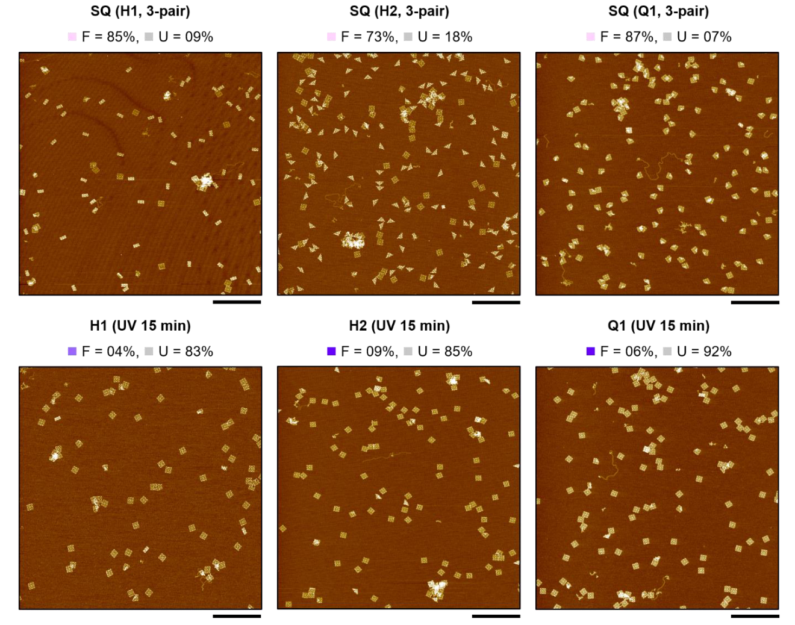

** Harnessing a paper-folding mechanism for reconfigurable DNA origami**

利用纸折叠机制实现可重构DNA折纸

# 一、文章简介

# 二、文章内容

## 摘要

**背景：**

纸折叠机制因其具有 <u>将可变形状和刚度编程到结构中</u> 的独特能力和优势，已被广泛应用于构建可重构的宏观系统1-5。

**提出问题：**

然而，尽管已经开发出基于DNA自组装的各种动态结构，但由于缺乏合适的设计原则，纸折叠机制在构建分子级系统方面几乎没有被利用6-23。

**解决问题：**

在这里，我们提出了一种利用纸折叠机制来创建可重构DNA折纸结构的方法。其主要思想是<u>**构建一个参考平面线框**</u>，这个线框的边可以看作纸折叠的折痕图案，以便可以将其折叠成各种目标形状24。

- 我们利用DNA链置换，以较高的产率实现了<u>**几种类似纸张的折叠和展开模式**</u>25。

- 我们展示了<u>**正交折叠、可重复折叠和展开、基于折叠的microRNA检测和荧光信号控制**</u>。

- 还可以通过<u>**pH或光源的变化 触发 刺激响应的折叠和展开**</u>。

- 此外，通过<u>**采用分层组装的方式，我们可以高度可编程地扩展纸折叠机制的设计空间和复杂性**</u>26。

**意义：**

由于其高度可编程性和可扩展性，我们期望所提出的 <u>**基于纸折叠的重构方法**</u> 将推动复杂分子系统的发展。

## 正文

### 实验结果

**分子架构的目的：**

分子架构旨在构建具有 有用的动态特性和功能特性29-31的复杂超分子组装体26-28，这需要健壮的设计原则，使分子结构能够可靠地根据外部刺激改变其形状。DNA折纸技术6以高度可编程的方式实现了响应性和可重构结构的发展，其中包括通过链置换反应11，13，15，16，18，20，21、可调节的机械特性14、结合相互作用10以及阳离子19，23或酸性22浓度 控制折叠/展开行为的动态系统。

**先前研究的缺点：**

<u>大多数这些系统仅能在简单的开启和关闭状态之间进行切换，只有少数的研究15，20证明了可以沿着设计的运动学路径进行更复杂的重新配置。</u>

**本文的新方法：**

- <u>在这里，受一张纸可以折叠成各种形状的启发。</u>
- <u>我们提出了对单个DNA折纸结构的形态变化进行 系统而多样化的编程，以便于它们可以折叠成多种构型，或者从多种构型中展开。</u>
- <u>以响应不同的环境刺激，且具有可逆性、可重复性和可靠性。</u>

### DNA线框纸 

<u>纸折叠机制需要一种类似纸张的可重构DNA折纸作为参考结构，这种结构嵌入有易于折叠和展开的折痕图案。</u>为此，<u>我们设计了一个参考的"DNA线框纸"折纸，这个线框纸的边沿着目标折痕图案和纸张的边界形成</u>（图1a、Supplementary Note 1、图S1）。

- 图1a：可重构DNA折纸的折叠机制。
  - 左：纸质折纸的折痕图案的示意图。
  - 右：相应的DNA线框纸的示意图。

- Supplementary Note 1：DNA线框纳米结构的设计
  - 利用PERDIX1软件设计了方形DNA线框纸( SQ )的草图。
  - <u>SQ由9个顶点、16条长度为104 bp的边和12条长度为146 bp的边以及16个面组成。</u>
  - <u>边的设计基于具有 反向平行 双交叉的 双DNA双链体。</u>
  - 边( E )和顶点( V )标记如下图所示。
  - <u>增加了scaffold环（scaffold loop）以调整scaffold的总长度，并修改了边上的staple，使其与平面垂直。</u>
  - 详细的caDNAno2设计和序列分别见图S1和表S4。

- 图S1：正方形DNA线框纸( SQ )的CaDNAno蓝图。
  - <u>灰色和红色着色链分别代表线框的edge staple和vertex staple。</u>
  - <u>基于M13mp18 scaffold（蓝色），使用caDNAno2和PERDIX1设计了基于双DNA双链体的DNA线框纸。</u>
  - <u>顶点staple的未配对区域都是用胸腺嘧啶( T )设计的。</u>
  - <u>添加了scaffold loop以调整scaffold的总长度。</u>

<u>DNA线框纸的边由具有足够刚性的双螺旋束( 2HB )组成，以保持整体结构的完整性。</u>

**handle：**

- <u>为了在DNA线框纸上实现各种折叠形态（图1b），我们在折痕处（图1c）加入了单链DNA延伸段，并将其称为 “折痕手柄”（crease handles），有两种类型：3′（粉色）和5′（橙色）。</u>

- <u>延伸部分由用于结合的8nt的ssDNA，以及用作间隔的3nt的poly-T（黑色）组成。</u>

**glue：**

- <u>DNA线框纸的折叠是通过添加与两个handle的序列互补的glue来激活的。</u>

**releaser：**

- <u>每条glue链的末端都有一个5nt的toehold，当加入与glue链互补的释放链时，可以通过toehold介导的DNA链置换25使折叠结构展开。</u>

- 图1b：利用纸折叠机制进行DNA折纸重构的概念性说明。
- 图1c：DNA线框纸的折叠与展开。
  - Crease、crease handles，有两种类型，3‘ 和 5’ ，在DNA线框的边上，以折线为对称轴。
  - 加入与两条handle互补的胶水链(glue，绿色)对DNA线框纸进行折叠。
  - 加入与glue完全互补的释放链（紫色），通过toehold介导的链置换实现DNA线框纸的展开。

### 正方形DNA线框纸的半折叠和展开

我们首先实验测试了一个正方形DNA线框纸（SQ）的半折叠和展开（图1d和Extended Data 图1），该线框纸有一对放置于目标折叠线两侧的边，并且这一条目标折叠线修饰了6个 3‘ 和 5’ 的handle（图S2）。

- 图1d：使用DNA线框纸的半折叠进行纸折叠机制的实验验证。用AFM测量了平行于折叠线的五个峰点的高度，并用倒三角表示。比例尺，100 nm。

- Extended Data 图1：方形DNA线框纸的合成
  - a：用 经Ethidium-Bromide染色的1.5wt%的琼脂糖凝胶，通过改变阳离子浓度进行电泳，90min，75V。使用12mM MgCl2（白色线框）合成正方形DNA线框纸片（SQ）。
  - b：12mM MgCl2条件下退火SQ的代表性AFM图像。比例尺，500 nm和100 nm。

- 图S2：SQ的handle设计和半折叠展开的实验验证
  - a：半折叠handle的设计示意图。每个handle的延伸方向（方形2）设计为垂直于DNA线框的边的交叉方向（方形1）。
  - b：具有代表性的三种状态的DNA线框纸的AFM图像：未折叠、半折叠和展开。比例尺1 μm。
  - c：每种形状在三种状态下的分数。
  - d：SQ半折叠的AFM图像示例。比例尺 100nm。标准差计算式为：p√( 1-p) /√N。其中 p 是AFM估计的产率，N 是单体的总数，假设p为伯努利（Bernoulli）概率12，13。
  - 对于三种状态：Initial状态、Glue状态、Releaser状态，样本尺寸分别为316、379和302。

<u>原子力显微镜（AFM）成像证实了未折叠的参考线框纸的成功构建。</u>

<u>平行于折叠线测量的5个峰值点高度范围为0.6 ~ 0.8 nm。只有2 %的图像中DNA结构是随机半折叠的。</u>

<u>在室温下孵育1小时，加入10倍handle浓度的glue链，即使只有一对边被修饰，也导致了近60%的DNA线框纸按预期的方式被半折叠。</u>

<u>测得的五个峰值点的高度都大于1.2nm，这表明线框纸的边重叠且结构被有效地折叠成一半。</u>

<u>当加入超过10倍glue链的释放链，经过37°C孵育1小时后，折纸成功展开，半折叠DNA线框结构的比例再次减少至2%，五个峰点的高度也恢复到初始值。</u>

### 在DNA线框纸上编程各种折叠模式

我们进一步探究了SQ DNA线框纸的其他折叠类型（Extended Data 图2）。

- Extended Data 图2：SQ折叠的详细折痕图案。
  - 天蓝色、蓝色、粉红色、黄色的边分别表示具有 3‘ 和 5’ handle的DNA线框的边，可分别与glue1（G1）和glue（G2）链结合。
  - handle的向下和向上方向分别表示山折（mountain fold）和谷折（valley fold）

<u>根据折叠类型，每个折痕都标有H（一半）或Q（四分之一）</u>（图2a）。<u>为了构建可编程的折痕图案，该结构被划分为28条边，其部分的staple被模块化地替换为用于目标折叠物配置的handle staple。</u>

- 图2a：在SQ DNA线框纸上编程折叠图案( Q1，Q3)的工作流程。H和Q分别表示半折叠和四分之一折叠，下标为折叠数（the folding number）。边的staple（E）被模块化地替换为handle staple用于折叠。

<u>为了说明这一点，我们设计并构建了8种SQ DNA线框纸的折叠模式。AFM证实了所有八种折叠构型都可以按照预期成功实现</u>（图2b、Extended Data 图3）。

- 图2b：SQ DNA线框纸的各种折叠状态。
  - 绿色箭头表示glue链的添加。
  - 具有3‘ 和 5’ handle修饰的DNA线框纸的边分别用粉色和橙色表示。比例尺，50nm。

- Extended Data 图3：SQ的折叠形状和AFM图像的示意图。比例尺，100nm。

所观察到的形状与结构化核酸编程接口（structured nucleic acid programming interface，SNUPI）分析32–34所预测的平衡折叠构型相似（图S3和S4）。

- 图S3：SQ折叠的平衡配置的有限元分析结果（Finite element analysis results of equilibrated configurations of SQ folding）
  - <u>假设glue链与handle之间完全结合。由于只修饰了一对边，观察到了结构的波动（见例子H3的红点三角形），这表明使用更多的“边对” 可以在平衡状态下很好地维持预期的折叠构型。</u>使用SNUPI5-7进行了有限元分析（见表S2）。

- 图S4：SQ折叠的平衡配置的有限元分析结果（Finite element analysis results of equilibrated configurations of SQ folding）
  - 假设glue链和handle之间完全结合。采用SNUPI5-7进行有限元分析(表S2)。

此外，琼脂糖凝胶电泳显示出 "更折叠" 的结构移动性更高（图S5）。

- 图S5：SQ折叠的琼脂糖凝胶电泳。用Ethidium- Bromide染色的琼脂糖凝胶在75V电压下电泳90min，以比较折叠的方形DNA线框纸（SQ）的迁移。使用Image Lab v5.1 程序测量各主带的relative front值（RF)和强度百分比（intensity percent）。琼脂糖凝胶电泳显示 “更折叠的” 结构的迁移率更高。
  - a：scaffold和staple的浓度分别是20nM和100nM。
  - b：scaffold和staple的浓度分别为5nM和100nM。通过使用较低浓度的scaffold，有效地减少了多聚体的形成。

这些结果表明，所设计的DNA线框纸在溶液中正确折叠和保持，而不是在云母上沉积和AFM测量时偶然折叠。

### 估计折叠产率

<u>我们通过使用我们开发的的MATLAB代码（ Extended Data 图4 ），对AFM图像中的粒子根据其大小进行分类并计算单体的数量，然后将具有预期折叠形状的单体数量除以计算的单体总数，来估计单体的折叠产率。</u>

在前一节中介绍的SQ DNA线框纸的折叠图案的产率通常低于70％（表S1），该值相对较低，<u>是由于handle的数量不足以及折痕上的顶点过于僵硬导致的。</u>

为了提高折叠结构的成品率，我们改变了handle对的数量和顶点刚度。

- Extended Data 图4：基于AFM图像估计折叠产率的过程。
  - a：以SQ (Q1)为例估计折叠产率的过程。
    - AFM图像中的所有颗粒（左图）被系统地编号（中图）
    - 根据其大小进行过滤以去除聚集的颗粒
    - 并使用定制的MATLAB代码进行重新编号（右图）。比例尺，1 μm。
  - b：部分显示的或形状不规则的颗粒在产率估计过程中被排除（红色对角线取消线）
    - 带有白色和红色数字的单个图像分别表示具有预期和非预期形状的单体。比例尺，100nm。

### 改变了handle对的数量来提高折叠产率

<u>增加具有handle的“边对”的数量，提高了glue链和handle之间的结合概率</u>（图3a）。

- 图3a：H1，H2和Q1的折痕图案，其中带有handle的 “边对” 的数量不断增加。

<u>H2折叠显示出最低的产量，仅有一个边对（四对handle），但随着边对的数量从一个增加到两个，再到三个，产量分别从38%增加到84%，最终达到94%</u>（图3b）。

- 图3b：H1、H2和Q1具有代表性的AFM图像和折叠产率。比例尺，100nm。
  
  - SQ半折叠的AFM图像示例。比例尺 100nm。
  - 标准差计算式为：p√( 1-p) /√N。其中 p 是AFM估计的产率，N 是单体的总数，假设p为伯努利（Bernoulli）概率26，50。
  
  - 从1到3条边对，样本容量 (n) 分别为508，262和105 (H1)，311，468和474 (H2)和173，以及341和331 (Q1)。

<u>类似地，当使用三对handle时，H1和Q1的产量分别从68%提高到87%和从73%提高到88%</u>（图S6-S8）。

- 图S6-S8：
  - S6：SQ (H1)的代表性AFM图像。
    - a：SQ (H1)的代表性AFM图像，边对数量从一到三的三种不同类型。比例尺：1 μm
    - b：SQ (H1)的折痕图案。粉红色和橙色分别表示用 3‘ 和 5’ 的handle修饰的DNA边
    - c：通过AFM测量估计了H1，SQ (未折叠)和其他组分的分数。详细数据见表S1。对于H1，样本尺寸分别为508 (1-pair), 262 (2-pair), and 105 (3-pair)
  - S7：SQ (H2)的代表性AFM图像。
    - a：SQ (H2)的代表性AFM图像，边对数量从一到三的三种不同类型。比例尺：1 μm
    - b：SQ (H2)的折痕图案。粉红色和橙色分别表示用 3‘ 和 5’ 的handle修饰的DNA边
    - c：通过AFM测量估计了H2，SQ (未折叠)和其他组分的分数。详细数据见表S1。对于H2，样本尺寸分别为311 (1-pair), 468 (2-pair), and 474 (3-pair)
  - S8：SQ (Q1)的代表性AFM图像。
    - a：SQ (Q1)的代表性AFM图像，边对数量从一到三的三种不同类型。比例尺：1 μm
    - b：SQ (Q1)的折痕图案。粉红色和橙色分别表示用 3‘ 和 5’ 的handle修饰的DNA边
    - c：通过AFM测量估计了Q1，SQ (未折叠)和其他组分的分数。详细数据见表S1。对于Q1，样本尺寸分别为173 (1-pair), 341 (2-pair), and 331 (3-pair)

因此，使用足够数量的折痕手柄对确保折纸机制具有较高的产率非常重要。

<u>SNUPI分析支持了这一点，因为它预测了与单个“边对”折叠而成的平衡结构相比，用三个“边对”折叠而成的平衡结构[9，35]的均方根波动（root-mean-square fluctuation，RMSF）振幅更低</u>（图3c、图S10）。

- 图3c：<u>根据使用了三对handle折叠的H1、H2和Q1的均方根波动（RMSF）振幅、总应变能（total strain energy）和折叠产率预测了相应的折叠形状。使用SNUP计算了溶液中的折叠形状和总的应变能[32-34]。观察到总应变能与折叠产率之间的负相关关系。</u>

- 图S10：根据均方根波动的结果，生成了SQ折叠的三维图像。
  - a：使用SNUPI[5-7]估计的 1-pair（红）和 3-pair（亮红）的RMSF值[14，15]的标准化分布（normalized distributions）。见表S2。与1-pair的情况相比，3-pair的整个直方图向左偏移，这表示更稳定的折叠配置。
  - b：<u>使用VMD程序创建了处于平衡状态下的3-pair折叠的3D图像</u>16 (Material: AOChalky and Drawing Method: VDW)。

### 改变顶点刚性来提高折叠产率

SNUPI也表明折叠结构诱导的应变能会影响折叠产率，对于H1、H2和Q1折叠，预测的总应变能与实验得到的折叠产率呈负相关（图3c）。

降低折叠结构的应变能可能会提高产率：

- 我们<u>通过研究顶点刚性的影响来验证这一假设</u>（应变能被控制在顶点的范围内）。

- <u>在SQ DNA线框纸中，大多数线框的边相交的顶点处都有未配对的单链部分。</u>
- <u>然而，位于外边框中点的顶点有一个缺口，这使得它们比其他顶点更加具有刚性，这可能会抑制成功折叠</u>（图3d）。

- 图3d：用外边框中点的四个顶点上用间隙来代替缺口（红色方框），以减少集中在那里的应变能。
  - 对于H1，<u>集中在两个顶点(黑的方框)的局部应变能随着间隙长度的增加而减小，因此，折叠产率也随之增加</u>。
  - 从缺口到长度为5的间隙，样本量分别为105、159、301和189。

<u>因此，我们通过在缺口位置周围改变staple的模块化设计，将缺口替换为长度变化的间隙( 1、3、5 nt长间隙)，从而系统地降低了弯曲刚度</u>[36-38]（图S11）。

- 图S11：SQ中间顶点的模块化间隙设计。
  - a：正方形的DNA线框纸具有8个外部顶点：<u>四个有缺口的僵硬顶点（红色方框）</u>、<u>四个有未成对的4碱基长的单链DNA的灵活顶点（黑色方框）</u>
  - b：模块化间隙设计的原则系统化地获取了各种长度的间隙，并以Gaptotal(m+n) = a(m) + b(n) 表示，其中m和n分别表示两个staple a和b 的长度。

<u>对于具有最低折叠产率和最高总应变能的H1，根据SNUPI分析，添加间隙可以有效地降低折叠线顶点处的应变能。</u>

通过添加更长的间隙可以更有效地减小应变能33，这一点在AFM的测量结果中得到了证实，当使用5nt长的间隙时，H1折叠产率从87%提高到了93%（图3d）。<u>无论handle对的数量如何，间隙最长的线框纸都表现出最高的产率</u>（图S12-14，表S1）。

- 图S12-S14：
  - S12：具有1-pair和不同间隙长度的SQ(H1)的代表性的AFM成像。
    - a：具有1-pair和不同间隙长度的SQ(H1)的中间顶点（黑色方框）的折痕图案
    - b：具有nick和1-、3-、5-nt间隙的SQ(H1，1-pair)的代表性的AFM成像。详细数据见表S1。比例尺，1 μm。对于具有间隙的1-pair的H1的折叠，样本量分别为508 (nick), 524 (1-gap), 594 (3-gap), and 597 (5-gap)
  - S13：具有2-pair和不同间隙长度的SQ(H1)的代表性的AFM成像。
    - a：具有2-pair和不同间隙长度的SQ(H1)的中间顶点（黑色方框）的折痕图案
    - b：具有nick和1-、3-、5-nt间隙的SQ(H1，2-pair)的代表性的AFM成像。详细数据见表S1。比例尺，1 μm。对于具有间隙的2-pair的H1的折叠，样本量分别为262 (nick), 384 (1-gap), 436 (3-gap), and 468 (5-gap)
  - S14：具有3-pair和不同间隙长度的SQ(H1)的代表性的AFM成像。
    - a：具有3-pair和不同间隙长度的SQ(H1)的中间顶点（黑色方框）的折痕图案
    - b：具有nick和1-、3-、5-nt间隙的SQ(H1，3-pair)的代表性的AFM成像。详细数据见表S1。比例尺，1 μm。对于具有间隙的3-pair的H1的折叠，样本量分别为105 (nick), 159 (1-gap), 301 (3-gap), and 189 (5-gap)

基于板块理论的局部弹性能量成本和弯曲刚度估计的简单玩具模型（simple toy model）支持这种通过调整间隙长度来提高产率的方法( Supplementary Note 2 and 3 )。

值得注意的是，使用间隙软化这些顶点并不影响整体结构的完整性，因为没有胶链的具有5nt长的间隙设计的展开部分保持在80%左右，与原始的无间隙设计相似（图S15）。

- 图S15：间隙效应对SQ结构完整性的影响
  - a：分别为带有缺口和5nt长的间隙的SQ(H1，3-pair)在添加glue链之前的具有代表性的AFM图像。比例尺，1 μm。
  - b：H1, SQ (unfolded), Q1 & Qm (single & multi quarter-folding), and 其他的分数。在5nt长的间隙的设计中，SQ的分数估计在78%左右，与具有缺口的结构类似，这证实了当应用间隙时DNA线框纸的结构完整性。对于缺口和5-gap，样本量为342和370。

<u>因此，在不影响DNA线框纸整体结构完整性的前提下，利用间隙对顶点刚度进行局部调控将是优化折叠产率的有效途径。</u>

### 优化后的产率分析

我们采用相同的方法优化了其他结构的折叠（图3e和表S1），并分别获得了H1、H2和Q1的产率为93%、94%和88%。

- 图3e：优化了H1( 93 % ( n = 189 ))、H2( 94 % ( n = 474 ))和Q1( 88 % ( n = 579 ))的折叠产率。

在所有情况下，使用了三对handle。虽然H1的中间顶点使用了5nt长的间隙，但由于H2的中间顶点不参与折叠，所以H2使用了最初的无间隙设计。

<u>在Q1的情况下，使用1nt长的间隙设计代替5nt长的间隙，因为当四个中间顶点的灵活性增加时，其他角（corners）更容易发生随机折叠，从而导致折叠产率略有下降</u>（图S16）。

- 图S16：通过添加间隙对SQ进行随机四分之一折叠。
  - a：具有缺口、1-gap和5-gap的SQ（Q1，3-pair）的具有代表性的AFM图像。比例尺，1 μm。
  - b：
    - 上面板：SQ（Q1，3-pair）的折痕图案，其中应用了不同长度的间隙的四个结构图案（黑色方框）。
    - 下面板：使用SNUPI技术，根据间隙的长度估计了目标折痕上两个顶点的局部应变能。
  - c：Q1, Qm (multi quarter-folding), and Others的分数。
    - Qm的分数从缺口结构的5%增加到1-gap结构的6%，最后翻倍增至5-gap的10%，而Q1的分数在5-gap时略微减少。
    - 考虑到在1-gap和5-gap设计中，Q1和Qm比例之和超过90%，所以可能是因为5-gap设计导致的刚度松弛，引起了额外的四分之一折叠，导致Q1的产量略低于1-gap。
    - 对于Q1 3-pair折叠，样本量分别为331 (nick), 579 (1-gap), and 565 (5-gap)。
  - d：图16a中 5-gap 图像中Qm的示例AFM图像。比例尺，100 nm。详细数据请参见表S1。

若仅在Q1的折叠线上修改2个中间顶点的刚度，就可以减少其他角的随机折叠。我们还优化了glue链和releaser链的浓度，以尽量减少重复折叠和展开过程中的链的浪费，我们发现，双倍的量足以实现预期的折叠和展开，其产量与添加10倍的量相似（图S17和S18）。

- 图S17：glue链和releaser链的浓度对折叠和展开产量的影响。
  - a：通过添加glue链和releaser链，DNA框架纸的H2（3-pair）折叠和展开过程的示意图。
  - b：以handle的浓度为基准，计算1倍（1×）到10倍（10×）的glue链浓度下，折叠状态的分数。
  - c：以1X的glue链为基准（G 1X），计算1倍（1×）到10倍（10×）的releaser链浓度下，折叠（H2）和展开（SQ）状态的分数。每个样本的大小用N表示。标准差的估计如表S1所示。

- 图S18：根据glue链和releaser链浓度，展示了SQ（H2）折叠的代表性AFM图像。通过AFM测量，估计了折叠（H2）和展开（SQ）状态的单体比例。从低浓度到高浓度，样本量分别为281，356，178，118和474（glue），285，238，242和177（releaser）。比例尺， 1 μm。

然而，当需要进行多轮折叠和展开时，使用常规的纯化步骤39去除多余的链将是有利的。

### DNA线框纸的正交折叠

通过优化设计，我们使用DNA线框纸研究了正交折叠、可重复折叠以及基于展开和折叠的信号控制。<u>首先，我们在SQ DNA框架纸上嵌入了H1和H2折叠图案，以探索正交折叠</u>（图4a）。

- 图4a：正交折叠。 正交折叠的方案（上）以及具有H1和H2的SQ DNA框架纸的折叠状态分数（下）的图示。
- 两个正交的handle和glue链组合在一起。
- <u>通过添加glue 1将SQ的初始未折叠状态改造为H1状态，通过glue 2将其改造为H2状态。</u>比例尺，50nm。样本量分别为293 (no glue), 471 (glue 1) 和 395 (glue 2)。
- 用于H1和H2折叠的glue链设计为与其相应的handle具有互补序列，但在彼此之间是正交的（表S5）。
- 在没有任何glue链的情况下，AFM图像中，未折叠状态占主导地位(83 %)（图S19和表S1）。

- 图S19：正交折叠的具有代表性的AFM图像。天蓝色和蓝色的边表示具有3'和5'handle修饰的DNA线框纸的边，分别与glue 1链（深绿色）结合。粉红色和黄色的边表示具有3'和5'handle修饰的DNA线框纸的边，分别与glue2链（绿色）结合。比例尺，1 μm。详细数据见表S1。

通过加入相应的glue链(glue 1和glue 2)，可以成功地将其重新配置为折叠态H1 ( 96 % )和H2 ( 93 % )。这种高产率的正交折叠特性将使我们能够在单个DNA线框纸上实现多重的和更复杂的重构。

### 将正交折叠特性用于分子传感器

**方案一：**

这种正交折叠的特性将有助于分子传感器的发展。为了证明这一点，我们特制了DNA线框纸，使其能够检测与疾病相关的miRNA链。我们设计了一种正交的handle，其序列被设计为与两种类型的23 nt长的miRNA链互补，miR-107 (橙色)和miR - 155 (紫色)，这两种miRNA链在阿尔茨海默病40和乳腺癌41中常常过度表达（图4b，图S20）。

- 图4b：miRNA检测。miRNA检测方案(上)，H1和H2的SQ DNA线框纸折叠状态分数 (下)。三种状态的代表性AFM图像。比例尺，200 nm。样本量分别为246 (no miRNA), 411 (miR-107) and 297 (miR-155)。

- 图S20：使用正交折叠系统的miRNA检测的代表性AFM图像。具有分别与miR-107 (橙色)和miR-155链（紫色）互补的两个正交的3'和5' handle的DNA线框纸。比例尺，1 μm。详细数据见表S1。

因此，这种DNA线框纸可以根据输入的miRNA链折叠成H1或H2状态。

在加入miRNA链之前，未折叠的SQ状态占主导地位，为77 %，而随机折叠的H1和H2状态分别为5%和7%。

当加入miR - 107和miR - 155链时，观察到成功折叠的目标形状H1 ( 75 % )和H2 ( 87 % )，证实了其感知目标分子的能力。

**方案2：**

或者，分别设计了两种类型的DNA线框纸，使得每种DNA线框纸都可以只响应一种目标miRNA。(Extended Data 图5 和 图S21)。

- Extended Data 图5：通过可折叠的DNA线框纸进行多通道miRNA检测。
  - a：使用可折叠DNA折纸的多通道miRNA检测的示意图。
  - b：各状态下的单体分数及代表性AFM图像。详细序列和估计标准差的过程见表S1。每个样本量记为N。比例尺，200nm。

- 图S21：多通道miRNA检测的代表性AFM图像。通过AFM测量估算了未折叠态( SQ )和两个折叠态(  H1和H2 )的分数。从左上到右下，样本量分别为360、543、448和496。比例尺，1 μm。

当它们以相同的浓度在同一溶液中混合时，未折叠的SQ状态占主导地位( 74 % )，这与之前正交的miRNA检测的结果相似。

在加入其中一种miRNA链的情况下，H1或H2组分分别增加到41%和48%，而SQ组分减少到40%左右。

如果两种miRNA链都存在，SQ的比例将减少到6%，而两种半折叠的比例分别估计约为40%。

该结果表明，使用DNA线框纸也可以实现多通道传感分子的概念。

### 验证DNA线框纸的可重复折叠和展开

接下来，我们<u>通过交替添加glue链和releaser链检查了使用H1折叠设计的DNA线框纸的可重复折叠和展开</u>（图4c）。

- 图4c：可重复折叠和展开。
  - 上：使用H1折叠设计的SQ DNA线框纸的可重复折叠和展开的方案
  - 下：相应的代表性AFM图像的凝胶电泳迁移。从未折叠状态(U,紫色方框)和折叠状态(F,绿色方框)对应的凝胶条带中获得了AFM图像。比例尺，100 nm。

在添加了glue链和releaser链后，琼脂糖凝胶电泳中出现了明显的迁移差异，这确认了折叠和展开的可重复性

<u>当添加glue链时，展开状态的起始条带位置下降到折叠状态的较低条带位置，然后当我们添加releaser链时，条带位置又回升到原始位置。</u>

此外，每个凝胶条带获得的AFM图像还验证了正确的折叠和展开形状（图S22）。

- 图S22：可重复折叠和展开的凝胶电泳图以及代表性的AFM图像。
  - 左：以EtBr染色的0.8wt%琼脂糖凝胶进行电泳，75V，90min。
    - 泳道1：SQ (H1, 3-pair)。
    - 泳道2：添加了两倍于handle浓度的glue链。样品在室温下孵育过夜。
    - 泳道3：加入了10倍于先前泳道1加入的glue链，并在37°C下孵育了一个小时。
    - 泳道4：添加了20倍于handle浓度的glue链。样品在室温下孵育过夜。
    - 泳道5：加入了10倍于先前泳道4加入的glue链，并在37°C下孵育了一个小时。
  - 中、右：在对每个带（紫色和绿色方框）进行凝胶提取和超滤之后，进行了AFM测量。比例尺，1 μm。

在展开状态下，可以观察到81%的SQ结构，在折叠状态下，可以观察到98%的H1结构（表S1）。

<u>在折叠和解折叠的过程中，没有观察到结构完整性的显著退化。</u>

### 基于折叠的荧光信号的控制

折叠的正交性和可重复性提供了一种多功能的方法，这种方法可以将衍生的折叠特性编程到DNA线框纸中。

为了说明这一点，我们研究了基于折叠的荧光信号的控制。

<u>我们在具有H1和H2折叠图案的SQ DNA线框纸的四个内顶点上连接了两个猝灭剂( Q , EBQ )和荧光报告分子( R、Cy3 )</u>（图4d和图S23-25）。

- 图4d：基于折叠的荧光信号控制。
  - 上：在初始状态、折叠状态和展开状态下的预期信号状态。2个淬灭剂( Q , EBQ )和荧光报告剂( R、Cy3 )放置在4个内顶点伸出的悬垂链末端。
  - 下：在溶液中测得时间分辨归一化荧光强度（Time-resolved normalized fluorescence intensities）（灰色代表H1，黄色代表H2），测量时间为140分钟。
    - 通过将数据拟合到我们的动力学模型（Supplementary Note 4），估计得到正向反应速率 Kon。
    - H1和H2分别为4.35 × 105(M s)−1 和 4.44 × 105 (M s)−1 （实线）。比例尺，100nm。标准差如图3所示。

- 图S23：与折叠相依赖的荧光信号控制的设计
  - a：带有两个淬灭剂（Q）和两个报告器（R）的SQ（H1，3-pair）的折痕图案。在添加glue链条（见c）后，两个报告器都会因靠近而被抑制，并在添加releaser链后恢复。
  - b：带有两个淬灭剂（Q）和两个报告器（R）的SQ（H2，3-pair）的折痕图案。在添加glue链条（见d）后，只有一个报告器会被抑制，并在添加releaser链后恢复。
  - c：（a）中的淬灭的报告器的示意图。
  - d：（b）中的淬灭的报告器的示意图。

- 图S24：带有2个报告器和2个淬灭剂的SQ ( H1 , 3-pair)的caDNAno蓝图。蓝图2代表通过glue链(绿色)完全折叠的SQ ( H1 , 3-pair)。两个淬灭剂和两个报告器分别连接在两种handle的末端，即3'（粉色）和5'（橙色），从内部顶点的staple上突出。在这个设计图中，glue链的toehold部分被省略了。

- 图S25：带有2个报告器和2个淬灭剂的SQ ( H2 , 3-pair)的caDNAno蓝图。蓝图2代表通过glue链(绿色)完全折叠的SQ ( H2 , 3-pair)。两个淬灭剂和两个报告器分别连接在两种handle的末端，即3'（粉色）和5'（橙色），从内部顶点的staple上突出。在这个设计图中，glue链的toehold部分被省略了。

<u>该设计使得两个 “猝灭剂-报告器” 对在H1折叠中都非常接近，而只有一对随着H2折叠而发生猝灭，从而导致荧光信号随折叠而变化。</u>时间分辨荧光测量分3个阶段进行：第I阶段(初始状态)、第II阶段(使用glue链的折叠状态)和第III阶段(使用releaser链的展开状态)。

- 在**第一阶段**，归一化强度水平维持在1.0左右，波动较小。
- 在**第二阶段**，添加glue链后，归一化强度迅速下降并收敛到约0.25和0.65，分别对应H1和H2的折叠状态。正如预期的那样，与H2折叠相比，H1折叠显示出大约两倍的荧光强度降低。

在这两种情况下，我们的动力学模型估计，收敛时间约为10分钟，而其上升速率为4.4 × 105（M s）−1，这与DNA纳米结构聚合的速率相似42，43(Supplementary Note 4)。

- 在**第三阶段**中加入releaser链时，归一化强度逐渐增大，最后收敛到0.95左右，展开反应时间约为40 min。这比典型的toehold介导的链置换反应的时间要慢25，44。
- <u>当我们在加入释放链条后，向溶液中施加涡旋混合，展开反应几乎瞬间完成（图S26）。</u>

- 图S26：使用涡旋的展开反应的荧光动力学研究。
  - a：预计DNA线框图纸从两种折叠状态（H1或H2）展开后（SQ），发出荧光信号，这来自于。使用了两个报告器（黄色）和淬灭剂（灰色）。
  - b：使用涡旋的展开反应的时间分辨荧光动力学。在添加releaser链（紫色）后立即进行15秒的涡旋处理。

每个阶段的AFM测量也证实了成功的折叠和展开，并且与强度曲线一致（图S27、表S1）。

- 图S27：与折叠相依赖的荧光信号控制的代表性AFM图像
  - a：
    - 阶段一：初始状态。
    - 阶段二：折叠状态。添加了glue链。
    - 阶段三：展开状态。添加了releaser链。
    - 所有AFM图像都是在每个阶段的荧光强度完全收敛后获得的。两个彩色点代表了两种报告物（Cy3）的状态，正常（橙色）和熄灭（灰色）。比例尺，1 μm。
  - b：根据每个阶段，计算SQ (H1, 3-pair) 和 SQ (H2, 3-pair)的分数。
  - 对于阶段一、二、三，样本量分别为 342，281，212（H1）和495，584，455（H2）。

### 同一折痕上的山折和谷折

<u>通过在同一折痕上使用山折和谷折，可以通过控制淬灭剂和报告器之间的距离进行更精细的信号调整。</u>通过选择handle链相对于附着有淬灭剂和报告器的表面的悬垂方向，实现了这种折叠（图S28、S29）。

- 图S28：山折和谷折的handle设计。
  - a-b：分别使用SQ（H1，3-pair）的示例设计山折和谷折。基于交叉方向（方框1），山折和谷折的悬垂链被设计成垂直于DNA线框纸的平面并向外突出（方框2），同时彼此方向相反。

- 图S29：SQ（H1，3-pair）的山折和谷折。
  - a：山折和谷折。在山折和谷折对应的handle的相反侧和相同侧上，分别放置了两个猝灭剂和报告器。
  - b：在AFM图像中观察到了两种折叠类型的相似高折叠收率。详细数据见表S1.
  - c：在溶液中测量的山折和谷折的时间分辨归一化荧光强度在15分钟内可以清晰地区分开来。比例尺，200nm。

<u>对于山折，由于猝灭剂和报告物间的接近程度略低（理想情况下，双层的双链DNA是隔开的），预计会有更高的荧光强度。</u>

通过归一化后的时间分辨强度测量结果显示，山折和谷折之间大约相差0.1，并且AFM测量确认了这些折叠的高产率（表S1）。

### 具有pH响应性的折叠

<u>由于纸折叠机制具有普遍性，人们可以很容易地创造出对各种环境刺激响应的DNA线框纸。</u>为了说明这一点，我们<u>首先构建了具有H1折叠模式的pH响应的SQ DNA线框纸</u>（图5a）。

- 图5a：pH响应的折叠控制示意图。<u>通过控制酸性和碱性的环境条件，可以控制 ssDNA (绿色)和发夹(橙色)之间的Hoogsteen相互作用，来控制折叠。</u>

设计了三对含60%的T-A·T三联体的handle，并通过pH变化来控制Hoogsteen相互作用（图S30）。样品通过过滤缓冲液( pH 8.0 )进行超滤，然后与6种不同pH值( 5.8 ~ 8.4 )的缓冲液混合(Supplementary Note 5)。

- 图S30：pH响应折叠和展开的设计
  - a：形成的DNA三链结构的详细序列，由20nt长的单链DNA（绿色）和20bp长的发夹结构（橙色）以及4nt长的poly-T环（黑色弧形）组成。在pH 6.4到8.0之间使用60％的TAT含量进行pH响应的结构化重新配置20。在每个悬垂链的开头，设计了3nt长的poly-T（黑色），用作间隔物。
  - b：通过控制Hoogsteen相互作用，实现pH响应的正方形DNA线框纸的折叠和展开的示意图。当DNA三链结构在酸性条件下形成时，附带的两个报告物将被猝灭，而在碱性条件下将恢复强度。使用0.5M乙酸（CH3COOH）和0.5M氢氧化钠（NaOH）来调节pH值 (Supplementary Note 5)。

AFM和时间分辨荧光测量都证实了折叠和展开结构之间的pH响应性结构化开关。<u>通过对AFM数据进行Hill方程拟合，得到Hill系数( n )和pKa值分别为n = 2.16和pKa = 7.47（图5b和图S31）。</u>

- 图5b：与pH相关的H1的折叠和展开状态的分数，通过AFM测量进行表征。通过添加乙酸和氢氧化钠调节pH值(Supplementary Note 5)。对折叠和展开状态下的曲线分别进行Hill方程拟合，得到Hill系数分别为2.16和2.33，pKa值分别为7.47和7.49。从最低的pH开始，样本量分别为440, 379, 319, 302, 230 和 290。

- 图S31：通过改变pH值得到H1的代表性AFM图像。通过改变溶液的pH值，实现SQ（H1，3-pair）的pH响应性结构重构。
  - 样品与每个调整了pH的缓冲液混合，并在室温下孵育至少2小时。进行AFM测量，估计了折叠（F）、展开（U）和结构的比例（表S1）。
  - 在这种情况下，pH值与DNA scaffold的存在之间没有显著的相关性，因为无论pH值如何，在其他AFM图像中偶尔也会观察到它们的存在。比例尺，1 μm。
  - 从最低pH值开始，样本量分别为440, 379, 319, 302, 230, 和 290。

<u>估计的pKa值与pH激活的DNA开关相似，为7.50（ref.45）。由于pH值在6.4至8.0之间反复变化，归一化荧光强度相应地下降和恢复</u>（图5c）。

- 图5c：测量在溶液中的归一化荧光强度，420min，并给出了pH值为6.4和8.0时的代表性AFM图像。比例尺，100nm。

在每个pH下的AFM图像也证实了可以通过pH变化实现环境控制折叠。

当pH为8.0时，展开状态对应的归一化荧光强度略有下降。这可能是由于重复的pH变化导致的结构损伤，因为pH激活的DNA胶囊也有类似的报道22。我们的AFM测量结果也支持了这一点（图S32）。

- 图S32：pH反复变化对H1的结构破坏。pH响应性折叠和展开过程的首个步骤和最终步骤的AFM代表性图像。在最终步骤图像中观察到更多聚集和不规则形状（红色虚线圈），与先前的研究结果相似21。在图5c中，经过重复的pH变化后，这种结构损伤可能导致pH 8.0下的归一化荧光强度略微降低至1.0以下的值。比例尺，1 μm。

### 紫外线照射对折叠能力的剥夺

我们还探索了通过紫外线( ultraviolet rays，UV )照射对折叠能力的剥夺，<u>通过在连接两个handle的glue链中间引入光切位点( PC )来实现</u>（图5d）。

- 图5d：紫外线对折叠能力的剥夺的示意图。在glue链的中间插入了一个PC位点(紫色)。

<u>在可见光( visible light，VIS )的照射下，可以使用相应的glue链和releaser链对DNA线框纸进行折叠、展开、重新折叠成指定的构型。当施加紫外光时，折叠结构会随着胶链的断裂而展开（被劈开）。</u>紫外灯照射约需15 ~ 30 min（图5e、5f、图S33、S34）。

- 图5e、5f：
  - 5e：根据AFM测量，H1在紫外照明时间内折叠和展开状态的比例。从0-30min，样本量分别为194, 195, 170, 151, 139 和 285。
  - 5f：在0和15分钟的紫外光照下，H1，H2和Q1的代表性AFM图像与折叠状态分数。比例尺，200nm。对于H1，H2和Q1展开，样本量分别为194, 149 和 206 (UV 0 min) 、 139, 172 和 156 (UV 15 min).

- 图S33：根据不同的紫外照明时间，展示H1展开的AFM图像。
  - 根据紫外光照明时间的变化，展示SQ H1 (3-pair)的紫外光响应性展开情况。
  - 在紫外线光照之前，在glue链的中间修饰一个光切位点，将其称为PC-glue。
  - 样品在室温下孵育过夜。进行AFM测量以估计折叠（F）、展开（U）和其他（Others）的比例（表S1）。比例尺，1 μm。
  - 从0-30min，样本量分别为194, 195, 170, 151, 139, 和 285。

- 图S34：在15分钟紫外照射下，H1、H2和Q1的典型AFM图像，展示了展开过程。通过15分钟紫外光照，三种3-pair的折叠（H1，H2和Q1）得到了展开。进行了AFM测量以估计折叠（F）、展开（U）和其他（Others）的比例（表S1）。比例尺，1 μm。对于H1，H2和Q1展开，样本量分别为194, 149, 206 (0 min) 和139, 172, 156 (15 min)。

<u>这些PC结构由于受热波动的影响，除了随机折叠外，无法再折叠。</u>

### 具有光响应性的折叠

<u>除了通过紫外线来剥夺折叠能力外，我们引入了偶氮苯分子的顺式与反式光异构化（trans–cis photoisomerization of azobenzene molecules ）来实现完全可逆和可重复的折叠</u>（图5g）。

- 图5g：通过UV和可见光的交替照射、偶氮苯分子的顺式与反式光异构化实现的光响应的折叠和展开的示意图

glue链(绿色)和3′ handle(深红色)被设计为含有偶氮苯分子46，47，并模块化地适应H2折叠系统（图S35）。

- 图S35：光响应折叠与展开的设计。
  - a：DNA线框纸的详细序列和示意图。使用紫外线（紫色）和可见光（绿色）照射下，偶氮苯分子（X，红色）的反式顺式光异构化导致DNA线框纸的折叠和展开。
  - b：光响应DNA线框纸的预期状态。

<u>AFM测量证实，通过添加偶氮苯修饰的glue链，一旦DNA折纸折叠成期望的形状，就可以通过切换UV和VIS射线的光照来主动控制DNA线框纸的构型</u>（图5h、5i和图S36）。

- 图5h、5i：
  - 5h：H2折叠态的单体比例。
  - 5i：每个步骤的代表性AFM图像。从步骤1-步骤5，样本量分别为576, 412, 458, 413 和 608。比例尺，100nm。标准差如图3所示。

- 图S36：光响应的折叠和展开的代表性AFM图像。用偶氮苯分子设计的H2 ( 2 -pair)的光响应折叠和展开。AFM测量用于估计折叠( F )、展开( U )和其他部分（Others）的比例（表S1）。比例尺，1 μm。从步骤0到步骤5，样本量分别为385，576，412，458，413和608。

### 扩展折叠系统

为了扩展折叠系统的设计空间和复杂性，我们需要更大的DNA线框纸。为此，<u>通过对4个原始大小的DNA线框纸进行分级组装，构建了4倍大的DNA线框纸</u>（图6a，图S37-39）。

- 图6a：将4个单体DNA纸( A、B、C、D)分级组装成4倍大的聚合DNA纸( ABCD )。

- 图S37：优化了连接体的数量和阳离子浓度。
  - a：通过改变由9nt 的连接器（上）和互补的9nt的粘性边（下）组成的配对数（P），组装两张正方形DNA线框纸的示意图。
  - b：在12 mM MgCl2下，通过琼脂糖凝胶电泳分离具有不同数量连接配对的二聚体。下方条带代表单体，上方条带代表二聚体，经过AFM测量得到的结果进行确认（本文未展示）。
  - c：通过改变阳离子浓度，对具有六个连接对（P06）的二聚体的琼脂糖凝胶电泳。
    - 从12 mM MgCl2浓度（白色方框）开始，二聚体条带的暗度比单聚体更强。
    - 设计中使用更多连接器和较高浓度的阳离子会导致结构的不规则聚集。
    - 因此，我们使用了六对连接物（P06）和12 mM的MgCl2进行组装。

- 图S38：四张DNA线框纸的分级组装设计。
  - a：四张DNA线框纸的分层组装示意图。每个单体都被设计成有六个连接器和黏性边（特别地，C和D之间有5个内聚对）。
  - b：连接器和黏性边的详细设计图，附有两个正方形DNA线框纸B和D之间连接的示例。连接器的突出部分为12nt，由9nt的与黏性边互补的序列（9-nt*）和3nt的poly-T作为间隔（黑色）组成。

- 图S39：大尺寸DNA线框纸的代表性AFM图像。四种带有六个连接对的方形DNA线框纸以相等浓度混合在12 mM MgCl2中，并在室温下孵育过夜。比例尺，1 μm。插图为放大的图像。比例尺，100nm。

尽管在这项研究中，成功四聚体组装的产量估计约为10%，可以通过优化多步组装26和使用精确纯化39策略来改善（图S40）。

- 图S40：DNA线框纸的分级组装的琼脂糖凝胶电泳分析。
  - a：在用Ethidium-Bromide染色的1.0wt%琼脂糖凝胶上进行电泳，以评估四种DNA线框纸（A、B、C和D）向更大尺寸的DNA纸（ABCD）的分级组装产率，75V，90min。条带的相对强度 = 通过将每条带的强度 / 每条通道的总强度。
  - b：在(a)中，四聚体条带执行凝胶提取后的AFM图像示例（白色框）。比例尺，200nm。

<u>对每个单体纸的折叠图案进行模块化组合，使我们能够设计出更大的DNA线框纸的不同折叠形状。</u>

<u>为了系统地描述我们的大尺寸折叠系统的设计，我们使用一个4 × 4的折叠矩阵编码四种代表性的折叠模式：SQ (展开)，HV (垂直半折叠)，HD (对角线半折叠)和QD (对角线四分之一折叠)，分别记为0，1，2和3</u>（图6b）。

- 图6b：各种折叠图案的编程。4 × 4折叠矩阵表示各单体纸张的折叠类型。我们使用了四种类型：SQ (展开)，HV (垂直半折叠)，HD (对角半折叠)和QD (对角四分之一折叠)，分别用0，1，2和3表示。Extended Data 图6展示了折叠矩阵的所有潜在情况。

- Extended Data 图6：更大规模的可编程折叠系统。
  - a：单体DNA纸和折叠矩阵的分层组装示意图
  - b：模块化的折叠模式和对应的数字。
  - c：考虑到旋转对称性，基于一张聚合的DNA纸( ABCD )总共可以编程35例较大尺寸的折叠系统。

<u>为了证明这一点，我们首先检查了更大尺寸的DNA线框纸是否可以像单体折叠一样成功地用glue链和releaser链进行折叠和展开。AFM图像清楚地证实，嵌有一个HD和三个QD折叠模式的结构可以按预定的方式折叠成像钻石一样的形状，并从中展开</u>（图6c、图S41）。

- 图6c：聚合DNA纸的钻石形状的折叠和展开（记为2333）。

- 图S41：钻石形状折叠的代表性AFM图像。
  - a：具有各自的折痕图案和连接对的每个单体的代表性AFM图像。在没有glue链的情况下，大多数结构被展开。比例尺，1 μm。
  - b：分级组装的大尺寸DNA线框纸的示例的AFM图像。
  - c：添加glue链后，形成菱形折叠的示例的AFM图像。部分折叠构型( 25 %、50 %、75 %折叠)也被观察到。
  - d：添加releaser链后，DNA线框纸展开的示例的AFM图像。
  - 比例尺：100nm。

然后，我们又构建了九种具有不同折叠矩阵的更大尺寸的DNA线框纸（图6d 、 Extended Data 图7）。每张大尺寸的DNA纸都能成功地折叠成目标形状（ Extended Data 图8）。

- 图6d：聚合的DNA纸的代表性折叠模式和AFM图像。比例尺，50nm。

-  Extended Data 图7：更大规模折叠的详细折痕图案。粉红色和黄色的边分别表示具有3′和5′ handle的DNA线框边。

-  Extended Data 图8：大尺寸折叠的AFM示意图。
  - a-j：示例AFM图像分别为钻石形( v2 )、矩形、直角三角形、心形、正方形、公共汽车（综合性）、椭圆、八边形、房子和开口信封。详细的折痕图案在Extended Data图7中描述。比例尺，100nm。

### 扩展折叠系统的产率分析

<u>通过在AFM图像中计数的所有四聚体数目除以具有预期折叠形状的四聚体数目，来测量十种较大尺寸折叠设计的折叠精度，即四聚体折叠产量（Y）</u>（Extended Data 图9、10）。

- Extended Data 图9：基于AFM测量来估算四聚体折叠产率的示例过程。
  - a：添加glue链（绿色箭头）后的八边形折叠的折痕图案和预期的构型
  - b：大尺寸DNA纸八边形折叠的AFM图像示例。四聚体折叠产率是指在AFM图像中具有预期折叠形状的四聚体数目占四聚体总数的百分比。具有绿色数字(右下方)的个体图像表明成功折叠了较大尺寸的DNA纸。比例尺，200nm。

- Extended Data 图10：预测的(灰色)和实验测量的(天蓝色)较大尺寸DNA纸的四聚体折叠产率（Extended Data 图9、表S7）。每个样本量记为N。标准差如图3所示。

此外，我们开发了一个简单的理论模型来估算四聚体折叠产率，并在实验上进行了比较。我们假设四聚体折叠产率是四个单体DNA线框纸（A、B、C和D）中每一个的折叠产率（p）的乘积，即 Y（A，B，C，D）=p（A）* p（B）* p（C）* p（D）。使用了四分之一（Q1），垂直一半（H1）和对角线一半（H2）折叠的单体折叠产量（如图3所示）。

我们发现矩形和直角三角形折叠设计的折叠产率显著高于预测的结果，而其他八种设计的产率与预测的结果相似。这个结果表明，在这两种设计中，<u>一个单体的折叠有助于另一个单体的折叠</u>(Supplementary Note 6)。例如，在矩形折叠设计中，单体A的垂直半折叠有助于单体C的垂直半折叠，反之亦然，因为一个单体的折叠使另一个单体的handle更接近。因此，在单体独立折叠的情况下，这两个设计的折叠产率的测量值比我们的理论模型预测的结果要高。我们称这种现象为合作折叠。

有趣的是，虽然房屋和公交车折叠设计也具有合作折叠，但它们的实测折叠产量与预测的相似。这是因为，与矩形折叠设计相比，房子设计具有相同数量的“边对”，handle排列的距离更大，导致折叠中的协同性不足（Supplementary Note 6、图S42、43）。

- 图S42：房屋折叠设计中协同的“垂直-半折叠”。
  - a：通过AFM测量估计的四聚体在房屋折叠设计中的比例。测量了具有协同的“垂直-半折叠”形状（1010）的四聚体的比例。
  - b：使用大尺寸的DNA纸张分别展示了完全折叠（1212）和部分折叠（1012、1010和0202）形状的示例AFM图像。每个样品的尺寸记为N。比例尺，200nm。

- 图S43：矩形折叠设计中协同的 “垂直-半折叠”。
  - a：通过AFM测量估计了矩形折叠设计中四聚体的比例。测量了协调的“垂直-半折叠”形状（1010）的四聚体的比例。
  - b：较大尺寸的DNA纸的完全折叠形状（1111）和部分折叠形状（1010）的示例AFM图像。比例尺，200nm。
  - c：矩形折叠设计中协同 “垂直-半折叠” 产率的估算方法。每个样本的样本量和四聚体折叠产率分别表示为N和Y。

对于omnibus设计，由于协同作用，其“垂直-半折叠”产率高于单体折叠产率的乘积（图S44）。

- 图S44：omnibus折叠设计中协同的垂直-半折叠。
  - a：通过AFM测量估计了omnibus折叠设计中四聚体的比例。测量了协同的“垂直-半折叠”（1010）形状的四聚体的比例。
  - b：较大尺寸的DNA纸的完全折叠形状（2131）和部分折叠形状（0131、2101、0101）的示例AFM图像。比例尺，200nm。

然而，在另外两个单体中，Q1和H2折叠的产率较低，这是因为使用的handle数量比矩形设计中少。这两种相互冲突的效应使得大尺寸DNA纸的整体折叠率与预估相似。基于这些结果，对剩余的25个较大尺寸设计的四聚体折叠产率进行了预测（表S7）。

### 总结

总之，我们的研究结果表明，可重构的DNA折纸结构可以在纳米尺度上实现纸张折叠，从而证明了这种方法的价值。

然而，为了在大规模折纸工程中更进一步并实现重构，必须提高分级组装的低产率，以将更复杂的折痕模式和形态行为嵌入到更大尺寸的DNA纸中，这可以通过优化内聚连接器的结合强度26或采用并行的半交叉策略48来实现。

在框架的边上增加螺旋以进行形状补充组装27，49，或者通过加强边的刚度48，可能是实现稳定的层次组装的另一种替代方式。其次，DNA线框纸的机械性能和动力学的合理设计不仅在重构的最终状态的精确控制中很重要，而且在状态之间的动力学和构象转变途径的精确控制中也很重要。

最后，应该进行三维折纸图案设计原理的拓展研究，以充分利用折纸技术的优势。

**可以学习的地方：**连接方式、荧光

## 方法

### DNA线框纸的设计与合成

### 超滤

### 凝胶电泳和提取

### AFM测量

### SNUPI分析

### 折叠产量分析

### 刺激响应的折叠和展开

### 荧光测量

### Hill系数和解离常数

