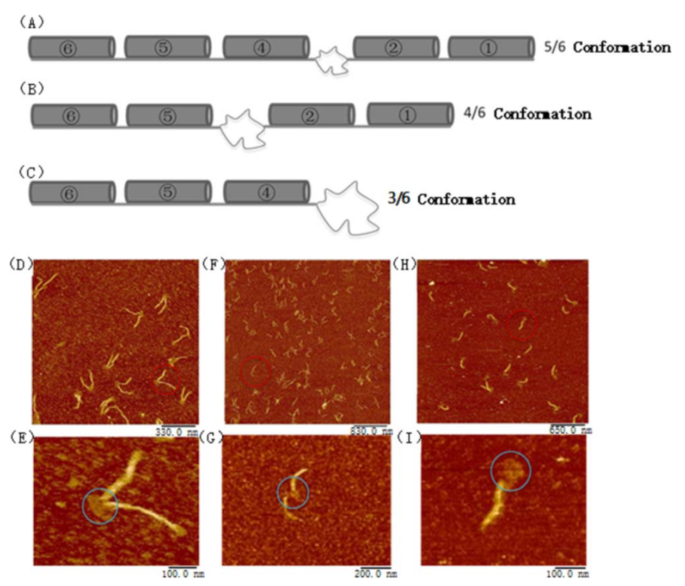

**Programmable and scalable assembly of a flexible hexagonal DNA origami**

柔性六边形DNA折纸的可编程和可扩展组装，2021

# 一、文章简介

# 二、文章内容

## Abstract

**背景：**

纳米级结构在纳米机器人、纳米机器和许多其他设备的构建中显示出相当大的潜在应用价值。

**提出新方法：**

在这项研究中，<u>组装了一个六边形DNA折纸环</u>，并通过原子力显微镜进行了可视化观察。

- 本文的<u>DNA折纸的形状可以被编程成六边形或线性形状，即具有打开或折叠的图案</u>。
- 这种柔性折纸对动态的模式识别具有鲁棒性和可切换性。
- 它的<u>边由六束DNA螺旋折叠而成，这些螺旋可以打开或折叠成蜂窝形状。</u>
- 这些<u>边被编程为凹凸图案，这使得折纸和二聚物之间可以连接。</u>
  - （化学上，凡是两个分子结合成一个新的物质，无论是物理作用还是化学变化，都可以将生成的物质称为二聚体。）
- 此外，在<u>每个边中嵌入生物素-链霉亲和素标记</u>，用于纳米校准。

**实验结果：**

原子力显微镜结果证明了柔性DNA折纸环的稳定性和高产量。

**意义：**

多态纳米结构对于 结构化的探针和传感器 的动态纳米构建和校准 非常有用。

**Keywords:** DNA origami, polymorphous nanostructure, changing patterns

## Introduction

**背景：**

- DNA被认为是纳米制造的优良材料。

- Seeman[1]最初提出，DNA分子（从“单链对”到“双螺旋”）可以是可编程的、生物相容的[2-5]、柔性的、刚性的和稳定的，并且可以表现出纳米级的尺寸。
- DNA纳米结构已经被广泛应用于众多领域，包括纳米结构的构建、计算、纳米电路、生物传感器和分子机器人等[6-13]。
- 结构探针和传感器在癌症的早期诊断中表现出明显的潜在应用价值，并且被认为对病毒的检测和靶向具有高灵敏度(如登革热病毒)。

**DNA折纸的发展与引出柔性折纸结构：**

- 2006年，Rothemund提出了旨在设计几种二维纳米结构的DNA折纸技术[14]。
- DNA折纸设计了一条长的环状链（scaffold），scaffold在特定的位置与许多短链（staple）结合，从而紧密折叠，并形成预先设计的结构。
- 自首次报道以来，各种DNA折纸结构被开发出来[6, 15–20]。研究人员已经证明可以构造任意的二维折纸结构或线框；此外，随着进一步的发展，一些三维结构已经被开发出来[19–21]。
- 在这些结构中，柔性结构引起了人们极大的研究兴趣。

**柔性折纸结构用于分子机器：**

- 柔性折纸基元在分子机器的组装中起着至关重要的作用，包括DNA马达、分子镊子和纳米发动机等[22–24]。
- Wickham等人实现了一种基于DNA的分子马达，可用于导航一个网络和装载或卸载纳米颗粒[25]。
- 此外，Ketterer等人报道了一种磁场驱动的基于DNA的气缸 ( cylinder ) 发动机[26]。

**DNA折纸用于疾病研究：**

- 近年来，DNA折纸作为配体-蛋白质模板的表位（抗原决定基） ，已成为疾病研究的前沿热点[27-32]。

- 为了探索抗体的空间耐受性，已经构建了固定的折纸表位。
- Rinker等人发现距离可以影响蛋白质在折纸表面的亲和力[27]，Shaw等人设计了一个具有“距离定义的配体（distance-defined ligand）”的折纸受体，来激活人的乳腺癌细胞[28]。
- 此外，Shaw等进一步证明了抗原的结合距离在启动抗体效应功能中起主导作用[29]。
- 最后，Veneziano等人构建了一个具有受控抗原的二十面体折纸结构，来模拟人类免疫缺陷病毒免疫原[30]。

**柔性折纸相比于固定的折纸结构的优点：**

- 固定的折纸结构不能用于协调抗体-抗原相互作用的 "诱导-拟合" 模型。
- 为了克服这一限制，柔性折纸结构被提出以匹配瞬态构象（transient conformations）。
- 例如，Kwon等人设计了一个具有多价空间模式识别能力的（multivalent spatial pattern recognition）的五角星形折纸，用于病毒检测和抑制[31]，Zhang等人使用折纸表位描述了瞬时抗体构象[32]。
- 因此，具有特定抗原模式的柔性折纸结构在结构探针和传感器方面非常有用。

**本文总述：**

- <u>本研究开发了一种柔性六边形折纸结构，其能够展示边的打开或关闭，其形状被设计与编程为：可以从六边形环变为柱状。</u>

- <u>此外，将生物素-链霉亲和素标签嵌入六边形环的每个边，以便更容易检测，这也证明了这种六边形结构用作柔性生物传感器或药物载体的潜力。</u>

## Methods

### Structure design

使用有 “蜂窝点阵”（honeycomb lattice）模块的caDNAno软件（http://cadnano.org）来设计六边形折纸结构。

<u>6个双螺旋被绑定在一起，使其能够形成一条边，6条边的36个螺旋 形成了六边形折纸结构</u>（图1）。

- 图1：六边形折纸的设计方案，<u>每条边由6个双螺旋组装而成，并首尾相连</u>；六边形折纸的三维视图。

<u>这些staple链的螺旋角为120°，与每个骨架的转角一致。</u>

<u>六个骨架被绑定在蜂窝的每个边上，这些边首尾连接，以形成六边形结构。此外，在每条边的末端保留8nt长的未配对碱基，以防止碱基堆叠</u>（图S1）。

- 图S1：<u>六边形折纸的caDNAno设计图</u>。

### Materials

**DNA链：**

- 所有DNA链均购自 Sangon Biotech  (中国上海)，经高效液相色谱纯化。将链溶解在含有12.5 mM Mg2+的 (1 ×) TAE缓冲液中，终浓度为100 μM。

**凝胶电泳：**

- 该折纸通过电泳在1%琼脂糖凝胶上纯化，这个琼脂糖是在（1×）TAE缓冲液中溶解的，并加入了4SGelRed核酸染料（BBI Life Science Corporation, Shanghai, China）。凝胶电泳结果见图S3。
- 经凝胶萃取法的纯化样本的浓度相对较低。补充的AFM图像的视场（view field）均为2 μm。这是因为生物素-链霉亲和素点在较高的视野下无法识别，而在较低的视野下无法获得足够的样本。

我们使用绿色圆圈标记了所有潜在的生物素-链霉亲和素点。在本部分的最后，统计计算了链霉亲和素附着的结合效率、折纸形状改变的结合效率。

<u>线型折纸的分子量与六边形折纸相同，但线型折纸的形态膨胀性更大，占据的水平空间范围更广。因此，它比六边形结构移动得慢。</u>

- 图S3：凝胶电泳结果。
  - A：三个泳道从左到右依次为：M13、六边形折纸、线性折纸
  - B：左边的两个是线性折纸，右边的三个是六边形折纸。

将凝胶浸泡在 (1 ×) TAE缓冲液中，在80 V，100 mA直流电下作用2 h。切取目的凝胶条带，在( 1 × ) TAE缓冲液中25℃孵育12 h，分离折纸样本。

最后，使用超滤100k管（Millipore, Billerica, MA, USA）对样品溶液进行富集。

**AFM成像：**

纯化后的样本使用 Multimode 8 serial 原子力显微镜（AFM; Bruker Corporation, Billerica, MA, USA）进行扫描。

简而言之，将10 μl 新鲜样品移液到透明云母表面，并保持5分钟不受干扰，以使折纸完全附着在云母表面。接下来，在压电台上放置带有钢圆盘的云母结构。当AFM置于自动扫描模式时，压电台会靠近扫描探针 (Fluid tip, Bruker Corporation)。

自动扫描模型参数如下：

- approaching force：0.075 V;
- scan rate：2 Hz; 
- and lines：1024.

### Annealing Process

## Results and discussion

### 实验结果与AFM成像 

1. 所有的staple和scaffold链都以1:10的比例混合，M13 scaffold 和staple的终浓度分别为5nM和50nM。
2. 在热循环仪 (Hangzhou LongGene Scientific Instruments, Hangzhou, China) 中，将混合溶液在 95 ° C至 4 ° C的温度范围内进行退火。
3. 接下来，样品通过电泳纯化，浓缩至浓度为2 nM、50 μl。

图2展示了具有代表性的柔性六边形折纸的AFM图像，实现了较高的良品率。

<u>环状结构的形状是随机的，边与边之间的铰链角度受它们之间的作用力的影响。标准六边形的长度和宽度分别为63.5 nm和3.6 nm。测量得到的长度与设计方案中提到的几乎相同。</u>

- 图2：六边形折纸结构的原子力显微镜成像。
  - a：折纸结构散落在扫描表面上。比例尺：3 μm。
  - b：六边形折纸的详细图像。给出了长度和宽度。比例尺：750 nm。

### 用生物素修饰六边形折纸

<u>在折纸表面上添加了生物素-链霉亲和素标签，在外部的staple链的3‘端延伸了5个T核苷酸</u>（图3a）。

- 图3a：生物素-链霉亲和素标记的六边形折纸结构。六边形折纸上生物素-链霉亲和素嵌入位置的设计方案。

我们<u>选择了每条边上的staple（共6条）进行生物素修饰</u>。这些staple的具体序列和位置见图S2和表S1。

- 图S2：<u>黄色点是生物素修饰的staple链的位置</u>。见表S1。

- 表S1：<u>我们在3 '端添加了4个poly -T 用于生物素修饰</u>。

### 生物素修饰六边形折纸的实验结果

**实验步骤：**

1. 首先，将scaffold和staple混合并退火，以形成折纸结构，如"Method"部分所述。
2. 接着，将折纸和生物素化的链 (Sangon Biotech Corp.) 以1：20比例混合，并在45℃至4℃的温度下重新退火3小时。
3. 最后，在样品中加入链霉亲和素溶液( 20 × )，混合物在25℃下孵育1小时。在最后一步中，通过超滤管将所有过量的链进行纯化。

**AFM图像：**

图3为生物素-链霉亲和素标记的折纸结构的代表性AFM图像。

<u>生物素-链霉亲和素分子的位置没有完全匹配图3a中预测的设计，可能是由于分子的漂移引起的。当扫描针刮过这些点时，可能会拖动它们，从而改变它们的位置。</u>

因此，成功地开发了六边形折纸结构，并有效地将生物素-链霉亲和素分子添加到其表面。

- 图3：生物素-链霉亲和素标记的六边形折纸结构。
  - b：生物素-链霉亲和素标记的折纸结构，视野：1.0 μm。
  - c ，d：折纸结构的详细成像。
  - c：比例尺1 μm
  - d：红色圆圈表示生物素-链霉亲和素分子；比例尺：0.3 μm

**结果阐述：**

- 我们使用了6条具有生物素修饰的特异性链。预测生物素-链霉亲和素的连接效率为100 %；然而，这一数值接近70 %。
- 图S1-S13都是我们得到的纯化结果。少量生物素-链霉亲和素点模糊不清，并且有一些点可能被折纸的边遮挡。但由于纯化结果数量较多，统计结果较为可靠。

此外，我们<u>还观察到了某些缺陷结构的存在。有少数结构未能连接成六边形状，而其他的一些结构是随机扭曲的。</u>我们对几个纯化的样品进行了扫描和统计分析。如图S4-S9和 ”Yield statistics“ 部分所示（图S14-S15），缺陷结构的比例约为6%。

- 图S4：经凝胶纯化的六边形折纸。共有7个折纸，其中2个是形状改变的。用绿色点标记可能的生物素-链霉亲和素。我们手动统计了七个折纸上所有可能的点。

- 图S5：经纯化的结果。有13个折纸，可能的生物素-链霉亲和素被绿色点标记。

- 图S6：经纯化的结果。有6个折纸，可能的生物素-链霉亲和素被绿色点标记。

- 图S7：经纯化的结果。有5个折纸，我们标记了其中的三个。

- 图S8：经纯化的结果。有10个折纸，我们标记了其中的7个。

- 图S9：经纯化的结果。有9个折纸，其中1个发生形变。

样品在上一步中已经附着上标记。我们怀疑标记可能会从结构中脱落。为了鉴定生物素-链霉亲和素标记的连接效率，我们在纯化的样品中加入过量的链霉亲和素溶液。以下结果为额外加入链霉亲和素溶液的凝胶纯化结果。

- 图S10：使用额外的链霉亲和素的纯化结果。一些折纸堆叠在一起。我们怀疑它们是通过边的钝性末端堆叠而成的。高亮的白色区域为堆积位置。

- 图S11：使用额外的链霉亲和素的纯化结果。

- 图S12：使用额外的链霉亲和素的纯化结果。图中有9个折纸，其中一个发生了形变，我们标记了其中5个。

- 图S13：具有生物素-链霉亲和素标签的典型六边形折纸。

- 图S14：经纯化的 用生物素-链霉亲和素标记的样本 的连接效率 的统计分析

- 图S15：使用额外的链霉亲和素对纯化样品进行统计分析。 

**从上面的图S3 ~图S8中，我们标记了42个折纸**

- 有4个具有6个标记的六边形折纸，有10个具有5个标记的折纸，有16个具有4个标记的折纸，有12个具有3个标记的折纸。总的连接效率约为70 %。

**我们在图S9 ~ 图S12中标记了15个折纸**

- 有2个具有六个标记的六边形折纸，有5个具有5个标记的折纸，有7个具有4个标记的折纸，有1个具有3个标记的折纸。总的连接效率约为75 %。

<u>**三种缺陷结构均呈线状**</u>

- <u>部分结构随机地扭结在一起。</u>
- 以上扫描的原件总数为49件；其中有三个是缺陷结构。<u>缺陷结构的比例约为6%。总的来说，连接效率在70%左右。</u>可能会有细微的偏差，因为有些标记是错误识别的。由于纯化结果的数量较多，所以统计结果是可靠的。

### 线性折纸

<u>这个六边形折纸是由六个杆状的边循环组装而成的。</u>

根据设计原理图，<u>第六条边的松动将导致其形成一个短的线性折纸。前5条边利用了M13的6030 nt，5条边的直线总长度应为330 nm。剩余的M13 ( 1219 nt )的长度可以达到414.5 nm。</u>

<u>理论上，前五条边可以组装成一条线。</u>图4显示了AFM结果。

- 图4：具有前五条边的线性折纸。
  - a：视野：1.85 μm
  - b：视野：4 μm

我们得到了短的线性折纸，正如预测的那样。

然而，<u>在溶液中观察到，大多数结构是弯曲的，形成了圆弧而不是直线。</u>此外，<u>在该样品中发现了双折线</u>（two-folded lines），如图4a的中心区域所示。结构的顶部趋向于形成关节端（joint end），因为这些结构的顶部区域积累了小白点。

<u>为了比较六边形折纸结构的刚性和获得更长的线条，我们改变了设计方案，将折纸重新编程为线性结构(图5a、b)。通过底部螺旋结构将六条边连接在一起。</u>实验方案与开发六边形折纸所使用的实验方案相同。线性折纸的AFM图像（图5c、d）表明，<u>由于396 nm长的双螺旋没有足够的刚性来使六条边维持在一条线上，因此折纸形状是柔性的。</u>

- 图5：不同构象的线性折纸结构。
  - (a) 5/6、(b) 4/6、(c) 3/6 三种构象的设计方案。
  - 线型折纸结构的(d)、(e) 5 / 6、(f)、(g) 4/6和(h)、(i) 3/6 构象的原子力显微镜图像。
  - (e), (g), (i) 中的蓝色圈表示打开的边（opened edges），看起来像带状物，与管状部分（封闭部分，closed part）相连。
  - 在(e)中的带状物可以观察到线条，而在(g)，(i)中，打开的部分不太清楚。
  - 比例尺: (d) 330,  (e) 100,  (f) 830,  (g) 200,  (h) 650,  (i) 100 nm.

### DNA双螺旋的维持长度

- DNA双螺旋的维持长度为50 nm [33]；
- 因此，在溶液中，线性折纸结构呈现为由六个可识别的“独立边”组成的随机串（图5d），底部双螺旋结构作为铰链连接着这些边。

<u>B型DNA双螺旋的维持长度为50 nm。因此，六个螺旋束组成的DNA边应该是足够坚固的。</u>

<u>然而，我们发现线性折纸在溶液中呈弯曲形态。我们分析了这些线性折纸的持续长度。</u>结果以图S16和S17给出。

<u>平均持续长度为100 ± 18 nm</u> (标准偏差为18 )。

通过软件计算线性折纸的轮廓长度和距离长度，并附在表S2 "Lines with statistical analysis"部分。

- 图S16：线性折纸的分析。用Image J软件测量轮廓长度（contour length）和端到端距离（end-to-end distance）。轮廓长度为428.4 nm，端到端距离为392 nm。

- 图S17：线性折纸的分析。
  - a：原始AFM图像。
  - b：绿色线条是所选折纸的轮廓线。用Image J软件计算这些绿线的长度。

我们在图17B中选取了20个折纸，通过软件测量了它们的轮廓长度和端到端距离。结果见表S2。

- 表S2：轮廓长度和端到端距离的测量。

我们对选取的20个折纸进行了测量。这些线性折纸的均方端到端距离（mean square end-to-end distance）为81826.74。采用二维平衡方程式（1）来计算维持长度[1]（The 2 dimensions equilibrium, formulation (1)）。

<R2>2D 为由表S2得到的均方端到端距离，L 为轮廓长度，Lp 为持续长度。我们将这20个 L 值和常量<R2>2D 带入公式( 1 )，通过MATLAB分别计算了20次。然后，我们得到了20个结果。20次测定结果( Lp )的平均值为100，标准偏差为18 (standard deviation) 。因此，维持长度为100 ± 18nm。

### 构建折纸的开-闭模式

<u>为了构建折纸的 “开-闭” 模式，对蜂窝状的边进行开口处理，其中一些边被封闭，另一些边被打开。</u>

构建了5/6，4/6和 3/6的构象( 图6a-c )，根据这些构象而改变打开的边。选择可用于连接上、下两条边的连接链；然后，这些边被打开并且附着在云母表面上，形成一个平面形状。实验方案与开发六边形折纸结构所使用的实验方案相同。将所有链混合( 1：10比例)，并在95℃至4℃温度范围内进行线性退火。打开构象的AFM图像( 图5d-i )清晰地显示了打开部分和闭合部分。

- 图6：线性折纸结构。
  - a：线性折纸结构的设计方案。在黄色方形中highlight出的蓝色线表示不成对的连接序列。
  - b：表示线性折纸结构的长度。
  - c：线性折纸结构的原子力显微镜图像。比例尺：4.6 μm。
  - d：详细查看六条边，比例尺：0.4 μm。

<u>打开的构像不够稳定，就像溶液中的断裂线一样；然而，多种构象之间的拓扑差异是可以区分的。</u>

此外，<u>如图5所示，线性折纸的末端区域呈现出凹凸的形状。</u>我们展示了四个双螺旋的截断，<u>如图6A左面板所示。接下来，对应的四个双螺旋(黄色方框)从右端伸出。由于碱基力的作用，互补的末端会叠在一起，凹凸的末端可以展示出拓扑连接的实现。</u>

<u>DNA折纸拓扑连接力强于碱基配对。由于使用了碱基堆积力(疏水性力)，可以预期这些线性初始物（linear origin）会稳定地连接在一起。</u>

### 退火绑定线性折纸结构

实现了一种分层退火方案，来绑定线性折纸结构。

首先，退火方案与用于组装单个折纸结构的退火方案相同。

其次，将纯化后的折纸结构在50°C-4°C温度范围内线性地重新退火10 h。初始孵育温度为50 ° C，这个温度被认为是适合分子热力学的温和温度。在此温度下，分子的热运动极为活跃，为碱基堆积(拓扑连接)提供了很高的概率。然而，这个温度并不足以破坏结构。图7所示的具有代表性的AFM图像显示，<u>连接而成的组装体主要是二聚体。</u>选择一个典型结构进行进一步分析，扫描了一个组装体(图7b)。<u>大型的组装体较少，可能是由于连接效率较低。因此，由于尺寸的增大使连接率的显著降低，不易形成较大的组装体</u>[11,15,20].。

- 图7：拓扑连接的原子力显微镜成像。比例尺：(a) 4.0 μm 、 (b) 1.2 μm。

### 总结

总而言之，<u>本文描述了具有生物素-链霉亲和素标记的边的柔性六边形折纸的结构。该折纸中每个标记的距离由边的长度决定。</u>

1. <u>此外，我们设计了两批不同的线性折纸；短结构是基于六边形折纸的前五条边组装而成，作为对比样品。较长的结构被重新设计并编程，以在另一批次中呈现类似棒状的形状。</u>
2. <u>接下来，我们进行了实验，打开线性折纸的特定边以形成三种不同的构象。这些打开的边类似于带状，而封闭的边类似于管状。</u>
3. <u>此外，采用凹凸的形状设计了线性折纸结构，以实现拓扑连接的建立。</u>

总的来说，<u>这些结果表明这种六边形折纸是柔性的，底部的螺旋起到铰链的作用，将六条边固定在一起。</u>

因此，由蛋白质组成的这类柔性折纸可以用于匹配病毒的瞬时构象。在未来的研究中，需要探索这种与抗原结合的折纸在探索特定病毒的空间模式方面的潜在用途。

# The DNA sequences

见Support

