**Integration of DNA–RNA-triplex-based regulation of transcription into molecular logic gates**

将 “基于DNA-RNA-三链体的转录调控”整合到分子逻辑门中，2023

# 一、文章简介

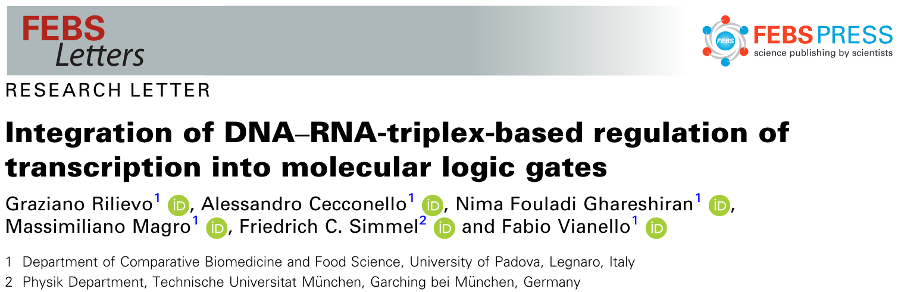

# 二、文章内容

## 缩写

**DFHBI-1T：**((Z)-4-(3,5-difluoro-4-hydroxybenzylidene)-2-methyl-1-(2,2,2-trifluoroethyl)-1H-imidazol-5(4 H)-one)，是一种RNA适配体荧光探针

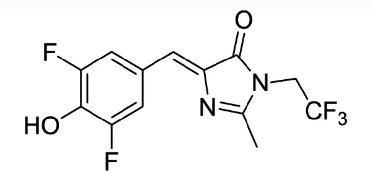

**EMSA：**electrophoretic mobility shift assay，电泳迁移率变动分析

**lncRNA：**long noncoding RNA，长链非编码RNA

**RNAp：**RNA polymerase，RNA聚合酶

**rNTP：**ribonucleoside triphosphate，核糖核苷三磷酸

**TFO：**triplex-forming oligonucleotide，组成三链体的寡核苷酸

**TTS：**triplex target site，三链体靶位点

**TU：**transcription unit，转录单元，是一段从启动子（promoter）开始至终止子（terminator）结束的DNA序列。RNA聚合酶从转录起点开始沿着模板前进，直到终止子为止，转录出一条RNA链。

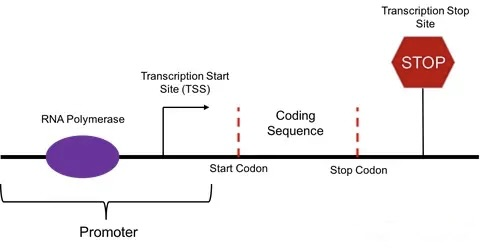

**XNOR：**exclusive NOT-OR，同或

**XOR：**exclusive OR，异或

## 摘要

**背景：**

- 近年来，越来越多的非编码RNA分子被鉴定为：其是参与基因调控的内源性 DNA-RNA杂交三链体 的可能组成部分。

- 三链结构有潜力参与复杂的分子信号网络，如果能理解其机制，可以实现生物计算组件的工程化。

**研究结果：**

在这里，通过利用**荧光RNA适配体**的转录过程中，这种三链体的增强和抑制作用，我们在体外证明了基于三链体的分子门的构建：“异或”（XOR）、“同或”（XNOR）和阈值门。

**意义：**

- 生物分子集成系统展示了在广泛的转录输出范围内的精确调节，从显著的抑制到显著的增强。

- 这项研究成果是利用DNA-RNA三链体纳米结构开发出分子门的首个例子。

**Keywords：** aptamer; Escherichia coli; fluorescence; promoter; synthetic biology; r70

## 引言

### 背景

#### 非双链的核酸结构的作用

- 在合成生物学的工具箱中，形成可替代的、非双链的核酸结构是控制生化过程的一种有价值的方法。

- 这是由于多种原因造成的，包括它们 与生物靶点（如基因启动子和内切酶切位点）的相互作用、通过特定的稳定剂的调节能力、与其他天然或人工的单链和双链核酸结构的兼容性等。

- 此外，非典型的核酸结构似乎通过 基因表达的调控 在细胞分化和癌症发展中发挥作用。

这些生物机制通常可以被表示为门控机制，其中分子信号在诸多刺激中与一个"操作器"（operator）相互作用，这个操作器将信号解释为输入，生成一个类似于门的输出，从而实现分子计算。

#### 杂交的三链体结构

在众多的核酸超分子结构中，杂交的三链体结构由双链DNA和单链RNA组成，这些RNA以平行或反平行的几何结构与双链的<u>同源</u>嘌呤序列( A , G)相互作用。

​        ***同源：**同源也就是指来自于同一个祖先，两个物种从同一个祖先分化后，与不同的环境发生相互作用，其相应的DNA序列将各自发生一些替换或者插入缺失突变，也就是说序列不再精确相同。比如同一个大肠杆菌的祖先，经过不同的时间和空间的差异累积，最终就分化成不同类型的大肠杆菌。不同样品之间是同源的关系。**相似性**仅仅是指字符串的相似 ，并不具有生物学意义*

图1A为杂交DNA-DNA-RNA三链体的2个主要基序：嘧啶基序( C-G·**C** , T-A·**U**)和嘌呤基序( C-G·**G** , T-A·**A**)的示意图。这些结构通过被称为Hoogsteen相互作用的氢键稳定，它们被认为通过与DNA结合蛋白竞争来发挥基因调控作用。

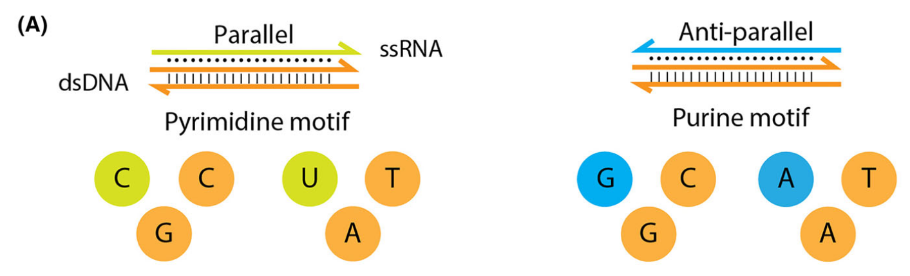

- 图1A：DNA - RNA三链体结构中嘧啶基序(左)和嘌呤基序(右)的示意图。橙色代表DNA，而绿色或蓝色分别代表嘧啶富集或嘌呤富集的RNA。

#### RNA-DNA三链体参与基因调控

近年来，一类称为长链非编码RNA ( long noncoding RNA，lncRNA )的RNA家族被发现在真核生物中参与基因调控，RNA-DNA三链体被认为参与其中。

如今，DNA / RNA纳米结构在生物体中发挥的作用比先前认为的更基本，这一发现模糊了纳米材料和生物科学应用之间的界限。

#### 荧光RNA适配体

近期引入的荧光<u>RNA适配体</u>，结合商业化、价格适宜的定制序列寡核苷酸的可获得性，为该领域提供了研究此类核酸结构的有力工具。

​        *发光 RNA 适体或荧光发光适体 (FLAP) 是一种基因编码的 RNA 成像平台。 它们旨在结合特定的荧光染料，这些染料仅在结合状态下“发光”。*

具体而言，荧光RNA适配体的体外聚合**允许通过 荧光发射的变化 来检测转录活性**，这些变化与RNA-配基复合物的浓度增加相关。这种方法**可以直接测量转录速率**，并可对<u>转录本</u>进行可视化和显微定位，从而避免了额外染色并防止了外部偏差的引入。

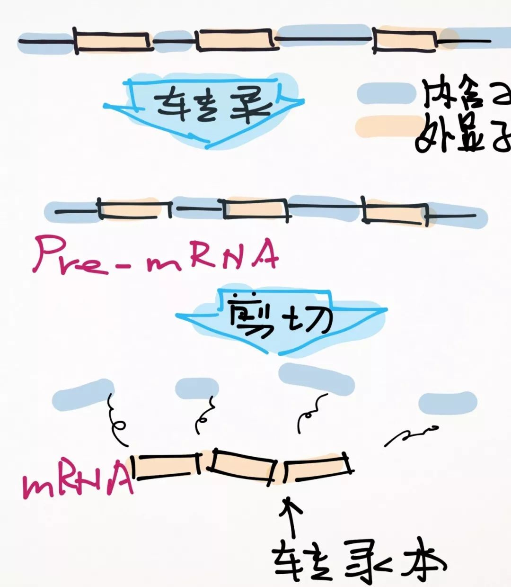

### 文章总述

本课题组最近发表的一篇文章中首次强调了：形成三链的RNA寡核苷酸( triplex- forming oligonucleotides，TFOs )作为上调或下调转录的分子工具的潜力。

简而言之，三链体复合物的形成影响转录速率取决于：

- ( a )三链体靶位点( triplex target site，TTS )距离+ 1 (即,转录本的起始)的位置
- ( b )TTS在正义链或模板链中的位置（DNA上携带有编码蛋白质、氨基酸信息的核苷酸序列的链称为正义链，又称编码链 ）
- ( c )三链体基序

1. 在这里，我们**描述和讨论了影响三链体产率的不同参数的优化，以及对聚合速率进行微调**，并揭示了之前未知的TFOs和转录单元（TUs）的分子细节。

2. 最重要的是，我们证明了**使用三链体作为具有逻辑门机制的生物分子传感器的可行性**，因此，它们未来可能在细胞中构建生物计算网络发挥作用。

3. 具体来说，我们展示了具有代表性的基于三链体的设计，这种设计**展示了 逻辑门输出行为( XOR和XNOR) 和 阈值门的分子实现。**

4. 总的来说，该研究**证明了增强和抑制的三链体效应因子的整合**，这种效应因子导致了转录调节的范围远远超过了先前的研究，并为其在 转录-翻译系统 中的应用铺平了道路。

## Result

### TU、TFO、TTS

**基于大肠杆菌 σ70的工程化TU包含了一个用于Broccoli荧光适配体的转录模板的上游启动子，这个TU的序列被修饰以包含用于与RNA寡核苷酸形成三链体复合物的靶位点（TTS）**（所有DNA和RNA序列见表S1）。

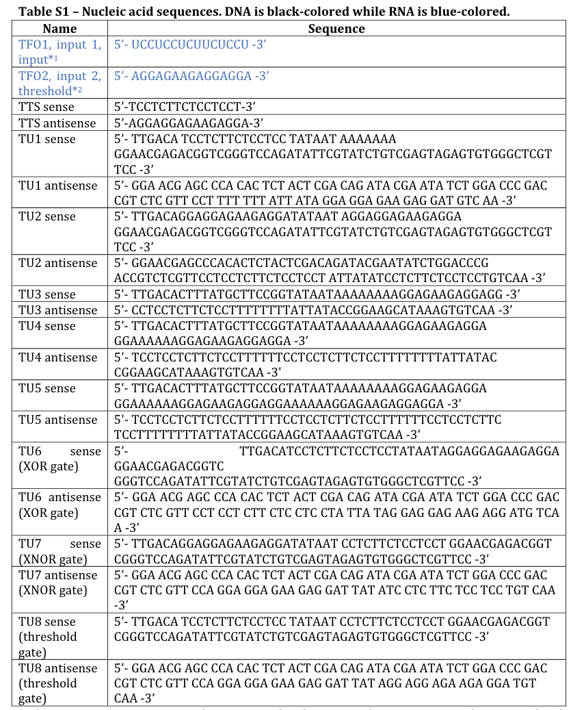

- 表S1：核酸序列。黑色的为DNA，蓝色的为RNA。
  - TFO1序列被用作XOR和XNOR门的输入1，并作为阈值门的输入。
  - TFO2序列被用作XOR和XNOR门的输入2，并作为阈值门的阈值。

图1A为使用 全嘌呤基序 或 全嘧啶基序 表示的最稳定的杂交三链体的示意图。

- 图1A：
  - **这些短的RNA序列，称为组成三链体的寡核苷酸（TFO**），它们被用来测试它们对工程化TU的转录速率的影响（engineered TU/人工调控的TU/工程化TU）。

使用体外聚合时 Broccoli适配体-DFHBI-1T复合物 形成过程中的荧光发射变化 以及其伴随的量子产率 来估计转录速率。

图1B展示了Broccoli配基DFHBI-1T，及其预测的适配体二级结构（nupack.org, Caltech），其末端被延长以增加适配体的稳定性。

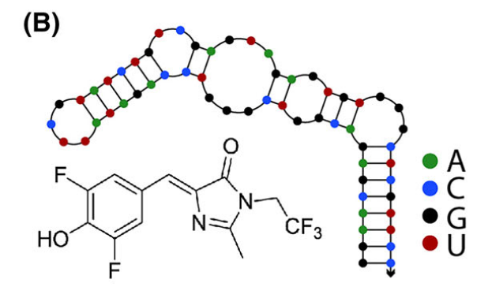

- 图1B：预测的Broccoli适配体（aptamer）的结构和荧光配基（ligand）DFHBI-1T的分子结构。

三种不同的TTS设计可以被放置在σ70启动子的非保守区域内（图1C、表S1）。

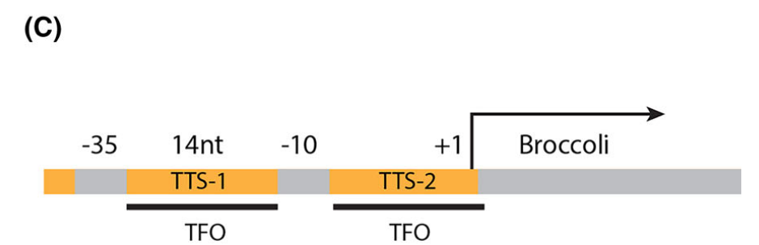

- 图1C：σ70细菌启动子的结构。
  - 三链图靶位点TTS-1和TTS-2用橙色表示，而各自的RNA TFO用黑色线条表示。
  - -35，14nt，-10，+1分别表示：
    - -35：<u>保守序列</u>位于转录起始核苷酸上游的35nt
    - 14nt：14nt的非保守区域
    - -10：保守序列位于转录起始核苷酸上游的10nt
    - +1：转录起始核苷酸

具体来说，这些TU基于大肠杆菌通用的启动子结构，包含了共有序列-35和-10，以及位于这两个序列之间的TTS-1 或 位于-10和转录起始核苷酸+1之间的TTS-2的人工TTSs。第三种设计是将两个TTS都包含在同一个启动子中，称为TTS-3。

*保守序列（Conserved Sequence ）：指DNA分子中的一个核苷酸片段或者蛋白质中的氨基酸片段，它们在进化过程中基本保持不变。*

### 采用熔解曲线分析评估三链体的形成

采用熔解曲线分析评估三链体的形成(图1D、E)。

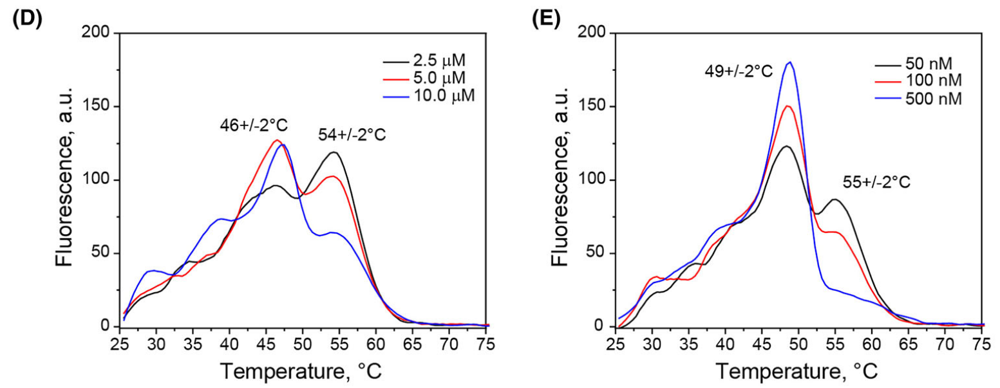

- 图1D、E：溶解曲线显示了：TFO1 ( D )或TFO2 ( E )在含有100 nM双链TTS的溶液中孵育时，520 nm处的噻唑绿发射。从至少8个独立的熔化实验中估计了与熔化温度有关的误差。

在这些实验中，我们受基于经典增色现象实验或荧光基团修饰的寡核苷酸的溶解温度测定的普遍问题的影响，对现有的三链体分析方法进行了改进:

- 我们使用核酸荧光染料噻唑绿(发射波长为520 nm)作为三链体和双链体变性的报告子。曲线清晰地显示出两个峰值，分别对应于TFO1 -或TFO2 - TTS三链体和双链DNA的变性事件，对应的溶解温度分别为46±2 ° C或49±2 ° C和55±2 ° C（图1D、E）。

**结果表明，相对于双链体，三链体分离发生在较低的温度，这与三链体复合物较低的稳定性相一致。**值得注意的是，使用常见核酸荧光染料进行熔解温度测定的当前方法，可以成功地区分TFO-TTS配对中双链和三联体的变性峰。

此外，熔解曲线分析显示出在TFO浓度的一定区间内的归一化的三链体熔解温度的Sigmoid拟合（图1F、G），结果得到的嘧啶基序相关和嘌呤基序相关的解离常数，为572和135 nM，与先前报道的值一致。

- 图1F、G：分别对TFO1-TTS或TFO2-TTS三链体的熔解曲线进行分析，分别将D和E中的三链体/双链体峰值的比例绘制在相应的TFO浓度上。误差棒表示三个独立实验的标准差。TTS和TFOs的独立曲线在图S1和S2中。

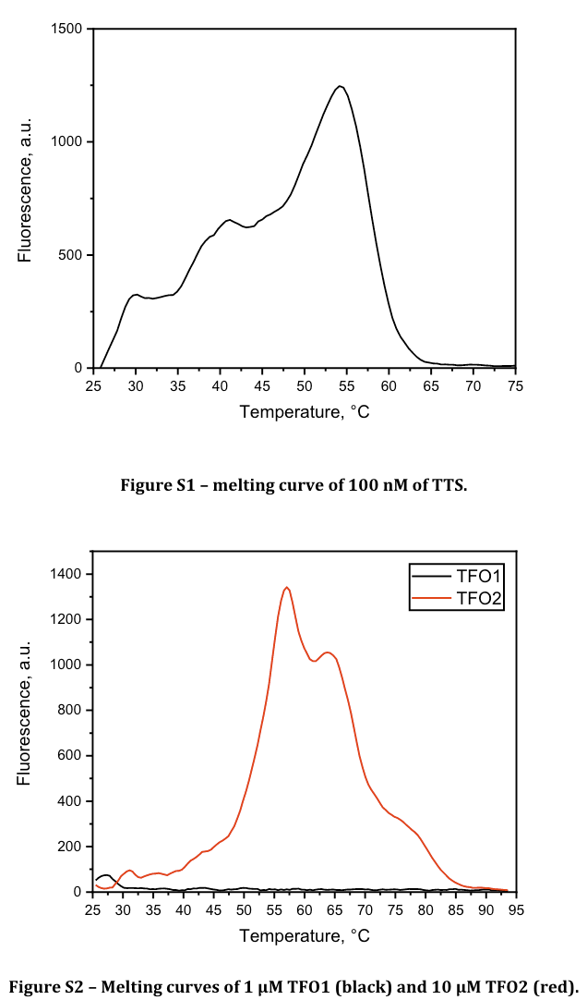

- 图S1：100 nM TTS的熔解曲线。
- 图S2：1 μM的TFO1（黑色）和10 μM的TFO2（红色）的熔解曲线。

### 增强和抑制TTS - TFO组合图谱

在此基础上，设计了增强型和抑制型TTS-TFO组合图谱，将它们的作用整合到更复杂的TU中（图2A）。

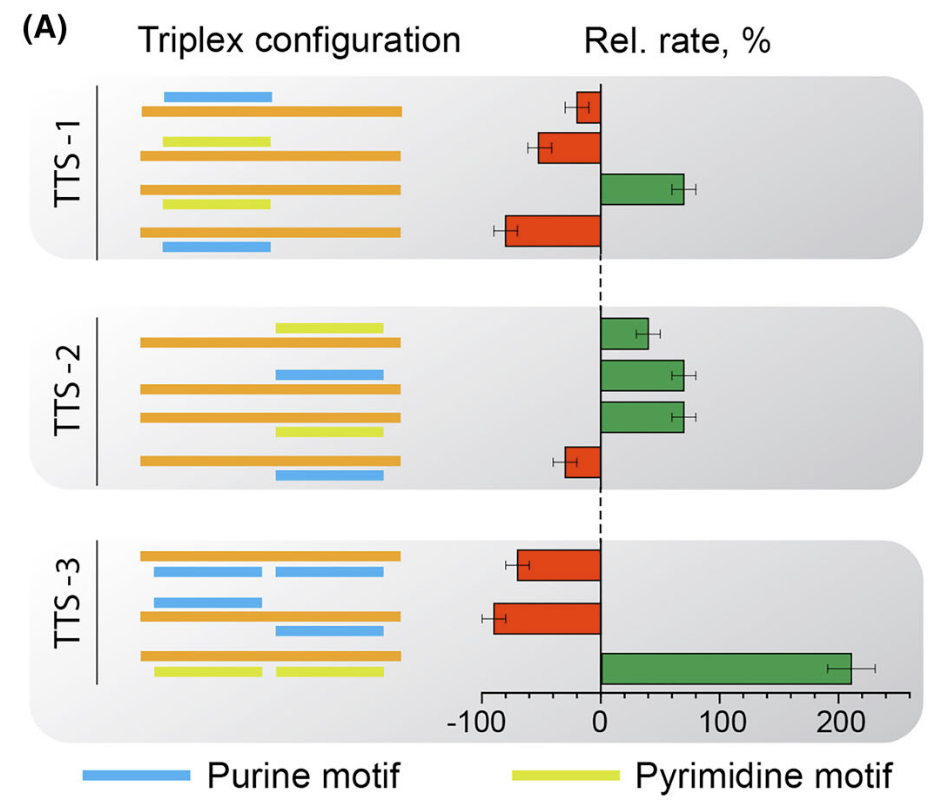

- 图2A：
  - 橙色表示工程化的人造启动子，绿色表示嘧啶，蓝色表示嘌呤，以及不同结构对转录速率的相关影响，表示为抑制(红色)或增强(绿色)的百分比。
  - 这些设计被分为包含一个TTS在-10位置上游的TTS-1，包含一个TTS在+1位置上游的TTS-2，或包含两个TTS组合的TTS-3。
  - 左半部分：转录单位内TTSs的几何结构；右半部分：三链体形成对Broccoli聚合速率的影响。红色条表示抑制的百分比，绿色条表示增强的百分比。
  - 在同一启动子中，其中两个嘌呤基序TTS的抑制作用最强( 约-90% )，而两个嘧啶基序TTS的增强作用最强( 约+200% )。

作者认为，这种TTS-TFO相互作用不仅仅可以建立ON / OFF数字系统，还可以理想地扩展，并用于实现例如基于分子机制的连续值计算。

### 优化聚合条件

在接下来的步骤中，我们着重于优化聚合条件，因此进行了一系列实验来测试该系统。

#### pH依赖的活性评估

首先，进行了一个pH依赖的活性评估，这个评估使用了转录单元TU1，pH范围为5.5~7.5，结果表明，在我们的实验条件下，最适于用于产生Broccoli的大肠杆菌RNAp的pH为碱性， 尽管其在微酸性条件下仍表现出活性（图2B）。

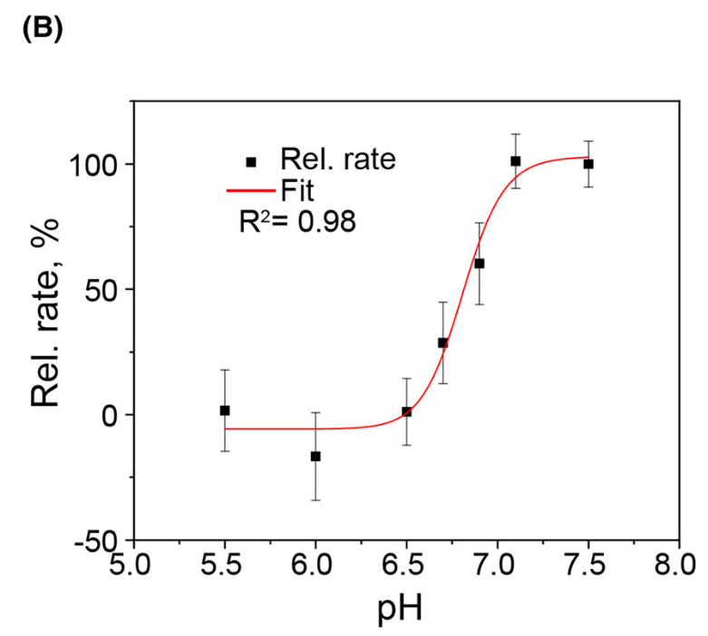

- 图2B：不同pH值下RNA聚合的相对速率。

一方面，由于酸性pH会抑制RNAp酶的催化；另一方面，碱性pH会破坏嘧啶基序三链体的稳定性，因此选择近中性的pH，以用于三链体的形成，以兼顾酶的最适pH和促进三链体形成的pH。

#### 核糖核苷酸混合物的浓度

图2C显示了在不同的核糖核苷酸混合物的浓度下（0.5 ~ 4mM），40nM的双链DNA模板的转录的相对速率 ，显示出线性依赖性。

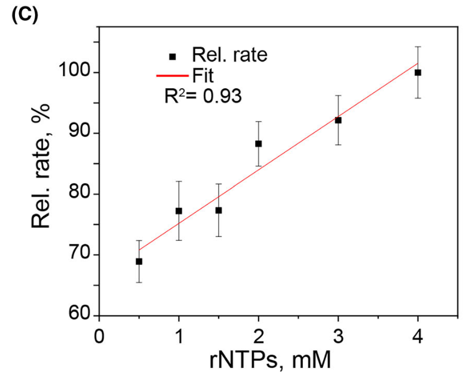

- 图2C：不同核糖核苷三磷酸( rNTP )浓度下的RNA聚合相对速率（RNA polymerization relative rates）。

对于RNA聚合方案，我们选择了已测试的最高浓度(即4 mM)，以确保即使在长时间的实验中，核糖核苷酸也能持续存在。这一点尤其重要，因为聚合速率不应受到核糖核苷酸供应不足的限制。

#### 对双链模板的合适浓度进行评估

最后，对双链模板的合适浓度进行了评估。在30～600 nM的模板浓度范围内进行了测试，结果显示在200 nM时活性最高（图2D）。

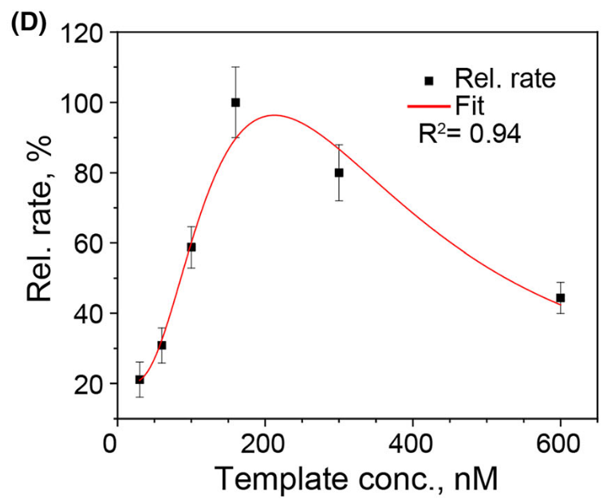

- 图2D：不同Broccoli模板浓度下的RNA聚合相对速率。误差棒表示三个独立实验的标准差。

这可能归因于sigma因子稀释效应，即在高模板浓度下，σ70因子分子与过量的模板结合，减少了活性全酶复合物( RNAp + sigma因子)（active holoenzyme complexes）的总数，从而导致转录速率降低。

我们认为这些优化步骤对于使商业化的全酶适用于三链体分析是必要的。这将使其他人可以更轻松地重复实验，并根据具体的测试调整不同的参数。

#### 1、2或3个TFO区域串联重复的存在对转录的影响

由于TFO的结构强烈影响杂交三链结构的形成，我们研究了一个RNA链中包含1、2或3个TFO区域串联重复的存在对转录的影响。

TFO是原位产生的，并且被设计为通过“分子布线”的过程靶向同一溶液的一个启动子（TU2）。图3，面板A - C，显示了转录单元TU3，TU4和TU5的分子布线方案，其中TU2包含两个TTSs (橙色)，与TFOs(蓝色)产生抑制性三链体。

​        *在生物学实验上，in situ是指进行于原发生位置的试验（而不是将其移入特殊培养基中），有时意义大致介于in vivo与in vitro之间。当研究者对某一处于人工环境下的器官中之特定细胞作实验时，就可称为in situ。由于不在完整活体中，因此不是in vivo；也不是单纯以人工环境下的细胞作实验，因此也不是in vitro。*

​        *In vivo，意思是在活体中的，实验在完整的活得生物体中进行。*

​        *In vitro，意思是在玻璃中的，实验在生物体外，通常是实验玻璃器皿中进行。* 

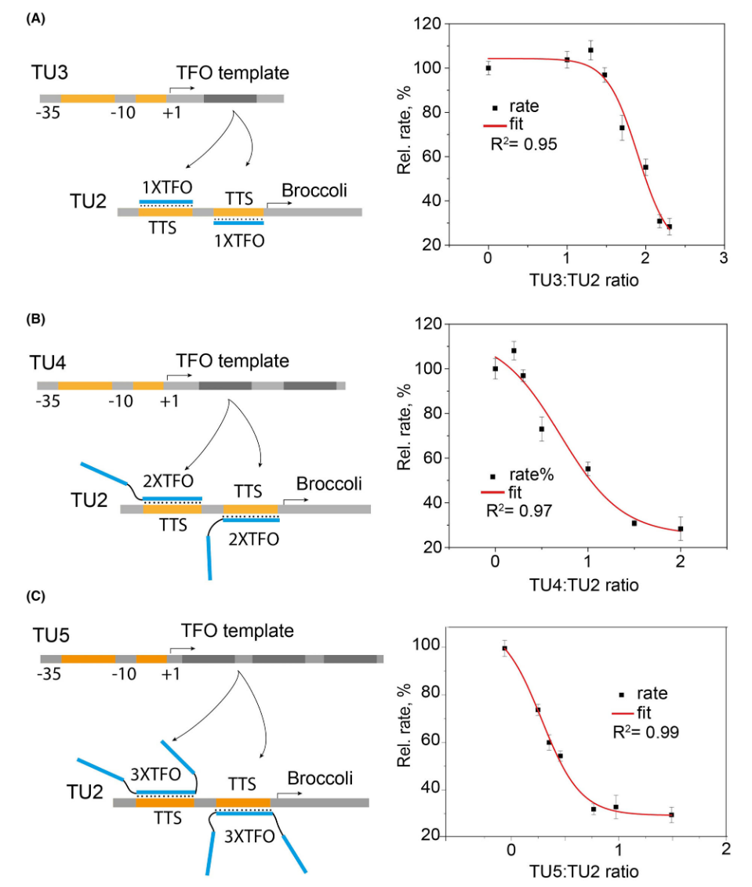

- 图3：
  - 左图以图形的方式描述转录单元TU2、TU3、TU4和TU5的分子布线，其中TU2包含体外聚合的TFO（蓝色）的靶位点（TTS，橙色）。
  - TFO包含了：
    - 仅一个双链相互作用部分，1X TFO，面板A，50%的抑制作用在TU3/TU2 = 2.1
    - 两个TFO串联重复，2X TFO，面板B，50%的抑制作用在TU4/TU2 = 0.7
    - 三个TFO串联重复，3X TFO，面板C，50%的抑制作用在TU5/TU2 = 0.3
  - 误差棒表示聚合速率线性拟合的标准差。通过三个独立的实验获得了50 %的抑制率。

在第一种情况下，面板A，TU3产生含有一个TFO结构域的RNA，1X TFO，而在接下来的两种情况下，TU4和TU5分别编码两个和三个TFO结构域，2XTFO或3XTFO，这些结构域在同一核酸链上以四个核苷酸为间隔（间隔用细黑线表示），面板B和面板C。

我们假设，在串联的重复中形成三链体结构后，会产生TFO的局部浓度，从而稳定复合物。

假设3种TFO体积增加量可忽略不计，由于串联重复，相对于1X TFO，形成三链体的RNA序列的局部浓度是2X TFO的两倍，是3XTFO的三倍。也就是说，对于1XTFO，其局部浓度等于其整体浓度，而对于2XTFO和3XTFO，其局部浓度必须高于其整体浓度，并且依赖于重复次数。

每个分子布线方案右侧的面板显示了相应的Broccoli合成速率，并将其与增长的已布线的TU比例绘制成图。sigmoid拟合清晰地显示，对于TU2而言，TFO编码的TU的曲线朝着更低的比例的方向向左移动（2.1 > 0.7 > 0.3），这说明三链体的较强效应与较高的局部浓度有关（在方法部分报告了额外的实验细节）。

### 基于三链体的逻辑门XOR和XNOR

为进一步证明增强型/抑制型杂交三链体的适用性，我们制作了逻辑门XOR和XNOR。

这种门可以被简单地解释为一种运算符，当两个输入具有不同的值时（其中一个TFO存在但另一个不存在，XOR门），或者当两个输入（TFO）具有相同的值时（两个TFO均存在或两个TFO均不存在，XNOR门），给出一个正信号（输出 = 1，高转录速率）。

它们的分子实现方式如下：

- 序列互补的TFO1和TFO2作为输入（分别为I1和I2），转录单元代表逻辑运算符（TU6或TU7分别用于XOR或XNOR），转录速率作为输出，Broccoli荧光作为读出。

对于异或门，使用了两个增强型三链体，当只有一个输入存在（ssRNA TFO可形成三链体）时，产生增强效果；当没有输入或两个输入同时存在时（双链RNA不能形成三链体），产生未受干扰的转录。

图4A显示了Broccoli在四种条件下的聚合反应动力学：

- 在两个TFOs都不存在的情况下、只有两个TFOs之一存在的情况下、以及两个TFOs都存在的情况下，分别反映了输入组合0-0、0-1、1-0和1-1。
- 线性速率值和真值表在各自的动力学图的右边，其中将任意阈值设定为最高转录速率的80%，从而将较低速率设置为0输出值，将较高速率设置为1输出值。
- 每个真值表输入组合的右侧显示了双链分子（橙色）和TFO（蓝色和绿色）生成三链体分子的方案。

类似地，图4B显示了使用互补序列的抑制性的TFO的逻辑门XNOR的分子实现。

- 当TFOs同时存在或同时不存在时，转录速率高于设定的任意阈值，该阈值设为最高速率的60%（输出值=1）。
- 而当其中一个抑制性TFO存在时，转录速率低于阈值（输出值=0）。
- 在动力学曲线图的右边分别为了相应的条形图和真值表。
- DNA - RNA复合物示意图显示在真值表的右边，遵循相同的颜色方案。

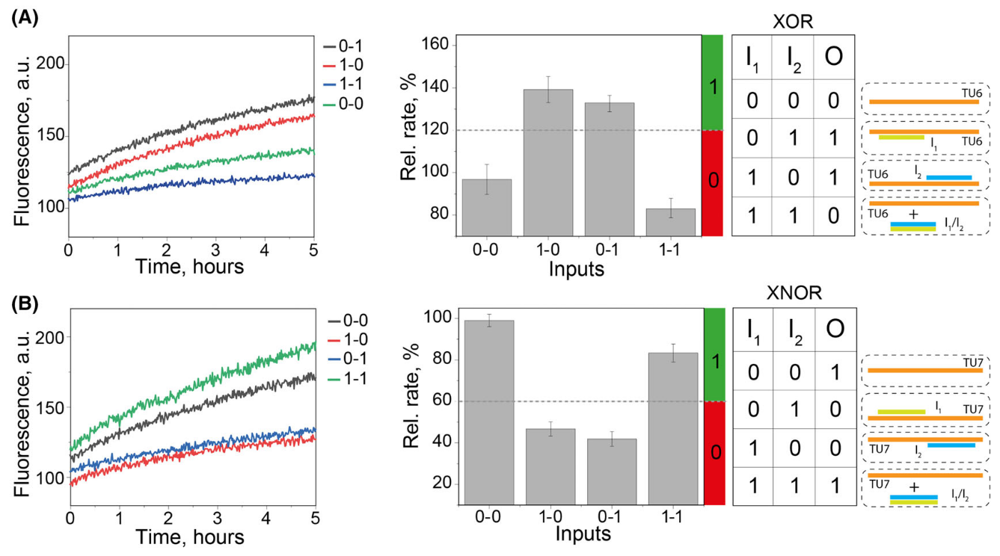

- 图4A、B：
  - 由转录单元TU6或TU7与代表输入的TFOs I1和I2组合孵育后，体外合成的Broccoli的荧光信号。
  - 线性荧光估计的聚合速率显示在右侧条形图中，根据启动子设计，输出遵循XOR门或XNOR门。
  - 每个条形图都附有相应的逻辑门真值表，其中对于每种输入组合的输入/门状态方案进行了示意描绘。
  - TFOs用绿色和蓝色表示(分别为嘧啶和嘌呤TFO)，作为门控单元的双链DNA启动子用橙色表示。

### 三链体介导的阈值门

采用分子逻辑门的方法，构建了一个三链体介导的阈值门。

- 阈值门类似于神经元的信号传导，首先使用输入生成一个和，然后利用这个值产生正输出（即和高于阈值）或零输出（即和低于阈值）。
- 在这种情况下，使用两个互补序列的三链体寡核苷酸（TFOs）来构建相反效应（抑制或增强）的三链体，从而调节转录单位TU8的聚合速率输出。
- 增强的TFO代表输入，抑制的TFO代表阈值。这种方式允许根据浓度更高的TFO而产生抑制/增强的极化效应（polarized effect）。
- 阈值门控效应导致：当输入浓度高于阈值时，TU受到正向调节，反之则受到负向调节。

图4，面板C，显示了在不同的输入/阈值比率下记录的速率的集合，在比率低于1时显示零输出，在较高的输入/阈值比率下显示正输出。在面板的右侧，显示了输入/阈值比率增加时，DNA-RNA 相互作用的方案（从下到上）。

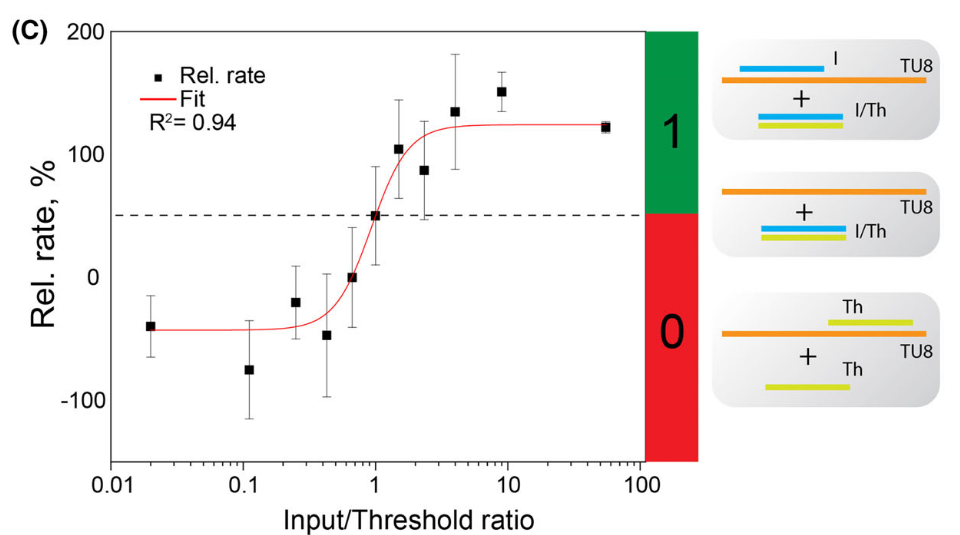

- 图4C：
  - 实验结果显示，使用两个TFO分别作为输入（I）和阈值（Th）以及转录单元TU8的阈值门的实现。
  - 估计的线性聚合速率用作输出，并与输入/阈值浓度比作图。
  - 在右侧，显示了DNA-RNA相互作用的方案，分别对应低I/Th比率的极限情况（底部，输出 = 0），比率为1的情况（中部，阈值），以及高比率的情况（顶部，输出 = 1）。

图4，面板D展示了阈值门的额外EMSA特性。

- 当输入/阈值浓度比远离1时，三链体相关的条带（用绿色箭头表示）变得更加明显
- 而当两种RNA以等摩尔浓度存在时，该条带消失。
- 这意味着，在存在过量的任一RNA 链的情况下，三链体是稳定的（最左边和最右边的泳道），而两种RNA的等摩尔浓度会破坏三链体的稳定性，使平衡向更稳定的双链体 RNA 移动。
- 因此，这里证明了使用三链体操作的转录系统开发分子门的可行性。

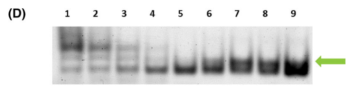

- 图4D：输入、阈值、双链体DNA相互作用的凝胶电泳分析，该分析证明了与绿色箭头指示的条带相关的转录增强型/抑制型三链体结构的形成。
  - 对输入、阈值和双链 DNA 相互作用进行电泳分析，证明与绿色箭头指示的条带相关的转录增强/抑制三重结构的形成（泳道 1 至 9：输入浓度为 1nM 至 10 uM，阈值浓度为 10 uM 至 1nM）。
  - 泳道5：当输入/阈值比接近 1时，条带消失。

