Self-assembly of DNA nanotubes with controllable diameters

直径可控的DNA纳米管的自组装

# 一、文章简介

# 二、文章内容

## 摘要

### 背景

DNA纳米管的合成是纳米生物技术的一个重要领域。

已经报道了组装DNA纳米管的不同方法，并且通过编程 DNA tile 的子单元来实现对纳米管宽度的控制。

### 文章总述

在这里，我们报道了直径可控的DNA纳米管的自组装。

- DNA纳米管是由单链DNA自组织形成的，表现出适当的互补性，可以形成大六边形、小六边形、和四边形几何结构。
- 在  与六边形或四边形的构建单元的边 部分互补的  滚环扩增链的存在下，可以形成直径可控的非成束DNA纳米管。
- DNA管的形成过程和其直径的控制，归因于热力学有利的各个子单位组成的薄片的单向增长，随后由于弹性能量惩罚引起了薄片的折叠，这些惩罚由有利的结合能补偿。

## 引言

### DNA纳米管的作用

DNA纳米管的合成吸引了研究人员的关注，因为：

- 这些纳米结构可能被用作运输和释放纳米货物的容器1，2
- 可以使用纳米管作为模板来控制纳米物体的形状和尺寸3
- 以及纳米管作为功能元件在纳米器件中的应用4。

程序化的一维、二维和三维DNA纳米结构的合成 是一个快速发展的研究课题5-7，所得到的DNA组装体被用作纳米颗粒8-10和蛋白质11-14精确定位的模板。

### 组装DNA纳米管的不同方法

人们已经用不同的方法来组装DNA纳米管，这些方法包括：

- 三重交叉tile（triple-crossover tiles）的自组装15
- 通过互补杂交的二维tile或圆形阵列的闭合16
- 具有内部互补性的单个DNA tile 的自组装17
- 或共价键18。

此外，还报道了：

- 几何定义的单链DNA的合成，其用有机顶点进行刚性化，并使其纵向组装成纳米管19
- 预定长度的DNA纳米管的合成20
- 以及纳米管的模板化合成21

### 实现DNA纳米管宽度的控制

DNA纳米管宽度的控制的实现方法：

- 可以通过可控数量的三重交叉 tile 和 螺旋拱形基序（ helix-arched motifs ） 的自组装
- 通过单链DNA中结构域的互补性来编程管的周长23
- 通过适当的 ‘staple’ 单元对折纸纳米管进行封闭24

### 文章总述

发展控制DNA纳米管直径的新方法对于进一步推进DNA纳米技术具有重要意义。

在这里，我们报道了一种单根的、无分支的DNA纳米管的高通量合成的方法，并实现了对纳米管直径的控制

- 具体来说，我们介绍了一种方法来控制DNA子单元层的单向生长
- 该方法使用了滚环扩增（rolling circle amplification ，RCA）产物作为模板
- 并通过与RCA模板置换（displacement）相关的热力学来控制子单元层的折叠

此外，我们试图提供一个简单的模型来解释直径可控的单DNA纳米管的形成。

**补充：**

滚环扩增（rolling circle amplification，RCA）是近几年发展起来的一种核酸恒温扩增方法：

- 以环状DNA为模板，通过一个短的DNA引物（与部分环状模板互补），在phi29 DNA 聚合酶催化下将dNTPs转变成单链DNA，此单链DNA包含成百上千个重复的模板互补片段。
- 这种方法不仅可以直接扩增DNA和RNA，还可以实现对靶核酸的信号放大，灵敏度达到一个拷贝的核酸分子，因此在核酸检测中具有很大的应用价值和潜力。

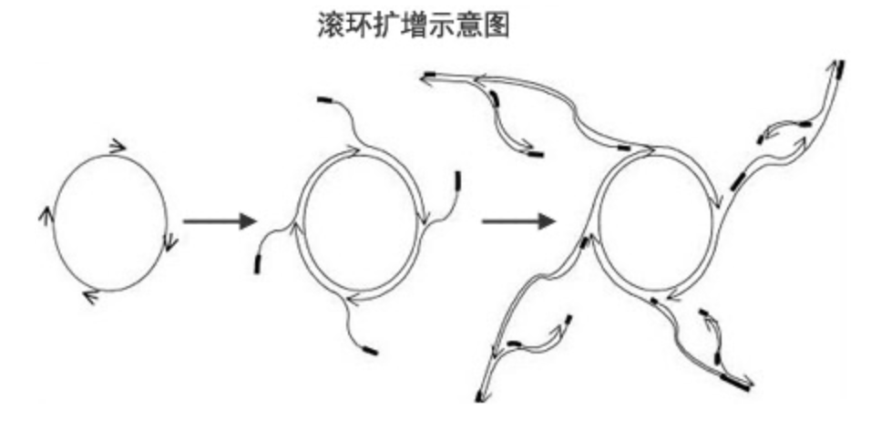

## Results

### 由六边形子单元组装而成的束状纳米管

#### 示意图

单链核酸由100个碱基组成（ **(1)**，图1 ）。

序列设计的原则是：结构域Ⅰ、Ⅶ与结构域Ⅳ互补，结构域Ⅱ与结构域Ⅴ互补，结构域Ⅲ与结构域Ⅵ互补。结构域Ⅶ的3′ 端包含一个核酸延伸段Ⅷ。

单链核酸**（1）**的互补特性使其具有六边形结构，可以与其他六边形链相互杂交，形成二维的“石墨烯”型的片层，这种片层可以包裹起来，形成三维的管状结构，如图1所示。

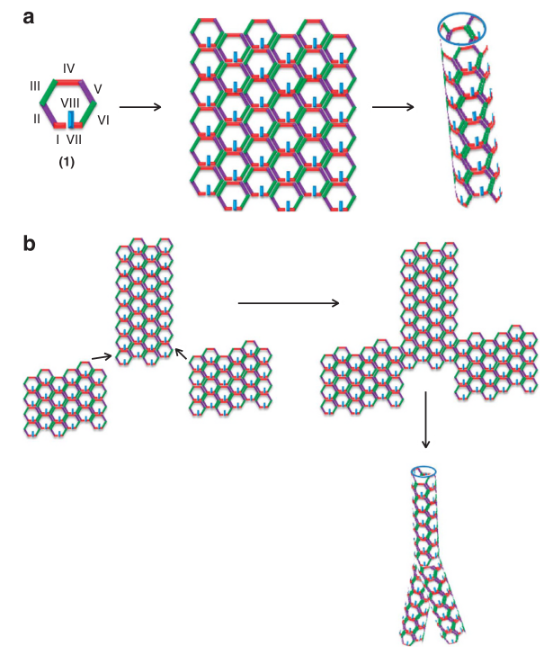

- 图1：DNA纳米管的形成示意图。
  - a：
    - 单链核酸六边形子单元**（1）**的自组装，组装成“石墨烯”型的薄片层并折叠成DNA纳米管。
    - 结构域Ⅰ和Ⅶ与结构域Ⅳ互补，结构域Ⅱ与结构域Ⅴ互补，结构域Ⅲ与结构域Ⅵ互补。
    - 结构域Ⅷ为纳米颗粒的进一步附着提供了一个toehold。
  - b：
    - 由“六边形” 子单元组成的核酸薄片层的自组装，组装成束状的DNA纳米管。
  - 基于六边形的纳米管束的形成可能归因于六边形片层的随机生长，或者是六边形片层子单元的随机分子间杂交，随后它们被包裹起来，形成纳米管，如图1b所示。

#### SEM、AFM图像分析

所得纳米结构的高分辨率扫描的（high- resolution(HR)-scanning）电子显微镜( SEM )和原子力显微镜( AFM )图像如图2所示。

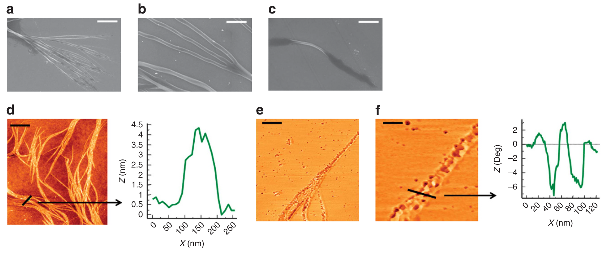

- 图2：核酸子单元**（1）**自组装生成的纳米结构的HR-SEM图像和AFM图像

  - 典型的自组装纳米结构由不同直径的管束组成（图2a）

    - a：一个中心DNA管与DNA纳米管束的集合（比例尺，5 μm）

  - 得到的管往往直径较大，约为200 nm，分支的管直径较小，约为60 nm（图2b）。

    - b：一个中心DNA管与DNA纳米管束的 “放大” 图像（比例尺，500 nm）

  - 在生成的纳米管中，可以观察到不完全折叠的纳米管。例如，图2c展示的纳米结构，其中央部分折叠成管状，而其两端展开成为二维的阵列。这种包含不完全包裹结构的复合DNA管在图像中经常被检测到。

    - c：DNA纳米管的图像，其末端以 展开的“六边形“ DNA薄片层终止（比例尺，700 nm）

  - 从AFM图像中也得到了非常相似的结论。最常见的纳米结构（ >90% ）由不同直径的DNA束组成（图2d）。

    - d：由**（1）**自组装而来的DNA纳米管束的AFM图像（比例尺，900 nm）

  - 图2e，f 展示了其中一个束的相位图像。管中"孔"的横截面分析如图2f所示。

    - e：由**（1）**自组装而来的DNA纳米管束的 Phase AFM图像。纳米结构中的黑点（dark dots）对应于组成管的"六边形"孔洞（比例尺，300 nm）

    - f：对纳米管的相位AFM图像进行放大，并进行相应的截面分析。值得注意的是，在探针针尖直径解卷积后，“孔” 的宽度约为10 nm，与相应的核酸 “六边形” 亚单元的几何尺寸一致。（比例尺，100 nm）

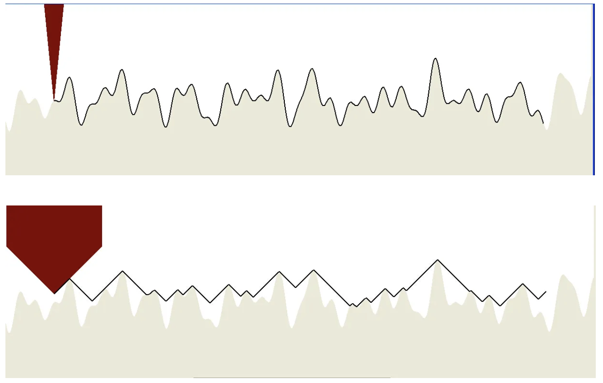

- 原子力显微镜（AFM）图像中存在由探针针尖的非理想形状和大小引起的扭曲。
- 解卷积算法通过考虑针尖占用的物理体积来消除部分失真，从而暴露出更准确的图像。

### 由六边形或四边形子单元形成的单DNA纳米管

然而，制备DNA纳米管的主要挑战是开发合成单根的、不成束的DNA纳米管的方法，特别是引入相应的方法来控制管的直径。

#### RCA单链控制六边形片的生长

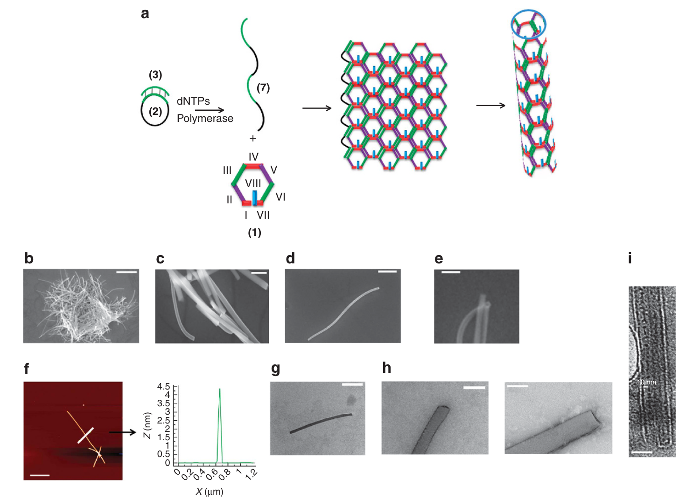

- 图3：由六边形子单元组成的单DNA纳米管的自组装和成像。
  - 为了达到这个目的，我们决定通过预先合成的RCA单链来控制六边形片的生长，这条RCA单链与六边形片的一条边互补（图3a）。
    - a：通过核酸六边形子单元**（1）**的自组装形成单DNA纳米管的示意图，存在一条RCA模板（又称阻断链，blocker）**（7）**，其与六边形子单元部分互补。
    - 在包裹薄片的同时，RCA阻断链**（7）**也会发生置换，从而产生 DNA 纳米管。令人惊讶的是，只有单一的、非成束的DNA纳米管形成。
  - 图3b，c显示了大量的单DNA纳米管。值得注意的是，图3b显示了大量的DNA纳米管，这是一个异常记录的图像，可能是由于干燥过程（drying procedure）产生的。它仅被提供来证明生成的纳米管的高产率。
    - b-e：得到的单DNA纳米管的HR-SEM图像：
      - b：众多纳米管的集合（比例尺，2 μm）
      - c：所得纳米管的放大图像（比例尺，150 nm）
      - d：微米级的单DNA纳米管的代表性图像（比例尺，500 nm）
      - e：纳米管边缘的放大图像，展示出管的空腔（比例尺，300 nm）
      - f：一组分开的DNA纳米管的AFM高度图像（比例尺，1.7 μm）
  - g-i：DNA纳米管的HR-TEM图像：
    - g：未染色的DNA纳米管的HR-TEM图像（比例尺，500 nm）
    - h：DNA纳米管的放大的HR-TEM图像，展示了管边缘的空腔（比例尺，60 nm）
    - i：一个经铀染色的DNA纳米管的HR-TEM图像（比例尺，40 nm）观察到由黑点（对应六边形的空腔）构成的周期性线条。空腔之间的间距约为10 nm，符合几何约束（预期）。

事实上，超过85%的管是完美的单根纳米管，如图3d和图S1所示。

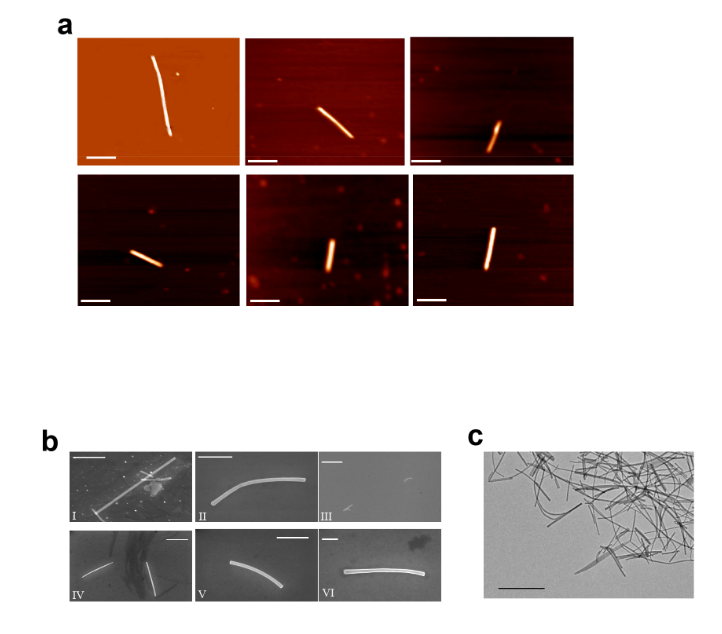

- 图S1：
  - a：单DNA纳米管的AFM图像（比例尺，1 μm）
  - b：单DNA纳米管的SEM图像（比例尺 I - 700 nm, II - 500 nm, III – 5 μm, IV - 1μm, V – 500 nm, VI – 100 nm）
  - c：单DNA纳米管的TEM图像（比例尺，2 μm）

#### 更小的六边形子单元

为了进一步了解DNA纳米管的形成机制，我们设计了一个更小的核酸六边形子单元**（4）**，该子单元由六边形周长的60个碱基和连接在六边形上的10个碱基的toehold组成。**（4）**在相应的部分互补的RCA链存在下自组装，同样只得到单根的、无分支的DNA纳米管，80%的纳米管直径为75 ± 5 nm（图S2和S4）。

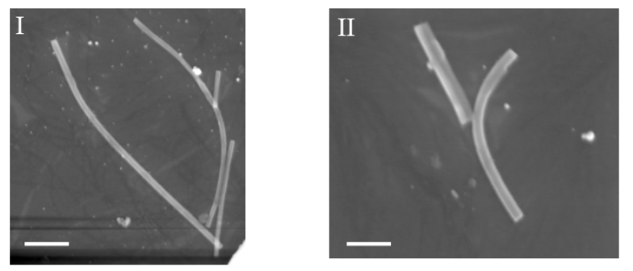

- 图S4：在存在部分互补的RCA链的情况下生成的，由小的"核酸六边形"子单元**（4）**组成的单DNA纳米管的HR - SEM图像（比例尺，I – 300 nm, II- 100 nm）。

#### 四边形子单位

该研究进一步通过研究一种可以在自杂交（self-hybridization）后生成四边形子单位的核酸链**（5）**的自组装来进行扩展（图4a）。结构域Ⅰ和Ⅴ与结构域Ⅲ互补，结构域Ⅱ与结构域Ⅳ互补，而结构域Ⅵ充当辅助toehold，用于组件的二次附着。

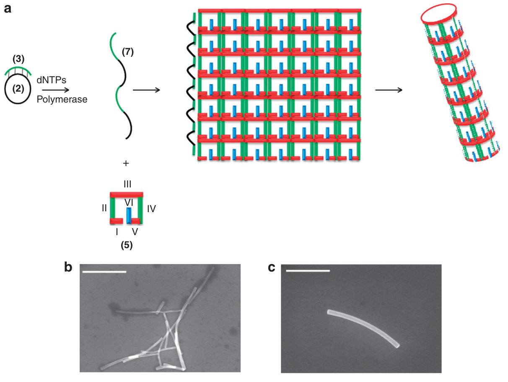

- 图4：由四边形子单元组成的单DNA纳米管的自组装和成像。
  - a：通过核酸四边形子单元**（5）**的自组装形成单DNA纳米管的示意图，存在一条RCA模板**（7）**，其与四边形子单元部分互补。
  - b：由核酸四边形子单元组成的一组DNA纳米管的HR-SEM成像（比例尺，1 μm）。
  - c：由四边形子单元**（5）**组成的代表性的DNA纳米管的HR-SEM图像（比例尺，500 nm）。

在存在相应的部分互补RCA链的情况下，单链的"四边形"**（5）**自组装形成了与之前相同的只有长度与RCA链相符的单DNA纳米管。

然而，所得纳米管的直径明显大于六边形纳米管的直径。总的来说，77 %的纳米管的直径为85 ± 5 nm，见图S2。

#### 总结

值得注意的是，图S2中所示的直方图仅基于对不同的单根纳米管的分析。

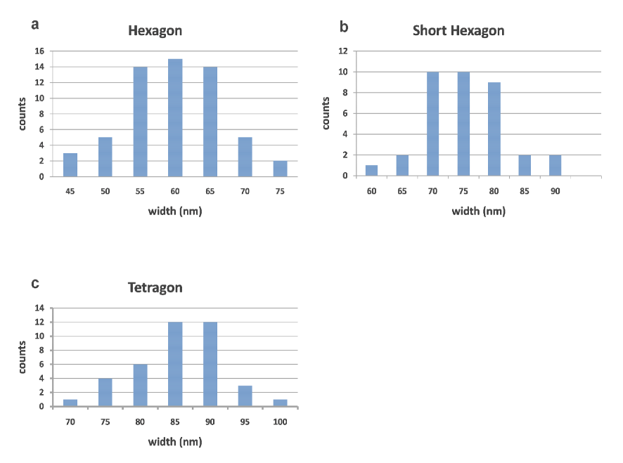

- 图S2：直方图显示了宽度的分布：
  - a：核酸六边形**（1）**杂交生成的DNA纳米管
  - b：核酸短六边形**（4）**杂交生成的DNA纳米管
  - c：核酸四边形**（5）**杂交生成的DNA纳米管

图S3为长度分别对应于1.5-4 μm的合成的RCA产物。需要注意的是，由于RCA产物的异质性约束，所得纳米管的长度受到限制（图S3）。

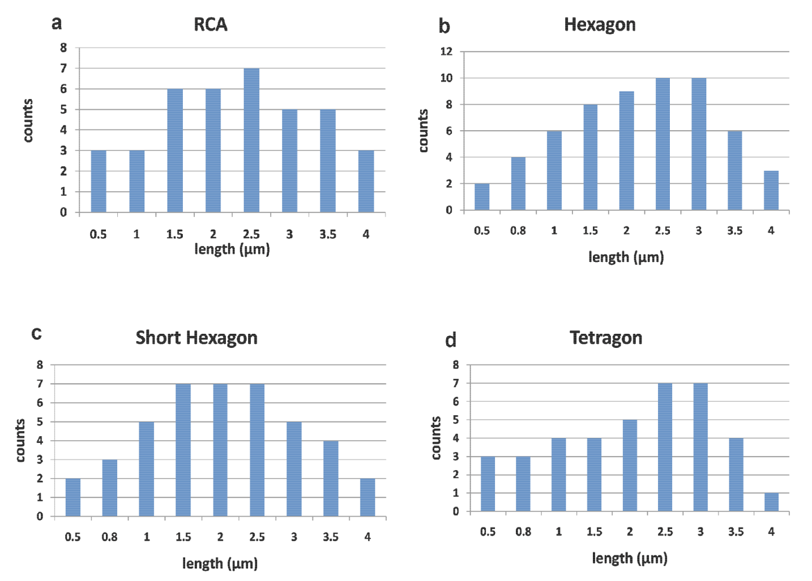

- 图S3：直方图显示了长度的分布：
  - a：RCA链
  - b：核酸六边形**（1）**杂交生成的DNA纳米管
  - c：核酸短六边形**（4）**杂交生成的DNA纳米管
  - d：核酸四边形**（5）**杂交生成的DNA纳米管

在对照实验中，在RCA模板存在的情况下，检查了使用包含序列（III）的非互补结构域（VI'）的核酸链形成的纳米管的可能性。没有观察到DNA纳米管或其他结构的形成。

结果显示，添加RCA blocker 链可消除纳米管的成束，将纳米管的长度限制在RCA模板的尺寸范围内，并且通过自组织的DNA子单位的几何形状实现对所得纳米管直径的控制。

接下来，我们建立了一个模型，该模型可以解释单根DNA纳米管自组装的独特特征。

### 可控直径的DNA纳米管的形成

提出形成这些独特纳米管的可能机制时，需要解决两个不同的问题：

- 为什么RCA产物会导致形成单DNA纳米管，以及为什么得到的纳米管具有相似的直径
- 不同的子单元是如何影响所得的直径的

#### 单根纳米管形成的可能机理

图5示意性地描述了单根纳米管形成的可能机理。

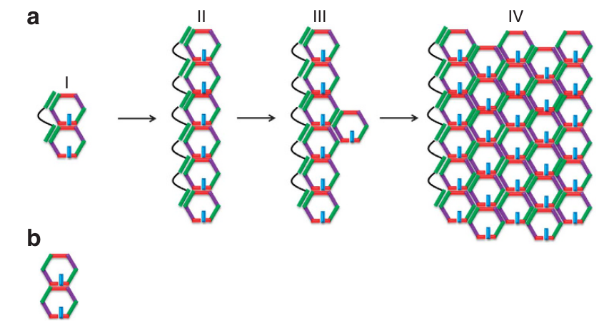

- 图5：由核酸六边形子单元**（1）**组成的无分支的DNA片层的受控生长的机制示意图
  
  - 我们认为，RCA产物为"石墨烯"型六边形片层的形成引入了"种子"机制。
  
  - a：通过RCA模板上子单元的能量上有利的组装，实现 “六边形” 子单元的定向生长
    - I：两个六边形子单元的初步组装，RCA模板包含三个杂交结合域
    - II：六边形子单元的线性结构的产生，每两个相邻的六边形子单元和RCA模板具有三个杂交结合域
    - III：组装一条新的六边形子单元线。
    - IV：二维纳米结构的组装。具有DNA模板的子单元的纳米结构充当了片层定向生长的“种子”。
  - b：在片层生长之前，仅包含一个杂交结合域的能量不利的“种子”结构，由两个“六边形”组成。

显然，在RCA产物上的两个六边形子单元的初始偶联包含三个杂交结合域，而缺少RCA产物的两个子单元的二聚体只包含一个杂交结合域，从而导致了RCA产物上的六边形成为热力学有利的模板，即图5a中的步骤II。

在六边形模板的任意位置上的任意六边形子单元的杂交，通过三个杂交结合域，产生一个为了第二个六边形有效结合的中心，即步骤III。因此，在模板上添加一个六边形有利于 “石墨烯” 型薄片层的定向生长。

然而，值得注意的是，六边形聚合时，薄片层的上下边包含杂交结合域，这些杂交结合域在生长时，可能会导致分支的纳米管。但是，这种可能性被消除了，因为与边的纳米尺寸相比，RCA产物的微米尺寸驱动了子单元阵列的单向生长，在RCA模板框架内，这一特征在统计上有利于片层的生长。

#### 管道直径的控制

可以使用一个合理的简单热力学模型，来解释通过子单位的几何形状和网格大小对管道直径的控制。通过考虑纳米管形成的简单自由能，该模型可用于预测所得管的半径。理论模型中参数的数值估计的详细信息在Supplementary Information中讨论。

##### 管形成的自由能——简单热力学模型

DNA片的长度记为 l ，从片形成管的自由能差记为F （图7）。

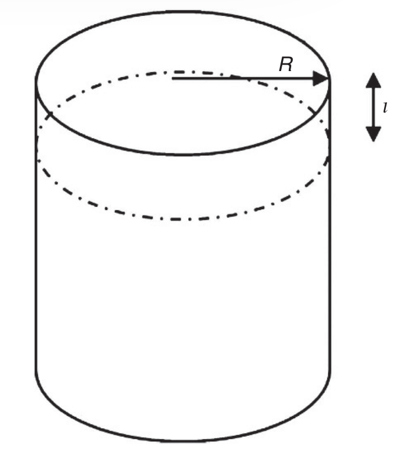

- 图7：双链DNA网格闭合成一条管的示意图。标明了相关的模型参数 R 和 l。

我们假设这种自由能仅包含来自将薄片层从其扁平构型变成弯曲的成本的贡献，以及来自RCA链的置换和沿着两个片的边的单链之间形成额外的DNA碱基配对结合获得的结合能（内聚能）的贡献。所有的其他的对自由能的贡献都被忽略了。

因此，相对于扁平结构，管结构中整个片层的自由能为 F = Fel + Fb，其中 Fel 是对弯曲的弹性惩罚，Fb 是内聚能增益。

- 描述薄片弯曲变形成圆柱的最简单模型是 Canham-Helfrich-Evans 弯曲能26-28，公式 1，其中 R 是薄片的曲率半径（在本例中为圆柱管的半径），κ 是圆柱体的弯曲率，R0 是片的自发（spontaneous）曲率半径。

为简单起见，我们**在这里假设薄片的自发曲率为零，c0 = 1/R0 = 0 。**

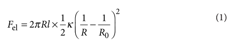

片的结合能线性地取决于圆柱体的长度，

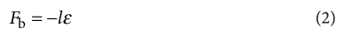

其中我们将ε设置为每单位长度的（净）内聚自由能。沿着圆柱体每单位长度的总自由能由公式 3 给出，

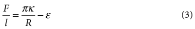

显然，该表达式仅适用于无限大的闭合片层 （R→ ∞），这些片层没有弯曲成本，但从内聚力中获得收益。

- 然而，对于已经超过一定的曲率半径 R\* = πκ/ε（自由能为0时），则存在形成管的净自由能增益。如果片的生长非常缓慢（可逆），使片的自由端有时间找到彼此并结合，那么当片层的宽度超过2πR \*时，片将闭合形成管。
- 然而，在现实中，片层在不断增长，因此在片层加宽和管的闭合之间形成了竞争。预计这将导致尺寸分布从 R*（或略早于，由于热波动）开始，甚至更远。一旦片自行闭合成管，就可以假设动力学停止，因为一旦管关闭，打开管子就会有很高的障碍。

我们注意到，我们的方法有点类似于确定由具有开放边的膜片形成的脂质囊泡的大小，该膜片源于弹性和边的能量之间的类似竞争33。

这个高度简化的模型的主要结果是管半径缩放为 R\*~κ/ε。也就是说，弯曲的成本越高，半径越大，而关闭管的内聚增益越大，半径越小。

形成尽可能小的管的趋势（一旦形成自由能为负）可以被溶液中粒子（管）的最大数量的熵要求解释。有趣的是，在表面活性剂溶液中，这种要求也被认识为形成球形胶束而不是其他更大的聚集体的重要考虑因素。

相反，由于展开形态的片层波动引起的熵应该不利于管闭合，但对于这里考虑的相当硬的纳米片来说，后一种贡献可能很小。

##### 模型总结

根据这个模型，相比于打开的片层，管的热力学稳定性由两个主要的自由能贡献主导：

- 第一种是双链DNA在折叠成管时、RCA置换时、和片层的边通过杂交时连接形成的内聚能
  - （值得注意的是，折叠导致了边的完全杂交，而边与RCA链只发生部分杂交）。
  - 内聚能取决于DNA边的结合长度、它们的碱基序列、和溶液条件如盐浓度。
  - 假设沿着纳米片边缘，管的每单位长度的内聚能为ε，并且管的长度为l，则片层粘附后获得的自由能为Fbinding = −εl。
- 第二种是与纳米平面片弯曲成管有关的弹性能
  - 纳米片弯曲能预计是双链DNA刚度的函数，这个函数取决于DNA的持久长度，lp，即网格的几何形状和片层折叠的方向（轴）
  - 对于具有弯曲率（类似于弹簧常数）κ 的纳米片，与将片变形为长度为 l 和半径为 R 的管相关的弹性能可以使用Canham-Helfrich-Evans formalism25-28表示，其中Fbending = πlκ / R。

考虑到 “从纳米片到管” 的这两个主要的自由能贡献，F = Fbinding + Fbending，我们发现只有超过阈值半径 R\*~ κ/ε，结合获得的自由能可以补偿弯曲能，从而在热力学上有利于管的形成。

- 对于R<R*，弯曲的弹性能大于结合能，因此不利于管的形成。

- 对于R>R*，管的形成的结合获得的自由能可以补偿弯曲能量，有利于管的形成。

假设片层生长缓慢（可逆），片层宽度超过 2πR\*（或由于热波动而略低于），片层的边杂交并形成管。

- 双链DNA的结合能主要由碱基序列和双链体的长度决定，并且之前已经进行了定量估计29。
- 同样，子单元的不同几何形状的弯曲能和相应碱基配对引起的自由能变化也是可以定量确定的30-32。
- 这使我们能够为不同纳米片网格几何形状提供 κ 和 ε 的数值估计，并为构成子单元的不同几何形状提供所得纳米管的阈值R\* 的评估。（有关 κ、ε 和 R* 的计算和推导数值的详细信息，请参阅Method和Supplementary Information）。

尽管该模型依赖于两个近似推导的参数（approximately derived parameters），但我们发现在没有可调参数（adjustable parameters）的情况下，所得DNA纳米管的计算尺寸与实验结果非常吻合。

R\*largehexagons ≈ 30 nm,  R\*smallhexagons ≈ 40 nm, R\*tetragons ≈ 45 nm，导致计算出的DNA纳米管的直径分别为60 nm，80 nm，90 nm（实验上分别为60 nm、75 nm、85 nm）。

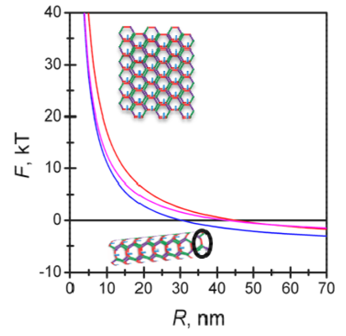

- 图S7：沿管的每个单位长度的带显示不同管半径的自由能。
  - 自由能从正（低半径）变为负（高半径）的点标志着第一个半径的形成，其中管形成在热力学上有利的。
  - 曲线对应于多种网格尺寸和几何形状：大六边形（蓝色）、小六边形（洋红色）和四边形（红色）。

#### 进一步应用

所得DNA纳米管的进一步应用在于将化学成分拴在纳米管壁上或将材料封装在管中的可能性。

然后研究了拴在DNA纳米管子单元上的Au纳米颗粒（nanoparticles，NPs）的有序组织（图6）。

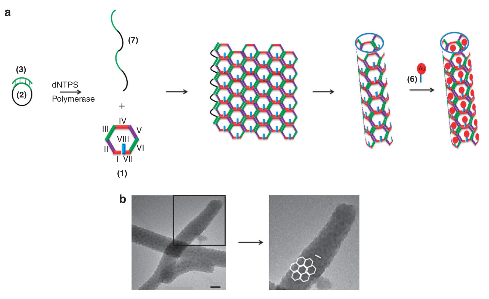

- 图6：用AuNPs修饰的单DNA纳米管。
  - 图 6a 中的六边形子单元包括一条单链核酸链，该链不参与纳米结构的形成，但它提供了一个锚点来杂交 AuNPs （1.4 nm），使用核酸来功能化**（6）**，与栓系单元互补（**1、4** 中的 VIII 和 **5** 中的 VI）。
    - a：由六边形子单元**（1）**组成的单DNA纳米管的自组装，在六边形子单元上拴系了AuNP（1.4 nm）
  - 图6b描绘了附着在六边形纳米管上的AuNP的HR-TEM图像。观察到一个“蜂窝状”纳米结构，显示了各个六边形中的各个NPs。
    - b：由拴有AuNP的DNA纳米管的 “蜂窝” 纳米结构的 HR-TEM 图像。每个六边形子单元都修饰有 AuNP。左图比例尺, 20 nm; 右图比例尺, 10 nm。相邻NP之间的距离约为10 nm，与两个相邻六边形中心的几何距离非常吻合。

同样地，在基于四边形的DNA纳米管上实现了AuNPs的有序定位（图S5）。

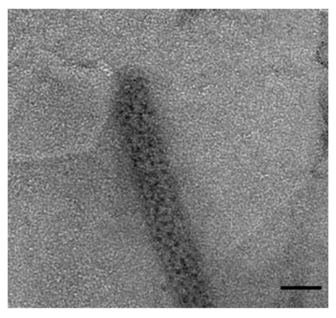

- 图S5：由“四边形”核酸亚单元组成的DNA纳米管的HR-TEM图像，**（5）**，每个四边形子单元上修饰有AuNPs（1.4nm）。比例尺，50 nm。

## Discussion

该研究引入了一种合成具有受控直径的单DNA纳米管的范式。

- 该方法基于碱基互补配对，单链核酸经过自组织、寡聚化，形成几何定义的子单元的二维片，并且包裹成DNA纳米管。
- 讨论了使用RCA核酸链作为二维片定向生长的模板，以及其在决定所得纳米管直径方面的功能。

物理模型提供了子单元的几何形状与纳米管的最终直径之间的关系，为DNA纳米技术开辟了新的维度。

- 例如，通过改变组成子单元的碱基对的杂交能（如不同的碱基或DNA/PNA对），可以实现对管的直径的进一步控制。
- 类似地，使用其他几何核酸子单元，或混合不同的几何结构，例如八边形或六边形/三角形混合物，可能导致其他尺寸的纳米管。
- 同时，将其他成分拴在纳米管上可能会产生这些纳米结构的新功能。
  - 例如，将细胞穿透肽连接到纳米管可能为  捕获纳米管中的化学成分并将其引导到细胞中  提供新的可能性。

## Method

### 寡核苷酸

**(1)** 5′-TTATTATTATACATACATACATATTAGTTAGTTAGTTAAATAATAA TA ATA AT TAT G TAT G TAT G TAT TA AC TA AC TA AC TA A AT TAT TAG AC G ACGACG-3′ 

**(2)** 5′-ATACATACATACATAAAAAAAAAAAAAAAA-3′ or for the short hexagon: 5′-ATACATACATAAAAAAAAAA-3′ 

**(3)** 5′-TATGTATTTTTTTTT-3′ 

**(4)** 5′-TTATTATACATACATTTAGTTAGTTAATAATAATAATGTATGTATAA CTAACTAATATTAGACGACGACG-3′ 

**(5)** 5′-ATACATACATACATATTAGTTAGTTAGTTATATGTATGTATGTATTA ACTAACTAACTAAGACGACGACG-3′ 

**(6)** 5′-CGTCGTCGTC-3′

### DNA纳米结构的制备

寡核苷酸（**（1）**或**（4）**或**（5）**）混合在磷酸盐缓冲液中（1x10-4 litre、1x10-5 M、pH 7.4），终浓度为1x10-7 M，在10分钟内加热到94 °C，然后以每15分钟1°C的速率冷却至室温 （25 °C）。

### RCA产物的制备

1x10-6 的寡核苷酸**（2）**在快速连接方案（NEB）下，使用1x10-5 的寡核苷酸**（3）**作为RCA引物，在 5x10-5 的快速连接缓冲液中连接。

然后，在30°C下，用 0.5×10-3M 的 dNTPs 和 0.8U 的 在5×10-5 litre Phi29缓冲液中的Phi29 DNA聚合酶 处理 2.5×10-6 litre 的环状寡核苷酸 ，处理1小时，然后将酶在65°C下失活10分钟。

然后将体积为 2×10−6 litre 的 RCA 产物加入 含有1×10−7 M 六边形/四边形寡核苷酸的 1×10−4 litre 的磷酸盐缓冲溶液（1×10−5 M，pH 7.4）中，在10分钟内加热至 94 °C，然后以每 15 分钟 1 °C 的速率冷却至室温 （25 °C）。

### 修饰AuNP的（6）的制备

浓度为 5x10-6 M的修饰有氨基的寡核苷酸**（6）**与 5x10-5 M的修饰有 N-羟基琥珀酰亚胺活性酯 的寡核苷酸**（6）**混合。

取磷酸盐缓冲液（1×10−2 M，pH 7.4）中的AuNP 1×10−4 litre，反应40分钟，然后使用微离心G-25（sephadex）柱分离过量的AuNP。

然后，5x10-6 litre 的修饰有**（6）**的AuNP与**（1）**、**（4）**或**（5）**产生的纳米结构杂交，这些纳米结构是与 5x10-5 litre 的磷酸盐缓冲液（1×10−5 M，pH 7.4）中的 2.5x10-5 litre 的RCA产物在室温下、反应30分钟杂交的。

然后按照制造商的方案使用100,000 Microcon设备（Millipore）纯化样品。

## Supplementary Information

### DNA折叠弯曲刚度的估计

我们首先估计六边形和四边形几何形状的网格的弯曲率。我们做了一个简化的假设，即来自双链DNA片段的弹性贡献是相加的，并且它们的能量相对于（小的）曲率变形是谐振（harmonic）的（就像一个弹性变形的杆或者类似于胡克定律的弹簧）。在此模型中，结点（顶点）对弯曲能没有贡献;这个假设可以放宽，如下所述。如果连接点非常灵活，或者DNA瓦片的松弛构型不平坦，必须考虑弹性能量的额外贡献34。

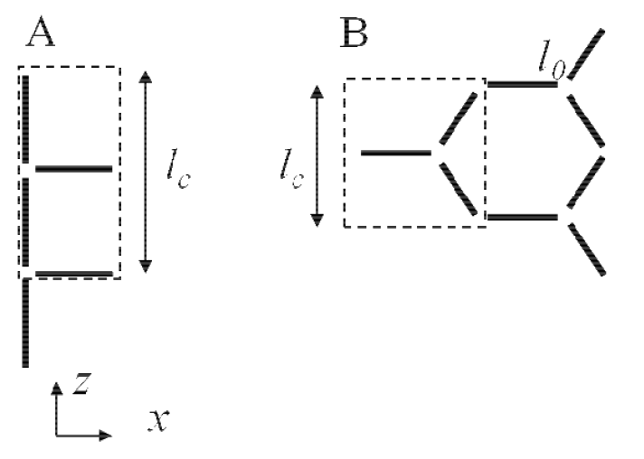

- 图S6：两种dsDNA网格几何结构示意图
  - （A）四方形 
  - （B）六方形

图S6（a）显示了四方形网格，沿x轴发生弯曲，管沿z轴形成。将DNA链上的一个晶格单位（unit cell ）在x方向的长度视为l0，在z轴的长度为2l0 = lc是方便的。我们注意到，边的两条链中只有一部分（15 bp中的5）在管闭合中通过杂交获得（另外的链只是取代了另一条链，即RCA）。在这个简单的网格中，将晶格单位弯曲成半径为 R 的管的能量与 弯曲平行于 x 轴的两条长度为  l0 的 dsDNA 链的能量有关。

我们将片状的双链DNA近似为一种类似蠕虫的链式结构，其弯曲刚度 κD与DNA在溶液中的持久长度 lp相关，即κD = kTlp，其中kT是热能。

使用方程 1，四方形的每晶格单位的弹性能是与弯曲两个长度为l0的 dsDNA 片段相关的自由能，因此：

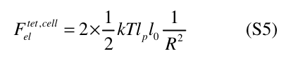

对于在半径为 R 的管中弯曲的高度为 lc 的带状结构，总弯曲能量为

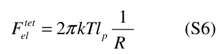

相应的内聚能 Fb = -lcε 只是四边形中先前未杂交部分的杂交自由能。

图S6（b）显示了六边形网格的晶格单位。

在这里，一个方便的晶胞的高度为 lc = √3l0，沿 x 轴的宽度为1.5l0 ，如虚线所示。在这个晶格单位中，有一段沿圆柱轴弯曲，另外两段以一定角度倾斜。事实上，这两个DNA片段的弯曲程度更适中，因为它们在管周围形成螺旋弯曲的一部分，曲率半径是水平弯曲片段的4倍。因此，该晶格单位内的总累积弯曲能量为：

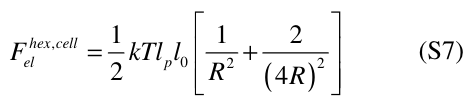

因此，对于具有相同高度的管的带状结构的能量，弯曲自由能为：

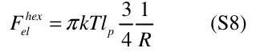

在这里，杂交能仅对应于六边形的一个边。我们注意到，较小或较大的六边形只会在每晶格单位的相应内聚能上有所不同，而每个晶格单位在z方向上的弹性保持不变。

这些计算忽略了扭转对弹性能的贡献。DNA的扭转率（torsion modulus）并没有像持久长度一样被广泛研究，但总体上来说，只要曲率半径不是非常小（R小于约10 nm），其对网状弯曲总自由能的贡献预计是很小的。

### 数值估计

为了与实验进行比较，我们需要内聚能，以及持久长度 lp 的值。

双链 B-DNA 的持久长度已在接近生理条件的溶液下进行了广泛研究。然而，在低盐条件下，关于其值的信息相对较少，并且实验估计存在相当大的差异。在这里，在10-3的盐浓度下，我们使用 lp = 70nm，基于汇编数据30-32。

在高盐浓度下，与dsDNA形成相关的结合自由能的估计值也存在相当大的差异，而在我们实验中使用的低盐条件下，估计值甚至更不确定。我们利用数据汇编，随后推导出SantaLucia29的统一参数，根据碱基对序列，在10-3 M的盐浓度下，获得了不同网格几何形状和尺寸的双链自由能增益的估计值。然而，我们注意到我们的比较对所使用的参数非常敏感，因此在目前对这些参数的了解下，任何比较都应被视为仅半定量的（semi quantitative）。利用这些可用的DNA碱基配对和结合能数据，可以估计不同DNA片层的自由能：

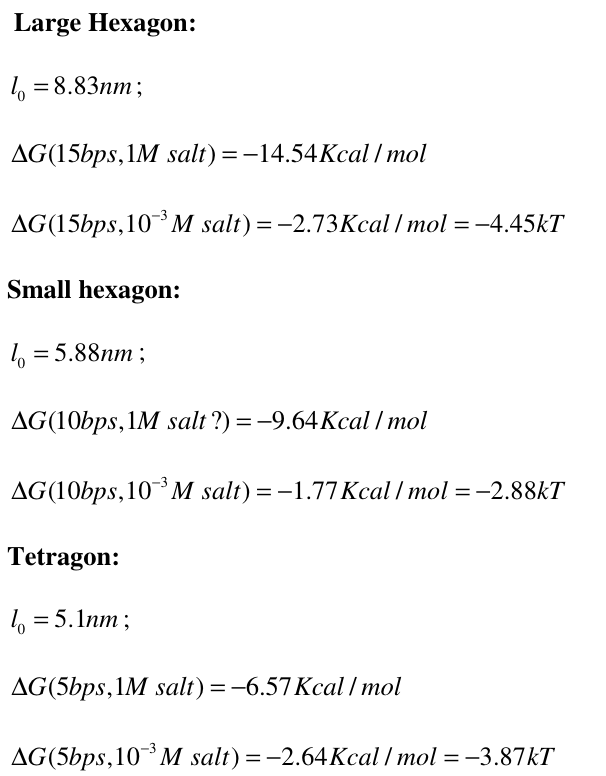

最后，在管闭合时发生的链置换和释放会带来有利的熵贡献（favorable entropic contribution），我们估计每个释放侧（released side）约为 -1kT，添加到总内聚自由能中。

利用这些估计，现在可以绘制沿DNA管的每晶格单位长度的自由能。当自由能从正变为负时，管的闭合在热力学上是有利的。图S7展示了模型中实验的3个网格尺寸几何形状的曲线

- 图S7：沿管的每个单位长度的带显示不同管半径的自由能。
  - 自由能从正（低半径）变为负（高半径）的点标志着第一个半径的形成，其中管形成在热力学上有利的。
  - 曲线对应于多种网格尺寸和几何形状：大六边形（蓝色）、小六边形（洋红色）和四边形（红色）。

我们发现预测的管半径按以下顺序增加：Rlarge hexagons < Rsmall hexagons < Rtetragons。在没有可调参数的情况下，发现管闭合的可能值与实验中发现的管径尺寸非常接近：R\*large hexagons  = 30 nm，R\*small hexagons  = 42 nm，R\*tetragons  = 46 nm。如前所述，这些数字敏感地取决于管形成中涉及的弯曲能和内聚能的数值。

### DNA链关联、连接和折叠设计

DNA纳米管的形成是基于六边形型或四边形型的链的互补性，通过单链DNA折叠形成的二维片层。鉴于单链的互补特性，可以设想其他寡聚化方案，如图S8所示。

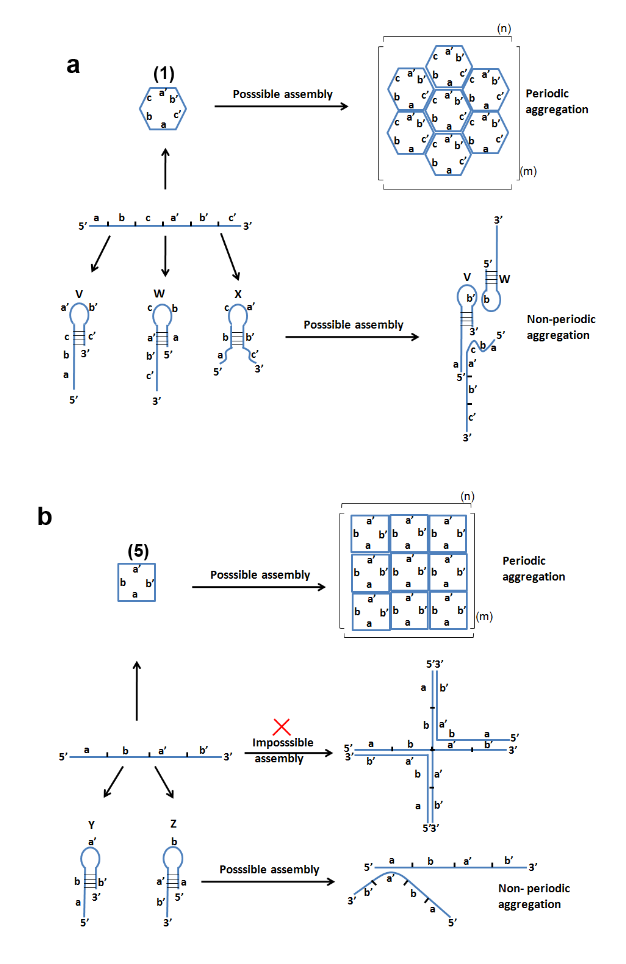

- 图S8 本研究中使用的DNA链的可能杂交方案。
  - （a）：六边形薄片的其他三种可能结构的形成
  - （b）：四边形晶格的其他可能结构的形成
  - 该方案展示了不同的杂交可能性，但每种情况下只有一种方案可以导致形成扩展的片层，从而取代所有其他结构。

例如，除了**( 1 )**的六边形阵列外，**( 1 )**的分子间杂交可以产生发夹结构**( V、W、X)**，这种发夹结构可以通过"接吻"相互作用杂交。然而，它们的杂交动机将会导致非周期性的聚集，形成分支非有序纳米结构。

类似地，除了核酸**( 5 )**自组装成四边形结构外，互补区域的相互杂交可能导致发夹结构**(Y、Z)**，在"亲吻"相互作用下无法产生周期性有序聚集的纳米结构。

事实上，除了六边形和四边形排列之外，我们无法设计其他可折叠的二维拓扑结构来形成DNA纳米管。

四向（Holiday）交叉的构象和能量状况已经被广泛研究了二十多年34，36-40。研究发现，在低离子盐条件下(与本研究使用的条件相对应)，即使具有4臂结构的单个连接点在溶液中分散时，扩展的和接近正方形的平面构型占主导地位41。当盐浓度较高时，这些结构往往会呈现其他不太扩展的构型。类似的发现也已经报道在三叉结构上。因此，在具有许多重复结构的扩展片上，可以合理地假设总体配置是扩展的、平面的。

对于具有不同拓扑结构的连接点的弹性特性的研究较少。认为连接点具有特定的弹性特性，可能在某种程度上改变我们的理论估计。讨论3种极限情况是有指导意义的：

- i：连接点（junction）的弯曲刚度 κJ 小于 κD 
- ii：κJ 约等于 κD
- iii：κJ 大于 κD

第三种情况（iii）在之前的章节已经被详细描述了。有趣的是，该结果在情形( ii )中也没有发生显著变化。因为在这种情况下，DNA和连接点的弹性常数是相似的，在任何施加应力的情况下，两者都会发生相同程度的变形(相同的应变)。然而，当与片中多边形边的长度相比时，连接点延伸的长度要小得多。因此，这部分只会占总体弹性能量的一小部分（大约整体能量的10%），同时也不会对管道的半径造成太大改变。综上，对于这种情况，连接点只是对现有的线性链形成一个小的延伸。

最后，只有情况(i)是能够实现与预测有显著偏差的情况。在这里，大部分应变出现在连接点本身，dsDNA的拉伸应该基本保持不变。同样，储存在连接点的弹性能将主导dsDNA中可忽略不计的小弹性能。然而，由于连接点的线性延伸很小，连接点的弯曲刚度应至少比dsDNA的弯曲刚度小至少5倍，才能在其他两种情况下看到显著差异。

即使假设 κJ 小于 κD ，期望连接点的弹性比系统中最软的元素更软，即比单链DNA的弹性更低，是不合理的。研究表明，在低盐条件下，ss DNA的持久性长度为≈ 7 nm，约为ds DNA持久性长度的1 / 10 42。

图S9展示了使用这些连接点弯曲刚度的值进行四边形片层的计算，与连接处与dsDNA一样坚硬的情况（案例ii）进行比较。

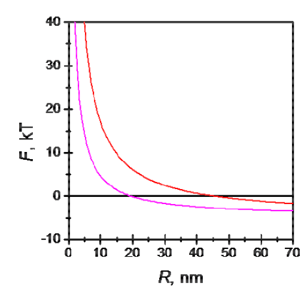

- 图S9 沿管的每个单位长度的带显示不同管半径的自由能。
  - 这里比较了关于弯曲刚度的不同假设。
  - 自由能从正（低半径）变为负（高半径）的点标志着第一个半径的形成，其中管形成在热力学上有利的。
  - 曲线对应于：假设KJ≈KD的四边形（红色）和假设KJ < KD的四边形（洋红色）。

由此预测得出的管半径值（R\*tetragons = 18 nm）比实验结果或使用 "κJ 约等于 κD" 得出的模型预测值要小得多（（R\*tetragons = 46 nm）。根据这些计算，我们认为比ds DNA小得多的连接点弯曲刚度与实验结果不符。这使得我们在所有考虑的情况下都使用了先前讨论的假设，从而得到了与模型参数非常一致的自洽预测。总的来说，我们发现实验结果中的模型参数得到了很好的验证。

