# 0_Controllable self-assembly of parallel gold nanorod clusters by DNA origami

基于DNA折纸的平行的金纳米束的可控自组装

## 摘要

在本文中，我们展示了利用DNA折纸螺旋束（DNA origami rod，DOR）为模板的三种平行的金纳米束（Au nanorod，AuNR）的构建。

基于对DOR上的捕获链的位置的精确控制，AuNR束的数量和方向可以被很好地设计与制造，生物透射电子显微镜（TEM）证明了这一点。

重要的是，AuNR束表现出手性光学的响应性，这种响应性受到杆状的DNA折纸上的AuNR数量的强烈影响。

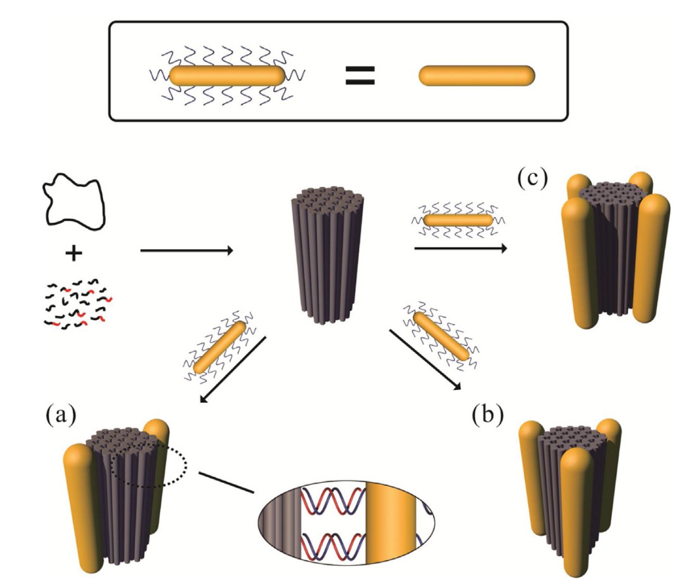

# 1_Autonomous dynamic control of DNA nanostructure self-assembly

DNA纳米结构自组装的自主动态控制

## 摘要

生物细胞通常使用动态信号和调控网络重新配置它们的形状，这些动态信号和调控网络通过能够感知、处理和传输来自环境的信息的分子组件，在时间和空间上指导自组装过程。

可以使用类似的策略来实现合成材料中的类似生命的行为。核酸纳米技术通过各种传感器、逻辑和动态组件以及自组装结构，为实现这一目标提供了一条有前途的途径。

在这里，通过利用动态的和结构的DNA纳米技术，我们展示了一种众所周知的可编程的DNA纳米结构：DNA纳米管，的自组装的动态控制。纳米管的组装和拆卸由最小合成基因系统（minimal synthetic gene systems）控制，包括自主分子振荡器。我们使用粗粒度计算模型（coarse-grained computational model）来捕获纳米管长度分布动态，以响应来自核酸电路的输入。

我们希望这些结果可用于开发响应性核酸材料，并且希望这些结果在生物材料科学、纳米制造和药物递送方面具有潜在的应用价值。

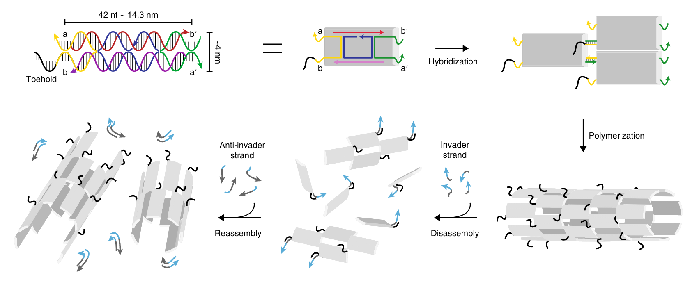

# 2_Size-controllable DNA nanoribbons assembled from three types of reusable brick single-strand DNA tiles

由三种可重复使用的单链DNA瓦片组装而成的尺寸可控的DNA纳米带 *

## 摘要

纳米结构的精确控制是超分子化学、纳米技术和材料科学共同的重要目标。在DNA纳米技术中，利用可编程的DNA链构建所需的DNA纳米结构的方法已经被广泛地研究，并已成为一个有前途的研究分支，但开发通用和低成本(某种程度上，指使用更少类型的DNA链)的方法仍然是一个挑战。

在本文中，我们提出了一个新颖的方法，使用三种类型的可重复利用的砖块SST（single-stranded DNA tiles），来组装可控尺寸的纳米带，其中通过调节操纵链（manipulative strands）和 单链DNA tile（packed single-stranded DNA tiles）之间的浓度比实现了纳米带尺寸的控制。

在我们的方法中，三种类型的砖块SST足以组装不同尺寸的DNA纳米带，这远远少于使用独特的瓦片进行可编程组装的策略的种类数量，从而实现了一种通用且低成本的方法。

通过原子力显微镜( AFM )对组装的DNA纳米带进行观察和分析。实验观察有力地证明了我们方法的可行性和可靠性。

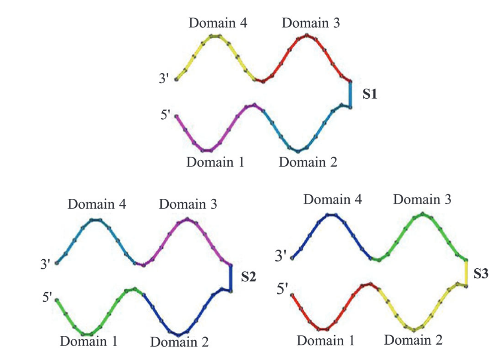

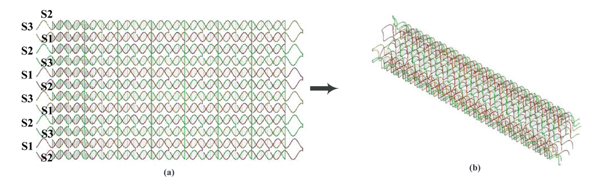

# 3_Construction of DNA nanotubes with controllable diameters and patterns using hierarchical DNA sub-tiles

使用分层的DNA 子瓦片构建具有可控直径和图案的 DNA 纳米管 * 

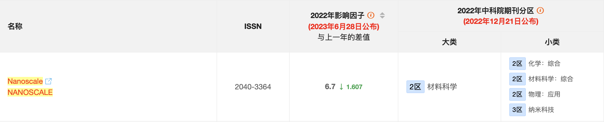

## 摘要

DNA纳米管的设计是结构化DNA纳米技术中一个很有前途和热点的研究分支，它作为一种实现微纳尺度材料和分子诊断/治疗设备的通用方法正在迅速发展。

人们已经提出了多种方法来实现不同的DNA纳米管，如使用方形瓦片和单链瓦片，但开发一种自下而上的组装方式，使用某些通用的DNA纳米结构来构建不同直径和图案的DNA纳米管仍然是一个挑战。这项工作通过从所谓的"基本砖块" (即分级DNA子tile)，组装了三种具有不同直径和图案的空间DNA纳米管，解决了这一挑战。

利用原子力显微镜观察与分析得到：DNA纳米管具有高处理速度和高吞吐量合成。

实验观察和数据分析表明，由分级的DNA子tile组装而成的DNA纳米管具有稳定性和可控性。

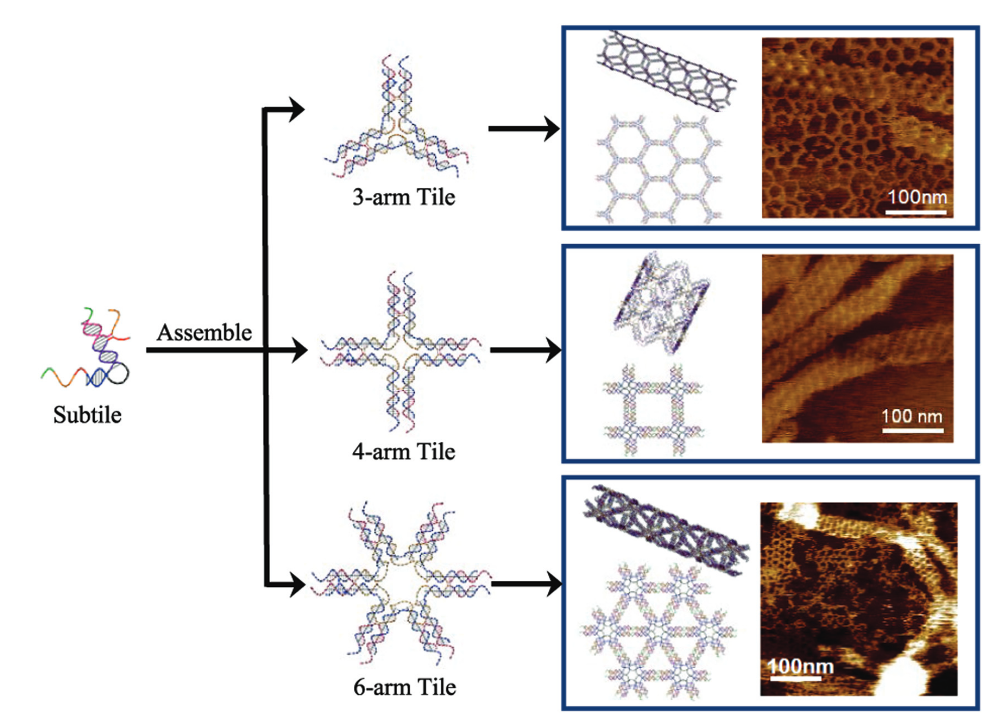

# 4_Size controllable DNA nanogels from the self-assembly of DNA nanostructures through multivalent host–guest interactions

通过多价主客体的相互作用以及DNA纳米结构的自组装而成的尺寸可控的DNA纳米凝胶

## 摘要

由生物分子制成的纳米凝胶是作为递送药物的纳米载体的潜在候选者之一。DNA独特的结构特征和优异的生物相容性表明DNA纳米凝胶是一种理想的候选者。

这里，提出了一种用于制备可控尺寸的DNA纳米凝胶通用的设计策略，这种策略使用了多价主客体相互作用，其中 β-CD 功能化的分支DNA纳米结构作为主体、一种星形的金刚烷封端的8臂聚乙二醇聚合物作为客体。

我们的结果表明，多价的主客体相互作用对于纳米凝胶的形成是必要的。纳米凝胶表现出优异的生物相容性、良好的细胞渗透性和高的药物封装能力，这些重要特征使其能够作为药物载体。

此外，还报道了抗癌药物阿霉素( Doxorubicin )在纳米凝胶的疏水网络内部的封装及其向癌细胞中的递送。我们希望所展示的用于制备DNA纳米凝胶的通用设计策略可以鼓励其他研究人员使用这种方法来设计其他DNA纳米结构的DNA纳米凝胶，并探索DNA纳米凝胶在药物递送应用中的潜力。

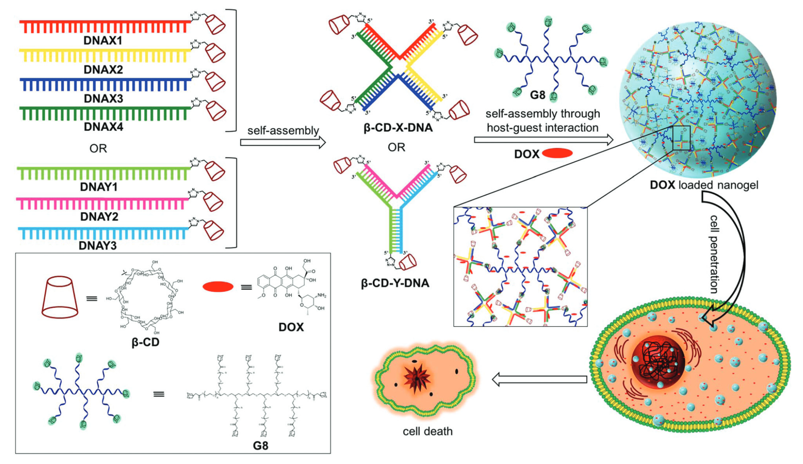

# 5_Regulating DNA Self-Assembly Dynamics with Controlled Nucleation

通过受控的成核调节DNA自组装的动力学

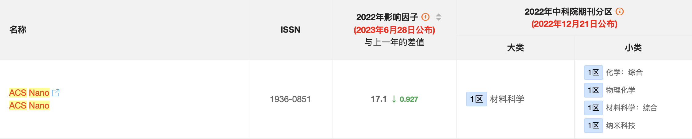

## 摘要

控制自组装体系的成核步骤对于工程化的结构化的复杂性和动力学行为至关重要。

在这里，我们设计了一个“框架填充”模型系统，其包含了一种自我互补的DNA tile 和一个宿主DNA折纸框架，来研究成核的自组装中的三种通用成核模式固有的动力学，分别是：无种子的成核、小平面的成核和有种子的成核。

在动力学模拟的指导下，提出了区分单个成核模式的最佳温度范围，并辅以单分子观察，通过Mg2+触发的动力学测量监测了 tile 通过三种成核途径从亚稳单体状态到稳定聚合状态的转变。

所有三种成核模式的“温度依赖动力学”（temperature- dependent-kinetics）都通过 "成核-生长" 模型进行关联，该模型使用以实验为依据的成核数来量化成核的趋势。

此外，利用成核的温度依赖性，tile 组装可以通过宿主框架进行外部调节。在该框架中集成了一个 UV 响应的触发器，以同时控制"何时"和"何地"开始成核。

我们的研究结果揭示了DNA tile 自组装中不同成核模式的动力学机制，并提供了一种控制自组装过程的通用策略。

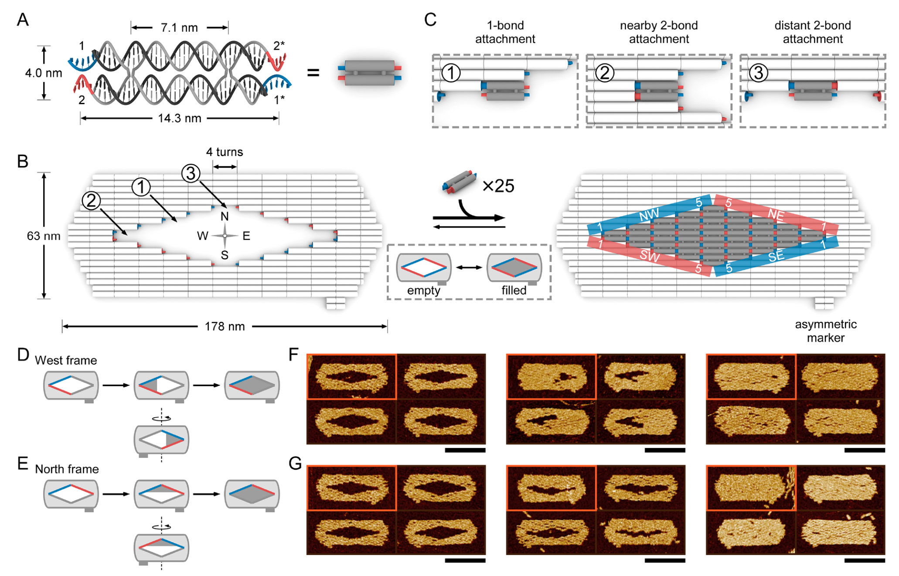

# 6_Temperature-Controlled Encapsulation and Release of an Active Enzyme in the Cavity of a Self-Assembled DNA Nanocage

自组装的DNA纳米笼腔中的活性酶的温控封装和释放

## 摘要

我们使用预组装的和共价闭合的三维DNA笼结构作为可控的封装设备，证明了辣根过氧化物酶的温控封装和释放。所使用的笼状结构是共价闭合的，12条双链B - DNA螺旋构成了该结构的边。

这些双链螺旋被短的单链胸苷（thymidine）连接子阻断，形成了笼状的角落，除了其中一个角落，它由4个32nt的DNA片段组成，这些DNA片段的序列允许它们折叠成发夹结构。

通过凝胶电泳和荧光淬灭实验证明，该设计可以对结构施加具有温度控制的构象转变能力，这种能力允许酶货物在37 ° C下进入结构或被结构释放，同时确保该结构能在4 ° C下将货物保留在笼子的中央空腔中。

被困在DNA笼内的酶仍具有催化活性，并且能够转化穿过围绕笼中央腔体的DNA晶格孔隙的底物分子

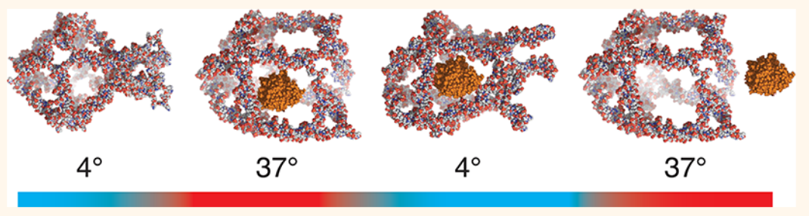

# 7_Self-assembly of DNA nanotubes with controllable diameters

直径可控的DNA纳米管的自组装

## 摘要

DNA纳米管的合成是纳米生物技术的一个重要领域。已经报道了组装DNA纳米管的不同方法，并且通过编程DNA tile 的亚单元（subunit）来实现对纳米管宽度的控制。

在这里，我们报道了直径可控的DNA纳米管的自组装。DNA纳米管是由单链DNA自组织形成的，表现出适当的互补性，可以形成六边形(小或大)和四边形几何结构。

在  与六边形或四边形的构建单元的边部分互补的  滚环扩增链（rolling circle amplification strands）的存在下，可以形成直径可控的非捆绑（non-bundled）DNA纳米管。

DNA管的形成和形成的纳米管的直径的控制，归因于热力学偏爱的（ favoured ）各个亚单位薄片（ the sheets of the respective subunits）的单向增长，然后受到弹性能量惩罚（elastic-energy penalties）引起的薄片的折叠，这些惩罚由偏爱的结合能补偿。

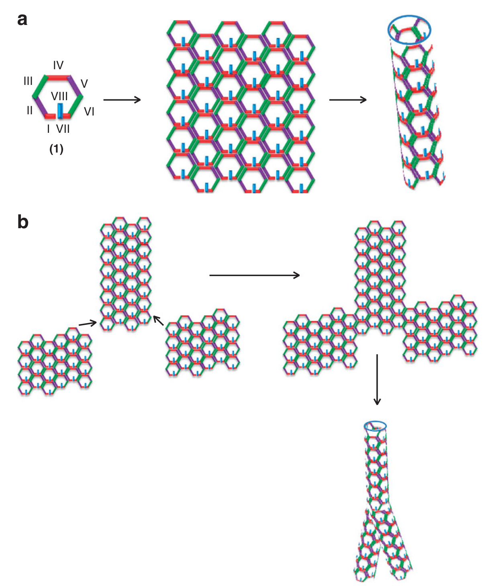

# 8_Self-assembly of size-controlled liposomes on DNA nanotemplates

DNA纳米模板上的尺寸可控的脂质体的自组装

## 摘要

人造的脂质双层膜是研究膜结构和动力学的有价值的工具。对于研究囊泡运输和药物递送等应用，迫切需要尺寸可控的人工囊泡。然而，用纳米精度控制囊泡的大小和形状是具有挑战性的，并且实现这种控制的方法会受到脂质组成的严重影响。

在这里，我们提出了一种生物启发的模板化方法来生成高度单分散的sub-100nm单层囊泡，其中脂质体被限制在刚性DNA纳米模板中并自组装成核。

使用这种方法，我们制备了具有四种不同预定尺寸的同种成分的脂质体。我们还表明该方法可以用于多种脂质成分，并通过捕获膜自组装过程中的关键中间体，探讨了模板脂质体的形成机制。

DNA纳米模板策略代表了一种概念上新颖的指导脂质双分子层的形成的方法，并且可以推广到以纳米精度设计复杂的膜/蛋白质结构。

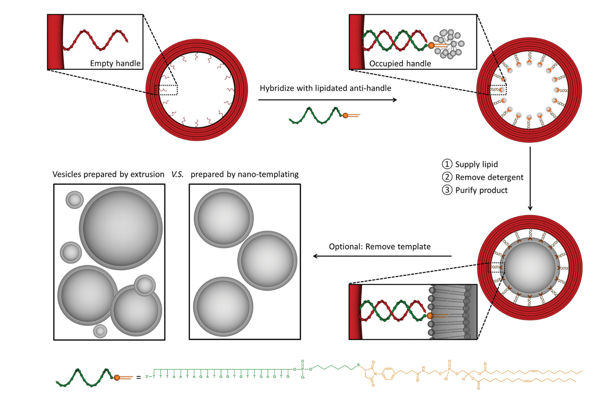

# 9_Isothermal self-assembly of multicomponent and evolutive DNA nanostructures

多组分的和进化的DNA纳米结构的等温自组装

## 摘要

通常需要热退火来引导多条互补的DNA链组装成所需的实体。

我们证明，在含有NaCl的无镁缓冲液中，DNA链和蛋白质的复杂混合物可以在室温或生理温度下等温自组装成用户定义的纳米结构，如DNA折纸，单链 tile 组装体和纳米晶格。

通过原位、时间分辨观察，我们发现，这种自组装是热力学控制的，通过多种折叠途径进行，并形成高度可重构的纳米结构。它允许给定的系统在一个大的竞争性的DNA链池中自选择出其最稳定的形状。令人惊讶的是，当一个新的能量极小值出现时，DNA折纸通过大量交换其组成的staple链，等温地从一个最初稳定的形状转变为一个根本不同的形状。

这种方法扩展了等温自组装所能达到的形状和功能的范围，并为自适应的纳米机器和通过进化发现纳米结构创造了基础。

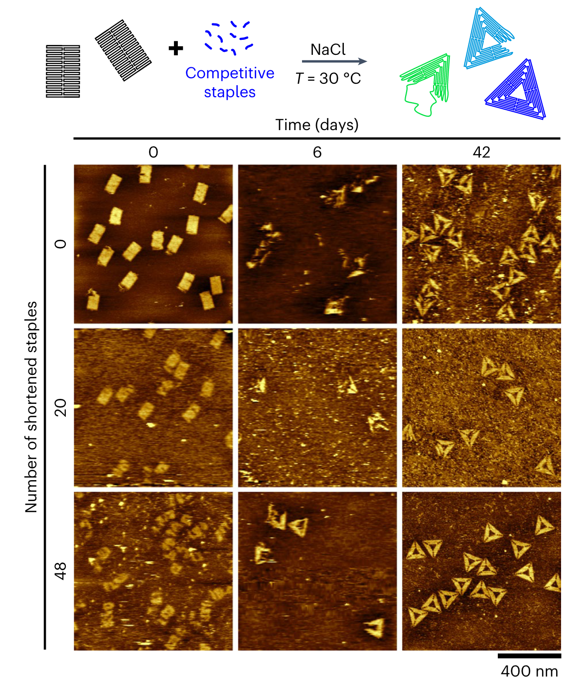

# 10_Self-Assembly of All-DNA Rods with Controlled Patchiness

具有可控斑块的全DNA棒的自组装

## 摘要

双链DNA ( Double-stranded DNA，ds DNA )片段在其末端之间表现出非共价的吸引相互作用。目前尚不清楚DNA液晶自组装如何受到这种平末端吸引力的影响。

研究表明，具有适中纵横比的刚性ds DNA片段可以在浓水溶液（concentrated aqueous solutions）中特异性地自组装成不同类型的近晶型中间相（smectic mesophases），这种组装的基础是对平末端DNA堆积作用的选择性筛选。

为此，通过构建DNA双链体，在分子水平上设计了这种类型的吸引力，其中一端或两端之间的吸引力通过短发夹帽进行筛选。通过控制吸引强度，可以稳定全DNA的双层和单层近晶-A型相以及柱状相。

这一结果表明，迄今为止在DNA棒状液晶中难以捉摸的近晶- A型相是一个热力学稳定的相。双层近晶相的存在通过修饰了一个有吸引力的终端点的硬圆柱体的Monte-Carlo模拟得到了证实。

这项工作表明，DNA平末端表现为定义明确的单价的有吸引力的斑块，其强度和位置可以潜在地精确调整，突出了关于由具有任意几何形状和构成的全DNA斑块颗粒组装而成的非常规的基于DNA的易溶的液晶相的稳定性的独特机会。

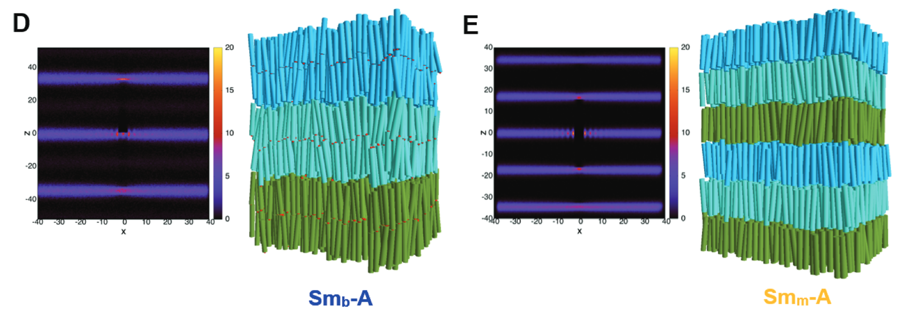
