Triangular DNA Origami Tilings

三角形的DNA折纸瓦片

# 一、文章简介

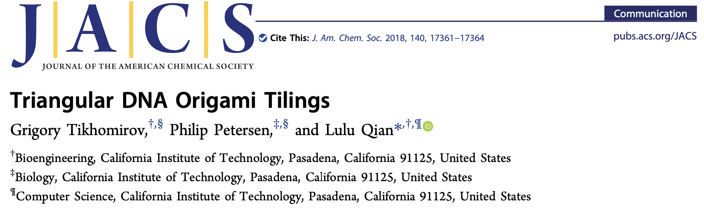

# 二、文章内容

## ABSTRACT

### 背景

DNA折纸 Tile 的铺设为 <u>使用平面DNA折纸结构作为构建块来创建复杂的分子图案和形状</u> 提供了方法。方形的Tile已被开发用于构建微米级的阵列，并使用随机或确定的策略生成图案。

### 文章总述

这里，我们展示了将三角形Tile作为一种用于 **丰富DNA Tile的设计空间** 与 **将自组装阵列的形状从二维扩展到三维** 的新方法。

我们介绍了一种在完全对称的 Tile 设计中 最大化结合特异性 的计算方法，利用该方法我们构造了一个类似**菱形三十面体的 20-Tile 的结构**。

我们利用Tile 的浓度、镁的浓度、以及 Tile 边设计中的折叠对称性实现了二维和三维结构之间的可控转换。并且，利用这些方法，我们构造了具有无界尺寸的和预定尺寸的二维阵列。

### 意义

三角形DNA折纸 Tile **边的可编程性** 和 **结构的灵活性** 使其成为构建能够进行**复杂自组装和重构**的人造分子机器和纳米器件  的理想构建块。

## Introduction

### 背景

DNA折纸的发明 1 加深了人们对分子如何在复杂的自组装过程中相互作用的理解，加速了具有定制结构和可编程行为的分子系统的工程化。

使用DNA折纸结构作为 Tile 在溶液 2−6 或表面上 7−9 构建二维阵列，实现了 用于制造更大的纳米设备的纳米颗粒  10,11  的精确组织，开辟了在更大的电路测试板上构建空间组织的DNA电路 12 和在更大的测试场地上开发分子机器人 13−16 的可能性。 

### 先前的工作

#### 正方形DNA折纸 Tile

在先前的工作中，我们设计了一种正方形DNA折纸 Tile ，用于创建无界阵列图案，这种阵列具有随机但可控的属性 17 ，以及具有创建任意图案的能力 18 。

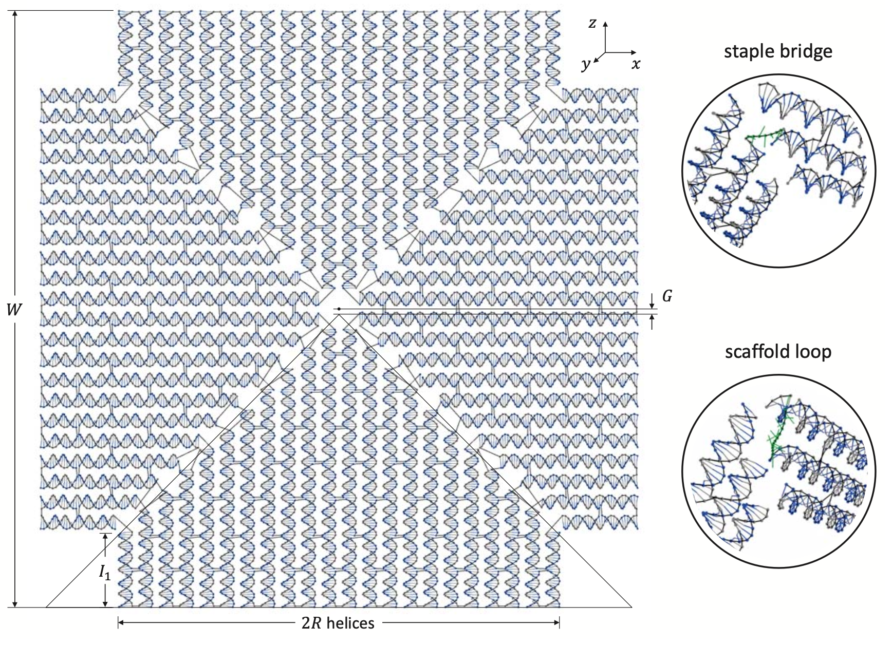

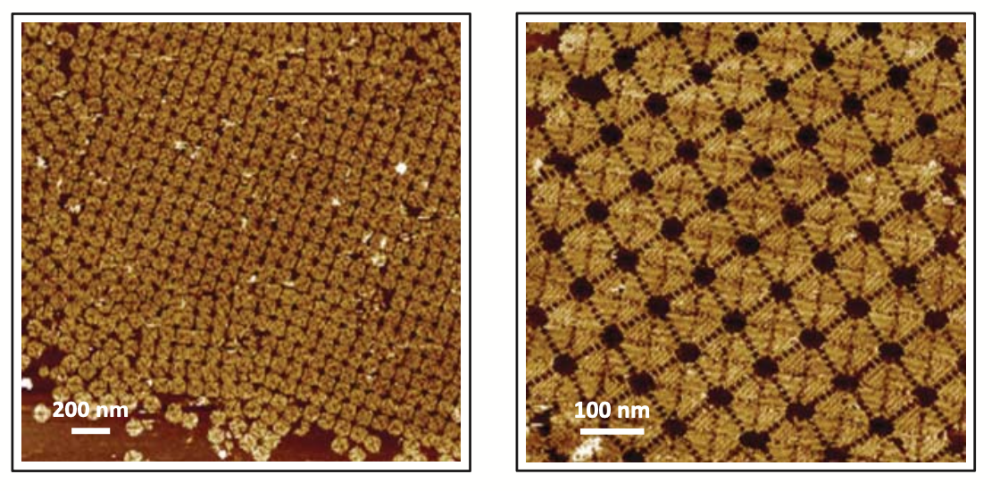

#### 正方形Tile的缺点

然而，正方形仅仅是具有二维空间填充特性的三种正多边形的其中一种，并且正方形和三角形的组合可以创建的形状和图案比仅单独使用正方形更有趣 19 。

#### 正方形到三角形

在这里，我们的目的是理解：

- ( i ) 正方形 Tile 的**设计原则**是否可以推广到三角形 Tile
- ( ii ) 考虑到几何上的差异，是否需要新的设计原则来编程 **Tile 之间的相互作用**
- ( iii ) 能否**控制三角形折纸 Tile 在2D和3D结构之间的转换**，特别是使用简单的方法，而无需对 Tile的设计进行重大改动。

## 正文

### 设计原则

#### 示意图与AFM图像

与正方形 Tile 的设计类似，该三角形包含一条scaffold，并且是旋转对称的，具有最大连续的表面积（图1a或图S1）。每个等边三角形的每条边上，以16个 “边staple” 为一组。这些staple可以被修改，通过**堆积键**和**短粘性末端**提供 Tile 之间的弱相互作用。AFM 图像显示三角形折纸 Tile 成形良好，估计产率为92.3 %（图1b、图S2）。

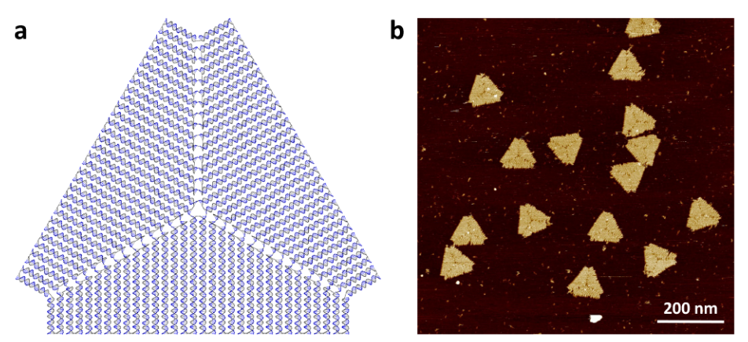

- 图1：三角形DNA折纸 Tile。
  - a：由三个等腰三角形组成的等边三角形的设计。注S2中描述了等边三角形的DNA折纸模型，图S9中显示了CaDNAno20示意图。
  - b：三角形DNA折纸 Tile 单体的AFM图像。

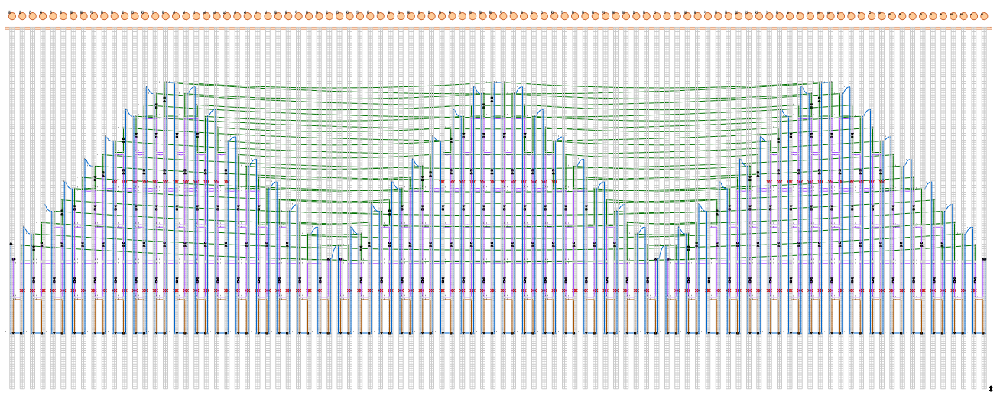

- 图S9：三角形DNA折纸Tile的CaDNAno示意图

#### 等边三角形的DNA折纸模型

**步骤一：计算每一个双螺旋行的碱基对数量**

- 双螺旋的最短行的长度 I1 = 11.4 nm
- 组成等边三角形的每个等腰三角形中，行的长度从短到长，总数为 R = 16
- 第 i 行的双螺旋的碱基对的数量

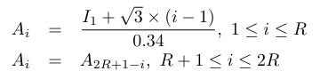

**步骤二：计算每个碱基连接骨架（backbones）的位置**

- 等边三角形的中心到三个等腰三角形组成的中心点的距离 G = 1nm（这个可调参数使得三个等腰三角形的贴合更紧密或更松散）
- 等边三角形边的长度

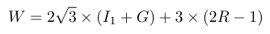

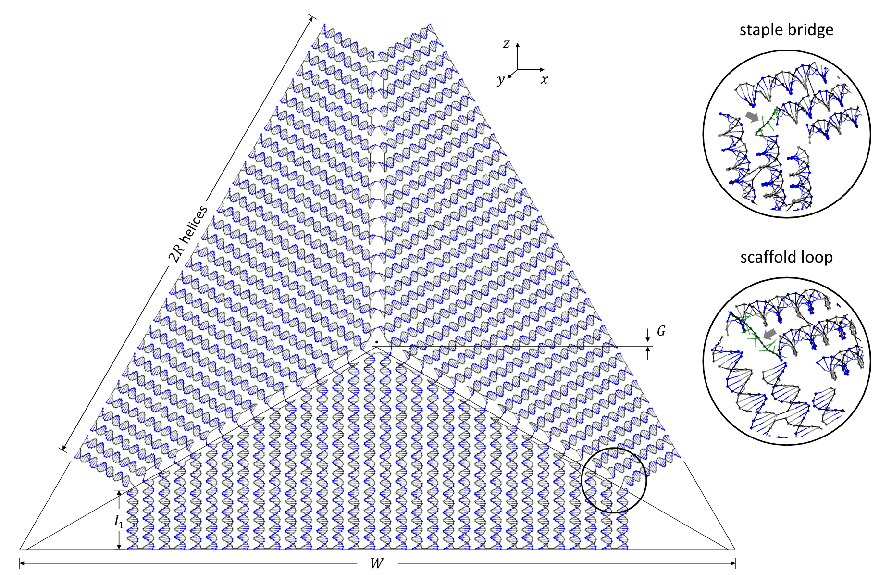

- 图S1：用于计算staple bridge和scaffold环中单链结构域长度的三维模型。
  - scaffold为灰色，staple为蓝色。
  - 等边三角形由三个等腰三角形组成。每个等腰三角形由2R = 32个螺旋组成，相邻螺旋之间有staple交叉点（crossovers）。
  - scaffold环的单链结构域允许相邻螺旋的内部末端在非交叉位置连接。
  - staple bridge的单链结构域将相邻三角形的接缝拉上拉链。
- 等边三角形中心的坐标位置为（0，0，0）。
- 在第1个等腰三角形的 第i行第j个碱基对的 2D平面内，螺旋轴的坐标位置C1,i,j = （cx，cy，cz）

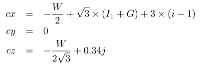

- 在第1个等腰三角形的 第i行第j个碱基对的 2D平面内，scaffold碱基与骨架相连的坐标位置

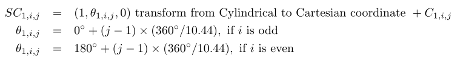

- 在第1个等腰三角形的 第i行第j个碱基对的 2D平面内，staple碱基与骨架相连的坐标位置

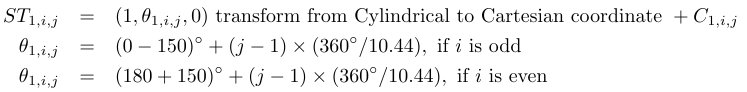

- 在第二个和第三个等腰三角形：每个坐标位置Ck,i,j，SCk,i,j，STk,i,j，（k=2，3），以（x，y，z）为格式进行如下计算

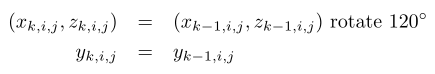

**步骤三：计算scaffold中的staple bridges的单链结构域长度**

- 第i个 staple bridge的长度

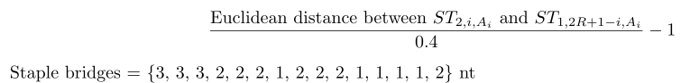

- 第i行和第i+1行螺旋间的scaffold loop的长度
  - 注意：中心的scaffold loop被手动设置为0，因为它是一个完美的scaffold交叉位置（crossover location）。

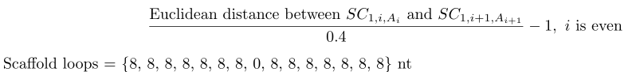

- 两个相邻的等腰三角形之间的scaffold bridge的长度
  - 注意：第3个等腰三角形与第1个等腰三角形之间的scaffold bridge被手动设置为7，因为这样可以使用M13 scaffold 的全长( 7249nt)。

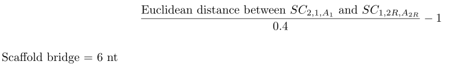

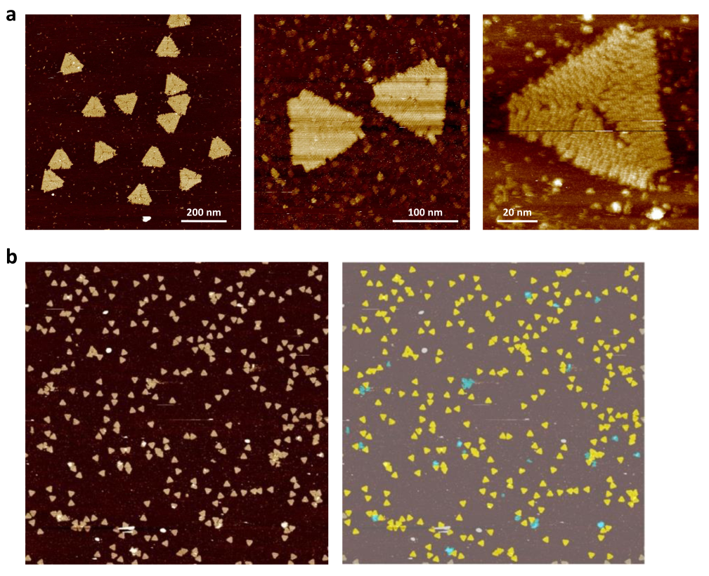

- 图S2：三角形DNA折纸Tile的AFM图像
  - a：每个Tile具有一整套的边staple。在含有10 mM MgCl2 和 10 mM NiCl2 的 1xTE buffer 获得了高分辨率图像。
  - b：5μm × 5μm 的AFM图像（左），产率估计为 92.3%（右）。使用了一个产量计算器1，将良好成型的结构用黄色表示，将畸形或不完整的结构用蓝色表示。三角形Tile的产量被估计为黄色像素的总数除以黄色和蓝色像素的数量之和。Staple序列列于表S1和S2。

### Tile 之间的相互作用

#### 边的相互作用

我们先前已经了解到：

- 仅仅通过堆积键不能为大型二维阵列的自组装提供足够的特异性，并且需要短的粘性末端来引入额外的特异性

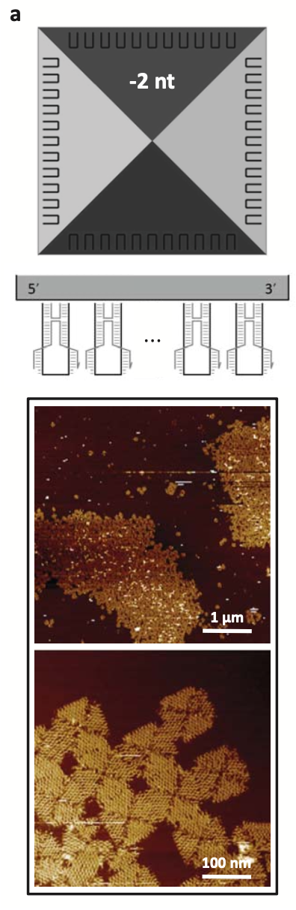

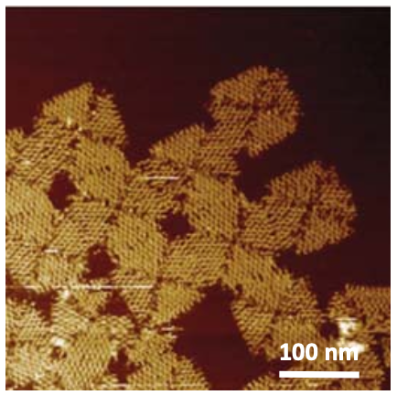

- 同时，引入粘性末端时仍然需要保持 Tile 与 Tile 之间较弱的相互作用，以避免自组装过程中的动力学陷阱17。
  - 动力学陷阱（Kinetic trap）：而随着聚合度不断增加，中间体的稳定性会持续提高，因此形成较为稳定的中间体结构就有了可能性，这就是所谓的动力学陷阱。

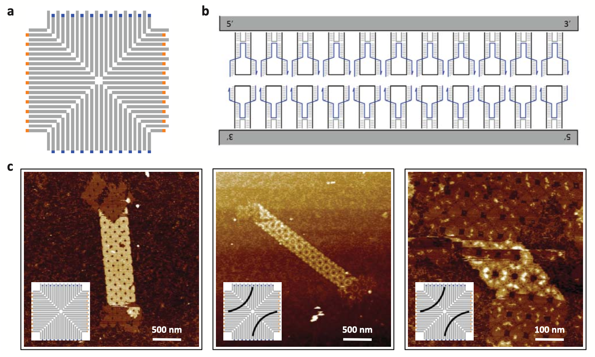

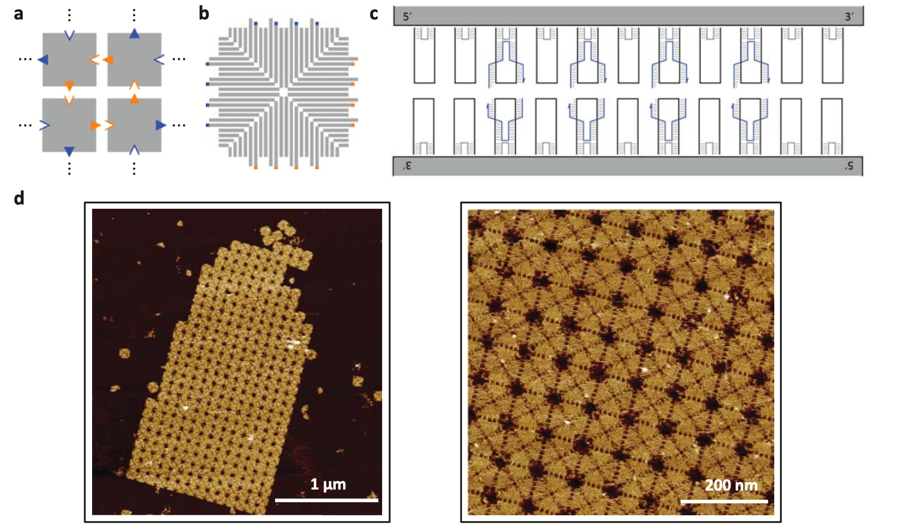

#### 完全对称的设计原则

先前的设计的一个特点是粘性末端的序列依赖于M13 scaffold的序列，这导致了其自然地允许独特的边的相互作用。

然而，这也导致了一个限制，即无法在所有边上创建具有相同粘性末端序列的真正对称的Tile。

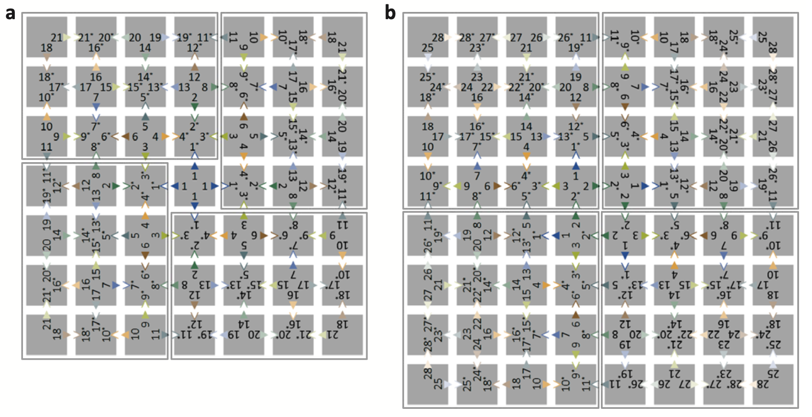

在这里，我们探索了一种新的设计原理，该原理通过数据挖掘在所有Tile的边上最大化相同的粘性末端序列。

因为M13是一个环状链，因此在设计staple时，任何核苷酸位置都可以作为scaffold的起点。对于所有可能的scaffold起点，沿着三角形Tile的三条边的16个位置中的每一个，我们计算了三种staple的5‘端和3’端相同的核苷酸的总数。在具有最多相同的核苷酸的起点之中，我们选择了具有良好的序列多样性和均衡的核苷酸位置的那一个。

使用这些核苷酸作为粘性末端，创建了一个完全对称的瓦片，其中每条边与自身以及与其他两条边互补（图2a左）。每条边上使用了共计12个 1nt 的粘性末端和 8个堆叠键，这比之前设计的正方形瓷砖更加稳固17。值得注意的是，这种Tile设计仍然兼容于创建独特的边相互作用，因为可以对staple进行截断和扩展进行不同的选择。

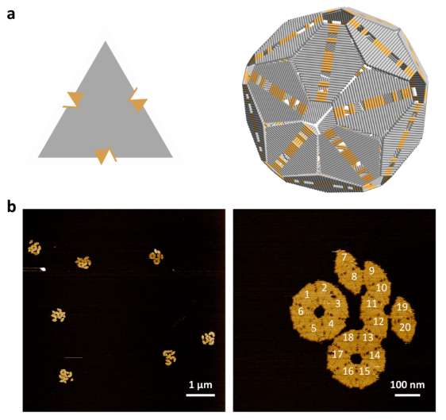

- 图2：一种 20-Tile 的结构，被解释为菱形的三十面体。
  - a：对称Tile（左）的和自组装结构（右）的抽象设计示意图。向外的实心箭头与向内的空心箭头组合在一起，表示一条自我互补的边，这条边既有延伸的staple又有截断的staple。详细的边的设计如图S7所示。
  - b：AFM图像。尽管六边形形状在3D结构中没有出现，但它们在一些平面2D结构中被观察到，这可能是因为三角形Tile在云母表面上可以发生重组。

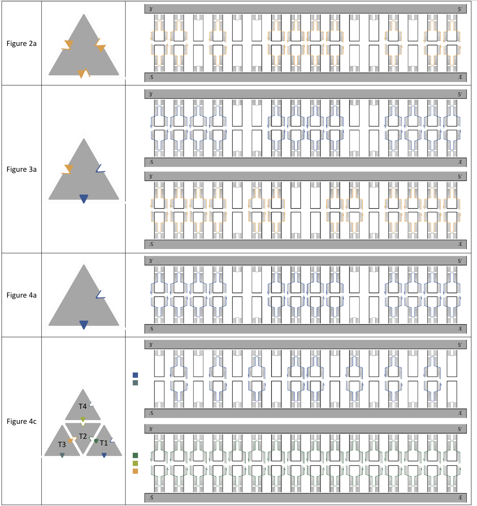

- 图S7：每个Tile中的具有延伸和截断的边staple的示意图，对应于组成菱形的三十面体（图2a）、无界阵列（图3a）、以及具有部分穹顶结构小的六边形形状阵列（图4a）、大的六边形形状阵列（图4c）。在完全对称的Tile中（图2a），在发现6个共同的核苷酸后（沿着三条边的16个staple的5‘和3’端），第 i 个staple的每一个相同的核苷酸被截断，第 17-i 个staple则使用相同的核苷酸序列延伸（设计staple链时，使用scaffold链的第5087个核苷酸作为开始点）。

#### 尝试构建无界的阵列

利用这种的对称的三角形Tile，我们尝试构建无界的阵列。令人惊讶的是，在AFM图像中观察到的结构是一小群三角形，其中一些甚至没有连接（图2b）。此外，每组中三角形的数量均为20（图S3a）。

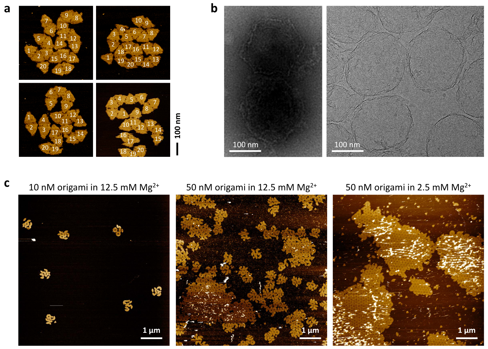

- 图S3：自组装成菱形三十面体或无界阵列的单个瓦片。
  - a：菱形三十面体的AFM图像。
  - b：菱形三十面体的TEM图像。
    - 左：醋酸双氧铀（uranyl acetate）染色。
    - 右：未染色冷冻电镜。用含 12.5 mM Mg2+的 1 × TE 缓冲液将两个样品稀释至5 nM，置于涂有多孔碳的3 mm 的TEM铜网上。由12次测量的冷冻电镜图像平均得到，球形结构的直径估计为205.4 ± 11.1 nm。误差与标准差相对应。
  - c：在较低的折纸浓度以及较高的镁中，自组装形成菱形三十面体的相同Tile的AFM图像；以及在较高的折纸浓度和较低的镁中，形成无界阵列的AFM图像。staple 序列列于表S1和S5。

我们假设Tile不是形成2D阵列，而是自组装成封闭的3D结构；在AFM成像过程中，由于对平面云母表面的吸引力，每个3D结构沿随机的边展开，导致瓦片之间的相对位置不同，但同一3D结构中的所有Tile仍然彼此靠近。透射电子显微镜( TEM )图像显示了球形结构，估计该结构的直径为205.4 ± 11.1 nm (图S3b )，与由20个正三角形组成的二十面体的内切球直径一致（即大约205 nm）。

#### 二十面体与三十面体

形成二十面体需要Tile沿着边小角度弯曲，这与堆叠键的方向不兼容，Tile-Tile之间的相互作用只能依靠粘性末端（图2a右面板）。事实上，仅含有堆叠键的Tile在AFM图像中也能够形成 20 - tile 结构(图S4 )，说明3D结构更可能是菱形三十面体。

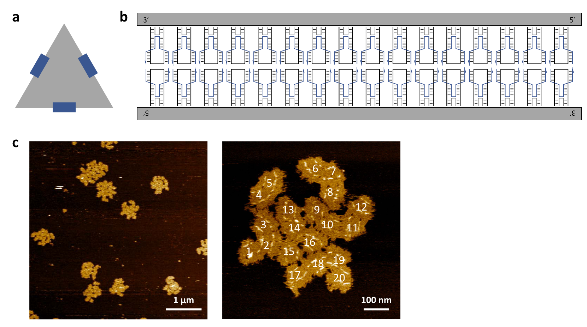

- 图S4：单个Tile，仅含有堆叠键，自组装成菱形三面体。
  - a：Tile设计示意图。
  - b：边staple示意图。
  - c：AFM图像。右侧AFM图像中的亮点对应于Tile表面的双链延伸。这些延伸设计成两个弧的模式，每个弧连接三角形的两个边的1/3 或 2/3 点，以此来创建全局模式，如先前在方形DNA折纸中讨论的那样2，具有随机且可控特性。staple序列列于表S1和S3。

### 控制三角形折纸 Tile 在2D和3D结构之间的转换

#### 2D结构和3D结构

这个意想不到的结果促使我们研究如何使用相同的瓦片设计来控制2D和3D结构之间的转换。我们发现对称的三角形Tile在较低的Tile浓度和较高的镁浓度下自组装成菱形三十面体，而在较高的Tile浓度和较低的镁浓度下自组装成无界的2D阵列（图S3c）。众所周知，如果存在多条可能的需要不同反应物数量的反应路径，那么在反应物浓度足够低的情况下，更倾向于低级反应。由于闭合一个3D结构需要单分子反应，而生长2D阵列需要双分子反应，因此可以合理地假设3D结构的形成在较低浓度下更有优势。另外，镁可以稳定DNA杂交21，减少DNA折纸中的螺旋间距（interhelical spacing）22。较低的镁含量会导致阵列的熔化温度较低，这意味着Tile在较低的温度下自组装成阵列时可能具有更高的刚性，因此结构中的弯曲将受到抑制。同时，折纸结构的轻微膨胀可能改变了Tile可能的固有曲率，这有利于2D阵列的形成。

#### 非对称设计

另外，改变瓦片设计为非对称也可以促进2D阵列的形成（图3a）。在这个设计中，Tile的一条边是自我互补的（橙色），而另外两条边彼此互补（蓝色）。由于粘性末端序列不再相同，计算搜索的结果在这里不再发挥作用，但边staple的位置允许6个G / C和6个A / T碱基对同时在橙色和蓝色边上，以大致平衡结合的强度。在2D阵列中，有两种Tile之间的邻域交替配置：一种为六条蓝色边、一种为三条蓝色边和三条橙色边。如果将缺失了一些Tile的2D阵列折叠成3D结构，就有可能创建一个顶点，其中有5条蓝色的边相遇；但如果它们是蓝色和橙色的，就不可能在顶点处有奇数条边相遇。因此，这种非对称的Tile设计在几何学上与二十面体或菱形三十面体是不相容的。AFM图像显示，2D阵列的结晶区域面积高达约3.5 μm × 4.5 μm（图3b）。

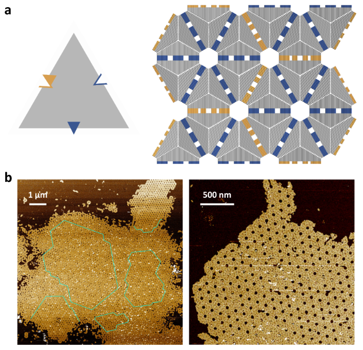

- 图3：无界2D阵列。
  - a：非对称的Tile (左) 和自组装结构 (右) 的抽象设计图。边的详细设计见图S7。
  - b：AFM图像。结晶区域的边界在青色中被突出显示。

#### 具有预定尺寸的结构

用惰性边替换非对称Tile中的自我互补边，可以实现具有预定（designed）尺寸的结构的自组装（图4a）。类似于菱形三十面体的形成方式，除了六边形形状外，这种Tile还能够形成3D穹顶结构。事实上，在AFM图像中发现了六边形结构和5-tile结构，这严重限制了六边形的产量（图4b）。使用四个独特的Tile来形成更大的六边形也会出现这种现象（图4cd）。

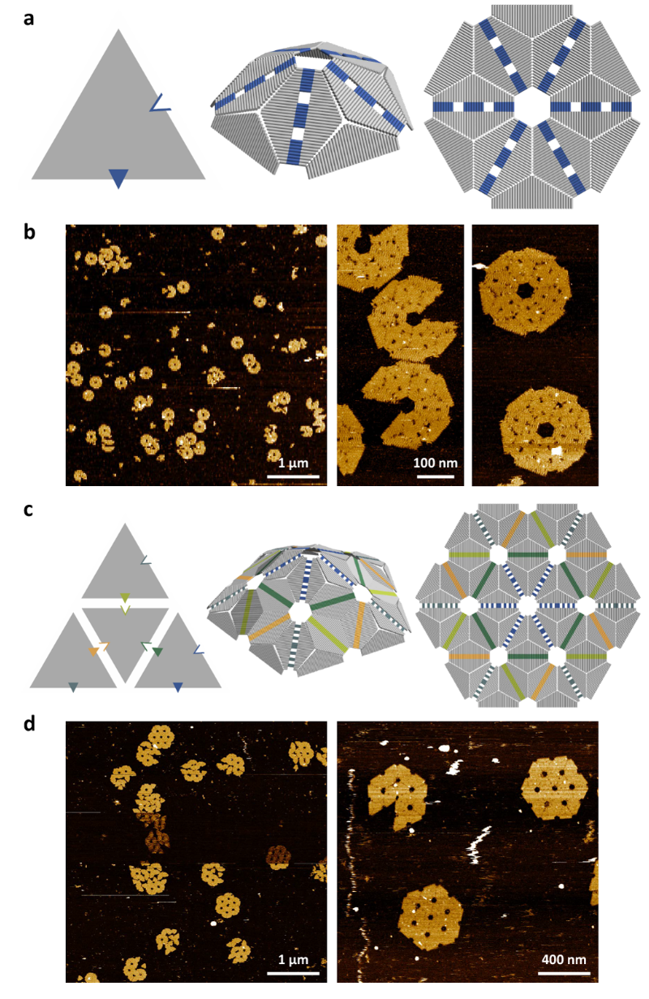

- 图4：具有预定尺寸的2D和3D结构。小六边形结构与5-tile的吃豆人形状的结构混合在一起，（a）抽象设计示意图（b）AFM图像。大六边形结构与20-tile的吃豆人形状的结构混合在一起，（c）抽象设计示意图（d）AFM图像。边的详细设计见图S7。

#### 改进

不对称Tile的设计阻碍3D结构形成的相同原理可以应用于具有预定尺寸的结构。例如，可以使用两个独特的Tile来创建一个小的六边形（图5a）。使用两条交替的边，可以构建具有偶数但不是奇数块Tile的结构。AFM图像显示了对角线约为270 nm的六边形的良好形成(图5b )，产率估计为75.1 %（图S5）。

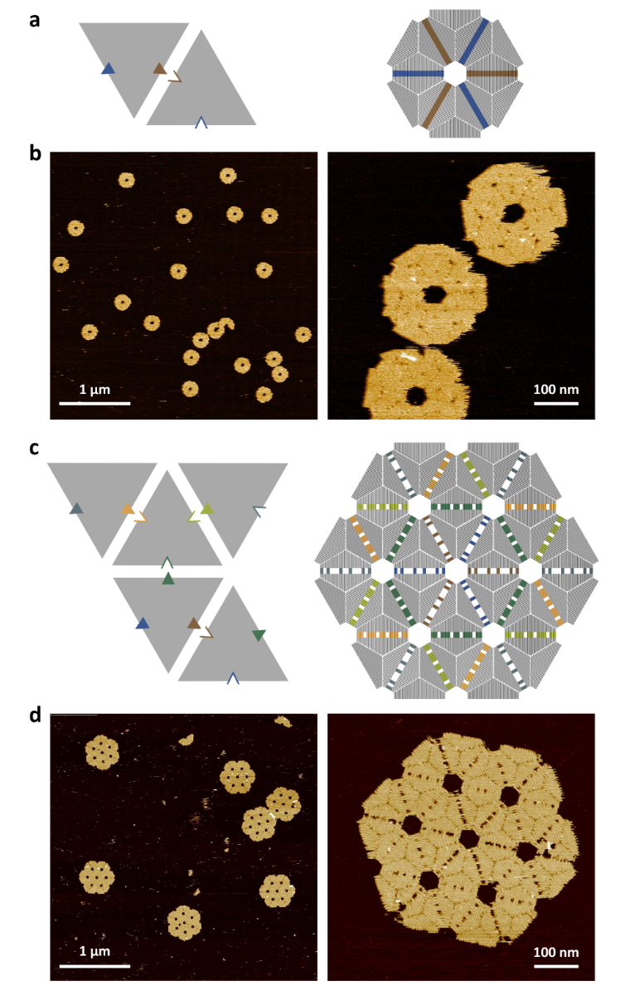

- 图5：具有预定结构的2D阵列。小六边形的抽象设计示意图（a）和AFM图像（b）。大六边形的抽象设计示意图（c）和AFM图像（d）。边的详细设计见图S8。

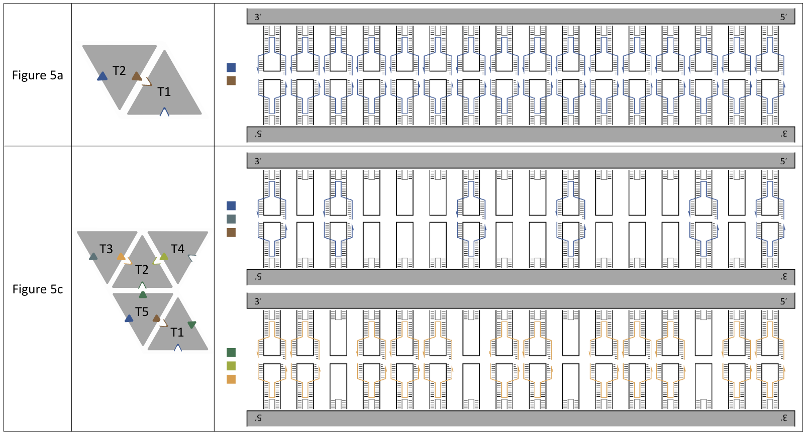

- 图S8：自组装成小六边形(图5a )和大六边形(图5c )阵列的Tile中具有核苷酸延伸和截断的边staple的示意图。

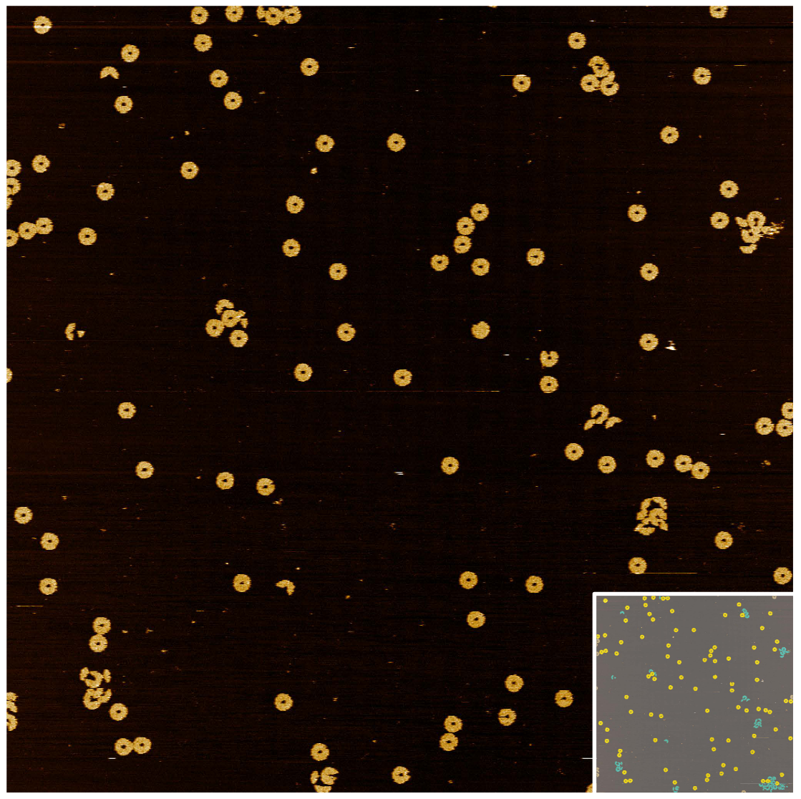

- 图S5：一个10 μm × 10 μm的小六边形阵列的AFM图像( 图5a )，其产率估计为75.1 %。使用了一个产量计算器1，将良好成型的结构用黄色表示，将畸形或不完整的结构用蓝色表示。小六边形的产量被估计为黄色像素的总数除以黄色和蓝色像素的数量之和。Staple序列列于表S1、S8和S9。

同样，使用五个独特的Tile可以创建更大的六边形（图5c）。为了促进一个一锅的（one-pot）、两阶段的（two-staged）自组装过程，在组成一个更大的三角形的四个Tile（组成六边形的六个更大的三角形）之间使用了12个（6个）staple的更强（更弱）边相互作用。如AFM图像所示（图5d）,构建了对角线长约为540 nm的六边形，估计产率为35.4%（图S6）。

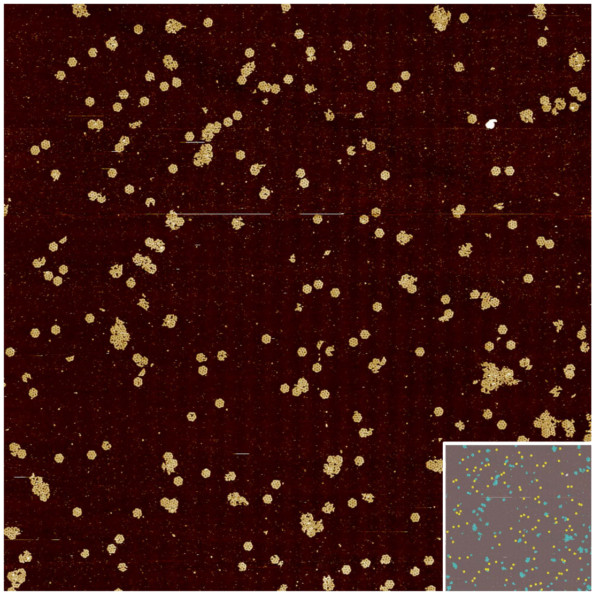

- 图S6：一个 30 μm × 30 μm的大六边形阵列的AFM图像( 图5c )，其产率估计为35.4 %。使用了一个产量计算器1，将良好成型的结构用黄色表示，将畸形或不完整的结构用蓝色表示。大六边形的产量被估计为黄色像素的总数除以黄色和蓝色像素的数量之和。Staple序列列于表S1、S10和S14。

我们已经证明，一个三角形的DNA折纸Tile可以自组装成具有无界尺寸和预定尺寸的2D和3D结构。

## Discussion

与先前开发的三角形DNA折纸结构不同1，8，9，这种新的Tile具有垂直于所有3条边的DNA螺旋，这使得利用堆叠键和短粘性末端的组合来创建具有所需特异性和结合能的边相互作用具有高度的可编程性。

重要的是，Tile的结构灵活性，特别是沿构成等边三角形的相邻等腰三角形之间的接缝弯曲的可能性，允许形成3D结构。

如果需要，可以通过编程 bridge staple 中单链结构域的长度来诱导特定的弯曲程度23。同样的结构上的柔性也在编程DNA折纸结构之间的动态相互作用中起着重要的作用，我们称之为Tile 置换机制24。

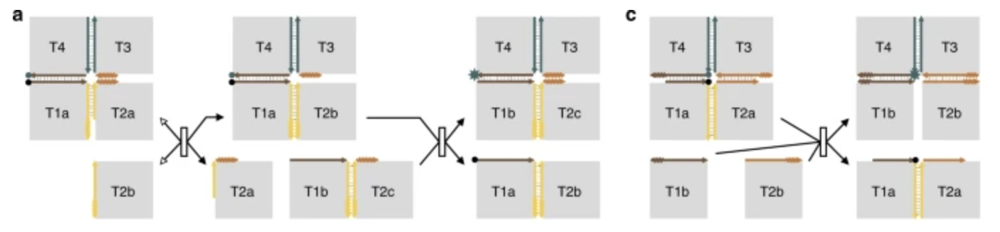

将三角形Tile与先前开发的正方形Tile相结合，将为编程分子系统中复杂的自组装和重构开拓新的机遇。

