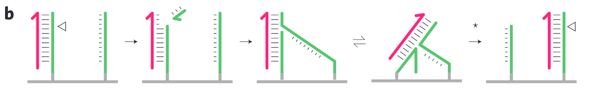
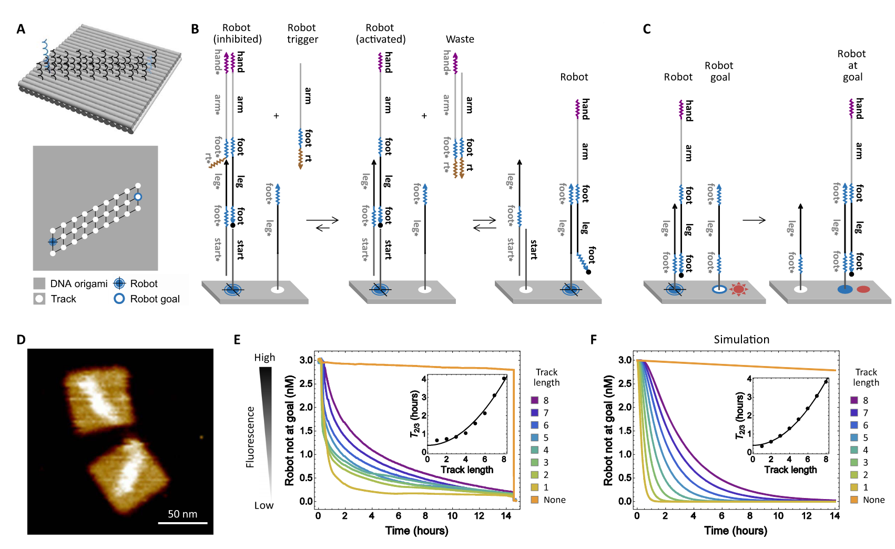
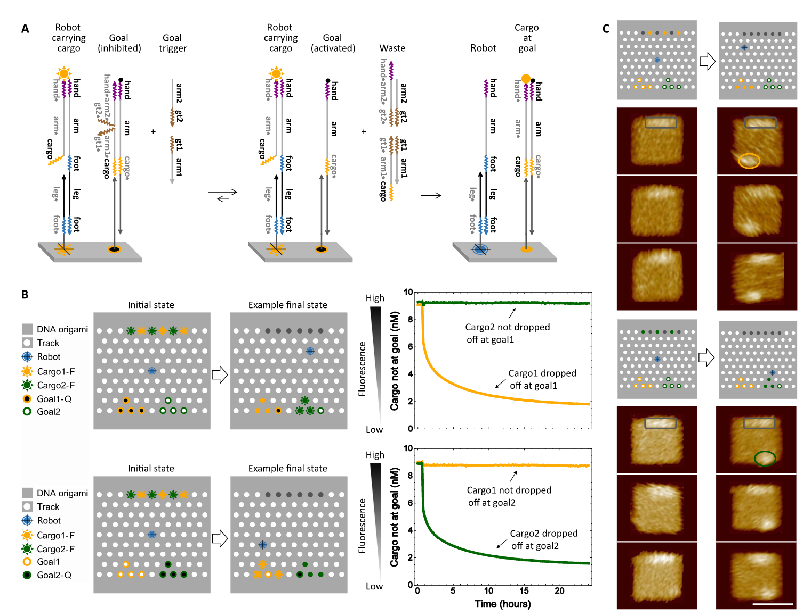
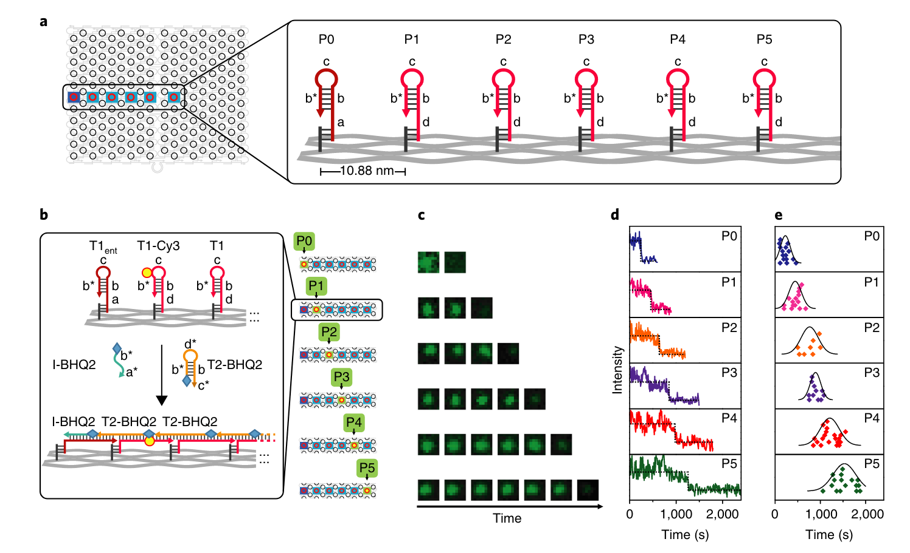
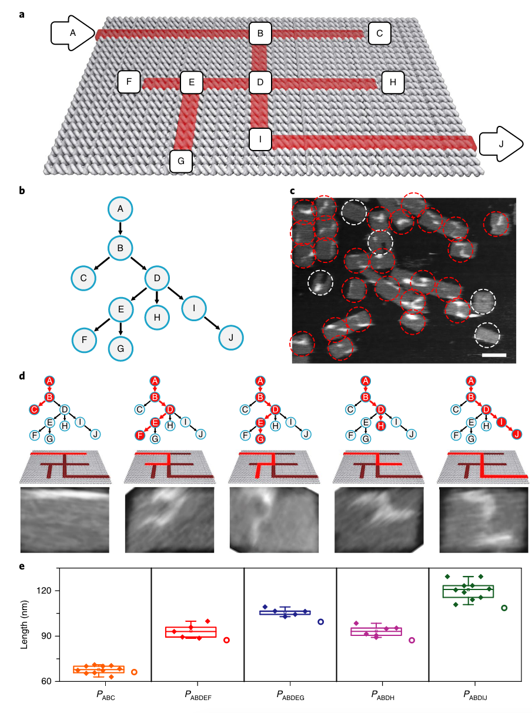
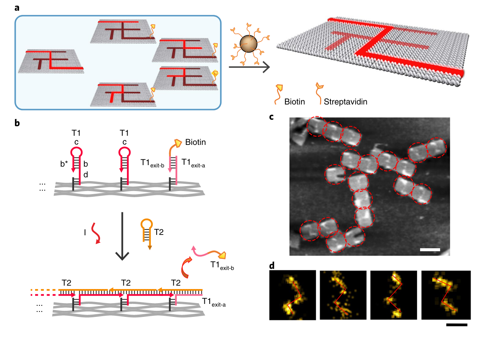

## Direct observation of stepwise movement of a synthetic molecular transporter

人工合成分子转运体的逐步运动的直接观察

- 图1：DNA马达和轨道。

  - a：DNA折纸Tile的布局，单链固定子构成的轨道（绿色）和相反面的两行发夹环（蓝色）。
  - b：马达机制：一个切口酶切割与马达结合的固定子，在马达的3‘端暴露出一个toehold，通过分支迁移促进马达转移到相邻的完整固定子。
  - c：轨道上的所有固定子都结合有马达链的AFM图像。图1c显示了沿对角线的间隔为6 nm的固定子阵列，其中发夹修饰的staple形成了两条平行线，充当某些测量方式的图像的参考标记。
  - d，e：

    - d：在Tile组装过程中，通过省略第一个固定子，可以实现马达在轨道上的精确定位。

    - e：在d之后，通过添加与马达杂交的缺失固定子来修复Tile

## 运行机制

- 马达是与固定子互补的单链DNA。
- 马达-固定子双链体包含一个切口酶的识别位点，该酶催化固定子的特定骨干连接处（specific backbone linkage）的水解20。

- 水解释放的能量驱动马达从切割的固定子运动到相邻的完整固定子6。
- 切割的固定子-马达双链体的长度( 16 bp≈5.44 nm )与固定子的间距( ～6nm )相似。

图1b展示了设计的转移机制为：

- 在 6-nt 的切割片段的热力解离作用后，马达3′端暴露的碱基通过杂交引发链交换。
- 由于马达后面的所有固定子都已被切断( 一种 "过河拆桥"机制 )，因此实现了定向运动。
- 第1个固定子与马达形成2个额外的碱基配对，来帮助偏置初始的马达位置。这种额外的重叠有助于保持马达对初始固定子的强烈偏置，直到固定子在添加酶时被切割。

- 最后一个固定子有一个修改的序列，这个序列在马达-固定子双链体中产生不匹配，保护它不受酶的影响

## A cargo-sorting DNA robot

- 图1：货物分类算法( Cargo-Sorting algorithm )。
  - A：在指定目的地将任意分布的分子排序到不同堆中的示意图。
  - B：一个简单货物分拣算法的流程图。在分子实现中，取货和卸货的选择并不总是像设计的那样- -机器人可能以小概率随机行走。三个构建模块的机制为( C )随机行走，( D )取货和( E )卸货。
  - F：三个构建块的可组合性。三种类型的轮廓突出了三个构建块中使用的组件。
  - G：实现对多种类型货物的分拣。曲线表示短的toehold域，直线表示长的分支迁移域，箭头标记其3′末端。

- 图2：随机行走构建块。
  - A：双层DNA折纸上的八步（eight-step）长轨道的3D和2D示意图。相邻轨道位置之间的线表示机器人可能的运动：两种类型的轨道链呈棋盘格模式，对于每一步，机器人只能在两种不同类型的轨道之间移动。因此，六边形网格在功能上是机器人运动的正方形网格（图S4A）。
  - B：保护机器人免受轨道干扰的机制，仅在实验开始时激活机器人的机制。通过使用浓度是受抑制机器人的20倍的触发链，激活反应向前倾斜。
  - C：机器人达到目标位置的机制。
  - D：轨道长度为8的双层DNA折纸的AFM图像。
  - E：使用八种不同轨道长度的随机行走实验和一个无轨道的阴性对照组的荧光动力学数据。在实验结束时，加入了相对于折纸浓度的20倍过量的自由漂浮机器人链，以测量最大可能完成率（completion level）。以 2/3 完工时间 (T2/3)对轨道长度( l )作图。最小二乘法拟合的二次函数为T2/3 = 0.38 + 0.055 × l2。
  - F：随机游走和阴性对照组的群体行为模拟。在该模型中，机器人以kw = 3.5 × 10-3 s-1从任意轨迹位置行走到其相邻位置。机器人在kt = 3.2 × 104 M -1s -1时被初始抑制和触发。这两个速率常数是根据实验数据得到的三分之二完成时间与轨道长度的二次拟合确定的。在ks = 5 × 102 M-1 s-1时，用一个DNA折纸上的机器人与另一个DNA折纸上的目标的相互作用来模拟阴性对照组。

- 图3：货物分类的演示。
  - A：保护目标免受与货物干扰的机制，仅在实验开始时激活目标的机制。如图S8A所示的所有货物分类系统的两种轨道的布局。
  - B：使用两种不同类型的货物的货物分类实验的荧光动力学数据。在初始状态下，货物1-F和货物2-F表示被荧光基团标记的货物，并且目标1-Q和目标2-Q表示被淬灭基团标记的目标。最后的状态显示了机器人位置的随机选择和一个未被占用的目标。
  - C：每种类型的货物在其初始位置和运送到目标位置的AFM图像。所有图像均在同一比例尺下，右下方图像中的比例尺为50 nm。

## Solving mazes with single-molecule DNA navigators

- 图1：单分子DNA导航器的物理实现。
  - a：PSEC（proximal strand exchange cascade，近端链交换级联）系统示意图。在一个尺寸为100 x 70 nm2的矩形DNA折纸基底上构造了一个无环连通图（即一棵树）。T1和T2是两种用于驱动树上的PSEC的燃料。启动器I用于从入口顶点ENT触发PSEC的启动。
  - b：PSEC系统的传播机制。启动器I识别并打开顶点ENT处的T1ent发夹。打开的T1ent发夹从环境中捕获并打开一个T2发夹，以启动T2和T1之间的级联反应。
  - c：PSEC铺设了一条直线，并且可以用DNA-PAINT可视化。这条线的设计长度为76 nm，并放置在矩形DNA折纸的中间。Alexa647标记的anti-tag与嵌入在形成的路径中的T2瞬时结合（图S4）。
  - d：四个铺设而成的数字“2”、“0”、“1”、“7”的AFM图像。角点处的T1发夹被修改，以防止不必要的跨距（spans）（图S9）。箭头表示PSEC的传播方向。比例尺：50 nm。

- 图2：PSEC动力学的单分子表征。
  - a：以DNA折纸中间的一条直线作为测试平台。顶点P0为起点，顶点P1 ~ P5为中间点。
  - b：用时间分辨TIRF测量动力学的六个平行实验的设计的详细介绍。BHQ2标记的T2用于淬灭Cy3标记的T1，并且有助于获得每个步骤的动力学曲线。图示的例子用于展示P1淬灭的机制。
  - c：六次平行实验的TIRF图像显示了荧光随时间变化。可以观察到从P0到P5的一系列淬灭时间点。
  - d：典型的单分子荧光曲线，用于监测从P0到P5顶点发生的猝灭事件。
  - e：散点图表示对每条路径的长度分布的统计分析。

- 图3：PSEC驱动的图在迷宫上遍历。
  - a：十个顶点的迷宫设计。箭头分别表示入口顶点A和出口顶点J。
  - b：迷宫相当于一棵具有十个顶点的有根树。入口顶点A对应于此树的根。
  - c：AFM图像显示了遍历实验的结果，生成了所有可能的路径。在PDFS算法的DNA计算实现中，大量的PSEC事件同时发生以实现迷宫上的图遍历。在出口处或死胡同（dead-ends）结束的PSEC用红色圆圈标记，无效（invalid）结构用白色圆圈标记。比例尺：100 nm。
  - d：混合物中发现的典型路径。从左到右：路径PABC、PABDEF、PABDEG、PABDH、PABDIJ。只有PABDIJ是迷宫的正确解。
  - e：散点图表示对每条路径的长度分布的统计分析。误差棒为不同路径下的样本量N = 10，5，5，6和10的标准差。圆圈表示理论长度。

- 图4：用于迷宫求解的单分子DNA导航仪。
  - a：基于磁珠选择的示意图。出口处顶点J用生物素标记，以区分正确和错误的路径。只有当PSEC到达正确的出口J时，生物素修饰的T1exit-b链才会被释放。因此，所有错误的路径都会被链霉亲和素修饰的磁珠捕获并移除。
  - b：PSEC在出口J处释放生物素修饰物的详细介绍。
  - c：进行选择后，正确解的AFM表征。保留下来的结构均显示出正确的求解路径PABDIJ。
  - d：进行选择后，正确解的单分子和类平均（class-averaged）DNA-PAINT表征。比例尺：c：100 nm；d：50 nm。

