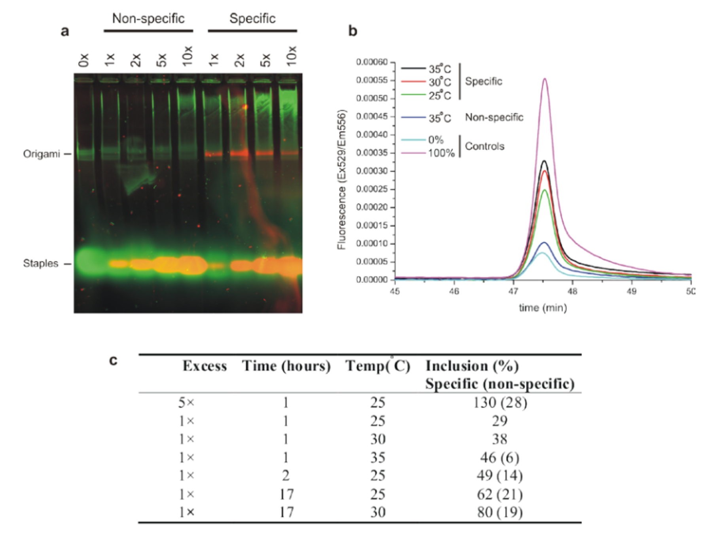
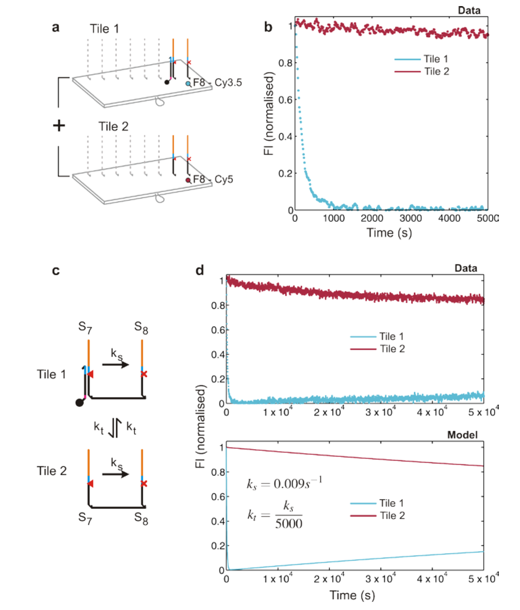

Direct observation of stepwise movement of a synthetic molecular transporter

人工合成分子转运体的逐步运动的直接观察

# 一、文章简介

# 二、文章内容

## 摘要

**背景：**

利用Watson - Crick碱基配对来指导DNA轨道、DNA马达1 - 12和DNA燃料13 - 15组成的分子运输系统的组装和操作，可以实现纳米尺度的可控运动。

**文章总述：**

- 在这里，我们在二维的scaffold16上组装了一个 100 nm 长的DNA轨道，并展示了一个位于轨道一端的DNA马达，其进行了16个连续的步骤，沿着轨道全程以恒定的平均速度自主移动。

- 实时原子力显微镜可以直接观察单个马达的单个步骤，揭示其运行的机械细节。

**意义：**

这种精确控制的、远距离的运输可以开发 利用轨道和马达的核苷酸序列编码的指令进行编程和布线 的系统。这类系统可用于创建以核糖体为模型的分子装配线。

## 背景

- 一个有效的线性分子马达必须在不解离1 - 7，10，12的情况下横渡它的轨道，并且在没有外部干预的情况下单向运行4 - 12。

- 对于这种自动马达，方向性可以通过以下方式实现：
  - 通过DNA指令的顺序添加1 - 3来实现
  - 通过修改已经访问过的轨道位点5、6、12来实现
  - 通过将运动耦合到单向反应循环（不可逆的反应循环）中去4、9、12来实现
  - 通过协调马达不同部分的构象变化11、12来实现
- 尽管具有多条腿的随机 DNA "spider" 已经被证明可以通过有偏扩散17 沿着100 nm的轨道18 移动更长的距离，但满足以上 “有效的线性分子马达” 的所有条件的DNA马达被证明通常只存在允许 1~3 个步骤的轨道上。

## 分子设计

我们研究了由DNA水解6驱动的、简单定向的、向前的马达运动，该马达沿着由称为“固定子”的**单链附着位点**的一维阵列组成的轨道运动，这些 “固定子” 的间距约为6 nm。

在一个100 nm x 70 nm 的矩形DNA折纸Tile上组装了一个具有15个相同固定子的轨道，其两侧有特殊的开始与停止固定子6（参考文献16；图1；图S1、S2）。

- 图1：DNA马达和轨道。

  - a：DNA折纸Tile的布局，单链固定子构成的轨道（绿色）和相反面的两行发夹环（蓝色）。
  - b：马达机制：一个切口酶切割与马达结合的固定子，在马达的3‘端暴露出一个toehold，通过分支迁移促进马达转移到相邻的完整固定子。
  - c：轨道上的所有固定子都结合有马达链的AFM图像。图1c显示了沿对角线的间隔为6 nm的固定子阵列，其中发夹修饰的staple形成了两条平行线，充当某些测量方式的图像的参考标记。
  - d，e：

    - d：在Tile组装过程中，通过省略第一个固定子，可以实现马达在轨道上的精确定位。

    - e：在d之后，通过添加与马达杂交的缺失固定子来修复Tile

Tile由 7249 nt 的单链DNA模板(噬菌体M13的基因组)与合成的短staple链杂交，最终的Tile由24个平行的双螺旋组成，并由staple交叉连接。

- 图S1：用于AFM测量的折纸轨道设计（Tile type A）
  - A类Tile交叉点之间的距离为16 bp，产生轻微的缠绕不足（每个 turn 10.7 bp），这可能会导致Tile的全局右旋扭曲19。

- 图S2：用于荧光测量的折纸轨道设计（Tile type B）
  - B类Tile的设计是为了减少这种扭曲：交叉点之间的平均距离为15.6 bp (每个turn 10.4 bp)。

## 运行机制

- 马达是与固定子互补的单链DNA。
- 马达-固定子双链体包含一个切口酶的识别位点，该酶催化固定子的特定骨干连接处（specific backbone linkage）的水解20。<u>切口酶是在特定识别核苷酸序列处切割双链 DNA 的一条链的酶。此类酶仅水解DNA 双链体的一条链，产生“缺口”而非切割的 DNA 分子。</u>

- 水解释放的能量驱动马达从切割的固定子运动到相邻的完整固定子6。
- 切割的固定子-马达双链体的长度( 16 bp≈5.44 nm )与固定子的间距( ～6nm )相似。

图1b展示了设计的转移机制为：

- 在 6-nt 的切割片段的热力解离作用后，马达3′端暴露的碱基通过杂交引发链交换。
- 由于马达后面的所有固定子都已被切断( 一种 "过河拆桥"机制 )，因此实现了定向运动。
- 第1个固定子与马达形成2个额外的碱基配对，来帮助偏置初始的马达位置。这种额外的重叠有助于保持马达对初始固定子的强烈偏置，直到固定子在添加酶时被切割。

- 最后一个固定子有一个修改的序列，这个序列在马达-固定子双链体中产生不匹配，保护它不受酶的影响，并可以捕获马达6。

## 荧光测量

### 荧光基团修饰设计

为了通过整体荧光测量来观察马达的运行，马达被修改为携带淬灭基团，并通过了一系列沿着轨道的特定位置的荧光团。

采用B型Tile上的八固定子轨道( S1~S8 )进行荧光实验：马达在S1处启动，在S8处被捕获。

### Tile组装的省略与修复

通过在Tile组装时省略 承载着相应固定子的staple（图1d），然后插入承载马达的staple，将其与有缺陷的Tile在室温下孵育（图1e；图S3、S4），以实现 马达在特定位置被启动。

**折纸纯化：**使用Sephacry1 S-300 HR（GE Healthcare）的手动填充柱，通过凝胶过滤法（gel filtration），把过量的staple从折纸中分离。

- 这是一种使用树脂的尺寸排除法，DNA的排除限制为118 bp。
- 取60 μL的折纸样品，在树脂体积约500 μL的柱上，以1000 g 离心 4 min，纯化3次。
- 这为荧光测量提供了一个低的背景值（low background level），样品中只有很小的损失。

**HPLC：**使用一个离子交换柱（ion exchange column (DEAE Sepharose, GE Healthcare)），在低盐浓度捕获DNA (100mM NaCl, 1×tris-acetate, 12.5 mM magnesium acetate)，通过HPLC定量链结合（strand inclusion）的效率。

- 用递增的NaCl梯度洗脱DNA，将折纸从staple链中分离出来。
- 图S3显示了检测到的峰的样本曲线和琼脂糖凝胶图。
- 用洗脱液在260 nm的吸光度来检测DNA，用荧光(Ex/Em 529 nm/555 nm)来检测插入到Tile中的单一荧光staple链数量。
- 使用相应DNA吸光度峰的面积归一化了被标记的折纸的荧光峰的面积，以便比较不同样品的插入效率。

**荧光测量：**

- 图S3：DNA折纸的离子交换HPLC。DNA吸收信号(左)显示出NaCl梯度(红色)中staple( 1 )和DNA折纸Tile( 2 )之间的明显分离。通过琼脂糖凝胶电泳(右)分析证实，峰1和峰2分别对应于staple和折纸Tile。峰2的两个连续组分在泳道3和4中。

- 图S4：折纸Tile修复。通过孵育一个在缺失单个的staple的情况下组装、在缺失一定浓度范围内的staple的情况下组装的Tile，研究了DNA折纸Tile在没有高温退火的情况下自我修复的能力。staple用荧光团( JOE )标记。
  - a：缺少一个staple的DNA折纸Tile的琼脂糖凝胶电泳，Tile与荧光标记的staple在37 ° C孵育。如果荧光staple与缺失staple的序列相匹配（“特异性”泳道），则荧光staple会与折纸条带一起迁移，而与其他序列（“非特异性”泳道）相匹配则不会一起迁移。
  - b：通过高效液相色谱法( HPLC )量化staple的合并。
    - 通过比较在<u>折纸峰上积分的、通过将DNA吸收测量值（260nm）归一化的荧光强度</u> 与 <u>用初始组装期间存在的staple制备的Tile的相应信号（5×过量）（100%对照）</u>，来估计被荧光标记的staple修复的有缺陷Tile的分数。
    - 通过比较在折纸峰上积分的、归一化的荧光强度
    - 非特异性的相互作用也被量化，并且在这些条件下是最小的。
  - c：测量了一系列条件下的修复效率，并将其用于优化用于加载 S1+马达双链体 的条件。

### 阻断链与释放链

为了防止马达在主动运输开始之前沿着轨道扩散，通过在固定子S2-S8的5‘端添加 与 马达的结合位点的前6nt杂交的阻断链，来可逆地保护这些固定子。

阻断链包含一个15 nt单链toehold21,22，允许通过添加一个互补的释放链来激活轨道（图2a）。

- 图2：在完整和破碎的轨道上运动的荧光测量。
  - a：设计的运行顺序。一个带有淬灭剂（Q）的马达在八个固定子中的S1位置加载。阻断链在固定子S2-S8中，阻碍着马达的运动。
    - （i）释放链的加入解除了封锁
    - （ii）激活运动
    - （iii）由酶的加入引发运动
    - 通过荧光团 F1,F2,F3,F4 and F8的淬灭，马达的位置被报告。
  - b：
    - 被 F1和F3 或 F1和F4 标记的轨道与被F2标记的轨道混合在一起。
    - 图2b展示了分别位于固定子S1,S2,S3 和 S4附近的荧光团F1,F2,F3 和 F4的信号。
    - 为了防止间距较近的荧光团之间发生荧光共振能量转移( Forster Resonance Energy Transfer，FRET )，分别制备  F1和F3 或 F1和F4 标记的Tile以及 F2 标记的Tile，混匀后在37  °C下观察。
    - 当加入一化学计量的S1-马达双链体时，F1荧光降低，这与马达在第一轨道加载的位置相一致。其他位置的荧光基本保持不变，表明马达几乎没有转移到封锁的固定子S2-S8上。
    - 当加入释放链时，观察到F1信号略有增加，F2-F4信号略有降低，这与马达的缓慢扩散一致。
    - 当通过添加切口酶启动定向运动时，观察到F1信号的立即增加，表明当S1被切断时，马达运动远离S1。在F2,F3 和 F4 信号中的连续、瞬态下降表明，马达占据了固定子S2,S3 和 S4，并在它们也被切割时依次向前移动。
    - 30 min后，所有荧光团的信号恢复到高稳态，与马达链在轨道远端的积累一致。
  - c：F2，F8标记的轨道的荧光。在省略固定子S4的轨道上，F8的淬灭（报告马达到达完整轨道的末端）大大减少。
    - 观察到同样的F2瞬态淬灭，然后随着马达在最终固定子处的积累，F8信号缓慢而永久地降低。

使用从短轨道6实验中得到的一级速率常数建立的一个简单的步进模型与实验数据定量地符合(图S5)：马达的平均速度为0.1 nm s-1量级。

- 图S5：用于步进速率分析的动力学模型。
  - a：马达沿轨道的单向运动采用一阶速率常数建模，该一阶速率常数取自37 ° C下具有3个固定子的短轨道上的测量值4。
  - b：在37 ° C下，预测的归一化荧光信号的时间依赖性 (1−ci(t)) (i =1,2,3,8)和相应的数据（图2）。垂直线表示到达F2, F3 和 F4时间的最小值。实线对应于理想情况，即所有马达均在S1点加载。考虑第二种情况(虚线)，在马达启动前，20%的马达均匀分布在定子S2 – S8 上。加载在轨道中间的马达被赋予了一个平等的机会，可以采取一个初始的前进或后退的步骤，之后它被限制在一个方向上。在这种情况下，正如所观察到的，F8荧光开始衰减之前的潜伏期减少。
  - c：实验数据与模型的预测结果在定量上是一致的。F2，F3和F4的最小值依次出现。

### 忽略固定子——产生可编程的延迟

当忽略固定子S4时，在轨道中留下12 nm的间隙，F8信号的淬灭速率下降(图2c )，这与跨越间隙的步进速率强烈降低相一致。

将间隙的尺寸从12 nm增加到18 nm，并将间隙直接定位在最终固定子之前，进一步降低了马达到达轨道末端的速率(图S7)。

因此，可以通过省略固定子来改变沿轨道的步长，从而产生可编程的延迟。

- 图S7：沿着有缺口的轨道步进。
  - a：轨道的比较：
    - （i）全程（S1-S8）
    - （ii）省略S7、（iii）省略S4、（iv）省略S4和S5 
    - 使用未修改的staple替换承载着被省略的固定子的staple
  - b，c：在37 ° C条件下，记录每个轨道上荧光团F2 (b)和F8 (c)的荧光。
  - 对于损坏的轨道，表明马达到达轨道末端的F8荧光的淬灭速率降低。
    - 尽管如此，在所有的轨道中都观察到了表明马达分子延迟到达最后的固定子的F8荧光的减少。
    - 相比于在轨道间隙为12 nm的情况下、通过只省略S4产生的到达率下降，在轨道间隙为18nm的情况下、通过同时省略S4和S5产生的到达率下降更大。
    - 我们推断，马达链能够以一个依赖于间隙大小的速率穿过轨道中一个间隙。
    - 与图S5展示模型的预测对比，被修改以包含一个缓慢的步进，跨越12nm间隔的步进率估计减少了50倍，跨越18nm间隔的步进率估计减少了100倍。
    - 相比于在末端断轨的轨道而言 (S7)，对于在中间断轨的轨道 (S4) ，马达以一个更快的速率到达S8 。这是因为：为了直接从S6 步进到 S8，马达必须步进到一个具有较低的亲和力的不匹配的固定子上，从而进一步降低了跨越间隙的转移率。

### 非驱动步进比酶切驱动步进

**沿轨道扩散：**

控制实验表明，固定子之间的非驱动步进比酶切驱动步进慢一个数量级（图S10）

- 图S10：马达沿轨道扩散的速率。
  - a：采用仅有2个相同固定子S2 和 S3来简化轨道，并用于量化固定子间马达扩散的速率。在同一测量中，将等量的F2或F3标记的轨道组合在一起观察。
  - b：
    - 通过插入S2-马达双链体，将马达优先加载在S2上，同时阻断固定子S3。加入相应的解封链( t = 0 )，观察马达的扩散情况。
    - 可逆扩散反应可以由一组简单的微分方程（i）和解析解（ii）建模。
    - 对 F2 和 F3 荧光两组数据的拟合，得到一个非驱动步进速率常数的估计值kd，比酶驱动步进速率ks慢13倍。
  - 在所有其他测量中，马达被加载在一个固定子上，该固定子和马达具有一个额外的2nt重叠。这种额外的重叠有助于保持马达对初始固定子的强烈偏置，直到固定子在添加酶时被切割。在这种情况下，两个固定子是相同的，并且在马达加载时，只有一个微小的偏置是可能的

**在Tile之间转移：**

测量了在正常步进(图S9)和马达被间隙(图S8)延迟时，溶液中的马达链在Tile之间的转移：Tile间转移比步进速率 ks 慢了5000倍，并且对运输马达到轨道末端做出了一个微不足道的贡献。

- 图S9：马达在Tile之间的转移率。
  - a：双定子轨道( S7, S8 )被用来量化分子间的转移。其中，Tile 1用Cy3.5标记，Tile 2用Cy5标记，且均在S8标记。通过插入motor-S7 双链体，马达被加载在Tile 1上的S7处。S8在加载过程中被封闭，与等量的Tile 2 混合(每种类型Tile的终浓度~ 12.5nM)并在加入酶( t = 0)之前与释放链孵育以解封。
  - b：源于S8标记的荧光变化的初始速率表明，在同一轨道的固定子之间的步进比Tile之间的转移快得多。
  - c：该系统可以用两个速率进行建模，分别为Tile内步进和Tile间传输( ks远大于kt)。
  - d：数据符合比步进速率小5000倍数量级的转移率。在马达运动的时间规模（ time scale）上，马达在轨道间的转移可以忽略不计。

- 图S8：'可拆分的'（splittile）样品中马达的分子间转移的程度。
  - a：比较了三种轨迹：
    - ( i )完整的
    - ( ii )通过省略固定子S4和S5而断裂的
    - ( iii )包含携带不完整轨道的两种类型的Tile的混合物的匹配的split-tile样本。
    - 轨道（i）和（ii）在固定子S2和S8被标记。
    - 在split-tile样品中，第一种Tile类型承载固定子S1至S3，带有荧光基团F2，并在固定子S1上加载马达。第二种Tile类型为固定子S6至S8、F8，无马达。两种Tile类型组合在一起，共同观察。在37 ° C下进行测量。
  - b：在所有样品中，当马达移动通过时，来自荧光基团F2的荧光显示出瞬态淬灭，正如预期的那样，这表明马达机制在split-tile样品中没有被破坏。
  - c：来自位于S8的荧光基团F8的荧光。在split-tile样本中，F8信号的淬灭远小于在固定子S4和S5断裂的轨道。我们的结论是，Tile之间的转移是缓慢的，几乎所有在损坏的轨道中到达固定子S8的马达都是在一个分子内步骤中（in an intramolecular step）穿过间隙的。

## 高速AFM成像观察

**高速AFM成像：**使用带有氮化硅悬臂( Olympus BL-AC10EGS)的高速AFM成像系统 (Nano Live Vision, RIBM, Tsukuba, Japan) 获得AFM图像。样品( 2 μL )在室温下吸附到新鲜切割的云母表面（5 min），然后使用用于样品制备的缓冲溶液洗涤3次。采用轻敲模式，在相同的缓冲溶液中下进行扫描（23℃）。用间距为28 nm的硅光栅对AFM进行了标定。折纸Tile的长侧面（平行于DNA螺旋）作为辅助标准，以确定展示的比例尺，其在预期误差内与AFM标定一致。具有发夹标记的127个Tile中，76%被定向，使得固定面向云母表面。

**图像配准：**连续的AFM图像显示了折纸Tile在成像扫描区域内的漂移。为了校正存在大量漂移的影片，使用MatLab图像处理工具箱对折纸图像进行配准。在这个过程中，选择4-6个对应于DNATile上发夹的控制点，它们的位置用于通过线性平移、旋转和缩放来变换目标框架，以匹配参考框架。控制点由人眼选取，并通过最大化两幅图像中所选点周围小区域的相互关联来改善其位置。为了校正只有少量漂移的电影，使用ImageJ3 软件中的Turboreg函数对图像进行线性平移配准。

采用高速AFM成像系统23，24，在A型Tile上观察单个马达分子沿全程、17个固定子轨道的运输情况。用上述在S1处的马达制备轨道(但无需使用阻断链)，在23°C下与切口酶孵育0、1或3h，然后在云母上沉积、观察。图3展示了各时间点测量的马达位置的分布。

- 图3：使用AFM观察马达的运动。将马达在S1位置加载的17个固定子的轨道与切口酶在23°C下孵育。
  - 采用AFM测定，加酶前和加酶后1、2、3 h的马达位置分布。代表性图像和直方图显示了每个时间点的马达位置。
  - 插图：利用一个简单的动力学模型预测了马达的分布（图S5），使用了速率常数是那些推导自一个短的测试轨道通过荧光测量得到的速率常数的四分之一（通过AFM测量所需的较低的温度和不同的缓冲液条件减慢马达的速度，图S6）。比例尺，20 nm。

在可检测到马达-固定子双链体的Tile中，43%在初始时间点位于 S1 上，其余沿轨道近似均匀分布。分布逐渐向轨道下方转移：到3 h时，35 %的可检测马达已到达轨道末端。当忽略固定子 S7 时，马达堆积在 S6 (图S11)，这证实了我们从荧光测量中得到的推论，即马达依次访问每个固定子，当遇到轨道中断时，马达会被延迟。

- 图S11：在断裂的轨道上，马达在一个缺失的固定子前暂停。
  - 将省略固定子S7的Tile组装成断轨，即将其替换为未修改的staple，使S6和S8之间留有12 nm的间隙。
  - 在S1处加载马达，Tile在23℃下与切口酶孵育3小时。
  - 通过AFM测定加酶前后马达在轨道上的位置(51 tiles were counted at t=0 and 98 at t=3 hr）。
  - 观测到的马达位置分布表明，在该时间尺度上，马达从S1 ( t = 0时的 41 %)运动到S6 ( t = 3hr 的 36 % )，但基本上无法穿越缺失S7而留下的间隙。
  - 实验表明，马达在相邻定子之间依次运动，在轨道出现间隙之前，马达群最初在最后一个固定子处聚集。

**记波器分析：**为了分析DNA马达的步进行为，使用ImageJ图像分析软件的记波器插件创建了记波器3。沿着DNA马达轨道上一条平均宽度为5个像素的线，AFM高度测量值被堆叠以创建2D图像。在得到的记波器中，静止的特征，如发夹或Tile的边，表现为竖直的线条，而移动的特征，如DNA马达，表现为对角线。在每张图像中，通过沿着马达轨道的测量到的最大高度的位置，马达的位置被近似得到。

0.1 s-1 的AFM帧频足以实时捕捉单个马达链的步进。

- 装有马达的Tile，在不控制其初始位置的情况下，与酶进行短暂孵育，然后清洗以去除多余的酶，并在缓冲液中观察。
- 图4给出了一个记波器，该记波器表示步进的轨道的测量高度分布的演变（Movie S1）。

- 图4：

  - AFM观察单个马达分子的离散步骤。主面板显示一个记波器，它是在0.1 Hz下采集的连续帧的切片堆叠，对应于沿轨道的高度剖面( 右侧显示了65帧中的3帧)。

  - 每个剖面上的最高点被标记，解释为马达位置；
  - 直方图显示了相对于观测到的第一个位置的马达位置。
  - 马达在4个固定子之间步进(蓝色线)。
  - 相邻固定子之间的快速运动的周期随后是较慢的过渡( * )，其中马达前进一步。
  - 比例尺，50 nm。记波器的时间尺度为秒级。

步进发生在轨道上四个分辨率良好、等间距的位置之间，我们将其解释为连续的固定子。步长为7.4 ( ± 1.0 ) nm，与固定子之间的间距一致。在记波器的大部分区域，马达在相邻固定子之间来回运动，平均过渡时间与AFM帧时间相近或更短。我们提出，这对应于马达在已切割固定子和相邻完整固定子之间的不完全迁移。

两个过渡过程(标记* )可以通过一个固定子来识别，在这两个过渡过程中，马达不可逆地前进。我们将这些过渡解释为马达在其开始向下游固定子步进之前，完全转移到它所驻留的完整固定子(图1b中标注*)，在100秒和50秒观察到两次。我们推断，固定子的裂解发生在驻留时间内，由一个与轨道保持结合的酶催化。在其他轨道上观察到相邻2个或3个固定子之间的类似过渡（图S12、S13，Movie S2）。

## 结论

我们证明了合成的分子转运体在100 nm轨道上的可控操作。

- 其运动具有均匀性、方向性和过程性。
- 断轨实验证实，马达不会解离，它只是通过转移到一个完整的固定子上，并且总是通过至少16个核苷酸的杂交被绑定到轨道上。荧光和AFM结果的成功建模支持了我们的结论，即每一步的平均时间是恒定的，与移动的距离无关。
- 马达可通过轨道中的间隙实现可编程的延迟，并且步长可用于调整在每个固定子的停留时间，使其符合装配步骤所需的耦合时间。
- 利用高速、实时的AFM，我们观察到了单个马达的离散步数。

二维DNA折纸模板可用于创建更复杂的轨道几何形状

- 例如，马达可以根据轨道或马达中编码的指令在岔道选择路径。
- DNA Tile 本身可以级联16，25，26，提供了可以在溶液中重新编程的细胞规模的模块化架构。
- 实现的均匀、长距离运动适合与分子装配线集成27，以创建自主的分子制造系统或合成核糖体。
- 对组装和运动的精确控制 为 主动运输和信息处理的集成系统设计开辟了道路。

## A cargo-sorting DNA robot

- 图1：货物分类算法( Cargo-Sorting algorithm )。
  - A：在指定目的地将任意分布的分子排序到不同堆中的示意图。
  - B：一个简单货物分拣算法的流程图。在分子实现中，取货和卸货的选择并不总是像设计的那样- -机器人可能以小概率随机行走。三个构建模块的机制为( C )随机行走，( D )取货和( E )卸货。
  - F：三个构建块的可组合性。三种类型的轮廓突出了三个构建块中使用的组件。
  - G：实现对多种类型货物的分拣。曲线表示短的toehold域，直线表示长的分支迁移域，箭头标记其3′末端。

- 图2：随机行走构建块。
  - A：双层DNA折纸上的八步（eight-step）长轨道的3D和2D示意图。相邻轨道位置之间的线表示机器人可能的运动：两种类型的轨道链呈棋盘格模式，对于每一步，机器人只能在两种不同类型的轨道之间移动。因此，六边形网格在功能上是机器人运动的正方形网格（图S4A）。
  - B：保护机器人免受轨道干扰的机制，仅在实验开始时激活机器人的机制。通过使用浓度是受抑制机器人的20倍的触发链，激活反应向前倾斜。
  - C：机器人达到目标位置的机制。
  - D：轨道长度为8的双层DNA折纸的AFM图像。
  - E：使用八种不同轨道长度的随机行走实验和一个无轨道的阴性对照组的荧光动力学数据。在实验结束时，加入了相对于折纸浓度的20倍过量的自由漂浮机器人链，以测量最大可能完成率（completion level）。以 2/3 完工时间 (T2/3)对轨道长度( l )作图。最小二乘法拟合的二次函数为T2/3 = 0.38 + 0.055 × l2。
  - F：随机游走和阴性对照组的群体行为模拟。在该模型中，机器人以kw = 3.5 × 10-3 s-1从任意轨迹位置行走到其相邻位置。机器人在kt = 3.2 × 104 M -1s -1时被初始抑制和触发。这两个速率常数是根据实验数据得到的三分之二完成时间与轨道长度的二次拟合确定的。在ks = 5 × 102 M-1 s-1时，用一个DNA折纸上的机器人与另一个DNA折纸上的目标的相互作用来模拟阴性对照组。

- 图3：货物分类的演示。
  - A：保护目标免受与货物干扰的机制，仅在实验开始时激活目标的机制。如图S8A所示的所有货物分类系统的两种轨道的布局。
  - B：使用两种不同类型的货物的货物分类实验的荧光动力学数据。在初始状态下，货物1-F和货物2-F表示被荧光基团标记的货物，并且目标1-Q和目标2-Q表示被淬灭基团标记的目标。最后的状态显示了机器人位置的随机选择和一个未被占用的目标。
  - C：每种类型的货物在其初始位置和运送到目标位置的AFM图像。所有图像均在同一比例尺下，右下方图像中的比例尺为50 nm。

## Solving mazes with single-molecule DNA navigators

- 图1：单分子DNA导航器的物理实现。
  - a：PSEC（proximal strand exchange cascade，近端链交换级联）系统示意图。在一个尺寸为100 x 70 nm2的矩形DNA折纸基底上构造了一个无环连通图（即一棵树）。T1和T2是两种用于驱动树上的PSEC的燃料。启动器I用于从入口顶点ENT触发PSEC的启动。
  - b：PSEC系统的传播机制。启动器I识别并打开顶点ENT处的T1ent发夹。打开的T1ent发夹从环境中捕获并打开一个T2发夹，以启动T2和T1之间的级联反应。
  - c：PSEC铺设了一条直线，并且可以用DNA-PAINT可视化。这条线的设计长度为76 nm，并放置在矩形DNA折纸的中间。Alexa647标记的anti-tag与嵌入在形成的路径中的T2瞬时结合（图S4）。
  - d：四个铺设而成的数字“2”、“0”、“1”、“7”的AFM图像。角点处的T1发夹被修改，以防止不必要的跨距（spans）（图S9）。箭头表示PSEC的传播方向。比例尺：50 nm。

- 图2：PSEC动力学的单分子表征。
  - a：以DNA折纸中间的一条直线作为测试平台。顶点P0为起点，顶点P1 ~ P5为中间点。
  - b：用时间分辨TIRF测量动力学的六个平行实验的设计的详细介绍。BHQ2标记的T2用于淬灭Cy3标记的T1，并且有助于获得每个步骤的动力学曲线。图示的例子用于展示P1淬灭的机制。
  - c：六次平行实验的TIRF图像显示了荧光随时间变化。可以观察到从P0到P5的一系列淬灭时间点。
  - d：典型的单分子荧光曲线，用于监测从P0到P5顶点发生的猝灭事件。
  - e：散点图表示对每条路径的长度分布的统计分析。

- 图3：PSEC驱动的图在迷宫上遍历。
  - a：十个顶点的迷宫设计。箭头分别表示入口顶点A和出口顶点J。
  - b：迷宫相当于一棵具有十个顶点的有根树。入口顶点A对应于此树的根。
  - c：AFM图像显示了遍历实验的结果，生成了所有可能的路径。在PDFS算法的DNA计算实现中，大量的PSEC事件同时发生以实现迷宫上的图遍历。在出口处或死胡同（dead-ends）结束的PSEC用红色圆圈标记，无效（invalid）结构用白色圆圈标记。比例尺：100 nm。
  - d：混合物中发现的典型路径。从左到右：路径PABC、PABDEF、PABDEG、PABDH、PABDIJ。只有PABDIJ是迷宫的正确解。
  - e：散点图表示对每条路径的长度分布的统计分析。误差棒为不同路径下的样本量N = 10，5，5，6和10的标准差。圆圈表示理论长度。

- 图4：用于迷宫求解的单分子DNA导航仪。
  - a：基于磁珠选择的示意图。出口处顶点J用生物素标记，以区分正确和错误的路径。只有当PSEC到达正确的出口J时，生物素修饰的T1exit-b链才会被释放。因此，所有错误的路径都会被链霉亲和素修饰的磁珠捕获并移除。
  - b：PSEC在出口J处释放生物素修饰物的详细介绍。
  - c：进行选择后，正确解的AFM表征。保留下来的结构均显示出正确的求解路径PABDIJ。
  - d：进行选择后，正确解的单分子和类平均（class-averaged）DNA-PAINT表征。比例尺：c：100 nm；d：50 nm。

