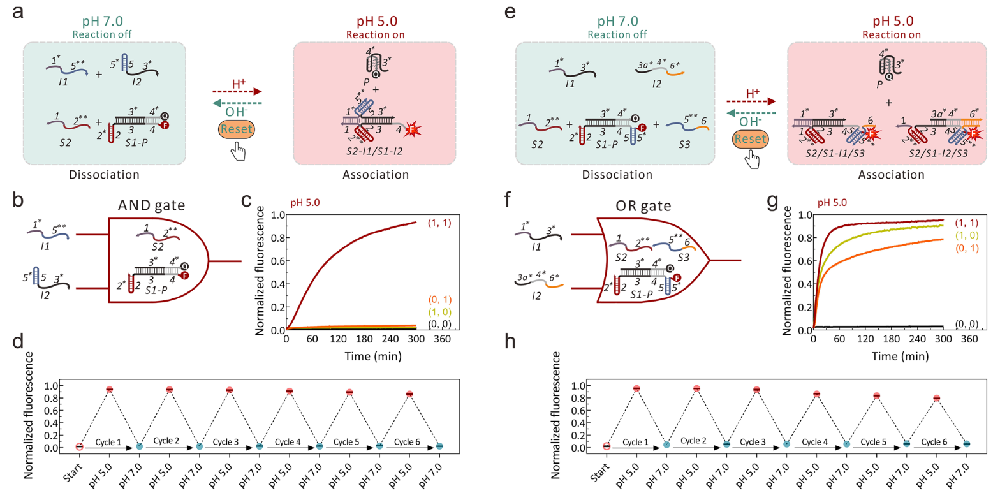
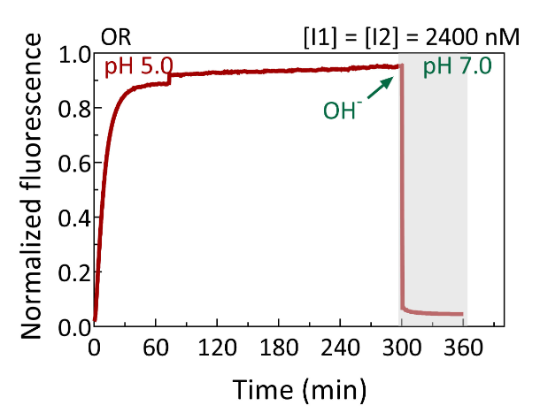
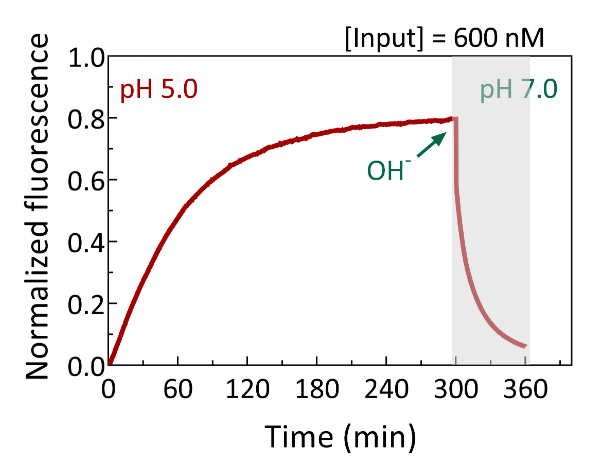

pH-Controlled Resettable Modular DNA Strand-Displacement Circuits

pH响应的可重置的模块化DNA链置换电路

# 一、文章简介

# 二、文章内容

## Abstract

**背景：**

在动态DNA纳米技术领域，利用Toehold介导的链置换( TMSD )这一基础工具，已经构建了具有多种功能的复杂动态分子系统。

**提出问题：**

然而，由于难以建立动力学有利的途径来反向地实现重置反应，因此缺乏简单的方法来重置这些基于TMSD的动态系统。

**解决问题：**

在这里，我们开发了一种简单的质子驱动策略，通过将一个pH响应的 CG-C+ 三链体和一个 i-motif DNA整合到传统的DNA底物中，实现了模块化DNA电路的完全重置。

- pH编程的策略允许模块化的DNA元件特异性地结合与解离，以促进正向与反向的TMSD反应，从而使模块化的DNA电路能够在恒定的温度下重复操作，而不会产生任何DNA废品。
- 利用这种易于处理的方法，我们进一步构建了两个用于逻辑计算的可重置DNA逻辑门和两个具有良好的信号转导性能和放大性能的可重置催化DNA系统。

## Introduction

**背景：**

DNA具有独特的可编程性和结构可预测性，利用 Watson-Crick 碱基配对规则，DNA越来越多地被用于制备具有动态行为的复杂自组装纳米结构和可编程的分子系统1,2。

最重要的是，在动态DNA纳米技术领域3，TMSD的出现为构建动态DNA纳米器件提供了强有力的工程化工具4。其中入侵链与称为toehold的单链结构域杂交，在DNA底物中，通过分支迁移( Branch Migration，BM )置换出一条或多条预先杂交的链。

- 基于TMSD的具有不同功能的动态分子系统包括：
  - 沿着预先设计的轨道运动的DNA步行者5−7
  - DNA振荡器8
  - 单分子DNA导航器9
  - 用于调控基因表达的toehold开关10
  - 翻跟斗的 DNA 特技人11。
- 其中，特别是具有分子信息处理能力的DNA电路具有丰富而新颖的设计，已被广泛应用于
  - 逻辑运算12-16
  - 分子神经网络17，18
  - 信号放大19-21
  - 催化组装胶体纳米颗粒22-24
  - DNA纳米结构的自组装25，26
  - 生物传感器27-29
  - 细胞成像等领域30，31

**提出问题：**

然而，遗憾的是，由于一旦正向的TMSD反应达到平衡状态，就很难建立可行的动力学途径来触发反向的重置反应，因此难以构建具有重置功能的基于TMSD的动态分子系统。这一缺陷无疑阻碍了这些基于TMSD的动态分子系统在可重编程性和可重用性方面的应用潜力。此外，这些不可重置的分子系统在运行过程中产生的不可逆废物的积累造成了DNA材料的巨大浪费。

**解决问题：**

最近，Reif等人报道的基于TMSD的可再生DNA电路可以通过添加额外的DNA链来重复使用32，33 ；然而，在这种重复操作的过程中，积累了大量的DNA废物。

此外，偶氮苯分子被引入到TMSD反应中，试图重置DNA回路34-36，但这些光响应系统不能被完全地重置，因为偶氮苯引发的双链解离在现实中无法达到完美的产率。

**进一步解决问题：**

为了进一步规避这一问题，Shih等人构建了温度循环控制的基于TMSD的可重置DNA纳米器件37； Song等人利用磁镊（magnetic tweezers）实现了单分子的可重置DNA计算38；Walther等人开发了一种由ATP供能的ligation/restriction网络驱动的基于TMSD的具有可编程寿命的瞬态自复位电路39。

**提出问题：**

虽然这些基于TMSD的分子系统可以完全重置，但需要专门的仪器或特定酶的辅助。

**解决问题：**

鉴于目前的困境，在本文中，我们展示了一种简单且适应性强的可完全重置的模块化DNA电路的设计：通过将pH响应的CG-C+三链体结构、DNA i-motif与传统的基于TMSD的DNA电路相结合，在恒定温度下由质子驱动的完全可重置的模块化DNA电路。

在我们的策略中，模块化的DNA电路中 pH 响应的分子间三链体和i-motif结构之间 formation/destruction 的协同分别在pH = 5.0和7.0的条件下实现了正向和反向的TMSD反应。

利用这种易于操作的pH响应的方法，允许模块化的DNA组件进行可编程的组装和拆卸，以促进正向和反向的TMSD反应，并且我们进一步构建了两个可重置的DNA逻辑门和两个可重置的催化DNA系统。

## Design of a pH-controlled resettable modular DNA circuit

**可拆分的底物：**

对于DNA底物的构建，我们采用了我们小组先前提出的"可拆分底物"的策略，将CG-C+三链体DNA结构嵌入到传统的"线性底物"中，三链体DNA结构由富含胞嘧啶（C）的形成链和CG双链通过Hoogsteen相互作用组成，三链体DNA中胞嘧啶的平均 *pKa* 约为6.5。

可拆分的底物由两个pH响应的模块组成：一个BM复合物，命名为S1-P；一个单链toehold，命名为S2 (图1a )。

- 图1：PH响应的可重置的模块化DNA电路。
  - a：通过pH循环变化控制的可重置的DNA电路的示意图。
  - b：在pH 5.0条件下，加入不同浓度的Input，进行pH响应的TMSD反应的实时荧光动力学研究。
  - c：通过在反应300 min后加入1.5 μL的1 M NaOH，使pH从5.0到7.0，pH响应的可重置模块化DNA电路的荧光信号强度的实时变化。
  - d：可逆的荧光信号变化表明，在1200 nM的Input存在下，通过在5.0和7.0之间循环改变pH，pH响应的模块化DNA电路具有良好的可重置性。
  - 所有实验均在37℃，[ S1-P ] = 200 nM，[ S2 ] = 800 nM条件下进行。

如图1a所示：

- 在初始pH = 7.0 (中性条件) 时，S1-P不能与S2结合，在Input存在的情况下形成稳定的体系。
- 当pH调至 5.0 (酸性条件)时，S2中的三链体形成链 ( 2\*\* ) 可以与S1-P的CG发夹结构( 2-2\* )结合，通过Hoogsteen相互作用形成CG-C+三链体结构。
  - 因此，S2和S1-P被桥接在一起，形成一个完整的底物( S2/S1-P )。
  - 然后，Input的结构域 1\*可以与S2中的互补toehold( 结构域 1 )相互作用，通过BM置换出S1-P中的预杂交保护链P (结构域3\*-4\*)，从而启动正向TMSD反应，同时产生称为S2/S1-Input的复合物。
  - 值得注意的是，释放的含有4个胞嘧啶的片段的链P会折叠成无活性的四链DNA结构，称为i - motif 44−46，以防止P与S2/S1-Input之间的再结合，从而进一步促进正向TMSD反应的完成。
  - 同时，来自S1-P中P的释放会导致荧光信号的生成，以表征正向TMSD反应，其中S1在5′端用pH非敏感性染料Alexa Fluor 488标记，P在3′端用相应的猝灭剂BHQ1标记。
  - 如果将pH重新恢复至7.0，pH敏感的P的构象将会由一个闭合的i-motif改变为一个松软的随机线圈结构，并且用于桥接S1和S2的pH响应的CG-C+三链体结构将同时被破坏。
  - 然后，由于短双链DNA在37 ° C下的热力学不稳定性，模块S2的正向的入侵toehold（结构域1）会进一步地从其在S1-Input上的互补域（结构域1\*）解离，从而导致了在pH=7.0下，S2从S2 / S1-Input中的完全解离。
  - 随后，未折叠链P的结构域4*与向后入侵toehold（结构域4）结合，以置换Input，通过向后TMSD反应再生S1-P。

通过在7.0 ~ 5.0的pH范围内循环变化，验证了在“可拆分的底物”设计中采用的pH响应的三链DNA结构( 2*\* / 2-2\* )的可逆的结合与解离过程（图S1）。

- 图S1：
  - 通过在7.0 ~ 5.0的pH范围内循环变化，验证了用于pH响应的模块化DNA底物的CG-C+三链DNA结构的可逆结合和解离过程
  - 三链结构为 2\*\*/ 2-2\* ,在CG发夹和三链体形成链之间通过Hoogsteen相互作用形成。
  - CG发夹( 2-2\* )的3 '端用pH非敏感性荧光染料Alexa Fluor 488修饰，而2*\*的三链体形成链的 3' 端用反向猝灭剂BHQ1修饰(图S1a )。
  - 实验在37 °C，[ CG发夹] = 200 nM，[三链体形成链] = 800 nM条件下进行。
  - 如图S1b中的实验结果所示，在初始pH = 7.0时，CG发夹结构( 2-2\* )和三链体形成链( 2\*\* )不能相互作用，荧光强度保持不变。当 pH 调至5.0后，荧光在约10 min内几乎完全消失，表明通过Hoogsteen相互作用形成了分子间三链体结构( 2\*\*/2-2\* )
  - 正如预期的那样，当pH再次恢复到7.0时，荧光强度立即恢复到最大值，这表明分子间结构的解离。
  - 因此，当pH在5.0 ~ 7.0之间循环时，分子间三链体结构被证明是可逆地结合和解离的，揭示了CG-C+三链体DNA结构用于可拆分的模块化DNA底物的高可逆性和快速响应性。

通过利用动态的pH循环的方法，在恒定温度下，pH响应的模块化DNA电路可以完全重置到初始状态而不会产生任何的DNA废物。图S2证明了：在pH=5.0时，P（i-motif）的非活性状态的形成 ，以及 在pH = 7.0时，S1-Input和未折叠P的快速而完全的TMSD反应。这表明了P作为信号报告器具有良好的pH响应性，并且在pH响应的DNA电路中作为向后的重置反应的触发器时，具有良好的反应能力。

- 图S2：

  - 在向前TMSD反应产物（S1-Input）和pH响应的i-motif结构（P）之间发生的向后的TMSD反应的良好性能，即可逆的荧光信号报告系统。实验在37 ° C，[ S1-Input ] = 200 nM，[ P ] = 400 nM条件下进行。

  - 如图S2b所示，在初始的pH=5.0时，荧光强度保持相对恒定，这表明在P和S1-Input之间没有发生TMSD反应，因为在酸性条件下，P被折叠成稳定的非活性的i-motif结构。相反，当pH调至7.0时，荧光强度在1 min内急剧下降至最低，这表明未折叠的P在中性条件下具有良好的触发反向重置反应的能力。

## Operation of the pH-controlled resettable modular DNA circuit

我们首先优化了S1-P和S2的摩尔比，使其在pH = 5.0时形成可拆卸的底物(图S3 )。

- 图S3：在pH = 5.5条件下，对基于TMSD的pH响应的模块化DNA电路中S2的浓度的优化。
  - S2的浓度在200到800 nM之间变化。
  - 由荧光动力学曲线可知，当S2的浓度达到800 nM时，系统表现出最佳的反应灵敏度，因此确定S-P与S2的摩尔比为1：4。
  - 实验在37℃，[ S1-P ] = 200 nM，[ Input ] = 1200 nM下进行。

然后，在pH = 5.0条件下，加入不同数量的Input，研究了pH响应的模块化DNA电路的正向TMSD反应性能（图1b）。

- 发现随着输入浓度的增加(从50到1200nM)，反应效率有明显的提高。
- 当Input为1200nM时，正向反应在300 min内接近平衡，产物产率高达大约92%，这表明了pH响应的模块化DNA电路的良好的反应性能。
- 相反，在初始pH 7.0时，即使Input浓度达到1200 n M，也没有观察到荧光信号(图S4 )。

- 图S4：在pH 7.0条件下，加入不同浓度的Input，pH响应的TMSD反应的实时荧光动力学。实验在37 °C，[ S1-P ] = 200 nM，[ S2 ] = 800 nM下进行。

作为对照，我们通过将S2中三链体形成链（结构域2\*\*）替换为一个在酸性条件下无法与S1-P结合形成完整底物的随机序列（图S5、S6），设计了一个pH非敏感的模块化电路，其证明了我们的pH响应的模块化DNA电路的高特异性。

- 图S5：无pH响应的CG-C+ DNA三链体结构、无pH依赖的模块化DNA电路的图形表示。作为pH响应的可重置的DNA链置换电路的阴性对照，S2C中的结构域2\'\*\*被设计为随机序列，其在酸性条件下不能与S1-P中的发夹结构域 (2-2\*)相互作用。

- 图S6：pH=5.0时，无pH依赖的DNA电路的荧光动力学。
  - 结果表明，在高达1200 nM的Input存在下，无pH依赖的DNA电路无法工作，这证明了我们的pH响应的模块化DNA电路的高特异性。
  - 实验在37 °C，[ S1-P ] = 200 n M，[ S2C ] = 800 n M下进行。

然后，我们通过在5.0和7.0之间循环调节p H值，探索了pH响应的模块化DNA电路的可重置性。

- 如图1c所示，在200 μL总反应体积中加入1200 nM Input，初始pH 5.0时，正向TMSD反应信号在300 min后达到最大。
- 然后，加入1.5 μL的1 M NaOH，使反应溶液的pH变为7.0，体系的荧光信号快速恢复到最小值(耗时小于1 min)，表明由反向TMSD反应( 循环1 )导致的模块化DNA电路的完全重置。
- 然后，通过引入1.5 μL的1 M HCl使pH恢复到5.0，DNA电路可以再次被激活(图1d )。通过在每次TMSD反应后以这种方式循环调节系统的pH值，发现pH响应的模块化DNA电路可以重复操作6次(循环1～6)，反应活性仅有很小的损失，并且不会产生任何DNA废物(图1d )。
- 这一结果充分说明了我们设计的pH响应的可重置模块化DNA电路具有良好的可重置性和高动态可编程性。

## Resettable DNA logic systems

**提出问题：**

基于TMSD的DNA逻辑门展示了丰富和创造性的设计，并已广泛应用于生物传感、诊断和数字计算等领域14。此外，不同的基于TMSD的DNA逻辑门的组合和级联可以用于构建多层和大规模的数字逻辑电路，执行更高层次的计算功能12，48，49。然而，这些DNA逻辑系统大多无法在操作后重置，这限制了它们在构建在功能上更接近于半导体电路的复杂DNA数字逻辑系统方面的潜力。

**解决问题：**

鉴于此，我们基于pH响应的可重置的TMSD反应构建了可重置的AND门。通过将上述的可重置的模块化DNA电路的原始输入，在连接toehold和BM结构域（Input 1′ 和 Input 2′）的位置，拆分成两条中间链，然后插入了一条pH响应的CG-C+三链体DNA结构，设计为该AND门的两个输入（Input 1和Input 2）（图S7）。

- 图S7：用于pH响应的可重置AND门的两个输入的设计过程。

如图2a、b所示，在pH 5.0时，Input 1 (简称 I1)可以与Input 2 (简称 I2)结合形成具有与Input链相同功能的三链体DNA复合物( I1/I2 )。

- 图2：pH响应的可重置DNA计算电路。
  - a：可重置的AND门系统的简要示意图。
  - b：AND门。
  - c：动力学曲线表示pH=5.0（[I1]=1200 nM、[I2]=1200 nM）时，AND门的信号输出。
  - d：随着I1 ( 1200 nM )和I2 ( 1200 nM )的加入，可逆的荧光信号变化表明了AND门的可重置性。对于AND门，[ S1-P ] = 200 nM，[ S2 ] = 800 nM。
  - e：可重置的OR门系统的简要示意图。S1-P，即OR门中表征输出信号的可逆荧光报告器，是由双环的S1 ( 5′端用非敏感染料Alexa Fluor 488标记)和i-motif P (在3′端标记相应的猝灭剂BHQ1)杂交形成的。
  - f：OR门的符号。
  - g：动力学曲线表示pH 5.0（[I1]=2400 nM、[I2]=2400 nM）时，OR门的信号输出。
  - h：在I1=I2=2400 nM时，OR门系统的可重置性测量。对于OR门，[ S1-P ] = 200 nM，[ S2 ] = 800 nM，[ S3 ] = 800 nM。所有实验均在37℃条件下进行。

如果在逻辑运算后将pH调至7.0，I1和S2将从产物( S2-I1 / S1-I2)中解离，同时P会展开，触发向后的TMSD反应，重置AND门系统(图S8)。

- 图S8：pH响应的可重置的AND逻辑门系统的详细的反应示意图。

正如预期的那样(图2c )，AND门通过加入含有1200 nM I1和1200 nM I2 ( 1，1)的混合物来产生输出荧光信号，而只加入I1 ( 1，0 )，或只加入I2 ( 0，1 )，或在没有两个输入链( 0，0 )的情况下，都没有得到输出荧光信号。

同样，在I1和I2存在的情况下（1，1）(图2d和S10)，通过在5.0 ~ 7.0之间循环调节溶液的pH，重复6次AND逻辑运算，证明了AND门的可重置性。

- 图S10：在1200 nM I1和1200 nM I2同时存在的情况下，反应的300 min后，通过添加1.5 μL 的 1 M NaOH 将pH从5.0调节至7.0 ，pH响应的可重置AND逻辑门系统的实时荧光信号强度变化。实验在37 °C，[ S1-P ] = 200 nM，[ S2 ] = 800 nM下进行。

正如预测的那样，对于其他三种输入条件，没有明显的荧光响应(图S11 )。

- 图S11：

  - 分别在无输入链( a )、1200 nM I1 ( b )和1200 nM I2 ( c )存在的情况下，在每次TMSD反应之后，通过在5.0和7.0之间循环调节pH值，pH响应的可重置的AND门的荧光信号强度变化。

  - 实验在37 ° C，[ S1-P ] = 200 nM，[ S2 ] = 800 nM下进行。

然后，我们在上述pH响应的模块化DNA电路的基础上，通过集成另一个pH响应的CG-C+三链体DNA结构到可拆分底物（S2-S1-P）中，设计了一个可重置的OR逻辑门系统。

如图2e、f所示，OR门中构造的可拆分底物由三个模块组成：S1-P、S2和S3。其中，S2和S3分别是具有不同三链体的形成结构域（S2的2\*\*和S3的5\*\*）和不同的单链toehold的模块，而S1-P是两端具有两种不同的CG发夹结构（2−2\* 和 5−5\*）的BM模块，可以在酸性条件下与S2和S3相互作用（图S12）。

- 图S12：pH响应的可重置的OR门的示意图。

如实验中所示，无论是I1 ( 1，0 )还是I2 ( 0，1 )，以及它们的混合体( 1，1)，都可以在OR门中触发输出信号(图2g )。此外，OR门在这3种输入条件下也表现出良好的可重置性(图2h、S13、S14)。

- 图S13：在2400 nM I1和2400 nM I2同时存在的情况下，反应300 min后加入1.5 μL 的 1 M Na OH，使pH从5.0到7.0，pH响应的可重置OR门的实时荧光信号强度变化。实验在37℃，[ S1-P ] = 200 nM，[ S2 ] = 800 nM，[ S3 ] = 800 nM的条件下进行。

- 图S14：

  - 在无输入链( a )、2400 nM的I1 ( b )和2400 nM的I2 ( c )的情况下，通过在每次TMSD反应后在5.0和7.0之间循环调节pH值，pH响应的可重置的OR门的荧光信号强度变化。

  - 实验在37℃，[ S1-P ] = 200 nM，[ S2 ] = 800 nM，[ S3 ] = 800 nM的条件下进行。

## Resettable catalytic DNA circuit

**背景：**

类似于化学中的催化反应，DNA链可以作为催化剂，通过一系列的TMSD反应为基于DNA的分子系统提供燃料。催化DNA系统包括：

- DNA催化的熵驱动网络19,50
- DNA神经网络18
- 基于DNA的数字逻辑电路48
- 用于分子诊断的信号放大网络51,52

然而，由于反应物的不可逆消耗和DNA废物的积累，这些催化DNA系统的可重复使用性受到限制。为了解决这一困境，我们在上述的pH响应的可重置模块化DNA电路的基础上，构建了一种燃料链DNA驱动的可重置的催化DNA电路。

**可重置的催化DNA电路：**

可重置的催化DNA电路如图3a所示。

- 图3：可重置的模块化催化DNA电路。
  - a：pH响应的可重置催化DNA电路的图形表示。
  - b：在存在600 nM Input（左）或不存在Input（右）的情况下，可重置的催化DNA电路中的正常F链和在不同位置具有单碱基错配的不同类型的F链 ( 4μM )的性能(F:12T, F:18T, and F:24T )。
  - c：pH-5.0时，在不同的Input浓度下的催化DNA电路的实时荧光动力学
  - d：存在600 nM的Input时，模块化催化DNA电路的可重置性表示。
  - 所有实验在37 °C, [S1-P] = 200 nM,  [S2] = 800 nM. 在(c) 和 (d)中, [F:12T] = 4 μM下进行。

1. 在初始中性条件下，系统在Input(充当催化剂)和燃料( F )存在的情况下保持稳定。
2. 当pH从7.0变化到5.0时，S1-P和S2可以相互结合，首先组装成完整的底物。
3. 然后Input可以与S2上的toehold( 结构域 1 )结合，触发正向TMSD反应并释放荧光信号，同时生成中间产物S2/S1 Input。
4. 随后，F的结构域4a\*与S2/S1-Input中结构域4的向后toehold结合，启动新一轮的TMSD反应，从而取代Input，得到最终产物S2/S1-F。
5. F链通过提供驱动力来维持催化电路的持续运行。
6. 因此，释放的Input被重复使用，以重新启动催化电路中的进一步TMSD反应。
7. 若正向TMSD反应结束后，pH恢复至7.0，S2会从S2 S1-F解离，P将与在S1-F上的结构域4中的未杂交的单链部分结合，启动反向重置反应，使催化电路完全重置。

我们首先对pH 5.0条件的可重置催化电路中的F的设计进行了优化(图S15 )。

根据之前的报道，一个不匹配的F可以提高催化DNA电路的性能22，53，54。

为了减少信号泄露，提高F的驱动力，我们设计了在3种不同位置具有单碱基错配的F链，分别命名为F：12T、F：18T和F：24T。

与其他两种不匹配的F设计相比，在F：12T存在的情况下，该催化体系表现出最低的信号泄漏( 5 % )和可接受的反应效率( 81.2 % ) (图S15 )。经过计算，F：12T的S/N值高达16.4 (图3b )。

考虑到正常的F链与可重置催化电路中采用的i-motif链( P )之间的DNA序列存在大量重叠，我们推测正常的F链在pH 5.0时可能折叠成反应活性相对较低的二级结构，而F：12T中的单碱基错配可以阻止二级结构的形成。因此，设计具有单碱基错配的F：12T不仅有助于减少信号泄露还可以提高TMSD反应的效率。

由此，确定了可重置的催化DNA电路中错配的F链的设计策略为F：12T。

- 图S15：

  - 通过添加不同的燃料链：F (a), F:12T (b), F:18T (c), and F:24T (d)，在pH=5.0时，pH响应的可重置的催化DNA电路的性能比较。

  - 实验在37 ° C，[ S1-P ] = 200 nM，[ S2 ] = 800 nM的条件下进行，燃料链浓度均为4 μM。
  - 结果发现，在600 nM Input存在的情况下，在300 min内，正常的F链带来了72.4%的反应效率，而代表信号泄漏的荧光产率高达18.4%。
  - 经计算，F对应的信噪比( S/N )仅为3.9 (图3b )。

随后，我们研究了在pH 5.0条件下，加入不同浓度的Input时，可重置催化DNA电路的性能。

如图3c所示，通过逐步提高Input的浓度( 0 ~ 600nM)，观察到一系列显著的荧光信号输出。特别地，在存在10 nM Input的情况下实现了可区分的信号，相对于上述图1b中的非催化DNA电路，信号传导能力提高了5倍。

最后，通过pH循环实验证明了该模块化催化DNA电路具有良好的可重置性(图3d和S16)。

- 图S16：在600 nM Input存在的情况下，在反应的300min后，通过添加1.5 μL 的 1 M NaOH，使pH从5.0到7.0，pH响应的可重置的催化DNA电路的实时荧光信号强度变化。实验在37℃，[ S1-P ] = 200 nM，[ S2 ] = 800 nM，[ F：12T ] = 4 μM的条件下进行。

## Resettable two-layer cascaded catalytic DNA circuits

为了进一步证明我们的pH响应的模块化催化DNA电路的灵活性和可扩展性，我们拟构建具有可重置性的双层级联催化DNA电路。

为此，将另一个pH响应的模块化催化DNA电路(作为第Ⅰ层)与上述可重置的催化DNA电路(作为第Ⅱ层)集成在一起，构成了一个双层催化DNA系统，这两个模块化DNA电路通过第I层释放的一条称为Trigger ( T )的单链连接在一起(图4a )。

- 图4：双层级联的可重置催化DNA电路。
  - a：pH响应的双层级联的可重置催化DNA电路的简要示意图。
  - b：在有100 nM Input或无Input的情况下，两层可催化DNA电路中的第一层中，正常燃料链F1 (1.2 μM) 与在不同的位置具有单碱基错配的不同类型的燃料链 (F1:12T, F1:16T, and F1:22T，1.2 μM) 性能。
  - c：在pH 5.0条件下，不同浓度的Input存在下，双层催化DNA电路的实时荧光动力学。
  - d：在200 n M的Input存在下，双层模块化催化DNA电路的可重置性表示。
  - 所有实验均在37℃，[ S1-T ] = 600 nM，[ S2 ] = 1200 nM，[ S3-P ] = 200 nM，[ S4 ] = 800 nM，[ F2 ]的条件下进行。

双层级联DNA电路的工作机制在图S17中被详细地描述。

- 图S17：pH响应的可重置的双层级联催化DNA电路详细示意图。

1. 在pH 7.0时，所有的pH响应模块由于失活而无法组装，从而使整个级联系统在Input存在的情况下具有良好的稳定性。
2. 当pH从7.0变化到5.0时，层I( S1-T和S2)和层II ( S3-P和S4)中的pH响应模块组件将分别通过Hoogsteen相互作用组装成完整的底物( S2/S1-T和S4/S3-P)。
3. 通过TMSD反应，Input可以与它的toehold( 结构域 6 )结合在层I的S2/S1-T上以替换T，同时产生一个新的的中间复合物称为S2/S1 Input，其具有一个新生成的toehold（在结构域3的末端）。
4. 然后，层I的燃料链( F1 )与新的toehold结合，引发新一轮的TMSD反应，导致Input的置换和产物S2/S1-F1的产生。
5. 释放的Input可以在层I的模块化DNA电路中重新启动下一轮的TMSD反应。
6. 同时，层I不断释放的T可以启动并催化层II模块化DNA电路的运行，从而导致i-motif P的释放和荧光信号的产生。
7. 若重新恢复pH至7.0，链P将从i-motif 状态展开，S2和S4的toehold模块将分别从层I中的S2/S1-F1和II层中的的S4/S3-F2解离(F2是第二层中使用的燃料链)。
8. 然后，T和P分别在层I和层II中引发反向TMSD反应，从而替换F1和F2，形成S1-T和S3-P，最终实现级联系统的完全重置(图4a和S17)。

同样地，为了减少信号泄露，提高级联DNA电路的性能，本文在设计F1和F2时仍然采用了错配串的策略。值得注意的是，第二层中F2的单碱基错配位置与上述单层的催化电路(即F : 12T)保持相同。第I层F1的设计是通过改变不同位置的序列来实现的(分别命名为F1 : 12T、F1 : 16T和F1 : 22T)。在研究了这些修改的F1链在pH 5.0 的级联体系中的性能后，选择F1：16T用于级联催化体系的后续研究(图4b和S18)。

- 图S18：
  - 在pH=5.0的条件下，分别加入第一层所涉及的不同燃料链( 1.2μM )：F1 ( a )、F1：12T ( b )、F1：16T ( c )、F1：22T ( d )，对pH响应的可重置级联催化DNA电路的性能进行比较。
  - 所有实验均在37℃，[ S1-T ] = 600 nM，[ S2 ] = 1200 nM，[ S3-P ] = 200 nM，[ S4 ] = 800 nM，[ F2 ] = 1.2 μ M的条件下进行。
  - 研究发现，与其他单碱基错配的F1链相比，当采用F1：16T链( S/N值为5 . 7)时，级联系统表现出更好的反应性和相对较低的信号泄露。
  - 考虑到F1：16T在提高级联体系反应活性和抑制信号泄露方面的综合能力，因此选择F1：16T用于级联催化体系的后续研究。

接下来我们测试了在pH=5.0条件下，加入不同量的Input (从0到400 nM)的双层级联催化DNA电路的性能。如图4c所示，随着输入浓度的增加，荧光信号明显增强，表明级联体系的反应效率不断提高。

值得注意的是，在2 nM Input存在下产生的荧光信号与背景信号（ background signal ）(图4c , ' 0 nM '线)区分开来，相对于图3c中的单层催化DNA电路，信号传导能力提高了5倍，相对于图1b中的非催化DNA电路，信号传导能力提高了25倍。

最后，通过在5.0 ~ 7.0 (图4d和S20)之间循环改变pH，证明了pH控制的级联催化体系具有良好的重置能力。

- 图S20：
  - 在200 n M Input存在下，在反应300 min后，加入1.5 μL 的 1 M Na OH，，使pH从5.0到7.0，可重置的双层催化DNA电路的荧光信号强度改变。
  - 实验在37℃，[ S1-T ] = 600 nM，[ S2 ] = 1200 nM，[ S3-P ] = 200 nM，[ S4 ] = 800 nM，[ F1：16T ] = 1.2μM，[ F2 ] = 1.2 μ M的条件下进行。

## Summary

总之，通过将pH响应的分子间CG-C+三链体DNA结构和pH响应的i-motif DNA链嵌入到传统的线性DNA基底中，我们开发了一种简单而稳健的策略，在恒定温度下实现了基于TMSD的模块化DNA电路的完全重置，并且不会产生任何DNA废物。

鉴于我们的pH响应的模块化策略如此高的模块化程度和简单性，通过在基于TMSD的反应网络中堆叠更多的pH响应的模块化组件，构建许多其他的具有可编程重置行为复杂的动态分子系统是可能的。

此外，通过与其他构建块集成（例如, DNA功能化的胶体纳米颗粒23,24,55和DNA砖块56），我们的pH响应的模块化策略在构建可重置的三维DNA组装结构和可重编程的胶体晶体方面应该具有很大的潜力。

此外，将我们的方法应用于基于DNA的传感器，将在分子诊断设备的可重用性和可回收性方面找到应用。

