Programming 2D Supramolecular Assemblies with Wireframe DNA Origami

基于线框DNA折纸术的可编程二维超分子组装体

# 一、文章简介

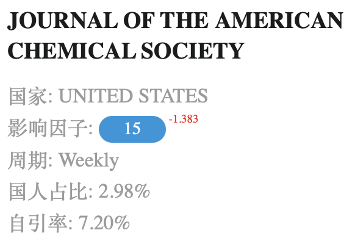

# 二、文章内容

## Abstract

线框DNA折纸提供了编程几乎任意的二维和三维纳米几何形状的能力，六螺旋束( 6HB )边的设计提供了几何通用和目标折纸形状的保真度。由于单个DNA折纸物体在尺寸上受到DNA scaffold 长度的限制，在这里，我们介绍了一种分层的自组装策略，通过使用线框DNA折纸物体作为构建模块来编程超分子组装体和周期阵列，以克服这一限制。平行的半交叉点与scaffold和staple之间的横向内聚作用一起使用，将对称性引入由单个DNA折纸单元构建而成的超分子组装体中，其中，这些单元不能使用碱基堆叠或传统的反平行交叉设计的方法直接进行自组装。这种分层的设计方法可以很容易地应用于METIS设计的2D线框DNA折纸（一种自顶向下的序列设计策略），而不需要任何关于scaffold和staple路由的先决条件。通过使用三角形和六边形线框折纸构建块，我们构建了二聚体和具有自我限制性的六聚体超结构，展示了我们策略的实用性。我们推广了我们的自组装方法，构建了紧密堆积和非紧密堆积的周期性2D阵列。使用原子力显微镜和透射电子显微镜的可视化表明，超结构表现出与使用METIS设计的单个折纸构建块相似的结构完整性。我们的研究结果为设计和制造各种应用的二维材料提供了一个通用的平台。

## Introduction

线框DNA折纸1,2已经成为一种用于构建自顶向下的计算机辅助设计的任意二维和三维纳米结构的强大而通用的方法3-8。然而，受来自于M13噬菌体的DNA scaffold长度的限制(通常约为7 kb )，如果要以实现更大规模的材料制造，需要将多个折纸自组装成有限和扩展的组装体和阵列9-11。通过自组装将DNA折纸的设计空间扩展到可编程的超分子组装体，是构建从纳米到微米和更大尺度的结构可控的2D和3D纳米材料的主要目标。12，13

传统上，利用序列特异性的粘性末端内聚力10，11，14-16和形状互补的平末端碱基堆积作用9，17，DNA折纸物体已经可以自组装成超分子组装体或超结构。例如，将粘性末端引入到各种砖形或单层的二维DNA折纸中，通过编程粘性末端的长度和位置，组装了2D阵列10，14-17。通过引入位于3D线框DNA折纸顶点的粘性末端，其他人已经成功构建了具有多种空间群和单细胞尺寸的2D和3D阵列11，18，19。除了粘性末端的连接（其中超结构通常沿DNA双链的轴线扩展），具有形状互补的平末端碱基堆叠也被用于将砖形折纸阵列横向和同轴地延伸到DNA双链的轴线上，包括有限阵列和扩展阵列9，16。最近，使用具有平末端碱基堆叠的张拉整体三角形DNA折纸，成功地构建了3D阵列20。除了周期性阵列外，还使用上述策略构建了高达十亿道尔顿规模的有限超结构，例如，一个1.2 GDa的3D多面体21，一个Mona Lisa画布的分形组装体22，以及由单链Tikle组装而成的DNA砖23。由于METIS设计的2D线框折纸中没有自由的双链端（METIS，一种基于六螺旋束边( 6HB )折纸的全自动序列设计策略），因此前面的末端堆叠方法都不能很容易地使用这些折纸子单元制造超结构。此外，虽然已经针对多层砖状折纸9、2D折纸片层17和2D双-双链体（双交叉，DX）24线框折纸实现了许多超结构形成策略，但多层的砖块层在很大程度上仅限于紧凑的直线组件，2D片层和DX线框组件是灵活的，并且缺乏形状保真度。因此，需要一种通用的策略，将砖形折纸的高形状保真度和刚性与线框组装体的几何通用性相结合，以编程任意的2D超分子线框折纸组装体。

最近，如上述的6HB边的2D线框设计策略所示，这种称为METIS8的计算机辅助的自顶向下的序列设计策略使绘制复杂的线框DNA折纸变得简单，其可以绘制几乎任意的目标形状3，4，6。这种设计2D折纸的方法利用了顶点内相邻双链体之间可用的最大交叉数，以增强结构的完整性，保持其在自由溶液中以及具有固体支撑的表面上的2D平面性。将这类平面2D折纸组件的超结构组装成可编程的、有限或扩展尺寸的大规模超分子组装体，将显著提高DNA折纸实现的2D超分子组装体的复杂性，并且增加基于DNA的材料在功能材料设计中的潜力。

为了推广使用METIS的构建块设计的二维线框DNA折纸的超结构组装，我们提出了一种策略，结合了横向内聚相互作用与相邻DNA折纸单元的平行半交叉点，据我们所知，这种策略在之前用于制备多单元DNA折纸超分子组装体的策略中从未出现过。这使我们能够最大化各个构建块相邻边的双链体之间的稳定的、杂交的相互连接处的数量。选择这种横向内聚相互作用的方法是为了保持整体的结构刚性，而不使用之前发表的使用的粘性末端杂交或同轴堆叠介导的组装策略，因为METIS对象不包含任何自由的、暴露的DNA双链末端。除了保持METIS对象的结构完整性外，我们还试图根据序列设计软件METIS的设计，将横向内聚相互作用直接应用于线框DNA折纸结构，该软件可自动创建复杂的scaffold和staple布线图案以及顶点和边的不对称交叉图案。为此，在我们的策略中，采用了平行的半交叉来促进横向内聚相互作用，因此，所产生的超结构一般是对称的，而无需理会METIS结构中边的详细交叉图案如何。在不需要进一步编辑scaffold和staple的情况下，我们的策略结合了横向内聚相互作用和平行半交叉，为各种2D超分子组装体提供了通用的制备策略25。为了证明我们设计策略的通用性，我们使用了两种形状、大小和内部结构都不同的METIS构建块，即边长为126 bp的无内网格三角形折纸和边长为84 bp的有内网格六边形折纸。在每种情况下，自我限制的有限超结构和周期阵列的可编程自组装证明了我们的策略在制备二维超分子组装体方面的通用性。

## Result And Discussion

我们利用横向内聚力相互作用，使基于6HB边的线框DNA折纸能够横向延伸到DNA双链的轴线上。首先，通过将half-6HB棒组装成6HB管26，横向内聚相互作用也被用于构建DNA折纸超结构27，28。为了形成超结构，这里使用了两种不同的DNA折纸单元：折纸对象A包含悬垂在6HB边上的staple，与来自折纸对象B的互补scaffold序列杂交（图1）。在METIS对象的6HB边的最外层的双链中编程了相互作用，使其能够与相邻的DNA折纸对象相互作用并自组装成更高阶的二维结构组装体。

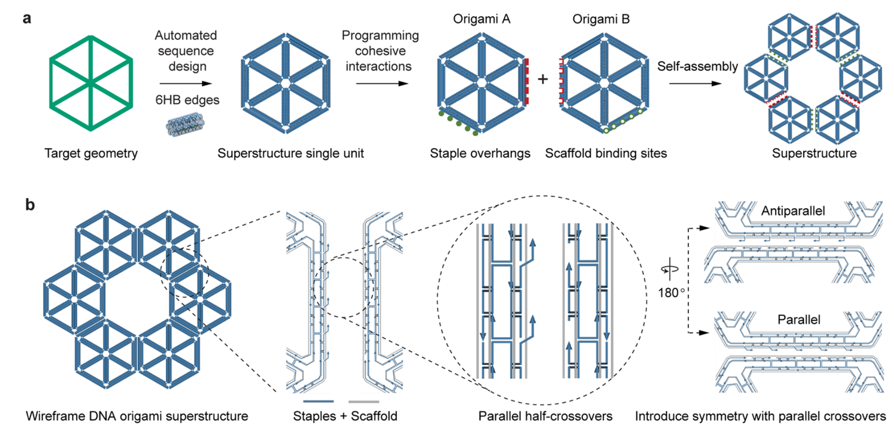

- 图1：由自顶向下设计策略METIS DNA折纸构建的超结构。
  - a：构建超结构的工作流：引入了ATHENA设计的METIS折纸以及边界双链中的内聚相互作用，并进一步组装成更大的结构。这里以六边形折纸为例。
  - b：平行交叉vs反平行交叉：平行交叉引入了具有非对称交叉图案的相邻DNA折纸单元之间的对称性。

自引入DNA双交叉点以来，反平行交叉点作为一种用于构建绝大多数DNA纳米结构的基本交叉点已经被广泛使用24。与反平行交叉有紧密联系的平行交叉引起的关注相对较少29-31。为了通过引入相邻折纸单元的交叉点来构建对称的组装体，我们为此找到了特定效用的平行交叉。具体地，如图1b所示，计算机设计的METIS对象的6HB边中的交叉图案通常是非对称的，这源于这些组件中的复杂顶点设计和任意的边长。基于这些非对称的交叉图案，使用先前发表的策略将产生交错结构，即在相邻折纸单元之间采用反平行交叉，如图1b所示，这不允许以对称的方式构建超结构。相反，通过在设计图中简单地"翻转"其中一个折纸单元，可以很容易地生成完全对称和结构匹配的折纸对象集合，其中应用于横向内聚相互作用的新交叉位置现在是平行的。与应用于横向内聚相互作用的反平行交叉不同，对称组装体可以使用平行交叉来构建，而无需理会6HB边中的交叉图案如何，这使得该策略很容易适用于METIS计算渲染的折纸对象(图1b )。基于先前报道的一系列具有半交叉的结构的自组装，如单链Tile和基于DX的DNA折纸1，29，32，这里使用平行的半交叉来构建超结构。

首先选择了一个最小边长为126 bp的三角形折纸作为典型对象，通过形成二聚体来测试我们的设计策略。基于ATHENA生成的伪原子模型和caDNAno文件（图S1）

- 图S1：利用ATHENA GUI设计的METIS DNA折纸。
  - a：以三角形METIS DNA折纸设计为例。
  - b：ATHENA生成的圆柱体模型，伪原子模型，caDNAno文件

沿最外边界的边每隔2个helical turn引入了平行交叉位置（图S2）

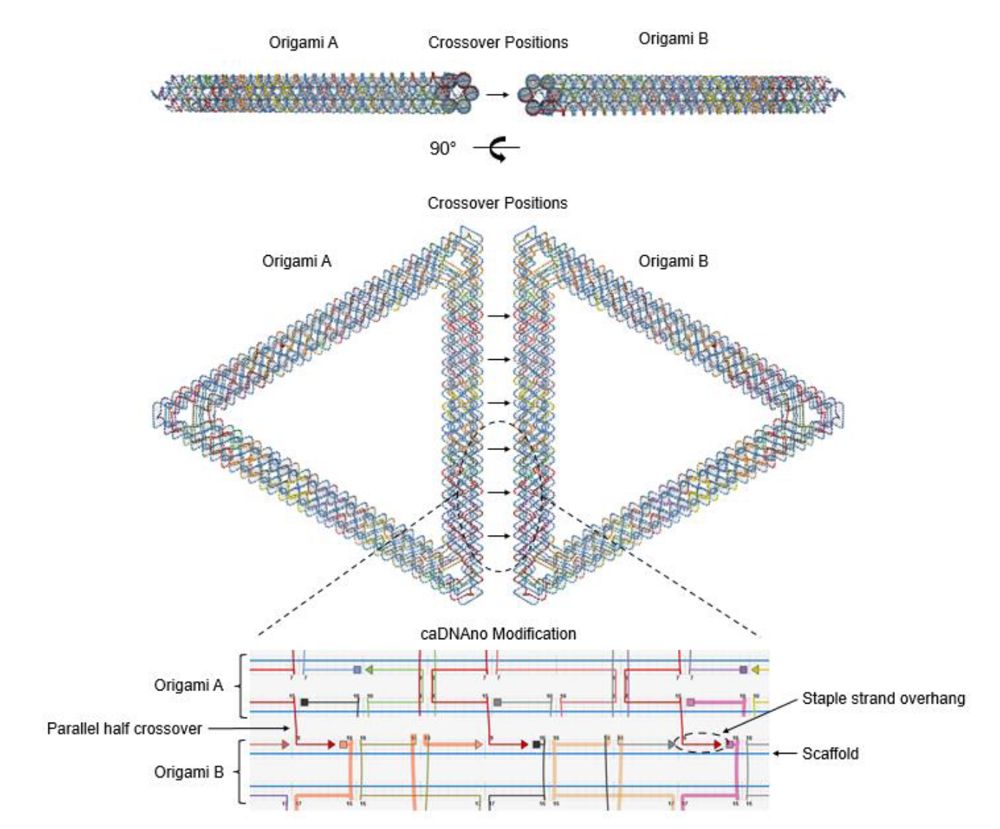

- 图S2：由计算机生成的METIS DNA折纸超结构设计。以三角形DNA折纸为例，基于ATHENA生成的伪原子模型，在DNA折纸单元之间引入了平行半交叉。使用ATHENA生成的caDNAno文件，在caDNAno中修改staple链和悬垂链。

从而引入相邻折纸单元之间的对称性，如图S3所示。

- 图S3：以三角形为例说明使用METIS折纸构建二聚体的设计过程。三角形B作为三角形A的二聚体对，为其翻转180度。其中，三角形A被标记为' α '，以此说明两个结构上和化学上完全相同的折纸物体的相对方向。然后，在三角形A中引入staple悬垂链，并在三角形B中引入scaffold结合位点，如图S2所述，其中三角形B被标记为" β "，以区别于α，因为它在结构、化学和取向上是不同的。

对于三角形折纸A，在其边界双链中引入6个交叉位置，每个位置上有一个短的悬垂链，其中包含与B的scaffold中相应结合位点互补的序列。为了研究特定的和稳定的内聚相互作用的形成，研究了可变的悬垂链长度，包括5，6和7 nt序列（图2）。

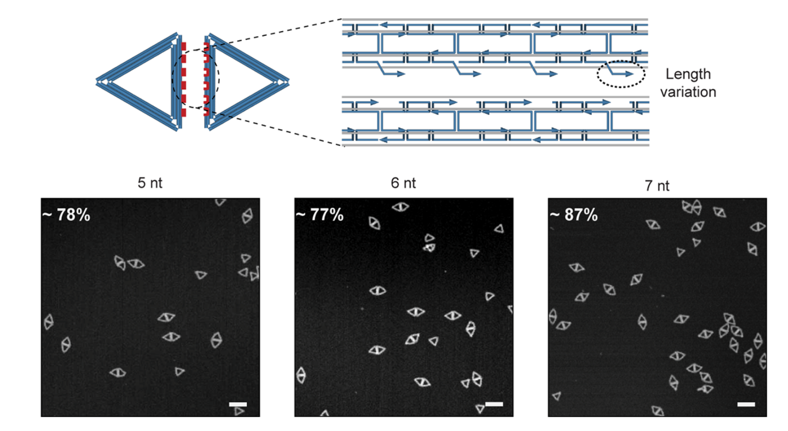

- 图2：以三角形DNA折纸为模型，研究了内聚相互作用的长度变化。AFM图像显示，7 nt的悬垂设计与5和6 nt悬垂设计相比，二聚体的形成产率有所提高。比例尺：100 nm。

虽然3种设计均成功形成二聚体，但5 nt和6 nt悬垂链设计的产量相当（图S4和S5），而7 nt设计形成二聚体的产量最高（87 % ,图S6）。

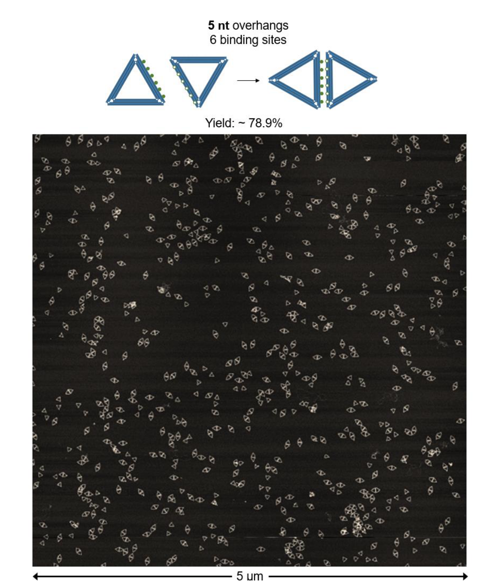

- 图S4：二聚体由5 nt悬垂链设计的三角形METIS折纸组合形成。在2个三角形折纸之间引入6个结合位点，每个结合位点均有5 nt的悬垂。宽场AFM图像显示二聚体的成功形成。三角体数目为：组装成功的二聚体792个，未组装的二聚体211个。

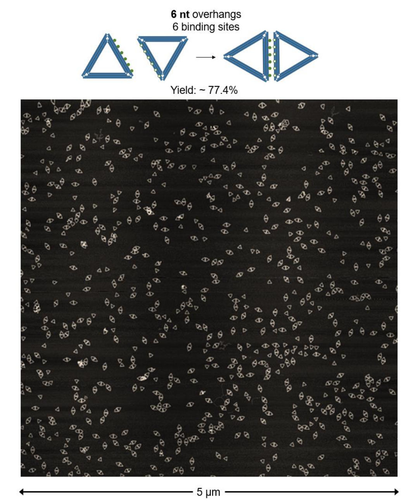

- 图S5：二聚体由6 nt悬垂链设计的三角形METIS折纸组合形成。在2个三角形折纸之间引入6个结合位点，每个结合位点均有6 nt的悬垂。宽场AFM图像显示二聚体的成功形成。三角体数目为：组装成功的二聚体896个，未组装的二聚体262个。

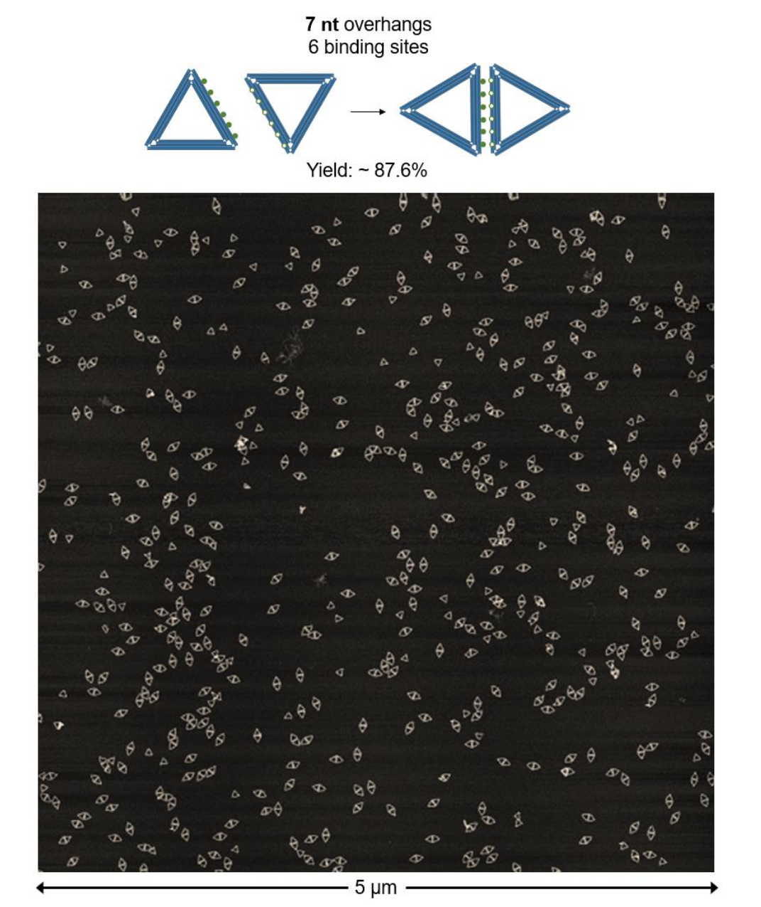

- 图S6：二聚体由7 nt悬垂链设计的三角形METIS折纸组合形成。在2个三角形折纸之间引入6个结合位点，每个结合位点均有7 nt的悬垂。宽场AFM图像显示二聚体的成功形成。三角体数目为：组装成功的二聚体796个，未组装的二聚体113个。

结合原子力显微镜( AFM )和透射电子显微镜( TEM )表征，琼脂糖凝胶电泳显示，在7 nt设计下，二聚体结构成功形成，单体几乎完全耗尽（图S7）。

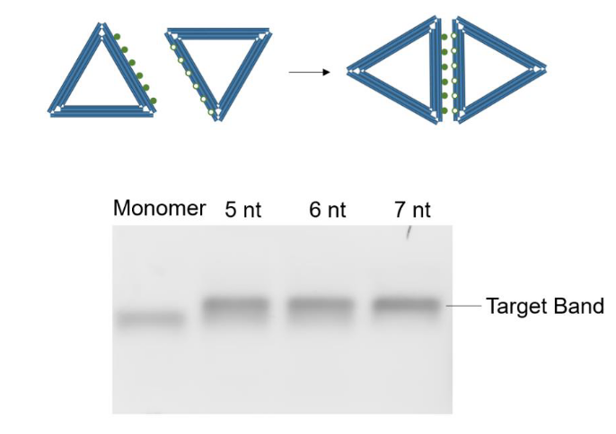

- 图S7：三角DNA折纸形成二聚体的琼脂糖凝胶电泳表征。目的条带表示3种设计均成功形成二聚体结构。

由于METIS结构利用了staple链的最大交叉数，超过7 nt的悬垂需要在6HB结构内部形成另一个交叉，因此在这里没有进一步测试(图S8 )。

- 图S8：相邻METIS折纸之间平行半交叉的悬垂长度选择。折纸A和折纸B之间引入平行半交叉，如caDNAno文件所示，带悬垂的staple用红色标注，scaffold用蓝色标注。设置最大悬垂长度为7 nt，以避免在6HB结构内部形成额外的交叉点。

为了进一步探索该策略的潜力，我们还构建了一个由不对称结构和三角形组成的二聚体(图S9 )。类似的悬垂长度变化也被应用到后续的超结构设计中，以研究它们的自组装和稳定性。

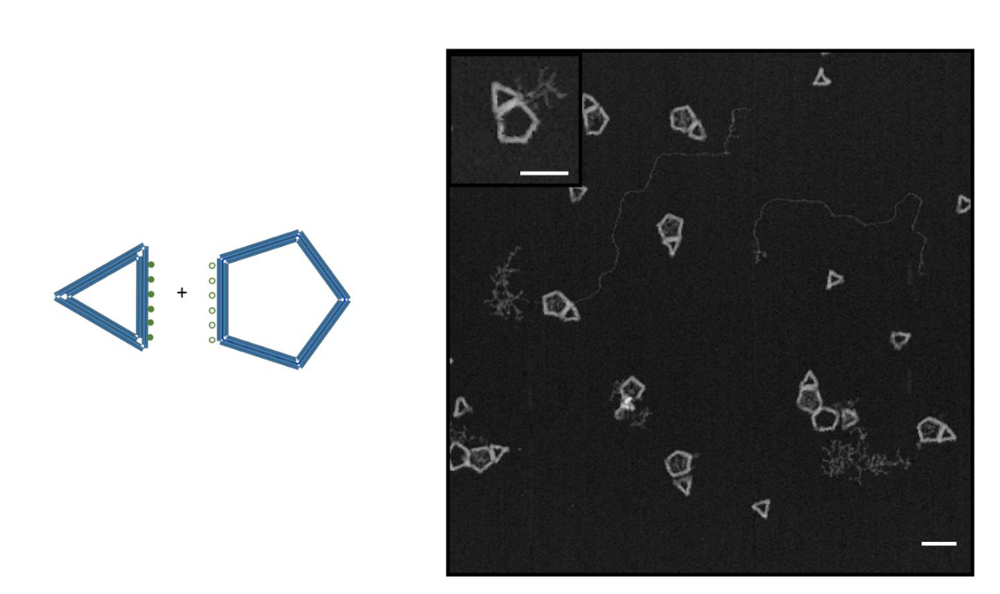

- 图S9：不对称的超结构。由三角形折纸和五边形折纸组成的不对称超结构，具有7 nt × 6结合位点的设计。比例尺：100 nm。

如前所述， METIS折纸对象的一个显著优势是其高度可编程的几何结构和精确的顶点角度控制，可用于构建多样化的超结构几何结构8。通过编程相邻折纸单元之间边的横向内聚相互作用，具有可控角度的折纸单元可以扩展，以形成各种超结构。首先，我们从三角DNA折纸中编程出有限的、自我限制的超结构。在三角形折纸的两条边上引入平行半交叉，以此编程了相邻三角形之间的横向内聚相互作用(图3a )。

- 图3：基于METIS DNA折纸构建的自限性有限超结构。
  - a：三角形折纸与形成的超结构及其AFM、TEM成像。
  - b：六边形折纸与形成的超结构及其AFM、TEM成像。
  - 比例尺：100 nm。

随着单个折纸单元的传播，超结构形成一个封闭的圈，从而形成一个自限性的超结构。我们再次测试了不同的悬垂长度，包括5，6和7 nt。琼脂糖凝胶电泳实验的条带显示了产物的形成一致(图S10 )，图3a和S11-S13中的AFM和TEM图像显示使用所有三种悬垂设计的六边形超结构的成功形成。与三角形二聚体一致，5 nt和6 nt的设计显示出六边形超结构具有相似的形成产率~60 % (图S11和S12)，而7 nt的设计具有了更高的产率~76 %  (图S13 )，这与之前报道的使用粘性末端连接策略构建的六边形超结构相当16。

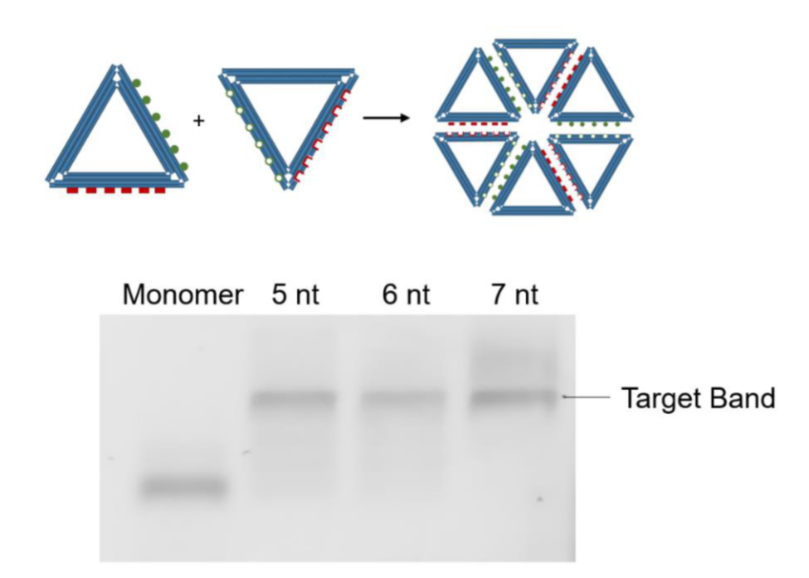

- 图S10：三角形DNA折纸形成的有限超结构的琼脂糖凝胶电泳表征。目标条带表明三种设计都成功地形成了有限的超结构。

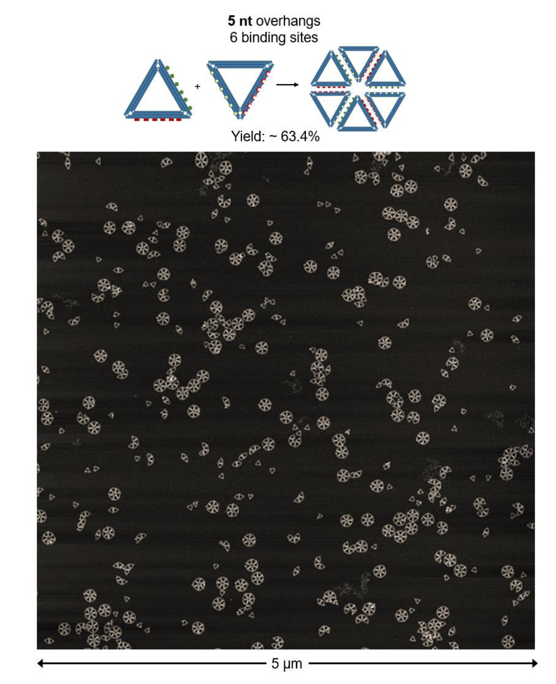

- 图S11：有限超结构由5 nt悬垂链设计的三角形METIS折纸组合形成。在2个三角形折纸之间引入6个结合位点，每个结合位点均有5 nt的悬垂。宽场AFM图像显示有限超结构的成功形成。三角体数目为：组装成功的有648个，未组装的有374个。

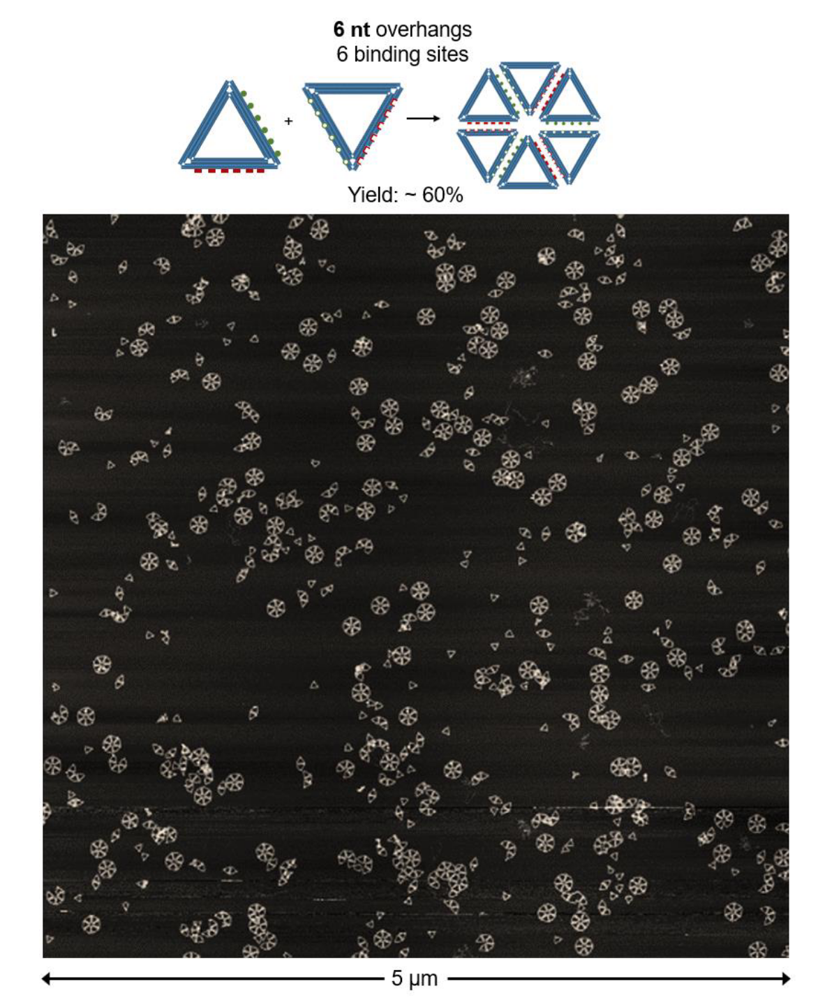

- 图S12：有限超结构由6 nt悬垂链设计的三角形METIS折纸组合形成。在2个三角形折纸之间引入6个结合位点，每个结合位点均有6 nt的悬垂。宽场AFM图像显示有限超结构的成功形成。三角体数目为：组装成功的有702个，未组装的有469个。

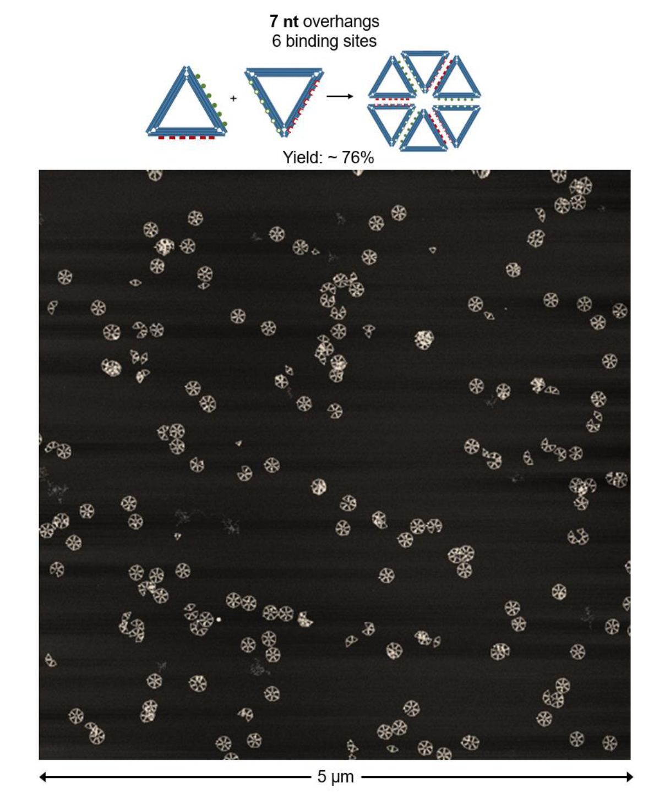

- 图S13：有限超结构由7 nt悬垂链设计的三角形METIS折纸组合形成。在2个三角形折纸之间引入6个结合位点，每个结合位点均有7 nt的悬垂。宽场AFM图像显示有限超结构的成功形成。三角体数目为：组装成功的有576个，未组装的有181个。

为了测试我们方法的通用性，我们还使用带有内部网格的六边形折纸构造了具有更复杂图案的超结构(图3b )。大的六边形由这些较小的六边形单元自组装形成直径约为200 nm的超结构，内部具有复杂的网状图案，产率约为60 %，并使用AFM和TEM进行可视化（图S14和S15）。

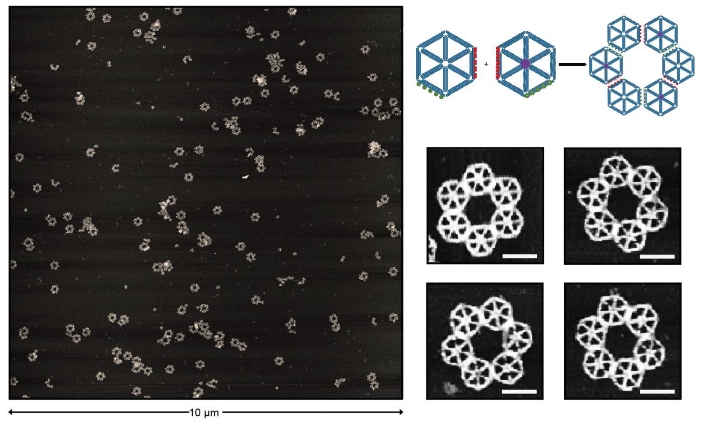

- 图S14：六边形METIS折纸形成的有限超结构的AFM图像。在两个六边形折纸之间的每条边上引入5个结合位点，每个位点都有5 nt的悬垂。AFM图像显示了有限超结构的成功形成。比例尺：100 nm。

- 图S15：六边形METIS折纸形成的有限超结构的TEM图像。在2个六边形DNA折纸之间的2条边上引入5个结合位点，每个结合位点的悬垂长度为5 nt。宽场TEM图像显示了有限超结构的成功形成，产率为~ 60 %。比例尺：100 nm。

然后，我们测试了我们用线框折纸构建高阶组装体的能力。使用与上述相同的三角形和六边形DNA折纸结构，我们在每个结构中的3条不同边上重新编程内聚相互作用，使它们能够自组装成扩展的周期性阵列（图4)。

- 图4：由METIS DNA折纸构建的2D阵列。
  - a：三角折纸和形成的二维阵列的AFM、TEM成像。
  - b：六边形折纸与形成的二维阵列的AFM和TEM成像。比例尺：500 nm。

利用三角形和六边形DNA折纸分别制备了两种不同的2D阵列，即密排和非密排。由这两种结构形成的2D阵列都是典型的多晶体结构，根据AFM和TEM图像，具有均匀的结晶区域，面积可达1-2 μm2 (图4和S16)。

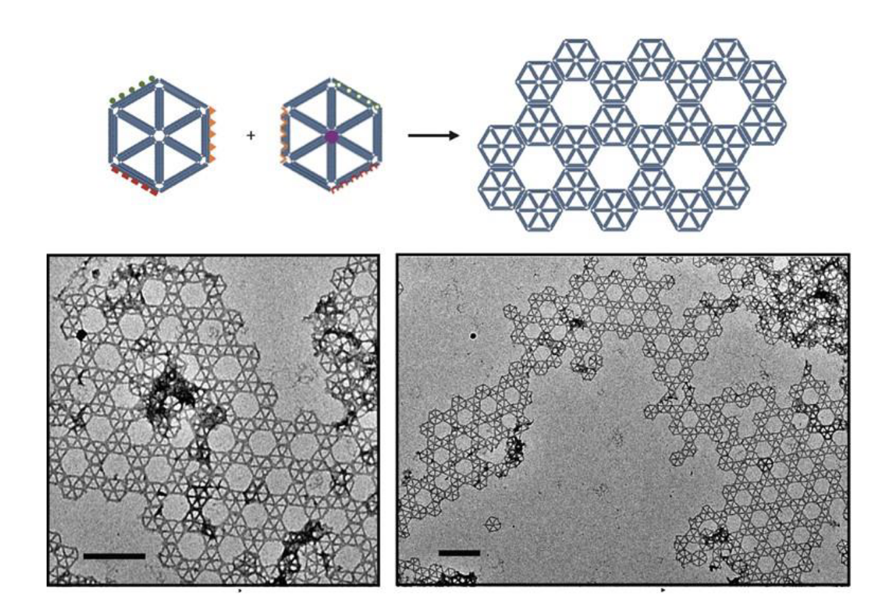

- 图S16：六边形METIS折纸形成的2D阵列的TEM图像。在2个六边形DNA折纸之间的2条边上引入5个结合位点，每个结合位点的悬垂长度为5 nt。宽场TEM图像显示二维阵列的成功形成。比例尺：200 nm。

我们又改变了由三角形折纸形成的超结构的悬垂长度，以找到在5，6和7 nt之间形成的最佳产量。有趣的是，使用三角折纸作为原型模型，我们发现通过改变悬伸长度后，结合强度与2D阵列的产量和质量之间没有明确的相关性(图S17 )。

- 图S17：不同悬伸长度的三角形折纸形成的2D阵列的AFM图像。由5 nt、6 nt和7 nt的三角形DNA折纸组成的2D阵列（均具有6个结合位点）。比例尺：1 μm。

另一方面，在设计DNA折纸和Tile的周期性组装体时，通常选择相对较弱的结合强度，这可以提供更高的脱落率（off rate），并允许更低的退火温度14,20,33。为了探索在我们的设计中用于构建2D阵列的最小亲和力相互作用，我们使用5 nt的悬垂设计，同时改变三角形2D阵列设计的内聚结合位点的数量。结果表明，当结合位点从6变化到5和4时，所有的三角形都形成了相似质量的2D阵列（图S18），并且只需在三角形折纸的每条边上形成3 x 5 nt的结合位点，就可以形成2 μm2大小的2D阵列，尽管TEM显示了总产率的显著下降（图5a）。

- 图S18：具有不同结合位点数量的三角形折纸形成的2D阵列的TEM图像。具有6、5和4个结合位点的三角形DNA折纸形成的2D阵列，每个结合位点都有5 nt的悬垂。比例尺：500 nm。

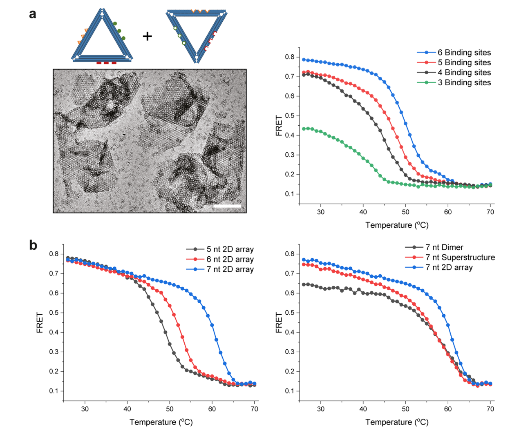

- 图5：超结构形成的热力学分析。
  - a：由具有3个结合位点的三角形DNA折纸形成2D阵列，其中整体的边间内聚相互作用低至15个碱基对。熔解曲线显示，与其他设计相比，3个结合位点设计的熔点显著降低。
  - b：基于三角形DNA折纸的5 nt × 6、6 nt × 6、7 nt × 6的二维阵列设计的熔解曲线对比。比较了二聚体、自限制超结构和基于三角形DNA折纸(每条边7nt × 6)的2D阵列设计之间的熔化曲线。
  - 比例尺：1 μm。

为了深入了解超结构形成的热力学，我们将Cy3-Cy5荧光共振能量转移( FRET )对放置在相邻的折纸单元体上进行了熔点分析(图S19 )。

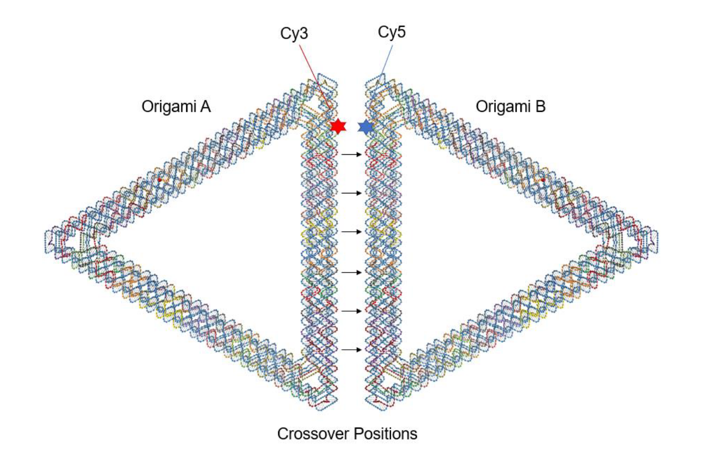

- 图S19：FRET对在三角折纸结构中的位置。红色：Cy3在折纸A中的位置。蓝色：Cy5在折纸B中的位置。

对于悬垂长度为5 nt的三角形折纸2D阵列设计，熔解曲线在6、5和4个结合位点之间出现了小的偏移( ～2 °C ) (图5a )。然而，在三个结合位点的设计中，观察到熔点的较低偏移( ～4 °C )以及较低的整体FRET效率，这与TEM成像中观察到的低自组装产率一致(图5a )。我们还比较了5 nt三角形折纸2D阵列设计与6 nt和7 nt设计的熔解曲线，均具有6个结合位点。有趣的是，除了5 nt和6 nt设计之间的偏移( ~ 4 ° C )，7 nt设计的熔点增加了~ 7 ° C (图5b )。由三角形折纸构成的二聚体和自限性超结构也出现了与7 nt设计类似的熔点升高(图S20 )。

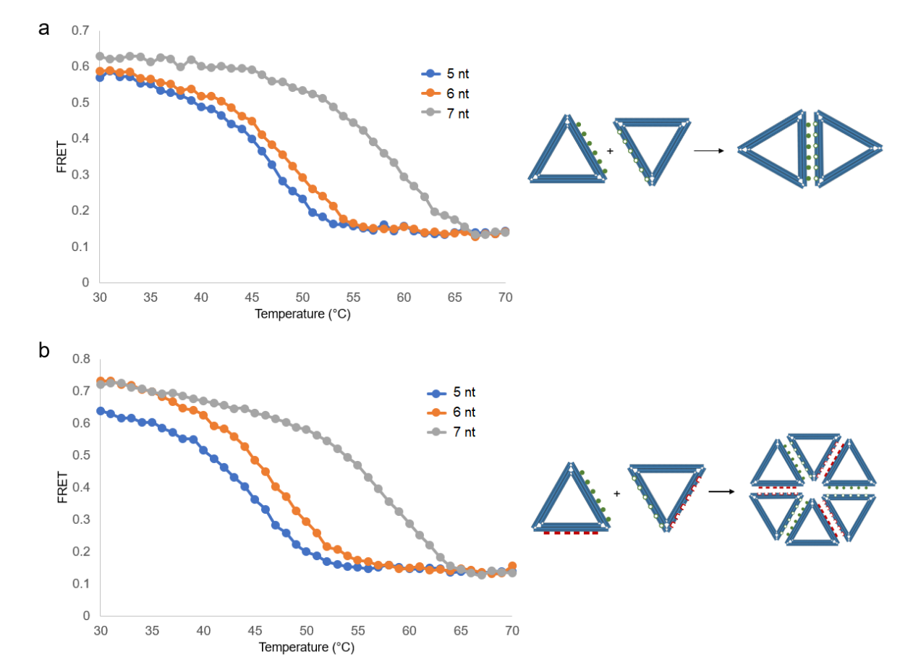

- 图S20：超结构的热力学分析。
  - a：三角形DNA折纸形成的5 nt × 6，6 nt × 6，7 nt × 6二维二聚体的熔化曲线比较。
  - b：三角形DNA折纸形成的5 nt × 6，6 nt × 6，7 nt × 6有限超结构的熔化曲线比较。

7 nt设计下熔点的急剧增加很可能是由于两个交叉点之间的连续双链（图S21），而不仅仅是碱基对数量的增加。

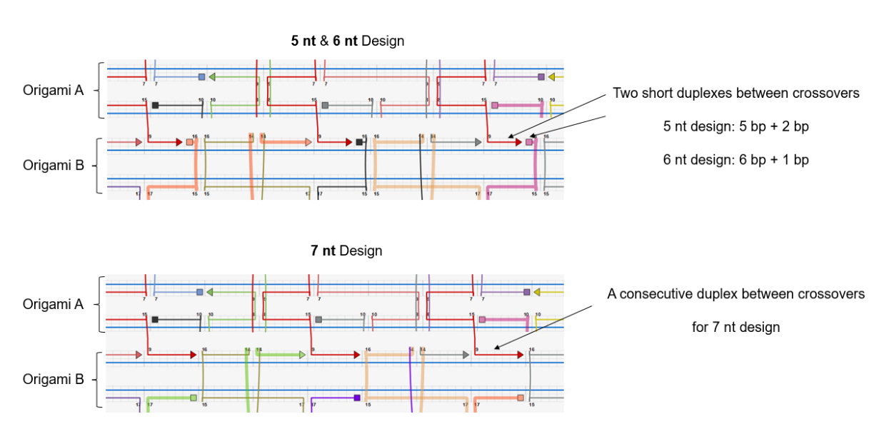

- 图S21：5 nt和6 nt设计与7 nt设计的比较。

在基于二聚体和六边形超结构的7 nt设计中获得的增强的产率表明，在构建有限超结构时，更高的结合强度是有利的，而扩展的2D阵列似乎对这些设计参数不太敏感。然而，更陡峭的熔化曲线表明，2D阵列的自组装比其有限的超结构更具有协同性（图5b），这在基于DNA的系统中构建周期性阵列时是有利的。

最后，我们使用TEM定量测量了超结构形成后三角折纸的顶点角度，并与单个独立的折纸的顶点角度进行了比较。超结构的内顶点角度与其三角形单体相比呈现出相似的分布（图6a），表明超结构内部保留了三角形折纸物体的结构完整性。

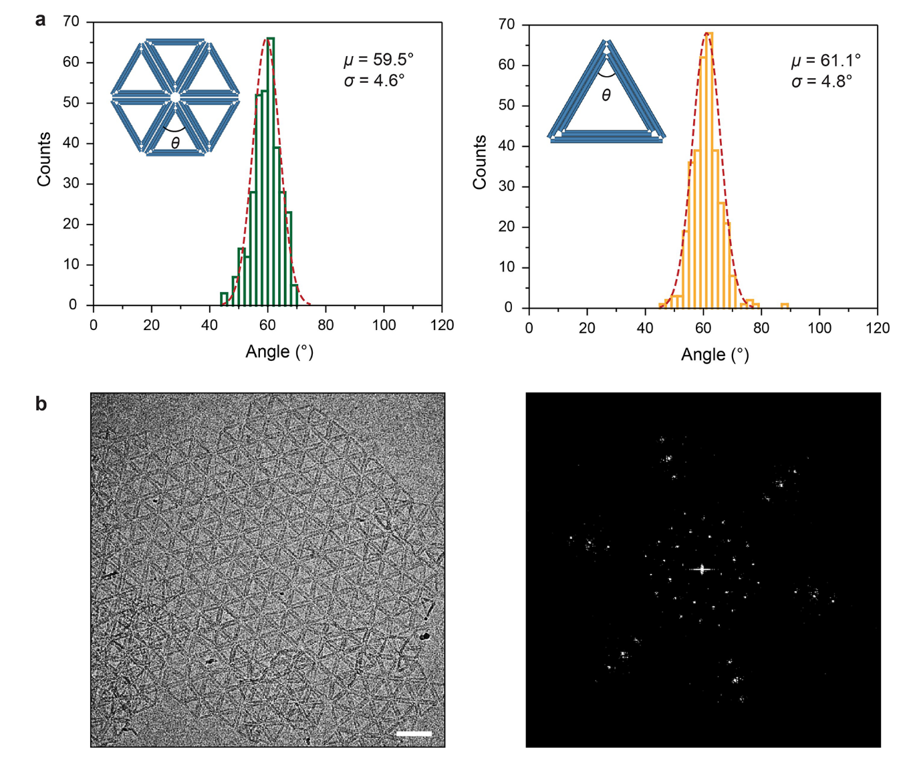

- 图6：由三角形DNA折纸构建的超结构的结构完整性。
  - a：自限超结构和个体三角折纸的顶点角度分布。
  - b：由三角形METIS折纸构成的二维阵列的低温电磁图像及其相应的FFT。
  - 比例尺：100 nm。

低温电子显微镜( cryo-EM )也被用于对三角形折纸的2D阵列进行成像，发现2D阵列的边缘呈多层堆叠，这可能是由于成像过程所需的浓度升高，高度有序的结构在组装体中间清晰可见(图6b )。使用快速傅里叶变换( FFT )进一步评估了使用cryo - EM在冰中成像的2D阵列的周期性和对称特征(图6b )，突出了其结构规律性34,35。三角形和六边形折纸形成的有限的、自限的超结构也用cryo - EM成像，在所使用的成像条件下没有观察到明显的结构变形(图S22 )。

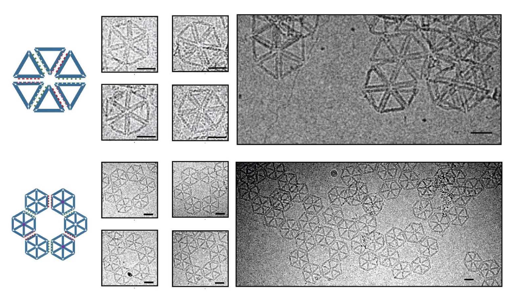

- 图S22：三角形和六边形METIS折纸物体形成的有限超结构的冷冻电镜图像。与相应的AFM和TEM图像相比，有限超结构的冷冻电镜图像没有明显的结构变形。比例尺：50 nm。

## Conclusion

总之，我们实现了一种新颖的多折纸自组装策略，使用自上而下设计的METIS线框折纸，利用相邻平行边界双链之间的平行交叉来制造基于DNA的超结构。通过系统地改变结合位点的数量和强度，探索了形成这些超结构的最佳条件。几个不同线框的二维折纸对象的结果表明，我们的基于边的自组装策略应该适用于使用METIS设计的广泛的结构，以及手动设计的DNA折纸对象或Tile19,24,36。可以设想将具有各种形状和尺寸的线框超结构应用于先进的光刻、图案化和模板化的2D纳米材料中。

