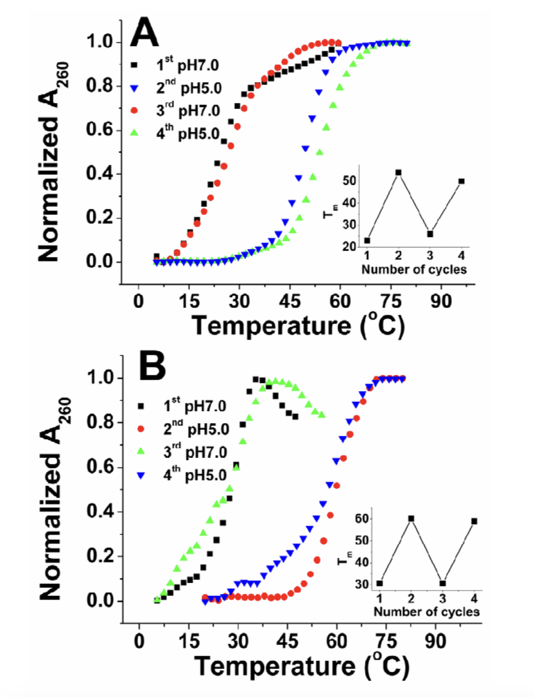

## pH-controlled reversible drug binding and release using a cytosine-rich hairpin DNA

#### 2011_使用富含胞嘧啶的发夹DNA进行pH控制的可逆药物结合和释放

**IF： 4.9**

### Abstract

本研究报道了一种富含胞嘧啶的DNA载体，它是pH响应的，在发夹和i-Motif结构之间变化，可以作为药物结合和释放装置。

### Introduction

核酸由于其构象多态性、可编程序列特异性识别和强大的物理化学性质，已被公认为纳米技术和材料科学的一种有吸引力的构建材料。许多基于核酸的人造结构/设备已经被构建出来，并在微型生物传感器、显微外科、药物输送、纳米机器人和动态纳米材料中显示出潜在的应用。1 人类端粒（Human telomeric）的i-motifDNA结构是pH依赖性的。2 在酸性pH下，它可以利用插入的CC+碱基对折叠成的闭合四链结构，2 并在碱性pH下展开成单链形式。已经报道了许多基于溶液1,2b 或表面 2c 的i-Motif DNA的pH相关的DNA装置。尽管这些DNA纳米器件很有前景，但如何使其在该领域实现复杂功能仍然具有挑战性。为此，已经付出了很多努力。1e–g 最近，Li等 3 报道了一种含有i-Motif的DNA装置，该装置可以在等温条件下分解某些形式的Watson–Crick相互作用，以响应pH变化。由于许多抗癌药物可以与双链DNA相互作用，4 因此我们试图利用这一i-Motif的独特特征，使用富含胞嘧啶的发夹DNA，以pH控制的可逆结合和释放的方式设计DNA药物载体。药物控释系统是人类保健领域最有前景的应用之一，也是生物医学材料科学领域不断发展的一个领域。最近有报道了“按需”释放系统，其可以对一系列刺激做出反应，包括氧化还原、pH或温度、酶、竞争性结合和光照等。 5 

尽管取得了这些成就，但许多现有的系统都存在缺点，例如复杂或难以应用的刺激物，较差的水溶液适用性和生物相容性，以及有毒的试剂等。特别是，这些先前报道的系统大多具有较差的药物选择性。在此，我们设计并构建了一种用于药物结合和释放的直接质子驱动的富含人类端粒胞嘧啶的发夹DNA，其中DNA既用作载体又用作药物释放装置。由于许多与DNA结合的治疗剂具有序列或结构特异性偏好，6 我们在这里设计的药物释放装置可以选择相应的药物来递送。选择抗癌剂阿霉素（DOX）和潜在的抗癌剂Hoechst 33258作为我们的模型系统。DOX 4a 是一种众所周知的抗癌药物，已显示出对一系列肿瘤的疗效。4,7 众所周知，DOX由于其扁平的芳环和正电荷而可以插入DNA链（优先与双链5'-GC-3'或5'-CG-3'序列结合）。Hoechst 33258是一种带正电的双苯并咪唑分子（bisbenzimidazole），可以在双链DNA的小沟区域强烈结合，对富含AT的序列具有主要的特异性。8 双苯并咪唑家族分子是潜在的抗癌药物。9

### Body

我们的pH驱动的富含胞嘧啶的DNA药物释放装置的工作原理如方案1所示。

- 方案1：富含胞嘧啶的DNA药物结合和释放装置的方法示意图，该装置能够分解某些形式的Watson–Crick相互作用。带下划线的序列代表富含胞嘧啶的片段，该片段可以在酸性条件下形成i-Motif结构。
  - （a） 中性/碱性条件下发夹结构茎部的药物结合。
  - （b） 随着环境pH值的变化，i-Motif结构的形成和解构。
  - （c） 随着环境pH值的变化，药物结合和释放过程的可逆循环。

相应地设计了28mer的gcDNA寡核苷酸（CGC CCC TAA CCC TAA CCC TAA CCC T GCG）和28mer的atDNA寡核苷酸（AAA CCC TAA CCC TAA CCC TA A CCC T TTT）。在中性/碱性条件下，富含胞嘧啶的gcDNA片段会随机定位，并且两个3碱基末端（GCG-CGC）相互互补，因此28mer的gcDNA形成茎环构象（方案1a）。带正电的抗癌药物阿霉素可以与GCG-CGC双链结合。然而，在酸性条件下，由于胞嘧啶质子化（dC+），富含C的片段预计形成i-Motif结构 10 ，其将破坏部分双链茎部分（GCG-CGC）之间的氢键（方案1b）。因此，带正电荷的DOX将被释放（方案1c）。带正电荷的Hoechst 33258遵循与DOX结合gcDNA相同的方式，不同之处在于Hoechst 332 58结合DNA小凹槽。

为了证明pH在7.0至5.0之间时DNA构象的变化，进行了UV熔融、圆二色性（CD）和聚丙烯酰胺凝胶电泳（PAGE）。图1A和B显示了gcDNA和atDNA在不同pH条件下的UV熔融曲线。在pH 7.0和5.0之间观察到显著差异。在pH 7.0时，紫外线熔融研究表明，gcDNA和atDNA的DNA熔解温度（Tm）分别为22.5°C和15.6°C，然而，在pH 5.0时，gcDNA与atDNA均显示出明确的转变，Tm为48.9°C。这表明两种DNA在pH 5.0时比在pH 7.0时更稳定。CD光谱表明，当pH在10°C下从7.0变化到5.0时，两种DNA都会发生构象变化。图1C和D显示观察到的DNA结构是pH依赖性的。在pH 7.0下，gcDNA在275nm附近具有正带，在246nm附近具有负带，atDNA在275mm附近具有正带，在248nm附近具有负带，表明形成了B型双链体。

- 图1：DNA在不同pH下的UV熔融和CD光谱变化。
  - （A）gcDNA在pH 7.0（黑线）或pH 5.0（红线）下在cacodylic buffer中的UV熔融曲线。
  - （B）atDNA在pH 7.0（黑线）或pH 5.0（红线）下在cacodylic buffer中的紫外熔融曲线。
  - （C）gcDNA在pH 7.0（黑线）或pH 5.0（红线）的cacodylic buffer中在10℃下的CD光谱。
  - （D）atDNA在pH 7.0（黑线）或pH 5.0（红线）的cacodylic buffer中在10℃下的CD光谱。（1 mM cacodylic acid/sodium cacodylate/100 mM NaCl）。DNA链的浓度为1mM（UV熔融）或2mM（CD光谱）。

根据DNA序列，我们推断gcDNA和atDNA都采用了带B-DNA茎的发夹结构，或者形成了分子间的B-DNA双链体，但这种双链体在我们接下来的凝胶实验中被排除了。在pH 5.0下，观察到gcDNA和atDNA的两个i-MotifDNA特征CD带。11,12 gcDNA的正带蓝移（blueshift）至286nm，负带蓝移到256nm。对于atDNA，正带移动到286nm，负带移动到253nm。这清楚地表明富含C的gcDNA和atDNA都形成i-Motif结构，并且具有分解B-DNA茎或分子间B-DNA双链体的氢键的潜在能力。

通过聚丙烯酰胺凝胶电泳（PAGE）实验，进一步研究4°C下不同pH条件下的构象变化（图2）。使用dT22 和 dT12 DNA作为标记。图2A与图2B的比较清楚地表明，DNA在pH 5.0和pH 7.0下具有不同的电泳迁移率。在pH 7.0下，gcDNA（28mer）和atDNA（28-mer）的迁移速度略快于dT22 （图2A），表明这两种DNA采用紧凑的发夹结构，而不是分子间双链结构（方案1a）。相反，当pH值降低到5.0时，两种DNA的迁移速度比dT22快得多，几乎和dT12一样快。这一观察结果与两种DNA在pH 5.0下形成更紧密的i-Motif结构的假设一致（方案1b）。结果明确地表明，DNA装置可以按照pH条件从而选择的不同构象。然后，我们研究了所设计的DNA装置的可操作性。使用gcDNA–阿霉素和atDNA–Hoechst 33258作为模型系统，我们评估了DNA装置是否可以在受控的情况下可逆地捕获和释放药物分子。荧光滴定法（Fluorescence titration）13  用于测定药物与DNA的结合，其中固定浓度的DOX或Hoechst 33258随DNA浓度的增加而滴定（图S1）。根据滴定，DOX与gcDNA的结合比为3:1，Hoechst 33258与atDNA的结合率为2:1（图S1 B和D）。

- 图S1：
  - A：在4℃下，用gcDNA在100 mM NaCl、1 mM cacodylic buffer（pH 7.0）中进行阿霉素的荧光滴定。gcDNA的浓度从0μM到3μM不等。λex=480nm，λem=560nm。
  - B：560nm处荧光强度随源自荧光滴定的gcDNA浓度增加而变化。阿霉素浓度为2μM。在0.67μM的gcDNA处观察到断点（[阿霉素]/[gcDNA]的比例为3:1）。
  - C：在4℃下用atDNA在100 mM NaCl、1 mM cacodylic buffer（pH 7.0）中进行Hoechst 33258的荧光滴定。atDNA的浓度从0μM到3μM不等。λex=346，λem=475 nm（有atDNA），λem=525 nm（无atDNA）。
  - D：475 nm处荧光强度随源自荧光滴定的atDNA浓度增加而变化。在1μM atDNA处观察到断点（[hoechst 33258]/[atDNA]的比例为2:1）。Hoechst 33258的浓度为2μM。

表S2总结了计算得到的热力学参数。

- 表S2：在4℃下，在100 mM NaCl、1 mM cacodylic（pH 7.0）中与药物结合到DNA的热力学参数总结。

荧光滴定数据的非线性最小二乘分析13（详细信息见support information）得出DOX与gcDNA和Hoechst 33258与atDNA的结合常数分别为3.73 * 105 和 2.32 * 104 M-1。我们还使用UV熔融、CD光谱研究了药物在不同pH下与DNA的结合（图S2）和PAGE（图2）。

- 图S2：在不同pH（1 mM cacodylic acid/sodium cacodylate/100 mM NaCl）下的DNA UV熔融和CD光谱变化。
  - A：在不存在（黑线）或存在（红线）阿霉素的情况下，pH 7.0时，gcDNA的UV熔融曲线。
  - B：在不存在（黑线）或存在（红线）hoechst 33258的情况下，pH 7.0时，atDNA的UV熔解曲线。
  - C：在不存在（黑线）或存在（红线）阿霉素的情况下，pH 5.0时，gcDNA的UV熔融曲线。
  - D：在不存在（黑线）或存在（红线）hoechst 33258的情况下，pH 5.0时，atDNA的UV熔解曲线。
  - E：不同溶液环境下，阿霉素不存在或存在时，gcDNA的CD光谱。
  - F：在不同溶液环境下，hoechst 33258不存在或存在时，atDNA的CD光谱。
  - DNA链的浓度为1μM（UV熔融）或2μM（CD光谱）。

UV熔融研究表明，在pH 7.0时，DOX可使gcDNA熔融温度（Tm）提高16°C，Hoechst 33258可使atDNA熔融温度提高14°C。显然，DOX和Hoechst 33258都可以在pH 7.0下稳定DNA。然而，在pH 5.0下，带正电荷的DOX或Hoechst 33258都不会增加i-MotifDNA的稳定性（图S2 C和D）。与pH 7.0下单独的DNA相比（图S2 E和F），药物结合几乎不会改变DNA CD光谱；这与PAGE结果一致，即药物结合不会显著影响DNA迁移率（图2）。所有这些结果表明，在pH 7.0下药物结合不会改变DNA构象。

- 图2：不存在/存在阿霉素时的gcDNA和不存在或存在Hoechst 33258时的atDNA的PAGE凝胶电泳分析（15%PAGE）。凝胶在4°C的tris-boric酸缓冲液中运行。
  - (A) at pH 7.0. 
    - Lane 1: dT22; 
    - Lane 2: dT12; 
    - Lane 3: gcDNA; 
    - Lane 4: gcDNA + doxorubicin; 
    - Lane 5: atDNA; 
    - Lane 6: atDNA + Hoechst 33258. 
  - (B) at pH 5.0. 
    - Lane 1: dT22; 
    - Lane 2: dT12; 
    - Lane 3: gcDNA; 
    - Lane 4: gcDNA + doxorubicin; 
    - Lane 5: atDNA; 
    - Lane 6: atDNA + Hoechst 33258.

通过测量pH变化时的药物荧光强度来研究药物结合和释放的可逆性（图3）。当所设计的DNA装置循环操作时，记录（A）560nm处的发射强度、DOX的最大发射波长（在480nm处激发）和（B）475nm处的发射强度、Hoechst 33258的最大发射波长（346nm处的激发）的变化。图S1 A和C显示，在没有DNA的情况下，药物处于具有固有荧光的游离状态；添加DNA后，形成药物-DNA复合物，导致DOX与gcDNA结合的荧光显著降低（图S1 A）4a或Hoechst 33258与atDNA结合的显著增加（图S1 C）8a。有趣的是，在pH变化时，如图3A所示，gcDNA–DOX在560nm处的荧光强度随着pH从7.0变为5.0而增加，当pH从5.0变回7.0时，荧光强度再次降低到初始强度。这些结果表明DOX可以在pH 7.0时与gcDNA结合，然后在pH 5.0时释放。当环境pH值在7.0和5.0之间变化时，药物结合和释放可以连续循环。对于atDNA–Hoechst 33258系统，如图3B所示，475 nm处的荧光强度随着pH从7.0变为5.0而降低，当pH从5.0变回7.0时，荧光强度再次增加到初始强度。这些结果还表明，Hoechst 33258可以在pH 7.0时与atDNA结合，然后在pH 5.0时释放，并且当环境pH值在7.0和5.0之间变化时可以连续循环。多次循环后荧光强度的降低应归因于荧光染料的光漂白（photo bleaching）和溶液的稀释。

- 图3：通过荧光光谱监测药物结合和释放之间的切换，同时溶液pH值在4°C下的7.0和5.0之间变化。
  - A：480nm激发下，gcdna-阿霉素体系在560nm处的荧光发射强度的变化。
  - B：346 nm激发下，atDNA-Hoechst 33258体系在475 nm处荧光发射强度的变化。

UV熔融结果进一步支持了pH变化时，可逆的药物结合和释放（图S3）。

- 图S3：当溶液pH值在5.0和7.0之间振荡时，通过UV熔融监测药物结合和释放之间的切换(1 mM cacodylic acid/sodium cacodylate/100 mM NaCl)。
  - A：当溶液pH值在5.0和7.0之间变化时，gcDNA-阿霉素的UV熔解曲线。
    - 插图：当溶液pH值在5.0和7.0之间变化时，gcDNA-阿霉素系统的Tm的变化。
  - B：当溶液pH值在5.0和7.0之间变化时，atDNA-hoechst 33258的紫外熔解曲线
    - 插图：当溶液pH值在5.0和7.0之间变化时，atDNA-hoechst33258体系的Tm的变化。

### Conclusion

总之，我们构建了一种新型的质子驱动的DNA药物结合和释放装置。它可以通过在环状发夹DNA和i-Motif结构之间切换，从而可逆地结合和释放抗癌药物。这种由pH驱动而不需要外部能源的DNA药物释放装置是坚固的、高度可逆的，并且不会生成额外的双链产物，在系统中发生不想要的副反应。更重要的是，我们的工作证明了基于DNA的纳米机械装置的工作原理与独特构象依赖的药物结合和递送特性的成功结合。这可能有助于设计和构建易于操作、成本效益高、可靠和高效的功能性DNA纳米结构，用于可控的药物结合和释放。
