## PH-Controlled Carbon Nanotube Aggregation/Dispersion Based on Intermolecular I-Motif DNA Formation

#### 2010_基于DNA形成分子间 I-Motif 的pH响应的碳纳米管的聚集/分散

**IF（2019）：1.134**

### Abstract

本研究提出了一种新的策略，通过pH依赖的分子间i-Motif结构（C-四链体）的形成来操纵碳纳米管在溶液中的聚集和分散。首先，含有两段富含胞嘧啶（C）结构域的单链DNA（ single-stranded , ss ）与碳纳米管共价连接。在pH 8.0时，DNA为随机线圈状态，这增强了多壁碳纳米管（multi-wall carbon nanotubes, MWNT）在水中的分散性；将pH值调节到5.0后，相邻碳纳米管上富含C的ssDNA形成的分子间i-Motif结构可以驱动MWNT的聚集。这一过程是可逆的，并且圆二色谱（circular dichroism ，CD spectroscopy）、凝胶电泳和透射电子显微镜（TEM）证实了这种转变过程。考虑到碳纳米管的机械性质，这一发现将有利于人造肌肉、功能性纳米器件等许多应用研究领域。

关键词：分子间 I-Motif，碳纳米管，pH响应

### Introduction

自1991年Iijima首次报道碳纳米管（Carbon nanotubes，CNTs）以来，它们引起了人们的极大研究兴趣。由于其优异的化学和物理性能，碳纳米管已被用于实现包括电子、光学、力学和生物传感等许多应用。1–4 为了实现这些目标，明确如何控制碳纳米管组装成所需的大型结构至关重要。令人鼓舞的是，最近的工作向我们展示了通过小分子5、聚合物6和生物分子（如蛋白质7和DNA分子8）控制碳纳米管自组装过程的能力。

在这些候选生物分子中，DNA分子因其独特的性质，如序列编程、碱基对识别和可调构象，已被证明是纳米技术领域最有前途的工具。最近，几个小组使用DNA分子成功地分散（disperse）和组装了碳纳米管。例如：Zheng等人报道了一种通过DNA包裹（DNA wrapping）将单壁碳纳米管（single-walled carbon nanotubes ，SWNTs ）分散在水中的方法。9 Mao和他的同事探索了一种通过DNA杂交8a 操纵单壁碳纳米管聚集和分散过程的新方法，并证明了通过可以改变温度来逆转这一过程：当温度高于序列熔化温度（Tm）时，单壁碳纳米管呈独立状态，反之，单壁碳管则呈聚集状态。

最近，Deng和他的同事开发了一种实现单壁碳纳米管可控自组装的优雅方法：8b 通过引入“toehold”，他们可以调节杂交动力学以控制单壁碳纳米管组装过程的速率，他们还测试了这个复杂系统作为传感单元的能力。Mao和Deng的工作都是基于DNA链交换（DNA strands-exchanging）机制。在此，我们提出了一种不同的设计来控制MWNTs的聚集/分散过程，这种设计策略基于分子间i-Motif DNA的形成，而不是添加其他互补DNA。i-Motif 结构由四段富含C的DNA结构域形成，这些结构域只能在较低的pH下稳定。10 分子内i-Motif DNA 已被用于推动由pH驱动的纳米机器，这种机器强大、可靠，并已广泛用于构建不同的纳米器件。11 同时，分子间 i-Motif 结构也被证明：其可以在溶液中将金纳米颗粒拉在一起12 并形成pH触发的、快速响应DNA水凝胶的能力13 。在本研究中，含有两段富含胞嘧啶（C）结构域的单链DNA通过化学反应被共价地连接到碳纳米管上。圆二色性光谱（Circular dichroism，CD spectroscopy）证实，在相邻碳纳米管上的ssDNA的富含C的结构域之间形成的分子间i-Motif结构是由环境pH变化驱动的。可逆的聚集/分散过程由透射电子显微镜（TEM）和凝胶电泳技术表征。

### Experimental Details

本研究中的多壁碳纳米管（MWNTS）购自Timesnano Inc （Chengdu, China）。MWNT的直径约为10nm，并且纯度大于90%。将20 mg MWNT与以3:1的比例混合的 60 ml硫酸（H2SO4）和 20 ml硝酸（HNO3）的溶液混合，并在100°C下加热1小时。这一步骤可以将羧基（carboxyl）引入MWNT并缩短MWNT。将功能化的MWNT过滤，并用去离子水（deionized water ）洗涤至中性。修饰的单链DNA（i-motif DNA:5'-NH2-TTTTTTTTTCCCCTAACCCC-3;control DNA: 5'-NH2-TTTTTTTTTCACTCACCACT-3' ）由TaKaRa Biotech（Dalian, China）合成。在Tris缓冲液（pH＝7.5）中，将过量的氨基（amino，H2N-）修饰的单链DNA和羧基功能化的MWNT混合在一起4小时，以使 ethyl-3-（3-dimethylaminopropyl）carbodiimide （EDC）和N-hydroxysuccinimide （NHS）结合。然后将反应混合物装载在Micron YM-100（Millipore Company）中，并以4,400rpm离心20分钟以除去未反应的DNA。将DNA-MWNTs重新分散在50mM MES缓冲液（pH＝7.0 NaCl 10mM）中。DNA-MWNTs共轭物的最终浓度估计为0.1 mg/ml。

透射电子显微镜实验是在FEI T20电子显微镜上，使用CCD相机，在200kV下操作进行的。通过将一滴DNA-MWNT共轭物置于透射电子显微镜铜栅格（400个网格，碳涂层）上制备样品。将栅格风干12小时。对于凝胶电泳实验，将5ul样品加载到0.5%琼脂糖凝胶中，并在50mM TBE缓冲液中，以8V/cm运行5分钟。所有CD光谱都记录在配备有可编程温度控制单元的Jasco–810分光偏振仪上。所有提到的pH值均通过微型pH计 (FE 20 from METTLER TOLEDO company) 进行校准。本文中的照片是由Cannon IXUS 70数码相机拍摄的。

### Results And Discussion

图1说明了该系统的工作方案，该系统仅包含一种与氨基修饰的单链DNA化学连接的MWNT，并且该ssDNA包含两段CCCC结构域（即i-Motif DNA）。

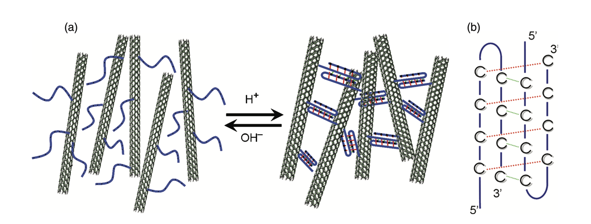

- 图1：
  - （a）聚集态和分散态之间转变过程的示意图。在高pH下，MWNT上的所有DNA都是随机线圈，因此MWNT是单独分离的。在低pH下，分子间i-Motif的形成导致MWNT组装成聚集体。这两种状态可以通过向系统中添加酸或碱来改变溶液pH来切换。
  - （b）由来自相邻MWNT的两个 半-i-Motif DNA形成的分子间 i-Motif 结构的示意图，其中i-Motif DNA 的两个富含C的结构域像纳米钩子一样组装MWNT。

这两个富含C的结构域就像一个纳米级的“钩子”来组装MWNT。这两个富含C的结构域被9个胸腺嘧啶（thymine）碱基间隔区隔开，以通过降低空间位阻（steric hindrance）来增加它们的可及性（accessibility）。在pH为8时，i-Motif DNA呈无规卷曲，因此MWNT由于其表面带负电的羧基之间的静电排斥而分离。此时溶液显示黑色，因为MWNT被很好地分散。当pH降低时，富C结构域中的胞嘧啶部分质子化，导致质子化的（CH+）和非质子化胞嘧啶（C）之间形成C≡CH+氢键，因此在相邻MWNT的富C结构域之间形成分子间i-Motif。这可以将mwnt聚集在一起，并将它们组装成可以肉眼可见的聚集体。而且，这个过程是可逆的。向系统中加入碱会使质子化的胞嘧啶去质子化，并破坏分子间i-Moitf，进一步分解MWNT聚集体。

为了验证我们设计的可行性，使用圆二色性（CD）光谱来验证i-Motif结构的形成。在pH 5.0下，该体系具有CD光谱，其显示出i-Motif结构的不同特征，在285nm附近具有强的正带，在260nm附近具有较小的负带，在270nm附近具有交叉。这确实表明与MWNT连接的富含C的ssDNA可以形成i-Motif结构，并具有将MWNT拉在一起的潜在能力。在pH 8.0下，CD光谱显示出B型双链DNA结构的不同特征，在275nm附近有正带，在245nm附近有负带，在258nm有交叉。特别地，258nm处的交叉排除了可能有助于分解聚集体的随机线圈结构，并且此时系统显示出均匀的黑色溶液。

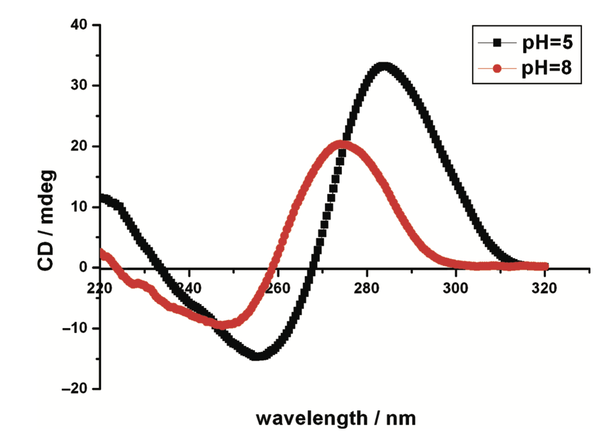

- 图2：i-Motif DNA在不同环境pH下的CD光谱。

凝胶电泳是一种分析带电物体在电场中行为的强大技术。在这种技术中，带电粒子在电场作用下在多孔基质（凝胶）中迁移；粒子的迁移率取决于它们的电荷和大小。最近，凝胶电泳被发现用于胶体科学，并被应用于分离金纳米晶体/DNA共轭物，因为DNA与纳米颗粒的结合应该会是其电泳迁移率产生显著变化。14 受此启发，我们试图用凝胶电泳的方法来表征可逆的组装过程。首先，羧基功能化的MWNT不能在凝胶中运行。这主要是因为通过氧化反应引入的羧基不能提供足够的负电荷以给出适当的荷质比（charge-mass ratio），因此在凝胶中没有显示出明显的移动。然后，我们检查DNA-MWNT共轭物在凝胶电泳过程中的表现。在此，我们设计了一个序列为5'-NH2-TTTTTTTTCACCACT 3'的对照DNA，它在微酸环境中不能形成任何二级结构。从图3中的琼脂糖凝胶中观察到，泳道1和泳道2分别在pH 8和pH 5下加载对照DNA-MWNT共轭物，这两种缀合物均显示连续的涂抹（continuous smear）。这主要是因为MWNT的长度不均匀。因此，虽然连接到相同的对照DNA，但具有不同长度的MWNT肯定会具有不同的电泳迁移率，所以在琼脂糖凝胶中出现涂抹。在pH 5和pH 8的凝胶电泳过程中，i-Motif DNA-MWNT共轭物的表现与对照DNA-MWNT共轭物完全不同。较低的pH将诱导i-Motif结构的形成，并且该i-Motif DNA被功能化为连接体（linker）以将相邻的MWNT连接在一起并最终形成聚集体。在凝胶电泳过程中，这种聚集体不能渗透到凝胶中。当pH值升高到8时，i-Motif结构被破坏，并且i-Motif DNA显示出随机的单链状态。因此，聚集体被分解成单独的MWNT，并与对照组一样在凝胶中显示出连续的涂抹。凝胶电泳中的这种pH依赖性行为确实证实了MWNT的聚集/分散过程是由i-Motif DNA的构象变化驱动的。这种凝胶电泳方法也用于先前的工作中，以演示DNA-CNT的组装过程。8 通过交替加入HCl和NaOH，在凝胶电泳中演示了三个循环。从图3（泳道3-8）可以看出，循环效率相当不错。值得注意的是，凝胶电泳是在TBE缓冲液（pH=8.0）中进行的，在这种情况下，MWNT聚集体将缓慢分解，因此更快、更仔细地加载样品和运行琼脂凝胶至关重要。

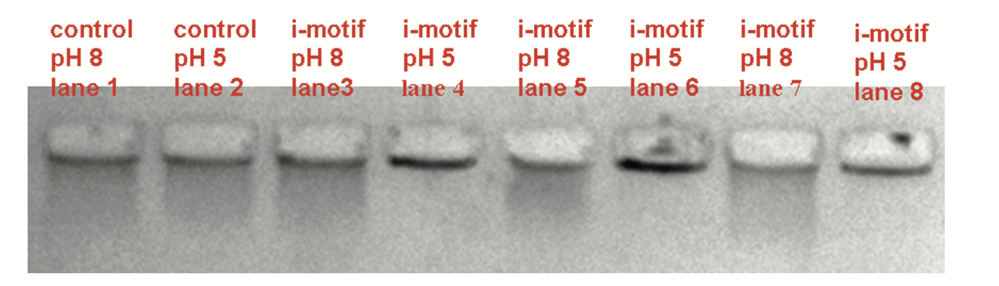

- 图3：通过改变环境pH，利用0.5%琼脂糖凝胶电泳分析可逆的MWNT聚集/分散过程。
  - 泳道1和2分别对应于pH为8和5的对照DNA-MWNT共轭物。
  - 泳道3-6对应于在pH 8和5下进行三个循环的i-Motif DNA-MWNT共轭物。

聚集发生后，DNA-MWNT共轭物应倾向于从溶液中沉淀出来。除了凝胶电泳实验之外，我们还使用离心辅助沉淀技术8b来目视观察由于DNA-MWNT共轭物的聚集所形成的沉淀物，以及形成的沉淀的再分散。图4（插图）说明了i基序DNA-MWNT共轭物在分别于pH 5和pH 8下以2000g离心5分钟后的表现。该结果揭示了DNA-MWNT共轭物的分散状态和聚集状态之间的鲜明对比。

为了进一步研究i-Moif DNA-MWNT聚集体，使用透射电子显微镜（TEM）技术在微观尺度上观察DNA-MWNT。将pH为8和5的两个样品置于透射电子显微镜网格上并分别成像。代表性的TEM图如图4所示：可以清楚地看到，MWNT在pH 8下很好地分散。在pH值为5时，它们相互纠缠，聚集成聚集体。因此，这一发现与凝胶电泳的结果非常一致，并证实了观察到的凝胶电泳迁移率变化确实是由MWNT组装引起的。

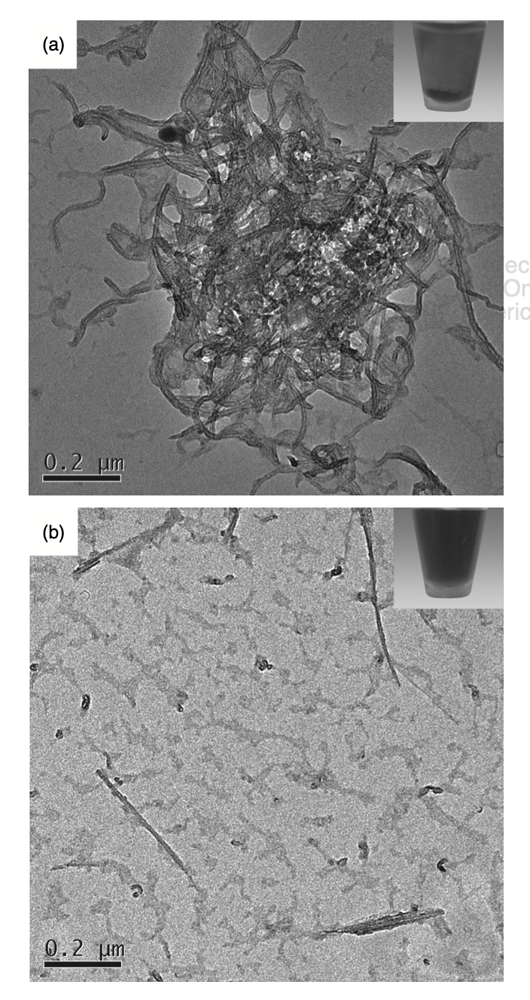

- 图4：在（a）pH 8和（b）pH 5下的DNA-MWNT共轭物的代表性TEM图像。
  - 插入图片显示DNA-MWNT共轭物在（a）pH 8和（b）pH 5下以2000g离心5分钟。

### Conclusions

总之，我们已经证明，通过将环境pH值改变为5，用含有两段富含C结构域的ssDNA修饰的MWNT可以被可控地聚集。这种聚集是由分子间i-Motif DNA的形成驱动的，因此仅在低于i-Motif pKa的pH下发生。这种聚集对两个富含C的结构域是特异性的，如果其他对照DNA代替i-Motif DNA，则不会形成分子间i-Motif 结构，也不会聚集MWNT。这种聚集是可逆的，可以通过改变环境pH值来切换，并且可以通过离心辅助沉淀技术来可视化可逆过程。考虑到碳纳米管优异的物理和化学性质，如果该系统与新的i-motif DNA结构调节方法相结合，15 将实现一些新的电子和光学器件。由于组装和拆卸状态是可逆的，我们的设计提供了一个动力学的双态转换系统，这将有利于人工肌肉等许多应用研究领域。

## pH-controlled reversible drug binding and release using a cytosine-rich hairpin DNA

#### 2011_使用富含胞嘧啶的发夹DNA进行pH控制的可逆药物结合和释放

**IF： 4.9**

### Abstract

本研究报道了一种富含胞嘧啶的DNA载体，它是pH响应的，在发夹和i-Motif结构之间变化，可以作为药物结合和释放装置。

### Introduction

核酸由于其构象多态性、可编程序列特异性识别和强大的物理化学性质，已被公认为纳米技术和材料科学的一种有吸引力的构建材料。许多基于核酸的人造结构/设备已经被构建出来，并在微型生物传感器、显微外科、药物输送、纳米机器人和动态纳米材料中显示出潜在的应用。1 人类端粒（Human telomeric）的i-motifDNA结构是pH依赖性的。2 在酸性pH下，它可以利用插入的CC+碱基对折叠成的闭合四链结构，2 并在碱性pH下展开成单链形式。已经报道了许多基于溶液1,2b 或表面 2c 的i-Motif DNA的pH相关的DNA装置。尽管这些DNA纳米器件很有前景，但如何使其在该领域实现复杂功能仍然具有挑战性。为此，已经付出了很多努力。1e–g 最近，Li等 3 报道了一种含有i-Motif的DNA装置，该装置可以在等温条件下分解某些形式的Watson–Crick相互作用，以响应pH变化。由于许多抗癌药物可以与双链DNA相互作用，4 因此我们试图利用这一i-Motif的独特特征，使用富含胞嘧啶的发夹DNA，以pH控制的可逆结合和释放的方式设计DNA药物载体。药物控释系统是人类保健领域最有前景的应用之一，也是生物医学材料科学领域不断发展的一个领域。最近有报道了“按需”释放系统，其可以对一系列刺激做出反应，包括氧化还原、pH或温度、酶、竞争性结合和光照等。 5 

尽管取得了这些成就，但许多现有的系统都存在缺点，例如复杂或难以应用的刺激物，较差的水溶液适用性和生物相容性，以及有毒的试剂等。特别是，这些先前报道的系统大多具有较差的药物选择性。在此，我们设计并构建了一种用于药物结合和释放的直接质子驱动的富含人类端粒胞嘧啶的发夹DNA，其中DNA既用作载体又用作药物释放装置。由于许多与DNA结合的治疗剂具有序列或结构特异性偏好，6 我们在这里设计的药物释放装置可以选择相应的药物来递送。选择抗癌剂阿霉素（DOX）和潜在的抗癌剂Hoechst 33258作为我们的模型系统。DOX 4a 是一种众所周知的抗癌药物，已显示出对一系列肿瘤的疗效。4,7 众所周知，DOX由于其扁平的芳环和正电荷而可以插入DNA链（优先与双链5'-GC-3'或5'-CG-3'序列结合）。Hoechst 33258是一种带正电的双苯并咪唑分子（bisbenzimidazole），可以在双链DNA的小沟区域强烈结合，对富含AT的序列具有主要的特异性。8 双苯并咪唑家族分子是潜在的抗癌药物。9

### Body

我们的pH驱动的富含胞嘧啶的DNA药物释放装置的工作原理如方案1所示。

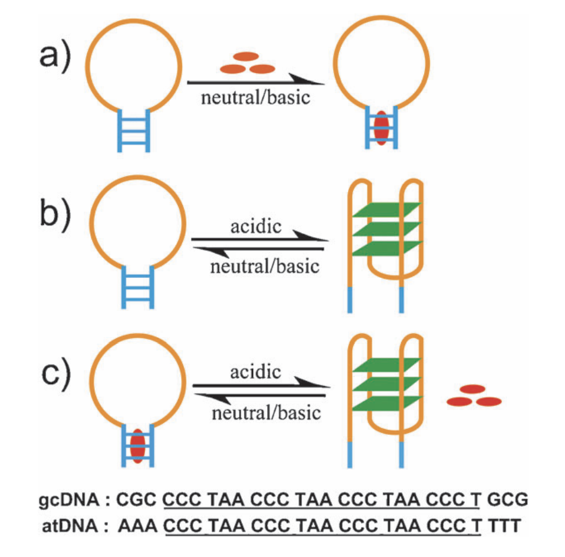

- 方案1：富含胞嘧啶的DNA药物结合和释放装置的方法示意图，该装置能够分解某些形式的Watson–Crick相互作用。带下划线的序列代表富含胞嘧啶的片段，该片段可以在酸性条件下形成i-Motif结构。
  - （a） 中性/碱性条件下发夹结构茎部的药物结合。
  - （b） 随着环境pH值的变化，i-Motif结构的形成和解构。
  - （c） 随着环境pH值的变化，药物结合和释放过程的可逆循环。

相应地设计了28mer的gcDNA寡核苷酸（CGC CCC TAA CCC TAA CCC TAA CCC T GCG）和28mer的atDNA寡核苷酸（AAA CCC TAA CCC TAA CCC TA A CCC T TTT）。在中性/碱性条件下，富含胞嘧啶的gcDNA片段会随机定位，并且两个3碱基末端（GCG-CGC）相互互补，因此28mer的gcDNA形成茎环构象（方案1a）。带正电的抗癌药物阿霉素可以与GCG-CGC双链结合。然而，在酸性条件下，由于胞嘧啶质子化（dC+），富含C的片段预计形成i-Motif结构 10 ，其将破坏部分双链茎部分（GCG-CGC）之间的氢键（方案1b）。因此，带正电荷的DOX将被释放（方案1c）。带正电荷的Hoechst 33258遵循与DOX结合gcDNA相同的方式，不同之处在于Hoechst 332 58结合DNA小凹槽。

为了证明pH在7.0至5.0之间时DNA构象的变化，进行了UV熔融、圆二色性（CD）和聚丙烯酰胺凝胶电泳（PAGE）。图1A和B显示了gcDNA和atDNA在不同pH条件下的UV熔融曲线。在pH 7.0和5.0之间观察到显著差异。在pH 7.0时，紫外线熔融研究表明，gcDNA和atDNA的DNA熔解温度（Tm）分别为22.5°C和15.6°C，然而，在pH 5.0时，gcDNA与atDNA均显示出明确的转变，Tm为48.9°C。这表明两种DNA在pH 5.0时比在pH 7.0时更稳定。CD光谱表明，当pH在10°C下从7.0变化到5.0时，两种DNA都会发生构象变化。图1C和D显示观察到的DNA结构是pH依赖性的。在pH 7.0下，gcDNA在275nm附近具有正带，在246nm附近具有负带，atDNA在275mm附近具有正带，在248nm附近具有负带，表明形成了B型双链体。

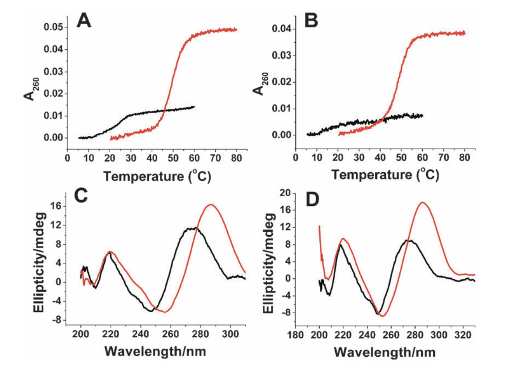

- 图1：DNA在不同pH下的UV熔融和CD光谱变化。
  - （A）gcDNA在pH 7.0（黑线）或pH 5.0（红线）下在cacodylic buffer中的UV熔融曲线。
  - （B）atDNA在pH 7.0（黑线）或pH 5.0（红线）下在cacodylic buffer中的紫外熔融曲线。
  - （C）gcDNA在pH 7.0（黑线）或pH 5.0（红线）的cacodylic buffer中在10℃下的CD光谱。
  - （D）atDNA在pH 7.0（黑线）或pH 5.0（红线）的cacodylic buffer中在10℃下的CD光谱。（1 mM cacodylic acid/sodium cacodylate/100 mM NaCl）。DNA链的浓度为1mM（UV熔融）或2mM（CD光谱）。

根据DNA序列，我们推断gcDNA和atDNA都采用了带B-DNA茎的发夹结构，或者形成了分子间的B-DNA双链体，但这种双链体在我们接下来的凝胶实验中被排除了。在pH 5.0下，观察到gcDNA和atDNA的两个i-MotifDNA特征CD带。11,12 gcDNA的正带蓝移（blueshift）至286nm，负带蓝移到256nm。对于atDNA，正带移动到286nm，负带移动到253nm。这清楚地表明富含C的gcDNA和atDNA都形成i-Motif结构，并且具有分解B-DNA茎或分子间B-DNA双链体的氢键的潜在能力。

通过聚丙烯酰胺凝胶电泳（PAGE）实验，进一步研究4°C下不同pH条件下的构象变化（图2）。使用dT22 和 dT12 DNA作为标记。图2A与图2B的比较清楚地表明，DNA在pH 5.0和pH 7.0下具有不同的电泳迁移率。在pH 7.0下，gcDNA（28mer）和atDNA（28-mer）的迁移速度略快于dT22 （图2A），表明这两种DNA采用紧凑的发夹结构，而不是分子间双链结构（方案1a）。相反，当pH值降低到5.0时，两种DNA的迁移速度比dT22快得多，几乎和dT12一样快。这一观察结果与两种DNA在pH 5.0下形成更紧密的i-Motif结构的假设一致（方案1b）。结果明确地表明，DNA装置可以按照pH条件从而选择的不同构象。然后，我们研究了所设计的DNA装置的可操作性。使用gcDNA–阿霉素和atDNA–Hoechst 33258作为模型系统，我们评估了DNA装置是否可以在受控的情况下可逆地捕获和释放药物分子。荧光滴定法（Fluorescence titration）13  用于测定药物与DNA的结合，其中固定浓度的DOX或Hoechst 33258随DNA浓度的增加而滴定（图S1）。根据滴定，DOX与gcDNA的结合比为3:1，Hoechst 33258与atDNA的结合率为2:1（图S1 B和D）。

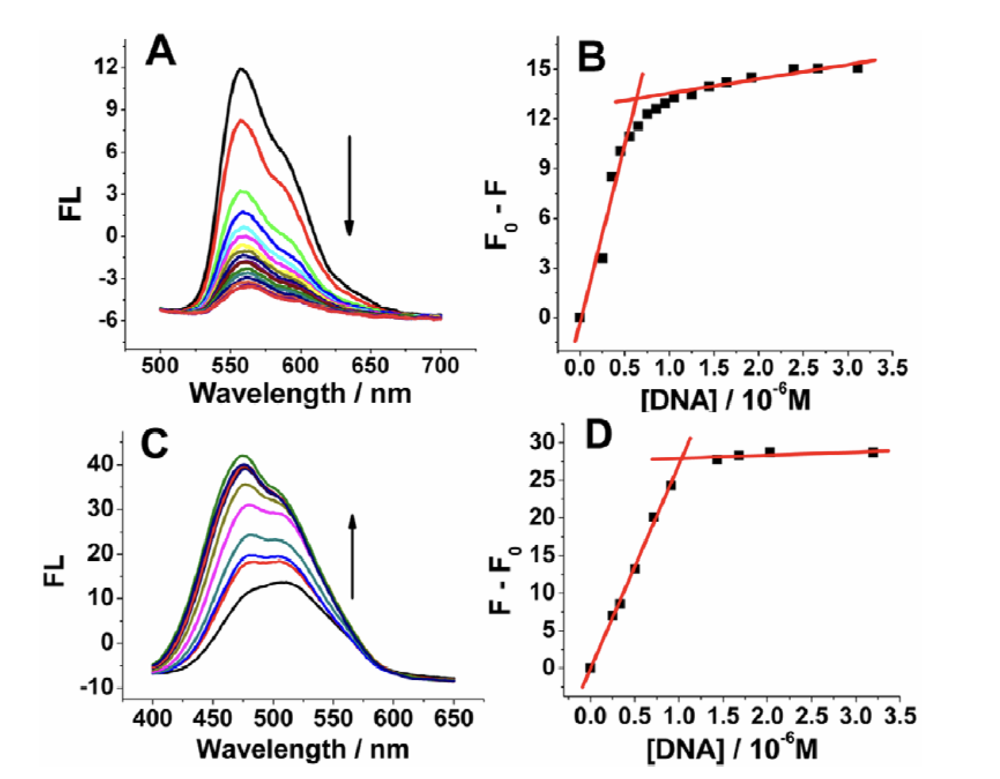

- 图S1：
  - A：在4℃下，用gcDNA在100 mM NaCl、1 mM cacodylic buffer（pH 7.0）中进行阿霉素的荧光滴定。gcDNA的浓度从0μM到3μM不等。λex=480nm，λem=560nm。
  - B：560nm处荧光强度随源自荧光滴定的gcDNA浓度增加而变化。阿霉素浓度为2μM。在0.67μM的gcDNA处观察到断点（[阿霉素]/[gcDNA]的比例为3:1）。
  - C：在4℃下用atDNA在100 mM NaCl、1 mM cacodylic buffer（pH 7.0）中进行Hoechst 33258的荧光滴定。atDNA的浓度从0μM到3μM不等。λex=346，λem=475 nm（有atDNA），λem=525 nm（无atDNA）。
  - D：475 nm处荧光强度随源自荧光滴定的atDNA浓度增加而变化。在1μM atDNA处观察到断点（[hoechst 33258]/[atDNA]的比例为2:1）。Hoechst 33258的浓度为2μM。

表S2总结了计算得到的热力学参数。

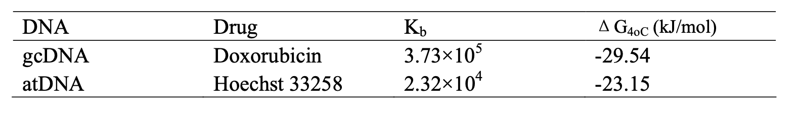

- 表S2：在4℃下，在100 mM NaCl、1 mM cacodylic（pH 7.0）中与药物结合到DNA的热力学参数总结。

荧光滴定数据的非线性最小二乘分析13（详细信息见support information）得出DOX与gcDNA和Hoechst 33258与atDNA的结合常数分别为3.73 * 105 和 2.32 * 104 M-1。我们还使用UV熔融、CD光谱研究了药物在不同pH下与DNA的结合（图S2）和PAGE（图2）。

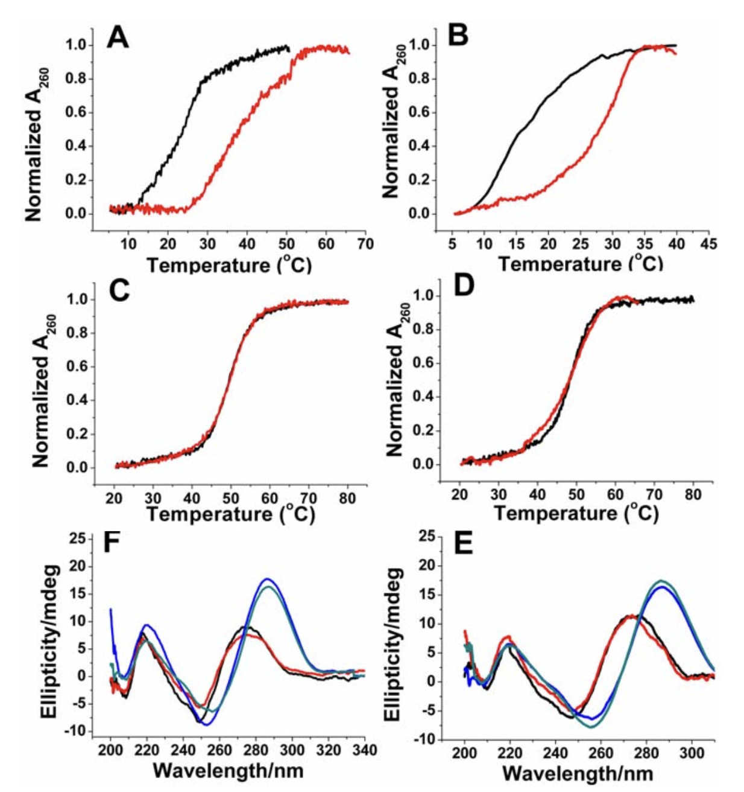

- 图S2：在不同pH（1 mM cacodylic acid/sodium cacodylate/100 mM NaCl）下的DNA UV熔融和CD光谱变化。
  - A：在不存在（黑线）或存在（红线）阿霉素的情况下，pH 7.0时，gcDNA的UV熔融曲线。
  - B：在不存在（黑线）或存在（红线）hoechst 33258的情况下，pH 7.0时，atDNA的UV熔解曲线。
  - C：在不存在（黑线）或存在（红线）阿霉素的情况下，pH 5.0时，gcDNA的UV熔融曲线。
  - D：在不存在（黑线）或存在（红线）hoechst 33258的情况下，pH 5.0时，atDNA的UV熔解曲线。
  - E：不同溶液环境下，阿霉素不存在或存在时，gcDNA的CD光谱。
  - F：在不同溶液环境下，hoechst 33258不存在或存在时，atDNA的CD光谱。
  - DNA链的浓度为1μM（UV熔融）或2μM（CD光谱）。

UV熔融研究表明，在pH 7.0时，DOX可使gcDNA熔融温度（Tm）提高16°C，Hoechst 33258可使atDNA熔融温度提高14°C。显然，DOX和Hoechst 33258都可以在pH 7.0下稳定DNA。然而，在pH 5.0下，带正电荷的DOX或Hoechst 33258都不会增加i-MotifDNA的稳定性（图S2 C和D）。与pH 7.0下单独的DNA相比（图S2 E和F），药物结合几乎不会改变DNA CD光谱；这与PAGE结果一致，即药物结合不会显著影响DNA迁移率（图2）。所有这些结果表明，在pH 7.0下药物结合不会改变DNA构象。

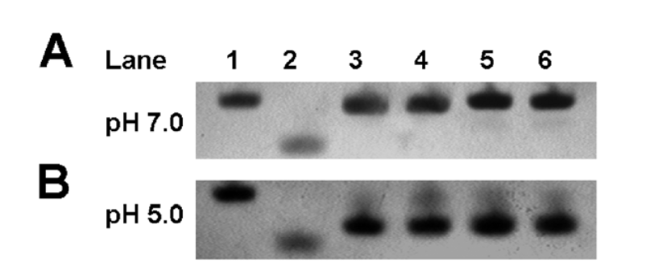

- 图2：不存在/存在阿霉素时的gcDNA和不存在或存在Hoechst 33258时的atDNA的PAGE凝胶电泳分析（15%PAGE）。凝胶在4°C的tris-boric酸缓冲液中运行。
  - (A) at pH 7.0. 
    - Lane 1: dT22; 
    - Lane 2: dT12; 
    - Lane 3: gcDNA; 
    - Lane 4: gcDNA + doxorubicin; 
    - Lane 5: atDNA; 
    - Lane 6: atDNA + Hoechst 33258. 
  - (B) at pH 5.0. 
    - Lane 1: dT22; 
    - Lane 2: dT12; 
    - Lane 3: gcDNA; 
    - Lane 4: gcDNA + doxorubicin; 
    - Lane 5: atDNA; 
    - Lane 6: atDNA + Hoechst 33258.

通过测量pH变化时的药物荧光强度来研究药物结合和释放的可逆性（图3）。当所设计的DNA装置循环操作时，记录（A）560nm处的发射强度、DOX的最大发射波长（在480nm处激发）和（B）475nm处的发射强度、Hoechst 33258的最大发射波长（346nm处的激发）的变化。图S1 A和C显示，在没有DNA的情况下，药物处于具有固有荧光的游离状态；添加DNA后，形成药物-DNA复合物，导致DOX与gcDNA结合的荧光显著降低（图S1 A）4a或Hoechst 33258与atDNA结合的显著增加（图S1 C）8a。有趣的是，在pH变化时，如图3A所示，gcDNA–DOX在560nm处的荧光强度随着pH从7.0变为5.0而增加，当pH从5.0变回7.0时，荧光强度再次降低到初始强度。这些结果表明DOX可以在pH 7.0时与gcDNA结合，然后在pH 5.0时释放。当环境pH值在7.0和5.0之间变化时，药物结合和释放可以连续循环。对于atDNA–Hoechst 33258系统，如图3B所示，475 nm处的荧光强度随着pH从7.0变为5.0而降低，当pH从5.0变回7.0时，荧光强度再次增加到初始强度。这些结果还表明，Hoechst 33258可以在pH 7.0时与atDNA结合，然后在pH 5.0时释放，并且当环境pH值在7.0和5.0之间变化时可以连续循环。多次循环后荧光强度的降低应归因于荧光染料的光漂白（photo bleaching）和溶液的稀释。

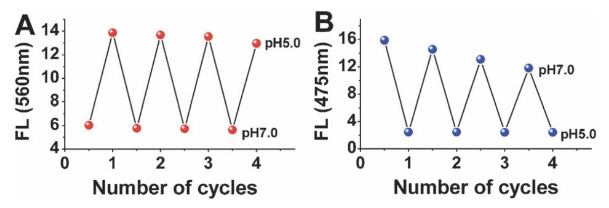

- 图3：通过荧光光谱监测药物结合和释放之间的切换，同时溶液pH值在4°C下的7.0和5.0之间变化。
  - A：480nm激发下，gcdna-阿霉素体系在560nm处的荧光发射强度的变化。
  - B：346 nm激发下，atDNA-Hoechst 33258体系在475 nm处荧光发射强度的变化。

UV熔融结果进一步支持了pH变化时，可逆的药物结合和释放（图S3）。

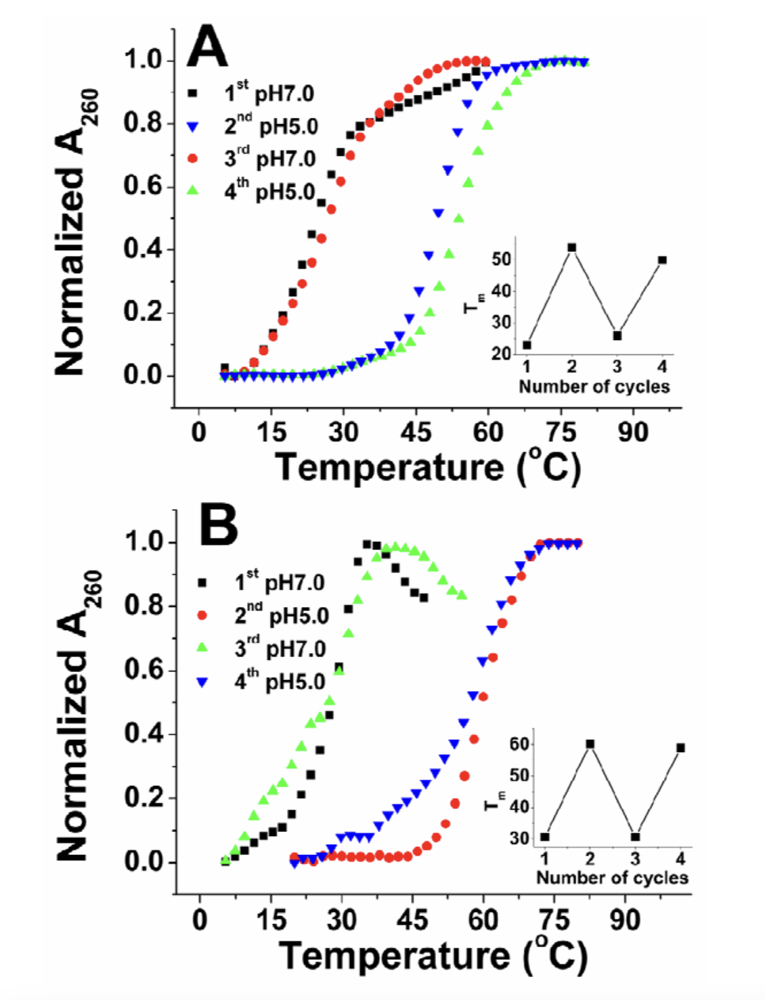

- 图S3：当溶液pH值在5.0和7.0之间振荡时，通过UV熔融监测药物结合和释放之间的切换(1 mM cacodylic acid/sodium cacodylate/100 mM NaCl)。
  - A：当溶液pH值在5.0和7.0之间变化时，gcDNA-阿霉素的UV熔解曲线。
    - 插图：当溶液pH值在5.0和7.0之间变化时，gcDNA-阿霉素系统的Tm的变化。
  - B：当溶液pH值在5.0和7.0之间变化时，atDNA-hoechst 33258的紫外熔解曲线
    - 插图：当溶液pH值在5.0和7.0之间变化时，atDNA-hoechst33258体系的Tm的变化。

### Conclusion

总之，我们构建了一种新型的质子驱动的DNA药物结合和释放装置。它可以通过在环状发夹DNA和i-Motif结构之间切换，从而可逆地结合和释放抗癌药物。这种由pH驱动而不需要外部能源的DNA药物释放装置是坚固的、高度可逆的，并且不会生成额外的双链产物，在系统中发生不想要的副反应。更重要的是，我们的工作证明了基于DNA的纳米机械装置的工作原理与独特构象依赖的药物结合和递送特性的成功结合。这可能有助于设计和构建易于操作、成本效益高、可靠和高效的功能性DNA纳米结构，用于可控的药物结合和释放。

## pH-Programmable DNA Logic Arrays Powered by Modular DNAzyme Libraries

#### 2012_由模块化的DNA酶库提供支持的pH可编程DNA逻辑阵列

大自然可以执行复杂的信息处理电路，例如将多功能干细胞程序化地转化为靶向功能细胞。然而，人造的分子电路无法模仿如此复杂的生物机械。为了实现这些目标，构建可编程模块化组件至关重要，这些组件可以由环境刺激触发，以执行不同的逻辑电路。本研究报道了前所未有的人造的pH-可编程的DNA逻辑阵列，该阵列由Mg2+- and UO22+- 依赖的DNA酶亚基及其底物（DNAzyme subunits and their substrates）的模块化文库构成。通过适当地对DNA计算单元进行模块化设计，实现了各种复杂度的pH-可编程的逻辑阵列，并且阵列可以被擦除、重复使用和/或重新编程。在不久的将来，这种系统可能通过pH响应的细胞功能调节为纳米医疗应用提供作用，或可能用于控制细菌刺激的生物转化。

关键词：DNA，DNA酶，逻辑门，生物计算，现场可编程，pH

## Rational Design of pH-Controlled DNA Strand Displacement

#### 2014_pH控制的DNA链置换的合理设计

实现用生物输入精确调节基于DNA的纳米结构和纳米机器的形成和功能的策略对于充分实现DNA纳米技术的潜力至关重要。在这里，我们展示了一种前所未有的合理方法，通过简单改变溶液的pH值来实现对一类基于DNA结合的重要反应的控制。为此，我们利用了平行的Hoogsteen相互作用的pH依赖性，并且合理地设计了两种基于三链体的链置换策略，它们可以在碱性或酸性pH下被触发和精确调节。由于pH值的变化在健康的和病病态的生物途径中都是一个重要的输入，我们的发现可能对DNA纳米结构的开发有意义，其组装和功能可以在特定生物靶标的存在下触发。

## Role of pH controlled DNA secondary structures in the reversible dispersion/precipitation and separation of metallic and semiconducting single- walled carbon nanotubes

#### 2014_pH控制的DNA二级结构在金属与半导体单壁碳纳米管可逆的分散/沉淀和分离中的作用

单链DNA寡聚物 (dA20, d[(C3TA2)3C3] or dT20) 能够在pH为7的水中通过非共价作用包裹在纳米管表面分散（dispersion）单壁碳纳米管（single-walled carbon nanotubes ，SWNTs）。在较低的pH下，DNA二级结构的改变导致SWNT从分散体中沉淀。在pH 3.5时，dA20的结构从单链变化到A-Motif形式，而在d[(C3TA2)3C3] 的情况下，在pH 5时其从单链变化到i-Motif形式。由于这种结构变化，DNA不再能够使纳米管结合在一起，因此SWNT从其良好分散的状态沉淀下来。然而，当pH恢复到7时，这种情况可能会逆转，此时DNA再次以单链形式松弛。以这种方式，分散和沉淀的过程可以一次又一次地重复。可变温度UV-Vis-NIR和CD光谱研究表明，在pH 7，DNA-SWNT复合物即使在90°C也具有热稳定性。宽频近红外激光照射（Broadband NIR laser irradiation ，1064nm）也证明了DNA-SWNT复合物对于由碳纳米管激发引入的局部加热的稳定性。电泳迁移率变动测定证实了pH 7时DNA- SWNT复合物的稳定形成，以及在酸化时DNA二级结构（A/I-Motif）的形成。ss-DNA与SWNT的相互作用导致纳米管从其组装中剥离（debunding）。从光谱和导电性研究中可以明显看出，半导体SWNT比金属SWNT对DNA的选择性亲和力使两者能够分离。

## Electronic pH switching of DNA triplex reactions

#### 2015_DNA三链体反应的电子pH转换

序列特异的DNA相互作用和反应的电子可逆切换是一种用于编程复杂分子和微观过程的重要操作。虽然四链结构和三链结构在pH 5-7都适用于pH响应，但我们在这里关注的是形成pH敏感的三链结构的DNA序列大家族。这些涉及嘧啶-嘌呤-嘧啶 Motif 中（pyrimidine–purine–pyrimidine ，Y:R:Y）的Hoogsteen和Watson–Crick碱基配对。我们展示了集成到微流控芯片中的、电子控制的局部pH循环，其在这些三链体复合物中诱导着DNA杂交切换。此外，pH切换可用于控制使用二硫键的双链模板三链结构中的快速DNA连接。在使用局部微电极之前，首先用毛细管凝胶电泳（capillary gel electrophoresis）表征由pH诱导的DNA复合物之间的切换。通过浸没在溶液中和固定在表面的醌氢氧化还原系统中的电压偏置的（voltage-biased）金微电极，在适中的pH范围（4-8）实现了稳定的pH循环，并通过SNARF-4F的荧光比例成像（fluorescence ratio imaging）进行监测。基于发夹模板的DNA结构（可逆的三链体到双链体，基于三链体的DNA连接）的转换结果，通过染料-猝灭剂荧光（dye–quencher fluorescence）进行空间监测。将电子控制的pH循环集成到微流控芯片反应器中允许pH的局部模式化和在许多循环中保持恒定的离子强度。

## pH-controlled DNA- and RNA-templated assembly of short oligomers

#### 2015_pH控制的从DNA模板和RNA模板组装的短寡聚物

在人工遗传学领域，开发合成构建块的非酶促自组织对于提供具有扩展功能的生物聚合物和理解益生元过程至关重要。虽然可逆性被认为在早期功能性遗传物质中起着重要作用，但我们之前报道了一种有效的“DNA-模板”连接适当设计的5'端硼酸和3'端核糖核酸半序列。本研究报道了双功能六聚体的无酶的和无活化的“DNA-模板”和“RNA-模板”组装。可逆组装是区域特异性和序列特异性的，并将所得双链体的稳定性与其有缺口的对应物进行了比较。为了进一步理解这一前所未有的过程，我们还研究了一种自动-模板双链体自组装，这是“序列-定义”合成聚合物进化的关键一步。

## pH-controlled assembly of dna tiles

#### 2016_pH控制的DNA Tile的组装

我们展示了一种利用pH触发和精细控制超分子DNA结构组装的策略。控制是通过合理设计的链置换电路实现的，该电路对pH值做出响应并激活下游的DNA Tile 的自组装过程。我们观察到DNA结构在中性/碱性的条件下形成，而自组装过程在酸性条件下受到抑制。本文提出的策略展示了一种模块化方法，用于构建能够在等温条件下处理生化输入和精确控制基于DNA的纳米结构组装的系统。特别地，所提出的架构与能够感测和响应与代谢异常相关的分子标记的复杂DNA装置的开发相关。

## An Extraordinarily Stable DNA Minidumbbell

#### 2017_一种异常稳定的DNA迷你哑铃

迷你哑铃（MDB）是一种新型的天然DNA结构。在中性pH下，两个TTTA或CCTG重复序列可以折叠成高度紧凑的MDB，熔化温度为~22°C。由于相对较低的热力学稳定性，MDB已被认为是导致有效的DNA修复逃逸（ DNA repair escape）并因此重复扩增的结构中间体。在这项研究中，我们发现两个CCTG重复序列也可以形成一个非常稳定的MDB，并且在pH 5.0下，熔化温度为~46°C。这种不寻常的稳定性主要是由两个小沟胞嘧啶残基（minor groove cytosine residues）之间形成的三氢键C+·C错对引起的。由于剧烈的稳定性变化，当pH在5.0和7.0之间切换时，CCTG MDB与其互补序列结合，显示出即时和完全的结构转换，使该系统成为简单有效的pH响应的分子开关。

## Simulative and Experimental Characterization of a pH-Dependent Clamp-like DNA Triple-Helix Nanoswitch

#### 2017_具有pH依赖性的钳形DNA三螺旋纳米开关的模拟和实验表征

在这里，我们结合实验和模拟技术来表征基于平行DNA三螺旋形成的pH响应的开关机制的结构/动力学行为。荧光数据证明了这种结构在pH变化时在两种状态之间可逆切换的能力。模拟pH 5.0和8.0条件，对具有质子化或未质子化胞嘧啶的系统进行两次加速的半微秒MD模拟，突出了Hoogsteen相互作用在稳定系统中的重要性，精细地描述了氢键网络的时间依赖性破坏。尿素展开实验（Urea-unfolding experiments）和MM/GBSA计算一致表明，在pH 5.0时的稳定能是在pH 8.0时观察到的稳定能的2倍。这些结果验证了所设计结构的pH响应行为，并表明模拟方法可以成功地与实验数据相结合，以表征响应性基于DNA的纳米器件。

## 5′-(CGA)*n* sequence-assisted pH-controlled assembly of supramolecular DNA nanostructure

#### 2018_5'-(CGA)n序列辅助的超分子DNA纳米结构的pH响应组装

本文中，含有5'-(CGA)*n*和连续鸟嘌呤的DNA链被用于构建由pH值控制大小的超分子DNA纳米结构。此外，在DNA纳米结构中引入胸腺嘧啶linkers对于保持长尺寸纳米结构的稳定性是必要的。这项工作还展示了一种精确构建DNA纳米结构的方法。

## Reconfigurable DNA Origami Nanocapsule for pH-Controlled Encapsulation and Display of Cargo

#### 2019_用于pH响应的货物封装和陈列的可重构的DNA折纸纳米胶囊

DNA纳米技术为创建具有纳米级精度的定制和精确纳米结构提供了一个工具箱。这些纳米物体通常本质上是静态的，并作为以用户定义的方式组装成各种分子组件的通用模板。除了静态结构之外，DNA纳米结构的固有可编程性还允许设计动态装置，这些装置在被外部刺激触发时可以执行预定任务，如作为药物递送载体，生物环境中特定的物理或化学条件可以触发其货物的陈列或释放。在这里，我们提出了一种DNA折纸纳米胶囊，它可以装载货物，并通过改变周围溶液的pH值来可逆地打开和关闭。此外，可以合理地设计开启/关闭的阈值pH值。我们使用Förster共振能量转移（Förster resonance energy transfer）来表征配备“pH锁存”的纳米胶囊的可逆开关和快速打开。此外，我们展示了在生理相关离子浓度下使用金属纳米颗粒和功能酶作为货物模拟物的胶囊装载、封装和显示有效载荷的全周期。

关键词：DNA纳米技术，DNA折纸，pH控制， Förster 共振能量转移，纳米颗粒，酶，药物递送

## pH-Controlled Detachable DNA Circuitry and Its Application in Resettable Self-Assembly of Spherical Nucleic Acids

#### 2020_pH响应的可拆卸DNA电路及其在球形核酸的可复位自组装中的应用

Toehold介导的链置换反应是动态DNA纳米技术的基本基础，已证明其在编程动态分子系统方面的非凡能力。DNA底物中toehold的程序化激活对于构建具有数字（digital）行为和动态行为复杂的DNA设备是至关重要的。我们通过在传统的“线性底物”的toehold和分支迁移域之间嵌入了一个pH响应的分子间三链体，开发了一种可拆卸的DNA电路。反应速率和可拆卸电路的“开/关”状态可以通过改变pH来调节。类似地，构建了由三个pH响应DNA模块组成的双输入电路。最重要的是，基于分子间三链体结构的DNA电路的高可分离性，构建了球形核酸的可复位自组装系统。这项工作展示了一种动态的DNA装置，该装置可以在恒定温度下重复操作，而不会产生额外的DNA废料。此外，该策略展示了从球形核酸的自组装系统回收废弃球形核酸的例子。我们的策略将为复杂分子系统和可重编程纳米颗粒组装结构的动态调节提供一种简单的方法。

关键词：可分离的DNA电路，分子间三链体，pH响应，可复位的自组装，球形核酸

## A Strong Acid-Induced DNA Hydrogel Based on pH-Reconfigurable A-Motif Duplex

#### 2023_一种基于pH可重构的A-Motif双链的强酸诱导的DNA水凝胶

在低于腺嘌呤的pKa（3.5）的pH值下，富含腺嘌呤的序列（A链）由于A链的质子化而形成独特的平行A-Motif双链。在pH高于3.5时，腺嘌呤的去质子化导致A-Motif双链溶解为A-单链。这种pH-可重构的A-Motif双链体已被开发为一种新型的pH响应性DNA水凝胶，称为A-水凝胶。水凝胶状态在pH 1.2下通过A-Motif双链桥接单元（A-motif duplex bridging units）实现，这些单元通过反向Hoogsteen相互作用和静电吸引相交联。在pH 4.3时，由于去质子化诱导的A-Motif双链体的分离，触发水凝胶到溶液的转变。 A-水凝胶系统通过使系统经历pH 1.2至4.3之间的循环变化而经历可逆的水凝胶-溶液转变。一种消炎药，柳氮磺胺吡啶（sulfasalazine ，SSZ），被插入A-Motif双链体并装载到A-水凝胶中。成功地证明了其从A-水凝胶中的pH响应释放。强酸诱导的A-水凝胶可以填补其他弱酸响应DNA水凝胶所不能填补的空白，如在恶劣的胃环境中保护口服药物免受强酸(pH ~ 1.2)和消化酶的侵害。

## pH-Controlled Resettable Modular DNA Strand-Displacement Circuits

#### 2023_pH响应的可复位的模块化DNA链置换电路

在动态DNA纳米技术领域，利用Toehold介导的链置换( TMSD )这一基础工具，已经构建了具有多种功能的复杂动态分子系统。然而，由于难以建立动力学有利的途径来反向地实现重置反应，因此缺乏简单的方法来重置这些基于TMSD的动态系统。在这里，我们开发了一种简单的质子驱动策略，通过将一个pH响应的 CG-C+ 三链体和一个 i-motif DNA整合到传统的DNA底物中，实现了模块化DNA电路的完全重置。pH编程的策略允许模块化的DNA元件特异性地结合与解离，以促进正向与反向的TMSD反应，从而使模块化的DNA电路能够在恒定的温度下重复操作，而不会产生任何DNA废品。利用这种易于处理的方法，我们进一步构建了两个用于逻辑计算的可重置DNA逻辑门和两个具有良好的信号转导性能和放大性能的可重置催化DNA系统。

## Reconfigurable pH-Responsive DNA Origami Lattices

#### 2023_可重构的pH响应的DNA折纸网格

DNA纳米技术能够直接制造用户定义的纳米级精确模板，用于不同用途。到目前为止，这些DNA组装大多是静态的，但动态结构越来越多地出现在人们的视野中。DNA的可编程性不仅允许对DNA对象的形状进行编码，并且也同样用于定义动态结构的作用机制和刺激响应的类型。然而，DNA纳米结构的这些“机器人”特征通常只适用于小型、离散和类似设备的物体，而不是集体行为的高阶系统。在这里，我们展示了基于大规模、二维（2D）和pH响应的DNA折纸晶格如何在云母上组装成两种不同的配置（“打开”和“关闭”状态），并在周围溶液的pH变化时进一步从一种状态切换到另一种不同的状态。对这两种配置的控制是通过为形成晶格的DNA折纸单元的臂配备“pH锁存器（pH-latches）”来实现的，该“pH锁存器”在低pH下形成Hoogsteen三链体。简而言之，我们展示了对 DNA折纸单元在表面上的附着力和流动性的静电控制，这种静电控制可用于借助定向聚合的大型晶格的形成和整个晶格的构象转换。为了进一步强调该方法的可行性，我们还证明了pH响应二维金纳米粒子晶格的形成。我们相信这项工作可以将纳米级精确的DNA折纸模板和具有刺激诱导动力学的高阶大规模系统连接起来。

关键词：DNA纳米技术、DNA折纸、金属纳米颗粒、DNA三链体、pH控制、分层自组装

## Triple-Stranded DNA As a Structural Element in DNA Origami

#### 2023_三链DNA作为DNA折纸中的结构元素

DNA折纸分子自组装为制备任意三维纳米结构提供了一条有吸引力的途径。在DNA折纸中，B型双螺旋DNA结构域（dsDNA）通常与共价的磷酸二酯键链（covalent phosphodiester strand ）交叉连接，以构建三维物体。为了扩大DNA折纸中结构Motif的范围，我们在这里将杂交的双链体-三链体DNAMotif描述为DNA折纸的pH依赖性构建块。我们研究了在多层的DNA折纸物体中结合形成寡核苷酸的三链体和非经典的双链体-三链体交叉的设计规则。我们使用单粒子冷冻电子显微镜（ single-particle cryoelectron microscopy）来阐明三链体结构域和双链体-三链体交叉的结构基础。我们发现，双链体-三链体交叉可以补充和完全取代DNA折纸物体中的典型双链体-双链体交叉，例如，其可能可以增加交叉密度以获得更大的刚性和减少的螺旋间距，并在传统交叉可能不可取的位置建立连接。我们还展示了pH诱导的DNA折纸物体的形成，该物体完全通过三链介导的链交叉来稳定。

关键词：DNA折纸、DNA三链体、冷冻电镜、pH切换、纳米器件
