Rational design of aptamer switches with programmable pH response

可编程的pH响应的适体开关的合理设计

### Abstract

对pH敏感反应的适体开关可以增强对分子设备的控制，提高其诊断效果和治疗效果。先前的设计已经将pH敏感的DNA motifs 插入适体序列中。不幸的是，它们的性能受到 motifs 固有的pH响应的限制，无法在任意pH范围内进行调节。在这里，我们提出了一种方法，这种方法能在酸性、中性或碱性条件下，将几乎任何适体转化为具有pH选择性结合特性的分子开关。我们的设计插入了两个正交的基序，它们可以并行操作以调节pH敏感性，而不会改变适体序列本身。通过单一的ATP适体，我们在不同的条件下设计了pH响应的靶标结合，实现了高达1000倍的pH诱导的亲和力选择性。重要的是，我们展示了严格调控的适配体的设计，这些适配体仅在较窄的pH范围内具有很强的靶标亲和力。我们的方法为将pH响应性集成到分子器件中提供了一种高度通用的策略。

### Introduction

生理的pH条件是通过细胞和组织内严格的稳态控制来维持的，pH的局部变化在许多重要的生物过程中起着关键作用。1,2例如，在癌症中，代谢变化导致细胞内和细胞外pH失调，为癌症细胞的生存、增殖和转移创造了有利条件。3 因此，人们对工程分子系统（engineering molecular systems）非常感兴趣，这些系统对pH的微小变化表现出程序化行为。这种机制可以实现对分子装置的精确控制，用于广泛的临床应用。

For example, one can couple a cell-specific targeting moiety to a pH-sensitive cargo transport domain, where the destination tissue exhibits local variations in pH conditions that selectively induce the release of a molecular payload for imaging or therapy4–6. 

例如，可以将细胞特异性靶向部分偶联到pH敏感的货物运输结构域，其中目的组织在pH条件下表现出局部变化，选择性地诱导分子有效载荷的释放用于成像或治疗。4–6

In particular, a number of studies have demonstrated the potential utility of DNA aptamer-based molecular “switches” that undergo a large conformational rearrangement in response to ligand binding or changes in environmental pH7–9, enabling quantitative in situ imaging10,11, programmed tumor targeting12, and rapid clinical diagnostics13.

However, it remains challenging to generate high-specificity aptamer switches that selectively undergo a strong change in target affinity under specific pH conditions. Most of such efforts to date have entailed the rational design of molecules that couple an existing aptamer to a known pH-responsive domain based on prior knowledge of the aptamer structure. For example, the Ricci group modified a cocaine-binding aptamer with an intramolecular DNA triplex that directly competes with hairpin formation in the native aptamer structure. The resulting aptamer bound cocaine with 100- fold weaker affinity at pH 4 than at pH 714. The DeRosa group used noncanonical base pairing between guanine and protonated adenine to disrupt G-quadruplex formation in a thrombin apta- mer, enabling reversible pH-mediated binding of thrombin at pH 7 followed by release at pH 515. Most recently, the Tan group employed a cytosine-rich i-motif structure to preferentially stabilize folding of a tyrosine kinase-7 aptamer in acidic conditions, demonstrating selective binding to the aptamer's membrane-bound target at low pH16. However, all these approaches entail the use of defined DNA motifs that alter the aptamer binding structure under very particular pH conditions. The resulting aptamer switches cannot readily be modified to work outside this intrinsic pH- response range or be tuned to adjust the sensitivity of their response, greatly limiting their utility. Furthermore, these approa- ches are not necessarily generalizable across aptamers, and require a new design process for each novel construct.

We describe here a general strategy that should make it pos- sible to convert virtually any aptamer into a pH-responsive switch that can be tuned to selectively undergo a dramatic shift in affi- nity under acidic, neutral, or alkaline conditions. We achieve this pH specificity by introducing two orthogonal modes of control that can be manipulated in parallel to tune sensitivity to different pH conditions without altering the core sequence of the aptamer itself. Our approach builds on the intramolecular strand dis- placement aptamer design, in which an aptamer is covalently linked to a partially complementary displacement strand (DS) through an inert DNA linker7. We indirectly manipulate aptamer pH dependence by inserting pH-responsive DNA motifs into either the linker or the DS. In comparison to previously described motif-based approaches, this design minimizes sequence con- straints and enables broader tuning of our design. Using this strategy, we have generated an array of pH-responsive strand displacement (PSD) aptamer switches, all based on the same core aptamer sequence, that have been engineered to preferentially bind or release their molecular target under various pH condi- tions. Our most responsive designs exhibit up to a 1000-fold change in affinity over the narrow range between pH 5.5 and pH 7, greatly exceeding the sensitivity of previously reported pH- responsive aptamer switch designs. In addition to generating switches that are broadly responsive to low or high pH, we also describe the design of a PSD switch, the affinity of which, unlike existing pH-responsive aptamers, undergoes a significant enhancement within a narrow pH “window.” To our knowledge, this represents the first description of an engineering strategy for producing such constructs. Since the aptamer sequence itself is not being manipulated in these constructs, our design strategy is broadly applicable to a wide range of aptamers, allowing for the ready integration of pH response into a variety of aptamer-based molecular devices.

### Result

#### A linker-based design for binding at low pH. 

Our PSD constructs couple an existing aptamer to a complementary DS domain via an internal linker domain. By manipulating the sequences of these two domains, we can introduce two non-interfering methods for controlling the response to different pH conditions without altering the aptamer sequence itself. Initially, we focused on manipulations that confer selective binding under acidic conditions. We theorized that by inserting an intramolecular triplex motif17,18 into the linker domain (Fig. 1a), we could cause the aptamer to selectively bind only at low pH. 

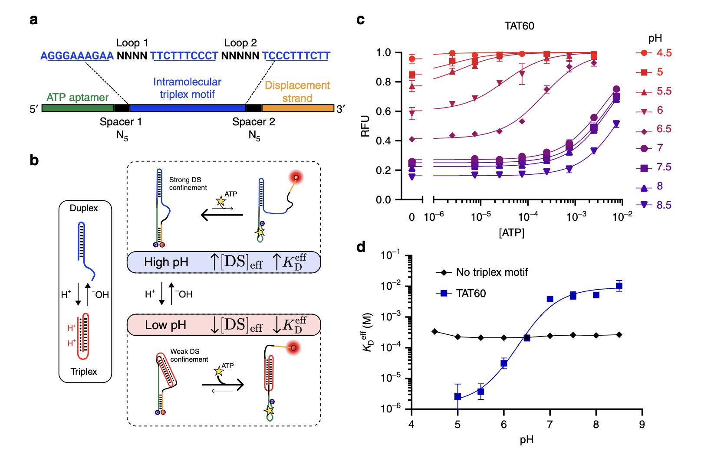

- 图1：Design of an ATP aptamer for selective binding at low pH. a An intramolecular triplex motif is inserted into the linker domain, which connects the ATP aptamer and displacement strand (DS). The unconstrained loop and spacer sequences are optimized to minimize interference with the aptamer secondary structure. The construct shown here is TAT60, reflecting the 60% TAT composition of the triplex motif. b A simplified model for pH-dependent binding. pH dependence is achieved via conformational changes in the triplex motif, which increase the effective DS concentration near the aptamer ([DS]eff) at high pH, thereby inhibiting ATP binding and fluorescent signaling. A complete three-state model of the pH-dependent binding mechanism is given in Supplementary Fig. 3. c ATP binding curves for the TAT60 construct show a strongly pH-dependent shift in affinity. d A standard ATP intramolecular strand displacement aptamer construct with no triplex motif exhibits no pH sensitivity, whereas insertion of the triplex-based linker induces dramatic pH sensitivity. Data points and error bars in c show the means and standard deviations of n = 3 independent experiments. Data points and error bars in d show the best fit values and standard deviations extracted from Langmuir isotherm fits to binding curve data from n = 3 independent experiments using nonlinear least squares fitting. Source data are provided as a Source Data file.

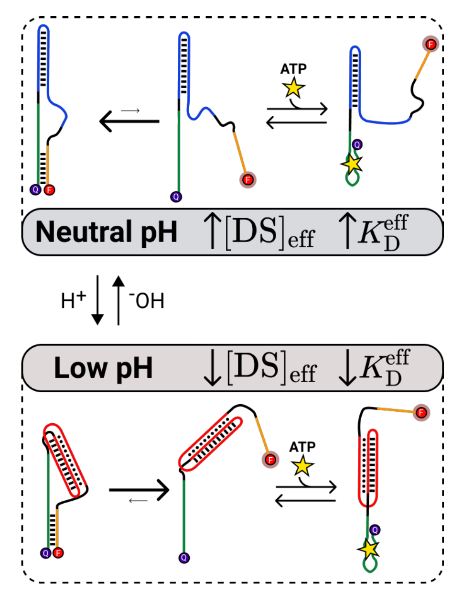

- 图S3：Three-state binding model for triplex constructs. The PSD construct mechanism relies upon pH-dependent shifts in the DS hybridization equilibrium to shift the construct's overall KDeff. Selective binding at low pHl is achieved through pHl-dependent conformational changes in the triplex motif, which lead to changes in ［DS]eff-inhibiting Ds hybridization at low pH, and enhancing it at neutral pH. Equilibrium is shifted toward the hybridized state at neutral pH （top） and toward the unbound state at low pH （bottom）， which selectively increases target affinity under the latter condition.

At neutral pH, we predicted that the mostly unprotonated linker would adopt a duplexed structure through Watson–Crick base pairing, positioning the aptamer and DS in proximity to each other at either end of the stem-loop (Fig. 1b, top). The closely confined DS (high [DS]eff) would then compete strongly with target binding, leading to a low effective affinity for the aptamer switch (high KDeff ). At lower pH, increasing protonation of cytosine base favors Hoogsteen base pairing within CGC triplets in the linker, stabilizing intramolecular triplex formation (Fig. 1b, bottom). In this state, the DS and aptamer should be positioned at either end of the rigid triplex, greatly inhibiting their interaction (low [DS]eff). This would decrease binding competition, leading to higher effective affinity of the aptamer switch (low KDeff). Such a construct should therefore prove suitable for selectively binding ligands in acidic conditions, such as solid tumor microenviron- ments or within the endosomal pathway, allowing targeted delivery of drugs or imaging contrast agents.

To test this design strategy, we used an ATP aptamer19 as a model system. We designed a variety of PSD constructs in which the ATP aptamer was coupled to a seven-nucleotide （nt） DS by a linker domain containing different intramolecular triplex motif designs. A fluorophore and quencher, positioned at the 3' and 5' ends of the construct, respectively, enabled fluorescence-based quantification of DS hybridization as a proxy for target binding. In our initial construct, TAT60, the linker consisted of a triplex containing six TAT triplets and four CGC triplets as well as internal loops of four and five nt, with five-nt spacers joining the linker to both the aptamer and DS （Fig. 1a）. We minimized undesired interactions between the native aptamer and the inserted motif by optimizing the unconstrained loop and spacer sequences （see “Methods" for design details）20.

To evaluate the pH dependence of target binding for TAT60, we measured the fluorescence change associated with increasing concentrations of ATP over a physiological and near- physiological pH range (4.5–8.5). As predicted, we observed strongly pH-dependent shifts in the ATP binding curve associated with insertion of the triplex motif, with KDeff decreasing more than 1000-fold in moving from pH 8.5 (KDeff = 10 mM, 95% CI [6.7–19 mM]) to pH 5 (KDeff = 2.6 μM, 95% CI [0.53–11 μM]). Increases in affinity are coupled to increased background signal at low pH, matching the predicted effects of inhibited DS hybridization (Fig. 1c, Supplementary Fig. 1). 

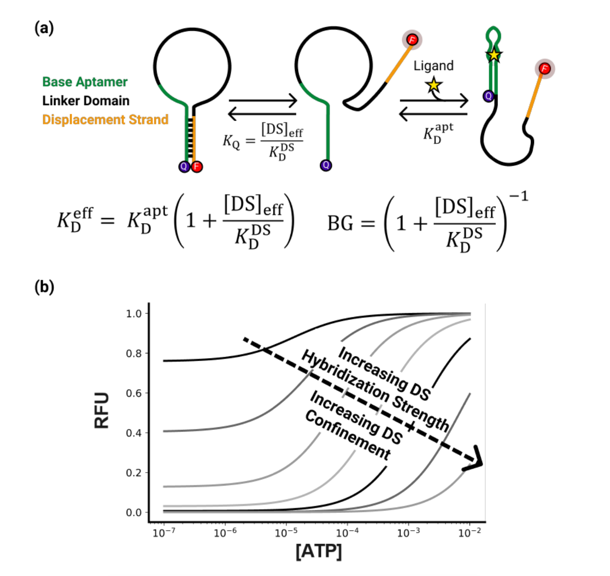

- 图S1：Three-state population-shift aptamer binding model and predicted effects of construct design on binding curves. （a） The three-state population shift model underlies the PSD construct mechanism, where hybridization of the displacement strand （DS） with equilibrium constant KQ inhibits aptamer binding. Target binding shifts the equilibrium away from the DS hybridized state, leading to increased fluorescence and allowing for optical quantification of target binding. The construct's effective binding affinity KDeff  the magnitude of background signal both depend on the DS effective concentration， ［DS]eff, and hybridization strength, KDDS.1 （b） Effects of varying the DS effective concentration or hybridization strength on the predicted binding curves from the three-state model.

The construct showed especially high sensitivity to pH changes in the physiologically relevant range, as lowering the pH from 7 to 6 produced a 100-fold increase in affinity, with KDeff  = 3.9 mM at D pH 7 (95% CI [3.2–4.8mM]) and KDeff  =31μM at pH 6 (95% CI [19–53 μM]) (Fig. 1d). In contrast, a construct lacking the triplex motif showed no meaningful pH sensitivity, highlighting the effectiveness of our design.

We were able to widely vary the composition of TAT or CGC triplets in the linker without impacting the sequence or secondary structure of the aptamer itself, and this, in turn, allowed us to fine-tune the strength and effective range of the construct’s pH dependence. Previously, the Ricci group showed that they could tune the pH range of the duplex-to-triplex transition by altering intramolecular triplex sequence composition, with increased TAT content shifting the transition to higher pH 21. We exploited a similar strategy, designing a range of constructs with triplex TAT content varying from 50 to 80% to modulate both the dynamic range of pH sensitivity and the magnitude of the pH-dependent affinity change (Fig. 2a). 

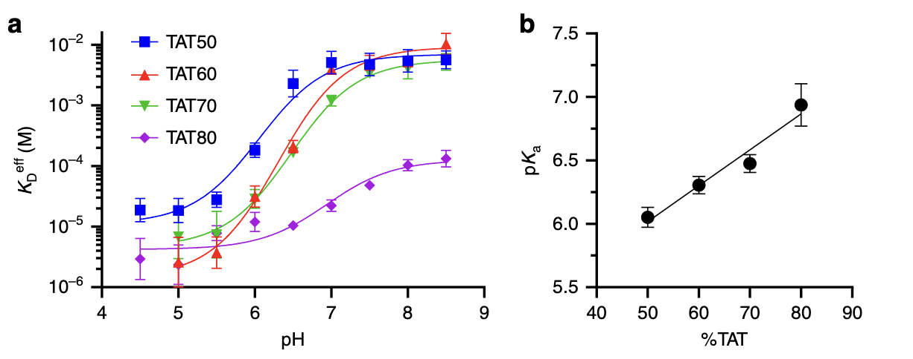

- 图2：pH response tuning through triplex base composition. a Constructs with varying TAT triplet compositions produce a range of pH dependencies, achieving selective binding at low pH but with varying magnitude of response and pH transition midpoint (pKa). b Increasing the TAT content of the triplex motif predictably shifts the pKa of the switch toward more neutral pH. Data points and error bars in a and b show the best fit values and standard deviations extracted from fits to binding curve data from n = 3 independent experiments (data given in Supplementary Fig. 4) using nonlinear least squares fitting. Source data are provided as a Source Data file.

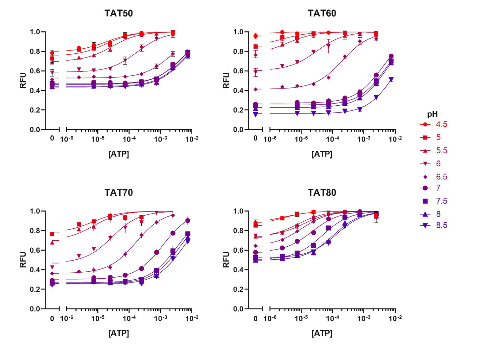

- 图S4：Normalized pH-dependent binding curves for all triplex constructs. Plots show normalized PSD construct fluorescence vs. ATP concentration at a range of solution pH values. The normalization procedure is given in Methods. Data points and error bars in show the means and standard deviations of n=3 independent experiments. Source data are provided as a Source Data file.

We observed strong pH dependence in all constructs and noted that increasing TAT composition shifted the effective range of the pH-driven transition from acidic to more neutral pH. We found that the transition midpoint, pKa, could be shifted by almost 1 full pH unit by increasing the triplex TAT content from 50% (pKa = 6.1, 95% CI [5.9–6.2]) to 80% (pKa = 6.9, 95% CI [6.5–7.4]) (Fig. 2b).To confirm this observation, we measured the pKa of triplex folding in the absence of ATP and observed similar trends of sequence- dependent tuning (Supplementary Fig. 2).

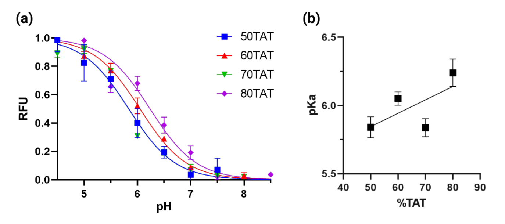

- 图S2：pH Titrations of triplex sequences in the absence of ligand. （a） Foldinginduced fluorescence of constructs with varying TAT triplet compositions at range of pH values for ［ATP］ = 0 shows. （b） Increasing the TAT content of the triplex motif predictably shifts the pKa of the switch toward more neutral pH. Analysis of data in （a） is described in Supplementary Methods. Data points and error bars in （a） show the means and standard deviations of n=3 independent cxperiments. Data points and error bars in （b） show the best fit values and standard deviations extracted from fits to binding curve data from n=3 independent experiments using nonlinear least squares fitting. Source data are provided as a Source Data file.

Notably, the shift in pKa induced by a single TAT/CGC substitution within the triplex motif appears to be smaller for our constructs than previously reported values from standalone intramolecular triplex motifs where similar sequence alterations shifted the transition pH from ~6.5 to ~8.521. This smaller per-substitution shift in pKa should offer finer-grained control over the constructʼs pH response.

It should also be noted that in addition to decreasing the pH transition midpoint, replacing TAT triplets with protonation- dependent CGC triplets increases the pH dependence of triplex stability, thereby increasing the magnitude of the pH response22,23. For example, a triplex motif with 20% CGC content produces a ~42-fold difference in binding affinity between pH 5 and 8 (Fig. 2a, TAT80). By increasing the CGC content to 30% or 40%, we were able to dramatically increase the pH-dependent affinity change over the same range to ~600- and ~2000-fold, respectively (Fig. 2a, TAT70 and TAT60). This tunability allows for the design of aptamer switches that can respond in a finely controlled manner to a broad range of pH conditions.

#### A DS-based design for binding at high pH. 

We hypothesized that it should be feasible to apply a similar engineering strategy to develop DNA switches that preferentially exhibit high target affinity at neutral or alkaline pH. Such switches could be designed to bind strongly to a specific ligand at neutral pH, and to release this molecular cargo only upon entering the relatively acidic conditions found in endosomes or tumor microenvironments. In contrast to the linker-based modification we used to induce low pH binding, we established a distinct and orthogonal control mechanism in which we engineered the DS sequence to achieve selective binding at high pH (Fig. 3a).

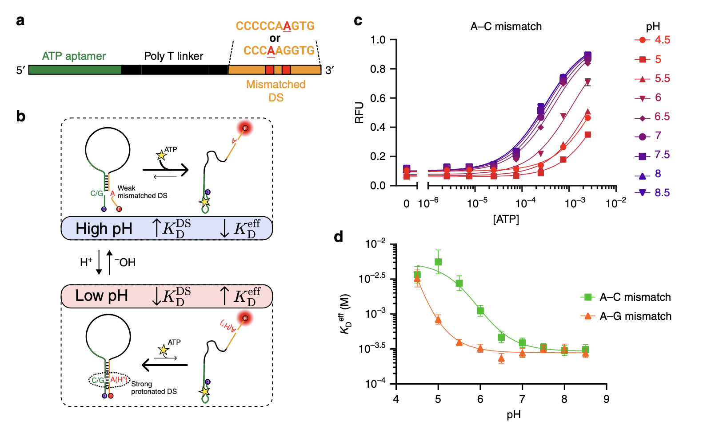

- 图3：Rational design of a high pH-specific ATP aptamer. a Preferential binding at neutral or alkaline pH is achieved by introducing an A–C or A–G mismatch into the DS sequence. b A simplified model for selective binding at higher pH. Mismatch protonation at acidic pH strengthens DS hybridization, decreasing the aptamer’s effective affinity. A complete three-state model of the binding mechanism is given in Supplementary Fig. 5. c ATP binding curves for the A–C mismatch construct show increasing binding affinity at more alkaline pH. d Both A–C and A–G mismatches can be inserted to achieve stronger binding at neutral or alkaline pH than at acidic pH. Data points and error bars in c show the means and standard deviations of n = 3 independent experiments. Data points and error bars in d show the best fit values and standard deviations extracted from Langmuir isotherm fits to binding curve data from n = 3 independent experiments (data given in Supplementary Fig. 6) using nonlinear least squares fitting. Source data are provided as a Source Data file.

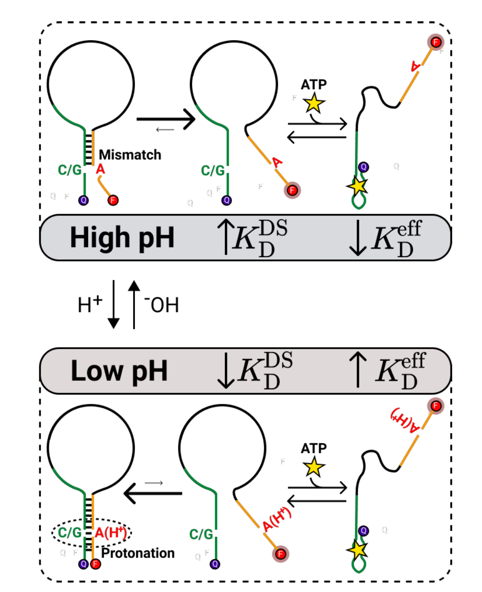

- 图S5：Three-state binding model for DS mismatch constructs. High-pHselective binding is achieved through pH-dependent changes in DS hybridization strength due to the formation of protonated A-C or A-G mismatches. At high pH （top）， the inserted mismatch remains unprotonated and does not bond, leading to weak DS hybridization （high KDDS） and shifting equilibrium towards the unbound state. Upon protonation at acidic pH （bottom）， DS hybridization is strengthened （decreased KDDS） by formation of either an A(H+)-C wobble base pair or an A(H+)-G Hoogsteen base pair, which shifts equilibrium towards the hybridized state.

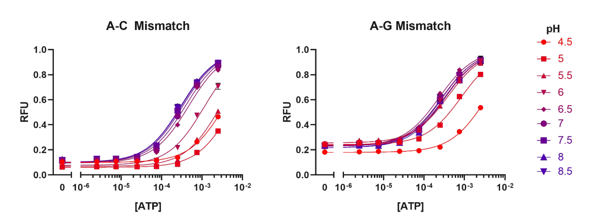

- 图S6：Normalized pH-dependent binding curves for all DS mismatch constructs. Plots show normalized PSD construct fluorescence vs. ATP concentration at a range of pH values. The normalization procedure is given in Methods. Data points and error bars in show the means and standard deviations of n=3 independent experiments. Source data are provided as a Source Data file.

Our group has previously demonstrated that by inserting mismatches within the DS of an intramolecular strand-displacement-based molecular switch, we could decrease DS competitive binding strength（KDDS）and thereby increase the construct's affnity by over 100-fold24 .While most mismatched bases have negligible interaction strength， certain pH-responsive DNA motifs exploit either A-C or A-G mismatches, which exhibit pH-dependent changes in non-canonical base-pairing strength. Here, protonation of adenine at low pH enables the formation of a second hydrogen bond with either cytosine or guanine, promoting hybridization between these mismatched bases through either an A(H+)-C wobble or an A(H+)-G Hoogsteen base pair25,26. We hypothesized that strategic insertion of either A-G or A-C mismatches within the DS would lead to stronger hybridization （KDDS） at low pH compared with high pH, thereby selectively increasing the apta-mer's ATP affinity at higher pH （Fig. 3b）.

We designed two PSD constructs with a non-pH-responsive poly-T linker and varied their DS sequences to include either an A–C or an A–G mismatch. To maximize the pH-response effect, we inserted the mismatch near the middle of the DS, placing the A–C or A–G mismatch four or six nt from the 3′ end, respectively (Fig. 3a).Both constructs showed pH-dependent ATP binding with higher affinity under more alkaline pH conditions, matching our predictions for the effect of increasing the DS hybridization strength (Fig. 3c, Supplementary Fig. 1). A single pH-dependent A–C mismatch within the DS yielded a ~19-fold change in affinity, with the KDeff increasing from 0.30 mM at pH 8 (95% CI [0.25–0.36 mM]) to 5.6 mM at pH 5 (95% CI [3.7–9.9 mM]) (Fig. 3d) and a transition midpoint of pKa = 5.9 (95% CI [5.8–6.1]).  A single A-G mismatch achieved similar pH sensitivity, with an approximately tenfold difference in affnity between KDeff  = 0.32 mM at pH 7.5 （95% CI ［0.27-0.37 mM]） and KDeff  =3.2 mM at pH 4.5 （95% CI ［2.4-4.7 mM]）with pKa <5. The more acidic transition midpoint pli of these constructs makes them potentially suitable for targeting the endosomelysosome pathway27. The freedom to utilize either A-C or A-G mismatches to induce pH dependence greatly increases the generality of this method. Because these mismatches can be inserted at any base within the DS that base-pairs with an A, C, or G base within the parent aptamer, our approach is compatible with almost any aptamer sequence.

#### Design for selective binding within a narrow pH window.

Since the two tuning strategies described above are non-interfering— with one achieved through linker modification and the other achieved through DS modification—we reasoned that they could be applied in tandem to achieve even greater control over the aptamer pH response.To investigate this capability, we designed a construct that we predicted would exhibit high affinity within only a narrow window of pH range, with greatly reduced binding at both higher and lower pH. Our design integrates both an intramolecular triplex sequence within the linker domain (TAT80) and an A–C mismatch four nt from the 3′ end of the construct (Fig. 4a). 

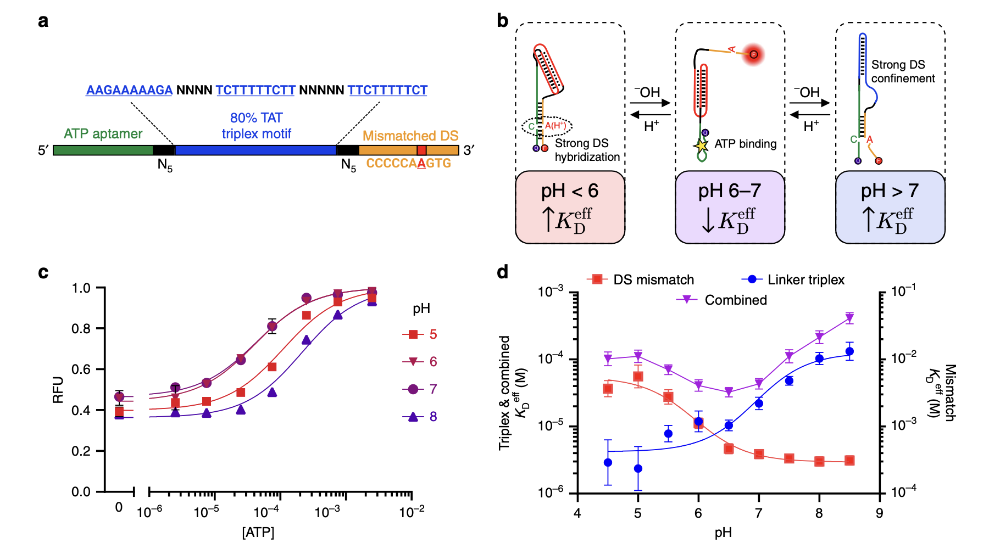

- 图4：PSD design for selective binding over a narrow pH window. a We designed a construct that incorporated both an intramolecular triplex in the linker domain and an A–C mismatch in the displacement strand. b Complex pH dependence is achieved through a three-state system, where binding is inhibited by strong DS hybridization at low pH or strong DS confinement at high pH, with a small window between these extremes where binding affinity is high. c ATP binding curves for the combined construct show the highest affinity at pH 6–7, with lower affinity at both high and low pH. d The pH dependence of affinity for this construct (KDeff plotted on left axis) reflects contributions from both the binding inhibition of the linker modification-based TAT80 construct at high pH (left axis) and the binding inhibition of the DS modification-based A–C mismatch construct at low pH (right axis). Data points and error bars in c show the means and standard deviations of n = 3 independent experiments. Data points and error bars in d show the best fit values and standard deviations extracted from Langmuir isotherm fits to binding curve data from n = 3 independent experiments (data given in Supplementary Fig. 7) using nonlinear least squares fitting. Source data are provided as a Source Data file.

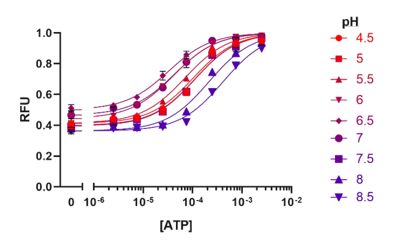

- 图S7：Normalized pH-dependent binding curves for a construct combining triplex and mismatch control elements. The tested construct incorporates both the TAT80 linker and an A-C mismatch within the displacement strand. The plot shows normalized construct fluorescence vs. ATP concentration at a range of pH values. The normalization procedure is given in Methods. Data points and error bars in show the means and standard deviations of n=3 independent experiments. Source data are provided as a Source Data file.

These two modifications contribute opposite pH dependencies, but by carefully selecting their pH transition midpoints, we can introduce three-state pH dependence (Fig. 4b). We selected a linker TAT composition that yields a transition midpoint pH higher than that of the A–C-mismatched DS. At high pH, above the transition midpoint of both pH- dependent modifications, the linker forms a duplex that confines the mismatched DS near the aptamer, which leads to low target affinity. Within the narrow range below the linker transition pH but above the DS transition pH, the combined effect of triplex formation and weak DS hybridization decrease binding compe- tition, enabling aptamer folding and high affinity target binding. Finally, as the pH is further decreased below the point of DS transition and the A–C mismatch becomes protonated, DS hybridization is strengthened, inhibiting aptamer folding and favoring release of bound molecular cargo. We combined the TAT80 linker and the A–C mismatch because their individual effects showed a similar magnitude of pH-dependent affinity change over the relevant pH range of 5–8, with a ~19-fold change for the DS modification and a ~42-fold change for the linker modification.

As anticipated, the resulting construct achieves near-native aptamer binding affinity only at the physiological pH range of 6-7 （KDeff =32 uM at pH 6.5, 95% CI ［27-39 uM]） with reduced affinity both at higher pH （KDeff  =410 uM at pH 8.5, 95%CI ［330-510 uM]）or lower pH （KDeff  = 110 uM at pH 5, 95%CI ［87-140 uM］） （Fig. 4c）. Importantly, the individual pH dependencies of the linker and DS modifications closely predict the overall pH dependence of the combined construct at either pH extreme, indicating that it should generally be straightforward to design such constructs based on the measured behavior of either modification alone （Fig. 4d）.

### Disscussion

The ability to target medically important physiological environ- ments using pH-responsive molecular switches could greatly improve specificity in diagnostic and therapeutic applications—for example, small variations in pH are key characteristics of the endosomal pathway and of cancerous tissue. However, the use of pH as a trigger for aptamer-based switches has been held back by the inherent challenge of engineering pH-responsive aptamers that can be tuned for optimal performance in a given physiological environment. Our PSD design allows us to rationally design pH- responsive molecular switches based on virtually any existing aptamer. Unlike previously described strategies, we impose minimal constraints on the pH-sensitive motifs within the PSD design, enabling rational fine tuning of both the magnitude of the pH response and the functional pH range of the switch. Our most sensitive constructs exhibit a pH response that greatly exceeds that of previously described aptamer switch designs, with up to a 1000- fold change in affinity between pH conditions. Our approach allows us to rapidly design constructs with minimal iteration and to pre- dictably combine pH-responsive elements of individual switch designs in order to achieve more complex behavior, including a selective response to a narrowly defined window of pH conditions.

There are a number of promising potential applications for both low and high pH-specific binding that will benefit greatly from the ability to generate new target-specific molecular switches with tuned pH specificities. Healthy mammalian tissues typically have a physiological extracellular pH of ~7.4, whereas the tumor microenvironment is more acidic, with a pH of ~6.7–7.13. Our low-pH-specific PSD design, which has a finely tunable pKa in the range of 6–7, would be highly valuable in the context of generating switches tailored for use in tumor imaging or therapeutic delivery. We also report what is, to the best of our knowledge, the first strategy for engineering affinity reagents that are selectively active within only a small window of pH conditions. Among other applications, such a construct could exert fine control over the cellular compartment in which an aptamer payload is released or retained. Biomolecules trafficked within the cell encounter steadily decreasing pH as they move from the extracellular matrix (pH ~7.4) to the early sorting endosome (pH ~6.2), with some ligands being recycled out of the cell and others moving to the late endosome (pH ~5.5) and then to the lysosome for degrada- tion (pH < 5)28. Engineered reagents that are selectively active within narrow pH ranges could interact with ligands at specific stages of this trafficking process, probing or reprogramming endocytic function for therapeutic benefit29.

Critically, because our strategy does not impose constraints that depend on the parent aptamer sequence, these complex functions could be implemented with virtually any aptamer. Strand displacement-based structure-switching designs have been successfully demonstrated for a range of parent aptamers, including aptamers with a wide range of affinities and those with complex secondary structures such as G-quadruplexes7,30. Our PSD design advances this approach while maintaining its broad applicability and the ability to rationally tune the resulting con- struct. We believe this high degree of generality will greatly expand the pool of possible biological targets and drug cargos for functional DNA nanodevices.

### Method

#### Reagents. 试剂

All oligonucleotide sequences (Supplementary Table 1) were synthe- sized by Integrated DNA Technologies with a 5′-end Iowa Black FQ quencher modification and a 3′-end Cy3 fluorophore modification. 

所有寡核苷酸序列（补充表1）均通过Integrated DNA Technologies与5′端Iowa Black FQ猝灭剂修饰和3′端Cy3荧光团修饰合成。

Oligonucleotides were resuspended at 100 μM in nuclease-free water before use. 

ATP (100 mM, 0.25 mL), UltraPure DNase/RNase-free distilled water, Tris-HCL (1 M, pH 8.0), sodium acetate (3 M, pH 5.5), UltraPure Bis-Tris, sodium hydroxide, and hydrochloric acid were purchased from Thermo Fisher Scientific. 

Sodium azide was purchased from Sigma Aldrich.

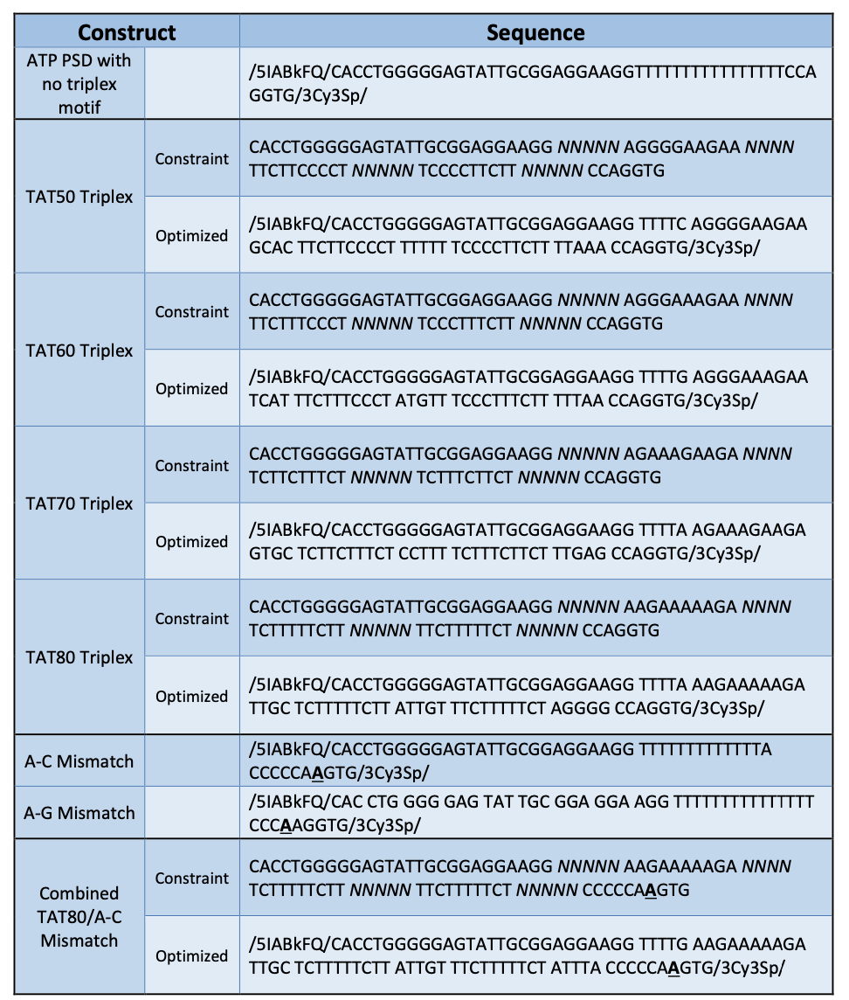

- 表S1：Sequences of all constructs used in this work. Bases in italics signify unconstrained bases for optimization in Nupack. Bolded and underlined bases signify DS mismatches. /5IABkFQ/ represents the 5' Iowa Black FQ quencher modification. /3Cy3Sp/ represents the 3' Cy3 fluorophore modification.

#### Sequence optimization. 序列的优化

To minimize unintended secondary structure created by inserting the triplex motif into the PSD construct linker domain, we structured our construct to contain two five-nt spacers, and optimized these spacer sequences along with the triplex loop sequences using the NUPACK tubesdesign algorithm20. Construct sequences were constrained to be of the form:

- 5′-(ATP aptamer)-N5-(Triplex)-N4-(Triplex)*-N5-(Triplex)′-N5-(DS)-3′. 

- Where the constituent sequences are:
   			
  - (ATP Aptamer): 5′-CACCTGGGGGAGTATTGCGGAGGAAGG-3′.
  - (DS): 5′-CCAGGTG-3′ for triplex constructs, and 5′-CCCCCAAGTG-3′ for bandpass constructs.
  - (Triplex): Various 5′-RRRRRRRRRR-3′ sequences, where R = A or G, with selected bases forced to A or G based on desired % TAT content.
  - (Triplex)* and (Triplex)′ are, respectively, the reverse-complement and complement of the (Triplex) sequence.

The secondary structure optimization target was formation of a seven-nt hairpin between the 5′ end of the ATP aptamer and the DS, and a ten-nt hairpin between the (Triplex) and (Triplex)* sequences, with all other regions forming unpaired loops. Target secondary structure and resulting secondary structures after optimization are shown in Supplementary Fig. 8. The N4 and N5 regions were then optimized under solution conditions of 1 μM construct, 50 mM Na+, and 6 mM Mg2+ at 25 °C, with a stop condition of 5% ensemble secondary structure defect. Not all constructs reached the desired stop condition. In these cases, multiple design outputs were compared and the design with lowest minimized ensemble defect was selected. The final constructs obtained through optimization, as well as the sequence constraints used in optimization, are given in Supplementary Table 1.

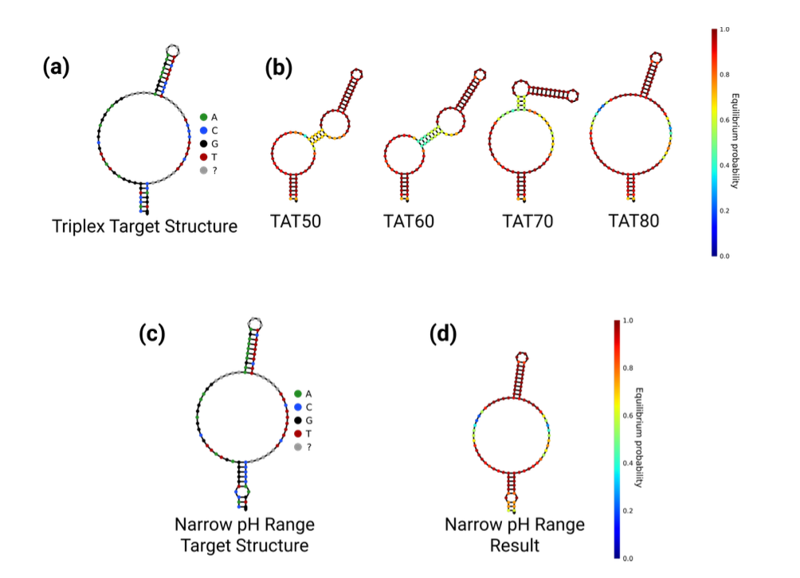

- 图S8：Secondary structure optimization results for triplex sequences. **(a)** The target secondary structure for our triplex-based PSD design was set to achieve DS hybridization to the aptamer and to allow for duplex formation between two strands of the intramolecular triplex motif. Random regions (gray bases) were optimized to minimize unintended interactions between the linker motif and aptamer. **(b)** Resulting structures of the four triplex-based PSD constructs obtained through optimization closely match the target structure, with minimized interference between the triplex motif and aptamer. **(c)** Target secondary structure and **(d)** resulting optimized secondary structure for the narrow pH range construct. All optimized structures shown were obtained through simulation in the NUPACK web application using conditions [Na+] = 50 mM and [Mg2+] = 6 mM at 25 °C.2

#### Binding affinity measurements. 

To ensure consistent sodium ion content between all pH values, we formulated a universal binding buffer （10 mM Tris-HCL， 10 mM Bis-Tris, 10 mM sodium acetate, 6 mM MgCl2, 0.01% sodium azide） adjusted to pH 8.55 with sodium hydroxide. We then adjusted individual aliquots of buffer to the desired final pHi （4.5-8.5, increments of 0.5） with hydrochloric acid. To obtain binding curves, we prepared 50 μL samples of 250 nM aptamer in buffer at each pH, then added 5 μL of ATP in nuclease-free water to bring the final ATP concentration into the range of 0–7.5 mM. Mixtures of aptamer and target were incubated at room temperature for 30 min. Fluorescence was measured on a Synergy H1 microplate reader (BioTeK) with Cy3 excitation (538-nm center wavelength, 63-nm bandpass width) and emission (590-nm center wavelength, 35- nm bandpass width) filters and extended dynamic range measurement. All measurements were taken in triplicate.

#### Analysis of pH-dependent binding properties. 

All data analysis was performed in GraphPad Prism 8.0.2. Raw triplicate Cy3 fluorescence (FCy3) vs. ATP con- centration ([ATP]) data for each construct and pH combination were fit to a Langmuir isotherm binding model of the form:

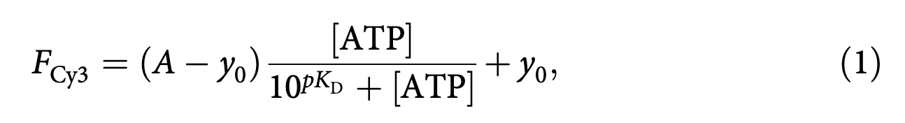

where pKD = log10(KDeff)  is used to extract the binding affinity of the construct at the given pH, y0 is the background signal from the construct at ［ATP］ =0, and A is the maximum signal from the construct at saturating target concentration. We corrected for small variations in aptamer concentration between different pH binding curves for the same construct, as well as pH dependencies in fluorophorequencher system intensity between pH conditions, by normalizing all binding curves to their maximum saturated signal （A）. Normalized binding curves were produced by correcting all data to FNorm = Fcys/A,followed by replotting with a Langmuir isotherm fit that was normalized by the same factor A. Binding affnities are reported as the best fit value with 95% confidence interval upper and lower bounds from fitting.

The pH-dependent properties of each construct were quantified by evaluating changes in the dissociation constant pKD =log10(KDeff)  as a function of pH. When fitting to this data, we used the standard error of the pKD extracted from the Langmuir isotherm ft to each construct/pH condition as the standard error for each corresponding data point. We fit pH-dependence curves with the functional form：

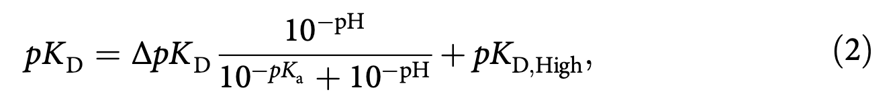

where pKa is the transition midpoint of the construct’s pH response, and is reported as the best fit values with 95% confidence interval upper and lower bounds from fitting. Then we extracted the properties of our construct in terms of dissociation constants based on the following relationships:

Based on these calculated values, ΔKDeff serves as a measure of the fold change in pH response over the functional range.

#### Reporting summary. 

Further information on research design is available in the Nature Research Reporting Summary linked to this article.

#### Analysis of pH-titration data for triplex constructs.

All data analysis was performed in GraphPad Prism 8.0.2. Normalized triplicate Cy3 fluorescence (FCy3) vs. pH data with [ATP] = 0M for each construct was extracted from the normalized data used in the binding curve analysis presented in Methods. Folding data (in RFU) for each construct was then normalized fit to the range 0 to 1, and was fit with a Langmuir isotherm binding model of the form

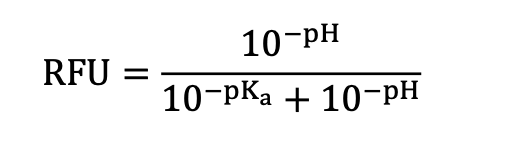

To extract pKa values.
