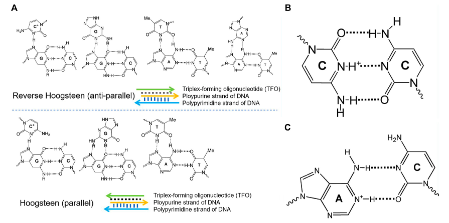
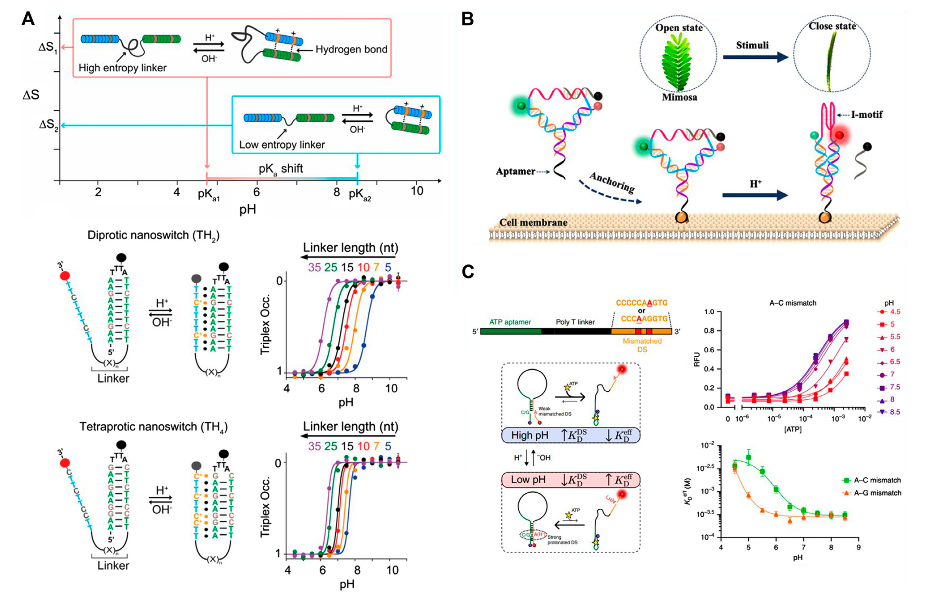

pH-Responsive DNA Motif: From Rational Design to Analytical Applications

pH响应性的DNA motif：从合理设计到分析应用

### Abstarct

由于pH响应的DNA motif的高可设计性、以及DNA化学的多功能性，其引起了人们的广泛关注。

- 这种DNA motif 通常基于 由于存在**特定的质子化位点**而表现出pH响应特性的DNA二级结构。

在这篇综述中，我们简要总结了基于二级结构的pH响应性DNA motif，包括：

- 三链DNA
- i-motif
- 基于A+-C错配碱基对的DNA器件。

最后，还讨论了pH响应性DNA motif 的挑战和前景。

Keywords: pH-responsive, DNA molecular devices, triplex DNA, i-motif, A+-C mismatch

### Introduction

DNA作为生物体遗传信息的主要载体，已被广泛研究 (Zhang and Seelig, 2011; Lu et al., 2013)。

- 由于其热力学可编程性、高结构特征、易于合成以及可能与大量分子和纳米器件结合，DNA在设计各种分子器件方面具有巨大潜力，其应用范围覆盖从分子传感器到治疗工具 (Ablasser, 2021; Kremarová et al., 2021)。
- 由于这些关键特性，功能化的DNA器件已经得到了研究。精确定义其操作特性，特别是灵敏度，对于开发基于DNA的分子机器来调节重要的生物过程和感官作用是必不可少的 (Ranallo et al., 2015; Manish et al., 2019)。
- 它们对不同环境刺激的反应敏感性程度，如金属离子 (Collie and Parkinson., 2011)、pH值(Gehring et al., 1993)、光 (Beharry et al., 2011)，和酶活性 (Wickham et al., 2012)，由其折叠结构的大小决定(Simon et al., 2014)。

DNA分子器件是由外部刺激诱导的DNA自组装体，在微-纳米尺度上进行准机械运动（quasimechanical movement），在生物传感、药物递送和生物医学检测领域越来越受到关注 (Kay and Leigh., 2015; Abendroth et al., 2015; Tani et al., 2021)。

- 利用DNA化学的高可设计性和多功能性，几个小组最近开发了基于pH值的DNA纳米器件 (Fu et al., 2019)。**这种功能化的DNA器件通常利用DNA二级结构而发挥作用，这些二级结构由于存在特定的质子化位点表现出pH依赖性。**这些结构包括**三链DNA**、**i-motif** 和**基于A+-C碱基错配的DNA**，如图1所示。

- 图1：不同构象的DNA结构构型。
  - (A) 平行和反平行的三链DNA的不同构型。
  - (B) i-motif DNA中的关键元素C+-C 。
  - (C) pH依赖性DNA motif 中A+-C的质子化中心。

pH响应的特性是高度归因于 **腺嘌呤 (Adenine) 和胞嘧啶 (Cytosine)** 分别在A+-C 错配碱基对、三链DNA、i-motif中的质子化 (Soto et al., 2002)。

不同的物理方法，如核磁共振（Nuclear Magnetic Resonance, NMR）、量热法 (Calorimetry)、X射线纤维 (X-ray fiber)、紫外/可见光谱 (UV/Vis spectroscopy) 和衍射方法，已被用于表征不同DNA结构及其相关 motif 的热力学稳定性（Plum et al. , 1990）、动力学性质（Maher et al. , 1990）和结构特征（Wärmländer et al., 2003）。

本文主要介绍了如三链DNA、i-motif、和A+-C错配的DNA结构的pH依赖的DNA结构，以及他们在生物传感器、活细胞成像和pH响应范围的准确调控等应用。通过对不同pH依赖的DNA结构的研究，我们预计DNA纳米技术及其相关领域将继续快速发展。在基础层面上，进一步的研究应该旨在更好地了解纳米尺度上的构象转化机制。在应用方面，我们预计这些优雅的DNA分子设备中的许多将很快在体内使用。这些进一步的研究可以证实DNA纳米技术在生物学、材料科学、化学和物理学中的力量。

### THE DIFFERENT CONFORMATIONAL PH-DEPENDENT DNA DEVICES

不同构象的具有pH依赖性的DNA装置

#### Triplex DNA Nanodevices 三链DNA纳米器件

最近，三链体核酸因其作为用于开发基于DNA的纳米器件和材料的丰富的“工具箱”的一部分，引起了人们的关注。

- 在1980年代（Singleton and Dervan 1992），DNA基于其单链DNA的特异性碱基互补配对，首次被用于组装纳米结构，并且已经合理地设计了一组复杂的基于DNA的纳米结构。
- 除了基于寡核苷酸的碱基互补配对的双链结构外，双螺旋DNA链和辅助单链延伸段之间也通过Hoogsteen相互作用，被用于形成三链组装体等超分子DNA组装体，称为三链寡核苷酸。
- 双螺旋DNA结构域和单链寡核苷酸结构域之间形成的不同三链结构如图1所示：
  - 包括由C+·G-C, G·G-C, 和 T·A-T 组成的平行三链结构
  - 以及由C+·G-C, G·G-C, T·A-T, 和 A·A-T链形成的反平行三链结构。
- 存在会对三链DNA纳米器件的稳定性产生影响的不同的参数，如三链体结构域中的突变、三链体桥接的数量和种类、pH值以及粘合剂或离子。为了构建复杂和功能化的分子机器，许多团体一直致力于通过控制这些参数来开发操纵重构结构的新机制。

受上述描述的启发，已经设计了一些**pH响应三链体开关**，用于合理调节热力学特性。这种三链体开关通常与三个关键元素结合：

1. 具有pH依赖性的质子化中心C+·G-C, 
2. T·A-T, 
3. 以及将单链的三链体形成链连接到发夹双链结构域的linker。

对于这些关键元素的研究，Mariottini及其同事证明，通过设计连接氢键形成区域的固有的无序结构域，从而调节pH依赖的纳米开关的酸性常数 (pKa) (Mariottini et al., 2019)。 为了研究这一假设，它们设计了一种pH依赖的三链体纳米开关，该开关可以通过单链形成链和发夹双链结构域之间的Hoogsteen相互作用产生分子内三链体构象，如图2A所示。

- 图2：pH依赖的DNA motif 的代表性研究。
  - (A) 具有合理定制pKa的pH三链体纳米开关(Mariottini et al., 2019)。
    - entropy：熵；Diprotic：双质子的；Tetraprotic：四质子的
  - (B) 基于 i-motif DNA的Y形DNA纳米结构(Chen B et al., 2020)。
  - (C) 含有 A+-C 错配碱基对的pH依赖的DNA开关 (Thompson et al., 2020)。

当linker长度缩短时，可以观察到使三链体纳米开关不稳定的pH值的逐渐增加。

简而言之，他们证明了，观察到的pKa的调节很大程度归因于linker长度的一个纯熵函数，这可以通过提高单链形成链中的质子化中心的数量来削弱。

所有这些策略都提供了一种可预测和通用的方法，可以合理地调节合成结构的热力学和动力学，并将其应用范围扩展到具有可逆的pH依赖性的纳米分子器件的设计中，并用于可控的药物递送。

三链体DNA结构在具有刺激响应性的核酸装置的设计中起着关键作用。

- 三链体DNA结构促进了被pH刺激的三链体核酸结构构象所解锁的基于DNA的金属有机框架和负载底物的微胶囊的产生 (Liao et al., 2016; Chen B et al., 2020) 。
- 此外，具有质子化中心和linker的三链体DNA结构的热力学性质调控了pKa。
- 尽管据报道已经在纳米生物技术中应用了三链DNA结构，但未来仍将面临重大挑战。这些初步结果突出了三链DNA在未来纳米医学应用中的重要性。

#### I-Motif DNA Structure I-motif DNA结构

1993年，Gueron及其同事首次报道了i-motif结构 (Gehring et al., 1993)。他们报道了富含胞嘧啶(C-rich)的质子化序列在酸性条件下可以组装成四链结构，而在碱性或中性条件下可以变成单链。利用这一发现，i-motif结构的体内存在已成为研究热点。

- 因此，不同的富C链之间的分子间组装由于它们的自缔合而不能容易被控制。或者，可以将不同的功能化 i-motif DNA 单元放入互锁结构中，以防止 i-motif 不必要的结构间结合，并使其成为生物传感的潜在分子材料。

可调节动态范围的分子生物传感方法的实用性对于理解和控制基本的生物过程非常重要。

- Nesterova及其同事报道了基于核酸i-motif的敏感pH响应传感器的设计策略 (Nesterova and Nesterov, 2014)。通过对i-motif 的合理操作和变构控制元素的协作，他们成功地将总反应范围缩小到0.2 pH，并提供了0.1 pH 单位精度的过渡中点。通过结合过渡范围的可逆性、i-motif折叠导致的自身结合和结合调节这三个重要特征，他们提出的策略可用于pH敏感的DNA装置，并可用于扩展对其他四链结构的操作，并将促进信号系统和人工分子装置的超响应元件的开发。

- 依赖于pH依赖性i-motif，Chen及其同事设计了一种Y形DNA纳米传感器，该传感器可以通过适体（AS1411）的特异性识别，并锚定在肿瘤细胞表面，如图2B所示 (Chen Y et al., 2020)。通过在Y形DNA上标记与pH无关的荧光对，当将锚定的肿瘤细胞 ( anchored tumor cell )置于不同的pH条件下时，可以观察到明显的FRET性能。
  - 在酸性溶液中，富含C的单链可以折叠成 i-motif 结构，FRET受体被激发。
  - 在中性条件下，i-motif 被打开，猝灭链显著降低了背景FRET信号。Y形DNA传感器显示出0.5个单位级的明显的差距很小的pH响应范围，可以感知肿瘤细胞的细胞外pH值的微小变化。
  - 随着这些进展，含有Y形 i-motif 的传感器成功地应用于MCF-7细胞的传感，并显示出可视化荧光数据。
  - 所设计的pH依赖性 i-motif 传感器具有用于癌症的早期诊断的潜力，并可用于证明与细胞外pH相关的细胞生理过程。

- 在过去的几年里，Yamuna的团队使用基于 i-motif 结构的DNA纳米器件作为pH传感器，绘制了活细胞和整个生物体内pH的时间和空间变化图
- 经过适当的修改，这种方法也可以用于探索细胞内吞途径 (Surana et al., 2011; Modi et al., 2013)。
- 这些研究对DNA纳米技术的未来至关重要。我们可以设计更多的基于 i-motif 结构的分子器件，这些器件可用于癌症的早期诊断、活细胞中的分子操作和药物递送。

#### A+-C Mismatched Base Pair-Based pH-dependent DNA Nanostructure 基于A+-C错配碱基对的pH依赖的DNA纳米结构

pH依赖的DNA纳米器件为各种不可或缺的应用奠定了基础，这些应用完全基于DNA三链体和 i-motif 的结构。这两种结构在接近中性的溶液中都是解离的，并且由于质子化位点的存在，其在酸性溶液中是稳定的。然而，要使它们具有pH依赖性，必须遵守严格的序列要求，这极大地限制了pH依赖的DNA的应用。基于 i-motif 的pH依赖的DNA纳米结构需要富含C，而具有pH依赖性的三链体DNA纳米结构需要既不是多嘧啶也不是多嘌呤。设计通用的DNA序列的能力将帮助我们更多地了解DNA的物理化学性质，并创造更多的应用。

为了解决上述限制，早在1992年，就提出来基于非完全互补的双链DNA结构域中A+-C碱基对和互补链的竞争结合。

- 腺嘌呤和胞嘧啶在中性溶液中是非完全互补碱基对 (Boulard et al., 1992) 。
- 但在酸性条件下（例如pH=5.0），腺嘌呤被质子化，然后与胞嘧啶杂交，形成 A+-C 错配碱基对。
- 在接近中性的条件下（例如，pH=8.0），A+被去质子化，A+-C对离解。
- 然后，使用基于 A+-C 错配碱基对的器件可以合理设计可编程的pH响应的DNA设备，如图2C所示 (Siegfried et al., 2010; Thompson et al., 2020) 。

Fu及其同事报道了一个通用原理，该原理不适用于三链体，而适用于i-motif形成的pH响应的DNA序列设计（Fu et al.，2019），其中结合平衡的变化可以由外部溶液环境的pH值控制。

- 为了证明这一机制，他们首先设计了一条长度为20 nt 的DNA链M，相应的发夹链含有错配的碱基对，以破坏形成MH5的发夹结构的稳定。
- 当溶液的pH值为8时，MH5的发夹结构被打开并与M杂交，产生完全匹配的、连续的、17bp长的DNA双链体。
- 当溶液的pH值为5时，MH5的悬垂单链延伸段可以杂交回来形成发夹结构并置换链M。
- 在工作的最后，他们将设计原理应用于杂交链式反应（Hybridization Chain Reaction，HCR），这是一种常见的信号放大方法。他们的策略为基于DNA的纳米机器的广泛潜在应用开辟了新的途径，并为体内的核酸结构提供了新的思路。

利用基于A+-C碱基对的DNA结构的高度通用性和可编程性，将其与其他DNA二级结构相结合，将产生一组pH依赖的DNA纳米器件。这些结构在异常的pH环境中设计核酸的相互作用或折叠时被考虑到，极大地促进了DNA纳米器件在生物医学检测和DNA纳米技术领域的发展。

### CONCLUSION

在这篇综述中，我们总结了最近对pH响应性的DNA motif 的研究，包括基于DNA三链体、i-motif 和 A+-C 错配碱基对的DNA结构。

- 通过合理调节主要元素并利用pH敏感结构的物理化学性质，这些设备的应用可以广泛用于生化检测和动态调节pH响应范围。
  - DNA装置条件的变化可能导致pH依赖的核酸结构的打开和关闭状态之间的构象变化。
  - 除了直接调节之外，pH值还可以通过生物催化反应来提供燃料；例如，尿素酶 (urease) 或葡萄糖氧化酶（Glucose Oxidase , GOx）已分别在尿素 (urea) 或葡萄糖 (glucose) 的存在下用于激发碱性或酸性水溶液的产生 (Grosso et al., 2015; Gao et al., 2018) 。
- 尽管有报道称在将pH响应的DNA motif 从合理设计发展到分析应用方面并取得了成就，但也可以预见未来的一些重要挑战。
  - 例如，基于pH敏感的DNA的一维到三维纳米结构的自组装可以产生刺激响应性的、可重构的纳米器件，作为可切换的催化存储器或新型药物载体。
  - 将这些DNA纳米结构修饰成单细胞，并使用DNA三链体、i-motif 结构和 A+-C 错配碱基对作为调节细胞间功能的功能单元将变得越来越重要。

