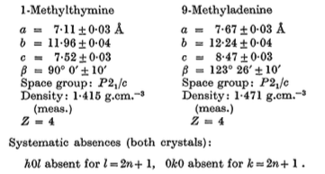
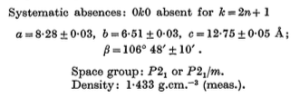
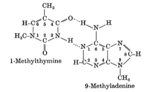
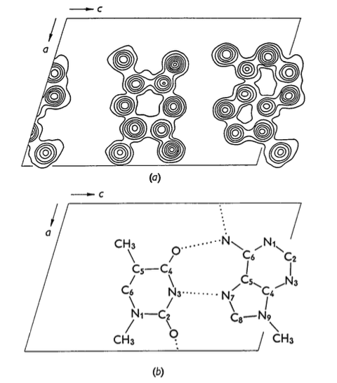

## 1959_The structure of crystals containing a hydrogen-bonded complex of 1-methylthymine and 9-methyladenine.

包含1-甲基胸腺嘧啶（T）和9-甲基腺嘌呤（A）形成的氢键复合物的晶体的结构

### Introduction

Watson&Crick（1953）为脱氧核糖核酸（DNA）提出的双链螺旋构型的一个基本结构特征是：嘌呤和嘧啶碱基在腺嘌呤-胸腺嘧啶和鸟嘌呤-胞嘧啶的氢键对中的排列。作为该研究所正在进行的核酸结构的研究计划的一部分，我们一直对制备和测定含有这些碱基的氢键对的晶体结构的可能性感兴趣，以此来确定这种排列的存在，并提供对分子尺寸和氢键方式的直接实验测定。即使可以得到含有胸苷 (thymidine) 和腺苷 (adenosine) 的氢键对核苷的晶体，它们也无疑是如此复杂，以至于无法对其结构进行令人满意的测定。使用简单的碱基 (胸腺嘧啶和腺嘌呤) 也是不令人满意的，因为在它们中分别有氮原子1和9，它们在核苷中附着在糖脱氧核糖 (sugar deoxyribose) 上，可以自由地形成其他氢键，这可能导致DNA中可能存在特殊的氢键结构，从而导致DNA形成非常不同的结构。最理想的晶体似乎是由胸腺嘧啶和腺嘌呤的衍生物组成的晶体，其中相应的 1 和 9 的氮位置被最简单的有机基团，即甲基 (methyl) 所阻断 (blocked)。我们现在已经制备了含有1-甲基胸腺嘧啶和9-甲基腺嘌呤这两种化合物的氢键对的晶体，并确定了氢键的分子排列和方式。

### 1-Methylthymine and 9-methyladenine

通过在室温下蒸发水溶液获得1-甲基胸腺嘧啶的晶体。晶体呈棱柱形，以{100}和{111}形式为主。在类似条件下生长的9-甲基腺嘌呤的晶体表现为针状，其中形式呈{010}、{110}和{001}的发育良好，c轴平行于晶体的针状轴。在Cu Ka（λ=1.5418）辐射条件下，拍摄了rotation和Weissenberg照片，确定了这两种化合物的空间组织和晶胞 (unit-cell) 尺寸。晶体学数据如下表所示。

### 1-Methylthymine-9-methyladenine complex

将等分子量的1-甲基胸腺嘧啶和9-甲基腺嘌呤溶解在热水中。在室温下冷却并蒸发至干后，获得了针状物轴平行于b结晶轴的单斜针状物形式 (monoclinic needles) 的良好晶体。其中形式｛001｝和｛100｝占主导地位。根据rotation和Weissenberg照片确定的晶体图形数据为：

对溶解在0.1N HC1中的晶体的紫外吸收光谱的测量表明，它们同时含有1-甲基胸腺嘧啶和9-甲基腺嘌呤。围绕b轴拍摄的零层、第二层和第四层Weissenberg照片上的强度分布彼此非常相似，第一层和第三层照片上的密度分布也是如此。此外，在围绕c轴拍摄的零层Weissenberg照片上记录的0k0反射都非常强烈。这些观察结果表明，该结构是层状结构，并且原子非常靠近（010）平面。基于晶体学数据的计算得到：每个"晶胞中两个不对称单元"的分子量为286。这与1-甲基胸腺嘧啶和9-甲基腺嘌呤（289）的组合分子量非常一致。

假设空间组织是P21/m，所有的碳、氮和氧原子都位于镜面中。h0l和h1l强度数据用于计算广义锐化矢量密度图。这个向量密度图被解释为一个不对称单元，由一个1-甲基胸腺嘧啶分子和一个9-甲基腺嘌呤分子组成，以沃森和克里克在他们提出的DNA结构中假设的方式由氢键连接在一起。

第一个实验结构具有良好的氢键和分子堆积。其结构特征及其与向量密度图的良好吻合，有力地证明了该实验结构是正确的。然而，反复尝试提炼这种结构的原子坐标都没有成功。

由于第一个实验结构无法提炼，于是对广义投影进行了更严格的审查，并更加强调某些虚假峰以及被认为代表原子的峰的高度的相对较大的变化的重要性。通过改变不对称单元的9-甲基腺嘌呤部分中几个原子的位置，最终发现了正确的结构。正确结构的广义电子密度投影如图1所示。

- 图1：(010) 平面上的结构的广义电子密度投影。
  - (a) 中的轮廓线是在任意等距水平上绘制的。
  - (b) 中的虚线表示文本中描述的氢键。

它与第一个实验结构的根本不同之处在于9-甲基腺嘌呤相对于1-甲基胸腺嘧啶的取向。9-甲基腺嘌呤的氨基仍然通过氢键连接到1-甲基胸腺嘧啶的C4,上的氧原子，但是1-甲基胸腺嘌呤的氮原子 N3 连接到9-甲基腺嘌呤的 N7 而不是 N1 。通过对h0l和h1l数据的最小二乘处理，对新结构进行了无困难的改进；目前的分歧指数R为16.4%。

在分子平面中，相邻的碱基对通过9-甲基腺嘌呤的氨基和连接到1-甲基胸腺嘧啶的 C2 上的氧原子之间的额外氢键结合在一起。这一结构的进一步完善正在进行中。