Programmable pH-Triggered DNA Nanoswitches

可编程的pH触发的DNA纳米开关

### Abstract

我们设计了可编程的基于DNA的纳米开关，其关闭/打开可以在特定的不同pH窗口触发。这些纳米开关通过pH敏感的平行Hoogsteen相互作用形成分子内三链DNA结构。我们证明，**通过简单地改变开关中TAT/CGC三链体的相对含量，我们可以在超过5个pH单位的范围内合理地调节它们的pH依赖性。**设计具有可调节的pH依赖性的基于DNA的开关的能力，为设计对pH变化具有前所未有的广泛灵敏度的pH纳米传感器提供了机会。例如，通过在同一溶液中混合三个具有不同pH灵敏度的开关，我们开发了一种pH纳米传感器，可以精确监测超过5.5个pH单位的pH变化。这些pH触发的纳米开关具有快速响应时间（<200ms）和高可逆性，特别适用于从对体内pH变化的实时监测到pH敏感的智能纳米材料的开发等应用。

### Introduction

自然界通常使用用于精细调节pH的生物分子来调节和调整许多生物的活性 (1)  ，从酶催化 (2) 到蛋白质折叠， (3) 膜功能， (4) 和细胞凋亡。 (5) 出于这些原因，开发能够对特定pH变化做出响应的探针、开关或纳米材料，被证明对体内成像、临床诊断和药物递送等领域的多种应用有用（6-8）通过利用DNA化学的高度通用性和可设计性 (9-19) , 几个小组最近开发了pH触发的基于DNA的探针或纳米器件。 (20-30) 这种探针通常利用由于存在特定的质子化位点而表现出具有pH依赖的DNA二级结构。这些结构包括I-motif、 (21-23, 26, 29, 31) 分子间三链DNA、 (25, 28, 32) DNA镊子、 (20) 以及最近的A-motif。 (33) 尽管其中一些基于DNA的纳米器件具有有前途和有利的特性，包括快速响应时间和多个周期的持续效率，但有一个缺点不可避免地影响了它们的性能：它们都在通常跨越1.5–2个pH单位的固定pH窗口内做出反应 (例外 (33a)) 。 (26, 34, 33b) 因此，这些纳米器件不能适于在这些固定pH窗口之外提供有用的输出。

在这里，我们描述了一种合理设计和编程pH触发的基于DNA的纳米开关的方法，该纳米开关的pH依赖性可以在超过5个pH单位的范围内进行微调和编辑。我们利用三链DNA中的平行Hoogsteen (T,C)-motif 的良好pH敏感性创建了我们的开关。 (34-36) 为此，我们设计了一种基于DNA的三链体的pH触发纳米开关，该开关由双分子内发夹组成，该发夹通过Watson–Crick（W–C）和平行Hoogsteen相互作用稳定（图1）。

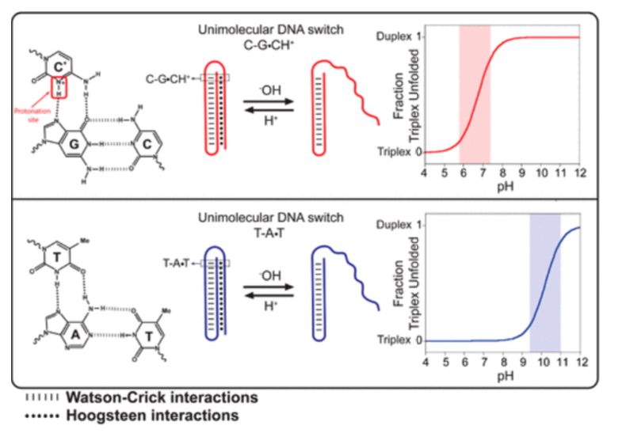

- 图1：可编程的基于DNA三链的pH触发纳米开关，通过形成 W–C（虚线）pH不敏感发夹和第二个Hoogsteen（点）pH敏感发夹形成分子内三链结构。
- 因为它们需要第三链中胞嘧啶N3的质子化（左上），所以CGC三链体仅在酸性pH下稳定（三链体结构中质子化胞嘧啶的平均 pKa≈6.5 ） (35) 。
- 因此，仅包含CGC三链体的三链开关应在微酸性pH下展开为双链构象。
- 底部：相比之下，由于胸腺嘧啶 (thymine) (p*K*a ∼ 10)的去质子化，仅包含TAT三链体的三链开关应该在更高的pH下展开（39c）

更具体地说，三链纳米开关的一个发夹是由两个10碱基互补部分的W-C杂交形成的，它们被一个5碱基环分开。然后，这种双链DNA能够通过开关另一端的Hoogsteen平行相互作用形成第二个发夹，从而形成三链结构（图1）。 (37) 对我们的工作来说，重要的是，虽然W–C碱基配对对pH几乎不敏感， (34) 但Hoogsteen相互作用显示出强烈且可变的pH依赖性。 (34-36) 更具体地说，CGC平行三链体需要第三链胞嘧啶N3的质子化才能形成 (三链结构中质子化胞嘧啶的平均 pKa≈6.5 (35, 38)) （图1，顶部）。相反，TAT三链体在中性pH下相对稳定，仅在pH高于10时由于胸腺嘧啶 (thymine) (pKa～10) (39c) 的去质子化而不稳定（图1，底部）。为了跟踪开关的三链部分的打开/闭合，我们用荧光团/猝灭剂对进行标记。更具体地说，荧光团在DNA序列的一端偶联，并且猝灭剂被内部插入发夹双链DNA的环中，使得三重链到双链的转变（展开）使荧光团远离猝灭剂并增加观察到的荧光信号（图2）。

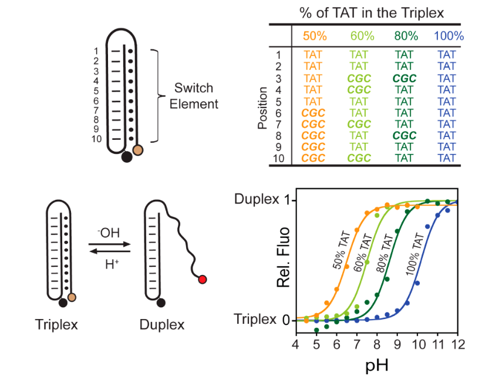

- 图2：
  - 顶部：三链pH纳米开关可以合理编程，在特定的pH窗口内触发。
  - 三链相互作用的pH敏感性可以通过改变开关元件的CGC与TAT的含量来调节，从而允许调节发生三链到双链转变的pH窗口（底部，右侧）。
  - 例如，仅包含TAT三链体（100%TAT，蓝色曲线）的开关的打开在碱性pH（9-11）下触发，而具有50%TAT含量的开关的三链体结构（50%TAT，橙色曲线）在酸性更强的pH范围（5-7）下展开。
  - TAT含量在50%和100%之间的开关显示出中等的pH敏感性。
  -  显示的是在25°C的通用柠檬酸盐/磷酸盐/硼酸盐缓冲液（41）中获得的三链纳米开关（浓度为20 nM）的pH-滴定曲线（底部，右侧） (41) 。
  - 通过插入5′端的pH不敏感荧光团（Alexa Fluor 680）和位于开关内部的猝灭剂（黑洞猝灭剂2，BHQ-2）监测三链到双链的转变。
  - 我们注意到，W–C稳定的发夹在所研究的宽pH范围内保持折叠（图S3）。

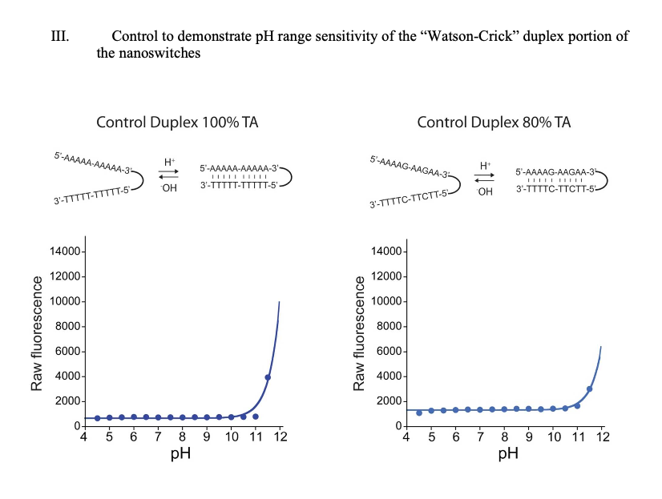

- 图S3：
  - 在本研究中研究的所有pH窗口中，开关的Watson-Crick双链部分保持闭合。
  - 为了证明这一点，我们设计了两个对照探针，它们只包含开关的双链部分，其中TA碱基对的含量为100%和80%。
  - 正如预期的那样（已知AT和GC Watson-Crick碱基配对对pH相对不敏感），从双链态到无规螺旋态的展开转变仅在非常高的pH（>11.5）下开始发生。
  - 这些pH滴定曲线是在25°C的通用柠檬酸盐/磷酸盐/硼酸盐缓冲液（Oüstling和Virtama，1946）中使用20nM的纳米开关进行的。

我们注意到，这项工作中使用的荧光团（Alexa Fluor 680）在宽pH窗口内对pH不敏感（图S1）（40）

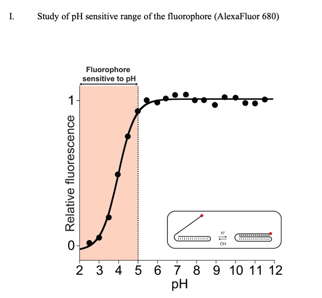

- 图S1：
  - 为了证实本工作中使用的荧光团（AlexaFluor 680，AF680）对pH触发的三链纳米开关所覆盖范围内的pH不敏感，我们设计了一种仅包含荧光团（在3'端）的参考探针（见材料和方法部分的序列）。
  - 该荧光团被定位在所有其它开关中的相同位置。
  - 这种AF680的荧光强度在pH 5至pH 12之间保持恒定，这也是我们的纳米开关表现最好的pH范围。

我们基于DNA的三链纳米开关对pH值敏感。我们首先测试了一个开关，该开关包含相等分布的TAT和CGC三元组（50%TAT）（图2，橙色曲线）。正如预期的那样，在非常酸性的pH值下，分子内双发夹三链结构是有利的，并且我们观察到非常低的荧光信号（荧光团和猝灭剂非常接近）。当我们增加溶液的pH时，三链结构不稳定，并且我们观察到三链到双链转变（展开）的荧光信号特征逐渐增加。该三链纳米开关的半质子化时的pH（此处定义为pKaobs，即由于几个相互作用的质子化位点而产生的平均pKa）为6.5。

我们可以通过简单地改变序列中CGC/TAT三链体的相对含量，在超过5个pH单位的窗口内调节开关的pH依赖性。例如，当开关元件仅包含TAT（100%TAT，即没有任何CGC）时，三链到双链的转变发生在碱性pH（pKaobs=10.2）（图2，蓝色曲线）。通过用CGC逐渐取代TAT，我们可以精确地编程开关，使其在特定的较低pH下打开。通过在开关元件的序列中用2个CGC替换2个TAT，例如，我们将开关的pKaobs从10.2减少到8.6（80%TAT，图2，深绿色曲线）。在序列中添加四个CGC进一步将pKaobs降低到7.5（60%TAT，图2，浅绿色曲线）。最后，如上所示，CGC与TAT含量相等的开关在微酸性pH（pKaobs=6.5）（50%TAT，图2，橙色曲线）下显示完全打开。序列中CGC百分比含量较高（即20%和0%TAT）的三链纳米开关显示出与CGC含量与TAT（50%TAT）相同的pH依赖性（图S4）。

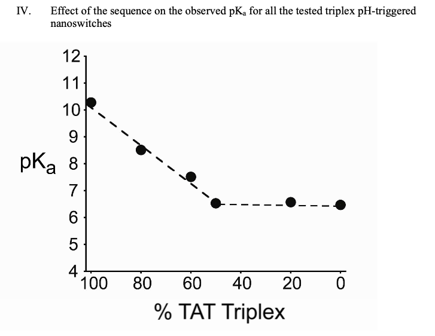

- 图S4：
  - 我们的开关的半质子化时的pH（此处定义为pKaobs，即由于几个相互作用的质子化位点而产生的平均pKa），从结构中不存在胞嘧啶时的10.2（100%TAT）下降到序列中插入五个胞嘧啶时为6.5（50%TAT）（见图2，SI4）。
  - 值得注意的是，CGC含量高于50%（如20%TAT和0%TAT）不会导致不同的pH敏感性（另见图S2）。
  - 使用pH滴定曲线获得观察到的pKa值。

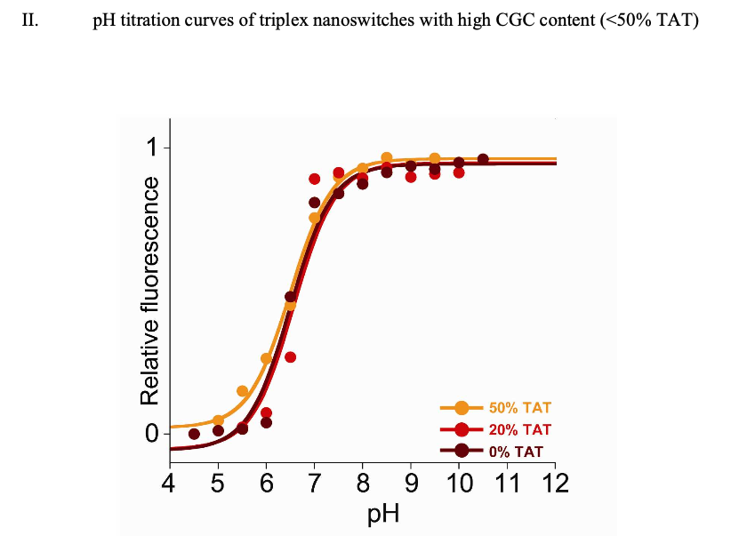

- 图S2：
  - 通过改变我们开关序列中CGC/TAT的相对含量，可以在超过5个pH单位的窗口内调节它们的pH依赖性。
  - 然而，CGC含量高于50%（TAT＜50%）的开关显示出相同的pH依赖性。
  - 例如，这里我们显示了具有50%、20%和0%TAT含量的开关的pH滴定曲线。
  - 这些pH滴定曲线是在25°C的通用柠檬酸盐/磷酸盐/硼酸盐缓冲液（Oüstling和Virtama，1946）中使用20nM的纳米开关进行的。

在不同的TAT/CGC含量下，这种可调节的pH依赖性可能由几个因素解释。在存在低CGC含量（即80%TAT）的情况下，观察到的pKa（8.6）高于游离胞嘧啶（pKa～4.5），这可能是因为对pH不敏感的TAT三联体（pKa～10.2）的主要作用。另一方面，一旦50%的开关由CGC三元组组成（即50，20，0%TAT），其pKa就会达到~6.5的最小值（图S4）。然而，这个pKa值仍然相对高于游离质子化胞嘧啶的pKa，这可能是由于Hoogsteen相互作用（氢键）的形成所提供的稳定性和开关中三链碱基堆叠相互作用的增加（38）

设计具有可调节的pH依赖性的三链纳米开关的可能性为设计对pH变化具有前所未有的广泛灵敏度的pH传感器提供了机会。与大多数基于DNA的pH触发纳米器件的情况一样， (26, 33b, 34) 我们的可编程三链纳米开关显示出一个有限且固定的动态范围（此处定义为开关显示其最大信号的10-90%的pH范围），其跨度约为1.8个pH单位（例如，见图3左侧的50%TAT）。

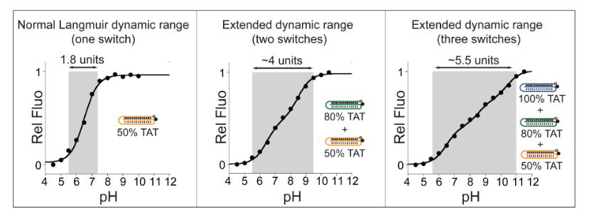

- 图3：通过将两个或多个开关组合在一起，我们可以创建一个显示扩展动态范围的pH传感器。
  - 左图：单个开关显示了一个典型的固定动态范围，约1.8个pH单位（此处50%的TAT只是一个例子，另见图2）。
  - 中间：通过在同一溶液中组合两个开关（即50%TAT和80%TAT），每个开关都在相隔2个数量级的pH窗口上触发 (43) （见图2），我们可以将有用的动态范围扩展到~4个pH单位。
  - 右图：通过在同一溶液中同时使用三种不同的开关（50%、80%和100%TAT），可以进一步扩大有用的pH动态范围（～5.5个pH单位）。
  - 显示的是使用通用柠檬酸盐/磷酸盐/硼酸盐缓冲液和20 nM三链纳米开关总浓度获得的pH-滴定曲线（详见SI）。

反过来，这对应于 81 倍的 [H+] 浓度变化，这代表了单位点结合曲线和 Langmuir 结合曲线固有的经典动态范围窗口（受体占有率从 10% 转移到 90% 的配体浓度范围）。(42) 这种固定的窗口可能会阻碍我们的开关的适用性，因为在更宽的pH范围内的变化需要精确监测。为了克服这个问题，我们建议通过将在不同pH窗口触发的两个或多个开关组合在一起来扩展这个动态范围。 (43)  例如，通过将50%的TAT和80%的TAT开关组合在一起，我们创建了一个pH传感器，其动态范围为~4.0个pH单位（从5.5到9.5）（图3，中心）。当组合80%TAT和100%TAT开关时，也观察到类似宽度的动态范围，但转移到更碱性的pH（从7.5到11.0）（图S5）。

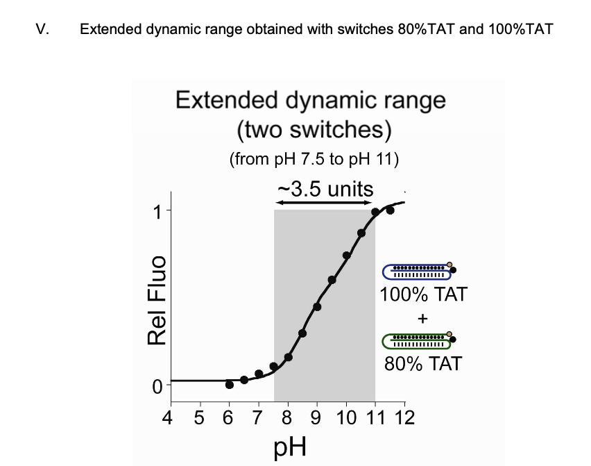

- 图S5：通过在同一溶液中组合两个三链纳米开关，每个开关都在不同的pH窗口上触发，可以将有用的动态范围扩展到 ~ 3.5个pH单位（显示的是在相同溶液中使用80%TAT和100%TAT观察到的响应范围）。所示为使用通用柠檬酸盐/磷酸盐/硼酸盐缓冲液在不同pH值（Oöstling和Virtama，1946）下获得的pH滴定曲线，探针总浓度为20nM。

最后，通过将三个开关（50%、80%和100%TAT）组合在一起，我们创建了一个pH传感器，其动态范围为~5.5个pH单位（从5.5到11.0）。我们的开关对pH值变化的响应以毫秒为单位。我们通过进行停流实验 (stopped-flow) 和测量每个开关在其相关的pH动态范围内的打开/关闭反应速率来证明这一点（图S6–S12）。

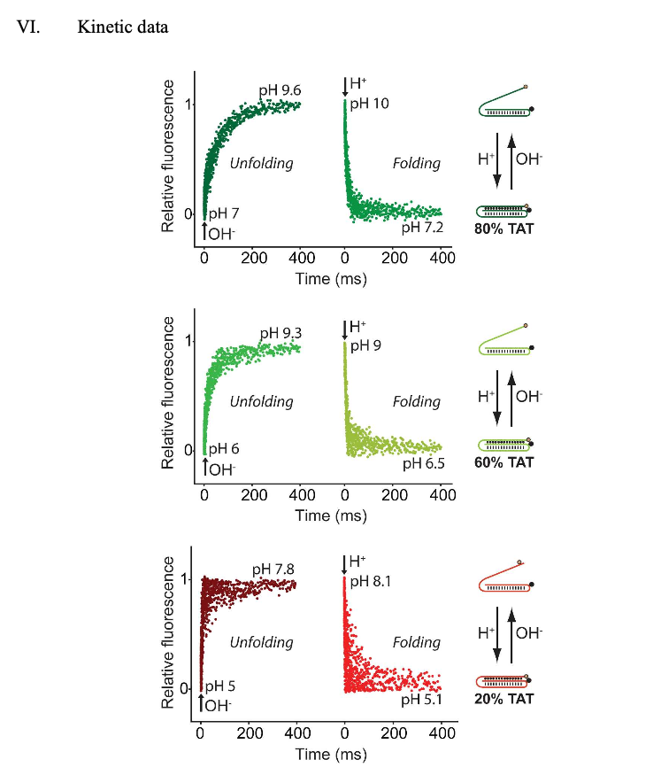

- 图S6：我们的三重pH纳米开关在几毫秒内对pH变化做出响应。
  - 例如，包含80%TAT三元组（顶部）的开关显示61ms的展开时间常数（tunfolding）和13ms的折叠时间常数（tfolding）。包含60%TAT（中间）和20%TAT（底部）的开关甚至显示更快的折叠/展开速率常数（详细速率见表S1）。
  - 该图中所示的实验是通过将缓冲开关溶液（最终开关浓度=100 nM）与溶液快速混合（1:1）来进行的，以获得接近3个单位的pH变化（参见上文的实验细节）。
  - 这里显示的每个动力学轨迹是10次测量的平均值。

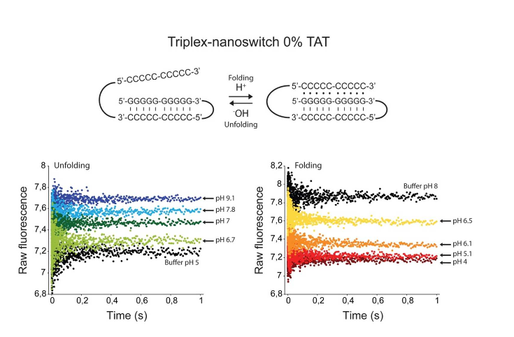

- 图S7：
  - 0%TAT开关在几毫秒内对pH变化做出响应。
  - 对于展开实验（左），首先在通用缓冲液中在pH 5.0下平衡开关（开关完全折叠的条件）。
  - 然后使用与NaOH（0.0075、0.01、0.015、0.02M）的1:1混合实验将pH迅速改变到图中所示的值。
  - 对于折叠实验（右），首先在通用缓冲液中在pH 8.0下平衡开关（开关完全展开的条件）。
  - 然后使用与HCl（0.0075、0.01、0.015、0.02M）的1:1混合实验将pH迅速改变到图中所示的值。
  - 显示的每个动力学轨迹是10次测量的平均值。最终的纳米开关浓度为100nM。

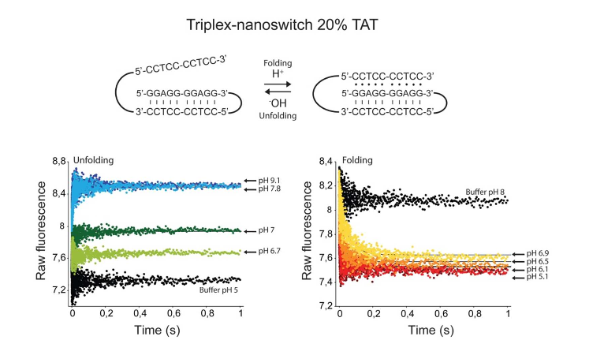

- 图S8：
  - 20%TAT开关在几毫秒内对pH变化做出响应。
  - 对于展开实验（左），首先在通用缓冲液中在pH 5.0下平衡开关（开关完全折叠的条件）。
  - 然后使用与NaOH（0.0075、0.01、0.015、0.02M）的1:1混合实验将pH迅速改变到图中所示的值。
  - 对于折叠实验（右），首先在通用缓冲液中在pH 8.0下平衡开关（开关完全展开的条件）。
  - 然后使用与HCl（0.0075、0.01、0.015、0.02M）的1:1混合实验将pH迅速改变到图中所示的值。
  - 显示的每个动力学轨迹是10次测量的平均值。最终的纳米开关浓度为100nM。折叠和展开速率常数如表S1所示。

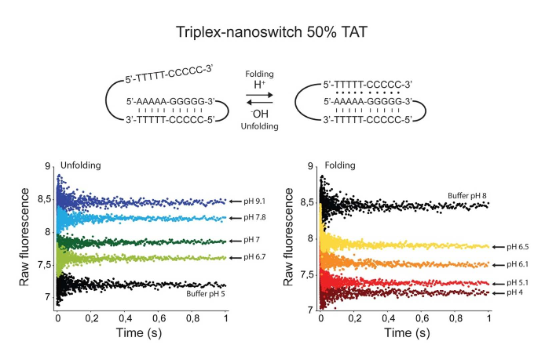

- 图S9：
  - 50%TAT开关在几毫秒内对pH变化做出响应。
  - 对于展开实验（左），首先在通用缓冲液中在pH 5.0下平衡开关（开关完全折叠的条件）。
  - 然后使用与NaOH（0.0075、0.01、0.015、0.02M）的1:1混合实验将pH迅速改变到图中所示的值。
  - 对于折叠实验（右），首先在通用缓冲液中在pH 8.0下平衡开关（开关完全展开的条件）。
  -  然后使用与HCl（0.0075、0.01、0.015、0.02M）的1:1混合实验将pH迅速改变到图中所示的值。显示的每个动力学轨迹是10次测量的平均值。最终的纳米开关浓度为100nM。

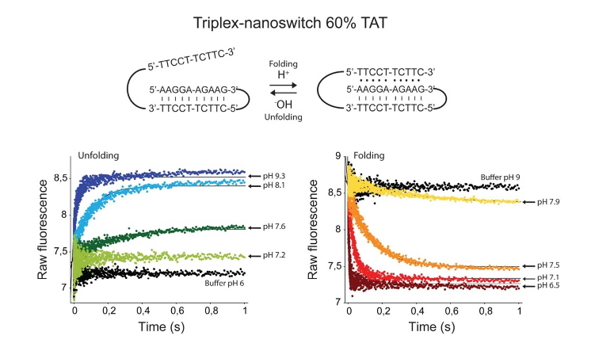

- 图S10：
  - 最终的纳米开关浓度为100nM。
  - 对于展开实验（左），首先在通用缓冲液中在pH 6.0下平衡开关（开关完全折叠的条件）。
  - 然后使用与NaOH（0.005、0.0075、0.01、0.015M）的1:1混合实验将pH迅速改变到图中所示的值。
  - 对于折叠实验（右），首先在通用缓冲液中在pH 8.0下平衡开关（开关完全展开的条件）。
  - 然后使用与HCl（0.005、0.0075、0.01、0.015M）的1:1混合实验将pH迅速改变到图中所示的值。
  - 显示的每个动力学轨迹是10次测量的平均值。最终的纳米开关浓度为100nM。折叠和展开速率常数如表S1所示。

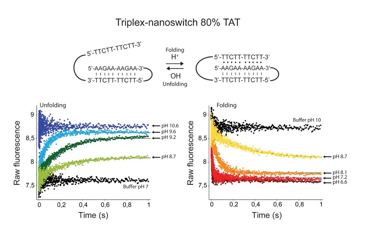

- 图S11：
  - 80%TAT开关在几毫秒内对pH变化做出响应。
  - 对于展开实验（左），首先在通用缓冲液中在pH 7.0下平衡开关（开关完全折叠的条件）。
  - 然后使用与NaOH（0.005、0.0075、0.01、0.015M）的1:1混合实验将pH迅速改变到图中所示的值。
  - 对于折叠实验（右），首先在通用缓冲液中在pH 10.0下平衡开关（开关完全展开的条件）。
  - 然后使用与HCl（0.0075、0.01、0.015、0.02M）的1:1混合实验将pH迅速改变到图中所示的值。
  - 显示的每个动力学轨迹是10次测量的平均值。最终的纳米开关浓度为100nM。折叠和展开速率常数如表S1所示。

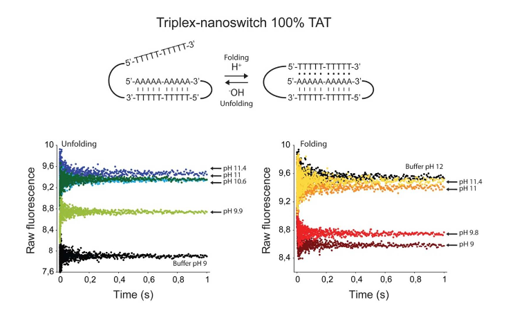

- 图S12：
  - 100%TAT开关在几毫秒内对pH变化做出响应。
  - 对于展开实验（左），首先在通用缓冲液中在pH 9.0下平衡开关（开关完全折叠的条件）。
  - 然后使用与NaOH（0.005、0.0075、0.01、0.015M）的1:1混合实验将pH迅速改变到图中所示的值。
  - 对于折叠实验（右），首先在通用缓冲液中在pH 12.0下平衡开关（开关完全展开的条件）。
  - 然后使用与HCl（0.01、0.015、0.02、0.025M）的1:1混合实验将pH迅速改变到图中所示的值。
  - 显示的每个动力学轨迹是10次测量的平均值。最终的纳米开关浓度为100nM。

所有开关都显示出足够快的打开/关闭动力学（平均时间常数～100 ms），以便实时监测毫秒范围内的pH变化。TAT含量为20%、60%和80%的开关显示出可测量的动力学（见图S6和表S1）。

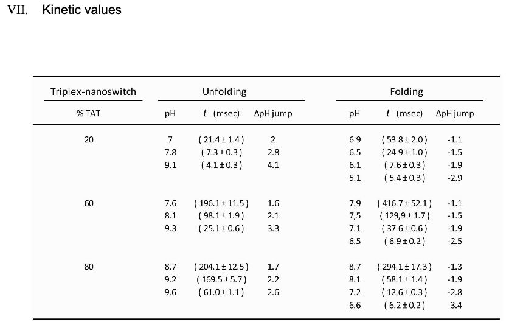

- 表S1：
  - pH跳变后测量的展开（左）和（折叠）速率常数。
  - 只有当 TAT% 含量为 20%、60% 和 80% 的开关时，我们才能观察到以足够慢的速度展开/折叠，以便使用我们的止流混合仪器进行测量（我们仪器的dead时间为 3.2 毫秒）。
  - 对于20%TAT开关，使用从5.0到7.0、7.8和9.1的pH跳变来实验测量展开速率常数。
  - 使用pH从8.0跳变到5.1、6.1、6.5和6.9进行折叠实验。
  - 对于60%TAT开关，使用从6.0到7.6、8.1和9.3的pH跳变来实验测量展开速率常数。
  - 折叠实验是使用pH从9.0跳变到6.5、7.1、7.5和7.9的值来进行的。对于80%的TAT开关，已经使用从7.0到9.6、9.2和8.7的pH跳跃来实验测量展开速率常数。
  - 对于折叠实验，使用从10.0到6.6、7.2、8.1和8.7的pH跳变进行。

相反，含量为0%、50%和100%TAT的开关显示出如此快的动力学（<3ms），以至于它们的折叠/展开转变无法使用传统的停流仪器来确定。开关是可逆的，并且仅在特定的pH窗口内做出响应。为了证明这一点，我们选择了在三个分离良好的pH窗口（20%、60%和100%TAT，见图2和S2）上触发的三个开关，并用一系列循环pH跳变实验对它们进行了测试（图4）。

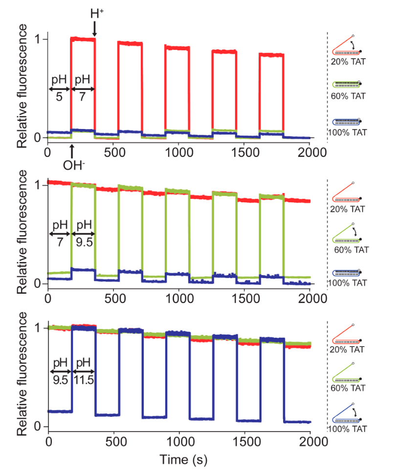

- 图4：三链pH纳米开关显示出高可逆性和无交叉激活。
  - 这可以通过循环改变三种溶液的pH来证明，每种溶液都含有一个开关（20%、60%和100%TAT）。
  - Top: 将pH从5.0循环到7.0（反之亦然）只会激活最不稳定的开关（20%TAT，红线），而对于TAT含量较高的开关（60%TAT，100%TAT），没有观察到显著信号。
  - Center: 7.0到9.5的pH变化导致仅打开/关闭60%TAT开关（绿线）。在该pH窗口内，100%TAT开关（蓝线）保持闭合，而20%TAT开关已经完全打开。
  - Bottom: 当pH溶液在9.5和11.5之间循环时，我们观察到100%TAT（蓝线）的打开/关闭转变，而其他两个开关在该pH范围内已经完全打开。
  - 每种溶液仅包含一个开关（20nM），并且通过加入小等分的3M NaOH或HCl来循环改变溶液的pH。
  - 在这个实验中，我们选择了20%TAT开关而不是50%TAT开关（图2和图3），因为前者显示出略显陡峭的剂量-反应曲线（见图S2），可以更好地防止交叉激活。
  - 随着时间的推移，观察到的荧光信号的小漂移是由于在我们使用的实验条件下荧光团（Alexa Fluor 680）的光漂白（见图S14）。

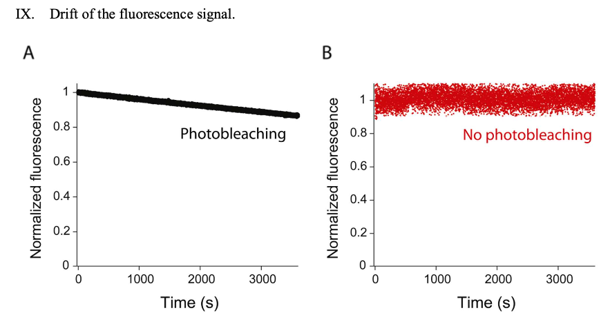

- 图S14：在我们的三链pH触发纳米开关中使用的荧光团，在我们在本工作中使用的实验条件下受到光漂白。
  - Left: 通过连续测量pH纳米开关并使用激发带宽（5nm）和0.2秒的采集时间，我们在大约30分钟后观察到大约15%的信号漂移。
  - Right: 使用小的激发带宽（0.2nm）和0.4秒的采集时间的相同连续测量显示30分钟后没有信号漂移。
  - 该图中所示的实验是使用图S1中使用的参考开关在pH 7.0的缓冲溶液中进行的。

例如，在第一个实验中，将含有开关的三种溶液（每种溶液含有不同的开关）的pH从pH 5.0循环到7.0，再回到pH 5.0，循环五次（见图4，顶部）。在这个pH窗口上，只有20%TAT开关被触发，而其他两个开关（60%和100%TAT）没有给出任何显著的信号变化。在另外两个系列的实验中（图4，中间和底部），我们选择了不同的pH跳变来只触发一个开关。在所有三个实验中，我们观察到开关信号的高可逆性和来自其他两个开关的最小交叉激活。用这些相同的开关进行了类似的实验，但这次是将它们以等摩尔量混合在相同的溶液中。循环改变溶液的pH，一次只打开/折叠一个开关（图S13）。

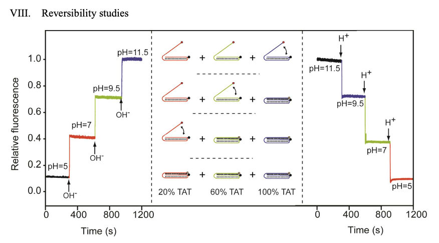

- 图S13：我们的三链pH触发纳米开关的反应是快速和可逆的。
  - 我们通过依次逐渐改变溶液的pH值来证明这一点，该溶液包含在三个不同的pH窗口内触发的三个开关。
  - 在pH 5.0时，所有三个开关都闭合在三重结构中，并且观察到低背景荧光信号。
  - 在pH 7.0时，我们观察到的信号与仅打开20%TAT开关的预期信号相当。
  - 其余两个开关保持三链/闭合构象。将溶液的pH依次增加到9.5和11.5，分别导致60%TAT和100%TAT开关依次打开（绿色和蓝色线）。
  - 使用相同的pH步骤降低溶液的pH，突出了纳米开关的完美可逆性。
  - 该实验在通用柠檬酸盐/磷酸盐/硼酸盐缓冲液（Oöstling和Virtama，1946）中进行，每个开关使用20nM（20%、60%和100%TAT）。
  - 缓冲溶液的初始pH值（pH = 5，左和pH=11.5，右）分别通过加入小等分试样的NaOH和HCl逐渐改变。

正如预期的那样，观察到的荧光变化与单个开关的打开/关闭一致，从而进一步证明了我们的三链纳米开关的可逆性和特异性。

### Conclusion

在这里，我们设计了可编程的基于DNA的三链纳米开关，其折叠/展开可以在特定的pH值下触发。纳米开关形成了分子内三链DNA结构，并利用平行Hoogsteen相互作用的pH依赖性。我们证明，我们可以通过简单地改变序列中TAT/CGC三链体的相对含量来调节这些开关的pH敏感性。例如，具有高CGC含量（≥50%）的开关在pH 约 5.5–6.0的值附近打开，而具有较低CGC含量的开关（<50%）在逐渐更碱性的pH值下打开。例如，不包含CGC三链体（因此仅包含TAT三链体，100%TAT）的开关仅在pH高于10.0时开始展开。设计具有特定的pH敏感性的纳米开关的能力提供了几个优点。例如，可以针对仅需要在特定范围内监测pH变化的特定应用开发和优化开关。同样，我们证明，通过在同一溶液中混合两个或多个开关，每个开关都具有不同的pH灵敏度，我们可以获得具有扩展的动态范围的pH传感器。使用这种策略，我们实现了前所未有的5.5个单位的宽pH窗口，在这个窗口内，这些开关反应强劲。此外，由于其纳米尺寸、快速响应时间（<100ms）和高可逆性，pH触发的三链纳米开关似乎特别适合以下应用，包括实时监测细胞提取物、体内细胞 (8, 18c, 26) 或其他介质中代表健康和病理生物途径中的重要输入的pH变化，其中pH变化。 (44) 例如，由于pH失调是癌症的标志，许多癌症的特征是细胞内外之间的pH梯度倒置， (44) 我们的开关可能对诊断有价值。最后，对DNA链进行编程以在特定的pH窗口内打开/关闭的能力可以在DNA纳米机器、 (45) 药物递送系统、 (46) 和智能纳米材料领域找到许多应用 (47)。
