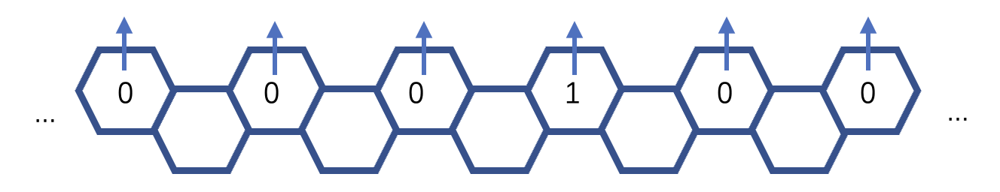
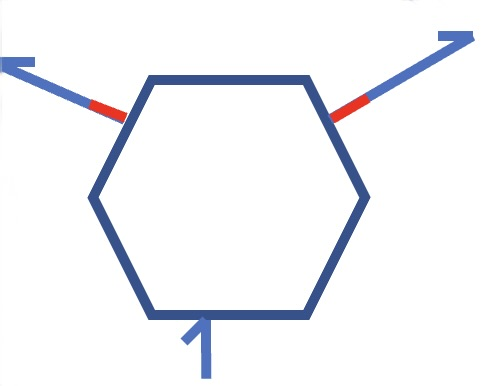
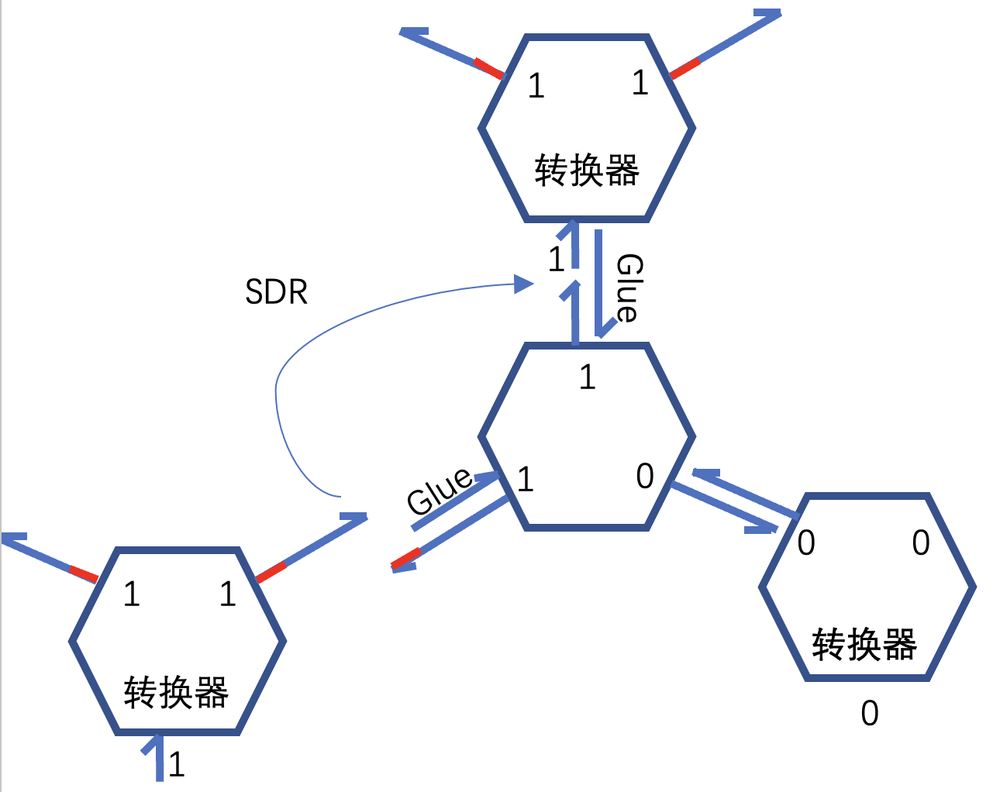
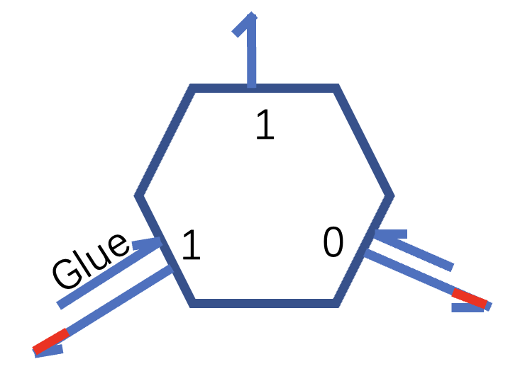
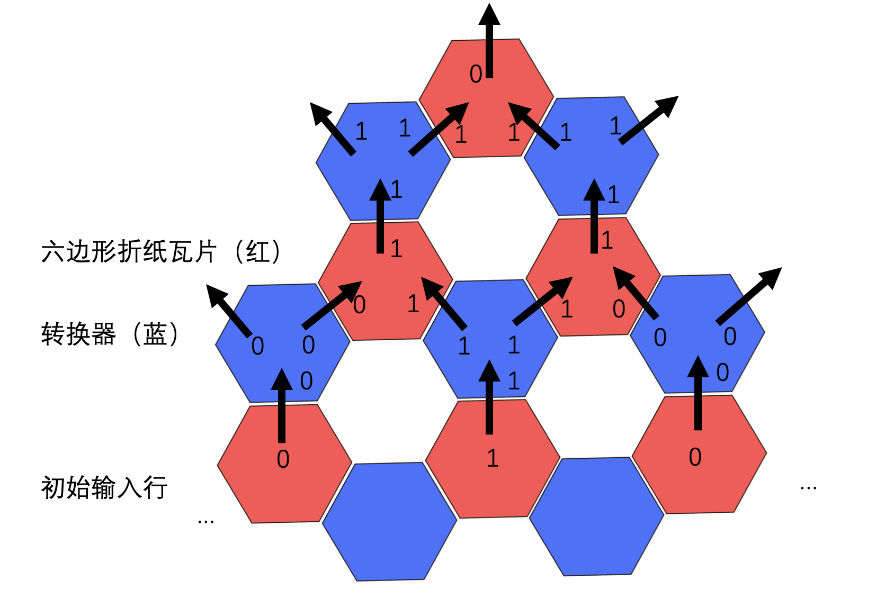

# 验证：六边形折纸聚集

## 所需材料

- M13mp18
- 相应的staple
- Buffer 1：1X TAE，含12.5mM Mg2+
- Buffer 2：1X TAE，含125mM Mg2+

### Step1：溶解干粉并封装staple

1. **沉降：**离心60s，让运输过程中飘散的干粉沉降到管底。离心后轻轻取出
2. **溶解：**加入对应Buffer 1溶解（按试管壁上要求）
3. **混匀：**使用桌面震荡仪震荡数秒，离心
4. **封装staple：**对于两个六边形中的每一个，将所有staple链各取2uL，混合在1500 uL小试管内，得到2管混合母液，震荡离心
5. **做staple配置液：**将上述2管混合母液分别加Buffer 1稀释10倍，震荡离心，制成staple配置液。
6. **做scaffold配置液：**将M13mp18稀释至期望目标浓度

### Step2：计算浓度

通过IMPLEN超微量分光光度计Nanophotometer测量对应的staple配置液与m13配置液的吸光度（ng/uL）:

1. 加入buffer进行空白测试

2. 加入buffer + M13进行3次测量，取中间值（ng/uL）
3. 加入buffer + staple进行3次测量，取中间值（ng/uL）
4. 将测量的ng/uL转换为nMol/L

### Step3：计算反应体系并加样

Cstaple配Vstaple配 = Cstaple终V终

Cscaffold配Vscaffold配 = Cscaffold终V终

V终 = 30 uL 

Cstaple终 = 25 nMol/L

Cscaffold终 = 2.5 nMol/L

Cstaple配、Cscaffold配由步骤2得出

1. **计算体系：**根据n=cv，M13 : staple = 1：10，计算 V配。

2. **加样：**取 100uL PCR管，按计算取样混合，加入 1/10 Vscaffold配 的Buffer 2补充Mg2+，在混合溶液的体积接近30uL的时候，使用Buffer 1进行填充，补充到30uL。
3. **混匀：**混合震荡离心。

### Step4：退火形成折纸结构

1. 最后通过PCR进行直线退火

- PCR程序：95 - 4 - 11h

### Step5：通过原子力显微镜进行结构的观察。

## 结果：观察是否形成中空的蜂巢状折纸。

## 意义：先完成基本的组装，后续进行拓展

# 后续的设想

## 六边形折纸的算法自组装

以异或逻辑为例，涉及到的几个分子组件如下：

- **初始输入行：**

- **转换器：**

- **转换器的作用：**
  - 将上层的计算结果转换到下一层的输入
  - 将结合方式从 “Glue链结合“ 转换为 ”锚链链置换结合“
  - 只有上一层的计算结果置换出Glue链，才能连接下一层的转换器；结合转换器才能得到下一层的输入。从而减少生长中的错误。减少自上而下的自组装
  - 检错：可以对多个Glue链做标记，只有当相应的Glue链都存在时才是正确组装。

- **六边形折纸瓦片：**

- **理想情况下的自组装：**

- **存在的问题：**
  1. 可能需要先加入初始输入行，再加入转换器，接着人工加入相应的Glue链，形成“初始输入行-转换器”复合体（第一行-第二行），之后才能一同加入折纸瓦片和转换器，启动自组装。
  2. 最边缘的转换器存在错配问题
- **可能的优点：**
  1. 可以添加终止条件，即不具有下一层输入的转换器，从而作为停机条件
  2. 六边形折纸足够大，可以绑定发夹、添加荧光剂等，从而使不同类型的六边形具有区分度，而组装而成的结构具有蜂巢状的阵列结构，可以显示输出情况。
